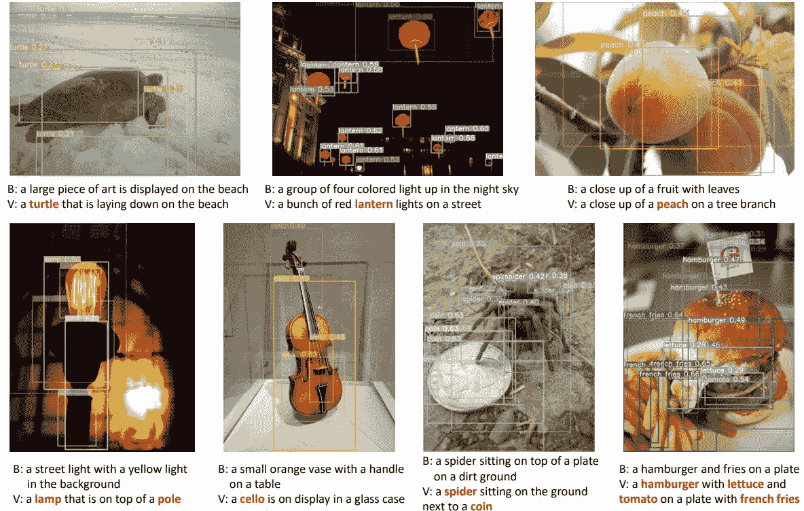

# 第十章：Seeing AI：在移动应用中规模化使用 Azure 机器学习和认知服务

在前几章中，我们已经讨论了如何使用 Azure 机器学习和认知服务。我们向您展示了微软如何运行认知服务，以便扩展到大量用户。但是在实际应用中，这是怎样的情况呢？在利用 Azure AI 服务时，您需要哪种架构？在解决 AI 服务能够解决的问题时，您可以有多大的雄心？

如何实时描述数百万盲人用户周围的世界呢？

本章中，我们将探讨 Seeing AI 应用如何利用 Azure 机器学习和认知服务告知盲人用户他们面前的情况，使用了预建模型和自定义模型的混合，同时在本地和云端运行。

想象这款应用就像一个说话的相机：它可以朗读像标志和标签这样的短文本片段，捕捉和识别像表格和菜单这样更长的文档，甚至识别手写。它可以认出用户认识的人的脸，并描述周围的人；它还可以描述图像中的内容或叙述正在进行的事情，比如某人在公园里踢足球。它可以描述一种颜色，发出声音来描述黑暗或明亮的程度，发出蜂鸣声以帮助用户扫描条形码，获取他们手持盒子或罐头的信息，并在付款时识别不同的银行票据。Azure 上的机器学习服务提供了如图 10-1 所示的描述，并且应用设计了专门为盲人用户的界面来提供这些描述。

###### 图 10-1\. Seeing AI 使用 Azure 机器学习服务识别对象并描述场景

# 自定义和云模型

这涉及到广泛的计算机视觉问题，因此该应用针对不同的情境使用多个机器学习模型，并进行了不同的权衡。

在设备上本地运行机器学习模型可以实时得到结果，理想情况下少于 100 毫秒，或者最多不超过四分之一秒，这意味着用户在听取文本时会获得响应迅速的自然体验。

但是图像描述使用了认知服务中的自定义视觉模型，这些模型无法压缩到设备上运行，更不用说在 Azure 机器学习中训练的多种不同对象识别的多 GB 模型了。虽然往返云端需要一点时间，但能够提供更高的质量。

如果您希望实时将标志或标签读出来，那就需要在手机上运行的模型来完成。但如果您要拍摄文档而不仅仅是拿着手机，可能需要花几秒钟来拍摄好的照片，因此值得花时间将其发送到 Azure，利用云中运行的非常大的模型，以获得更准确的结果。

###### 小贴士

有不同的方式来决定是在本地还是在云中运行模型。Seeing AI 通过让用户选择不同的场景来实现这一点，但在您的应用程序中，您可能会根据因素如互联网连接速度或采取混合方法来做出决策。如果某人带宽有限、连接速度慢或离线，您可以使用本地模型——甚至开始使用小型本地模型为用户提供结果，然后从云端获取更精确或准确的信息。如果这样做，请确保用户界面清楚地说明为什么质量或详细级别会有所不同，以免用户因为有时看到更好的结果而感到困惑。您还需要考虑隐私问题；Seeing AI 发送到 Azure 的图像会安全存储，并以保护用户隐私的方式存储，但它们会离开设备；如果您在受管制行业中，这可能是一个问题，您可能需要坚持使用本地模型——如果您正在向云服务发送内容，您可能需要通知用户这一点。

Seeing AI 中的图像字幕使用认知服务视觉 API，Face API 处理告知用户人物的年龄和性别。对象检测也使用认知服务，一些只需微调的模型使用自定义视觉进行训练。对于一些场景，Seeing AI 使用云中的大型模型，可以识别许多不同的对象，但随着引入更多增强现实场景，这意味着运行经过自定义视觉训练并导出到 CoreML（iOS）和 TensorFlow Lite（设备上最快响应）的模型。

需要进行完全自定义训练的其他模型（如货币和条形码等场景）是在 Azure Machine Learning 中构建的，因为这些与预建对象检测模型训练的日常对象非常不同。训练图像上传到 Azure Blob 存储，使用 GPU 在 Python 中运行训练脚本，然后转换脚本将创建的大型模型压缩成 CoreML 或 TensorFlow Lite 格式。（如果您需要针对自己的应用目标更多平台，可以使用我们在第三章中介绍的 ONNX。）

在选择使用 Azure Machine Learning 中的自定义视觉和自定义对象检测模型之间，不仅涉及到准确性，还涉及到模型的大小。

自定义视觉快速便捷；它比在 Azure 机器学习中构建要少得多，并且一般的对象决策模型（识别人、动物、车辆和其他日常物品）的准确度已经足够高，因此并不值得从头开始只是为了略微提高结果。Seeing AI 团队使用他们的用户需要识别的物品的图像来训练自定义视觉模型，这些是标准对象检测模型可能未经训练的，例如楼梯、电梯、建筑入口和门道。

但另一个因素是模型大小。移动设备上的内存限制限制了模型的大小，像 ImageNet 这样的预训练模型非常通用，并包括用户不太可能经常遇到的事物，如斑马和长颈鹿。将这些内容包含在模型中不会降低 Seeing AI 用户识别所关注事物的准确性，但意味着模型比必要的大。团队正在尝试确定是否值得从头开始训练一个覆盖他们确实需要识别的对象较短列表的模型，例如他们想要导航的建筑物的元素，因为这样可以创建一个特定场景的较小模型。

# Seeing AI 后端

移动 Seeing AI 应用程序的基础架构使用了分布式应用程序的标准云设计模式。无论是认知服务还是任何其他云 API，您都不希望将 API 密钥放在应用程序中；Seeing AI 将这些秘密存储在 Azure Key Vault 中，并使用 Azure AD 处理与 Key Vault 的连接。确保应用程序与其连接的后台服务之间建立可信连接的最简单方法是让用户登录；使用 Azure B2C 可让您使用相同的架构处理用户和管理秘密。这还简化了使用 Azure Web 应用程序或 Azure Functions 进行遥测和分析，或者如果您想缓存结果。

图像和其他请求从应用程序传入 Seeing AI 服务，并分发到其使用的其他服务。后端服务处理多个认知服务的请求，并合并每个服务的结果。这也允许 Seeing AI 对不同区域的认知服务进行负载均衡和路由：您可以使用 Azure Front Door 处理 HTTP 请求，这样可以进行速率限制和 IP 访问控制，或者使用 Azure Traffic Manager 如果您需要路由 TCP 或 UDP 流量。由于该应用程序在许多国家使用，并且需要与用户所在地最近的 Azure 区域通信，因此后端配置为调用最近的认知服务实例（并在不可用时进行故障转移）。后端还使用 Azure Web 应用程序防火墙来阻止恶意行为者可能用来攻击服务的格式错误的 URI。

对于   Seeing AI 不需要这一步，但如果你的后端将被不同的应用程序使用，或者你想提供不同级别的服务，你可以使用 Azure API Management 来对不同的消费者进行速率限制。

# 获取接口的正确性

Custom Vision 和 Azure Machine Learning 模型的速度和准确性使得 Seeing AI 有用，但它们需要包裹在良好的用户体验中才能真正有帮助。残疾人圈里有一个关键短语：“没有我们，不会有我们。”无论你的观众是谁，来自认知服务的结果只有在应用体验对他们有用时才有价值。考虑用户如何与应用互动，以及如何提供他们所需的信息，以提高他们的生产力。

如果你正在使用 Custom Vision 或其他定制或个性化体验的选项，确保你允许用户反馈这些功能的效果，以便你可以继续改进结果。

记住，机器学习本质上是概率性的，而不是通常的“真或假”二元编码。你从机器学习模型得到的结果有置信度值，表示模型对其正确性的确定程度。你需要考虑错误率，并准备在应用中处理置信度水平而不产生干扰。考虑一下如果结果是错误的，你将如何处理用户体验。

Seeing AI 对场景的描述是为了明确这一点，常说如“可能是公园里玩球的狗”。

对于实时场景，Seeing AI 使用阈值，如果物体检测服务提供的结果不符合该阈值，则不使用。但由于用户在使用应用时经常移动，可能会有多个读取结果，因此获取多个观察值可能会让你以其他方式增加信心。你还需要处理这些多个结果：Seeing AI 不会说一个像车的物体刚出现，如果实际上是从不同角度看的同一辆车。

同样，你不希望通过无用的通知或过长的描述来分散用户的注意力。如果进一步的读取显示物体比最初看起来更近或更远，Seeing AI 将更新描述，但不会打断用户告诉他们。

获取用户体验正确的关键是了解你的用户：他们将处于什么样的环境，需要从应用程序中得到什么，以及什么会妨碍他们的使用？在实际体验中会是什么样子，无论是有人在公园散步还是摄像头在监控工厂生产线？这两者都与你编写代码的环境截然不同，因此除了收集多样化的训练图像外，还要确保在真实用户的环境中进行充分的测试，以最大限度地提高你的机器学习模型的结果对他们的实际帮助。

无论你建造应用程序的目的是什么，Seeing AI 是如何在移动应用中使用云 AI 服务的一个很好的例子，包括如何组合云后端来编排这些服务以及何时使用本地模型。顾名思义，它集中于你周围世界中能够看到的内容；在下一章中，我们将讨论如何处理语音。假设你需要在某人说话时不仅转录而且翻译多种语言：你能达到科幻经典——实时翻译系统的多近呢？
