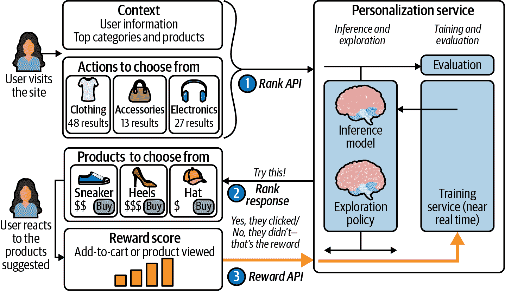
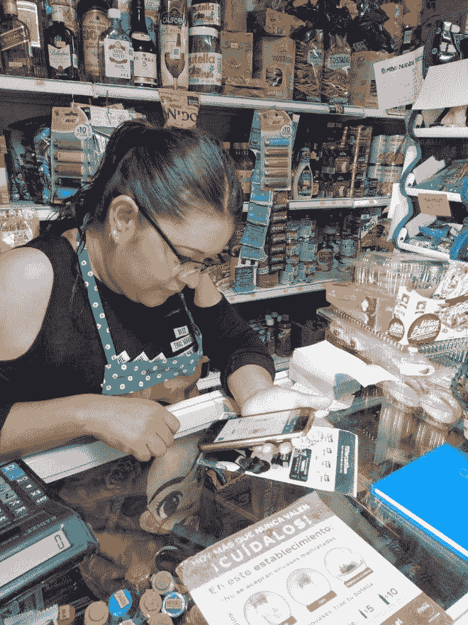

# 第十二章：将强化学习从实验室引入便利店

到目前为止，我们所涵盖的几乎所有 AI 模型和服务都基于监督和半监督机器学习，但一种新技术叫做强化学习最近从研究实验室中出现，提供几乎实时的学习能力。

与其在数据中寻找模式，强化学习系统通过实践学习：训练代理人查看背景情况，做出决策，并通过反馈获得奖励。在实验室中，强化学习代理在像 Minecraft 这样的游戏中进行训练，其中背景情况是游戏的当前状态，有限的行动选择以及明确的奖励。在现实世界中，强化学习可以用于决定向用户推荐哪些产品，¹ 机器人接下来该说什么，如何表达警报，展示哪张图片、视频或广告，或者任何其他优化问题。

Azure 使用强化学习来决定重新启动需要重置或移动到不同物理服务器的 VMs 的最少干扰时间。Microsoft Teams 使用它来确定每个单独呼叫使用什么音频抖动缓冲区。该缓冲区平滑处理音频数据包的方式，以适应通话期间连接延迟的任何变化，因此声音不会延迟，当数据包延迟或杂乱时也不会出现掉帧或机械声音。

Personalizer 服务（我们在第四章中介绍的 Azure 认知服务之一）是一个单步、单决策的优化引擎，而这单一决策可以是很多事情。

国家篮球协会正在使用 Personalizer，使他们的应用程序对每个用户完全个性化，展示不同的文章和 NBA 精彩片段。你可以使用它来管理连接到网络的手机的 5G 配置，根据可能使用更多数据或进行更多语音通话的情况设置连接方式，并根据 5G 网络当前的状态进行不同的设置。或者你可以管理忠诚度计划，为客户在一定时间内必须进行多少次重复购买以符合奖励资格创建动态优惠，以获取保持客户满意但不会成本过高的合适福利组合。

个性化正在变得越来越普遍。当微软首次在内部使用后来成为 Personalizer 服务时，解决了所有先前所有机器学习模型都失败的问题——在 MSN 上放置新闻标题，并将点击率提高了 27%。第一年可用时，Personalizer 处理了 3400 万次交易；次年增加到 110 亿次，之后一年达到了 660 亿次。到 2012 年底，该服务每月处理超过 90 亿个个性化选择，为微软及其客户服务。

强化学习的另一个优势在于：因为它不基于历史模式，所以在习惯突然改变时仍然有效——就像在 COVID-19 疫情开始时一样。基于历史模式的每个机器学习模型都不再相关，但个性化推荐器能够及时捕捉这些变化，实时理解用户行为，实时训练和更新模型。将它集成到你的应用程序和工作流中也很快速。

# 两个 API，八周时间，提升 100%。

安海斯-布希英比公司（Anheuser-Busch InBev）可能以百威啤酒而闻名，但他们拥有超过 500 个品牌。为了帮助这些品牌进入墨西哥的小型商店，AB InBev 设置了一个名为 MiMercado 的在线市场。最初，每个商店都会看到相同的优惠，但它们可能有非常不同的顾客和销售模式。在新业务中，缺乏大量历史数据，并且开发团队希望得到一个即插即用的系统。

即使使用 Azure 机器学习来运行模拟或管理并行学习以教导强化学习代理做出最佳决策，也涉及一定复杂性。使用 Personalizer 服务意味着你只需要处理两个 API，如 图 12-1 所示。

###### 图 12-1\. 在像 MiMercado 这样的网站上使用决策服务非常简单，在幕后认知服务对选择进行排名，选择最佳选项，并处理反馈循环以从中学习。

调用 *Rank* API 并传递上下文特征——对于 MiMercado 来说，这是 AB InBev 关于业务和用户（像 图 12-2 中的店主）的全部信息——以及产品选项及其上下文。API 返回了要在旋转木马上展示的产品及其顺序。如果客户购买了产品，应用程序将调用 *Reward* API 发送奖励，从而更新 Personalizer 模型。

将其集成到在线商店应用程序中非常简单：从开始到投入生产仅需八周时间。使用 Personalizer 将商店所有者点击推荐的次数翻了一番，并将实际订购特色产品的频率提高了三分之二，为每个 MiMercado 用户增加了 87% 的订单量。

在监督学习和半监督学习中，数据越多越好。Personalizer 需要一定量的数据和合理快速的数据点周转。如果您有一个远程工业场地，您只能每月更改一次设置，并且您必须等待另一个月来查看更改是否使情况变得更好或更糟，或者如果您是一个非常小的在线商店，您将无法获得足够的量甚至训练一个强化学习模型。理想情况下，您希望每天至少发生 500 次事情。如果流量非常高，Personalizer 将能够更快地捕捉到变化和趋势，因为数据量中将有足够的信号可以在几小时内学习。

###### 图 12-2\. 使用 Personalizer 决定向使用 MiMercado 的小店展示哪些产品，即使习惯在改变，也导致订单大幅增长。

但是您不需要有关用户和情况的大量数据点，也不需要任何个人信息。事实上，使用过多特征或过于精确的数据只会给数据添加噪音，因此 Personalizer 可以帮助您采用负责任的 AI 方法，例如使用行为信息而不是依赖 PII 或详细的用户人口统计信息，如性别和年龄。

###### 警告

请记住向任何用户明确说明个性化是如何使用的——例如一个名为*为什么我会看到这些建议？*的按钮，显示影响结果的特征和操作，并允许他们选择加入或退出数据收集。

更有用的是知道用户属于哪个组——他们是使用 Mac、Windows PC 还是手机，以及他们的设备剩余电量是多少——而不是知道他们是谁。如果是购物网站，知道他们最近购买的类别和平均花费比知道他们的整个购物历史更好。知道他们所在的地区比知道他们的地址更有用，记录工作日或周末以及早晨、下午、晚上或夜晚比将时间精确到秒更好。

数据越精确，越稀疏和独特，这使得学习变得更加困难；避免个人信息使其更密集和更有用。您发送的上下文也是如此。提供鞋子的颜色和价格范围，并说明它们的材质比确切的价格和型号更有用。您可能希望包含视频或新闻故事的元数据，或者通过其他认知服务进行处理，例如使用计算机视觉或文本分析来提取特色人物。

Personalizer 正在添加查看历史数据的选项，帮助你决定如何将数据分桶为特征，并告诉你在你的数据中哪些特征是最有用的，稍微有用的，或者完全无关紧要的。如果你认为某些内容应该起到作用但实际上没有，这会很有用，因为这可能意味着你没有充分向人们解释。

但是，如果每个上下文和行动只有两到三个数据点，而关于用户的数据点只有少数几个，Personalizer 仍然可以为你提供优秀的结果。

###### 提示

如果你有大量的行动或产品可供选择，你可能需要做更多的工作。在撰写本文时，Personalizer 只能处理 50 个选择；将来可能能够帮助你筛选或分类更多的选项，以缩减到这些选择。

通常情况下，你将看到显著的改进，典型的结果从增加使用量或销售额翻倍，直到四位数的改善。

在许多方面，Personalizer 是 Azure AI 服务的完美例子。它基于几十年的研究成果，这些技术最近才足够健壮以用于生产，设置仍然复杂，需要强大的数据科学技能，并且随着研究的继续而迅速发展。但你得到的是一个在生产中经过验证的强大系统，可以处理庞大的规模，开发工作量很小，即使你的数据科学专业知识有限。这就是云 AI 的实际效果。

如果你到目前为止学到的东西已经激发了你的兴趣，并且你准备将 Azure AI 服务应用到自己的业务问题中，那么继续阅读一些帮助以开始。

¹ 在 [Microsoft Recommenders GitHub 仓库](https://go.microsoft.com/fwlink/?linkid=2190186) 中找到使用强化学习构建推荐系统的最佳实践。
