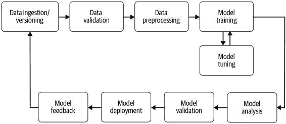
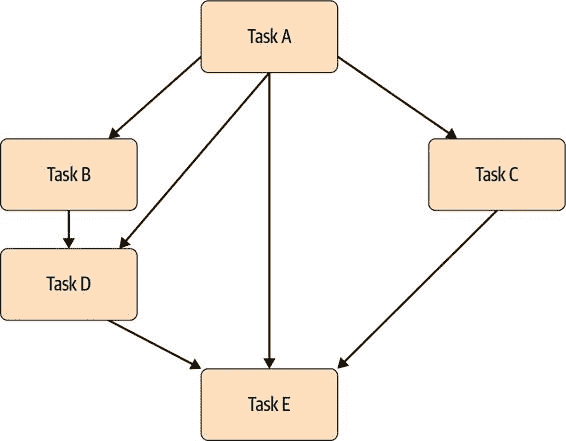
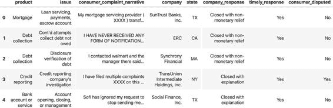
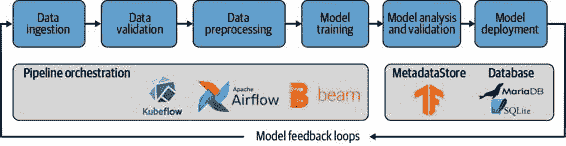

# 第一章：引言

在本书的第一章中，我们将介绍机器学习流水线，并概述构建流水线所需的所有步骤。我们将解释如何将您的机器学习模型从实验推进到稳健的生产系统。我们还将介绍我们将在本书余下部分使用的示例项目，以演示我们所描述原则的应用。

为什么要使用机器学习流水线？

机器学习流水线的关键优势在于自动化模型生命周期的步骤。当新的训练数据变得可用时，应该触发包括数据验证、预处理、模型训练、分析和部署的工作流程。我们观察到许多数据科学团队手动完成这些步骤，这既昂贵又容易出错。让我们详细讨论一下机器学习流水线的好处：

能够专注于新模型，而不是维护现有模型

> > 自动化机器学习流水线将使数据科学家摆脱维护现有模型的工作。我们观察到许多数据科学家整天都在维护先前开发的模型。他们手动运行脚本预处理训练数据，编写一次性部署脚本，或手动调整模型。自动化流水线允许数据科学家开发新模型，这是他们工作中有趣的部分。最终，这将提高工作满意度，并在竞争激烈的就业市场中提高留任率。

防止错误

> > 自动化流水线可以防止错误。正如我们将在后面的章节中看到的那样，新创建的模型将与一组版本化的数据和预处理步骤相关联。这意味着如果收集到新数据，将生成一个新模型。如果更新了预处理步骤，训练数据将变得无效，并生成一个新模型。在手动机器学习工作流程中，错误的常见来源是模型训练后预处理步骤的更改。在这种情况下，我们可能会部署带有不同处理说明的模型，这与我们训练模型时的处理方式不同。由于模型推断仍然可能存在，这些错误可能非常难以调试，但却是明显的不正确。通过自动化工作流程，可以预防这些错误。

有用的文件记录

> > 实验跟踪和模型发布管理生成模型变更的文件记录。实验将记录模型超参数的变化、使用的数据集以及生成的模型指标（例如损失或准确度）。模型发布管理将跟踪最终选择和部署的模型。如果数据科学团队需要重新创建模型或跟踪模型的性能，这些文件记录尤为宝贵。

标准化

> > 标准化的机器学习管道提高了数据科学团队的体验。由于标准化的设置，数据科学家可以快速上手或者在团队间流动，并找到相同的开发环境。这提高了效率并减少了在新项目上设置的时间。设置机器学习管道的时间投资也可能导致提高的保留率。

管道的商业案例

> > 自动化机器学习管道的实施将对数据科学团队产生三个关键影响：
> > 
+   > > > > 为新模型提供更多的开发时间
+   > > > > 
+   > > > > 更新现有模型的简化流程
+   > > > > 
+   > > > > 减少重复模型的时间

所有这些方面将减少数据科学项目的成本。而且，自动化的机器学习管道将：

+   > > > > 帮助检测数据集或训练模型中的潜在偏见。发现偏见可以防止对与模型交互的人造成伤害。例如，[亚马逊的机器学习驱动简历筛选器](https://oreil.ly/39rEg)发现存在性别偏见。
+   > > > > 
+   > > > > 创建纸质记录（通过实验跟踪和模型发布管理），以帮助解决关于数据保护法律的问题，如欧洲的通用数据保护条例（GDPR）。
+   > > > > 
+   > > > > 释放数据科学家的开发时间，提高他们的工作满意度。

何时考虑机器学习管道

机器学习管道提供了各种优势，但并非每个数据科学项目都需要管道。有时候数据科学家只是想尝试一个新模型，调查一个新的模型架构，或者重现最近的出版物。在这些情况下，管道并不实用。然而，一旦模型有了用户（例如，它被用于应用程序中），它将需要持续更新和微调。在这些情况下，我们回到了我们早些时候讨论的持续更新模型和减少数据科学家任务负担的情景。

机器学习项目的规模扩大后，管道变得更加重要。如果数据集或资源需求较大，我们讨论的方法可以实现基础设施的轻松扩展。如果重复性很重要，这是通过机器学习管道的自动化和审计跟踪来提供的。

机器学习管道步骤的概述

机器学习管道从新训练数据的摄取开始，以接收新训练模型的表现反馈结束。这个反馈可以是生产性能指标或产品用户的反馈。管道包括各种步骤，包括数据预处理、模型训练和模型分析，以及模型的部署。你可以想象手动完成这些步骤是繁琐且容易出错的。在本书的过程中，我们将介绍自动化机器学习管道的工具和解决方案。

正如您在图 1-1 中看到的那样，管道实际上是一个循环周期。数据可以持续收集，因此可以更新机器学习模型。更多的数据通常意味着改进的模型。由于数据不断涌入，自动化变得至关重要。在实际应用中，您希望经常重新训练您的模型。如果不这样做，在许多情况下，准确性会降低，因为训练数据与模型正在预测的新数据不同。如果重新训练是一个手动过程，需要手动验证新的训练数据或分析更新的模型，那么数据科学家或机器学习工程师将没有时间为完全不同的业务问题开发新模型。

图 1-1\. 模型生命周期

机器学习管道通常包括以下部分中的步骤。

数据摄入和数据版本控制

数据摄入，正如我们在第三章中描述的那样，是每个机器学习管道的开始。在这个管道步骤中，我们将数据处理成后续组件可以消化的格式。数据摄入步骤不执行任何特征工程（这发生在数据验证步骤之后）。这也是将传入数据版本化的良好时机，以将数据快照与管道末端的训练模型连接起来。

数据验证

在训练新模型版本之前，我们需要验证新数据。数据验证（第四章）的重点是检查新数据的统计数据是否符合预期（例如范围、类别数量和类别分布）。如果检测到任何异常，它还会提醒数据科学家。例如，如果您正在训练一个二分类模型，您的训练数据可能包含 50%的 X 类样本和 50%的 Y 类样本。数据验证工具将在这些类别之间的分割发生变化时提供警报，例如新收集的数据在这两个类别之间的分割变为 70/30。如果模型在这样一个不平衡的训练集上进行训练，并且数据科学家没有调整模型的损失函数，或者过度/欠采样类别 X 或 Y，那么模型的预测可能会偏向于主导类别。

常见的数据验证工具还允许您比较不同的数据集。如果您有一个带有主导标签的数据集，并且将数据集分割为训练集和验证集，您需要确保标签在这两个数据集之间的分割大致相同。数据验证工具将允许您比较数据集并突出显示异常。

如果验证发现任何异常情况，可以在此停止流水线并通知数据科学家。如果检测到数据的变化，数据科学家或机器学习工程师可以改变各个类别的抽样（例如，只从每个类别中选择相同数量的示例），或者改变模型的损失函数，启动新的模型构建流水线，并重新启动生命周期。

数据预处理

你几乎无法直接使用新收集的数据直接训练机器学习模型。在几乎所有情况下，您需要预处理数据以用于训练运行。标签通常需要转换为单热或多热向量。1 对模型输入也适用相同的情况。如果从文本数据训练模型，您希望将文本的字符转换为索引或文本标记转换为单词向量。由于预处理仅在模型训练之前需要，而不是每个训练时期都需要，因此在训练模型之前单独运行预处理是最合理的生命周期步骤。

数据预处理工具可以从简单的 Python 脚本到复杂的图形模型。虽然大多数数据科学家专注于他们偏爱的工具的处理能力，但同样重要的是，预处理步骤的修改能够与处理后的数据相链接。这意味着如果有人修改了一个处理步骤（例如，在一个独热向量转换中允许额外的标签），那么先前的训练数据应该无效，强制更新整个流水线。我们在第五章中描述了这个流水线步骤。

模型训练和调整

模型训练步骤（第六章）是机器学习流水线的核心。在这一步骤中，我们训练一个模型以尽可能低的误差来预测输出。对于较大的模型，特别是大训练集，这一步骤很快就会变得难以管理。由于内存通常是我们计算的有限资源，模型训练的有效分布至关重要。

模型调整近来受到了极大关注，因为它可以显著提升性能并提供竞争优势。根据您的机器学习项目，您可以选择在开始考虑机器学习流水线之前调整模型，或者作为流水线的一部分调整它。由于我们的管道具有可伸缩性，得益于其底层架构，我们可以并行或顺序地启动大量模型。这使我们能够挑选出最终生产模型的最佳模型超参数。

模型分析

通常情况下，我们会使用准确率或损失来确定模型参数的最佳设定。但一旦我们确认了模型的最终版本，深入分析模型性能会非常有用（见第七章描述）。这可能包括计算其他指标，如精度、召回率和 AUC（曲线下面积），或在比训练时使用的验证集更大的数据集上计算性能。

进行深入模型分析的另一个原因是检查模型的预测是否公平。除非对数据集进行切片并计算每个切片的性能，否则无法确定模型在不同用户组中的表现。我们还可以调查模型对训练中使用的特征的依赖性，并探索如果更改单个训练示例的特征，模型预测会如何改变。

类似于模型调整步骤和最佳执行模型的最终选择，此工作流步骤需要由数据科学家审查。但我们将展示如何仅通过人工进行最终审查，即可实现整个分析的自动化。自动化将确保模型分析的一致性，并与其他分析进行比较。

模型版本控制

模型版本控制和验证步骤的目的是跟踪已被选择为下一个部署版本的模型、超参数集和数据集。

在软件工程中的语义化版本控制要求在 API 发生不兼容更改或添加重大功能时增加主版本号。否则，应增加次版本号。模型发布管理还有另一自由度：数据集。有些情况下，通过为训练过程提供显著更多和/或更好的数据，可以实现模型性能的显著差异，而无需更改单个模型参数或架构描述。这种性能提升是否值得进行主版本升级？

尽管每个数据科学团队对这个问题的答案可能不同，但记录所有输入到新模型版本（超参数、数据集、架构）并跟踪它们作为此发布步骤的一部分是至关重要的。

模型部署

一旦您已经训练、调优和分析了您的模型，它就准备好了。不幸的是，许多模型是以一次性实现方式部署的，这使得更新模型变得脆弱的过程。

现代模型服务器允许您在不编写 Web 应用程序代码的情况下部署模型。通常，它们提供多种 API 接口，如表现状态转移（REST）或远程过程调用（RPC）协议，并允许同时托管同一模型的多个版本。同时托管多个版本将使您能够对模型运行 A/B 测试，并提供有关模型改进的宝贵反馈。

模型服务器还允许您更新模型版本，而无需重新部署应用程序，这将减少应用程序的停机时间并减少应用程序开发与机器学习团队之间的通信。我们在第八章和第九章描述了模型部署。

反馈回路

机器学习流水线的最后一步经常被遗忘，但对数据科学项目的成功至关重要。我们需要闭环。然后，我们可以衡量新部署模型的有效性和性能。在此步骤中，我们可以获取有关模型性能的宝贵信息。在某些情况下，我们还可以捕获新的训练数据以增加我们的数据集并更新我们的模型。这可能涉及人在回路中，也可能是自动的。我们在第十三章讨论了反馈回路。

除了两个手动审查步骤（模型分析步骤和反馈步骤），我们可以自动化整个流水线。数据科学家应专注于开发新模型，而不是更新和维护现有模型。

数据隐私

在撰写本文时，数据隐私考虑超出了标准的机器学习流水线范围。随着消费者对其数据使用的关注增加以及新法律的实施限制个人数据的使用，我们预计这种情况将发生变化。这将导致隐私保护方法被整合到构建机器学习流水线工具中。

我们讨论了增强机器学习模型隐私的几种当前选项，详情请参阅第十四章：

+   > > > > 差分隐私，数学上保证模型预测不会暴露用户数据
+   > > > > 
+   > > > > 联合学习，其中原始数据不会离开用户设备
+   > > > > 
+   > > > > 加密机器学习，其中整个训练过程可以在加密空间中运行，或者对原始数据进行训练的模型可以进行加密

流水线编排

在前一节中描述的机器学习流水线的所有组件都需要被执行，或者说，被编排，以确保组件按正确顺序执行。在执行组件之前必须计算组件的输入。这些步骤的编排由诸如 Apache Beam、Apache Airflow（详见第十一章）或用于 Kubernetes 基础设施的 Kubeflow Pipelines（详见第十二章）等工具执行。

虽然数据流水线工具协调机器学习流水线步骤，但像 TensorFlow ML MetadataStore 这样的流水线工件存储捕获了各个过程的输出。在第二章，我们将概述 TFX 的 MetadataStore 并深入探讨 TFX 及其流水线组件的内部工作。

为什么需要流水线编排？

在 2015 年，谷歌的一群机器学习工程师总结出，机器学习项目经常失败的一个原因是大多数项目都使用定制代码来弥合机器学习流水线步骤之间的差距 2。然而，这些定制代码并不容易从一个项目转移到下一个。研究人员在论文《机器学习系统中隐藏的技术债务》3 中总结了他们的发现。作者在论文中认为，流水线步骤之间的粘合代码通常很脆弱，并且定制脚本在特定案例之外不具备扩展性。随着时间的推移，诸如 Apache Beam、Apache Airflow 或 Kubeflow Pipelines 等工具得以开发。这些工具可用于管理机器学习流水线任务，它们允许标准化的编排以及在任务之间的粘合代码的抽象化。

虽然一开始学习新工具（如 Beam 或 Airflow）或新框架（如 Kubeflow）并设置额外的机器学习基础设施（如 Kubernetes）可能显得繁琐，但这种时间投资很快就会得到回报。如果不采用标准化的机器学习流水线，数据科学团队将面临独特的项目设置、任意的日志文件位置、独特的调试步骤等问题。这些复杂性问题可能无穷无尽。

有向无环图

像 Apache Beam、Apache Airflow 和 Kubeflow Pipelines 这样的流水线工具通过任务依赖关系的图形表示来管理任务的流动。

如图 1-2 中的示例图所示，流水线步骤是有向的。这意味着一个流水线从任务 A 开始，以任务 E 结束，保证了执行路径由任务依赖明确定义。有向图避免了某些任务在所有依赖项完全计算之前就开始执行的情况。由于我们知道在训练模型之前必须预处理训练数据，有向图的表示防止了在完成预处理步骤之前执行训练任务。

图 1-2\. 示例有向无环图

流水线图还必须是无环的，这意味着图形不链接到先前完成的任务。这将意味着流水线可能无休止地运行，因此无法完成工作流程。

由于这两个条件（有向和无环），流水线图被称为有向无环图（DAGs）。您会发现 DAG 是大多数工作流工具背后的核心概念。我们将在第十一章和第十二章讨论这些图是如何执行的更多细节。

我们的示例项目

要跟随本书的内容，我们创建了一个使用开放数据的示例项目。数据集是关于美国消费者对金融产品的投诉集合，包含结构化数据（分类/数值数据）和非结构化数据（文本）。数据来自[消费者金融保护局](https://oreil.ly/0RVBG)。

图 1-3 显示了该数据集的一个样本。

图 1-3\. 数据样本

机器学习问题是，根据投诉的数据预测消费者是否对投诉有异议。在这个数据集中，30%的投诉有异议，所以数据集不平衡。

项目结构

我们提供了我们的示例项目作为[GitHub 仓库](https://oreil.ly/bmlp-git)，您可以使用以下命令正常克隆它：

> `$` `git clone https://github.com/Building-ML-Pipelines/``\` `building-machine-learning-pipelines.git`
> 
> PYTHON 包版本
> 
> 为了构建我们的示例项目，我们使用了 Python 3.6 至 3.8 版本。我们使用了 TensorFlow 版本 2.2.0 和 TFX 版本 0.22.0。我们将尽力更新我们的 GitHub 仓库到未来的版本，但不能保证项目能够与其他语言或包的版本兼容。

我们的示例项目包含以下内容：

+   > > > > 包含独立章节示例笔记本的 chapters 文件夹，包括第 3、4、7 和 14 章
+   > > > > 
+   > > > > 包含常见组件代码（如模型定义）的 components 文件夹
+   > > > > 
+   > > > > 完整的交互式流水线
+   > > > > 
+   > > > > 一个机器学习实验示例，这是流水线的起点
+   > > > > 
+   > > > > 由 Apache Beam、Apache Airflow 和 Kubeflow Pipelines 协同管理的完整示例流水线
+   > > > > 
+   > > > > 包含下载数据脚本的 utility 文件夹

在接下来的章节中，我们将指导您完成将示例机器学习实验（在我们的案例中是一个带有 Keras 模型架构的 Jupyter 笔记本）转变为完整端到端机器学习流水线的必要步骤。

我们的机器学习模型

我们示例深度学习项目的核心是由示例项目的`components/module.py`脚本中的`get_model`函数生成的模型。该模型预测消费者是否对投诉有异议，使用以下特征：

+   > > > > 金融产品
+   > > > > 
+   > > > > 子产品
+   > > > > 
+   > > > > 公司对投诉的回应
+   > > > > 
+   > > > > 消费者投诉的问题
+   > > > > 
+   > > > > 美国的州
+   > > > > 
+   > > > > 邮政编码
+   > > > > 
+   > > > > 投诉的文本（叙述）

为了构建机器学习流水线，我们假设模型架构设计已完成，我们不会修改模型。我们将在第六章更详细地讨论模型架构。但对于本书而言，模型架构是一个非常小的点。本书关注的是一旦您拥有模型，您可以用它做什么。

示例项目的目标

在本书的过程中，我们将展示连续训练示例机器学习模型所需的框架、组件和基础设施元素。我们将使用架构图中显示的堆栈，见图 1-4。

图 1-4\. 我们示例项目的机器学习管道架构

我们尝试实现一个通用的机器学习问题，可以轻松替换为您特定的机器学习问题。机器学习管道的结构和基本设置保持不变，可以转移到您的用例中。每个组件都需要一些定制（例如，从何处摄取数据），但正如我们将讨论的那样，定制需求将是有限的。

摘要

在本章中，我们介绍了机器学习管道的概念，并解释了各个步骤。我们还展示了自动化此过程的好处。此外，我们为接下来的章节做了铺垫，并简要概述了每一章以及我们示例项目的介绍。在下一章中，我们将开始构建我们的管道！

> 1   在带有多个类输出的监督分类问题中，通常需要将从类别转换为向量，例如（0,1,0），这是一个独热向量，或者从类别列表转换为向量，例如（1,1,0），这是一个多热向量。
> 
> 2   Google 于 2007 年启动了一个名为 Sibyl 的内部项目，用于管理内部的机器学习生产管道。然而，2015 年，D. Sculley 等人发表了关于机器学习管道的学习成果，“机器学习系统中的隐藏技术债务”，[“Hidden Technical Debt in Machine Learning Systems”](https://oreil.ly/qVlYb)，这个主题引起了广泛关注。
> 
> 3   D. Sculley 等人，“机器学习系统中的隐藏技术债务”，Google，Inc.（2015 年）。
