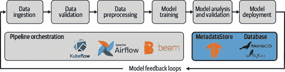
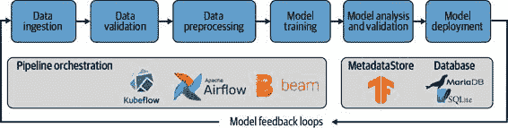
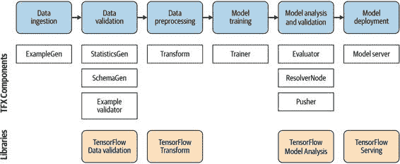
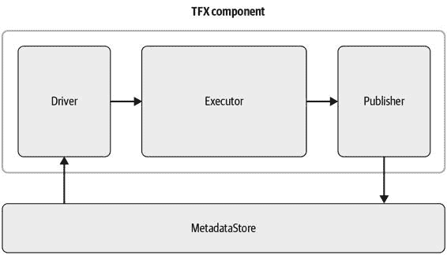
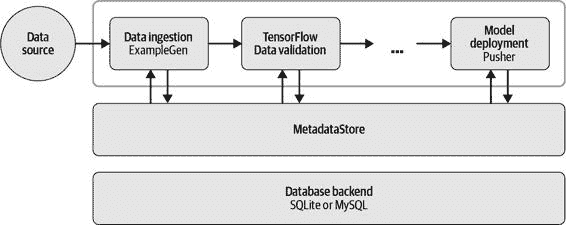
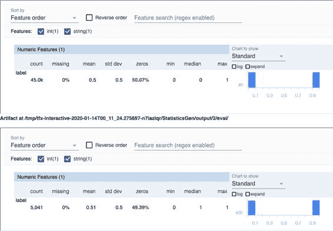

# 第二章：TensorFlow Extended 简介

在上一章中，我们介绍了机器学习流水线的概念，并讨论了构成流水线的各个组件。在本章中，我们介绍 TensorFlow Extended（TFX）。TFX 库提供了我们机器学习流水线所需的所有组件。我们使用 TFX 定义我们的流水线任务，然后可以使用流水线编排器（如 Airflow 或 Kubeflow Pipelines）执行这些任务。图 2-1 概述了流水线步骤及不同工具如何配合使用。

图 2-1\. TFX 作为 ML 流水线的一部分

在本章中，我们将指导您安装 TFX，并解释将为后续章节铺垫的基本概念和术语。在这些章节中，我们深入探讨了构成我们流水线的各个组件。在本章中，我们还介绍了[Apache Beam](https://beam.apache.org)。Beam 是一个用于定义和执行数据处理作业的开源工具。在 TFX 流水线中，它有两个用途：首先，它在许多 TFX 组件的幕后运行，执行诸如数据验证或数据预处理之类的处理步骤。其次，它可以用作流水线编排器，正如我们在第一章中讨论的那样。我们在这里介绍 Beam，因为它将帮助您理解 TFX 组件，并且如果您希望编写自定义组件（正如我们在第十章中讨论的那样），它是必不可少的。

什么是 TFX？

机器学习流水线可能变得非常复杂，并消耗大量开销来管理任务依赖关系。同时，机器学习流水线可以包括各种任务，包括数据验证、预处理、模型训练以及任何训练后任务。正如我们在第一章中讨论的那样，任务之间的连接通常很脆弱，导致流水线失败。这些连接也被称为来自于出版物[“机器学习系统中的隐藏技术债务”](https://oreil.ly/SLttH)的胶水代码。连接脆弱最终意味着生产模型更新不频繁，数据科学家和机器学习工程师厌恶更新过时模型。流水线还需要良好管理的分布式处理，这就是为什么 TFX 利用 Apache Beam。对于大型工作负载来说，这一点尤为重要。

Google 在内部面临相同问题，并决定开发一个平台来简化流水线定义，减少编写任务样板代码的工作量。Google 内部 ML 流水线框架的开源版本是 TFX。

图 2-2 展示了带有 TFX 的通用流水线架构。流水线编排工具是执行我们任务的基础。除了编排工具外，我们还需要一个数据存储来跟踪中间流水线结果。各个组件通过数据存储进行通信以获取其输入，并将结果返回给数据存储。这些结果随后可以作为后续任务的输入。TFX 提供了将所有这些工具组合在一起的层，并提供了主要流水线任务的各个组件。

图 2-2\. 机器学习流水线架构

最初，Google 将一些流水线功能作为开源 TensorFlow 库发布（例如，在第八章中讨论了 TensorFlow Serving），并纳入了 TFX 库的范畴。2019 年，Google 发布了包含所有必要流水线组件的开源粘合代码，用于将这些库连接在一起，并自动创建流水线定义，以供 Apache Airflow、Apache Beam 和 Kubeflow Pipelines 等编排工具使用。

TFX 提供了多种流水线组件，涵盖了许多使用案例。在编写本文时，以下组件可用：

+   > > > > 使用 `ExampleGen` 进行数据摄取
+   > > > > 
+   > > > > 使用 `StatisticsGen`、`SchemaGen` 和 `ExampleValidator` 进行数据验证
+   > > > > 
+   > > > > 使用 `Transform` 进行数据预处理
+   > > > > 
+   > > > > 使用 `Trainer` 进行模型训练
+   > > > > 
+   > > > > 使用 `ResolverNode` 检查先前训练的模型
+   > > > > 
+   > > > > 使用 `Evaluator` 进行模型分析和验证
+   > > > > 
+   > > > > 使用 `Pusher` 进行模型部署

图 2-3 展示了流水线组件和库的结合方式。

图 2-3\. TFX 组件和库

我们将在接下来的章节中详细讨论组件和库。如果需要一些非标准功能，在第十章中我们将讨论如何创建自定义流水线组件。

> TFX 的稳定版本
> 
> 在编写本章时，尚未发布稳定的 TFX 1.X 版本。本书中提到的 TFX API 可能会在未来更新中进行更新。据我们所知，本书中的所有示例将与 TFX 版本 0.22.0 兼容。

安装 TFX

使用以下 Python 安装程序命令可轻松安装 TFX：

> `$` `$ pip install tfx`

`tfx` 软件包附带多种自动安装的依赖项。它不仅安装各个 TFX Python 软件包（例如 TensorFlow 数据验证），还包括诸如 Apache Beam 等的依赖项。

安装完 TFX 后，您可以导入各个 Python 软件包。如果想使用单独的 TFX 软件包（例如，使用 TensorFlow 数据验证验证数据集，请参见第四章）推荐采用这种方式：

> `import``tensorflow_data_validation``as``tfdv``import``tensorflow_transform``as``tft``import``tensorflow_transform.beam``as``tft_beam``...`

或者，您可以导入相应的 TFX 组件（如果在管道上下文中使用组件）：

> `from``tfx.components``import``ExampleValidator``from``tfx.components``import``Evaluator``from``tfx.components``import``Transform``...`

TFX 组件概述

一个组件处理的过程比仅执行单个任务更复杂。所有机器学习管道组件从通道读取以获取来自元数据存储的输入工件。然后从元数据存储提供的路径加载数据并进行处理。组件的输出，即处理后的数据，然后提供给下一个管道组件。组件的通用内部始终是：

+   > > > > 接收一些输入
+   > > > > 
+   > > > > 执行一个操作
+   > > > > 
+   > > > > 存储最终结果

在 TFX 术语中，组件的三个内部部分分别称为驱动程序、执行程序和发布者。驱动程序处理元数据存储的查询。执行程序执行组件的操作。发布者管理将输出元数据保存到 MetadataStore 中。驱动程序和发布者不会移动任何数据。相反，它们从 MetadataStore 中读取和写入引用。图 2-4 显示了 TFX 组件的结构。

图 2-4\. 组件概述

组件的输入和输出称为工件。工件的示例包括原始输入数据、预处理数据和训练模型。每个工件与存储在 MetadataStore 中的元数据相关联。工件元数据包括工件类型和工件属性。这种工件设置确保组件可以有效地交换数据。TFX 目前提供了十种不同类型的工件，我们将在接下来的章节中进行审查。

什么是 ML Metadata？

TFX 的组件“通过元数据进行通信”；而不是直接在管道组件之间传递工件，组件使用和发布管道工件的引用。例如，一个工件可以是原始数据集、转换图或导出模型。因此，元数据是我们 TFX 管道的支柱。通过在组件之间传递元数据而不是直接传递工件的一个优点是信息可以集中存储。

在实践中，工作流程如下：当我们执行一个组件时，它使用 ML Metadata（MLMD）API 来保存与运行相对应的元数据。例如，组件驱动从元数据存储中接收原始数据集的引用。在组件执行之后，组件发布者将组件输出的引用存储到元数据存储中。MLMD 基于存储后端一致地保存元数据到 MetadataStore 中。目前，MLMD 支持三种类型的后端：

+   > > > > 内存数据库（通过 SQLite）
+   > > > > 
+   > > > > SQLite
+   > > > > 
+   > > > > MySQL

由于 TFX 组件始终如一地跟踪，ML Metadata 提供了多种有用的功能。例如，我们可以在第七章讨论模型验证时进行比较。在这种特定情况下，TFX 比较当前运行的模型分析结果与先前运行的结果。该元数据还可以用于确定所有基于另一个先前创建的工件的工件。这为我们的机器学习流水线创建了一种审计跟踪方式。

图 2-5 显示每个组件与 MetadataStore 交互，而 MetadataStore 则将元数据存储在提供的数据库后端上。

图 2-5\. 使用 MLMD 存储元数据

交互式流水线

设计和实现机器学习流水线有时可能令人沮丧。例如，有时在流水线中调试组件是具有挑战性的。这就是为什么围绕交互式流水线的 TFX 功能如此有益。事实上，在接下来的章节中，我们将逐步实现一个机器学习流水线，并通过交互式流水线演示其实现。该流水线在 Jupyter Notebook 中运行，并且可以立即查看组件的工件。一旦确认了流水线的全部功能，在第十一章和第十二章，我们将讨论如何将交互式流水线转换为生产就绪的流水线，例如在 Apache Airflow 上执行。

任何交互式流水线都是在 Jupyter Notebook 或 Google Colab 会话的环境中编程的。与我们将在第十一章和第十二章讨论的编排工具相比，交互式流水线由用户编排和执行。

通过导入所需的包可以启动交互式流水线：

> `import``tensorflow``as``tf``from``tfx.orchestration.experimental.interactive.interactive_context``import` `\` `InteractiveContext`

导入要求后，可以创建`context`对象。`context`对象处理组件执行并显示组件的工件。此时，`InteractiveContext`还设置了一个简单的内存中 ML MetadataStore：

> `context``=``InteractiveContext``()`

在设置流水线组件（例如`StatisticsGen`）之后，您可以通过`context`对象的`run`函数执行每个组件对象，如下例所示：

> `from``tfx.components``import``StatisticsGen``statistics_gen``=``StatisticsGen``(``examples``=``example_gen``.``outputs``[``'examples'``])``context``.``run``(``statistics_gen``)`

组件本身将前一组件的输出（在我们的案例中是数据摄取组件`ExampleGen`）作为实例化参数接收。在执行组件的任务后，组件会自动将输出工件的元数据写入元数据存储。一些组件的输出可以在你的笔记本中显示。结果和可视化的即时可用性非常方便。例如，你可以使用`StatisticsGen`组件来检查数据集的特征：

> `context``.``show``(``statistics_gen``.``outputs``[``'statistics'``])`

在运行前面的`context`函数后，你可以在你的笔记本中看到数据集统计的视觉概述，如图 2-6 所示。

有时候，通过程序检查组件的输出工件可能是有利的。在组件对象执行后，我们可以访问工件属性，如以下示例所示。属性取决于特定的工件：

> `for``artifact``in``statistics_gen``.``outputs``[``'statistics'``]``.``get``():``print``(``artifact``.``uri``)`

这给出了以下结果：

> `'/tmp/tfx-interactive-2020-05-15T04_50_16.251447/StatisticsGen/statistics/2'`

图 2-6\. 交互式流水线允许我们直观地检查数据集

在接下来的章节中，我们将展示如何在交互式环境中运行每个组件。然后在第 11 和 12 章中，我们将展示完整的流水线以及如何通过 Airflow 和 Kubeflow 进行编排。

TFX 的替代方案

在我们深入了解接下来的 TFX 组件之前，让我们花点时间看看 TFX 的替代方案。在过去几年中，机器学习流水线的编排一直是一个重要的工程挑战，毫无疑问，许多主要的硅谷公司都开发了自己的流水线框架。在以下表格中，你可以找到一些流行的框架：

| -   |  公司  |  框架  |  链接  |
| --- | --- | --- | --- |
| -   |  AirBnb  |  AeroSolve  |   [`github.com/airbnb/aerosolve`](https://github.com/airbnb/aerosolve) |
| -   |  条纹  |  铁路场  |   [`stripe.com/blog/railyard-training-models`](https://stripe.com/blog/railyard-training-models) |
| -   |  Spotify  |  Luigi  |   [`github.com/spotify/luigi`](https://github.com/spotify/luigi) |
| -   |  Uber  |  Michelangelo  |   [`eng.uber.com/michelangelo-machine-learning-platform/`](https://eng.uber.com/michelangelo-machine-learning-platform/) |
| -   |  Netflix  |  Metaflow  |   [`metaflow.org/`](https://metaflow.org/) |

由于这些框架起源于各大公司，它们设计时考虑了特定的工程堆栈。例如，AirBnB 的 AeroSolve 专注于基于 Java 的推断代码，而 Spotify 的 Luigi 则专注于高效的编排。TFX 在这方面也不例外。此时，TFX 的架构和数据结构假设你正在使用 TensorFlow（或 Keras）作为机器学习框架。某些 TFX 组件可以与其他机器学习框架结合使用。例如，可以使用 TensorFlow Data Validation 分析数据，然后由 scikit-learn 模型使用。然而，TFX 框架与 TensorFlow 或 Keras 模型密切相关。由于 TFX 由 TensorFlow 社区支持，并且像 Spotify 这样的公司正在采用 TFX，我们相信它是一个稳定且成熟的框架，最终将被更广泛的机器学习工程师采纳。

Apache Beam 简介

多种 TFX 组件和库（例如 TensorFlow Transform）依赖于 Apache Beam 来高效处理管道数据。由于在 TFX 生态系统中的重要性，我们想简要介绍 Apache Beam 在 TFX 组件背后的工作原理。在第十一章中，我们将讨论如何将 Apache Beam 用于第二个目的：作为管道编排工具。

Apache Beam 为你提供了一种开源、供应商无关的方式来描述数据处理步骤，然后可以在各种环境中执行。由于其极大的灵活性，Apache Beam 可以用于描述批处理过程、流处理操作和数据管道。事实上，TFX 依赖于 Apache Beam，并在幕后使用它来支持各种组件（例如 TensorFlow Transform 或 TensorFlow Data Validation）。我们将在第四章中讨论 Apache Beam 在 TFX 生态系统中的具体用法，以及在第五章中讨论 TensorFlow Transform。

虽然 Apache Beam 将数据处理逻辑与支持运行时工具分离，但它可以在多个分布式处理运行时环境上执行。这意味着你可以在 Apache Spark 或 Google Cloud Dataflow 上运行相同的数据管道，而不需要改变管道描述。此外，Apache Beam 不仅仅是为了描述批处理过程，还能无缝支持流处理操作。

设置

安装 Apache Beam 非常简单。你可以通过以下命令安装最新版本：

> `$` `pip install apache-beam`

如果你计划在 Google Cloud Platform 的背景下使用 Apache Beam，例如处理来自 Google BigQuery 的数据或在 Google Cloud Dataflow 上运行我们的数据管道（如“使用 GCP 处理大型数据集”中描述的），你应该按以下方式安装 Apache Beam：

> `$` `pip install` `'apache-beam[gcp]'`

如果您计划在 Amazon Web Services（AWS）的上下文中使用 Apache Beam（例如，如果您想要从 S3 存储桶加载数据），则应按以下方式安装 Apache Beam：

> `$` `pip install` `'apache-beam[boto]'`

如果您使用 Python 包管理器`pip`安装 TFX，Apache Beam 将自动安装。

基本数据流水线

Apache Beam 的抽象基于两个概念：集合和转换。一方面，Beam 的集合描述了从给定文件或流中读取或写入数据的操作。另一方面，Beam 的转换描述了如何操作数据。所有的集合和转换都在流水线的上下文中执行（在 Python 中通过上下文管理器命令`with`表达）。当我们在下面的示例中定义我们的集合或转换时，并没有实际加载或转换任何数据。这只有在流水线在运行时环境（例如 Apache Beam 的 DirectRunner、Apache Spark、Apache Flink 或 Google Cloud Dataflow）的上下文中执行时才会发生。

基本集合示例

数据流水线通常从读取或写入数据开始和结束，在 Apache Beam 中通过集合（通常称为`PCollections`）处理。然后对集合进行转换，并且最终结果可以再次表达为集合并写入文件系统。

以下示例展示了如何读取文本文件并返回所有行：

> `import``apache_beam``as``beam``with``beam``.``Pipeline``()``as``p``:``lines``=``p``|``beam``.``io``.``ReadFromText``(``input_file``)`

> > 使用上下文管理器来定义流水线。

> > 将文本读入`PCollection`。

类似于`ReadFromText`操作，Apache Beam 提供了将集合写入文本文件的函数（例如`WriteToText`）。写操作通常在所有转换执行后进行：

> `with``beam``.``Pipeline``()``as``p``:``...``output``|``beam``.``io``.``WriteToText``(``output_file``)`

> > 将`output`写入文件`output_file`。

基本转换示例

在 Apache Beam 中，数据通过转换进行操作。正如我们在本例中看到的，并且稍后在第五章中看到的，可以通过使用管道操作符`|`将转换链接在一起。如果您链式地应用同一类型的多个转换，则必须为操作提供一个名称，由管道操作符和尖括号之间的字符串标识符表示。在以下示例中，我们将所有转换顺序应用于从文本文件中提取的行：

> `counts``=``(``lines``|``'Split'``>>``beam``.``FlatMap``(``lambda``x``:``re``.``findall``(``r``'[A-Za-z``\'``]+'``,``x``))``|``'PairWithOne'``>>``beam``.``Map``(``lambda``x``:``(``x``,``1``))``|``'GroupAndSum'``>>``beam``.``CombinePerKey``(``sum``))`

让我们详细地分析这段代码。例如，我们将采用短语“Hello, how do you do?”和“I am well, thank you.”作为示例。

`Split` 转换使用 `re.findall` 将每行分割成一个标记列表，结果如下：

> `[``"Hello"``,``"how"``,``"do"``,``"you"``,``"do"``]``[``"I"``,``"am"``,``"well"``,``"thank"``,``"you"``]`

`beam.FlatMap` 将结果映射到 `PCollection`：

> `"Hello" "how" "do" "you" "do" "I" "am" "well" "thank" "you"`

接下来，`PairWithOne` 转换使用 `beam.Map` 来创建每个标记和计数（每个结果为 1）的元组：

> `"Hello", 1 "how", 1 "do", 1 "you", 1 "do", 1 "I", 1 "am", 1 "well", 1 "thank", 1 "you"`

最后，`GroupAndSum` 转换会对每个标记的所有单独元组进行求和：

> `"Hello", 1 "how", 1 "do", 2 "you", 2 "I", 1 "am", 1 "well", 1 "thank", 1`

您也可以将 Python 函数应用作为转换的一部分。下面的例子展示了如何将函数 `format_result` 应用于先前生成的求和结果。该函数将生成的元组转换为字符串，然后可以写入文本文件：

> `def``format_result``(``word_count``):``"""将元组（标记，计数）转换为字符串"""``(``word``,``count``)``=``word_count``return``"{}: {}"``.``format``(``word``,``count``)``output``=``counts``|``'Format'``>>``beam``.``Map``(``format_result``)`

Apache Beam 提供了各种预定义的转换。然而，如果您的首选操作不可用，可以通过使用 `Map` 操作符来编写自己的转换。只需记住，操作应该能够以分布式方式运行，以充分利用运行时环境的能力。

将所有内容整合在一起

在讨论了 Apache Beam 流水线的各个概念之后，让我们通过一个例子将它们整合起来。前面的片段和接下来的示例是修改版的[Apache Beam 介绍](https://oreil.ly/e0tj-)。为了可读性，例子已经简化到最基本的 Apache Beam 代码：

> `import``re``import``apache_beam``as``beam``from``apache_beam.io``import``ReadFromText``from``apache_beam.io``import``WriteToText``from``apache_beam.options.pipeline_options``import``PipelineOptions``from``apache_beam.options.pipeline_options``import``SetupOptions``input_file``=``"gs://dataflow-samples/shakespeare/kinglear.txt"``output_file``=``"/tmp/output.txt"``# 定义管道选项对象。``pipeline_options``=``PipelineOptions``()``with``beam``.``Pipeline``(``options``=``pipeline_options``)``as``p``:``# 将文本文件或文件模式读取到 PCollection 中。``lines``=``p``|``ReadFromText``(``input_file``)``# 计算每个单词的出现次数。``counts``=``(``lines``|``'Split'``>>``beam``.``FlatMap``(``lambda``x``:``re``.``findall``(``r``'[A-Za-z``\'``]+'``,``x``))``|``'PairWithOne'``>>``beam``.``Map``(``lambda``x``:``(``x``,``1``))``|``'GroupAndSum'``>>``beam``.``CombinePerKey``(``sum``))``# 将计数格式化为字符串的 PCollection。``def``format_result``(``word_count``):``(``word``,``count``)``=``word_count``return``"{}: {}"``.``format``(``word``,``count``)``output``=``counts``|``'Format'``>>``beam``.``Map``(``format_result``)``# 使用具有副作用的“Write”转换写入输出。``output``|``WriteToText``(``output_file``)

> > 文本存储在 Google Cloud Storage 存储桶中。

> > 设置 Apache Beam 管道。

> > 通过读取文本文件创建数据集。

> > 对集合执行转换。

示例管道下载了莎士比亚的《李尔王》，并在整个语料库上执行了标记计数管道。然后将结果写入位于 `/tmp/output.txt` 的文本文件。

执行您的基本管道

例如，您可以通过执行以下命令（假设前面的示例代码已保存为 `basic_pipeline.py`）使用 Apache Beam 的 DirectRunner 运行管道。如果要在不同的 Apache Beam 运行程序（如 Apache Spark 或 Apache Flink）上执行此管道，则需要通过 `pipeline_options` 对象设置管道配置：

> `python basic_pipeline.py`

可在指定的文本文件中找到转换的结果：

> `$``head``/``tmp``/``output``.``txt``*``KING``:``243``LEAR``:``236``DRAMATIS``:``1``PERSONAE``:``1``king``:``65``...`

摘要

在本章中，我们提供了 TFX 的高级概述，并讨论了元数据存储的重要性以及 TFX 组件的一般内部。我们还介绍了 Apache Beam，并向您展示了如何使用 Beam 进行简单的数据转换。

本章讨论的所有内容都   这一章讨论的所有内容都将对你阅读第 3–7 章节，特别是管道组件和管道编排（详见第 11 和 12 章节）时有所帮助。第一步是将你的数据送入管道，我们将在[第 _split_008.html#filepos156116)中详细介绍。
