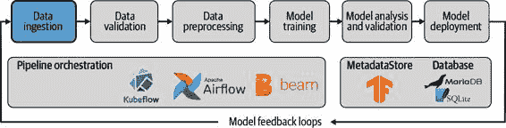
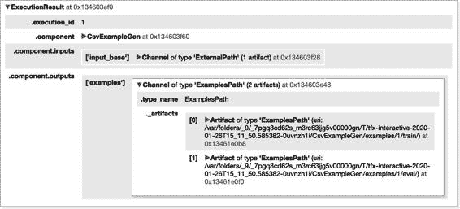

# 第三章：数据摄取

通过基本的 TFX 设置和 ML MetadataStore，本章重点介绍了如何将您的数据集摄取到流水线中，以便在各个组件中使用，如图 3-1 所示。



图 3-1\. 作为 ML 流水线一部分的数据摄取

TFX 为我们提供了从文件或服务摄取数据的组件。在本章中，我们概述了底层概念，解释了如何将数据集拆分为训练和评估子集，并演示了如何将多个数据导出组合成一个全面的数据集。然后，我们讨论了摄取不同形式数据（结构化数据、文本和图像）的一些策略，这些策略在之前的使用案例中被证明是有帮助的。

数据摄取的概念

在我们的流水线的这一步骤中，我们从外部服务（例如 Google Cloud BigQuery）读取数据文件或请求数据以运行我们的流水线。在将摄取的数据传递给下一个组件之前，我们将可用数据分成单独的数据集（例如训练数据集和验证数据集），然后将数据集转换为包含以 `tf.Example` 数据结构表示的数据的 TFRecord 文件。

> TFRECORD
> 
> TFRecord 是一种针对流式传输大型数据集进行优化的轻量级格式。实际上，大多数 TensorFlow 用户在 TFRecord 文件中存储序列化的示例 Protocol Buffers，但 TFRecord 文件格式实际上支持任何二进制数据，如下所示：
> 
> `import``tensorflow``as``tf``with``tf``.``io``.``TFRecordWriter``(``"test.tfrecord"``)``as``w``:``w``.``write``(``b``"First record"``)``w``.``write``(``b``"Second record"``)``for``record``in``tf``.``data``.``TFRecordDataset``(``"test.tfrecord"``):``print``(``record``)``tf``.``Tensor``(``b``'First record'``,``shape``=``(),``dtype``=``string``)``tf``.``Tensor``(``b``'Second record'``,``shape``=``(),``dtype``=``string``)`
> 
> 如果 TFRecord 文件包含 `tf.Example` 记录，每个记录都包含一个或多个特征，这些特征代表我们数据中的列。然后，数据以可以高效消化的二进制文件形式存储。如果您对 TFRecord 文件的内部机制感兴趣，我们建议参阅[TensorFlow 文档](https://oreil.ly/2-MuJ)。
> 
> 将数据存储为 TFRecord 和 `tf.Examples` 提供了一些好处：
> 
1.  > > > > 该数据结构与系统无关，因为它依赖于 Protocol Buffers，这是一个跨平台、跨语言的库，用于序列化数据。
1.  > > > > 
1.  > > > > TFRecord 优化了快速下载或写入大量数据的能力。
1.  > > > > 
1.  > > > > `tf.Example`，在 TFRecord 中代表每个数据行的数据结构，也是 TensorFlow 生态系统中的默认数据结构，因此在所有 TFX 组件中都被使用。

摄取、拆分和转换数据集的过程由 `ExampleGen` 组件执行。正如我们在下面的示例中看到的那样，数据集可以从本地和远程文件夹中读取，也可以从像 Google Cloud BigQuery 这样的数据服务中请求。

摄取本地数据文件

`ExampleGen` 组件可以摄取几种数据结构，包括逗号分隔值文件（CSV）、预计算的 TFRecord 文件以及 Apache Avro 和 Apache Parquet 的序列化输出。

将逗号分隔数据转换为 tf.Example

结构化数据或文本数据的数据集通常存储在 CSV 文件中。TFX 提供功能来读取和转换这些文件为 `tf.Example` 数据结构。以下代码示例演示了如何摄取包含我们示例项目 CSV 数据的文件夹：

> `import``os``from``tfx.components``import``CsvExampleGen``from``tfx.utils.dsl_utils``import``external_input``base_dir``=``os``.``getcwd``()``data_dir``=``os``.``path``.``join``(``os``.``pardir``,``"data"``)``examples``=``external_input``(``os``.``path``.``join``(``base_dir``,``data_dir``))``example_gen``=``CsvExampleGen``(``input``=``examples``)``context``.``run``(``example_gen``)`


> > 定义数据路径。


> > 实例化管道组件。


> > 执行组件的交互操作。

如果您将组件作为交互式管道的一部分执行，则运行的元数据将显示在 Jupyter Notebook 中。组件的输出显示在 图 3-2 中，突出显示了训练和评估数据集的存储位置。



图 3-2\. `ExampleGen` 组件输出

> 文件夹结构
> 
> 预期 `ExampleGen` 的输入路径仅包含数据文件。组件尝试消耗路径级别内的所有现有文件。任何额外的文件（例如元数据文件）无法被组件消耗，并导致组件步骤失败。该组件也不会遍历现有的子目录，除非配置为输入模式。

导入现有的 TFRecord 文件

有时我们的数据无法有效表示为 CSV（例如，当我们想要加载用于计算机视觉问题的图像或用于自然语言处理问题的大语料库时）。在这些情况下，建议将数据集转换为 TFRecord 数据结构，然后使用 `ImportExampleGen` 组件加载保存的 TFRecord 文件。如果您希望作为管道的一部分将数据转换为 TFRecord 文件，请参阅 第十章，我们将讨论自定义 TFX 组件的开发，包括数据摄取组件。TFRecord 文件可以如以下示例所示进行摄取：

> `import``os``from``tfx.components``import``ImportExampleGen``from``tfx.utils.dsl_utils``import``external_input``base_dir``=``os``.``getcwd``()``data_dir``=``os``.``path``.``join``(``os``.``pardir``,``"tfrecord_data"``)``examples``=``external_input``(``os``.``path``.``join``(``base_dir``,``data_dir``))``example_gen``=``ImportExampleGen``(``input``=``examples``)``context``.``run``(``example_gen``)`

由于数据集已经以 TFRecord 文件中的`tf.Example`记录的形式存储，因此可以导入而无需转换。`ImportExampleGen`组件处理此导入步骤。

将 Parquet 序列化数据转换为 tf.Example

在第二章中，我们讨论了 TFX 组件的内部架构和组件的行为，其驱动力是其`executor`。如果我们想要将新的文件类型加载到我们的流水线中，我们可以覆盖`executor_class`，而不是编写全新的组件。

TFX 包括用于加载不同文件类型的`executor`类，包括 Parquet 序列化数据。以下示例显示了如何覆盖`executor_class`以更改加载行为。而不是使用`CsvExampleGen`或`ImportExampleGen`组件，我们将使用通用文件加载器组件`FileBasedExampleGen`，允许覆盖`executor_class`：

> `from``tfx.components``import``FileBasedExampleGen``from``tfx.components.example_gen.custom_executors``import``parquet_executor``from``tfx.utils.dsl_utils``import``external_input``examples``=``external_input``(``parquet_dir_path``)``example_gen``=``FileBasedExampleGen``(``input``=``examples``,``executor_class``=``parquet_executor``.``Executor``)`


> > 导入通用文件加载器组件。


> > 导入特定于 Parquet 的执行器。


> > 覆盖执行器。

将 Avro 序列化数据转换为 tf.Example

覆盖`executor_class`的概念当然可以扩展到几乎任何其他文件类型。TFX 提供了额外的类，如下例所示，用于加载 Avro 序列化数据：

> `from``tfx.components``import``FileBasedExampleGen``from``tfx.components.example_gen.custom_executors``import``avro_executor``from``tfx.utils.dsl_utils``import``external_input``examples``=``external_input``(``avro_dir_path``)``example_gen``=``FileBasedExampleGen``(``input``=``examples``,``executor_class``=``avro_executor``.``Executor``)`


> > 导入通用文件加载器组件。


> > 导入特定于 Avro 的执行器。


> > 覆盖执行器。

如果我们想要加载不同的文件类型，可以编写特定于我们文件类型的自定义执行器，并应用之前覆盖执行器的相同概念。在第十章中，我们将向您介绍如何编写自己的自定义数据摄入组件和执行器的两个示例。

将自定义数据转换为 TFRecord 数据结构

有时，将现有数据集转换为 TFRecord 数据结构，然后如我们在“导入现有 TFRecord 文件”中讨论的那样使用`ImportExampleGen`组件导入，比较简单。如果我们的数据不通过允许高效数据流的数据平台可用，这种方法尤其有用。例如，如果我们正在训练计算机视觉模型并将大量图像加载到管道中，我们首先必须将图像转换为 TFRecord 数据结构（稍后在“用于计算机视觉问题的图像数据”一节中详细介绍）。

在以下示例中，我们将结构化数据转换为 TFRecord 数据结构。想象一下，我们的数据不是以 CSV 格式提供的，只能使用 JSON 或 XML 格式。在使用`ImportExampleGen`组件将这些数据导入管道之前，可以使用以下示例（稍作修改）转换这些数据格式。

要将任何类型的数据转换为 TFRecord 文件，我们需要为数据集中的每个数据记录创建一个`tf.Example`结构。`tf.Example`是一个简单但非常灵活的数据结构，它是一个键值映射：

> `{``"string"``:``value``}`

对于 TFRecord 数据结构，`tf.Example`期望一个`tf.Features`对象，该对象接受包含键值对的特征字典。键始终是表示特征列的字符串标识符，值是`tf.train.Feature`对象。

示例 3-1. TFRecord 数据结构

`Record 1: tf.Example     tf.Features         'column A': tf.train.Feature         'column B': tf.train.Feature         'column C': tf.train.Feature`

`tf.train.Feature`允许三种数据类型：

+   > > > > `tf.train.BytesList`
+   > > > > 
+   > > > > `tf.train.FloatList`
+   > > > > 
+   > > > > `tf.train.Int64List`

为了减少代码冗余，我们将定义辅助函数来帮助将数据记录转换为`tf.Example`所使用的正确数据结构：

> `import``tensorflow``as``tf``def``_bytes_feature``(``value``):``return``tf``.``train``.``Feature``(``bytes_list``=``tf``.``train``.``BytesList``(``value``=``[``value``]))``def``_float_feature``(``value``):``return``tf``.``train``.``Feature``(``float_list``=``tf``.``train``.``FloatList``(``value``=``[``value``]))``def``_int64_feature``(``value``):``return``tf``.``train``.``Feature``(``int64_list``=``tf``.``train``.``Int64List``(``value``=``[``value``]))`

在放置了辅助函数之后，让我们看看如何将演示数据集转换为包含 TFRecord 数据结构的文件。首先，我们需要读取原始数据文件，并将每个数据记录转换为`tf.Example`数据结构，然后将所有记录保存在 TFRecord 文件中。以下代码示例是简略版本。完整示例可以在书的[GitHub 存储库](https://oreil.ly/bmlp-git-convert_data_to_tfrecordspy)的章节/data_ingestion 中找到。

> `import``csv``import``tensorflow``as``tf``original_data_file``=``os``.``path``.``join``(``os``.``pardir``,``os``.``pardir``,``"data"``,``"consumer-complaints.csv"``)``tfrecord_filename``=``"consumer-complaints.tfrecord"``tf_record_writer``=``tf``.``io``.``TFRecordWriter``(``tfrecord_filename``)``with``open``(``original_data_file``)``as``csv_file``:``reader``=``csv``.``DictReader``(``csv_file``,``delimiter``=``","``,``quotechar``=``'"'``)``for``row``in``reader``:``example``=``tf``.``train``.``Example``(``features``=``tf``.``train``.``Features``(``feature``=``{``"product"``:``_bytes_feature``(``row``[``"product"``]),``"sub_product"``:``_bytes_feature``(``row``[``"sub_product"``]),``"issue"``:``_bytes_feature``(``row``[``"issue"``]),``"sub_issue"``:``_bytes_feature``(``row``[``"sub_issue"``]),``"state"``:``_bytes_feature``(``row``[``"state"``]),``"zip_code"``:``_int64_feature``(``int``(``float``(``row``[``"zip_code"``]))),``"company"``:``_bytes_feature``(``row``[``"company"``]),``"company_response"``:``_bytes_feature``(``row``[``"company_response"``]),``"consumer_complaint_narrative"``:` `\` `_bytes_feature``(``row``[``"consumer_complaint_narrative"``]),``"timely_response"``:``_bytes_feature``(``row``[``"timely_response"``]),``"consumer_disputed"``:``_bytes_feature``(``row``[``"consumer_disputed"``]),``}))``tf_record_writer``.``write``(``example``.``SerializeToString``())``tf_record_writer``.``close``()


> > 创建了一个 `TFRecordWriter` 对象，保存在 `tfrecord_filename` 指定的路径中。


> > `tf.train.Example` 适用于每个数据记录


> > 序列化数据结构

生成的 TFRecord 文件 consumer-complaints.tfrecord 现在可以使用 `ImportExampleGen` 组件导入。

从远程数据文件中摄取

`ExampleGen` 组件可以从像 Google Cloud Storage 或 AWS Simple Storage Service (S3) 这样的远程云存储桶中读取文件。1 TFX 用户可以像下面的例子一样向 `external_input` 函数提供存储桶路径：

> `examples``=``external_input``(``"gs://example_compliance_data/"``)``example_gen``=``CsvExampleGen``(``input``=``examples``)`

访问私有云存储桶需要设置云服务提供商的凭证。设置是特定于提供商的。AWS 通过用户特定的访问密钥和访问密钥进行用户身份验证。要访问私有 AWS S3 存储桶，需要创建用户访问密钥和密钥。2 相反，Google Cloud Platform (GCP) 通过服务帐号对用户进行身份验证。要访问私有 GCP 存储桶，需要创建具有访问存储桶权限的服务帐号文件。3

直接从数据库摄取数据

TFX 提供了两个组件，直接从数据库摄取数据集。在以下部分，我们介绍了 `BigQueryExampleGen` 组件用于查询 BigQuery 表中的数据，以及 `PrestoExampleGen` 组件用于查询 Presto 数据库中的数据。

Google Cloud BigQuery

TFX 提供了一个组件，用于从 Google Cloud 的 BigQuery 表中摄取数据。如果我们在 GCP 生态系统中执行机器学习流水线，这是摄取结构化数据非常高效的方式。

> GOOGLE CLOUD 凭证
> 
> 执行 `BigQueryExampleGen` 组件需要在本地环境中设置必要的 Google Cloud 凭证。我们需要创建一个带有所需角色（至少是 BigQuery 数据查看器和 BigQuery 作业用户）的服务账号。如果在交互式环境中使用 Apache Beam 或 Apache Airflow 执行组件，则必须通过环境变量 `GOOGLE_APPLICATION_CREDENTIALS` 指定服务账号凭证文件的路径，如下面的代码片段所示。如果通过 Kubeflow Pipelines 执行组件，可以通过引入的 OpFunc 函数提供服务账号信息，详见“OpFunc 函数”。
> 
> 您可以在 Python 中使用以下方式实现：
> 
> `import``os``os``.``environ``[``"GOOGLE_APPLICATION_CREDENTIALS"``]``=``"/path/to/credential_file.json"`
> 
> 有关更多详细信息，请参阅[Google Cloud 文档](https://oreil.ly/EPEs3)。

下面的示例展示了查询我们的 BigQuery 表的最简单方法：

> `from``tfx.components``import``BigQueryExampleGen``query``=``"""```     SELECT * FROM `<project_id>.<database>.<table_name>` ```"""``example_gen``=``BigQueryExampleGen``(``query``=``query``)`

当然，我们可以创建更复杂的查询来选择我们的数据，例如，连接多个表。

> BIGQUERYEXAMPLEGEN 组件的更改
> 
> 在 TFX 版本大于 0.22.0 时，需要从 `tfx.extensions.google_cloud_big_query` 导入 `BigQueryExampleGen` 组件：
> 
> > `from``tfx.extensions.google_cloud_big_query.example_gen` `\` `import``component``as``big_query_example_gen_component``big_query_example_gen_component``.``BigQueryExampleGen``(``query``=``query``)`

Presto 数据库

如果我们想要从 Presto 数据库摄取数据，可以使用 `PrestoExampleGen`。其用法与 `BigQueryExampleGen` 非常类似，我们定义了一个数据库查询，然后执行该查询。`PrestoExampleGen` 组件需要额外的配置来指定数据库的连接详细信息：

> `from``proto``import``presto_config_pb2``from``presto_component.component``import``PrestoExampleGen``query``=``"""```     SELECT * FROM `<project_id>.<database>.<table_name>` ```"""``presto_config``=``presto_config_pb2``.``PrestoConnConfig``(``host``=``'localhost'``,``port``=``8080``)``example_gen``=``PrestoExampleGen``(``presto_config``,``query``=``query``)`
> 
> PRESTOEXAMPLEGEN 需要单独安装
> 
> 自 TFX 版本 0.22 以来，PrestoExampleGen 需要单独的安装过程。安装`protoc`编译器后，4 您可以按以下步骤从源代码安装组件：
> 
> > `$` `git clone git@github.com:tensorflow/tfx.git` `&&``cd` `tfx/` `$` `git checkout v0.22.0` `$` `cd` `tfx/examples/custom_components/presto_example_gen` `$` `pip install -e .`
> > 
> 安装完成后，您将能够导入 PrestoExampleGen 组件及其协议缓冲区定义。

数据准备

每个引入的`ExampleGen`组件都允许我们配置数据集的输入设置（`input_config`）和输出设置（`output_config`）。如果我们想增量摄入数据集，可以将一个时间跨度定义为输入配置。同时，我们可以配置数据应如何拆分。通常，我们希望生成一个训练集以及一个评估和测试集。我们可以通过输出配置定义详细信息。

分割数据集

在我们的管道中稍后，我们希望在训练期间评估我们的机器学习模型，并在模型分析步骤中测试它。因此，将数据集拆分为所需的子集是有益的。

将一个数据集拆分成子集

以下示例显示了如何通过需要三向拆分来扩展我们的数据摄入：训练、评估和测试集，比例为 6:2:2。比例设置通过`hash_buckets`定义：

> `from``tfx.components``import``CsvExampleGen``from``tfx.proto``import``example_gen_pb2``from``tfx.utils.dsl_utils``import``external_input``base_dir``=``os``.``getcwd``()``data_dir``=``os``.``path``.``join``(``os``.``pardir``,``"data"``)``output``=``example_gen_pb2``.``Output``(``split_config``=``example_gen_pb2``.``SplitConfig``(``splits``=````example_gen_pb2``.``SplitConfig``.``Split``(``name``=``'eval'``,``hash_buckets``=``2``),``example_gen_pb2``.``SplitConfig``.``Split``(``name``=``'test'``,``hash_buckets``=``2``)``]))``examples``=``external_input``(``os``.``path``.``join``(``base_dir``,``data_dir``))``example_gen``=``CsvExampleGen``(``input``=``examples``,``output_config``=``output``)``context``.``run``(``example_gen``)`


> > 定义首选拆分。


> > 指定比例。


> > 添加`output_config`参数。

在执行`example_gen`对象后，我们可以通过打印生成的艺术品列表来检查生成的艺术品：

> `for``artifact``in``example_gen``.``outputs``[``'examples'``]``.``get``():``print``(``artifact``)``Artifact``(``type_name``:``ExamplesPath``,``uri``:``/``path``/``to``/``CsvExampleGen``/``examples``/``1``/``train``/``,``split``:``train``,``id``:``2``)``Artifact``(``type_name``:``ExamplesPath``,``uri``:``/``path``/``to``/``CsvExampleGen``/``examples``/``1``/``eval``/``,``split``:``eval``,``id``:``3``)``Artifact``(``type_name``:``ExamplesPath``,``uri``:``/``path``/``to``/``CsvExampleGen``/``examples``/``1``/``test``/``,``split``:``test``,``id``:``4``)`

在接下来的章节中，我们将讨论如何调查我们数据管道中产生的数据集。

> 默认拆分
> 
> 如果我们没有指定任何输出配置，`ExampleGen` 组件默认将数据集拆分为训练集和评估集，比例为 2:1。

保留现有的拆分

在某些情况下，我们已经在外部生成了数据集的子集，并且在摄取数据集时希望保留这些拆分。我们可以通过提供输入配置来实现这一点。

对于以下配置，让我们假设我们的数据集已经被外部拆分并保存在子目录中：

> `└── data    ├── train     │   └─ 20k-consumer-complaints-training.csv     ├──` `eval` `│   └─ 4k-consumer-complaints-eval.csv     └──` `test` `└─ 2k-consumer-complaints-test.csv`

我们可以通过定义以下输入配置来保留现有的输入拆分：

> `import``os``from``tfx.components``import``CsvExampleGen``from``tfx.proto``import``example_gen_pb2``from``tfx.utils.dsl_utils``import``external_input``base_dir``=``os``.``getcwd``()``data_dir``=``os``.``path``.``join``(``os``.``pardir``,``"data"``)``input``=``example_gen_pb2``.``Input``(``splits``=````example_gen_pb2``.``Input``.``Split``(``name``=``'train'``,``pattern``=``'train/*'``),`![`example_gen_pb2``.``Input``.``Split``(``name``=``'eval'``,``pattern``=``'eval/*'``),``example_gen_pb2``.``Input``.``Split``(``name``=``'test'``,``pattern``=``'test/*'``)``])``examples``=``external_input``(``os``.``path``.``join``(``base_dir``,``data_dir``))``example_gen``=``CsvExampleGen``(``input``=``examples``,``input_config``=``input``)`


> > 设置现有子目录。


> > 添加 `input_config` 参数。

定义了输入配置后，我们可以通过定义 `input_config` 参数将设置传递给 `ExampleGen` 组件。

数据集跨度

机器学习流水线的一个重要用例是当新数据可用时，我们可以更新我们的机器学习模型。对于这种情况，`ExampleGen` 组件允许我们使用 spans。将 span 视为数据的快照。每小时、每天或每周，批量提取、转换、加载 (ETL) 过程可以生成这样的数据快照并创建一个新的 span。

跨度可以复制现有的数据记录。如下所示，`export-1`包含了前一个`export-0`的数据，以及自`export-0`导出后新增的记录：

> `└── data     ├──` `export``-0     │   └─ 20k-consumer-complaints.csv     ├──` `export``-1     │   └─ 24k-consumer-complaints.csv     └──` `export``-2         └─ 26k-consumer-complaints.csv`

现在，我们可以指定跨度的模式。输入配置接受一个`{SPAN}`占位符，表示在我们的文件夹结构中显示的数字（0、1、2 等）。通过输入配置，`ExampleGen`组件现在选择“最新”的跨度。在我们的示例中，这将是文件夹`export-2`下的可用数据：

> `from``tfx.components``import``CsvExampleGen``from``tfx.proto``import``example_gen_pb2``from``tfx.utils.dsl_utils``import``external_input``base_dir``=``os``.``getcwd``()``data_dir``=``os``.``path``.``join``(``os``.``pardir``,``"data"``)``input``=``example_gen_pb2``.``Input``(``splits``=``[``example_gen_pb2``.``Input``.``Split``(``pattern``=``'export-{SPAN}/*'``)``])``examples``=``external_input``(``os``.``path``.``join``(``base_dir``,``data_dir``))``example_gen``=``CsvExampleGen``(``input``=``examples``,``input_config``=``input``)``context``.``run``(``example_gen``)`

当然，如果数据已经分割，输入定义也可以定义子目录：

> `input``=``example_gen_pb2``.``Input``(``splits``=``[``example_gen_pb2``.``Input``.``Split``(``name``=``'train'``,``pattern``=``'export-{SPAN}/train/*'``),``example_gen_pb2``.``Input``.``Split``(``name``=``'eval'``,``pattern``=``'export-{SPAN}/eval/*'``)``])`

数据集版本化

在机器学习流水线中，我们希望跟踪生成的模型以及用于训练机器学习模型的数据集。为了做到这一点，版本化我们的数据集非常有用。

数据版本控制允许我们更详细地跟踪摄入的数据。这意味着我们不仅在 ML MetadataStore 中存储摄入数据的文件名和路径（因为当前由 TFX 组件支持），还跟踪关于原始数据集的更多元信息，例如摄入数据的哈希值。这样的版本跟踪可以确保在训练期间使用的数据集在稍后的时间点仍然是相同的数据集。这种功能对端到端 ML 可重现性至关重要。

然而，TFX 的`ExampleGen`组件目前不支持此功能。如果您希望对数据集进行版本化，可以使用第三方数据版本控制工具，并在数据集摄入流水线之前对数据进行版本化。不幸的是，目前没有可用的工具会直接将元数据信息写入 TFX 的 ML MetadataStore 中。

如果您希望对数据集进行版本控制，可以使用以下其中之一的工具：

[数据版本控制（DVC）](https://dvc.org)

> > DVC 是一个用于机器学习项目的开源版本控制系统。它允许您提交数据集的哈希而不是整个数据集本身。因此，数据集的状态被跟踪（例如通过`git`），但存储库不会因整个数据集而杂乱。

[厚皮象](https://www.pachyderm.com)

> > Pachyderm 是一个运行在 Kubernetes 上的开源机器学习平台。它最初是基于数据版本控制概念而起的（“数据的 Git”），但现在已扩展为包括基于数据版本的流水线编排在内的整个数据平台。

注入策略

到目前为止，我们已经讨论了多种将数据注入到机器学习流水线中的方法。如果您从头开始一个全新的项目，选择合适的数据注入策略可能会让人感到不知所措。在接下来的章节中，我们将为三种数据类型（结构化数据、文本数据和图像数据）提供一些建议。

结构化数据

结构化数据通常存储在数据库中或以支持表格数据的文件格式存储在磁盘上。如果数据存在于数据库中，我们可以将其导出为 CSV，或直接使用`PrestoExampleGen`或`BigQueryExampleGen`组件（如果服务可用）消耗数据。

存储在支持表格数据的文件格式中的磁盘上的数据应转换为 CSV，并使用`CsvExampleGen`组件将其注入到流水线中。如果数据量超过几百兆字节，应考虑将数据转换为 TFRecord 文件或使用 Apache Parquet 存储数据。

自然语言问题的文本数据

文本语料库的大小可能会迅速增加。为了有效地注入这些数据集，我们建议将数据集转换为 TFRecord 或 Apache Parquet 表示形式。使用性能良好的数据文件类型可以实现语料库文档的高效和增量加载。也可以从数据库中注入语料库，但建议考虑网络流量成本和瓶颈问题。

计算机视觉问题的图像数据

推荐将图像数据集从图像文件转换为 TFRecord 文件，但不要解码图像。对高度压缩的图像进行解码只会增加存储中间`tf.Example`记录所需的磁盘空间。压缩图像可以作为字节字符串存储在`tf.Example`记录中：

> `import``tensorflow``as``tf``base_path``=``"/path/to/images"``filenames``=``os``.``listdir``(``base_path``)``def``generate_label_from_path``(``image_path``):``...``return``label``def``_bytes_feature``(``value``):``return``tf``.``train``.``Feature``(``bytes_list``=``tf``.``train``.``BytesList``(``value``=``[``value``]))``def``_int64_feature``(``value``):``return``tf``.``train``.``Feature``(``int64_list``=``tf``.``train``.``Int64List``(``value``=``[``value``]))``tfrecord_filename``=``'data/image_dataset.tfrecord'``with``tf``.``io``.``TFRecordWriter``(``tfrecord_filename``)``as``writer``:``for``img_path``in``filenames``:``image_path``=``os``.``path``.``join``(``base_path``,``img_path``)``try``:``raw_file``=``tf``.``io``.``read_file``(``image_path``)``except``FileNotFoundError``:``print``(``"File {} could not be found"``.``format``(``image_path``))``continue``example``=``tf``.``train``.``Example``(``features``=``tf``.``train``.``Features``(``feature``=``{``'image_raw'``:``_bytes_feature``(``raw_file``.``numpy``()),``'label'``:``_int64_feature``(``generate_label_from_path``(``image_path``))``}))``writer``.``write``(``example``.``SerializeToString``())`

示例代码从提供的路径 `/path/to/images` 读取图像，并将图像存储为字节字符串放入 `tf.Example` 中。我们当前阶段不对图像进行预处理。尽管这样可能节省大量磁盘空间，但我们希望稍后在管道中执行这些任务。当前阶段避免预处理有助于避免后续训练/服务偏差的错误。

我们在 `tf.Examples` 中存储原始图像及其标签。我们通过示例中的 `generate_label_from_path` 函数从文件名中派生每个图像的标签。由于标签生成是特定于数据集的，因此我们没有在此示例中包含它。

将图像转换为 TFRecord 文件后，我们可以使用 `ImportExampleGen` 组件高效地消费数据集，并应用我们在“导入现有 TFRecord 文件”中讨论的相同策略。

摘要

在本章中，我们讨论了将数据输入到机器学习管道中的各种方法。我们强调了从磁盘和数据库中存储的数据集的消费。在此过程中，我们还讨论了转换为 `tf.Example`（存储在 TFRecord 文件中）的摄取数据记录，以便下游组件消费。

在接下来的章节中，我们将看看如何在管道的数据验证步骤中消费生成的 `tf.Example` 记录。

> 1   从 AWS S3 读取文件需要 Apache Beam 2.19 或更高版本，这是 TFX 版本 0.22 开始支持的。
> 
> 2   有关如何管理 AWS 访问密钥的更多详细信息，请参阅[文档](https://oreil.ly/Dow7L)。
> 
> 3   有关如何创建和管理服务帐户的更多详细信息，请参阅[文档](https://oreil.ly/6y8WX)。
> 
> 4   访问 proto-lens GitHub 了解 [关于 `protoc` 安装的详细信息](https://oreil.ly/h6FtO)。
