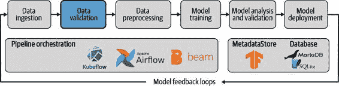
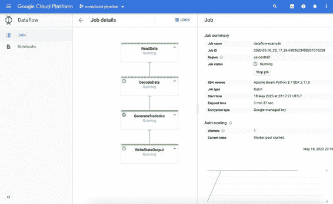

# 第四章：数据验证

在第三章中，我们讨论了如何将数据从各种来源导入我们的管道。在本章中，我们现在想要通过验证数据开始消耗数据，如图 4-1 所示。

图 4-1\. 数据验证作为 ML 管道的一部分

数据是每个机器学习模型的基础，模型的实用性和性能取决于用于训练、验证和分析模型的数据。正如你可以想象的那样，没有健壮的数据，我们就无法构建健壮的模型。用口头表达来说，你可能听过这样的短语：“垃圾进，垃圾出”—这意味着如果底层数据没有经过精心策划和验证，我们的模型将无法表现出色。这正是我们机器学习管道中第一个工作流步骤的确切目的：数据验证。

在本章中，我们首先推动数据验证的概念，然后向您介绍了 TensorFlow Extended 生态系统中名为 TensorFlow 数据验证（TFDV）的 Python 包。我们展示了如何在您的数据科学项目中设置这个包，引导您通过常见的用例，并突出一些非常有用的工作流程。

数据验证步骤检查您的管道中的数据是否符合您的特征工程步骤期望的数据。它帮助您比较多个数据集。它还突出显示如果您的数据随时间变化，例如，如果您的训练数据与为您的模型提供推断的新数据显著不同。

在本章末尾，我们将我们的第一个工作流步骤整合到我们的 TFX 管道中。

为什么需要数据验证？

在机器学习中，我们试图从数据集中学习模式并推广这些学习。这使得数据在我们的机器学习工作流程中占据了核心位置，数据的质量对我们的机器学习项目的成功至关重要。

我们机器学习管道中的每一步都决定了工作流是否可以进入下一步，或者整个工作流是否需要被放弃并重新启动（例如，使用更多的训练数据）。数据验证是一个特别重要的检查点，因为它在数据进入耗时的预处理和训练步骤之前捕捉到数据的变化。

如果我们的目标是自动化我们的机器学习模型更新，验证我们的数据就是必不可少的。特别是，当我们说验证时，我们指的是对我们的数据进行三个不同的检查：

+   > > > > 检查数据异常。
+   > > > > 
+   > > > > 检查数据模式是否发生了变化。
+   > > > > 
+   > > > > 检查我们新数据集的统计数据是否仍然与我们之前的训练数据集的统计数据保持一致。

我们管道中的数据验证步骤执行这些检查并突出显示任何失败。如果检测到失败，我们可以停止工作流程，并手动解决数据问题，例如，策划一个新的数据集。

从数据处理步骤到数据验证步骤，这也是有用的。数据验证可以生成关于数据特征的统计信息，并突出显示特征是否包含高百分比的缺失值或特征是否高度相关。在决定哪些特征应包含在预处理步骤中以及预处理的形式应该是什么时，这些信息非常有用。

数据验证让您可以比较不同数据集的统计信息。这一简单步骤可以帮助您调试模型问题。例如，数据验证可以比较您的训练数据与验证数据的统计信息。几行代码就可以把任何差异带给您的注意。您可能使用完美的标签分布训练二元分类模型，其中正标签和负标签分别占 50%，但您的验证集中标签分布并非 50/50。标签分布的这种差异最终会影响您的验证指标。

在数据集持续增长的世界中，数据验证对确保我们的机器学习模型仍能胜任任务至关重要。因为我们可以比较模式，我们可以快速检测到新获得的数据集中的数据结构是否发生了变化（例如当特征被弃用时）。它还可以检测您的数据是否开始漂移。这意味着您新收集的数据具有与用于训练模型的初始数据集不同的底层统计信息。漂移可能意味着需要选择新特征或更新数据预处理步骤（例如，如果数值列的最小值或最大值发生变化）。数据漂移可能由多种原因引起：数据中的潜在趋势、数据的季节性，或者由于反馈循环而导致的，正如我们在 第十三章 中讨论的那样。

在接下来的章节中，我们将详细讨论这些不同的使用案例。但在此之前，让我们看一下安装 TFDV 并使其运行所需的步骤。

TFDV

TensorFlow 生态系统提供了一个可以帮助您进行数据验证的工具，TFDV。它是 TFX 项目的一部分。TFDV 允许您执行我们之前讨论过的各种分析（例如生成模式并验证新数据与现有模式的匹配性）。它还基于 Google PAIR 项目 [Facets](https://oreil.ly/ZXbqa) 提供可视化，如 图 4-2 所示。

TFDV 接受两种输入格式来开始数据验证：TensorFlow 的 TFRecord 和 CSV 文件。与其他 TFX 组件一样，它使用 Apache Beam 进行分析分布。

图 4-2\. TFDV 可视化的屏幕截图

安装

当我们安装了 第二章 中介绍的 `tfx` 包时，TFDV 已经作为依赖包安装了。如果我们想单独使用 TFDV 包，可以使用以下命令进行安装：

> `$` `pip install tensorflow-data-validation`

安装了`tfx`或`tensorflow-data-validation`之后，我们现在可以将数据验证集成到您的机器学习工作流程中，或者在 Jupyter Notebook 中对数据进行可视化分析。我们将在以下几节中讨论一些用例。

从您的数据生成统计信息。

我们数据验证流程的第一步是为数据生成一些摘要统计信息。例如，我们可以直接使用 TFDV 加载我们的消费者投诉 CSV 数据，并为每个特征生成统计信息。

> `import``tensorflow_data_validation``as``tfdv``stats``=``tfdv``.``generate_statistics_from_csv``(``data_location``=``'/data/consumer_complaints.csv'``,``delimiter``=``','``)`

我们可以使用以下代码从 TFRecord 文件生成特征统计，方法类似。

> `stats``=``tfdv``.``generate_statistics_from_tfrecord``(``data_location``=``'/data/consumer_complaints.tfrecord'``)`

我们讨论如何在第三章中生成 TFRecord 文件。

TFDV 的两种方法都生成一个数据结构，用于存储每个特征的摘要统计信息，包括最小、最大和平均值。

数据结构如下所示：

> `datasets``{``num_examples``:``66799``features``{``type``:``STRING``string_stats``{``common_stats``{``num_non_missing``:``66799``min_num_values``:``1``max_num_values``:``1``avg_num_values``:``1.0``num_values_histogram``{``buckets``{``low_value``:``1.0``high_value``:``1.0``sample_count``:``6679.9``...``}}}}}}`

对于数值特征，TFDV 为每个特征计算：

+   > > > > 数据记录的总数。
+   > > > > 
+   > > > > 缺失数据记录的数量。
+   > > > > 
+   > > > > 数据记录中特征的均值和标准差。
+   > > > > 
+   > > > > 数据记录中特征的最小值和最大值。
+   > > > > 
+   > > > > 数据记录中特征零值的百分比。

此外，它还为每个特征的值生成直方图。

对于分类特征，TFDV 提供以下内容：

+   > > > > 数据记录的总数。
+   > > > > 
+   > > > > 缺失数据记录的百分比。
+   > > > > 
+   > > > > 唯一记录的数量。
+   > > > > 
+   > > > > 所有记录中特征的平均字符串长度。
+   > > > > 
+   > > > > 对于每个类别，TFDV 确定每个标签的样本计数及其排名。

稍后，您将看到我们如何将这些统计数据转化为可操作的内容。

从您的数据生成模式。

生成摘要统计信息后，下一步是生成数据集的模式。数据模式描述数据集的表示形式。模式定义了数据集中预期包含的特征以及每个特征的类型（浮点数、整数、字节等）。此外，您的模式应定义数据的边界（例如，特征的允许缺失记录的最小值、最大值和阈值）。

您数据集的模式定义随后可用于验证未来数据集，以确定它们是否符合先前训练集的要求。TFDV 生成的模式还可用于以下工作流步骤，即在预处理数据集以转换为可用于训练机器学习模型的数据时使用。

如下所示，您可以通过单个函数调用从生成的统计信息中生成模式信息：

> `schema``=``tfdv``.``infer_schema``(``stats``)`

`tfdv.infer_schema` 生成了 TensorFlow 定义的模式协议：1

> `feature``{``name``:``"product"``type``:``BYTES``domain``:``"product"``presence``{``min_fraction``:``1.0``min_count``:``1``}``shape``{``dim``{``size``:``1``}``}``}`

您可以在任何 Jupyter Notebook 中通过单个函数调用显示模式：

> `tfdv``.``display_schema``(``schema``)`

并且结果显示在 Figure 4-3 中。

图 4-3\. 模式可视化截图

在此可视化中，`Presence` 表示特征是否必须存在于 100%的数据示例中（`required`）或不需要（`optional`）。`Valency` 表示每个训练示例所需的值的数量。对于分类特征，`single` 意味着每个训练示例必须具有该特征的一个类别。

此处生成的模式可能并不完全符合我们的需求，因为它假设当前数据集完全代表所有未来数据。如果某个特征在此数据集中的所有训练示例中都存在，它将被标记为`required`，但实际上它可能是`optional`。我们将展示如何根据您对数据集的了解更新模式在 “更新模式” 中。

现在定义了模式后，我们可以比较我们的训练或评估数据集，或者检查可能影响我们模型的任何问题。

发现您数据中的问题

在前面的部分中，我们讨论了如何为我们的数据生成摘要统计信息和模式。这些描述了我们的数据，但并没有发现其中的潜在问题。在接下来的几个部分中，我们将描述 TFDV 如何帮助我们发现数据中的问题。

比较数据集

假设我们有两个数据集：训练数据集和验证数据集。在训练我们的机器学习模型之前，我们想确定验证集在数据结构方面与训练集的代表性如何。验证数据是否遵循我们的训练数据模式？是否缺少任何特征列或大量特征值？使用 TFDV，我们可以快速确定答案。

如下所示，我们可以加载两个数据集，然后可视化这两个数据集。如果我们在 Jupyter Notebook 中执行以下代码，我们可以轻松比较数据集的统计信息：

> `train_stats``=``tfdv``.``generate_statistics_from_tfrecord``(``data_location``=``train_tfrecord_filename``)``val_stats``=``tfdv``.``generate_statistics_from_tfrecord``(``data_location``=``val_tfrecord_filename``)``tfdv``.``visualize_statistics``(``lhs_statistics``=``val_stats``,``rhs_statistics``=``train_stats``,``lhs_name``=``'VAL_DATASET'``,``rhs_name``=``'TRAIN_DATASET'``)`

图 4-4 展示了两个数据集之间的差异。例如，验证数据集（包含 4,998 条记录）中缺少`sub_issue`值的比率较低。这可能意味着该特征在验证集中的分布发生了变化。更重要的是，可视化显示超过一半的记录不包含`sub_issue`信息。如果`sub_issue`对我们的模型训练很重要，我们需要修复数据采集方法，以收集具有正确问题标识符的新数据。

我们先前生成的训练数据的架构现在非常有用。TFDV 允许我们根据架构验证任何数据统计，并报告任何异常。

图 4-4\. 训练集和验证集之间的比较

可以使用以下代码检测异常：

> `anomalies``=``tfdv``.``validate_statistics``(``statistics``=``val_stats``,``schema``=``schema``)`

然后，我们可以使用以下代码显示异常：

> `tfdv``.``display_anomalies``(``anomalies``)`

这显示了在表 4-1 中显示的结果。

表 4-1\. 在 Jupyter Notebook 中可视化异常

|  Feature name  |  Anomaly short description  |  Anomaly long description  |
| --- | --- | --- |
|  “company”  |  Column dropped  |  The feature was present in fewer examples than expected.  |

以下代码显示了底层的异常协议。这包含了我们可以用来自动化机器学习工作流程的有用信息：

> `anomaly_info``{``key``:``"company"``value``{``description``:``"The feature was present in fewer examples than expected."``severity``:``ERROR``short_description``:``"Column dropped"``reason``{``type``:``FEATURE_TYPE_LOW_FRACTION_PRESENT``short_description``:``"Column dropped"``description``:``"The feature was present in fewer examples than expected."``}``path``{``step``:``"company"``}``}``}`

更新架构

前面的异常协议显示了如何从我们的数据集自动生成的架构中检测到变化。但 TFDV 的另一个用例是根据我们对数据的领域知识手动设置架构。根据先前讨论的`sub_issue`特征，如果我们决定需要在我们的训练示例中要求此特征出现的百分比大于 90%，我们可以更新架构以反映这一点。

首先，我们需要从其序列化位置加载架构：

> `schema``=``tfdv``.``load_schema_text``(``schema_location``)`

然后，我们更新这个特定特征，以便在 90% 的情况下是必需的：

> `sub_issue_feature``=``tfdv``.``get_feature``(``schema``,``'sub_issue'``)``sub_issue_feature``.``presence``.``min_fraction``=``0.9`

我们还可以更新美国州列表以删除阿拉斯加：

> `state_domain``=``tfdv``.``get_domain``(``schema``,``'state'``)``state_domain``.``value``.``remove``(``'AK'``)`

一旦我们满意架构，我们将架构文件写入其序列化位置，步骤如下：

> `tfdv``.``write_schema_text``(``schema``,``schema_location``)`

然后我们需要重新验证统计信息以查看更新的异常情况：

> `updated_anomalies``=``tfdv``.``validate_statistics``(``eval_stats``,``schema``)``tfdv``.``display_anomalies``(``updated_anomalies``)`

通过这种方式，我们可以调整适合我们数据集的异常情况。2

数据倾斜和漂移

TFDV 提供了内置的“倾斜比较器”，用于检测两个数据集统计信息之间的大差异。这不是倾斜的统计定义（数据集围绕其均值不对称分布），在 TFDV 中定义为两个数据集的服务统计信息的 L-infinity 范数差异。如果两个数据集之间的差异超过给定特征的 L-infinity 范数阈值，TFDV 将使用本章前述的异常检测将其标记为异常。

> L-INFINITY NORM
> 
> L-infinity 范数是用于定义两个向量（在我们的案例中是服务统计信息）之间差异的表达式。L-infinity 范数定义为向量条目的最大绝对值。
> 
> 例如，向量[3, –10, –5]的 L-infinity 范数为 10。范数通常用于比较向量。如果我们希望比较向量[2, 4, –1]和[9, 1, 8]，我们首先计算它们的差异，即[–7, 3, –9]，然后计算此向量的 L-infinity 范数，结果为 9。
> 
> 在 TFDV 的情况下，这两个向量是两个数据集的摘要统计信息。返回的范数是这两组统计信息之间的最大差异。

以下代码展示了如何比较数据集之间的倾斜：

> `tfdv``.``get_feature``(``schema``,``'company'``)``.``skew_comparator``.``infinity_norm``.``threshold``=``0.01``skew_anomalies``=``tfdv``.``validate_statistics``(``statistics``=``train_stats``,``schema``=``schema``,``serving_statistics``=``serving_stats``)`

而表 4-2 展示了结果。

表 4-2\. 可视化展示训练和服务数据集之间的数据倾斜

|  特征名称  |  异常简短描述  |  异常详细描述  |
| --- | --- | --- |
|  “公司”  |  训练和服务之间的高 L-infinity 距离  |  训练和服务之间的 L-infinity 距离为 0.0170752（精确到六位有效数字），高于阈值 0.01。具有最大差异的特征值为：Experian  |

TFDV 还提供了一个 `drift_comparator`，用于比较同一类型的两个数据集的统计数据，例如在两个不同日期收集的两个训练集。如果检测到漂移，则数据科学家应检查模型架构或确定是否需要重新进行特征工程。

类似于这个偏斜的例子，你应该为你想观察和比较的特征定义你的 `drift_comparator`。然后，你可以使用两个数据集统计数据作为参数来调用 `validate_statistics`，一个用作基线（例如昨天的数据集），另一个用作比较（例如今天的数据集）：

> `tfdv``.``get_feature``(``schema``,``'公司'``)``.``drift_comparator``.``infinity_norm``.``threshold``=``0.01``drift_anomalies``=``tfdv``.``validate_statistics``(``statistics``=``train_stats_today``,``schema``=``schema``,``previous_statistics``=``\` `train_stats_yesterday``)

这导致了显示在 表 4-3 中的结果。

表 4-3\. 两个训练集之间数据漂移的可视化

|  特征名称  |  异常简短描述  |  异常详细描述  |
| --- | --- | --- |
|  “公司”  |  当前和上一次之间的高 L-infinity 距离  |  当前和上一次的 L-infinity 距离为 0.0170752（保留六个有效数字），超过了阈值 0.01\. 具有最大差异的特征值是：Experian  |

在 `skew_comparator` 和 `drift_comparator` 中的 L-infinity 范数对于显示数据集之间的大差异非常有用，特别是可能显示我们的数据输入管道存在问题的情况。因为 L-infinity 范数只返回一个单一的数字，模式可能更有用来检测数据集之间的变化。

偏倚数据集

输入数据集的另一个潜在问题是偏见。我们在这里定义偏见为在某种程度上不代表真实世界的数据。这与我们在 第七章 中定义的公平性形成对比，后者是我们模型在不同人群中产生不同影响的预测。

偏见可以通过多种方式进入数据。数据集始终是真实世界的子集，我们不可能希望捕捉所有细节。我们对真实世界的采样方式总是以某种方式存在偏差。我们可以检查的偏见类型之一是选择偏见，其中数据集的分布与真实世界数据的分布不同。

我们可以使用 TFDV 来检查选择偏见，使用我们之前描述的统计可视化工具。例如，如果我们的数据集包含 `Gender` 作为分类特征，我们可以检查它是否偏向于男性类别。在我们的消费者投诉数据集中，我们有 `State` 作为分类特征。理想情况下，不同美国州的示例计数分布应反映每个州的相对人口。

我们可以在图 4-5 中看到，情况并非如此（例如，德克萨斯州排名第三，其人口比排名第二的佛罗里达州更多）。如果我们发现数据中存在这种类型的偏差，并且我们相信这种偏差可能会损害我们模型的性能，我们可以回头收集更多数据或对数据进行过采样/欠采样，以获取正确的分布。

图 4-5\. 数据集中一个有偏的特征的可视化

您还可以使用先前描述的异常协议来自动警报您这类问题。利用您对数据集的领域知识，您可以强制执行限制数值的上限，以尽可能保证数据集的无偏性，例如，如果您的数据集包含人们的工资作为数值特征，则可以强制执行特征值的平均值是现实的。

有关更多详细信息和偏差的定义，请参阅谷歌的[机器学习入门课程](https://oreil.ly/JtX5b)提供的有用材料。

在 TFDV 中切片数据

我们还可以使用 TFDV 来切片我们选择的特征数据集，以帮助显示它们是否存在偏差。这类似于我们在第七章中描述的对切片特征的模型性能计算。例如，数据出现缺失时，偏差可能悄然而至。如果数据不是随机缺失的，那么在数据集中的某些人群可能会更频繁地出现缺失情况。这可能意味着，当最终模型训练完成时，其性能对这些群体可能更差。

在这个例子中，我们将查看来自不同美国州的数据。我们可以切分数据，只获取加利福尼亚州的统计信息，使用以下代码：

> `from``tensorflow_data_validation.utils``import``slicing_util``slice_fn1``=``slicing_util``.``get_feature_value_slicer``(``features``=``{``'state'``:``[``b``'CA'``]})``slice_options``=``tfdv``.``StatsOptions``(``slice_functions``=``[``slice_fn1``])``slice_stats``=``tfdv``.``generate_statistics_from_csv``(``data_location``=``'data/consumer_complaints.csv'``,``stats_options``=``slice_options``)`

> > 注意，特征值必须以二进制值列表的形式提供。

我们需要一些辅助代码来将切片后的统计数据复制到可视化中：

> `from``tensorflow_metadata.proto.v0``import``statistics_pb2``def``display_slice_keys``(``stats``):``print``(``list``(``map``(``lambda``x``:``x``.``name``,``slice_stats``.``datasets``)))``def``get_sliced_stats``(``stats``,``slice_key``):``for``sliced_stats``in``stats``.``datasets``:``if``sliced_stats``.``name``==``slice_key``:``result``=``statistics_pb2``.``DatasetFeatureStatisticsList``()``result``.``datasets``.``add``()``.``CopyFrom``(``sliced_stats``)``return``result``print``(``'Invalid Slice key'``)``def``compare_slices``(``stats``,``slice_key1``,``slice_key2``):``lhs_stats``=``get_sliced_stats``(``stats``,``slice_key1``)``rhs_stats``=``get_sliced_stats``(``stats``,``slice_key2``)``tfdv``.``visualize_statistics``(``lhs_stats``,``rhs_stats``)`

我们可以用以下代码来可视化结果：

> `tfdv``.``visualize_statistics``(``get_sliced_stats``(``slice_stats``,``'state_CA'``))`

然后比较加利福尼亚州的统计数据与总体结果：

> `compare_slices``(``slice_stats``,``'state_CA'``,``'All Examples'``)`

这些结果显示在图 4-6 中。

图 4-6. 按特征值切片的数据可视化

在本节中，我们展示了 TFDV 的一些有用功能，可以帮助您发现数据中的问题。接下来，我们将看看如何利用 Google Cloud 的产品来扩展您的数据验证。

使用 GCP 处理大型数据集

随着我们收集更多数据，数据验证成为机器学习工作流程中更耗时的步骤。减少验证时间的一种方法是利用可用的云解决方案。通过使用云提供商，我们不受限于笔记本电脑或本地计算资源的计算能力。

举个例子，我们将介绍如何在 Google Cloud 的 Dataflow 产品上运行 TFDV。TFDV 基于 Apache Beam 运行，这使得切换到 GCP Dataflow 非常容易。

Dataflow 让我们通过并行化和分布在分配的节点上执行数据处理任务来加速数据验证任务。虽然 Dataflow 按照分配的 CPU 数量和内存的 GB 数收费，但它可以加快我们的管道步骤。

我们将演示一个最小的设置来分发我们的数据验证任务。有关更多信息，我们强烈建议查看扩展的 GCP[文档](https://oreil.ly/X3cdi)。我们假设您已经创建了 Google Cloud 帐户，设置了计费详细信息，并在终端 Shell 中设置了`GOOGLE_APPLICATION_CREDENTIALS`环境变量。如果您需要帮助开始，请参阅第三章或 Google Cloud[文档](https://oreil.ly/p4VTx)。

我们可以使用之前讨论过的相同方法（例如，`tfdv.generate_statistics_from_tfrecord`），但这些方法需要额外的参数`pipeline_options`和`output_path`。其中，`output_path`指向 Google Cloud 存储桶，用于存放数据验证结果，`pipeline_options`是一个包含所有 Google Cloud 细节的对象，用于在 Google Cloud 上运行我们的数据验证。以下代码展示了如何设置这样的管道对象：

> `from``apache_beam.options.pipeline_options``import``(``PipelineOptions``,``GoogleCloudOptions``,``StandardOptions``)``options``=``PipelineOptions``()``google_cloud_options``=``options``.``view_as``(``GoogleCloudOptions``)``google_cloud_options``.``project``=``'<YOUR_GCP_PROJECT_ID>'``google_cloud_options``.``job_name``=``'<YOUR_JOB_NAME>'``google_cloud_options``.``staging_location``=``'gs://<YOUR_GCP_BUCKET>/staging'``google_cloud_options``.``temp_location``=``'gs://<YOUR_GCP_BUCKET>/tmp'``options``.``view_as``(``StandardOptions``)``.``runner``=``'DataflowRunner'`

> > 设置你项目的标识符。

> > 给你的任务取一个名字。

> > 指向一个用于暂存和临时文件的存储桶。

我们建议为 Dataflow 任务创建一个存储桶。这个存储桶将容纳所有数据集和临时文件。

配置好 Google Cloud 选项后，我们需要为 Dataflow 工作节点配置设置。所有任务都在工作节点上执行，这些节点需要预装运行任务所需的必要软件包。在我们的情况下，我们需要通过指定额外的软件包来安装 TFDV。

要做到这一点，请将最新的 TFDV 软件包（二进制的`.whl`文件）3 下载到你的本地系统。选择一个可以在 Linux 系统上执行的版本（例如，`tensorflow_data_validation-0.22.0-cp37-cp37m-manylinux2010_x86_64.whl`）。

要配置工作节点设置选项，请按照下面的示例将下载包的路径指定到`setup_options.extra_packages`列表中：

> `from``apache_beam.options.pipeline_options``import``SetupOptions``setup_options``=``options``.``view_as``(``SetupOptions``)``setup_options``.``extra_packages``=``[``'/path/to/tensorflow_data_validation'``'-0.22.0-cp37-cp37m-manylinux2010_x86_64.whl'``]`

所有选项配置就绪后，你可以从本地机器启动数据验证任务。它们将在 Google Cloud Dataflow 实例上执行：

> `data_set_path``=``'gs://<YOUR_GCP_BUCKET>/train_reviews.tfrecord'``output_path``=``'gs://<YOUR_GCP_BUCKET>/'``tfdv``.``generate_statistics_from_tfrecord``(``data_set_path``,``output_path``=``output_path``,``pipeline_options``=``options``)`

当你启动 Dataflow 进行数据验证后，你可以切换回 Google Cloud 控制台。你新启动的任务应该以类似图 4-7 的方式列出。

图 4-7\. Google Cloud Dataflow 作业控制台

您可以查看运行作业的详细信息，其状态以及自动缩放的详细信息，如图 4-8 所示。

通过几个步骤，您可以在云环境中并行和分布数据验证任务。在下一节中，我们将讨论如何将数据验证任务集成到我们的自动化机器学习流水线中。

图 4-8\. Google Cloud Dataflow 作业详细信息

将 TFDV 集成到您的机器学习流水线中

到目前为止，我们讨论的所有方法都可以在独立设置中使用。这对于在流水线设置之外研究数据集非常有帮助。

TFX 提供了一个名为`StatisticsGen`的流水线组件，它接受前一个`ExampleGen`组件的输出作为输入，然后执行统计信息的生成：

> `from``tfx.components``import``StatisticsGen``statistics_gen``=``StatisticsGen``(``examples``=``example_gen``.``outputs``[``'examples'``])``context``.``run``(``statistics_gen``)`

就像我们在第 3 章中讨论的那样，我们可以使用以下方法在交互式环境中可视化输出：

> `context``.``show``(``statistics_gen``.``outputs``[``'statistics'``])`

这使我们得到了图 4-9 所示的可视化效果。

图 4-9\. `StatisticsGen` 组件生成的统计信息

生成模式与生成统计信息一样简单：

> `from``tfx.components``import``SchemaGen``schema_gen``=``SchemaGen``(``statistics``=``statistics_gen``.``outputs``[``'statistics'``],``infer_feature_shape``=``True``)``context``.``run``(``schema_gen``)`

`SchemaGen`组件仅在不存在模式时才生成模式。建议在此组件的首次运行时审查模式，如果需要，则手动调整模式，正如我们在“更新模式”中讨论的那样。然后，我们可以使用此模式，直到需要更改它，例如，如果我们添加了新的特征。

现在，有了统计数据和模式，我们可以验证我们的新数据集了：

> `from``tfx.components``import``ExampleValidator``example_validator``=``ExampleValidator``(``statistics``=``statistics_gen``.``outputs``[``'statistics'``],``schema``=``schema_gen``.``outputs``[``'schema'``])``context``.``run``(``example_validator``)`
> 
> 注意
> 
> `ExampleValidator`可以使用我们之前描述的偏移和漂移比较器自动检测针对模式的异常。然而，这可能无法涵盖数据中的所有潜在异常。如果您需要检测其他特定的异常，您需要按照我们在第 10 章中描述的方法编写自己的定制组件。

如果`ExampleValidator`组件检测到新旧数据集之间的数据统计或模式不一致，它将在元数据存储中将状态设置为失败，并且管道最终会停止。否则，管道将继续到下一步，即数据预处理。

摘要

在本章中，我们讨论了数据验证的重要性以及如何有效执行和自动化此过程。我们讨论了如何生成数据统计和模式，并如何根据它们的统计和模式比较两个不同的数据集。我们通过一个示例演示了如何在 Google Cloud 上使用 Dataflow 运行数据验证，并最终将此机器学习步骤集成到我们的自动化管道中。这是我们管道中非常重要的一步，因为它可以阻止脏数据通过到耗时的预处理和训练步骤。

在接下来的章节中，我们将通过开始数据预处理来扩展我们的管道设置。

> 1   您可以在[TensorFlow 存储库](https://oreil.ly/Qi263)中找到模式协议的协议缓冲定义。
> 
> 2   你还可以调整模式，以便在训练和服务环境中需要不同的特性。参见[文档](https://oreil.ly/iSgKL)获取更多详细信息。
> 
> 3   下载[TFDV 包](https://oreil.ly/lhExZ)。
