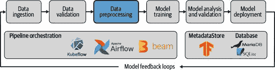
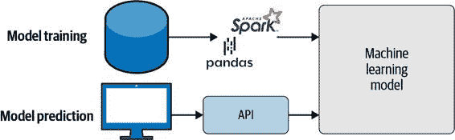
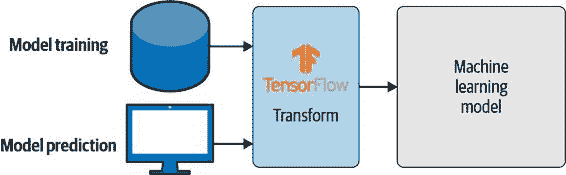
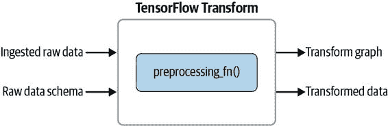
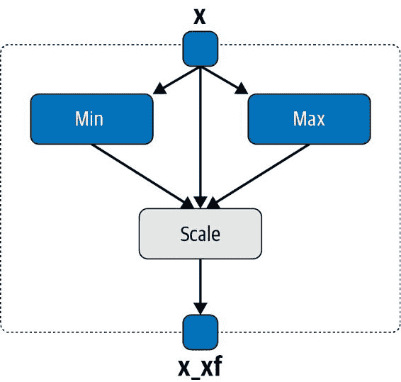
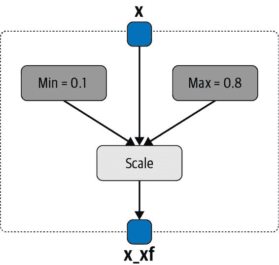

# 第五章：数据预处理

我们用于训练机器学习模型的数据通常以我们的机器学习模型无法消费的格式提供。例如，在我们的示例项目中，我们希望用于训练模型的一个特征只以 Yes 和 No 标记的形式提供。任何机器学习模型都需要这些值的数值表示（例如，1 和 0）。在本章中，我们将解释如何将特征转换为一致的数值表示，以便您的机器学习模型能够使用这些特征的数值表示进行训练。

我们在本章中讨论的一个主要方面是专注于一致的预处理。如 图 5-1 所示，预处理发生在我们讨论的数据验证之后，该数据验证在 第四章 中有所讨论。TensorFlow Transform (TFT) 是 TFX 的数据预处理组件，允许我们将预处理步骤构建为 TensorFlow 图。在接下来的章节中，我们将讨论何时以及为何这是一个良好的工作流程，以及如何导出预处理步骤。在 第六章 中，我们将使用预处理的数据集和保留的转换图来训练和导出我们的机器学习模型，分别。

图 5-1\. 数据预处理作为 ML 流水线的一部分

数据科学家可能会认为用 TensorFlow 操作（operations）表示的预处理步骤作为 TensorFlow Transform (TFT) 的一部分会增加太多的开销。毕竟，当您使用 Python 的 `pandas` 或 `numpy` 编写预处理步骤时，需要进行不同的实现。我们并不主张在实验阶段使用 TFT。然而，正如我们在接下来的章节中所展示的，当将您的机器学习模型引入生产环境时，将您的预处理步骤转换为 TensorFlow 操作将有助于避免我们在 第四章 中讨论的训练-服务偏差。

为什么需要数据预处理？

根据我们的经验，TFT 是 TFX 库中学习曲线最陡的组件之一，因为需要通过 TensorFlow 操作来表达预处理步骤。然而，有许多理由说明为什么应该在机器学习流水线中使用 TFT 标准化数据预处理，包括：

+   > > > > 在整个数据集的背景下高效地预处理您的数据
+   > > > > 
+   > > > > 有效地缩放预处理步骤
+   > > > > 
+   > > > > 避免潜在的训练-服务偏差

在整个数据集的背景下预处理数据

当我们希望将数据转换为数值表示时，通常必须在整个数据集的上下文中进行。例如，如果我们想要对数值特征进行归一化，我们必须首先确定训练集中特征的最小值和最大值。有了确定的边界，我们可以将我们的数据归一化到 0 到 1 之间的值。这种归一化步骤通常需要对数据进行两次遍历：一次用于确定边界，一次用于转换每个特征值。TFT 在幕后提供了管理数据遍历的函数。

扩展预处理步骤

TFT 在幕后使用 Apache Beam 执行预处理指令。这使我们可以根据需要在我们选择的 Apache Beam 后端上分发预处理。如果您没有访问 Google Cloud 的 Dataflow 产品或 Apache Spark 或 Apache Flink 集群，则 Apache Beam 将默认回退到其直接运行器模式。

避免训练-服务偏差

TFT 创建并保存了预处理步骤的 TensorFlow 图。首先，它将创建一个处理数据的图（例如，确定最小/最大值）。然后，它将保留具有确定边界的图。此图随后可以在模型生命周期的推断阶段中使用。此过程确保推断生命周期步骤中的模型看到与训练期间使用的模型相同的预处理步骤。

> 什么是训练-服务偏差？
> 
> 当模型训练中使用的预处理步骤与推断过程中使用的步骤不一致时，我们称之为训练-服务偏差。在许多情况下，用于训练模型的数据在 Python 笔记本中通过`pandas`或者 Spark 作业进行处理。当模型部署到生产环境时，预处理步骤在数据进入模型进行预测之前会在 API 中实施。如您所见，如图 5-2 所示，这两个过程需要协调确保步骤始终保持一致。
> 
> 
> 
> 图 5-2\. 一个常用的机器学习设置
> 
> 使用 TFT，我们可以避免预处理步骤的不一致性。如图 5-3 所示，现在请求预测的客户端可以提交原始数据，并且预处理发生在部署模型图上。
> 
> 
> 
> 图 5-3\. 使用 TFT 避免训练-服务偏差
> 
> 这样的设置减少了所需的协调量并简化了部署。

部署预处理步骤和 ML 模型作为一个整体

为避免预处理步骤与训练模型之间的不一致，我们的管道导出模型应包括预处理图和训练模型。然后，我们可以像部署任何其他 TensorFlow 模型一样部署该模型，但在推断期间，数据将作为模型推断的一部分在模型服务器上进行预处理。这避免了需要在客户端进行预处理的要求，并简化了请求模型预测的客户端（如 Web 或移动应用程序）的开发。在第 11 和 12 章中，我们将讨论整个端到端管道如何生成这种“组合”保存模型。

在您的管道中检查预处理结果

使用 TFT 实现数据预处理并将其集成到我们的管道中带来了额外的好处。我们可以从预处理数据生成统计信息，并检查它们是否仍符合我们训练机器学习模型的要求。一个例子是将文本转换为标记。如果文本包含大量新词汇，未知标记将转换为所谓的 UNK 或未知标记。如果一定数量的我们的标记只是未知的，那么机器学习模型往往难以有效地从数据中推广，因此模型的准确性会受到影响。在我们的管道中，我们现在可以通过在预处理步骤后生成统计信息（显示在 Chapter 4 中）来检查预处理步骤的结果。

> TF.DATA 和 TF.TRANSFORM 之间的区别
> 
> 人们经常对 tf.data 和 tf.transform 感到困惑。tf.data 是用于使用 TensorFlow 构建高效输入管道以进行模型训练的 TensorFlow API。该库的目标是充分利用硬件资源，如主机 CPU 和 RAM，用于训练期间发生的数据摄入和预处理。另一方面，tf.transform 用于表达应在训练和推断时发生的预处理。该库使得能够对输入数据进行全通行分析（例如计算用于数据归一化的词汇表或统计信息），并且此分析在训练之前执行。

使用 TFT 进行数据预处理

TensorFlow 生态系统中用于数据预处理的库是 TFT。与 TFDV 类似，它是 TFX 项目的一部分。

TFT 使用我们之前生成的数据集架构处理我们流入管道的数据，并输出两个结果：

+   > > > > TFRecord 格式中的预处理训练和评估数据集。生成的数据集可以在我们管道的 `Trainer` 组件中下游消耗。
+   > > > > 
+   > > > > 导出预处理图（包括资源），在导出机器学习模型时将使用此图。

TFT 的关键在于`preprocessing_fn`函数，如图 5-4 所示。该函数定义了我们希望应用于原始数据的所有转换。当我们执行`Transform`组件时，`preprocessing_fn`函数将接收原始数据，应用转换，并返回处理后的数据。数据以 TensorFlow 张量或 SparseTensor 形式提供（取决于特征）。应用于张量的所有转换都必须是 TensorFlow 操作。这使得 TFT 能够有效地分发预处理步骤。

图 5-4\. TFT 概述

> TFT 功能
> 
> TFT 功能会在后台执行复杂的处理步骤，例如`tft.compute_and_apply_vocabulary`，可以通过`tft`前缀来识别。在 Python 命名空间中将 TFT 映射到缩写`tft`是一种常见做法。通常的 TensorFlow 操作将使用`tf`前缀加载，如`tf.reshape`。

TensorFlow Transform 还提供了一些有用的功能（例如，`tft.bucketize`，`tft.compute_and_apply_vocabulary`或者`tft.scale_to_z_score`）。当这些功能应用于数据集特征时，它们会执行所需的数据传递，然后将获取的边界应用于数据。例如，`tft.compute_and_apply_vocabulary`将生成语料库的词汇集，将创建的标记到索引映射应用于特征，并返回索引值。该功能可以将词汇标记数量限制为最相关标记的前 n 个。在接下来的章节中，我们将重点介绍一些最有用的 TFT 操作。

安装

当我们像在第二章中介绍的那样安装了`tfx`包时，TFT 会作为依赖项一起安装。如果我们想将 TFT 作为独立包使用，可以通过以下方式安装 PyPI 包：

> `$` `pip install tensorflow-transform`

安装了`tfx`或`tensorflow-transform`之后，我们可以将预处理步骤集成到我们的机器学习管道中。让我们一起讨论几个用例。

预处理策略

正如我们之前讨论的，应用的转换在名为`preprocessing_fn()`的函数中定义。该函数将被我们的`Transform`管道组件或我们独立设置的 TFT 所消费。以下是我们将在接下来的章节中详细讨论的一个预处理函数示例：

> `def``preprocessing_fn``(``inputs``):``x``=``inputs``[``'x'``]``x_normalized``=``tft``.``scale_to_0_1``(``x``)``return``{``'x_xf'``:``x_normalized``}`

该函数接收一个输入批次，作为一个 Python 字典。键是特征的名称，值是应用预处理之前的原始数据。首先，TFT 将执行一个分析步骤，如图 5-5 所示。在我们的小型演示示例中，它将通过对数据的完整遍历确定特征的最小值和最大值。由于在 Apache Beam 上执行预处理步骤，这个步骤可以以分布式的方式进行。

在对数据进行第二次遍历时，确定的值（在我们的案例中，特征列的最小值和最大值）被用来将我们的特征 x 缩放到 0 和 1 之间，如图 5-6 所示。

TFT 还为带有保留的最小值和最大值的预测生成一个图形。这将保证执行的一致性。

图 5-5. TFT 执行过程中的分析步骤

图 5-6. 应用分析步骤的结果

> PREPROCESSING_FN()
> 
> 请注意，TFT 将从`preprocessing_fn()`函数构建一个图，并在其自己的会话中运行。预期该函数返回一个字典，字典的值是转换后的特征。

最佳实践

在   在我们与 TFT 合作的过程中，我们学到了许多经验教训。以下是其中的一些：

特征名称很重要

> > 预处理输出特征的命名很重要。如你将在以下 TFT 实现中看到，我们重用输入特征的名称并附加`_xf`。此外，TensorFlow 模型的输入节点名称需要与`preprocessing_fn`函数的输出特征名称匹配。

考虑数据类型

> > TFT 限制输出特征的数据类型。它将所有预处理的特征导出为`tf.string`、`tf.float32`或`tf.int64`值。如果你的模型无法处理这些数据类型，这是很重要的。一些 TensorFlow Hub 的模型需要将输入呈现为`tf.int32`值（例如，BERT 模型）。我们可以通过在模型内部将输入转换为正确的数据类型，或者在估计器输入函数中转换数据类型来避免这种情况。

预处理发生在批次中

> > 当你编写预处理函数时，你可能会认为它是一次处理一行数据。事实上，TFT 是批量执行操作。这就是为什么我们需要将`preprocessing_fn()`函数的输出重塑为 Tensor 或 SparseTensor，当我们在`Transform`组件的上下文中使用它时。

记住，不要使用即时执行

> > `preprocessing_fn()`函数中的函数需要由 TensorFlow 操作表示。如果你想将输入字符串转换为小写字母，不能使用`lower()`。你必须使用 TensorFlow 操作`tf.strings.lower()`在图形模式下执行相同的过程。不支持即时执行；所有操作都依赖于纯 TensorFlow 图形操作。

`tf.function` 可以在 `preprocessing_fn()` 函数中使用，但有限制：你只能使用接受张量的 `tf.function`（例如，`lower()` 不适用，因为它不适用于张量）。你不能调用 TFT 分析器（或依赖于分析器的映射器，例如 `tft.scale_to_z_score`）。

TFT 函数

TFT 提供了各种函数来促进高效的特征工程。所提供的函数列表非常广泛且不断增长。这就是为什么我们不宣称提供支持函数的完整列表，但我们想要强调与词汇生成、标准化和分桶相关的有用操作。

`tft.scale_to_z_score()`

> > 如果你想要对一个特征进行标准化，使其均值为 0，标准差为 1，你可以使用这个有用的 TFT 函数。

`tft.bucketize()`

> > 这个有用的函数可以将一个特征分桶化。它返回一个桶或者桶索引。你可以指定参数 `num_buckets` 来设置桶的数量。TFT 将会等分这些桶。

`tft.pca()`

> > 这个函数让你能够为给定的特征计算主成分分析（PCA）。PCA 是一种常见的技术，通过线性投影数据到最能保留数据方差的子空间来减少维度。它需要参数 `output_dim` 来设置你的 PCA 表示的维度。

`tft.compute_and_apply_vocabulary()`

> > 这是最惊人的 TFT 函数之一。它计算一个特征列的所有唯一值，然后将最频繁的值映射到一个索引。这个索引映射然后用于将特征转换为数值表示。该函数在幕后为你的图生成所有资产。我们可以通过两种方式配置最频繁的值：要么通过定义 `top_k` 中排名最高的 n 个唯一项，要么通过使用 `frequency_threshold` 以上每个元素以考虑词汇表中的频率。

`tft.apply_saved_model()`

> > 这个函数让你能够在一个特征上应用整个 TensorFlow 模型。我们可以加载一个带有给定 `tag` 和 `signature_name` 的保存模型，然后 `inputs` 将会被传递给模型。来自模型执行的预测将会返回。

自然语言问题的文本数据

如果你正在处理自然语言处理问题，并且希望利用 TFT 对你的语料预处理以将文档转换为数值表示，TFT 提供了许多有用的函数。除了介绍的函数 `tft.compute_and_apply_vocabulary()`，你还可以使用以下 TFT 函数。

`tft.ngrams()`

> > 这将生成 n-gram。它接受字符串值的 SparseTensor 作为输入。例如，如果你想要为列表`['Tom', 'and', 'Jerry', 'are', 'friends']`生成一元和二元组，该函数返回`[b'Tom', b'Tom and', b'and', b'and Jerry', b'Jerry', b'Jerry are', b'are', b'are friends', b'friends']`。除了稀疏输入张量外，该函数还接受两个额外的参数：`ngram_range`和`separator`。`ngram_range`设置 n-gram 的范围。如果你的 n-gram 应包含一元和二元组，请将`ngram_range`设置为`(1, 2)`。`separator`允许我们设置连接的字符串或字符。在我们的例子中，我们将`separator`设置为`" "`。

`tft.bag_of_words()`

> > 此函数使用`tft.ngrams`并生成一个以每个唯一 n-gram 为行的词袋向量。如果例如在输入中标记重复，可能不会保留 n-gram 的原始顺序。

`tft.tfidf()`

> > 自然语言处理中经常使用的概念是 TFIDF（词频-逆文档频率），它生成两个输出：一个带有标记索引的向量和一个表示它们 TFIDF 权重的向量。该函数期望一个稀疏输入向量，表示标记索引（即`tft.compute_and_apply_vocabulary()`函数的结果）。这些向量的维度由`vocab_size`输入参数设置。每个标记索引的权重由标记在文档中的文档频率乘以逆文档频率计算得出。这个计算通常需要大量资源。因此，使用 TFT 来分布计算具有很大的优势。

[TensorFlow Text](https://oreil.ly/ZV9iE)还允许您使用 TensorFlow Text 库中的所有可用函数。该库为文本归一化、文本标记化、n-gram 计算以及像 BERT 这样的现代语言模型提供了广泛的 TensorFlow 支持。

用于计算机视觉问题的图像数据

如果你正在开发计算机视觉模型，TFT 可以为你预处理图像数据集。TensorFlow 提供了多种图像预处理操作，使用[`tf.images`](https://oreil.ly/PAQUO)和[`tf.io` APIs](https://oreil.ly/tWuFW)。

`tf.io`提供了打开图像作为模型图的一部分的有用函数（例如，`tf.io.decode_jpeg`和`tf.io.decode_png`）。`tf.images`提供了裁剪或调整图像大小、转换颜色方案、调整图像（例如对比度、色调或亮度）或执行图像翻转、转置等操作的函数。

在第三章中，我们讨论了将图像导入到我们的管道中的策略。在 TFT 中，我们现在可以从 TFRecord 文件中读取编码图像，并且例如将它们调整为固定大小或将彩色图像缩减为灰度图像。以下是这样一个`preprocessing_fn`函数的实现示例：

> `def process_image(raw_image): raw_image = tf.reshape(raw_image, [-1]) img_rgb = tf.io.decode_jpeg(raw_image, channels=3)`img_gray = tf.image.rgb_to_grayscale(img_rgb)`img = tf.image.convert_image_dtype(img, tf.float32) resized_img = tf.image.resize_with_pad(`img`, target_height=300, target_width=300) img_grayscale = tf.image.rgb_to_grayscale(resized_img)`return tf.reshape(img_grayscale, [-1, 300, 300, 1])`

> > 解码 JPEG 图像格式。

> > 将加载的 RGB 图像转换为灰度。

> > 将图像调整为 300 × 300 像素。

> > 将图像转换为灰度。

`tf.reshape()` 操作作为 `return` 语句的一部分有一个注意事项：TFT 可能会以批处理的方式处理输入。由于批处理大小由 TFT（和 Apache Beam）处理，我们需要重新调整函数的输出以处理任何批处理大小。因此，我们将返回张量的第一个维度设置为 -1。其余维度表示我们的图像。我们将它们调整为 300 × 300 像素，并将 RGB 通道减少为灰度通道。

TFT 的独立执行

定义完 `preprocessing_fn` 函数后，我们需要关注如何执行 `Transform` 函数。对于执行，我们有两个选择。我们可以在独立的 Apache Beam 设置中执行预处理转换，也可以作为 TFX 组件的一部分执行在 Google Cloud 的 Dataflow 服务中。这两种执行方式都可以在本地 Apache Beam 设置上执行。在本节中，我们将讨论 TFT 的独立执行。如果您希望在流水线中集成 TFT，可以跳转到 “将 TFT 集成到您的机器学习流水线中”。

Apache Beam 提供了丰富的功能，超出了本书的范围。它值得有自己的出版物。然而，我们想通过 Apache Beam 的预处理“Hello World”示例向您介绍。

在我们的示例中，我们希望在我们的小型原始数据集上应用之前介绍过的标准化预处理函数，如以下源代码所示：

> `raw_data = [{'x': 1.20}, {'x': 2.99}, {'x': 100.00}]`

首先，我们需要定义一个数据架构。我们可以从特征规范生成一个模式，如以下源代码所示。我们的小型数据集仅包含一个名为 `x` 的特征。我们使用 `tf.float32` 数据类型定义该特征：

> `import``tensorflow``as``tf``from``tensorflow_transform.tf_metadata``import``dataset_metadata``from``tensorflow_transform.tf_metadata``import``schema_utils``raw_data_metadata``=``dataset_metadata``.``DatasetMetadata``(``schema_utils``.``schema_from_feature_spec``({``'x'``:``tf``.``io``.``FixedLenFeature``([],``tf``.``float32``),``}))`

加载数据集并生成数据模式后，我们现在可以执行之前定义的预处理函数 `preprocessing_fn`。TFT 提供了在 Apache Beam 上执行的绑定，使用函数 `AnalyzeAndTransformDataset`。这个函数执行了我们前面讨论过的两步过程：首先分析数据集，然后对数据集进行转换。执行通过 Python 上下文管理器 `tft_beam.Context` 完成，它允许我们设置例如所需的批处理大小。然而，我们建议使用默认的批处理大小，因为在通常的使用情况下更为高效。以下示例展示了使用 `AnalyzeAndTransformDataset` 函数的用法：

> `import``tempfile``import``tensorflow_transform.beam.impl``as``tft_beam``with``beam``.``Pipeline``()``as``pipeline``:``with``tft_beam``.``Context``(``temp_dir``=``tempfile``.``mkdtemp``()):``tfrecord_file``=``"/your/tf_records_file.tfrecord"``raw_data``=``(``pipeline``|``beam``.``io``.``ReadFromTFRecord``(``tfrecord_file``))``transformed_dataset``,``transform_fn``=``(``(``raw_data``,``raw_data_metadata``)``|``tft_beam``.``AnalyzeAndTransformDataset``(``preprocessing_fn``))`

Apache Beam 函数调用的语法与通常的 Python 调用有些不同。在前面的示例中，我们使用 Apache Beam 函数 `AnalyzeAndTransformDataset()` 应用 `preprocessing_fn` 函数，并提供了我们的数据 `raw_data` 和我们定义的元数据模式 `raw_data_metadata` 作为两个参数。`AnalyzeAndTransformDataset()` 然后返回两个结果：预处理后的数据集和一个函数，这里命名为 `transform_fn`，代表应用于我们数据集的转换操作。

如果我们测试我们的“Hello World”示例，执行预处理步骤并打印结果，我们将看到这个小型处理后的数据集：

> `transformed_data``,``transformed_metadata``=``transformed_dataset``print``(``transformed_data``)``[``{``'x_xf'``:``0.0``},``{``'x_xf'``:``0.018117407``},``{``'x_xf'``:``1.0``}``]`

在我们的“Hello World”示例中，我们完全忽略了数据不是作为 Python 字典可用的事实，通常需要从磁盘读取。Apache Beam 提供了处理文件摄取的函数（例如 `beam.io.ReadFromText()` 或 `beam.io.ReadFromTFRecord()`），在构建 TensorFlow 模型的背景下非常有效。

正如您所看到的，定义 Apache Beam 执行可以迅速变得复杂，我们理解数据科学家和机器学习工程师不是从头开始编写执行指令的专业人士。这就是为什么 TFX 如此方便。它在幕后抽象了所有指令，并让数据科学家专注于他们的问题特定设置，例如定义`preprocessing_fn()`函数。在下一节中，我们将更详细地了解如何为我们的示例项目设置`Transform`。

将 TFT 集成到您的机器学习流水线中

在本章的最后一节中，我们讨论如何将 TFT 的能力应用到我们的示例项目中。在第四章中，我们调查了数据集，并确定哪些特征是分类的或数值的，哪些特征应该被分桶化，以及我们希望将哪些特征从字符串表示转换为向量表示。这些信息对于定义我们的特征工程非常关键。

在下面的代码中，我们定义了我们的特征。为了简化后续的处理，我们将输入特征名字分组到代表每种转换输出数据类型的字典中：一位热编码特征、桶化特征和原始字符串表示：

> `import``tensorflow``as``tf``import``tensorflow_transform``as``tft``LABEL_KEY``=``"consumer_disputed"``# Feature name, feature dimensionality.``ONE_HOT_FEATURES``=``{``"product"``:``11``,``"sub_product"``:``45``,``"company_response"``:``5``,``"state"``:``60``,``"issue"``:``90``}``# Feature name, bucket count.``BUCKET_FEATURES``=``{``"zip_code"``:``10``}``# Feature name, value is unused.``TEXT_FEATURES``=``{``"consumer_complaint_narrative"``:``None``}`

在我们可以循环遍历这些输入特征字典之前，让我们定义一些辅助函数以有效地转换数据。给特征名称添加后缀（例如 `_xf`）是一个良好的实践。该后缀将有助于区分错误是否源自输入或输出特征，并防止我们在实际模型中意外使用未转换的特征：

> `def``transformed_name``(``key``):``return``key``+``'_xf'`

我们的一些特征具有稀疏性质，但是 TFT 期望转换输出是稠密的。我们可以使用下面的辅助函数将稀疏特征转换为稠密特征，并用默认值填充缺失值：

> `def``fill_in_missing``(``x``):``default_value``=``''``if``x``.``dtype``==``tf``.``string``or``to_string``else``0``if``type``(``x``)``==``tf``.``SparseTensor``:``x``=``tf``.``sparse``.``to_dense``(``tf``.``SparseTensor``(``x``.``indices``,``x``.``values``,``[``x``.``dense_shape``[``0``],``1``]),``default_value``)``return``tf``.``squeeze``(``x``,``axis``=``1``)`

在我们的模型中，大多数输入特征都表示为一位热编码向量。下面的辅助函数将给定索引转换为一位热编码表示，并返回该向量：

> `def``convert_num_to_one_hot``(``label_tensor``,``num_labels``=``2``):``one_hot_tensor``=``tf``.``one_hot``(``label_tensor``,``num_labels``)``return``tf``.``reshape``(``one_hot_tensor``,``[``-``1``,``num_labels``])`

在我们处理特征之前，我们需要另一个辅助函数将表示为字符串的邮政编码转换为浮点值。我们的数据集列出的邮政编码如下：

> `zip codes 97XXX 98XXX`

为了正确地桶化具有缺失邮政编码的记录，我们用零替换占位符，并将结果浮点数桶化为 10 个桶：

> `def``convert_zip_code``(``zip_code``):``if``zip_code``==``''``:``zip_code``=``"00000"``zip_code``=``tf``.``strings``.``regex_replace``(``zip_code``,` `r``'X{0,5}'``,``"0"``)``zip_code``=``tf``.``strings``.``to_number``(``zip_code``,``out_type``=``tf``.``float32``)``return``zip_code`

有了所有辅助函数的准备，我们现在可以循环遍历每个特征列并根据类型进行转换。例如，为了将我们的特征转换为独热特征，我们使用`tft.compute_and_apply_vocabulary()`将类别名称转换为索引，然后使用我们的辅助函数`convert_num_to_one_hot()`将索引转换为独热向量表示。由于我们使用了`tft.compute_and_apply_vocabulary()`，TensorFlow Transform 首先会遍历所有类别，然后确定完整的类别到索引映射。此映射将在模型的评估和服务阶段应用：

> `def``preprocessing_fn``(``inputs``):``outputs``=``{}``for``key``in``ONE_HOT_FEATURES``.``keys``():``dim``=``ONE_HOT_FEATURES``[``key``]``index``=``tft``.``compute_and_apply_vocabulary``(``fill_in_missing``(``inputs``[``key``]),``top_k``=``dim``+``1``)``outputs``[``transformed_name``(``key``)]``=``convert_num_to_one_hot``(``index``,``num_labels``=``dim``+``1``)``...``return``outputs`

我们对桶特征的处理非常类似。我们决定对邮政编码进行桶化，因为单独编码的邮政编码似乎太稀疏了。在我们的情况下，每个特征被桶化为 10 个桶，我们将桶的索引编码为一个独热向量：

> `for``key``,``bucket_count``in``BUCKET_FEATURES``.``items``():``temp_feature``=``tft``.``bucketize``(``convert_zip_code``(``fill_in_missing``(``inputs``[``key``])),``bucket_count``,``always_return_num_quantiles``=``False``)``outputs``[``transformed_name``(``key``)]``=``convert_num_to_one_hot``(``temp_feature``,``num_labels``=``bucket_count``+``1``)`

我们的文本输入特征以及标签列不需要任何转换；因此，我们只需将它们转换为稠密特征，以防某些特征可能是稀疏的：

> `for``key``in``TEXT_FEATURES``.``keys``():``outputs``[``transformed_name``(``key``)]``=` `\` `fill_in_missing``(``inputs``[``key``])``outputs``[``transformed_name``(``LABEL_KEY``)]``=``fill_in_missing``(``inputs``[``LABEL_KEY``])`
> 
> 为什么我们没有将文本特征嵌入到向量中
> 
> 也许你会想知道为什么我们没有将文本特征嵌入到转换步骤的固定向量中。这当然是可能的。但我们决定将 TensorFlow Hub 模型加载为模型的一部分，而不是预处理的一部分。这个决定的关键原因是我们可以在训练阶段使嵌入可训练，并在训练过程中改进向量表示。因此，在训练阶段，它们不能被硬编码到预处理步骤中，并在训练阶段表示为固定的图形。

如果我们在管道中使用来自 TFX 的`Transform`组件，它期望将转换代码提供在一个单独的 Python 文件中。用户可以设置模块文件的名称（例如，在我们的情况下是`module.py`），但入口点`preprocessing_fn()`必须包含在模块文件中，并且该函数不能被重命名：

> `transform``=``Transform``(``examples``=``example_gen``.``outputs``[``'examples'``],``schema``=``schema_gen``.``outputs``[``'schema'``],``module_file``=``os``.``path``.``abspath``(``"module.py"``))``context``.``run``(``transform``)`

当我们执行`Transform`组件时，TFX 将会将我们在`module.py`模块文件中定义的转换应用于加载的输入数据，这些数据在数据摄取步骤期间已转换为 TFRecord 数据结构。然后，该组件将输出我们的转换后的数据、转换图以及所需的元数据。

转换后的数据和转换图可以在我们的下一个步骤中使用，即`Trainer`组件。查看“运行 Trainer 组件”了解如何消耗我们`Transform`组件的输出。接下来的章节还强调了如何将生成的转换图与训练模型结合起来导出保存的模型。更多细节可以在示例 6-2 中找到。

概要

在本章中，我们讨论了如何有效地在我们的机器学习管道中使用 TFT 对数据进行预处理。我们介绍了如何编写`preprocessing_fn`函数，概述了 TFT 提供的一些可用函数，并讨论了如何将预处理步骤集成到 TFX 管道中。现在数据已经预处理完毕，是时候训练我们的模型了。
