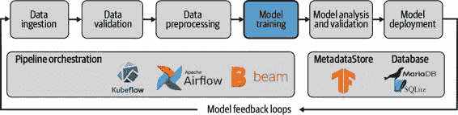
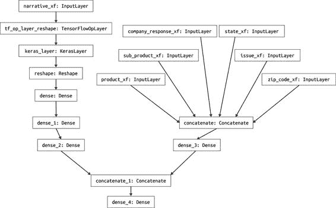
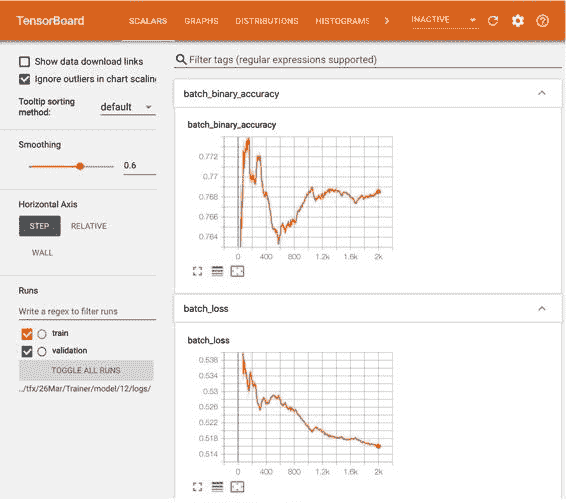

# 第六章：模型训练

现在数据预处理步骤已经完成，并且数据已被转换为我们的模型所需的格式，我们管道中的下一步是使用新转换的数据训练模型。

正如我们在 第一章 中讨论的，我们不会涵盖选择模型架构的过程。我们假设您在拿起本书之前已经进行了独立的实验过程，并且您已经知道要训练的模型类型。我们在 第十五章 中讨论如何跟踪这个实验过程，因为它有助于为模型创建完整的审计跟踪。但我们不涵盖您需要了解模型训练过程的任何理论背景。如果您想进一步了解，请强烈推荐 O'Reilly 出版的《Scikit-Learn、Keras 和 TensorFlow 实战：机器学习实用指南》第 2 版。

在本章中，我们涵盖作为机器学习管道一部分的模型训练过程，包括在 TFX 管道中如何自动化这一过程。我们还包括 TensorFlow 中可用的分布策略的一些细节，以及如何在管道中调整超参数。这一章比大多数其他章节更专注于 TFX 管道，因为我们不单独涵盖训练作为一个独立的过程。

正如 图 6-1 所示，到这个时候数据已被摄取、验证和预处理。这确保了模型所需的所有数据都存在，并且已被可复制地转换为模型需要的特征。所有这些都是必要的，因为我们不希望管道在下一步失败。我们希望确保培训顺利进行，因为这通常是整个管道中耗时最长的部分。



图 6-1\. ML 管道中的模型训练

在 TFX 管道中训练模型的一个非常重要的特性是，我们在 第五章 中讨论的数据预处理步骤会与训练好的模型权重一起保存。一旦我们的模型部署到生产环境中，这将非常有用，因为这意味着预处理步骤将始终生成模型期望的特征。如果没有这个特性，就有可能更新数据预处理步骤而不更新模型，那么模型在生产中可能会失败，或者预测将基于错误的数据。因为我们将预处理步骤和模型导出为一个图，所以我们消除了这种潜在的错误来源。

在接下来的两节中，我们将详细介绍作为 TFX 管道的一部分训练 `tf.Keras` 模型所需的步骤。1

为我们的示例项目定义模型

即使模型架构已经定义，这里仍然需要一些额外的代码。我们需要使得能够自动化管道中的模型训练部分成为可能。在本节中，我们将简要描述我们在整个本章中使用的模型。

我们示例项目的模型是一个假设实现，我们可能需要优化模型架构。但是，它展示了许多深度学习模型的一些常见组成部分：

+   > > > > 从预训练模型进行迁移学习
+   > > > > 
+   > > > > 密集层
+   > > > > 
+   > > > > 连接层

正如我们在第一章讨论的那样，我们示例项目中的模型使用来自美国消费者金融保护局的数据，以预测消费者是否对有关金融产品的投诉提出异议。我们模型的特征包括金融产品、公司的响应、美国州份和消费者投诉叙述。我们的模型受到[宽与深模型架构](https://oreil.ly/9sXHU)的启发，并添加了来自[TensorFlow Hub](https://oreil.ly/0OJZ_)的[Universal Sentence Encoder](https://oreil.ly/7BFZP)来编码自由文本特征（消费者投诉叙述）。

您可以在图 6-2 中看到我们模型架构的视觉表示，其中文本特征（`narrative_xf`）采用“深层”路线，而其他特征采用“宽层”路线。



图 6-2\. 我们示例项目的模型架构

示例 6-1 展示了完整的模型架构定义。因为我们希望导出带有我们预处理步骤的模型，我们需要确保模型输入名称与`preprocessing_fn()`转换的特征名称匹配，我们在第五章中讨论过。在我们的示例模型中，我们重用了在第五章中描述的`transformed_name()`函数，以添加后缀`_xf`到我们的特征中。

示例 6-1\. 定义我们的模型架构

```import``tensorflow``as``tf``import``tensorflow_hub``as``hub``def``transformed_name``(``key``):``return``key``+``'_xf'``def``get_model``():``# One-hot 分类特征``input_features``=``[]``for``key``,``dim``in``ONE_HOT_FEATURES``.``items``():``input_features``.``append``(``tf``.``keras``.``Input``(``shape``=``(``dim``+``1``,),``name``=``transformed_name``(``key``)))``# 添加分桶特征``for``key``,``dim``in``BUCKET_FEATURES``.``items``():``input_features``.``append``(``tf``.``keras``.``Input``(``shape``=``(``dim``+``1``,),``name``=``transformed_name``(``key``)))``# 添加文本输入特征``input_texts``=``[]``for``key``in``TEXT_FEATURES``.``keys``():``input_texts``.``append``(``tf``.``keras``.``Input``(``shape``=``(``1``,),``name``=``transformed_name``(``key``),``dtype``=``tf``.``string``))``inputs``=``input_features``+``input_texts``# 嵌入文本特征``MODULE_URL``=``"https://tfhub.dev/google/universal-sentence-encoder/4"``embed``=``hub``.``KerasLayer``(``MODULE_URL``)``reshaped_narrative``=``tf``.``reshape``(``input_texts``[``0``],``[``-``1``])``embed_narrative``=``embed``(``reshaped_narrative``)``deep_ff``=``tf``.``keras``.``layers``.``Reshape``((``512``,``),``input_shape``=``(``1``,``512``))(``embed_narrative``)``deep``=``tf``.``keras``.``layers``.``Dense``(``256``,``activation``=``'relu'``)(``deep_ff``)``deep``=``tf``.``keras``.``layers``.``Dense``(``64``,``activation``=``'relu'``)(``deep``)``deep``=``tf``.``keras``.``layers``.``Dense``(``16``,``activation``=``'relu'``)(``deep``)``wide_ff``=``tf``.``keras``.``layers``.``concatenate``(``input_features``)``wide``=``tf``.``keras``.``layers``.``Dense``(``16``,``activation``=``'relu'``)(``wide_ff``)``both``=``tf``.``keras``.``layers``.``concatenate``([``deep``,``wide``])``output``=``tf``.``keras``.``layers``.``Dense``(``1``,``activation``=``'sigmoid'``)(``both``)``keras_model``=``tf``.``keras``.``models``.``Model``(``inputs``,``output``)``keras_model``.``compile``(``optimizer``=``tf``.``keras``.``optimizers``.``Adam``(``learning_rate``=``0.001``),``loss``=``'binary_crossentropy'``,``metrics``=``[``tf``.``keras``.``metrics``.``BinaryAccuracy``(),``tf``.``keras``.``metrics``.``TruePositives``()``])``return``keras_model`


> > 循环遍历特征，并为每个特征创建一个输入。


> > 加载`tf.hub`模块的通用句子编码器模型。


> > Keras 输入是二维的，但编码器期望一维的输入。


> > 使用功能 API 组装模型图。

现在我们已经定义了我们的模型，让我们继续描述将其集成到 TFX 管道中的过程。

TFX 训练组件

TFX `Trainer` 组件处理我们流水线中的训练步骤。在本节中，我们将首先描述如何从示例项目中进行一次性训练运行 Keras 模型。在本节末尾，我们将添加一些考虑其他训练情况和 `Estimator` 模型的内容。

我们将描述的所有步骤可能看起来比普通的 Keras 训练代码冗长和不必要。但关键在于 `Trainer` 组件将生成一个模型，该模型将投入生产中，用于转换新数据并使用模型进行预测。由于这个模型包含了 `Transform` 步骤，数据预处理步骤将始终与模型期望的匹配。这消除了我们部署模型时可能产生的巨大错误源。

在我们的示例项目中，`Trainer` 组件需要以下输入：

+   > > > > 由数据验证步骤生成的先前生成的数据模式，在 第四章 中讨论
+   > > > > 
+   > > > > 转换后的数据及其预处理图，在 第五章 中讨论
+   > > > > 
+   > > > > 训练参数（例如，训练步数）
+   > > > > 
+   > > > > 包含 `run_fn()` 函数的模块文件，该函数定义了训练过程

在下一节中，我们将讨论 `run_fn` 函数的设置。我们还将介绍如何在我们的流水线中训练机器学习模型并将其导出到我们将在 第七章 中讨论的下一个流水线步骤中。

`run_fn()` 函数

`Trainer` 组件将在我们的模块文件中查找 `run_fn()` 函数，并使用该函数作为执行训练过程的入口点。模块文件需要对 `Trainer` 组件可访问。如果您在交互式环境中运行组件，只需定义模块文件的绝对路径并将其传递给组件即可。如果您在生产中运行流水线，请参阅 第十一章 或 第十二章 获取有关如何提供模块文件的详细信息。

`run_fn()` 函数是训练步骤的通用入口点，而不是 `tf.Keras` 特定的。它执行以下步骤：

+   > > > > 加载训练和验证数据（或数据生成器）
+   > > > > 
+   > > > > 定义模型架构并编译模型
+   > > > > 
+   > > > > 训练模型
+   > > > > 
+   > > > > 导出模型以便在下一个流水线步骤中进行评估

我们示例项目的 `run_fn` 在 示例 6-2 中执行这四个步骤。

示例 6-2\. 我们示例流水线的 `run_fn()` 函数

`def``run_fn``(``fn_args``):``tf_transform_output``=``tft``.``TFTransformOutput``(``fn_args``.``transform_output``)``train_dataset``=``input_fn``(``fn_args``.``train_files``,``tf_transform_output``)``eval_dataset``=``input_fn``(``fn_args``.``eval_files``,``tf_transform_output``)``model``=``get_model``()``model``.``fit``(``train_dataset``,``steps_per_epoch``=``fn_args``.``train_steps``,``validation_data``=``eval_dataset``,``validation_steps``=``fn_args``.``eval_steps``)``signatures``=``{``'serving_default'``:``_get_serve_tf_examples_fn``(``model``,``tf_transform_output``)``.``get_concrete_function``(``tf``.``TensorSpec``(``shape``=``[``None``],``dtype``=``tf``.``string``,``name``=``'examples'``)``)``}``model``.``save``(``fn_args``.``serving_model_dir``,``save_format``=``'tf'``,``signatures``=``signatures``)`


> > 调用`input_fn`函数以获取数据生成器。


> > 调用`get_model`函数以获取已编译的 Keras 模型。


> > 使用由`Trainer`组件传递的训练步数和评估步数来训练模型。


> > 定义模型签名，包括稍后将描述的服务函数。

此函数相当通用，可以与任何其他`tf.Keras`模型重用。项目特定的细节由诸如`get_model()`或`input_fn()`之类的辅助函数定义。

在接下来的章节中，我们将深入了解如何在`run_fn()`函数中加载数据、训练和导出我们的机器学习模型。

加载数据

`run_fn`中的以下行加载我们的训练和评估数据：

> `def``run_fn``(``fn_args``):``tf_transform_output``=``tft``.``TFTransformOutput``(``fn_args``.``transform_output``)``train_dataset``=``input_fn``(``fn_args``.``train_files``,``tf_transform_output``)``eval_dataset``=``input_fn``(``fn_args``.``eval_files``,``tf_transform_output``)`

在第一行中，`run_fn`函数通过`fn_args`对象接收一组参数，包括变换图、示例数据集和训练参数。

数据加载用于模型训练和验证，以批处理方式处理，加载由`input_fn()`函数处理，如示例 6-3 所示。

示例 6-3\. 我们示例管道的`Input_fn`函数

`LABEL_KEY``=``'labels'``def``_gzip_reader_fn``(``filenames``):``return``tf``.``data``.``TFRecordDataset``(``filenames``,``compression_type``=``'GZIP'``)``def``input_fn``(``file_pattern``,``tf_transform_output``,``batch_size``=``32``):``transformed_feature_spec``=``(``tf_transform_output``.``transformed_feature_spec``()``.``copy``())``dataset``=``tf``.``data``.``experimental``.``make_batched_features_dataset``(``file_pattern``=``file_pattern``,``batch_size``=``batch_size``,``features``=``transformed_feature_spec``,``reader``=``_gzip_reader_fn``,``label_key``=``transformed_name``(``LABEL_KEY``))``return``dataset`


> > 数据集将被分批为正确的批次大小。

`input_fn`函数允许我们加载由上一个 Transform 步骤生成的压缩预处理数据集。2 为此，我们需要将`tf_transform_output`传递给函数。这为我们提供了从 Transform 组件生成的 TFRecord 数据结构加载数据集的数据模式。通过使用预处理数据集，我们可以避免在训练期间进行数据预处理，从而加快训练过程。

`input_fn`返回一个生成器（一个`batched_features_dataset`），它将以一批一次的方式向模型提供数据。

编译并训练模型

现在，我们已经定义了数据加载步骤，下一步是定义我们的模型架构并编译我们的模型。在我们的`run_fn`中，这将需要调用`get_model()`，我们已经描述了这一点，所以只需要一行代码：

> `model``=``get_model``()`

接下来，我们使用 Keras 的`fit()`方法训练我们已编译的`tf.Keras`模型：

> `model``.``fit``(``train_dataset``,``steps_per_epoch``=``fn_args``.``train_steps``,``validation_data``=``eval_dataset``,``validation_steps``=``fn_args``.``eval_steps``)`
> 
> 训练步骤与轮数的比较
> 
> TFX `Trainer`组件通过训练步数而不是轮数定义训练过程。训练步骤是指模型在单个数据批次上训练的次数。使用步数而不是轮数的好处在于，我们可以用大型数据集训练或验证模型，并且只使用数据的一小部分。同时，如果您希望在训练过程中多次遍历训练数据集，可以增加步长以达到可用样本的倍数。

模型训练完成后，下一步是导出训练好的模型。我们将在第八章详细讨论导出模型以用于部署。在接下来的部分中，我们希望强调如何将预处理步骤与模型一起导出。

模型导出

最后，我们导出模型。我们将前一个管道组件的预处理步骤与训练模型结合起来，并将模型保存为 TensorFlow 的 SavedModel 格式。我们根据由 Example 6-4 函数生成的图定义模型签名。我们将在“模型签名”中更详细地描述模型签名在第八章中。

在`run_fn`函数中，我们定义了模型签名，并使用以下代码保存模型：

> `signatures``=``{``'serving_default'``:``_get_serve_tf_examples_fn``(``model``,``tf_transform_output``)``.``get_concrete_function``(``tf``.``TensorSpec``(``shape``=``[``None``],``dtype``=``tf``.``string``,``name``=``'examples'``)``)``}``model``.``save``(``fn_args``.``serving_model_dir``,``save_format``=``'tf'``,``signatures``=``signatures``)`

`run_fn`将`get_serve_tf_examples_fn`导出为模型签名的一部分。当模型被导出并部署时，每个预测请求都会通过 Example 6-4 中显示的`serve_tf_examples_fn()`。每个请求，我们解析序列化的`tf.Example`记录，并将预处理步骤应用于原始请求数据。然后，模型对预处理数据进行预测。

Example 6-4\. 将预处理图应用于模型输入

`def``get_serve_tf_examples_fn``(``model``,``tf_transform_output``):``model``.``tft_layer``=``tf_transform_output``.``transform_features_layer``()``@tf.function``def``serve_tf_examples_fn``(``serialized_tf_examples``):``feature_spec``=``tf_transform_output``.``raw_feature_spec``()``feature_spec``.``pop``(``LABEL_KEY``)``parsed_features``=``tf``.``io``.``parse_example``(``serialized_tf_examples``,``feature_spec``)``transformed_features``=``model``.``tft_layer``(``parsed_features``)``outputs``=``model``(``transformed_features``)``return``{``'outputs'``:``outputs``}``return``serve_tf_examples_fn`


> > 加载预处理图。


> > 解析来自请求的原始`tf.Example`记录。


> > 将预处理转换应用于原始数据。


> > 使用预处理数据进行预测。

完成

运行训练组件

如 Example 6-5 所示，`Trainer`组件将以下内容作为输入：

+   > > > > Python 模块文件，保存为 module.py，包含我们之前讨论过的`run_fn()`、`input_fn()`、`get_serve_tf_examples_fn()`等相关函数
+   > > > > 
+   > > > > 转换组件生成的转换示例
+   > > > > 
+   > > > > 转换组件生成的转换图
+   > > > > 
+   > > > > 数据验证组件生成的模式
+   > > > > 
+   > > > > 训练和评估步骤的数量

Example 6-5\. `Trainer`组件

`from``tfx.components``import``Trainer``from``tfx.components.base``import``executor_spec``from``tfx.components.trainer.executor``import``GenericExecutor``from``tfx.proto``import``trainer_pb2``TRAINING_STEPS``=``1000``EVALUATION_STEPS``=``100``trainer``=``Trainer``(``module_file``=``os``.``path``.``abspath``(``"module.py"``),``custom_executor_spec``=``executor_spec``.``ExecutorClassSpec``(``GenericExecutor``),``transformed_examples``=``transform``.``outputs``[``'transformed_examples'``],``transform_graph``=``transform``.``outputs``[``'transform_graph'``],``schema``=``schema_gen``.``outputs``[``'schema'``],``train_args``=``trainer_pb2``.``TrainArgs``(``num_steps``=``TRAINING_STEPS``),``eval_args``=``trainer_pb2``.``EvalArgs``(``num_steps``=``EVALUATION_STEPS``))`


> > 加载 `GenericExecutor` 来覆盖训练执行器。


> > 覆盖执行器以加载 `run_fn()` 函数。

在笔记本环境（交互式环境）中，我们可以像以前的组件一样运行 `Trainer` 组件，使用以下命令：

> `context``.``run``(``trainer``)`

在完成模型训练和导出后，该组件将注册导出模型的路径到元数据存储中。下游组件可以提取模型进行模型验证。

`Trainer` 组件是通用的，并不限于运行 TensorFlow 模型。然而，管道中稍后的组件期望模型以 TensorFlow [SavedModel 格式](https://oreil.ly/fe6rp)保存。SavedModel 图包括 Transform 图，因此数据预处理步骤是模型的一部分。

> 覆盖 `Trainer` 组件的执行器
> 
> 在我们的示例项目中，我们覆盖了 `Trainer` 组件的执行器，以启用通用的训练入口函数 `run_fn()`，而不是仅支持 `tf.Estimator` 模型的默认 `trainer_fn()` 函数。在 第十二章，我们将介绍另一个 `Trainer` 执行器，即 `ai_platform_trainer_executor.GenericExecutor`。此执行器允许您在谷歌云的 AI 平台上训练模型，而不是在管道环境内部。如果您的模型需要特定的训练硬件（例如 GPU 或张量处理单元 [TPU]），这是一种替代方法。

其他 `Trainer` 组件注意事项

到目前为止，在本章的示例中，我们只考虑了对 Keras 模型的单次训练运行。但我们也可以使用 `Trainer` 组件对先前运行的模型进行微调，或者同时训练多个模型，并且我们将在 “高级管道概念” 中描述这些内容。我们还可以使用它通过超参数搜索来优化模型，我们将在 “模型调优” 中更详细地讨论这一点。

在本节中，我们还将讨论如何与`Estimator`模型一起使用`Trainer`组件，以及如何在 TFX 管道之外加载由`Trainer`组件导出的 SavedModel。

使用 Trainer 组件与 Estimator 模型

直到最近，TFX 仅支持`tf.Estimator`模型，而`Trainer`组件仅设计用于`Estimator`。`Trainer`组件的默认实现使用`trainer_fn()`函数作为训练过程的入口点，但该入口点非常依赖于`tf.Estimator`。`Trainer`组件期望 Estimator 输入由函数如`train_input_fn()`、`eval_input_fn()`和`serving_receiver_fn`()定义。3

如我们在“运行训练器组件”中讨论的，该组件的核心功能可以通过通用训练执行器`GenericExecutor`进行替换，该执行器使用`run_fn()`函数作为训练过程的入口点。4 正如执行器的名称所示，训练过程变得通用化，不再局限于`tf.Estimator`或`tf.Keras`模型。

在管道之外使用 SavedModel

如果我们想要在 TFX 管道之外检查导出的 SavedModel，我们可以将该模型加载为具体函数，5 代表单个签名的图形：

> `model_path``=``trainer``.``outputs``.``model``.``get``()[``0``]``.``uri``model``=``tf``.``saved_model``.``load``(``export_dir``=``model_path``)``predict_fn``=``model``.``signatures``[``"serving_default"``]`

当模型加载为具体函数后，我们现在可以进行预测。导出的模型期望以`tf.Example`数据结构提供输入数据，如下面的示例所示。有关`tf.Example`数据结构的更多细节，以及如何转换其他特征（如整数和浮点数），请参见 Example 3-1。以下代码显示如何创建序列化数据结构，并通过调用`prediction_fn()`函数执行模型预测：

> `example``=``tf``.``train``.``Example``(``features``=``tf``.``train``.``Features``(``feature``=``{``'feature_A'``:``_bytes_feature``(``feature_A_value``),``...``}))``serialized_example``=``example``.``SerializeToString``()``print``(``predict_fn``(``tf``.``constant``([``serialized_example``])))`


> > `_bytes_feature`辅助函数在 Example 3-1 中定义。

如果您希望在训练过程中详细检查模型的进展，可以使用 TensorBoard。我们将在下一节中描述如何在我们的管道中使用 TensorBoard。

在交互式管道中使用 TensorBoard

TensorBoard 是 TensorFlow 生态系统中的另一个精彩工具。它具有许多有用的功能，我们可以在我们的流水线中使用，例如在训练过程中监控指标、可视化自然语言处理问题中的词嵌入，或查看模型中层的激活情况。一个新的[Profiler feature](https://oreil.ly/Tiw9Y)让我们能够分析模型以理解性能瓶颈。

TensorBoard 的基本可视化示例如图 Figure 6-3 所示。



图 6-3\. 在 TensorBoard 中查看训练过程中的指标

要在我们的流水线中使用 TensorBoard，我们需要在 `run_fn` 函数中添加回调并将训练日志记录到指定的文件夹中：

> `log_dir``=``os``.``path``.``join``(``os``.``path``.``dirname``(``fn_args``.``serving_model_dir``),``'logs'``)``tensorboard_callback``=``tf``.``keras``.``callbacks``.``TensorBoard``(``log_dir``=``log_dir``,``update_freq``=``'batch'``)`

我们还需要将回调添加到我们的模型训练中：

> `model``.``fit``(``train_dataset``,``steps_per_epoch``=``fn_args``.``train_steps``,``validation_data``=``eval_dataset``,``validation_steps``=``fn_args``.``eval_steps``,``callbacks``=``[``tensorboard_callback``])`

然后，要在笔记本中查看 TensorBoard，我们获取模型训练日志的位置，并将其传递给 TensorBoard：

> `model_dir``=``trainer``.``outputs``[``'output'``]``.``get``()[``0``]``.``uri``%``load_ext``tensorboard``%``tensorboard``--``logdir``{``model_dir``}`

我们还可以在笔记本之外运行 TensorBoard：

> `tensorboard --logdir path/to/logs`

然后连接到 [`localhost:6006/`](http://localhost:6006/) 查看 TensorBoard。这将为我们提供一个更大的视窗来查看细节。

接下来，我们将介绍一些在多个 GPU 上训练大型模型时有用的策略。

分布策略

TensorFlow 提供了分布策略，用于无法在单个 GPU 上充分训练的机器学习模型。当您希望加速训练或无法将整个模型放入单个 GPU 时，您可能需要考虑分布策略。

这里描述的策略是将模型参数抽象化以分布到多个 GPU 或多个服务器上。一般来说，有两组策略：同步训练和异步训练。在同步策略下，所有训练工作节点都同步使用不同切片的训练数据进行训练，然后在更新模型之前聚合所有工作节点的梯度。异步策略则是独立训练模型，并行处理整个数据集。每个工作节点异步更新模型的梯度，无需等待其他工作节点完成。通常，同步策略通过全局归约操作 6 协调，而异步策略通过参数服务器架构实现。

存在一些同步和异步策略，它们各自有其优缺点。在撰写本节时，Keras 支持以下策略：

MirroredStrategy

> > 该策略适用于单个实例上的多个 GPU，并遵循同步训练模式。该策略会在各个工作器之间镜像模型和参数，但每个工作器会接收不同的数据批次。如果你在单节点多 GPU 环境下训练机器学习模型，并且你的模型适合 GPU 内存，MirroredStrategy 是一个很好的默认策略。

CentralStorageStrategy

> > 与 MirroredStrategy 相比，这种策略不会将变量镜像到所有 GPU 上。相反，它们存储在 CPU 内存中，然后复制到分配的 GPU 上执行相关操作。在单 GPU 操作的情况下，CentralStorageStrategy 会将变量存储在 GPU 上，而不是 CPU 上。当你在单节点多 GPU 环境下进行训练，且整个模型不适合单个 GPU 内存，或者 GPU 之间的通信带宽过于有限时，CentralStorageStrategy 是一个很好的策略。

MultiWorkerMirroredStrategy

> > 这种策略遵循 MirroredStrategy 的设计模式，但是它将变量复制到多个工作器（例如计算实例）之间。如果单个节点不足以支持你的模型训练，MultiWorkerMirroredStrategy 是一个选择。

TPUStrategy

> > 此策略允许您使用 Google Cloud 的 TPU。它遵循同步训练模式，基本上与 MirroredStrategy 类似，但使用 TPU 而不是 GPU。由于 MirroredStrategy 使用 GPU 特定的全局减函数，因此 TPU 策略需要自己的策略。TPU 具有大量可用的 RAM，并且跨 TPU 通信高度优化，这就是为什么 TPU 策略使用了镜像方法。

ParameterServerStrategy

> > ParameterServerStrategy 使用多个节点作为中央变量存储库。对于超出单节点可用资源（例如 RAM 或 I/O 带宽）的模型，此策略非常有用。如果无法在单节点上进行训练且模型超出了节点的 RAM 或 I/O 限制，则 ParameterServerStrategy 是唯一的选择。

OneDeviceStrategy

> > OneDeviceStrategy 的整体目的是在进行真正的分布式训练之前测试整个模型设置。该策略强制模型训练仅使用一个设备（例如一个 GPU）。一旦确认训练设置有效，可以切换策略。
> > 
> 并非所有策略都可以通过 TFX Trainer 组件使用
> 
> 在撰写本节时，TFX 的`Trainer`组件仅支持 MirroredStrategy。虽然不同的策略目前可以在`tf.keras`中使用，但根据[TFX 路线图](https://oreil.ly/I-OPN)，它们将在 2020 年下半年通过`Trainer`组件变得可访问。

因为**MirroredStrategy**由 TFX Trainer 支持，我们将在此展示一个示例。在调用我们的模型创建及后续的`model.compile()`之前，我们可以轻松地应用**MirroredStrategy**，只需添加几行代码：

> `mirrored_strategy``=``tf``.``distribute``.``MirroredStrategy``()``with``mirrored_strategy``.``scope``():``model``=``get_model``()`


> > 分布策略的实例。


> > 用 Python 管理器包装模型创建和编译。

在这个示例设置中，我们创建了一个**MirroredStrategy**的实例。为了将分布策略应用到我们的模型中，我们将模型创建和编译包装在 Python 管理器中（在我们的情况下，这一切发生在`get_model()`函数内部）。这将在我们选择的分布范围下创建和编译我们的模型。**MirroredStrategy**将使用实例中所有可用的 GPU。如果您希望减少使用的 GPU 实例数（例如在共享实例的情况下），可以通过更改分布策略的创建来指定要使用的 GPU：

> `mirrored_strategy``=``tf``.``distribute``.``MirroredStrategy``(``devices``=``[``"/gpu:0"``,``"/gpu:1"``])`

在本例中，我们指定了两个 GPU 用于训练运行。

> 使用 MirroredStrategy 时的批量大小要求
> 
> **MirroredStrategy**期望批量大小与设备数量成比例。例如，如果您使用五个 GPU 进行训练，则批量大小需要是 GPU 数量的倍数。在设置您的`input_fn()`函数时，请牢记这一点，如示例 6-3 所述。

这些分布策略对于那些单个 GPU 内存无法容纳的大型训练作业非常有用。模型调优是我们需要这些策略的常见原因，在下一节中将对此进行讨论。

模型调优

超参数调优是实现准确机器学习模型的重要部分。根据用例，它可能是我们在初始实验中执行的事项，也可能是我们想要包含在管道中的内容。这不是模型调优的全面介绍，但我们将在此简要概述并描述其如何包含在管道中。

超参数调优策略

根据管道中模型的类型，选择的超参数会有所不同。如果您的模型是深度神经网络，则超参数调优对于实现良好性能尤为重要。控制优化和网络架构的两组最重要的超参数之一。

对于优化，我们建议默认使用[Adam](https://oreil.ly/dsdHb)或[NAdam](https://oreil.ly/TjatF)。学习率是一个非常重要的参数，可以进行实验，有[许多可能的选择](https://oreil.ly/MopUS)用于学习率调度器。我们建议使用适合 GPU 内存的最大批量大小。

对于非常大的模型，我们建议以下步骤：

+   > > > > 调节初始学习率，从 0.1 开始。
+   > > > > 
+   > > > > 选择一个训练步数（尽可能多，只要耐心允许）。
+   > > > > 
+   > > > > 在指定的步数内线性衰减学习率至 0。

对于较小的模型，我们建议使用[提前停止](https://oreil.ly/ACUIn)以避免过拟合。使用此技术时，模型训练会在经过用户定义的一定数量的 epochs 后，验证损失不再改善时停止。

对于网络架构，调节的两个最重要的参数是大小和层数。增加这些参数将改善训练性能，但可能导致过拟合，并意味着模型训练时间更长。您还可以考虑在层之间添加残差连接，特别是对于深层架构。

最流行的超参数搜索方法是网格搜索和随机搜索。在网格搜索中，会穷举尝试每个参数的所有组合；而在随机搜索中，参数从可用选项中抽样，可能不会尝试每个组合。如果可能的超参数数量很大，网格搜索可能会非常耗时。尝试了一系列值之后，可以通过选择表现最佳的超参数，并围绕它们开始新的搜索来进行微调。

在 TensorFlow 生态系统中，使用[Keras Tuner](https://oreil.ly/N3DqZ)和[Katib](https://oreil.ly/rVwCk)来实现超参数调优，Katib 在 Kubeflow 中提供超参数调优。除了网格搜索和随机搜索外，这两个包还支持贝叶斯搜索和[Hyperband 算法](https://oreil.ly/KzqJY)。

TFX 管道中的超参数调优

在 TFX 管道中，超参数调优使用 Transform 组件中的数据进行，训练多种模型以确定最佳超参数。然后将这些超参数传递给`Trainer`组件，使用它们训练最终模型。

在这种情况下，模型定义函数（例如我们示例中的`get_model`函数）需要接受超参数作为输入，并根据指定的超参数构建模型。例如，层数需要作为输入参数定义。

> TFX 调节器组件
> 
> 在我们完成本书的过程中发布了 TFX 调节器组件。您可以在项目的[GitHub 仓库](https://oreil.ly/uK7Z9)中查看源代码。

概要

在本章中，我们描述了如何将我们的模型训练从独立脚本转移到我们流水线的集成部分。这意味着该过程可以自动化，并在需要时触发——例如在新数据到达流水线或者之前的模型准确度低于预定水平时。我们还描述了如何将模型和数据预处理步骤一起保存，以避免预处理与训练之间的不匹配导致的任何错误。此外，我们还介绍了分发模型训练和调整超参数的策略。

现在我们有了一个保存的模型，下一步是深入了解它能做什么。

> 1   在我们的示例项目中使用了 Keras 模型，但 TFX 与 `Estimator` 模型也能完美配合。示例可以在[《TFX 文档》](https://oreil.ly/KIDko)中找到。
> 
> 2   `Trainer` 组件可以在没有前置的 `Transform` 组件的情况下使用，并且可以加载原始数据集。然而，在这种情况下，我们将错过 TFX 的一个很好的特性，即将预处理和模型图导出为一个 SavedModel 图。
> 
> 3    `tf.Keras` 模型可以通过 `tf.model_to_estimator()` 转换成 `tf.Estimator` 模型。然而，由于 TFX 的最新更新，这不再是推荐的最佳实践。
> 
> 4   如果您对组件执行者如何开发和交换的步骤感兴趣，我们建议查看《重复使用现有组件》 章节中的 第十章。
> 
> 5   想要了解具体函数的更多细节，请查看[《TensorFlow 文档》](https://oreil.ly/Y8Hup)。
> 
> 6   全局归约操作将所有工作节点的信息归约为单一信息；换句话说，它实现了所有训练工作节点之间的同步。
