# 第七章：模型分析与验证

在机器学习流水线的这一点上，我们已经检查了数据的统计信息，将数据转换为正确的特征，并训练了我们的模型。现在肯定是将模型投入生产的时候了吧？在我们看来，在部署模型之前应该有两个额外的步骤：深入分析模型的性能，并检查其是否优于已经投入生产的任何模型。我们展示了这些步骤如何融入流水线中，见图 7-1。

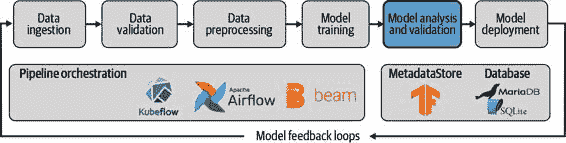

图 7-1 模型分析与验证作为 ML 流水线的一部分

在我们训练模型时，我们会在训练过程中监控其在评估集上的表现，并尝试各种超参数以达到最佳表现。但通常在训练过程中只使用一个指标，而且这个指标通常是准确率。

在构建机器学习流水线时，我们经常试图回答复杂的业务问题或建模复杂的现实系统。通常一个单一的指标不足以告诉我们我们的模型是否能够回答那个问题。特别是如果我们的数据集不平衡或者我们模型的一些决策比其他决策有更高的后果时，情况就更是如此。

此外，一个单一的指标，用于评估整个评估集的性能平均值，可能隐藏了许多重要的细节。如果您的模型处理的数据涉及到人们，那么与模型交互的每个人都会有相同的体验吗？您的模型对女性用户表现更好还是对男性用户表现更好？来自日本的用户是否比来自美国的用户看到更差的结果？这些差异可能会在商业上造成损害，并对真实的人造成伤害。如果您的模型正在为自动驾驶车辆进行物体检测，它是否在所有光照条件下都能正常工作？使用一个指标来评估整个训练集可能会隐藏重要的边缘和特殊案例。因此，能够跨数据集的不同切片监控指标是至关重要的。

在部署之前、部署之后以及生产过程中监控您的指标非常重要。即使您的模型是静态的，流水线中输入的数据会随时间变化，这经常会导致性能下降。

在本章中，我们将介绍 TensorFlow 生态系统中的下一个工具包：TensorFlow Model Analysis（TFMA），它具有所有这些功能。我们将展示如何获取模型性能的详细指标，如何对数据进行切片以获取不同群体的指标，并深入探讨使用公平性指标和 What-If Tool 进行模型公平性分析。然后我们将解释如何在分析之外，开始解释模型的预测结果。

在部署新模型之前的最后一步，我们还将描述验证该模型是否优于任何先前版本。重要的是，部署到生产环境的任何新模型都代表了一步前进，以便依赖该模型的任何其他服务也得到改进。如果新模型在某些方面没有改进，那么部署的努力就不值得。

如何分析您的模型

我们的模型分析过程始于我们对度量标准的选择。正如我们之前讨论的那样，我们的选择对我们的机器学习流水线的成功非常重要。在面对业务问题时，选择多个有意义的度量标准是一个好的实践，因为单一的度量标准可能隐藏重要的细节。在本节中，我们将回顾一些对分类和回归问题都非常重要的度量标准。

分类度量指标

要计算许多分类度量指标，首先需要计算评估集中真假阳性示例和真假阴性示例的数量。以我们标签中的任一类别为例：

真阳性

> > 属于该类别并且被分类器正确地标记为该类别的训练示例。例如，如果真实标签是`1`，预测标签也是`1`，则该示例将是真阳性。

假阳性

> > 训练示例不属于该类别，并且分类器错误地标记为该类别。例如，如果真实标签是`0`，但预测标签是`1`，则该示例将是假阳性。

真阴性

> > 训练示例不属于该类别，并且分类器正确地标记为不属于该类别。例如，如果真实标签是`0`，预测标签也是`0`，则该示例将是真阴性。

假阴性

> > 属于该类别且被分类器错误地标记为不属于该类别的训练示例。例如，如果真实标签是`1`，但预测标签是`0`，则该示例将是假阴性。

这些基本度量通常显示在表格 7-1 中。

表 7-1\. 混淆矩阵

|    | 预测 `1 ` | 预测 `0 ` |
| --- | --- | --- |
|   真实值 `1` |  真阳性  |  假阴性  |
|   真实值 `0` |  假阳性  |  真阴性  |

如果我们为示例项目中的模型计算所有这些度量指标，我们将得到图表 7-2 中显示的结果。

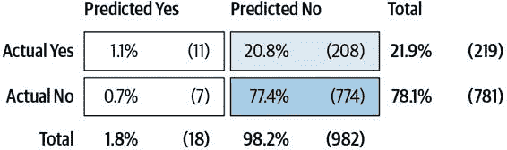

图 7-2\. 我们示例项目的混淆矩阵

当我们在本章后面讨论模型公正性时，我们将看到这些计数特别有用。有几个其他度量标准用这些计数合并为一个单一数字比较模型：

准确率

> > 精度被定义为（真正例 + 真负例）/ 总示例数，或者分类正确的示例比例。这是用于数据集的合适度量标准，其中正类和负类平衡，但如果数据集不平衡，则可能会误导。

精度

> > 精度被定义为真正例 /（真负例 + 假正例），或者被预测为正类的示例中被正确分类的比例。因此，如果分类器具有高精度，则它预测为正类的大多数示例将确实属于正类。

召回率

> > 召回率被定义为真正例 /（真正例 + 假反例），或分类器正确识别的正类示例比例。因此，如果分类器具有高召回率，则它将正确识别大多数真正属于正类的示例。

描述模型性能的另一种方法是通过 AUC（曲线下面积）生成单个数字。这里的“曲线”是接收者操作特征（ROC），它绘制了真正例率（TPR）与假正例率（FPR）之间的关系。

TPR 是召回率的另一种称呼，定义如下：

FPR 的定义如下：

ROC 是通过计算所有分类阈值下的 TPR 和 FPR 来生成的。分类阈值是将示例分配到正类或负类的概率截断值，通常为 0.5\. 图 7-3 显示了我们示例项目的 ROC 和 AUC。对于随机预测器，ROC 将是从原点到 [1,1] 的直线，沿 x 轴。随着 ROC 从 x 轴向绘图的左上方移动，模型改进并且 AUC 增加。AUC 是另一个可以在 TFMA 中绘制的有用指标。

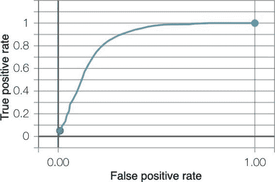

图 7-3\. 我们示例项目的 ROC 曲线

回归指标

在回归问题中，模型为每个训练示例预测某个数值，并将其与实际值进行比较。在 TFMA 中可以使用的常见回归指标包括：

平均绝对误差（MAE）

> > MAE 的定义如下：
> > 
> > 其中 n 是训练示例的数量，y 是真实值，ŷ 是预测值。对于每个训练示例，计算预测值和真实值之间的绝对差。换句话说，MAE 是模型产生的平均误差。

平均绝对百分比误差（MAPE）

> > MAPE 的定义如下：
> > 
> > 正如其名称所示，该指标给出所有示例的百分比误差。当模型产生系统性错误时，这特别有用。

均方误差（MSE）

> > MSE 的定义如下：
> > 
> > 这与 MAE 类似，只是 y – ŷ 项被平方。这使得异常值对整体误差的影响更大。

一旦您选择了适合业务问题的指标，下一步就是将它们包含在您的机器学习流水线中。您可以使用 TFMA 来完成这一步骤，我们将在下一节中描述它。

TensorFlow 模型分析

TFMA 提供了比模型训练期间仅使用的更详细的指标的简便方法。它允许我们将指标可视化为模型版本间的时间序列，并且可以查看数据集切片上的指标。由于使用了 Apache Beam，它还可以轻松扩展到大型评估集。

在 TFX 流水线中，TFMA 基于由`Trainer`组件导出的保存模型计算指标，这正是将要部署的模型。因此，它避免了不同模型版本之间的混淆。在模型训练期间，如果使用 TensorBoard，您将仅获得对小批量测量的近似指标，但 TFMA 会计算整个评估集上的指标。这对于大型评估集尤为重要。

分析单个 TFMA 模型

在本节中，我们将介绍如何将 TFMA 作为一个独立的包使用。TFMA 的安装方法如下：

> `$` `pip install tensorflow-model-analysis`

它接受一个保存的模型和一个评估数据集作为输入。在本例中，我们假设一个 Keras 模型以`SavedModel`格式保存，评估数据集以 TFRecord 文件格式可用。

首先，`SavedModel`必须转换为`EvalSharedModel`：

> `import``tensorflow_model_analysis``as``tfma``eval_shared_model``=``tfma``.``default_eval_shared_model``(``eval_saved_model_path``=``_MODEL_DIR``,``tags``=``[``tf``.``saved_model``.``SERVING``])`

接下来，我们提供了一个`EvalConfig`。在这一步中，我们告诉 TFMA 我们的标签是什么，提供了任何按特征之一对模型进行切片的规范，并规定了我们希望 TFMA 计算和显示的所有指标：

> `eval_config``=``tfma``.``EvalConfig``(``model_specs``=``[``tfma``.``ModelSpec``(``label_key``=``'consumer_disputed'``)],``slicing_specs``=``[``tfma``.``SlicingSpec``()],``metrics_specs``=``[``tfma``.``MetricsSpec``(``metrics``=``[``tfma``.``MetricConfig``(``class_name``=``'BinaryAccuracy'``),``tfma``.``MetricConfig``(``class_name``=``'ExampleCount'``),``tfma``.``MetricConfig``(``class_name``=``'FalsePositives'``),``tfma``.``MetricConfig``(``class_name``=``'TruePositives'``),``tfma``.``MetricConfig``(``class_name``=``'FalseNegatives'``),``tfma``.``MetricConfig``(``class_name``=``'TrueNegatives'``)``])``]``)`
> 
> 分析 TFLite 模型
> 
> 我们还可以在 TFMA 中分析 TFLite 模型。在这种情况下，必须将模型类型传递给`ModelSpec`：
> 
> > `eval_config``=``tfma``.``EvalConfig``(``model_specs``=``[``tfma``.``ModelSpec``(``label_key``=``'my_label'``,``model_type``=``tfma``.``TF_LITE``)],``...``)`
> > 
> 我们将在“TFLite”中更详细地讨论 TFLite。

然后，运行模型分析步骤：

> `eval_result``=``tfma``.``run_model_analysis``(``eval_shared_model``=``eval_shared_model``,``eval_config``=``eval_config``,``data_location``=``_EVAL_DATA_FILE``,``output_path``=``_EVAL_RESULT_LOCATION``,``file_format``=``'tfrecords'``)`

并在 Jupyter Notebook 中查看结果：

> `tfma``.``view``.``render_slicing_metrics``(``eval_result``)`

即使我们希望查看总体指标，我们仍然调用`render_slicing_metrics`。在这种情况下，切片是整体切片，即整个数据集。结果显示在图 7-4 中。

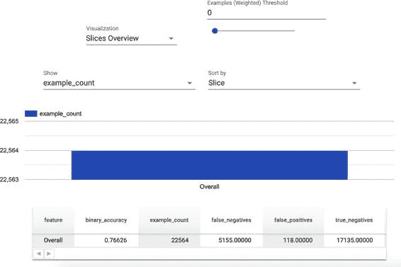

图 7-4\. TFMA 笔记本中总体指标的可视化

> 在 Jupyter Notebook 中使用 TFMA
> 
> TFMA 的工作方式如 Google Colab 笔记本中所述。但是在独立的 Jupyter Notebook 中查看可视化需要一些额外的步骤。使用以下命令安装并启用 TFMA 笔记本扩展：
> 
> > `$` `jupyter nbextension` `enable` `--py widgetsnbextension` `$` `jupyter nbextension install --py` `\` `--symlink tensorflow_model_analysis` `$` `jupyter nbextension` `enable` `--py tensorflow_model_analysis`
> > 
> 如果您在 Python 虚拟环境中运行这些命令，请为每个命令附加`--sys_prefix`标志。`widgetsnbextension`、`ipywidgets`和`jupyter_nbextensions_configurator`包可能需要安装或升级。
> 
> 我们编写时，TFMA 可视化仅在 Jupyter Notebook 中可用，而不在 Jupyter Lab 中。

我们在 TFMA 中描述的所有指标都可以通过在`metrics_specs`参数中提供它们来显示。到`EvalConfig`：

> `metrics_specs``=``[``tfma``.``MetricsSpec``(``metrics``=``[``tfma``.``MetricConfig``(``class_name``=``'BinaryAccuracy'``),``tfma``.``MetricConfig``(``class_name``=``'AUC'``),``tfma``.``MetricConfig``(``class_name``=``'ExampleCount'``),``tfma``.``MetricConfig``(``class_name``=``'Precision'``),``tfma``.``MetricConfig``(``class_name``=``'Recall'``)``])``]`

结果显示在图 7-5 中。

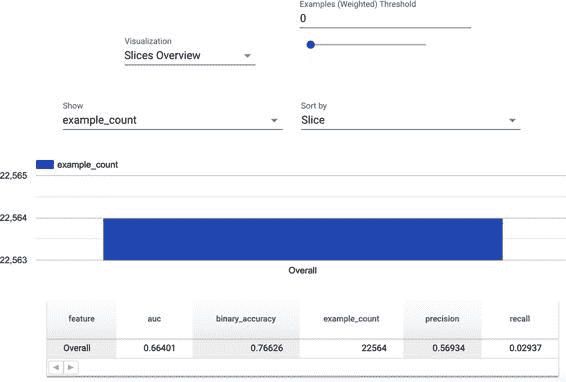

图 7-5\. TFMA 笔记本中其他指标的可视化

在 TFMA 中分析多个模型

我们还可以使用 TFMA 比较多个模型的指标。例如，这些可能是在不同数据集上训练的同一模型，或者在相同数据集上训练的具有不同超参数的两个模型。

对于我们比较的模型，我们首先需要生成类似于前面代码示例的`eval_result`。我们需要确保指定一个`output_path`位置来保存模型。我们为两个模型使用相同的`EvalConfig`以便能够计算相同的指标：

> `eval_shared_model_2``=``tfma``.``default_eval_shared_model``(``eval_saved_model_path``=``_EVAL_MODEL_DIR``,``tags``=``[``tf``.``saved_model``.``SERVING``])``eval_result_2``=``tfma``.``run_model_analysis``(``eval_shared_model``=``eval_shared_model_2``,``eval_config``=``eval_config``,``data_location``=``_EVAL_DATA_FILE``,``output_path``=``_EVAL_RESULT_LOCATION_2``,``file_format``=``'tfrecords'``)`

然后，我们使用以下代码将它们加载：

> `eval_results_from_disk``=``tfma``.``load_eval_results``(``[``_EVAL_RESULT_LOCATION``,``_EVAL_RESULT_LOCATION_2``],``tfma``.``constants``.``MODEL_CENTRIC_MODE``)`

并且我们可以使用以下方式进行可视化：

> `tfma``.``view``.``render_time_series``(``eval_results_from_disk``,``slices``[``0``])`

结果显示在图 7-6 中。

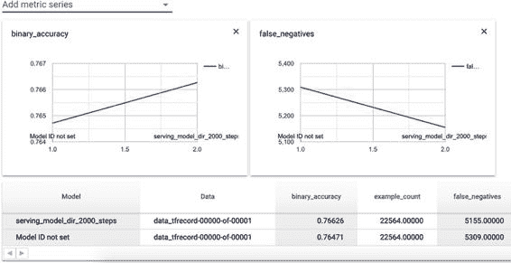

图 7-6\. TFMA 可视化比较两个模型

这里需要注意的关键是，在 TFMA 中，无论是分类模型还是回归模型，都可以同时查看许多指标，而不是在训练过程中仅限于一两个。这有助于在模型部署后避免出现意外行为。

我们还可以根据数据集的特征对评估数据进行切片，例如，在我们的演示项目中，通过产品获取准确性。我们将在下一节中描述如何做到这一点。

公平性的模型分析

我们用来训练模型的所有数据在某种程度上都存在偏见：现实世界非常复杂，无法从数据样本中充分捕捉到所有这些复杂性。在第四章中，我们探讨了数据偏见问题，本章我们将研究模型预测的公平性。

> 公平性和偏见
> 
> “公平性”和“偏见”这两个术语通常可以互换使用，用来指代不同群体是否从机器学习模型中获得不同的表现。在这里，我们将使用“公平性”一词来避免与数据偏见混淆，我们在第四章中讨论过这个问题。

要分析我们的模型是否公平，我们需要确定某些群体的体验是否以一种问题方式不同于其他群体。例如，一个群体可能是不偿还贷款的人。如果我们的模型试图预测谁应该获得信贷，这个群体的体验应该与其他人不同。我们要避免的问题类型的例子是，仅有某一种族的人因某些原因被错误地拒绝贷款。

一个群体从模型中获得不同经历的知名例子是预测累犯风险的 COMPAS 算法。根据[Propublica](https://oreil.ly/mIw7t)报道，该算法对黑人和白人被告的错误率大致相同。然而，它特别容易错误预测黑人被告将来会成为罪犯的概率，大致是错误预测白人被告的两倍。

我们应该在将模型部署到生产环境之前尝试识别这类问题。首先，定义公平性的数值化含义是很有用的。以下是几种分类问题的示例方法：

人口统计学平衡

> > 决策在模型中对所有群体的速率相同。例如，男性和女性的贷款批准率相同。

平等机会

> > 在提供机会的班级中，所有群体的错误率都相同。根据问题设置的方式不同，这可以是正类或负类。例如，能够偿还贷款的人中，男性和女性的贷款批准率相同。

相等的准确率

> > 某些度量指标如准确率、精确度或 AUC 在所有群体中都相等。例如，面部识别系统对深肤色女性和浅肤色男性的准确性应该一样。

相等的准确率有时可能会产生误导，就像前面的 COMPAS 例子一样。在那个例子中，两组的准确率是相等的，但对一个组的后果却要严重得多。重要的是考虑错误的方向，这些错误对你的模型造成最严重的后果。

> 公平性的定义
> 
> 没有一个适用于所有机器学习项目的公平定义。你需要探索对你具体业务问题最佳的解决方案，考虑到模型对用户可能造成的潜在危害和好处。更多指导请参阅 Solon Barocas 等人的书籍[《机器学习中的公平性》](https://fairmlbook.org)，Google 的 Martin Wattenberg 等人的[这篇文章](https://oreil.ly/GlgnV)，以及 Ben Hutchinson 等人的[公平性指标文档](https://oreil.ly/O237L)。

我们所指的群体可以是不同类型的客户、来自不同国家的产品使用者，或者不同性别和种族的人。在美国法律中，有受保护群体的概念，这些群体的个体受到基于性别、种族、年龄、残疾、肤色、信仰、国籍、宗教和基因信息的歧视保护。这些群体是交叉的：你可能需要检查你的模型是否不歧视多种组合的群体。

> 群体是一种简化
> 
> 在现实世界中，人群从未是清晰的。每个人都有自己复杂的故事：有些人可能在一生中改变了宗教或性别。有些人可能属于多个种族或多个国籍。寻找这些边缘案例，并为人们提供告诉您如果他们对您的模型有不良体验的方法。

即使您在模型中未使用这些组作为特征，这并不意味着您的模型是公平的。许多其他特征，例如地点，可能与这些受保护的群体之一强相关。例如，如果您使用美国邮政编码作为特征，这与种族高度相关。您可以通过为其中一个受保护群体切片数据来检查这些问题，就像我们在接下来的章节中描述的那样，即使这不是您用来训练模型的特征。

公平性并非易于处理的话题，会引发许多可能复杂或有争议的伦理问题。然而，有几个项目可以帮助我们从公平的角度分析我们的模型，接下来的几节我们将描述如何使用它们。这种分析可以通过为每个人提供一致的体验，为您带来伦理和商业优势。它甚至可能是纠正您正在建模的系统中潜在不公平的机会，例如在亚马逊的[招聘工具分析](https://oreil.ly/0ihec)中发现了女性候选人面临的潜在劣势。

在接下来的几节中，我们将描述如何使用三个项目来评估 TensorFlow 中的公平性：TFMA、Fairness Indicators 和 What-If Tool。

在 TFMA 中切片模型预测

评估机器学习模型公平性的第一步是按照您感兴趣的组切片您的模型预测，例如性别、种族或国家。这些切片可以由 TFMA 或 Fairness Indicators 工具生成。

在 TFMA 中切片数据，必须提供一个`slicing column`作为`SliceSpec`。在这个例子中，我们将根据产品特征进行切片：

> `slices`=`[``tfma``.``slicer``.``SingleSliceSpec``(),``tfma``.``slicer``.``SingleSliceSpec``(``columns``=`[`'Product'`])]`

没有指定参数的`SingleSliceSpec`返回整个数据集。

接下来，运行指定了切片的模型分析步骤：

> `eval_result`=`tfma``.``run_model_analysis``(``eval_shared_model``=`eval_shared_model``,``eval_config``=`eval_config_viz``,``data_location``=`_EVAL_DATA_FILE``,``output_path``=`_EVAL_RESULT_LOCATION``,``file_format``=`'tfrecords'``,``slice_spec``=`slices``)`

并查看结果，如图 7-7 所示：

> `tfma``.``view``.``render_slicing_metrics``(``eval_result``,``slicing_spec``=`slices``[``1``])`

如果我们要考虑人口统计学平等，如前所定义，那么我们需要检查每个组中正类的比例是否相同。我们可以通过查看每个组的 TPR 和 TNR 来进行检查。

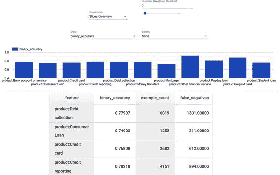

图 7-7\. TFMA 分片可视化

> 考虑哪一类是有益的
> 
> 我们假设模型做了对个人有益的某种选择，并假设这是正类。如果正类对个人无益，负类对个人有害，那么我们应该考虑真阴性率和假阳性率。

对于平等机会，我们可以检查每个群体的 FPR。关于此更多细节，请参考[有用建议](https://oreil.ly/s8Do7)中的公平性指标项目。

使用公平性指标检查决策阈值

公平性指标是模型分析的另一个极其有用的工具。它与 TFMA 有一些重叠的功能，但其特别有用的功能之一是能够在各种决策阈值上查看分特征的度量指标。正如我们之前讨论的，决策阈值是分类模型中确定类别边界的概率分数。这让我们可以检查我们的模型在不同决策阈值下是否对各个群体公平。

有几种访问公平性指标工具的方法，但将其作为独立库使用的最简单方法是通过 TensorBoard。我们还提到如何在 TFX 管道的一部分加载它，详见“评估组件”。我们通过以下方式安装 TensorBoard 公平性指标插件：

> `$` `pip install tensorboard_plugin_fairness_indicators`

接下来，我们使用 TFMA 评估模型，并要求它计算我们提供的一组决策阈值的度量指标。这在`metrics_spec`参数中提供给 TFMA，同时还包括我们希望计算的任何其他度量：

> `eval_config``=``tfma``.``EvalConfig``(``model_specs``=``[``tfma``.``ModelSpec``(``label_key``=``'consumer_disputed'``)],``slicing_specs``=``[``tfma``.``SlicingSpec``(),``tfma``.``SlicingSpec``(``feature_keys``=``[``'product'``])],``metrics_specs``=``[``tfma``.``MetricsSpec``(``metrics``=``[``tfma``.``MetricConfig``(``class_name``=``'FairnessIndicators'``,``config``=``'{"thresholds":[0.25, 0.5, 0.75]}'``)``])``]``)`

然后通过`tfma.run_model_analysis`运行模型分析步骤。

接下来，将 TFMA 评估结果写入日志目录，以便 TensorBoard 可以读取：

> `from``tensorboard_plugin_fairness_indicators``import``summary_v2``writer``=``tf``.``summary``.``create_file_writer``(``'./fairness_indicator_logs'``)``with``writer``.``as_default``():``summary_v2``.``FairnessIndicators``(``'./eval_result_fairness'``,``step``=``1``)``writer``.``close``()`

并将结果加载到 Jupyter 笔记本的 TensorBoard 中：

> `%``load_ext``tensorboard``%``tensorboard``--``logdir``=./``fairness_indicator_logs`

公平性指标工具突出显示与整体度量值的差异，如图 7-8 所示（详见 filepos693700）。

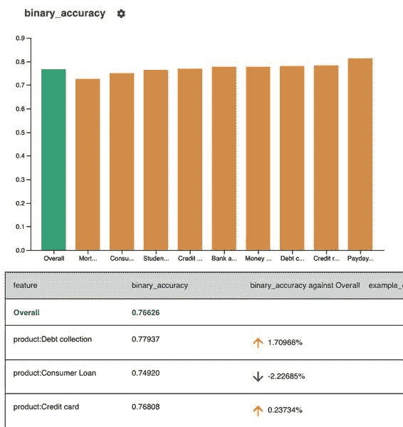

图 7-8\. 公平性指标分片可视化

对于我们的示例项目，图 7-9 显示在将决策阈值降低到 0.25 时，各组之间的差异更加明显。

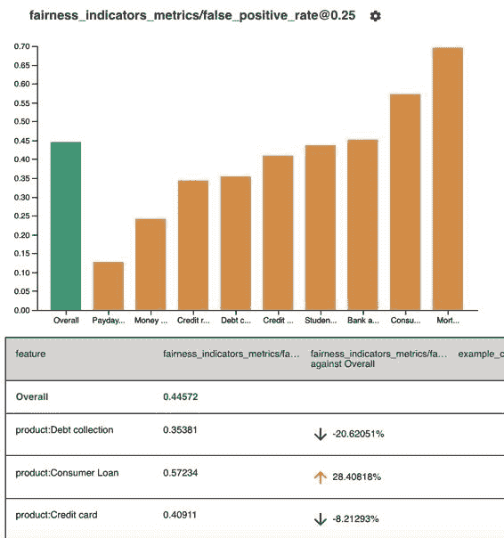

图 7-9\. 公平性指标阈值可视化

除了探索整体模型中的公平性考虑外，我们可能还想查看个别数据点，了解个别用户受我们模型影响的情况。幸运的是，在 TensorFlow 生态系统中还有另一个工具可帮助我们做到这一点：What-If Tool。

深入了解 What-If Tool

在使用 TFMA 和公平性指标查看数据集切片之后，我们可以通过 Google 的另一个项目深入研究：[What-If Tool](https://oreil.ly/NJThO) (WIT)。这使我们能够生成一些非常有用的可视化，并调查个别数据点。

有多种方法可以使用 WIT 分析已部署的 TensorFlow Serving 模型 [通过 TensorBoard](https://oreil.ly/sZP5l)，或在 GCP 上运行的模型。也可以直接与 Estimator 模型一起使用。但对于我们的示例项目，最直接的使用方法是编写一个自定义预测函数，该函数接受一组训练示例，并返回这些示例的模型预测。这样，我们可以在独立的 Jupyter Notebook 中加载可视化。

我们可以使用以下命令安装 WIT：

> `$` `pip install witwidget`

接下来，我们创建一个 `TFRecordDataset` 来加载数据文件。我们抽样了 1,000 个训练示例，并将其转换为 `TFExamples` 的列表。What-If Tool 的可视化效果对这些训练示例数量很好，但如果样本更大，则变得难以理解：

> `eval_data``=``tf``.``data``.``TFRecordDataset``(``_EVAL_DATA_FILE``)``subset``=``eval_data``.``take``(``1000``)``eval_examples``=``[``tf``.``train``.``Example``.``FromString``(``d``.``numpy``()``)``for``d``in``subset``]`

接下来，我们加载模型并定义一个预测函数，该函数接受 `TFExamples` 列表并返回模型对这些示例的预测：

> `model``=``tf``.``saved_model``.``load``(``export_dir``=``_MODEL_DIR``)``predict_fn``=``model``.``signatures``[``'serving_default'``]``def``predict``(``test_examples``):``test_examples``=``tf``.``constant``([``example``.``SerializeToString``()``for``example``in``examples``])``preds``=``predict_fn``(``examples``=``test_examples``)``return``preds``[``'outputs'``]``.``numpy``()`  

然后我们使用以下配置 WIT：

> `from``witwidget.notebook.visualization``import``WitConfigBuilder``config_builder``=``WitConfigBuilder``(``eval_examples``)``.``set_custom_predict_fn``(``predict``)`

我们可以在笔记本中查看它：

> `from``witwidget.notebook.visualization``import``WitWidget``WitWidget``(``config_builder``)`

这将在 图 7-10 中为我们提供可视化。

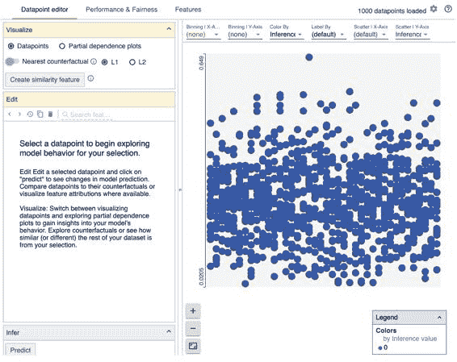

图 7-10\. WIT 主页

> 在 JUPYTER NOTEBOOK 中使用 WIT
> 
> 与 TFMA 类似，在独立笔记本中运行 WIT 需要额外的几个步骤。使用以下命令安装并启用 WIT 笔记本扩展：
> 
> > `$` `jupyter nbextension install --py --symlink` `\` `--sys-prefix witwidget` `$` `jupyter nbextension` `enable` `witwidget --py --sys-prefix`
> > 
> 如果在 Python 虚拟环境中运行这些命令，请在每个命令中追加标志 `--sys_prefix`。

在 WIT 中包含许多功能，我们将在这里描述其中一些最有用的。完整文档请参见[WIT 项目主页](https://oreil.ly/cyTDR)。

WIT 提供反事实，对于任何单个训练样本，显示其来自不同分类的最近邻居。所有特征尽可能相似，但反事实的模型预测为另一类别。这帮助我们了解每个特征如何影响模型对特定训练示例的预测。如果我们发现改变人口统计特征（种族、性别等）会将模型的预测变为另一类别，这是模型可能对不同群体不公平的警告信号。

我们可以通过在浏览器中编辑所选示例来进一步探索这个功能。然后，我们可以重新运行推断，看看这对特定示例的预测有什么影响。这可以用来探索公平性的人口统计特征或其他特征，看看如果它们被改变会发生什么。

反事实可以作为解释模型行为的依据。但请注意，每个数据点可能存在许多可能的反事实，这些反事实接近于最近的邻居，并且特征之间可能存在复杂的相互作用。因此，反事实本身不应被呈现为完全解释模型行为的因素。

WIT 的另一个特别有用的功能是部分依赖图（PDP）。这些图展示了每个特征如何影响模型的预测，例如，数值特征的增加是否改变了类别预测的概率。PDP 显示了这种依赖的形状：它是否是线性的、单调的或者更复杂的。PDP 也可以为分类特征生成，如图 7-11 所示。同样，如果模型的预测显示对人口统计特征的依赖性，这可能是您的模型预测不公平的警告信号。

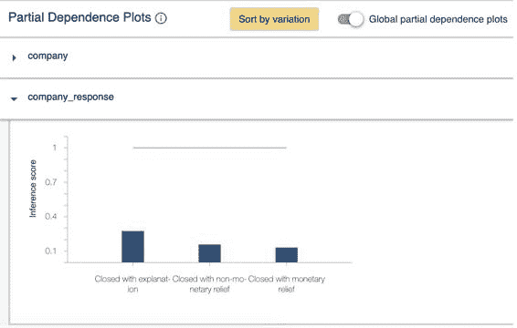

图 7-11\. WIT PDPs

更高级的功能是针对公平策略优化决策阈值，这作为 WIT 的一页提供。可以根据选择的策略自动设置决策阈值，如图 7-12 所示。

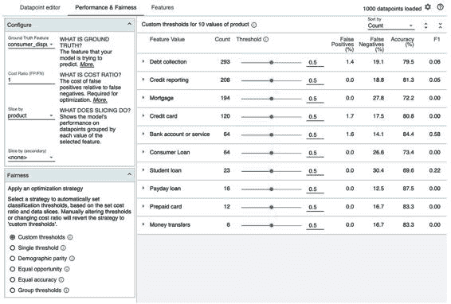

图 7-12\. WIT 决策阈值

我们在模型公平性这一节描述的所有工具也可以用来审查任何模型，即使它没有伤害用户的潜力。它们可以帮助更好地理解模型在部署前的行为，并且有助于避免它在现实世界中出现意外情况。这是一个活跃研究的领域，新的工具经常发布。一个有趣的发展是为模型公平性存在的约束优化，其中模型不仅仅优化一个指标，还可以考虑其他约束，比如平等的准确率。在 TensorFlow 中已经存在一个[实验性库](https://oreil.ly/WkYyi)用于此目的。

模型可解释性

讨论公平性并使用 WIT 自然而然地引导我们讨论如何不仅描述我们模型的表现，还要解释其内部运行情况。我们在公平性的前一节简要提到过这一点，但在这里我们将进一步扩展。

模型可解释性旨在解释模型所作出预测的原因。与分析相反，分析描述了模型在各种指标下的表现。机器学习中的可解释性是一个重要的主题，目前有大量关于该主题的活跃研究。它不是我们流程的一部分，因为根据定义，解释需要向人们展示。我们将简要概述一下，更多细节建议阅读[ebook《可解释机器学习》Christoph Molnar](https://oreil.ly/fGtve)和谷歌云的[这篇白皮书](https://oreil.ly/3CLTk)。

有几个可能的原因驱使你解释模型的预测：

+   > > > > 帮助数据科学家调试他们模型中的问题
+   > > > > 
+   > > > > 建立对模型的信任
+   > > > > 
+   > > > > 审计模型
+   > > > > 
+   > > > > 向用户解释模型的预测

我们后面讨论的技术在所有这些用例中都是有帮助的。

简单模型的预测比复杂模型的预测容易解释得多。线性回归、逻辑回归和单一决策树相对容易解释。我们可以查看每个特征的权重并知道该特征的确切贡献。对于这些模型来说，查看整个模型提供了一个解释，因为它们的结构设计使它们可以被人类理解。例如，线性回归模型的系数提供了一个解释，无需进一步处理即可理解。

解释随机森林和其他集成模型，以及深度神经网络是最困难的。这是因为神经网络中的参数和连接数量巨大，导致特征之间的相互作用极其复杂。如果您的模型预测具有较高的后果并且您需要解释，请选择更容易解释的模型。关于如何以及何时使用解释的更多细节，请参阅 Umang Bhatt 等人的论文 [“Explainable Machine Learning in Deployment”](https://arxiv.org/pdf/1909.06342.pdf)。

> 局部和全局解释
> 
> 我们可以将机器学习的可解释性方法分为两大类：局部解释和全局解释。局部解释旨在解释模型为单个数据点做出特定预测的原因。全局解释则旨在解释模型整体运作的方式，通过大量数据点来衡量。在下一节中，我们将介绍这两种技术。

在下一节中，我们将介绍一些从您的模型生成解释的技术。

使用 WIT 生成解释

在 “使用 What-If 工具进行更深入的分析” 中，我们描述了如何使用 WIT 来帮助解决模型公平性问题。但是 WIT 也可以用于解释我们的模型，特别是使用反事实和 PDP，正如我们注意到的那样。反事实提供给我们局部解释，而 PDP 可以提供局部或全局解释。我们之前展示过全局 PDP 的例子，如 图 7-11，现在我们将考虑局部 PDP，如 图 7-13 所示。

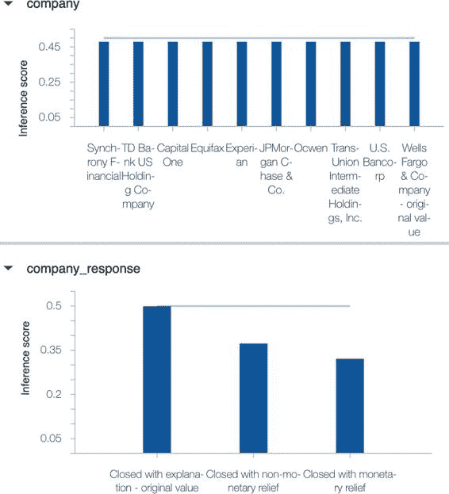

图 7-13\. WIT 局部 PDP

PDP 显示了不同特征有效值的预测结果（推断分数）的变化。在 `company` 特征上推断分数没有变化，表明这个数据点的预测不依赖于该特征的值。但是在 `company_response` 特征上，推断分数有变化，显示模型预测对该特征的值具有一定依赖性。

> PDP 的假设
> 
> PDP 包含一个重要的假设：所有特征彼此独立。对于大多数数据集，尤其是那些需要神经网络模型进行准确预测的复杂数据集来说，这不是一个好的假设。在处理这些图表时应谨慎：它们可以给出您的模型正在做什么的指示，但并不提供完整的解释。

如果您的模型是使用 Google Cloud 的 AI 平台部署的，您可以在 WIT 中看到[特征归因](https://oreil.ly/ePiEi)。对于单个数据示例，特征归因为每个特征提供正负分数，表明特征对模型预测的影响和大小。它们也可以聚合以提供特征在模型中重要性的全局解释。特征归因基于 Shapley 值，这些值在下一节中描述。Shapley 值不假设您的特征是独立的，因此与 PDP 不同，如果您的特征彼此相关，它们是有用的。在撰写本文时，特征归因仅适用于使用 TensorFlow 1.x 训练的模型。

其他可解释性技术

[LIME](https://oreil.ly/SrlWc)，即本地可解释的模型无关解释，是另一种生成局部解释的方法。它将模型视为黑盒，并在我们希望获得解释的点周围生成新数据点。然后，LIME 获取这些新数据点的模型预测，并使用这些点训练一个简单模型。这个简单模型的权重给出了我们的解释。

[SHAP](https://oreil.ly/3S01U)，即 Shapley 加法解释，库使用 Shapley 值提供全局和局部解释。这些计算起来计算成本很高，因此 SHAP 库包含了加速计算或为提升树和深度神经网络计算近似值的实现。这个库是展示您模型中特征重要性的一个很好的方式。

> SHAPLEY VALUES
> 
> Shapley 值对于局部和全局解释都很有用。这个概念是从博弈论借来的算法，用于在合作博弈中为每个玩家分配增益和损失。在机器学习的背景下，每个特征都是一个“玩家”，Shapley 值可以通过以下方式获得：
> 
1.  > > > > 获取不包含特征 F 的所有可能子集。
1.  > > > > 
1.  > > > > 计算将 F 添加到所有子集中对模型预测的影响。
1.  > > > > 
1.  > > > > 结合这些效果以获取特征 F 的重要性。
1.  > > > > 
> 所有这些都是相对于某个基线的。对于我们的示例项目，我们可以将其表述为“预测受到公司响应为‘解决方案为说明关闭’而不是‘解决方案为货币补偿关闭’的驱动程度”。值“解决方案为货币补偿关闭”是我们的基线。

我们还想提到[model cards](https://oreil.ly/VWcwS)，这是一个报告机器学习模型的框架。这些是共享有关机器学习模型事实和限制的正式方式。我们在这里包括这些是因为即使它们不解释模型为何做出其预测，它们对建立对模型的信任非常有价值。模型卡应包括以下信息：

+   > > > > 在公共数据集上对模型的基准性能进行了评估，包括在人口统计特征中划分的性能
+   > > > > 
+   > > > > 例如，模型的限制，比如揭示如果图像质量降低是否会导致图像分类模型的结果不够精确
+   > > > > 
+   > > > > 模型做出的任何权衡，例如，说明更大的图像是否会导致更长的处理时间

**模型卡片**在高风险情境中沟通模型非常有用，它鼓励数据科学家和机器学习工程师记录他们构建的模型的使用案例和限制。

> **解释的限制**
> 
> 我们建议在处理模型可解释性时要小心谨慎。这些技术可能会让你感觉你理解了模型的操作，但实际上它可能在做一些无法解释的非常复杂的事情。这在深度学习模型中尤其如此。
> 
> 人类不可能以可读的方式表达组成深度神经网络的数百万权重的所有复杂性。在模型决策对现实世界有重大影响的情况下，我们建议构建尽可能简单的模型，并使用易于解释的特征。

**TFX 中的分析和验证**

到目前为止，在本章中，我们集中讨论了人类参与的模型分析。这些工具非常有用，可以监控我们的模型，确保它们按照我们期望的方式运行。但在自动化机器学习流水线中，我们希望流水线能够顺利运行并警报我们问题。在 TFX 中，有几个组件处理流水线的这部分内容：`Resolver`、`Evaluator`和`Pusher`。这些组件共同检查模型在评估数据集上的性能，并将其发送到服务位置，如果它改进了先前的模型。

**TFX**使用认可的概念来描述决定是否将模型部署到服务中的门控过程。如果模型改善了先前的模型，根据我们定义的阈值，它将被认可，并可以继续下一步骤。

**ResolverNode**

如果我们想将新模型与先前模型进行比较，则需要一个`Resolver`组件。`ResolverNodes`是查询元数据存储的通用组件。在这种情况下，我们使用`latest_blessed_model_resolver`。它检查最后一个被认可的模型并将其作为基线传递给`Evaluator`组件，与新候选模型一起使用。如果我们不想根据某些指标的阈值验证我们的模型，则不需要`Resolver`。但我们强烈建议这一步骤。如果您不验证新模型，即使其性能比先前模型差，它也会自动推送到服务目录。在`Evaluator`的第一次运行中，如果没有被认可的模型，`Evaluator`会自动认可该模型。

在交互式环境中，我们可以这样运行 `Resolver` 组件：

> `from``tfx.components``import``ResolverNode``from``tfx.dsl.experimental``import``latest_blessed_model_resolver``from``tfx.types``import``Channel``from``tfx.types.standard_artifacts``import``Model``from``tfx.types.standard_artifacts``import``ModelBlessing``model_resolver``=``ResolverNode``(``instance_name``=``'latest_blessed_model_resolver'``,``resolver_class``=``latest_blessed_model_resolver``.``LatestBlessedModelResolver``,``model``=``Channel``(``type``=``Model``),``model_blessing``=``Channel``(``type``=``ModelBlessing``)``)``context``.``run``(``model_resolver``)`

评估器组件

评估器组件使用 TFMA 库在验证数据集上评估模型的预测。它的输入包括来自 ExampleGen 组件的数据、来自 Trainer 组件的训练模型，以及用于 TFMA 的 EvalConfig（与独立使用 TFMA 库时相同）。

首先，我们定义 `EvalConfig`：

> `import``tensorflow_model_analysis``as``tfma``eval_config``=``tfma``.``EvalConfig``(``model_specs``=``[``tfma``.``ModelSpec``(``label_key``=``'consumer_disputed'``)],``slicing_specs``=``[``tfma``.``SlicingSpec``(),``tfma``.``SlicingSpec``(``feature_keys``=``[``'product'``])],``metrics_specs``=``[``tfma``.``MetricsSpec``(``metrics``=``[``tfma``.``MetricConfig``(``class_name``=``'BinaryAccuracy'``),``tfma``.``MetricConfig``(``class_name``=``'ExampleCount'``),``tfma``.``MetricConfig``(``class_name``=``'AUC'``)``])``]``)`

然后运行评估器组件：

> `from``tfx.components``import``Evaluator``evaluator``=``Evaluator``(``examples``=``example_gen``.``outputs``[``'examples'``],``model``=``trainer``.``outputs``[``'model'``],``baseline_model``=``model_resolver``.``outputs``[``'model'``],``eval_config``=``eval_config``)``context``.``run``(``evaluator``)

我们也可以展示 TFMA 的可视化：

> `eval_result``=``evaluator``.``outputs``[``'evaluation'``]``.``get``()[``0``]``.``uri``tfma_result``=``tfma``.``load_eval_result``(``eval_result``)`

我们还可以加载公平性指标：

> `tfma``.``addons``.``fairness``.``view``.``widget_view``.``render_fairness_indicator``(``tfma_result``)`

在评估器组件中进行验证

评估器组件还进行验证，检查我们刚刚训练的候选模型是否优于基线模型（例如当前正在生产中的模型）。它从评估数据集中获取两个模型的预测，并比较性能指标（例如模型准确性）。如果新模型优于先前的模型，则新模型会收到“blessing”（祝福）工件。目前只能在整个评估集上计算度量，不能对切片进行计算。

要进行验证，我们需要在 `EvalConfig` 中设置一个阈值：

> `eval_config``=``tfma``.``EvalConfig``(``model_specs``=``[``tfma``.``ModelSpec``(``label_key``=``'consumer_disputed'``)],``slicing_specs``=``[``tfma``.``SlicingSpec``(),``tfma``.``SlicingSpec``(``feature_keys``=``[``'product'``])],``metrics_specs``=``[``tfma``.``MetricsSpec``(``metrics``=``[``tfma``.``MetricConfig``(``class_name``=``'BinaryAccuracy'``),``tfma``.``MetricConfig``(``class_name``=``'ExampleCount'``),``tfma``.``MetricConfig``(``class_name``=``'AUC'``)``],``thresholds``=``{``'AUC'``:``tfma``.``config``.``MetricThreshold``(``value_threshold``=``tfma``.``GenericValueThreshold``(``lower_bound``=``{``'value'``:``0.65``}),``change_threshold``=``tfma``.``GenericChangeThreshold``(``direction``=``tfma``.``MetricDirection``.``HIGHER_IS_BETTER``,``absolute``=``{``'value'``:``0.01``}``)``)``}``)``]``)`

在本例中，我们指定 AUC 必须超过 0.65，并且希望模型的 AUC 至少比基线模型高出 0.01。任何其他指标可以替代 AUC，但请注意，您添加的指标也必须包含在 `MetricsSpec` 的列表中。

我们可以通过以下方式检查结果：

> `eval_result``=``evaluator``.``outputs``[``'evaluation'``]``.``get``()[``0``]``.``uri``print``(``tfma``.``load_validation_result``(``eval_result``))`

如果验证通过，将返回以下结果：

> `validation_ok``:``true`

TFX 推送组件

`Pusher` 组件是我们流水线中的一个重要组成部分。它接收一个已保存的模型、`Evaluator` 组件的输出以及存储模型的文件路径，然后检查 `Evaluator` 是否已经批准了模型（即该模型是否改进了之前的版本，并且高于我们设置的任何阈值）。如果模型已被批准，`Pusher` 将其推送到服务文件路径中。

`Pusher` 组件接收 `Evaluator` 的输出模型及服务目的地：

> `from``tfx.components``import``Pusher``from``tfx.proto``import``pusher_pb2``_serving_model_dir``=``"serving_model_dir"``pusher``=``Pusher``(``model``=``trainer``.``outputs``[``'model'``],``model_blessing``=``evaluator``.``outputs``[``'blessing'``],``push_destination``=``pusher_pb2``.``PushDestination``(``filesystem``=``pusher_pb2``.``PushDestination``.``Filesystem``(``base_directory``=``_serving_model_dir``)))``context``.``run``(``pusher``)`

一旦新模型被推送到服务目录，TensorFlow Serving 就可以接收并处理它，详细内容请参见下一章节。

概要

在本章中，我们详细介绍了如何比在模型训练期间更深入地分析模型的性能，并开始考虑如何使模型的性能更公平。我们还讨论了检查模型性能是否优于先前部署模型的过程。此外，我们还介绍了机器学习的可解释性，并简要概述了该领域的一些技术。

不过在这里，我们必须提出警告：仅仅因为你已经通过公平性指标详细分析了你的模型的性能，这并不能保证你的模型是公平或符合伦理的。一旦模型投入使用，继续监控模型并为用户提供反馈的途径非常重要，让他们知道如果他们觉得模型的预测是不公正的。特别是在利益重大且模型的决策可能对用户造成重大实际影响时，这点尤为重要。

现在我们已经分析和验证了我们的模型，是时候进入管道中至关重要的下一步了：为模型提供服务！接下来的两章将告诉你关于这一重要步骤的所有必要信息。
