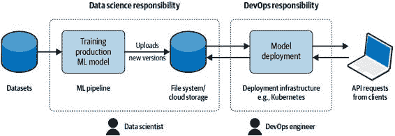
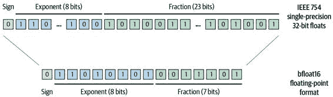
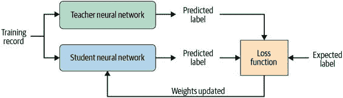
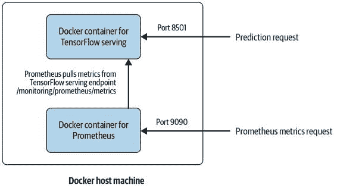
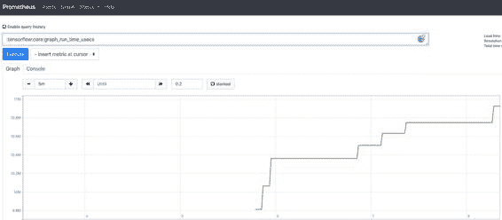
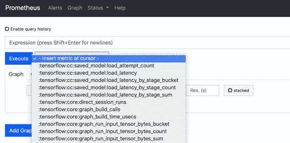

# 第九章：使用 TensorFlow Serving 进行高级模型部署

在上一章中，我们讨论了如何使用 TensorFlow 或 Keras 模型以及 TensorFlow Serving 进行高效部署。现在我们在本章介绍机器学习模型部署的高级用例。这些用例涉及多种主题，例如模型 A/B 测试、优化模型以进行部署和扩展，以及监视模型部署。如果您还没有机会查看前一章，我们建议您这样做，因为它为本章提供了基础知识。

解耦部署周期

在 第八章 中展示的基本部署方式效果良好，但有一个限制：训练和验证过的模型需要在构建步骤中包含在部署容器镜像中，或在容器运行时挂载到容器中，正如我们在前一章中讨论的那样。这两个选项都需要了解 DevOps 过程（例如更新 Docker 容器镜像）或在部署新模型版本的阶段协调数据科学和 DevOps 团队。

正如我们在 第八章 中简要提到的，TensorFlow Serving 可以从远程存储驱动器（例如 AWS S3 或 GCP 存储桶）加载模型。TensorFlow Serving 的标准加载器策略频繁轮询模型存储位置，在检测到新模型后卸载先前加载的模型并加载新模型。由于这种行为，我们只需要部署我们的模型服务容器一次，它会持续更新存储文件夹位置中可用的模型版本。

工作流程概述

在我们深入了解如何配置 TensorFlow Serving 从远程存储位置加载模型之前，让我们先看看我们提议的工作流程。

图 9-1 显示了工作流程的分离。模型服务容器只需部署一次。数据科学家可以通过存储桶的 Web 界面或命令行复制操作上传新版本的模型到存储桶中。任何模型版本的更改都将被服务实例发现。不需要重新构建模型服务器容器或重新部署容器。



图 9-1。数据科学与 DevOps 部署周期的分离

如果您的存储桶文件夹是公开访问的，您可以通过简单地更新模型基本路径到远程路径来提供远程模型服务：

> `docker run -p 8500:8500` `\` `-p 8501:8501` `\` `-e` `MODEL_BASE_PATH``=``s3://bucketname/model_path/` `\`  `-e` `MODEL_NAME``=``my_model` `\`  `-t tensorflow/serving`


> > 远程存储桶路径


> > 其余配置保持不变

如果您的模型存储在私有云存储桶中，您需要更详细地配置 TensorFlow Serving 以提供访问凭据。设置与提供程序有关。本章将涵盖两个提供商的示例：AWS 和 GCP。

从 AWS S3 访问私有模型

AWS 通过用户特定的访问密钥和访问密钥验证用户。要访问私有 AWS S3 存储桶，您需要创建用户访问密钥和密钥。1

您可以将 AWS 访问密钥和密钥作为环境变量提供给 `docker run` 命令。这使得 TensorFlow Serving 可以获取凭据并访问私有存储桶：

> `docker run -p 8500:8500` `\` `-p 8501:8501` `\` `-e` `MODEL_BASE_PATH``=``s3://bucketname/model_path/` `\` `-e` `MODEL_NAME``=``my_model` `\` `-e` `AWS_ACCESS_KEY_ID``=``XXXXX``\`  `-e` `AWS_SECRET_ACCESS_KEY``=``XXXXX``\` `-t tensorflow/serving`


> > 环境变量的名称非常重要。

TensorFlow Serving 依赖于标准的 AWS 环境变量及其默认值。您可以覆盖默认值（例如，如果您的存储桶不位于 `us-east-1` 地区，或者您想更改 S3 端点）。

您有以下配置选项：

+   > > > > `AWS_REGION=us-east-1`
+   > > > > 
+   > > > > `S3_ENDPOINT=s3.us-east-1.amazonaws.com`
+   > > > > 
+   > > > > `S3_USE_HTTPS=1`
+   > > > > 
+   > > > > `S3_VERIFY_SSL=1`

配置选项可以作为环境变量添加，或者如下示例所示添加到 `docker run` 命令中：

> `docker run -p 8500:8500` `\` `-p 8501:8501` `\` `-e` `MODEL_BASE_PATH``=``s3://bucketname/model_path/` `\` `-e` `MODEL_NAME``=``my_model` `\` `-e` `AWS_ACCESS_KEY_ID``=``XXXXX``\` `-e` `AWS_SECRET_ACCESS_KEY``=``XXXXX``\` `-e` `AWS_REGION``=``us-west-1` `\`  `-t tensorflow/serving`


> > 可以通过环境变量添加额外的配置。

通过为 TensorFlow Serving 提供这几个额外的环境变量，您现在可以从远程 AWS S3 存储桶加载模型。

从 GCP 存储桶访问私有模型

GCP 通过服务账户对用户进行验证。要访问私有 GCP 存储桶，您需要创建一个服务账户文件。2

与 AWS 不同，在 GCP 的情况下，我们无法简单地将凭证作为环境变量提供，因为 GCP 验证需要一个包含服务账户凭据的 JSON 文件。在 GCP 情况下，我们需要在主机机器上挂载一个文件夹到 Docker 容器中，该文件夹包含凭证，并定义一个环境变量指向正确的凭证文件。

在下面的示例中，假设您已将新创建的服务帐户凭据文件保存在主机机器上的`/home/``your_username``/.credentials/`目录下。我们从 GCP 下载了服务帐户凭据并将文件保存为`sa-credentials.json`。您可以为凭据文件指定任何名称，但需要在 Docker 容器内更新环境变量`GOOGLE_APPLICATION_CREDENTIALS`的完整路径：

> `docker run -p 8500:8500` `\` `-p 8501:8501` `\` `-e` `MODEL_BASE_PATH``=``gcp://``bucketname``/``model_path``/` `\` `-e` `MODEL_NAME``=``my_model``\` `           -v /home/``your_username``/.credentials/:/credentials/`  `-e` `GOOGLE_APPLICATION_CREDENTIALS``=``/``credentials``/``sa-credentials.json``\`  `-t tensorflow/serving`


> > 挂载主机目录以使用凭据。


> > 指定容器内的路径。

几个步骤即可将远程 GCP 存储桶配置为存储位置。

远程模型加载的优化

默认情况下，TensorFlow Serving 每两秒轮询一次任何模型文件夹，以查找更新的模型版本，无论该模型存储在本地还是远程位置。如果您的模型存储在远程位置，轮询操作将通过您的云提供商生成一个存储桶列表视图。如果您持续更新模型版本，您的存储桶可能包含大量文件。这将导致大型列表视图消息，并因此消耗少量但随时间积累的流量。您的云提供商很可能会为这些列表操作生成的网络流量收费。为避免费用意外，我们建议将轮询频率降低到每 120 秒，这仍然可以提供每小时高达 30 次的更新可能性，但会减少 60 倍的流量：

> `docker run -p 8500:8500` `\` `...            -t tensorflow/serving` `\` `--file_system_poll_wait_seconds``=``120`

在`docker run`命令的镜像规范之后需要添加 TensorFlow Serving 参数。您可以指定大于一秒的任何轮询等待时间。如果将等待时间设置为零，TensorFlow Serving 将不会尝试刷新加载的模型。

部署模型的优化

随着机器学习模型尺寸的增加，模型优化对于高效部署变得更加重要。模型量化允许您通过减少权重表示的精度来减少模型的计算复杂度。模型修剪允许您通过将其归零来隐式地删除不必要的权重。而模型蒸馏将强制较小的神经网络学习较大神经网络的目标。

所有三种优化方法旨在实现更小的模型，从而实现更快的模型推理。在接下来的几节中，我们将进一步解释这三种优化选项。

量化

神经网络的权重通常存储为 32 位浮点数据类型（或者，IEEE 754 标准称之为单精度二进制浮点格式）。浮点数存储如下：1 位存储数的符号，8 位存储指数，以及 23 位存储浮点数的精度。

然而，网络权重可以以 bfloat16 浮点格式或 8 位整数表示。如图 9-2 所示，存储权重时，我们仍然需要 1 位来存储数的符号。当我们将权重存储为 bfloat16 浮点数时，指数仍然使用 8 位，因为它被 TensorFlow 使用。但是，分数表示从 23 位减少到 7 位。有时，权重甚至可以仅使用 8 位整数表示。



图 9-2. 浮点精度的降低

通过将网络权重表示改为 16 位浮点数或整数，我们可以获得以下好处：

+   > > > > 权重可以用更少的字节表示，在模型推理期间需要更少的内存。
+   > > > > 
+   > > > > 由于权重的减少表示，预测可以更快地推断出来。
+   > > > > 
+   > > > > 量化允许在 16 位甚至 8 位嵌入式系统上执行神经网络。

当前的模型量化工作流在模型训练后应用，通常称为后训练量化。由于量化模型可能由于精度不足而导致欠拟合，我们强烈建议在部署之前分析和验证任何模型。作为模型量化的示例，我们讨论了 Nvidia 的 TensorRT 库（参见 “使用 TensorRT 与 TensorFlow Serving”）和 TensorFlow 的 TFLite 库（参见 “TFLite”）。

剪枝

除了降低网络权重精度的方法外，模型剪枝是一种替代方法。其核心思想是通过移除不必要的权重，将训练过的网络压缩成一个更小的网络。实际操作中，这意味着将“不必要”的权重设为零。通过将不必要的权重设为零，可以加快推理或预测的速度。此外，由于稀疏权重导致更高的压缩率，剪枝模型还可以压缩成更小的模型尺寸。

> 如何剪枝模型
> 
> 模型可以在训练阶段进行剪枝，使用类似于 TensorFlow 的模型优化包 `tensorflow-model-optimization`.3

蒸馏

与其减少网络连接，我们也可以训练一个较小、复杂度较低的神经网络，从一个更广泛的网络中学习已经训练好的任务。这种方法被称为蒸馏。不同于简单地训练一个与较大模型相同目标的较小机器学习模型，较大模型（教师神经网络）的预测会影响较小模型（学生神经网络）权重的更新，如在图 9-3 中所示。通过使用来自教师和学生神经网络的预测，可以强制学生网络从教师网络中学习一个目标。最终，我们可以用更少的权重和一个原本无法学习目标的模型架构来表达相同的模型目标。



图 9-3\. 学生网络从教师网络中学习

使用 TensorRT 与 TensorFlow Serving

在将训练好的 TensorFlow 模型部署到生产环境之前，进行量化的一种选择是将模型转换为 Nvidia 的 TensorRT。

如果您在 Nvidia GPU 上运行计算密集型深度学习模型，可以使用这种额外的方式来优化您的模型服务器。Nvidia 提供了一个名为 TensorRT 的库，通过降低网络权重和偏差的数值表示精度来优化深度学习模型的推理。TensorRT 支持 int8 和 float16 表示。降低精度将降低模型的推理延迟。

在您的模型训练完成后，您需要使用 TensorRT 自带的优化器或 `saved_model_cli`4 来优化模型。优化后的模型可以加载到 TensorFlow Serving 中。在撰写本章时，TensorRT 仅限于某些 Nvidia 产品，包括 Tesla V100 和 P4。

首先，我们将使用 `saved_model_cli` 转换我们的深度学习模型：

> `$` `saved_model_cli convert --dir saved_models/` `\` `--output_dir trt-savedmodel/` `\` `--tag_set serve tensorrt`

转换后，您可以按以下方式在我们的 TensorFlow Serving GPU 设置中加载模型：

> `$` `docker run --runtime``=``nvidia` `\` `-p 8500:8500` `\` `-p 8501:8501` `\` `--mount` `type``=``bind``,source``=``/path/to/models,target``=``/models/my_model` `\` `-e` `MODEL_NAME``=``my_model` `\` `-t tensorflow/serving:latest-gpu`

如果您在 Nvidia GPU 上推理您的模型，则 TensorRT 支持该硬件。切换到 TensorRT 可以进一步降低推理延迟。

TFLite

如果您希望优化您的机器学习模型但又没有运行 Nvidia GPU，则可以使用 TFLite 来对机器学习进行优化。

TFLite 传统上用于将机器学习模型转换为较小的模型尺寸，以部署到移动设备或物联网设备。但是，这些模型也可以与 TensorFlow Serving 一起使用。因此，与其将机器学习模型部署到边缘设备，不如使用 TensorFlow Serving 部署具有低推理延迟和较小内存占用的机器学习模型。

尽管使用 TFLite 进行优化看起来非常有前途，但是有一些注意事项：在撰写本节时，TensorFlow Serving 对 TFLite 模型的支持仅处于实验阶段。此外，并非所有 TensorFlow 操作都可以转换为 TFLite 指令。然而，支持的操作数量正在不断增加。

使用 TFLite 优化模型的步骤

TFLite 还可以用于优化 TensorFlow 和 Keras 模型。该库提供了多种优化选项和工具。您可以通过命令行工具或 Python 库转换模型。

起始点始终是以`SavedModel`格式训练并导出的模型。在以下示例中，我们关注 Python 指令。转换过程包括四个步骤：

1.  > > > > 加载导出的保存模型
1.  > > > > 
1.  > > > > 定义您的优化目标
1.  > > > > 
1.  > > > > 转换模型
1.  > > > > 
1.  > > > > 将优化后的模型保存为 TFLite 模型
1.  > > > > 
> `import``tensorflow``as``tf``saved_model_dir``=``"path_to_saved_model"``converter``=``tf``.``lite``.``TFLiteConverter``.``from_saved_model``(``saved_model_dir``)``converter``.``optimizations``=````tf``.``lite``.``Optimize``.``DEFAULT`![`]``tflite_model``=``converter``.``convert``()``with``open``(``"/tmp/model.tflite"``,``"wb"``)``as``f``:``f``.``write``(``tflite_model``)`


> > 设置优化策略。
> > 
> TFLITE 优化
> 
> TFLite 提供了预定义的优化目标。通过更改优化目标，转换器将以不同的方式优化模型。几个选项是`DEFAULT`、`OPTIMIZE_FOR_LATENCY`和`OPTIMIZE_FOR_SIZE`。
> 
> 在`DEFAULT`模式下，您的模型将针对延迟和大小进行优化，而另外两个选项则更倾向于一个选项。您可以设置转换选项如下：
> 
> `...``converter``.``optimizations``=``[``tf``.``lite``.``Optimize``.``OPTIMIZE_FOR_SIZE``]``converter``.``target_spec``.``supported_types``=``[``tf``.``lite``.``constants``.``FLOAT16``]``tflite_model``=``converter``.``convert``()``...`

如果您的模型包含在导出模型时 TFLite 不支持的 TensorFlow 操作，则转换步骤将失败并显示错误消息。您可以在执行转换器之前启用额外的选定 TensorFlow 操作，以使其在转换过程中可用。但是，这将增加约 30 MB 的 TFLite 模型大小。以下代码段显示了如何在执行转换器之前启用额外的 TensorFlow 操作：

> `...``converter``.``target_spec``.``supported_ops``=``[``tf``.``lite``.``OpsSet``.``TFLITE_BUILTINS``,``tf``.``lite``.``OpsSet``.``SELECT_TF_OPS``]``tflite_model``=``converter``.``convert``()``...`

如果您的模型转换由于不支持的 TensorFlow 操作而失败，可以向 TensorFlow 社区寻求帮助。社区正在积极增加 TFLite 支持的操作数量，并欢迎未来操作的建议。您可以通过 [TFLite Op 请求表单](https://oreil.ly/rPUqr) 提名 TensorFlow 操作。

使用 TensorFlow Serving 提供 TFLite 模型

最新的 TensorFlow Serving 版本可以无需进行任何主要配置更改读取 TFLite 模型。您只需启动 TensorFlow Serving，并使用启用的 `use_tflite_model` 标志加载优化模型，如以下示例所示：

> `docker run -p 8501:8501 \            --mount type=bind,\             source=/path/to/models,\             target=/models/my_model \            -e MODEL_BASE_PATH=/models \            -e MODEL_NAME=my_model \            -t tensorflow/serving:latest \            --use_tflite_model=true` 


> > 启用 TFLite 模型加载。

TensorFlow Lite 优化模型可以提供低延迟和低内存占用的模型部署。

> 部署您的模型到边缘设备
> 
> 在优化 TensorFlow 或 Keras 模型并使用 TensorFlow Serving 部署 TFLite 机器学习模型之后，您还可以将模型部署到各种移动和边缘设备；例如：
> 
+   > > > > Android 和 iOS 手机
+   > > > > 
+   > > > > 基于 ARM64 的计算机
+   > > > > 
+   > > > > 微控制器和其他嵌入式设备（例如 Raspberry Pi）
+   > > > > 
+   > > > > 边缘设备（例如 IoT 设备）
+   > > > > 
+   > > > > 边缘 TPU（例如 Coral）
+   > > > > 
> 如果您对部署到移动或边缘设备感兴趣，我们推荐阅读 Anirudh Koul 等人编著的《Practical Deep Learning for Cloud, Mobile, and Edge》（O’Reilly）。如果您正在寻找关于以 TFMicro 为重点的边缘设备的材料，我们推荐 Pete Warden 和 Daniel Situnayake 编著的《TinyML》（O’Reilly）。

监控您的 TensorFlow Serving 实例

TensorFlow Serving 允许您监视推理设置。为此，TensorFlow Serving 提供了可以被 Prometheus 消费的度量端点。Prometheus 是一个实时事件记录和警报的免费应用程序，目前在 Apache License 2.0 下发布。它在 Kubernetes 社区广泛使用，但也可以轻松在没有 Kubernetes 的环境中使用。

要跟踪推理指标，您需要同时运行 TensorFlow Serving 和 Prometheus。然后，可以配置 Prometheus 连续地从 TensorFlow Serving 拉取指标。这两个应用程序通过 REST 端点进行通信，即使您的应用程序仅使用 gRPC 端点，TensorFlow Serving 也需要启用 REST 端点。

Prometheus 设置

在配置 TensorFlow Serving 将指标提供给 Prometheus 之前，我们需要设置和配置我们的 Prometheus 实例。为了简化这个示例，我们将两个 Docker 实例（TensorFlow Serving 和 Prometheus）并排运行，如图 9-4 所示。在更详细的设置中，这些应用程序将是 Kubernetes 部署。



图 9-4\. Prometheus Docker 设置

在启动 Prometheus 之前，我们需要创建一个 Prometheus 配置文件。为此，我们将创建一个位于/tmp/prometheus.yml 的配置文件，并添加以下配置细节：

> `global``:``scrape_interval``:` `15s` `evaluation_interval``:` `15s` `external_labels``:``monitor``:``'tf-serving-monitor'``scrape_configs``:` `-` `job_name``:``'prometheus'``scrape_interval``:` `5s` `metrics_path``:` `/monitoring/prometheus/metrics` `static_configs``:` `-` `targets``:` `[``'host.docker.internal:8501'``]` 


> > 拉取指标的间隔。


> > TensorFlow Serving 的指标端点。


> > 用你的应用程序的 IP 地址替换。

在我们的示例配置中，我们配置目标主机为`host.docker.internal`。我们利用 Docker 的域名解析功能，通过主机机器访问 TensorFlow Serving 容器。Docker 会自动将域名`host.docker.internal`解析为主机的 IP 地址。

创建完你的 Prometheus 配置文件后，可以启动运行 Prometheus 实例的 Docker 容器：

> `$` `docker run -p 9090:9090` `\`  `-v /tmp/prometheus.yml:/etc/prometheus/prometheus.yml` `\`  `prom/prometheus`


> > 启用 9090 端口。


> > 挂载你的配置文件。

Prometheus 提供了一个仪表盘用于指标，稍后我们将通过 9090 端口访问。

TensorFlow Serving 配置

类似于我们之前为推断批处理配置的配置，我们需要编写一个小的配置文件来配置日志记录设置。

使用你选择的文本编辑器，创建一个包含以下配置的文本文件（在我们的示例中，我们将配置文件保存为/tmp/monitoring_config.txt）：

> `prometheus_config {    enable: true,    path:` `"/monitoring/prometheus/metrics"``}`

在配置文件中，我们设置了用于指标数据的 URL 路径。该路径需要与我们之前创建的 Prometheus 配置文件中指定的路径匹配（/tmp/prometheus.yml）。

要启用监控功能，我们只需添加`monitoring_config_file`的路径，TensorFlow Serving 将为 Prometheus 提供包含指标数据的 REST 端点：

> `$` `docker run -p 8501:8501` `\` `--mount` `type``=``bind``,source``=``` ` ```pwd``` ` ```,target``=``/models/my_model` `\` `--mount` `type``=``bind``,source``=``/tmp,target``=``/model_config` `\` `tensorflow/serving` `\` `--monitoring_config_file``=``/model_config/monitoring_config.txt`
> 
> 《PROMETHEUS IN ACTION》
> 
> 使用 Prometheus 实例运行后，您现在可以访问 Prometheus 仪表盘，通过 Prometheus UI 查看 TensorFlow Serving 的度量标准，如 图 9-5 所示。
> 
> 
> 
> 图 9-5\. TensorFlow Serving 的 Prometheus 仪表盘
> 
> Prometheus 提供了一个标准化的 UI 来查看常见的度量标准。Tensorflow Serving 提供了多种度量选项，包括会话运行次数、加载延迟或特定图形的运行时间，如 图 9-6 所示。
> 
> 
> 
> 图 9-6\. TensorFlow Serving 的 Prometheus 指标选项

使用 TensorFlow Serving 和 Kubernetes 进行简单扩展

到目前为止，我们已经讨论了部署单个 TensorFlow Serving 实例来托管一个或多个模型版本。虽然这种解决方案对于许多部署来说已经足够，但对于经历高预测请求量的应用程序来说还不够。在这些情况下，您的单个 TensorFlow Serving Docker 容器需要复制以响应额外的预测请求。通常由像 Docker Swarm 或 Kubernetes 这样的工具来管理容器的复制编排。虽然深入介绍 Kubernetes 超出了本出版物的范围，但我们想提供一个小的预览，说明您的部署如何通过 Kubernetes 进行编排。

对于以下示例，我们假设您将运行一个 Kubernetes 集群，并且通过 `kubectl` 访问该集群。因为您可以在不构建特定 Docker 容器的情况下部署 TensorFlow 模型，所以在我们的示例中，您将看到我们重用了由 Google 提供的 Docker 容器，并配置了 Kubernetes 从远程存储桶加载我们的模型。

第一个源代码示例突出了两个方面：

+   > > > > 通过 Kubernetes 部署而无需构建特定的 Docker 容器
+   > > > > 
+   > > > > 处理 Google Cloud 认证以访问远程模型存储位置

在以下示例中，我们使用 GCP 作为我们部署的云提供商：5

> `apiVersion``:` `apps/v1` `kind``:` `Deployment` `metadata``:``labels``:``app``:` `ml-pipelines` `name``:` `ml-pipelines` `spec``:``replicas``:` `1` `selector``:``matchLabels``:``app``:` `ml-pipelines` `template``:``spec``:``containers``:` `-` `args``:` `- --rest_api_port=8501             - --model_name=my_model             - --model_base_path=gs://your_gcp_bucket/my_model` `command``:` `- /usr/bin/tensorflow_model_server` `env``:` `-` `name``:` `GOOGLE_APPLICATION_CREDENTIALS` `value``:` `/secret/gcp-credentials/user-gcp-sa.json` `image``:` `tensorflow/serving` `name``:` `ml-pipelines` `ports``:` `-` `containerPort``:` `8501` `volumeMounts``:` `-` `mountPath``:` `/secret/gcp-credentials` `name``:` `gcp-credentials` `volumes``:` `-` `name``:` `gcp-credentials` `secret``:``secretName``:` `gcp-credentials` 


> > 如有需要增加副本。


> > 从远程位置加载模型。


> > 在此处提供用于 GCP 的云凭据。


> > 加载预构建的 TensorFlow Serving 镜像。


> > 挂载服务帐号凭据文件（如果 Kubernetes 集群通过 GCP 部署）。


> > 将凭据文件作为卷加载。

有了这个示例，我们现在可以部署和扩展您的 TensorFlow 或 Keras 模型，而无需构建自定义 Docker 镜像。

您可以使用以下命令在 Kubernetes 环境中创建您的服务帐号凭据文件：

> `$` `kubectl create secret generic gcp-credentials` `\` `--from-file``=``/path/to/your/user-gcp-sa.json`

给定模型部署的相应 Kubernetes 服务设置可能如下所示配置：

> `apiVersion``:` `v1` `kind``:` `Service` `metadata``:``name``:` `ml-pipelines` `spec``:``ports``:` `-` `name``:` `http` `nodePort``:` `30601` `port``:` `8501` `selector``:``app``:` `ml-pipelines` `type``:` `NodePort`

使用几行 YAML 配置代码，您现在可以部署并且最重要的是扩展您的机器学习部署。对于更复杂的情况，如使用 Istio 对部署的 ML 模型进行流量路由，我们强烈建议深入了解 Kubernetes 和 Kubeflow。

> 深入阅读 Kubernetes 和 Kubeflow
> 
> Kubernetes 和 Kubeflow 是令人惊叹的 DevOps 工具，我们无法在这里提供全面的介绍。它们需要单独的出版物。如果您想进一步了解这两个主题，我们可以推荐以下出版物：
> 
+   > > > > [Kubernetes 实战](https://wiki.example.org/kubernetes_up_and_running)，第二版，由布兰登·伯恩斯等人（O’Reilly）编写。
+   > > > > 
+   > > > > [Kubeflow 操作指南](https://wiki.example.org/kubeflow_operations_guide) 由乔什·帕特森等人（O’Reilly）编写。
+   > > > > 
+   > > > > [Kubeflow 机器学习](https://wiki.example.org/kubeflow_for_machine_learning)（即将推出）由霍尔登·卡劳等人（O’Reilly）编写。

概述

在本章中，我们讨论了高级部署场景，例如通过远程云存储桶部署模型来分离数据科学和 DevOps 部署生命周期，优化模型以减少预测延迟和模型内存占用，或者如何扩展您的部署。

在接下来的章节中，我们现在希望将所有单独的流水线组件组合成一个单一的机器学习流水线，以提供可重复使用的机器学习工作流。

> 1   有关管理 AWS 访问密钥的更多详细信息，请查看[文档](https://oreil.ly/pHJ5N)。
> 
> 2   有关如何创建和管理服务帐户的详细信息，请查看[文档](https://oreil.ly/pbO8q)。
> 
> 3   请访问 TensorFlow 网站获取有关[优化方法](https://oreil.ly/UGjss)和[深度修剪示例](https://oreil.ly/n9rWc)的更多信息。
> 
> 4   请参阅[Nvidia TensorRT 文档](https://oreil.ly/Ft8Y2)。
> 
> 5   AWS 的部署类似；需要提供 AWS 的`secret`和`key`作为环境变量，而不是凭证文件。
