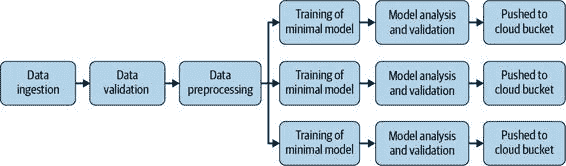
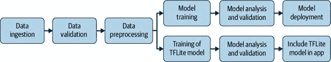
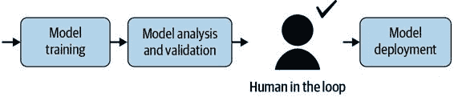
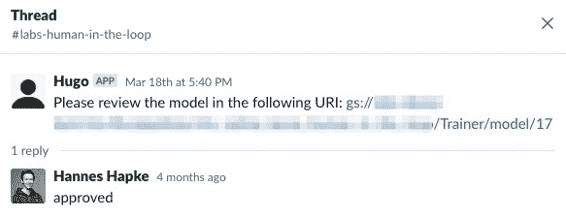
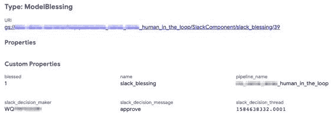
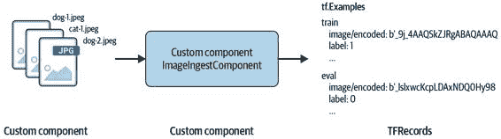
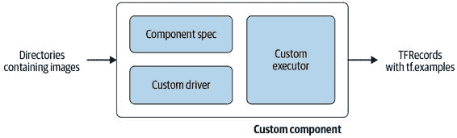
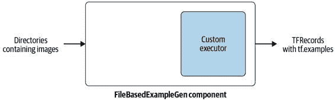

# 第十章：TensorFlow Extended 进阶

在完成有关模型部署的前两章后，我们完成了对个别管道组件的概述。在我们深入研究这些管道组件的编排之前，我们想要暂停一下，并在本章介绍 TFX 的高级概念。

到目前为止，我们介绍的管道组件已经能够为大多数问题创建机器学习管道。然而，有时我们需要构建自己的 TFX 组件或更复杂的管道图。因此，在本章中，我们将重点介绍如何构建自定义的 TFX 组件。我们将使用一个自定义的摄入组件来介绍这个主题，该组件直接摄入图像以供计算机视觉 ML 管道使用。此外，我们将介绍管道结构的高级概念：同时生成两个模型（例如，用于 TensorFlow Serving 和 TFLite 的部署），以及将人工审阅者加入管道工作流程。

> 正在进行的开发
> 
> 在撰写本文时，我们介绍的一些概念仍在开发中，因此可能会有未来的更新。在制作本出版物的过程中，我们已经尽力更新了 TFX 功能的代码示例中的更改，并且所有示例均适用于 TFX 0.22。TFX API 的更新可以在[TFX 文档](https://oreil.ly/P0S_m)中找到。

高级管道概念

在这一节中，我们将讨论三个额外的概念，以推进您的管道设置。到目前为止，我们讨论的所有管道概念都包括具有一个入口点和一个出口点的线性图。在第一章中，我们讨论了有向无环图的基础知识。只要我们的管道图是有向的并且不创建任何循环连接，我们就可以在设置上进行创意发挥。在接下来的几节中，我们将强调一些增加管道生产力的概念：

+   > > > > 同时训练多个模型
+   > > > > 
+   > > > > 导出模型以进行移动部署
+   > > > > 
+   > > > > 模型训练的温启动

同时训练多个模型

正如我们之前提到的，您可以同时训练多个模型。从同一个管道训练多个模型的常见用例是，当您想训练不同类型的模型（例如，更简单的模型）时，但您希望确保训练过的模型正在使用完全相同的转换数据和完全相同的转换图。图 10-1 显示了这种设置的工作原理。



图 10-1。同时训练多个模型

您可以通过定义多个`Trainer`组件来组装这样的图，如下面的代码示例所示：

> `def``set_trainer``(``module_file``,``instance_name``,``train_steps``=``5000``,``eval_steps``=``100``):``return``Trainer``(``module_file``=``module_file``,``custom_executor_spec``=``executor_spec``.``ExecutorClassSpec``(``GenericExecutor``),``examples``=``transform``.``outputs``[``'transformed_examples'``],``transform_graph``=``transform``.``outputs``[``'transform_graph'``],``schema``=``schema_gen``.``outputs``[``'schema'``],``train_args``=``trainer_pb2``.``TrainArgs``(``num_steps``=``train_steps``),``eval_args``=``trainer_pb2``.``EvalArgs``(``num_steps``=``eval_steps``),``instance_name``=``instance_name``)``prod_module_file``=``os``.``path``.``join``(``pipeline_dir``,``'prod_module.py'``)``trial_module_file``=``os``.``path``.``join``(``pipeline_dir``,``'trial_module.py'``)``...``trainer_prod_model``=``set_trainer``(``module_file``,``'production_model'``)``trainer_trial_model``=``set_trainer``(``trial_module_file``,``'trial_model'``,``train_steps``=``10000``,``eval_steps``=``500``)``...`


> > 有效实例化`Trainer`的函数。


> > 加载每个`Trainer`的模块。


> > 为每个图形分支实例化一个`Trainer`组件。

在这一步，我们基本上将图形分支成尽可能多的训练分支。每个`Trainer`组件都从摄入、模式和`Transform`组件的相同输入中获取。组件之间的关键区别在于，每个组件可以运行不同的训练设置，这些设置在各个训练模块文件中定义。我们还将训练和评估步骤的参数添加为函数的参数。这允许我们使用相同的训练设置（即相同的模块文件）训练两个模型，但我们可以根据不同的训练运行比较这些模型。

每个实例化的训练组件都需要由其自身的`Evaluator`消耗，如下面的代码示例所示。之后，模型可以由其自身的`Pusher`组件推送：

> `evaluator_prod_model``=``Evaluator``(``examples``=``example_gen``.``outputs``[``'examples'``],``model``=``trainer_prod_model``.``outputs``[``'model'``],``eval_config``=``eval_config_prod_model``,``instance_name``=``'production_model'``)``evaluator_trial_model``=``Evaluator``(``examples``=``example_gen``.``outputs``[``'examples'``],``model``=``trainer_trial_model``.``outputs``[``'model'``],``eval_config``=``eval_config_trial_model``,``instance_name``=``'trial_model'``)``...`

正如我们在本节中所见，我们可以使用 TFX 组装相当复杂的管道场景。在接下来的部分中，我们将讨论如何修改训练设置以将模型导出为适用于 TFLite 的移动部署。

导出 TFLite 模型

移动部署已成为机器学习模型的一个日益重要的平台。机器学习流水线可以帮助实现移动部署的一致性导出。与部署到模型服务器（如 TensorFlow Serving，在第八章中讨论）相比，移动部署需要的变更非常少。这有助于保持移动端和服务器端模型的一致更新，并帮助模型的使用者在不同设备上获得一致的体验。

> TFLITE 限制
> 
> 由于移动和边缘设备的硬件限制，TFLite 不支持所有 TensorFlow 操作。因此，并非每个模型都可以转换为 TFLite 兼容的模型。有关支持哪些 TensorFlow 操作的更多信息，请访问[TFLite 网站](https://oreil.ly/LbDBK)。

在 TensorFlow 生态系统中，TFLite 是移动部署的解决方案。TFLite 是 TensorFlow 的一个版本，可在边缘或移动设备上运行。图 10-2 展示了流水线如何包括两个训练分支。



图 10-2\. 在移动应用程序中部署模型

我们可以使用前面讨论过的分支策略，并修改模块文件的`run_fn`函数，将保存的模型重写为 TFLite 兼容格式。

示例 10-1 展示了我们需要添加到`run_fn`函数的附加功能。

示例 10-1\. TFX 重写器示例

`from``tfx.components.trainer.executor``import``TrainerFnArgs``from``tfx.components.trainer.rewriting``import``converters``from``tfx.components.trainer.rewriting``import``rewriter``from``tfx.components.trainer.rewriting``import``rewriter_factory``def``run_fn``(``fn_args``:``TrainerFnArgs``):``...``temp_saving_model_dir``=``os``.``path``.``join``(``fn_args``.``serving_model_dir``,``'temp'``)``model``.``save``(``temp_saving_model_dir``,``save_format``=``'tf'``,``signatures``=``signatures``)``tfrw``=``rewriter_factory``.``create_rewriter``(``rewriter_factory``.``TFLITE_REWRITER``,``name``=``'tflite_rewriter'``,``enable_experimental_new_converter``=``True``)``converters``.``rewrite_saved_model``(``temp_saving_model_dir``,``fn_args``.``serving_model_dir``,``tfrw``,``rewriter``.``ModelType``.``TFLITE_MODEL``)``tf``.``io``.``gfile``.``rmtree``(``temp_saving_model_dir``)`


> > 将模型导出为保存的模型


> > 实例化 TFLite 重写器。


> > 将模型转换为 TFLite 格式。


> > 转换完成后删除保存的模型。

在训练后不是导出保存模型，而是将保存模型转换为符合 TFLite 的模型，并在导出后删除保存模型。然后我们的`Trainer`组件会将 TFLite 模型导出并注册到元数据存储中。下游组件如`Evaluator`或`Pusher`可以消耗符合 TFLite 标准的模型。以下示例展示了我们如何评估 TFLite 模型，这对于检测模型优化（例如量化）是否导致模型性能下降非常有帮助：

> `eval_config``=``tfma``.``EvalConfig``(``model_specs``=``[``tfma``.``ModelSpec``(``label_key``=``'my_label'``,``model_type``=``tfma``.``TF_LITE``)],``...``)``evaluator``=``Evaluator``(``examples``=``example_gen``.``outputs``[``'examples'``],``model``=``trainer_mobile_model``.``outputs``[``'model'``],``eval_config``=``eval_config``,``instance_name``=``'tflite_model'``)`

通过这种管道设置，我们现在可以自动为移动部署生成模型，并将其推送到模型部署的工件存储中。例如，`Pusher`组件可以将生成的 TFLite 模型传送到云存储桶，移动开发人员可以从中获取模型，并在 iOS 或 Android 移动应用中使用[Google’s ML Kit](https://oreil.ly/dw8zr)部署。

> 将模型转换为 TensorFlow.js
> 
> 自 TFX 版本 0.22 开始，`rewriter_factory`提供了一个额外的功能：将现有的 TensorFlow 模型转换为 TensorFlow.js 模型。此转换允许将模型部署到 Web 浏览器和 Node.js 运行环境中。您可以通过在示例 10-1 中将`rewriter_factory`名称替换为`rewriter_factory.TFJS_REWRITER`并将`rewriter.ModelType`设置为`rewriter.ModelType.TFJS_MODEL`来使用此新功能。

模型温启动训练

在某些情况下，我们可能不希望从头开始训练模型。温启动是从先前训练运行的检查点开始模型训练的过程，特别是当模型庞大且训练时间长时特别有用。在欧洲数据保护条例（GDPR）下，用户可以随时撤销其数据使用同意，这时温启动训练可以只删除属于该特定用户的数据并对模型进行微调，而不需要从头开始训练。

在 TFX 管道中，温启动训练需要我们在 第七章 中介绍的`Resolver`组件。`Resolver`会获取最新训练模型的详细信息，并将其传递给`Trainer`组件：

> `latest_model_resolver``=``ResolverNode``(``instance_name``=``'latest_model_resolver'``,``resolver_class``=``latest_artifacts_resolver``.``LatestArtifactsResolver``,``latest_model``=``Channel``(``type``=``Model``))`

然后将最新模型传递给 `Trainer`，使用 `base_model` 参数：

> `trainer``=``Trainer``(``module_file``=``trainer_file``,``transformed_examples``=``transform``.``outputs``[``'transformed_examples'``],``custom_executor_spec``=``executor_spec``.``ExecutorClassSpec``(``GenericExecutor``),``schema``=``schema_gen``.``outputs``[``'schema'``],``base_model``=``latest_model_resolver``.``outputs``[``'latest_model'``],``transform_graph``=``transform``.``outputs``[``'transform_graph'``],``train_args``=``trainer_pb2``.``TrainArgs``(``num_steps``=``TRAINING_STEPS``),``eval_args``=``trainer_pb2``.``EvalArgs``(``num_steps``=``EVALUATION_STEPS``))`

管道然后按照正常流程继续。接下来，我们想介绍另一个可添加到我们管道中的有用功能。

人在回环

作为高级 TFX 概念的一部分，我们希望突出一个实验性组件，可以提升您的管道设置。到目前为止，我们讨论的所有管道都是从头到尾自动运行的，它们可能会自动部署您的机器学习模型。一些 TFX 用户对完全自动化的设置表示担忧，因为他们希望在自动模型分析后由人类进行审查。这可能是为了检查您训练的模型或增强自动管道设置的信心。

在本节中，我们将讨论人在回环组件的功能。在 第七章 中，我们讨论了一旦模型通过验证步骤，它就被“祝福”。下游的 `Pusher` 组件会监听此祝福信号，以确定是否推送模型。但是，如图 10-3 所示，这样的祝福也可以由人类生成。



图 10-3\. 人在回环中

谷歌的 TFX 团队发布了一个 Slack 通知组件作为自定义组件的示例。我们在本节讨论的功能可以扩展，不仅限于 Slack 信使。

组件的功能非常简单。一旦由编排工具触发，它会向指定的 Slack 频道提交一条消息，附带最新导出模型的链接，并请求数据科学家进行审查（见图 10-4）。数据科学家现在可以使用 WIT 手动调查模型并审查在`Evaluator`步骤中未测试的边缘情况。



图 10-4\. Slack 消息请求审查

数据科学家完成手动模型分析后，可以在 Slack 线程中回复他们的批准或拒绝。 TFX 组件监听 Slack 的响应，并将决策存储在元数据存储中。然后，下游组件可以使用此决策。它在模型的审计跟踪中被跟踪。 Figure 10-5 显示了来自 Kubeflow Pipeline 的血统浏览器的示例记录。 元数据存储跟踪数据科学家（即决策者）的“blessing”和时间戳（Slack 线程 ID `1584638332.0001` 标识时间戳为 Unix epoch 格式的时间）。



Figure 10-5\. Kubeflow Pipelines 中的审计跟踪

Slack 组件设置

要使 Slack 组件与您的 Slack 帐户通信，需要一个 Slack 机器人令牌。 您可以通过 [Slack API](https://api.slack.com) 请求一个机器人令牌。 一旦您获得了令牌，按照以下 `bash` 命令设置管道环境中的环境变量来存储令牌字符串：

> `$` `export` `SLACK_BOT_TOKEN``={``your_slack_bot_token``}`

Slack 组件不是标准的 TFX 组件，因此需要单独安装。 您可以通过从 GitHub 克隆 TFX 存储库，然后单独安装组件来安装组件：

> `$` `git clone https://github.com/tensorflow/tfx.git` `$` `cd` `tfx/tfx/examples/custom_components/slack` `$` `pip install -e .`

一旦组件包在您的 Python 环境中安装，该组件可以在 Python 路径中找到并加载到您的 TFX 脚本中。 以下是 Python 代码的示例。 还请记得在运行 TFX 管道的环境中安装 Slack 组件。 例如，如果您使用 Kubeflow Pipelines 运行管道，则必须为管道组件创建一个自定义 Docker 映像，其中包含 Slack 组件的源代码（因为它不是标准 TFX 组件）。

如何使用 Slack 组件

安装后的 Slack 组件可以像任何其他 TFX 组件一样加载：

> `from``slack_component.component``import``SlackComponent``slack_validator``=``SlackComponent``(``model``=``trainer``.``outputs``[``'model'``],``model_blessing``=``model_validator``.``outputs``[``'blessing'``],``slack_token``=``os``.``environ``[``'SLACK_BOT_TOKEN'``],``slack_channel_id``=``'my-channel-id'``,``timeout_sec``=``3600``,``)`


> > 从您的环境加载 Slack 令牌。


> > 指定消息应出现的频道。

当执行时，组件将发布一条消息，并等待最多一小时（由 `timeout_sec` 参数定义）的答复。 在此期间，数据科学家可以评估模型并回复他们的批准或拒绝。 下游组件（例如 `Pusher` 组件）可以从 Slack 组件消耗结果，如下面的代码示例所示：

> `pusher``=` `Pusher``(``model``=``trainer.outputs``[``'model'``]``,` `model_blessing``=``slack_validator.outputs``[``'slack_blessing'``]``,` `push_destination``=``pusher_pb2.PushDestination``(``filesystem``=``pusher_pb2.PushDestination.Filesystem``(``base_directory``=``serving_model_dir``)))`


> > Slack 组件提供的模型祝福。

通过几个额外步骤，您可以丰富您的管道，通过管道本身触发的机器学习模型的人工审计。这为管道应用程序开放了更多的工作流（例如，审计数据集统计信息或审查数据漂移度量）。 

> SLACK API 标准
> 
> Slack 组件的实现依赖于实时消息传递（RTM）协议。该协议已被弃用，可能会被新的协议标准取代，这将影响组件的功能。

自定义 TFX 组件

在第二章中，我们讨论了 TFX 组件的架构，以及每个组件包含三个部分：驱动程序、执行器和发布者。在本节中，我们希望深入探讨如何构建自己的组件。首先，我们讨论如何从头开始编写组件，然后，我们将讨论如何重用现有组件并为您自己的用例进行定制。总体而言，更改现有组件的功能总是比从头开始编写组件更容易。

为了向您演示实现，正如我们在图 10-6 中看到的那样，我们将开发一个自定义组件，用于在管道中摄取 JPEG 图像及其标签。我们将从提供的文件夹加载所有图像，并根据文件名确定标签。在我们的示例中，我们想要训练一个机器学习模型来对猫和狗进行分类。我们的图像文件名携带图像的内容（例如，dog-1.jpeg），因此我们可以根据文件名本身确定标签。我们将加载每个图像，将其转换为`tf.Example`数据结构，并将所有样本一起保存为 TFRecord 文件，供下游组件消费。



图 10-6\. 我们演示的自定义组件功能

自定义组件的用例

即使我们正在讨论作为自定义组件示例的摄取组件，您也不受架构限制。您的自定义组件可以应用于机器学习管道的任何位置。以下各节讨论的概念为您提供了最高的灵活性，以根据需要定制您的机器学习管道。一些使用自定义组件的想法包括：

+   > > > > 从您的自定义数据库中获取数据
+   > > > > 
+   > > > > 向数据科学团队发送生成数据统计信息的电子邮件
+   > > > > 
+   > > > > 如果导出了新模型，则通知 DevOps 团队
+   > > > > 
+   > > > > 启动 Docker 容器的导出后构建过程
+   > > > > 
+   > > > > 在您的机器学习审计跟踪中跟踪额外信息

我们不会单独描述如何构建这些组件，但如果这些想法中的一个对您有用，接下来的各节将提供构建自己组件的知识。

从头开始编写自定义组件

如果我们想要从头开始编写自定义组件，我们需要实现几个组件部分。首先，我们必须将组件的输入和输出定义为 `ComponentSpec`。然后，我们可以定义我们的组件执行器，它定义了如何处理输入数据和生成输出数据。如果组件需要的输入未在元数据存储中注册，我们需要编写自定义组件驱动程序。例如，当我们想要在组件中注册图像路径而工件以前未在元数据存储中注册时，就会发生这种情况。



我们自定义组件的部分见 Figure 10-7

Figure 10-7 中的步骤可能看起来很复杂，但我们将在接下来的各节中逐一讨论它们。

> 尝试重用组件
> 
> 如果您考虑修改现有的 TFX 组件功能，请考虑重用现有的 TFX 组件并更改执行器，而不是从头开始，正如我们将在“重用现有组件”部分中讨论的那样。

组件规范

组件规范或`ComponentSpec`定义了组件之间如何通信。它们描述了每个组件的三个重要细节：组件输入、组件输出以及组件执行期间可能需要的组件参数。组件通过通道进行通信，这些通道包括输入和输出。正如我们将在以下示例中看到的那样，这些通道都是类型化的。组件输入定义了组件将接收的来自先前执行的组件或新工件（如文件路径）的工件。组件输出定义了将在元数据存储中注册的工件。

组件参数定义了执行所需但在元数据存储中不可用的选项。例如，`Pusher` 组件的 `push_destination` 或 `Trainer` 组件的 `train_args`。以下示例显示了我们图像摄入组件规范的定义：

> `from``tfx.types.component_spec``import``ChannelParameter``from``tfx.types.component_spec``import``ExecutionParameter``from``tfx.types``import``standard_artifacts``class``ImageIngestComponentSpec``(``types``.``ComponentSpec``):``"""用于自定义 TFX 图像摄入组件的 ComponentSpec。"""``PARAMETERS``=``{``'name'``:``ExecutionParameter``(``type``=``Text``),``}``INPUTS``=``{``'input'``:``ChannelParameter``(``type``=``standard_artifacts``.``ExternalArtifact``),``}``OUTPUTS``=``{``'examples'``:``ChannelParameter``(``type``=``standard_artifacts``.``Examples``),``}`


> > 使用`ExternalArtifact`允许新的输入路径


> > 导出`Examples`

在我们的示例实现中，通过输入参数`input`摄取了一个输入路径的`ImageIngestComponentSpec`。 转换后的图像生成的 TFRecord 文件将通过`examples`参数传递给下游组件的路径存储。 此外，我们为组件定义了一个名为`name`的参数。

组件通道

在我们的示例`ComponentSpec`中，我们介绍了两种组件通道类型：`ExternalArtifact`和`Examples`。 这是一种用于摄取组件的特定模式，因为它们通常是管道中的第一个组件，并且没有上游组件可供我们接收已处理的`Examples`。 如果您在管道中的后续开发组件，可能希望摄取`Examples`。 因此，通道类型需要是`standard_arti⁠facts.Examples`。 但我们不仅限于两种类型。 TFX 提供了各种类型。 以下是可用类型的简要列表：

+   > > > > `ExampleStatistics`
+   > > > > 
+   > > > > `Model`
+   > > > > 
+   > > > > `ModelBlessing`
+   > > > > 
+   > > > > `Bytes`
+   > > > > 
+   > > > > `String`
+   > > > > 
+   > > > > `Integer`
+   > > > > 
+   > > > > `Float`
+   > > > > 
+   > > > > `HyperParameters`

现在我们已经设置了我们的`ComponentSpec`，让我们来看看组件执行器。

组件执行器

组件执行器定义了组件内部的流程，包括如何使用输入生成组件输出。 即使我们将从头开始编写此基本组件，我们也可以依赖于 TFX 类来继承函数模式。 作为`Executor`对象的一部分，TFX 将寻找一个名为`Do`的函数，用于描述我们组件的执行细节。 我们将在这个函数中实现我们组件的功能：

> `from``tfx.components.base``import``base_executor``class``Executor``(``base_executor``.``BaseExecutor``):``"""用于图像摄取组件的执行器。"""``def``Do``(``self``,``input_dict``:``Dict``[``Text``,``List``[``types``.``Artifact``]],``output_dict``:``Dict``[``Text``,``List``[``types``.``Artifact``]],``exec_properties``:``Dict``[``Text``,``Any``])``->``None``:``...`

代码片段显示了我们的`Executor`的`Do`函数期望三个参数：`input_dict`，`output_dict`和`exec_properties`。 这些 Python 字典包含我们传递给组件和从组件传递的工件引用以及执行属性。

> 工件包含引用
> 
> 通过`input_dict`和`output_dict`提供的信息包含在元数据存储中。 这些是工件的引用，而不是底层数据本身。 例如，我们的`input_dict`字典将包含一个协议缓冲区，其中包含文件位置信息，而不是数据。 这使我们能够使用诸如 Apache Beam 之类的程序有效地处理数据。

要详细介绍执行器的工作`Do`方法的基本实现，我们将重复使用我们在“计算机视觉问题的图像数据”中讨论的实现，将图像转换为 TFRecord 数据结构。有关转换过程和 TFRecord 数据结构的详细说明可以在那里找到。这段代码应该看起来很熟悉：

> `def``convert_image_to_TFExample``(``image_filename``,``tf_writer``,``input_base_uri``):``image_path``=``os``.``path``.``join``(``input_base_uri``,``image_filename``)``lowered_filename``=``image_path``.``lower``()``if``"dog"``in``lowered_filename``:``label``=``0``elif``"cat"``in``lowered_filename``:``label``=``1``else``:``raise``NotImplementedError``(``"Found unknown image"``)``raw_file``=``tf``.``io``.``read_file``(``image_path``)``example``=``tf``.``train``.``Example``(``features``=``tf``.``train``.``Features``(``feature``=``{``'image_raw'``:``_bytes_feature``(``raw_file``.``numpy``()),``'label'``:``_int64_feature``(``label``)``}))``writer``.``write``(``example``.``SerializeToString``())`


> > 组装完整的图像路径。


> > 根据文件路径确定每个图像的标签。


> > 从磁盘读取图像。


> > 创建`TensorFlow Example`数据结构。


> > 将`tf.Example`写入 TFRecord 文件。

现在我们已经完成了读取图像文件并将其存储在包含 TFRecord 数据结构文件中的通用函数，我们现在可以专注于特定于自定义组件的代码。

我们希望我们非常基础的组件能够加载我们的图像，将它们转换为`tf.Examples`，并返回两组图像用于训练和评估。为了我们示例的简单性，我们将硬编码评估示例的数量。在生产级组件中，这个参数应该通过`ComponentSpecs`中的执行参数动态设置。我们组件的输入将是包含所有图像的文件夹的路径。我们组件的输出将是我们将存储训练和评估数据集的路径。该路径将包含两个子目录（`train`和`eval`），这些子目录包含 TFRecord 文件：

> `class``ImageIngestExecutor``(``base_executor``.``BaseExecutor``):``def``Do``(``self``,``input_dict``:``Dict``[``Text``,``List``[``types``.``Artifact``]],``output_dict``:``Dict``[``Text``,``List``[``types``.``Artifact``]],``exec_properties``:``Dict``[``Text``,``Any``])``->``None``:``self``.``_log_startup``(``input_dict``,``output_dict``,``exec_properties``)``input_base_uri``=``artifact_utils``.``get_single_uri``(``input_dict``[``'input'``])``image_files``=``tf``.``io``.``gfile``.``listdir``(``input_base_uri``)``random``.``shuffle``(``image_files``)``splits``=``get_splits``(``images``)``for``split_name``,``images``in``splits``:``output_dir``=``artifact_utils``.``get_split_uri``(``output_dict``[``'examples'``],``split_name``)``tfrecord_filename``=``os``.``path``.``join``(``output_dir``,``'images.tfrecord'``)``options``=``tf``.``io``.``TFRecordOptions``(``compression_type``=``None``)``writer``=``tf``.``io``.``TFRecordWriter``(``tfrecord_filename``,``options``=``options``)``for``image``in``images``:``convert_image_to_TFExample``(``image``,``tf_writer``,``input_base_uri``)`


> > 记录参数。


> > 从 artifact 中获取文件夹路径。


> > 获取所有文件名。


> > 设置分割统一资源标识符（URI）。


> > 创建带有选项的 TFRecord 写入器实例。


> > 将图像写入包含 TFRecord 数据结构的文件中。

我们的基本`Do`方法接收`input_dict`、`output_dict`和`exec_properties`作为方法的参数。第一个参数包含作为 Python 字典存储在元数据存储中的 artifact 引用，第二个参数接收我们希望从组件中导出的引用，最后一个方法参数包含额外的执行参数，例如我们的情况下组件名称。TFX 提供了非常有用的`artifact_utils`函数，让我们能够处理我们的 artifact 信息。例如，我们可以使用以下代码提取数据输入路径：

> `artifact_utils``.``get_single_uri``(``input_dict``[``'input'``])`

我们还可以根据分割名称设置输出路径的名称：

> `artifact_utils``.``get_split_uri``(``output_dict``[``'examples'``],``split_name``)`

上述函数提出了一个很好的观点。为了示例的简单性，我们忽略了动态设置数据分割的选项，正如我们在第三章中讨论的那样。实际上，在我们的示例中，我们正在硬编码分割名称和数量：

> ```python

对于生产中的组件来说，这样的功能并不理想，但完整的实现将超出本章的范围。在接下来的部分中，我们将讨论如何重用现有组件功能并简化您的实现。本节中的组件将具有与我们在第三章中讨论的相同功能。

组件驱动器

如果我们使用到目前为止定义的执行器运行组件，我们将遇到一个 TFX 错误，即输入未在元数据存储中注册，并且我们需要在运行自定义组件之前执行前一个组件。但在我们的情况下，我们没有上游组件，因为我们正在将数据摄取到我们的管道中。数据摄取步骤是每个管道的开始。那么问题出在哪里呢？

正如我们之前讨论的，TFX 中的组件通过元数据存储彼此通信，组件期望输入工件已经在元数据存储中注册。在我们的情况下，我们希望从磁盘摄取数据，在我们的管道中第一次读取数据；因此，数据不是从不同的组件传递下来，我们需要在元数据存储中注册数据源。

> 自定义驱动器是罕见的。
> 
> 你很少需要实现自定义驱动器。如果你可以重用现有 TFX 组件的输入/输出架构，或者如果输入已经在元数据存储中注册了，你就不需要编写自定义驱动器，可以跳过这一步。

类似于我们的自定义执行器，我们可以重用 TFX 提供的 `BaseDriver` 类来编写自定义驱动器。我们需要重写组件的标准行为，可以通过重写 `BaseDriver` 的 `resolve_input_artifacts` 方法来实现。一个最简驱动器将注册我们的输入，这是直截了当的。我们需要解包通道以获取 `input_dict`。通过遍历 `input_dict` 的所有值，我们可以访问每个输入列表。再次遍历每个列表，我们可以获取每个输入，然后通过将其传递给函数 `publish_artifacts` 在元数据存储中注册它。`publish_artifacts` 将调用元数据存储，发布工件，并设置工件的状态为准备发布：

> `class``ImageIngestDriver``(``base_driver``.``BaseDriver``):``"""ImageIngest 的自定义驱动程序。"""``def``resolve_input_artifacts``(``self``,``input_channels``:``Dict``[``Text``,``types``.``Channel``],``exec_properties``:``Dict``[``Text``,``Any``],``driver_args``:``data_types``.``DriverArgs``,``pipeline_info``:``data_types``.``PipelineInfo``)``->``Dict``[``Text``,``List``[``types``.``Artifact``]]:``"""重写 BaseDriver.resolve_input_artifacts()。"""``del``driver_args``del``pipeline_info``input_dict``=``channel_utils``.``unwrap_channel_dict``(``input_channels``)``for``input_list``in``input_dict``.``values``():``for``single_input``in``input_list``:``self``.``_metadata_handler``.``publish_artifacts``([``single_input``])``absl``.``logging``.``debug``(``"已注册输入：{}"``.``format``(``single_input``))``absl``.``logging``.``debug``(``"single_input.mlmd_artifact "``"{}"``.``format``(``single_input``.``mlmd_artifact``))``return``input_dict`


> > 删除未使用的参数。


> > 解包通道以获取输入字典。


> > 发布该工件。


> > 打印工件信息。

在循环每个输入时，我们可以打印额外的信息：

> `print``(``"已注册新输入：{}"``.``format``(``single_input``))``print``(``"工件 URI：{}"``.``format``(``single_input``.``uri``))``print``(``"MLMD 工件信息：{}"``.``format``(``single_input``.``mlmd_artifact``))`

自定义驱动程序现已就位，我们需要组装我们的组件。

组装自定义组件

`ImageIngestComponentSpec`定义完成，`ImageIngestExecutor`已完成，`ImageIngestDriver`已设置好，现在让我们在`ImageIngestComponent`中将它们统一起来。例如，我们可以将该组件加载到一个训练图像分类模型的流水线中。

要定义实际的组件，我们需要定义规范、执行程序和驱动程序类。我们可以通过设置`SPEC_CLASS`、`EXECUTOR_SPEC`和`DRIVER_CLASS`来完成这一点，如下例所示。作为最后一步，我们需要用组件的参数（例如输入和输出示例以及提供的名称）实例化我们的`ComponentSpecs`，并将其传递给实例化的`ImageIngestComponent`。

如果我们没有提供输出工件的情况极少见，我们可以将我们的默认输出工件设置为`tf.Example`类型，定义我们硬编码的分割名称，并将其设置为一个通道：

> `from``tfx.components.base``import``base_component``from``tfx``import``types``from``tfx.types``import``channel_utils``class``ImageIngestComponent``(``base_component``.``BaseComponent``):``"""自定义 ImageIngestWorld 组件。"""``SPEC_CLASS``=``ImageIngestComponentSpec``EXECUTOR_SPEC``=``executor_spec``.``ExecutorClassSpec``(``ImageIngestExecutor``)``DRIVER_CLASS``=``ImageIngestDriver``def` `__init__``(``self``,``input``,``output_data``=``None``,``name``=``None``):``if``not``output_data``:``examples_artifact``=``standard_artifacts``.``Examples``()``examples_artifact``.``split_names``=` `\` `artifact_utils``.``encode_split_names``([``'train'``,``'eval'``])``output_data``=``channel_utils``.``as_channel``([``examples_artifact``])``spec``=``ImageIngestComponentSpec``(``input``=``input``,``examples``=``output_data``,``name``=``name``)``super``(``ImageIngestComponent``,``self``)``.``__init__``(``spec``=``spec``)`

通过组装我们的`ImageIngestComponent`，我们已经将基本自定义组件的各个部分联系在一起。在下一节中，我们将看看如何执行我们的基本组件。

使用我们的基本自定义组件

在实施完整的基本组件以摄入图像并将其转换为 TFRecord 文件之后，我们可以像管道中的任何其他组件一样使用该组件。以下代码示例展示了如何执行。请注意，它看起来与我们在第三章中讨论的其他摄入组件的设置完全相同。唯一的区别是，我们需要导入我们新创建的组件，然后运行初始化的组件：

> `import``os``from``tfx.utils.dsl_utils``import``external_input``from``tfx.orchestration.experimental.interactive.interactive_context``import` `\` `InteractiveContext``from``image_ingestion_component.component``import``ImageIngestComponent``context``=``InteractiveContext``()``image_file_path``=``"/path/to/files"``examples``=``external_input``(``dataimage_file_path_root``)``example_gen``=``ImageIngestComponent``(``input``=``examples``,``name``=``u``'ImageIngestComponent'``)``context``.``run``(``example_gen``)`

组件的输出可以被下游组件（例如`StatisticsGen`）所使用：

> `from``tfx.components``import``StatisticsGen``statistics_gen``=``StatisticsGen``(``examples``=``example_gen``.``outputs``[``'examples'``])``context``.``run``(``statistics_gen``)``context``.``show``(``statistics_gen``.``outputs``[``'statistics'``])`
> 
> 非常基础的实现
> 
> 我们要提醒您，所讨论的实现仅提供基本功能，不适合生产环境。有关缺失功能的详细信息，请参阅下一节。要获取产品级实现，请参阅我们在接下来的章节中更新的组件实现。

实施审查

在前面的章节中，我们介绍了基本组件的实现。虽然该组件功能正常，但缺少我们在 第三章 中讨论过的一些关键功能（例如，动态拆分名称或拆分比例）—我们期望从我们的摄取组件中获得这样的功能。基本实现还需要大量样板代码（例如，组件驱动的设置）。需要有效且可扩展地处理图像的摄取。我们可以通过 TFX 组件底层的 Apache Beam 使用来实现这种高效的数据摄取。

在接下来的章节中，我们将讨论如何简化实现并采纳我们在 第三章 中讨论过的模式—例如，从 Presto 数据库中摄取数据。通过重用诸如组件驱动之类的常见功能，我们可以加快实施速度并减少代码错误。

重用现有组件

不必从头开始编写 TFX 组件，我们可以继承现有组件，并通过覆盖执行器功能来进行定制。如 图 10-8 所示，这通常是在组件重用现有组件架构时的首选方法。对于我们的演示组件而言，其架构等同于基于文件的摄取组件（例如，`CsvExampleGen`）。这类组件接收一个目录路径作为组件输入，从提供的目录加载数据，将数据转换为 `tf.Examples`，并将数据结构作为 TFRecord 文件从组件输出返回。



图 10-8\. 扩展现有组件

正如我们在 第三章 中讨论过的那样，TFX 提供了 `FileBasedExampleGen` 来实现这一目的。由于我们将重用现有组件，类似于我们的 Avro 和 Parquet 示例，我们只需专注于开发我们的自定义执行器，并使其与我们之前的基本组件更加灵活。通过重用现有的代码基础设施，我们还可以依赖现有的 Apache Beam 实现。

通过重用现有组件架构将数据摄取到我们的流水线中，我们还可以利用 Apache Beam 有效地重用设置来进行数据摄取。TFX 和 Apache Beam 提供了类（例如，`GetInputSourceToExamplePTransform`）和函数装饰器（例如，`@beam.ptransform_fn`）来通过 Apache Beam 管道进行数据摄取。在我们的示例中，我们使用了函数装饰器 `@beam.ptransform_fn`，它允许我们定义 Apache Beam 转换（`PTransform`）。该装饰器接受一个 Apache Beam 管道，运行给定的转换（例如，在我们的情况下，加载图像并将其转换为 `tf.Examples`），并返回具有转换结果的 Apache Beam `PCollection`。

转换功能由一个与我们先前实现非常相似的函数处理。更新后的转换实现有一个主要区别：我们不需要实例化和使用 TFRecord 写入器；相反，我们可以完全专注于加载图像并将它们转换为`tf.Examples`。我们不需要实现任何将`tf.Examples`写入 TFRecord 数据结构的函数，因为我们在先前的实现中已经做过了。相反，我们返回生成的`tf.Examples`，让底层的 TFX/Apache Beam 代码处理 TFRecord 文件的写入。以下代码示例展示了更新后的转换函数：

> `def``convert_image_to_TFExample``(``image_path``)):``# 根据文件路径确定每个图像的标签。``lowered_filename``=``image_path``.``lower``()``print``(``lowered_filename``)``if``"dog"``in``lowered_filename``:``label``=``0``elif``"cat"``in``lowered_filename``:``label``=``1``else``:``raise``NotImplementedError``(``"Found unknown image"``)``# 读取图像。``raw_file``=``tf``.``io``.``read_file``(``image_path``)``# 创建 TensorFlow Example 数据结构。``example``=``tf``.``train``.``Example``(``features``=``tf``.``train``.``Features``(``feature``=``{``'image_raw'``:``_bytes_feature``(``raw_file``.``numpy``()),``'label'``:``_int64_feature``(``label``)``}))``return``example`


> > 只需要文件路径。


> > 该函数返回示例而不是将其写入磁盘。

使用更新后的转换函数，我们现在可以专注于实现核心执行器功能。由于我们正在定制现有的组件架构，所以可以使用与我们在第三章讨论过的相同参数，例如分割模式。在以下代码示例中的`image_to_example`函数中，我们接受四个输入参数：一个 Apache Beam 管道对象，一个带有工件信息的`input_dict`，一个包含执行属性的字典以及摄取的分割模式。在函数中，我们生成给定目录中可用文件的列表，并将图像列表传递给 Apache Beam 管道，以将摄取目录中找到的每个图像转换为`tf.Examples`：

> `@beam.ptransform_fn``def``image_to_example``(``pipeline``:``beam``.``Pipeline``,``input_dict``:``Dict``[``Text``,``List``[``types``.``Artifact``]],``exec_properties``:``Dict``[``Text``,``Any``],``split_pattern``:``Text``)``->``beam``.``pvalue``.``PCollection``:``input_base_uri``=``artifact_utils``.``get_single_uri``(``input_dict``[``'input'``])``image_pattern``=``os``.``path``.``join``(``input_base_uri``,``split_pattern``)``absl``.``logging``.``info``(``"Processing input image data {} "``"to tf.Example."``.``format``(``image_pattern``))``image_files``=``tf``.``io``.``gfile``.``glob``(``image_pattern``)``if``not``image_files``:``raise``RuntimeError``(``"Split pattern {} did not match any valid path."``""``.``format``(``image_pattern``))``p_collection``=``(``pipeline``|``beam``.``Create``(``image_files``)``|``'ConvertImagesToTFRecords'``>>``beam``.``Map``(``lambda``image``:``convert_image_to_TFExample``(``image``))``)``return``p_collection`


> > 生成摄入路径中存在的文件列表。


> > 将列表转换为 Beam 的 `PCollection`。


> > 将转换应用于每个图像。

我们自定义执行器的最后一步是用我们的 `image_to_example` 覆盖 `BaseExampleGenExecutor` 的 `GetInputSourceToExamplePTransform`：

> `class``ImageExampleGenExecutor``(``BaseExampleGenExecutor``):``@beam.ptransform_fn``def``image_to_example``(``...``):``...``def``GetInputSourceToExamplePTransform``(``self``)``->``beam``.``PTransform``:``return``image_to_example`

我们的自定义图像摄入组件现在已经完成！

使用我们的自定义执行器

由于我们正在重用摄入组件并交换处理执行器，现在我们可以按照我们在 第三章 中讨论的相同模式进行操作，并指定一个 `custom_executor_spec`。通过重用 `FileBasedExampleGen` 组件并覆盖 `executor`，我们可以使用我们在 第三章 中讨论过的摄入组件的全部功能，比如定义输入分割模式或输出训练/评估分割。以下代码片段给出了使用我们自定义组件的完整示例：

> `from``tfx.components``import``FileBasedExampleGen``from``tfx.utils.dsl_utils``import``external_input``from``image_ingestion_component.executor``import``ImageExampleGenExecutor``input_config``=``example_gen_pb2``.``Input``(``splits``=``[``example_gen_pb2``.``Input``.``Split``(``name``=``'images'``,``pattern``=``'sub-directory/if/needed/*.jpg'``),``])``output``=``example_gen_pb2``.``Output``(``split_config``=``example_gen_pb2``.``SplitConfig``(``splits``=``[``example_gen_pb2``.``SplitConfig``.``Split``(``name``=``'train'``,``hash_buckets``=``4``),``example_gen_pb2``.``SplitConfig``.``Split``(``name``=``'eval'``,``hash_buckets``=``1``)``])``)``example_gen``=``FileBasedExampleGen``(``input``=``external_input``(``"/path/to/images/"``),``input_config``=``input_config``,``output_config``=``output``,``custom_executor_spec``=``executor_spec``.``ExecutorClassSpec``(``ImageExampleGenExecutor``)``)`

正如我们在本节讨论的那样，扩展组件执行器总是比从头开始编写自定义组件更简单且更快。因此，如果您能够重用现有的组件架构，我们建议使用这个过程。

摘要

在本章中，我们扩展了前几章的 TFX 概念。我们详细讨论了如何编写自定义组件。编写自定义组件使我们能够扩展现有的 TFX 组件，并根据我们流水线的需求进行定制。自定义组件允许我们将更多步骤集成到我们的机器学习流水线中。通过向我们的流水线添加更多组件，我们可以保证所有流水线生成的模型经过相同的步骤。由于自定义组件的实施可能较为复杂，我们回顾了从头开始实现组件的基本实现，并突出了通过继承现有组件功能来实现新组件执行器的实现。

我们还讨论了用于训练设置的高级设置，例如分支流水线图，以从同一流水线执行中生成多个模型。此功能可用于生成适用于移动应用程序部署的 TFLite 模型。我们还讨论了温暖启动训练过程，以持续训练机器学习模型。温暖启动模型训练是缩短持续训练模型训练步骤的绝佳方法。

我们介绍了在机器学习流水线设置中引入人类参与的概念，并讨论了如何实现实验组件。人类参与的概念是在部署模型之前将专家审查作为必需的流水线步骤添加的一种方式。我们相信，完全自动化的组件与少数数据科学家的关键审查的结合将支持机器学习流水线的采纳。

在接下来的两章中，我们将看看如何在您选择的编排环境中运行我们的 TFX 流水线。
