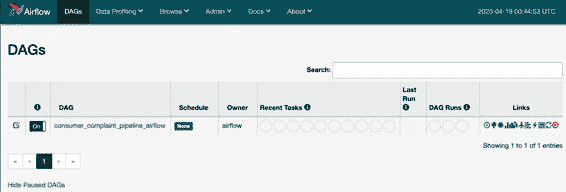

# 第十一章：管道第一部分：Apache Beam 和 Apache Airflow

在前几章中，我们介绍了使用 TFX 构建机器学习管道所需的所有组件。在本章中，我们将把所有组件整合起来，展示如何使用两个编排工具（Apache Beam 和 Apache Airflow）运行完整的管道。在第十二章中，我们还将展示如何使用 Kubeflow Pipelines 运行管道。所有这些工具遵循类似的原则，但我们将展示细节上的差异，并为每个工具提供示例代码。

正如我们在第一章中讨论的那样，管道编排工具对于抽象化我们需要编写的胶水代码以自动化机器学习管道非常重要。如图 11-1 所示，管道编排工具位于我们在前几章已经提到的组件之下。如果没有这些编排工具之一，我们将需要编写代码来检查一个组件何时完成，启动下一个组件，安排管道的运行等等。幸运的是，所有这些代码已经以这些编排工具的形式存在！


图 11-1\. 管道编排工具

我们将从讨论不同工具的使用案例开始本章。然后，我们将逐步介绍一些常见代码，这些代码是从交互式管道转移到可以由这些工具编排的管道所必需的。Apache Beam 和 Apache Airflow 的设置比 Kubeflow Pipelines 简单，因此我们将在本章中讨论它们，然后再转向功能更强大的 Kubeflow Pipelines，在第十二章中详细讨论。

选择哪种编排工具？

在本章和第十二章中，我们将讨论三种你可以使用的管道编排工具：Apache Beam、Apache Airflow 和 Kubeflow Pipelines。你需要选择其中一种工具来运行每个管道。在深入研究如何使用所有这些工具之前，我们将描述每个工具的一些优缺点，这将帮助你决定哪种工具最适合你的需求。

Apache Beam

如果你正在使用 TFX 进行管道任务，那么你已经安装了 Apache Beam。因此，如果你正在寻找一个最小的安装选项，重用 Beam 来编排是一个合乎逻辑的选择。这样设置非常简单，而且还允许你使用任何你可能已经熟悉的现有分布式数据处理基础设施（例如 Google Cloud Dataflow）。在转移到 Airflow 或 Kubeflow Pipelines 之前，你也可以使用 Beam 作为中间步骤来确保你的管道正确运行。

然而，Apache Beam 缺少多种用于调度模型更新或监视管道作业过程的工具。这就是 Apache Airflow 和 Kubeflow Pipelines 脱颖而出的地方。

Apache Airflow

Apache Airflow 通常已经在公司中用于数据加载任务。将现有的 Apache Airflow 设置扩展到运行你的管道意味着你不需要学习 Kubeflow 等新工具。

如果你将 Apache Airflow 与像 PostgreSQL 这样的生产就绪数据库结合使用，你可以利用执行部分管道的优势。如果一个耗时的管道失败，你可以节省大量时间，而且你想避免重新运行所有之前的管道步骤。

Kubeflow Pipelines

如果你已经有了 Kubernetes 的经验并且可以访问 Kubernetes 集群，考虑使用 Kubeflow Pipelines 是有道理的。虽然设置 Kubeflow 比 Airflow 安装更复杂，但它开启了各种新机会，包括查看 TFDV 和 TFMA 的可视化、模型谱系和艺术品集合。

Kubernetes 也是一个优秀的基础设施平台，用于部署机器学习模型。通过 Kubernetes 工具 Istio 进行推理路由目前是机器学习基础设施领域的最新技术。

你可以使用各种云提供商设置 Kubernetes 集群，因此你不限于单一供应商。Kubeflow Pipelines 还允许你利用由云提供商提供的最先进的训练硬件。你可以高效地运行你的管道，并在你的集群节点上进行缩放。

AI 平台上的 Kubeflow Pipelines

你也可以在 Google 的 AI 平台上运行 Kubeflow Pipelines，这是 GCP 的一部分。这为你处理了大部分基础设施，并且使得从 Google Cloud 存储桶加载数据变得轻松。此外，Google 的 Dataflow 集成简化了管道的扩展。但是，这将使你锁定在一个单一的云提供商上。

如果你决定选择 Apache Beam 或 Airflow，本章包含了你将需要的信息。如果你选择 Kubeflow（通过 Kubernetes 或 Google Cloud 的 AI 平台），你只需要阅读本章的下一节。这将向你展示如何将你的交互式管道转换为脚本，然后你可以前往第十二章。

将你的交互式 TFX 管道转换为生产管道

到目前为止，我们的示例展示了如何在笔记本式环境或交互式环境中运行 TFX 管道的所有不同组件。要在笔记本中运行管道，每个组件需要在前一个组件完成后手动触发。为了自动化我们的管道，我们将需要编写一个 Python 脚本，该脚本将在没有我们任何输入的情况下运行所有这些组件。

幸运的是，我们已经有了这个脚本的所有部分。我们将总结到目前为止我们讨论过的所有管道组件：

`ExampleGen`

> > 从我们希望使用的数据源摄取新数据（第三章）

`StatisticsGen`

> > 计算新数据的摘要统计信息（第四章）

`SchemaGen`

> > 定义模型期望的特征，以及它们的类型和范围（第四章）

`ExampleValidator`

> > 检查数据是否符合模式，并标记任何异常（第四章）

`Transform`

> > 将数据预处理为模型期望的正确数值表示（第五章）

`Trainer`

> > 在新数据上训练模型（第六章）

`Resolver`

> > 检查之前已经认证的模型是否存在，并返回以进行比较（第七章）

`Evaluator`

> > 在评估数据集上评估模型的性能，并在其是前一个版本的改进时验证模型（第七章）

`Pusher`

> > 如果模型通过验证步骤，则将模型推送到服务目录中（第七章）

完整的管道展示在 例子 11-1 中。

例子 11-1\. 基本管道

`import``tensorflow_model_analysis``as``tfma``from``tfx.components``import``(``CsvExampleGen``,``Evaluator``,``ExampleValidator``,``Pusher``,``ResolverNode``,``SchemaGen``,``StatisticsGen``,``Trainer``,``Transform``)``from``tfx.components.base``import``executor_spec``from``tfx.components.trainer.executor``import``GenericExecutor``from``tfx.dsl.experimental``import``latest_blessed_model_resolver``from``tfx.proto``import``pusher_pb2``,``trainer_pb2``from``tfx.types``import``Channel``from``tfx.types.standard_artifacts``import``Model``,``ModelBlessing``from``tfx.utils.dsl_utils``import``external_input``def``init_components``(``data_dir``,``module_file``,``serving_model_dir``,``training_steps``=``2000``,``eval_steps``=``200``):``examples``=``external_input``(``data_dir``)``example_gen``=``CsvExampleGen``(``...``)``statistics_gen``=``StatisticsGen``(``...``)``schema_gen``=``SchemaGen``(``...``)``example_validator``=``ExampleValidator``(``...``)``transform``=``Transform``(``...``)``trainer``=``Trainer``(``...``)``model_resolver``=``ResolverNode``(``...``)``eval_config``=``tfma``.``EvalConfig``(``...``)``evaluator``=``Evaluator``(``...``)``pusher``=``Pusher``(``...``)``components``=``[``example_gen``,``statistics_gen``,``schema_gen``,``example_validator``,``transform``,``trainer``,``model_resolver``,``evaluator``,``pusher``]``return``components`

在我们的示例项目中，我们已将组件实例化从管道配置中分离，以便专注于不同编排器的管道设置。

`init_components` 函数实例化组件。除了训练步骤数和评估步骤数之外，还需要三个输入：

`data_dir`

> > 训练/评估数据的路径。

`module_file`

> > `Transform`和`Trainer`组件所需的 Python 模块。分别在第五章和第六章进行了描述。

`serving_model_dir`

> > 导出模型应存储的路径。

除了我们将在第十二章中讨论的 Google Cloud 设置微调外，每个编排器平台的组件设置都将相同。因此，我们将在 Apache Beam、Apache Airflow 和 Kubeflow Pipelines 的不同示例设置中重用组件定义。如果您想要使用 Kubeflow Pipelines，您可能会发现 Beam 对于调试管道很有用。但如果您想直接进入 Kubeflow Pipelines，请转到下一章！

Beam 和 Airflow 的简单交互式管道转换

如果您希望使用 Apache Beam 或 Airflow 编排您的管道，您还可以通过以下步骤将笔记本转换为管道。对于您不希望导出的笔记本中的任何单元格，请在每个单元格的开头使用`%%skip_for_export` Jupyter 魔法命令。

首先，设置管道名称和编排工具：

> `runner_type``=``'beam'``pipeline_name``=``'consumer_complaints_beam'`


> > 或者，`airflow`。

然后，设置所有相关文件路径：

> `notebook_file``=``os``.``path``.``join``(``os``.``getcwd``(),``notebook_filename``)``# 管道输入``data_dir``=``os``.``path``.``join``(``pipeline_dir``,``'data'``)``module_file``=``os``.``path``.``join``(``pipeline_dir``,``'components'``,``'module.py'``)``requirement_file``=``os``.``path``.``join``(``pipeline_dir``,``'requirements.txt'``)``# 管道输出``output_base``=``os``.``path``.``join``(``pipeline_dir``,``'output'``,``pipeline_name``)``serving_model_dir``=``os``.``path``.``join``(``output_base``,``pipeline_name``)``pipeline_root``=``os``.``path``.``join``(``output_base``,``'pipeline_root'``)``metadata_path``=``os``.``path``.``join``(``pipeline_root``,``'metadata.sqlite'``)`

接下来，列出您希望包含在管道中的组件：

> `components``=``[``example_gen``,``statistics_gen``,``schema_gen``,``example_validator``,``transform``,``trainer``,``evaluator``,``pusher``]`

然后导出管道：

> `pipeline_export_file``=``'consumer_complaints_beam_export.py'``context``.``export_to_pipeline``(``notebook_file``path``=``_notebook_file``,``export_file``path``=``pipeline_export_file``,``runner_type``=``runner_type``)`

此导出命令将生成一个脚本，可以使用 Beam 或 Airflow 运行，具体取决于您选择的`runner_type`。

Apache Beam 简介

因为 Apache Beam 在许多 TFX 组件的后台运行，所以我们在第二章中引入了它。各种 TFX 组件（例如 TFDV 或 TensorFlow `Transform`）使用 Apache Beam 来抽象内部数据处理。但是许多相同的 Beam 功能也可以用来运行您的管道。在接下来的部分中，我们将展示如何使用 Beam 来编排我们的示例项目。

使用 Apache Beam 编排 TFX 管道

Apache Beam 已作为 TFX 的依赖项安装，这使得将其作为我们的管道编排工具非常简单。Beam 非常简单，并且不具有像图形可视化、计划执行等 Airflow 或 Kubeflow Pipelines 的所有功能。

Beam 也可以是调试机器学习管道的好方法。通过在管道调试期间使用 Beam，然后切换到 Airflow 或 Kubeflow Pipelines，您可以排除由更复杂的 Airflow 或 Kubeflow Pipelines 设置引起的管道错误的根本原因。

在本节中，我们将演示如何使用 Beam 设置和执行我们的示例 TFX 管道。我们在第二章中介绍了 Beam `Pipeline`函数。这是我们将与我们的 Example 11-1 脚本一起使用来运行管道的内容。我们将定义一个 Beam `Pipeline`，它接受 TFX 管道组件作为参数，并连接到持有 ML MetadataStore 的 SQLite 数据库：

> `import``absl``from``tfx.orchestration``import``metadata``,``pipeline``def``init_beam_pipeline``(``components``,``pipeline_root``,``direct_num_workers``):``absl``.``logging``.``info``(``"Pipeline root set to: {}"``.``format``(``pipeline_root``))``beam_arg``=````"--direct_num_workers={}"``.``format``(``direct_num_workers``),`![`"--requirements_file={}"``.``format``(``requirement_file``)``]``p``=``pipeline``.``Pipeline``(``pipeline_name``=``pipeline_name``,``pipeline_root``=``pipeline_root``,``components``=``components``,``enable_cache``=``False``,``metadata_connection_config``=``\` `metadata``.``sqlite_metadata_connection_config``(``metadata_path``),``beam_pipeline_args``=``beam_arg``)``return``p`


> > Beam allows you to specify the number of workers. A sensible default is half the number of CPUs (if there is more than one CPU).


> > 在这里，您可以使用配置定义管道对象。


> > 如果希望避免重新运行已完成的组件，我们可以将缓存设置为`True`。如果将此标志设置为`False`，每次运行管道时都会重新计算所有内容。

Beam 管道配置需要包括管道名称、管道目录根路径以及作为管道执行一部分的组件列表。

接下来，我们将按照 示例 11-1 初始化组件，初始化流水线如前所述，并使用 `BeamDagRunner().run(pipeline)` 运行流水线：

> `from``tfx.orchestration.beam.beam_dag_runner``import``BeamDagRunner``components``=``init_components``(``data_dir``,``module_file``,``serving_model_dir``,``training_steps``=``100``,``eval_steps``=``100``)``pipeline``=``init_beam_pipeline``(``components``,``pipeline_root``,``direct_num_workers``)``BeamDagRunner``()``.``run``(``pipeline``)`

这是一个最小设置，您可以轻松集成到其余基础架构中，或使用 cron 作业进行调度。您还可以使用 [Apache Flink](https://flink.apache.org) 或 Spark 扩展此流水线。有关使用 Flink 的示例，请参见 [此 TFX 示例](https://oreil.ly/FYzLY) 中的简要描述。

在接下来的部分，我们将继续使用 Apache Airflow，当我们用它来编排我们的流水线时，它提供了许多额外的功能。

Apache Airflow 简介

Airflow 是 Apache 的工作流自动化项目。该项目始于 2016 年，并自那时起引起了大公司和整个数据科学社区的广泛关注。2018 年 12 月，该项目从 Apache 孵化器“毕业”，成为自己的 [Apache 项目](https://airflow.apache.org)。

Apache Airflow 允许您通过用 Python 代码表示的 DAG 表示工作流任务。此外，Airflow 还允许您调度和监视工作流。这使它成为我们 TFX 流水线的理想编排工具。

在本节中，我们将介绍设置 Airflow 的基础知识。然后，我们将展示如何使用它来运行我们的示例项目。

安装和初始设置

Apache Airflow 的基本设置非常简单。如果您使用的是 Mac 或 Linux，可以使用以下命令定义 Airflow 数据的位置：

> `$` `$` `export` `AIRFLOW_HOME``=``~/airflow`

定义好 Airflow 的主数据文件夹后，您可以安装 Airflow：

> `$` `pip install apache-airflow`

Airflow 可以安装多种依赖项。在撰写本文时，扩展列表包括 PostgreSQL 支持、Dask、Celery 和 Kubernetes。

您可以在 [Airflow 文档](https://oreil.ly/evVfY) 中找到完整的 Airflow 扩展列表以及安装方法。

现在安装了 Airflow，需要创建一个初始数据库，用于存储所有任务状态信息。Airflow 提供了一个命令来初始化 Airflow 数据库：

> `$` `airflow initdb`

如果您使用的是 Airflow 的默认设置，并且没有更改任何配置，则 Airflow 将实例化一个 SQLite 数据库。此设置适用于执行演示项目和运行较小的工作流程。如果您希望通过 Apache Airflow 扩展工作流程，请务必深入研究 [文档](https://oreil.ly/Pgc9S)。

最小化的 Airflow 设置包括 Airflow 调度器，协调任务和任务依赖关系，以及 Web 服务器，提供 UI 来启动、停止和监视任务。

使用以下命令启动调度器：

> `$` `airflow scheduler`

在另一个终端窗口，使用以下命令启动 Airflow Web 服务器：

> `$` `airflow webserver -p 8081`

命令参数`-p`设置了你的网络浏览器访问 Airflow 接口的端口。一切正常后，请访问[`127.0.0.1:8081`](http://127.0.0.1:8081)，你应该能看到 Figure 11-2 中展示的界面。


Figure 11-2\. Apache Airflow UI

> AIRFLOW 配置
> 
> 通过更改 Airflow 配置中的相关参数，可以覆盖 Airflow 的默认设置。如果您将图定义存储在与`~/airflow/dags`不同的位置，可能需要通过定义管道图的新位置在`~/airflow/airflow.cfg`中覆盖默认配置。

基本 Airflow 示例

在 Airflow 安装完成后，让我们看看如何设置一个基本的 Airflow 管道。在本示例中，我们不包括任何 TFX 组件。

工作流管道被定义为 Python 脚本，并且 Airflow 期望 DAG 定义位于`~/airflow/dags`。一个基本的管道包括项目特定的 Airflow 配置、任务定义和任务依赖的定义。

项目特定配置

Airflow 提供了配置项目特定设置的选项，例如何时重试失败的工作流或在工作流失败时通知特定人员。配置选项列表非常广泛。我们建议您参考[Airflow 文档](https://airflow.apache.org)获取更新的概述。

你的 Airflow 管道定义始于导入相关 Python 模块和项目配置：

> `from``airflow``import``DAG``from``datetime``import``datetime``,``timedelta``project_cfg``=``{``'owner'``:``'airflow'``,``'email'``:``[``'``your-email@example.com``'``],``'email_on_failure'``:``True``,``'start_date'``:``datetime``(``2019``,``8``,``1``),``'retries'``:``1``,``'retry_delay'``:``timedelta``(``hours``=``1``),``}``dag``=``DAG``(``'basic_pipeline'``,``default_args``=``project_cfg``,``schedule_interval``=``timedelta``(``days``=``1``))`


> > 定义项目配置的位置。


> > DAG 对象将被 Airflow 拾取。

再次提醒，Airflow 提供了一系列配置选项来设置 DAG 对象。

任务定义

一旦设置了 DAG 对象，我们可以创建工作流任务。Airflow 提供任务运算符，可以在 Bash 或 Python 环境中执行任务。其他预定义的运算符允许您连接到云数据存储桶，如 GCP Storage 或 AWS S3。

任务定义的一个非常基本的示例如下所示：

> `from``airflow.operators.python_operator``import``PythonOperator``def``example_task``(``_id``,``**``kwargs``):``print``(``"task {}"``.``format``(``_id``))``return``"completed task {}"``.``format``(``_id``)``task_1``=``PythonOperator``(``task_id``=``'task 1'``,``provide_context``=``True``,``python_callable``=``example_task``,``op_kwargs``=``{``'_id'``:``1``},``dag``=``dag``,``)``task_2``=``PythonOperator``(``task_id``=``'task 2'``,``provide_context``=``True``,``python_callable``=``example_task``,``op_kwargs``=``{``'_id'``:``2``},``dag``=``dag``,``)``

在 TFX 流水线中，您不需要定义这些任务，因为 TFX 库会为您处理。但这些示例将帮助您理解背后的运行原理。

任务依赖关系

在我们的机器学习流水线中，任务彼此依赖。例如，我们的模型训练任务要求在开始训练之前执行数据验证。Airflow 提供了多种选项来声明这些依赖关系。

假设我们的 `task_2` 依赖于 `task_1`。您可以如下定义任务依赖关系：

> `task_1``.``set_downstream``(``task_2``)`

Airflow 也提供了一个 `bit-shift` 操作符来表示任务依赖关系：

> `task_1``>>``task_2``>>``task_X`

在上述示例中，我们定义了一个任务链。如果前一个任务成功完成，每个任务将被执行。如果任务未能成功完成，依赖任务将不会执行，Airflow 会标记它们为跳过状态。

同样，在 TFX 流水线中，这将由 TFX 库处理。

将所有内容放在一起

在解释所有单独设置步骤之后，让我们把所有内容放在一起。在您的 `AIRFLOW_HOME` 路径下的 `DAG` 文件夹中，通常在 `~/airflow/dags`，创建一个新文件 `basic_pipeline.py`：

> `from``airflow``import``DAG``from``airflow.operators.python_operator``import``PythonOperator``from``datetime``import``datetime``,``timedelta``project_cfg``=``{``'owner'``:``'airflow'``,``'email'``:``[``'``your-email@example.com``'``],``'email_on_failure'``:``True``,``'start_date'``:``datetime``(``2020``,``5``,``13``),``'retries'``:``1``,``'retry_delay'``:``timedelta``(``hours``=``1``),``}``dag``=``DAG``(``'basic_pipeline'``,``default_args``=``project_cfg``,``schedule_interval``=``timedelta``(``days``=``1``))``def``example_task``(``_id``,``**``kwargs``):``print``(``"Task {}"``.``format``(``_id``))``return``"completed task {}"``.``format``(``_id``)``task_1``=``PythonOperator``(``task_id``=``'task_1'``,``provide_context``=``True``,``python_callable``=``example_task``,``op_kwargs``=``{``'_id'``:``1``},``dag``=``dag``,``)``task_2``=``PythonOperator``(``task_id``=``'task_2'``,``provide_context``=``True``,``python_callable``=``example_task``,``op_kwargs``=``{``'_id'``:``2``},``dag``=``dag``,``)``task_1``>>``task_2`

您可以通过在终端中执行以下命令来测试流水线设置：

> `python ~/airflow/dags/basic_pipeline.py`

我们的`print`语句将被打印到 Airflow 的日志文件中，而不是终端。您可以在以下位置找到日志文件：

> `~/airflow/logs/``你的流水线名称``/``任务名称``/``执行时间``/`

如果我们想检查我们基本流水线的第一个任务的结果，我们必须查看日志文件：

> `$` `cat ../logs/basic_pipeline/task_1/2019-09-07T19``\:``36``\:``18.027474+00``\:``00/1.log  ...` `[``2019-09-07 19:36:25,165``]``{``logging_mixin.py:95``}` `INFO - Task` `1``[``2019-09-07 19:36:25,166``]``{``python_operator.py:114``}` `INFO - Done. Returned value was:     completed task 1` `[``2019-09-07 19:36:26,112``]``{``logging_mixin.py:95``}` `INFO -` `[``2019-09-07 19:36:26,112``]``{``local_task_job.py:105``}` `INFO - Task exited with` `return` `code 0`


> > 我们的打印语句


> > 我们成功完成后的返回消息

要测试 Airflow 是否识别了新流水线，您可以执行：

> `$` `airflow list_dags  ------------------------------------------------------------------- DAGS ------------------------------------------------------------------- basic_pipeline`

这显示了流水线已成功识别。

现在您已经了解了 Airflow 流水线背后的原理，让我们通过我们的示例项目实践一下。

使用 Apache Airflow 编排 TFX 流水线

在本节中，我们将演示如何使用 Airflow 编排 TFX 流水线。这使我们可以使用 Airflow 的 UI 和其调度功能等功能，这些在生产环境设置中非常有帮助。

流水线设置

使用 Airflow 设置 TFX 流水线与为 Beam 设置`BeamDagRunner`相似，只是我们需要为 Airflow 用例配置更多设置。

我们将不再导入`BeamDagRunner`，而是使用`AirflowDAGRunner`。该运行器需要一个额外的参数，即 Apache Airflow 的配置（与我们在“项目特定配置”中讨论的配置相同）。`AirflowDagRunner`负责我们之前描述的所有任务定义和依赖关系，以便我们可以专注于我们的流水线。

正如我们之前讨论的那样，Airflow 流水线的文件需要位于~/airflow/dags 文件夹中。我们还讨论了一些 Airflow 的常见配置，如调度。我们为我们的流水线提供这些配置：

> `airflow_config``=``{``'schedule_interval'``:``None``,``'start_date'``:``datetime``.``datetime``(``2020``,``4``,``17``),``'pipeline_name'``:``'your_ml_pipeline'``,``}`

与 Beam 示例类似，我们初始化组件并定义工作人员的数量：

> `from``tfx.orchestration``import``metadata``,``pipeline``def``init_pipeline``(``components``,``pipeline_root``:``Text``,``direct_num_workers``:``int``)``->``pipeline``.``Pipeline``:``beam_arg``=``[``"--direct_num_workers={}"``.``format``(``direct_num_workers``),``]``p``=``pipeline``.``Pipeline``(``pipeline_name``=``pipeline_name``,``pipeline_root``=``pipeline_root``,``components``=``components``,``enable_cache``=``True``,``metadata_connection_config``=``metadata``.``sqlite_metadata_connection_config``(``metadata_path``),``beam_pipeline_args``=``beam_arg``)``return``p`

然后，我们初始化流水线并执行它。

> `from``tfx.orchestration.airflow.airflow_dag_runner``import``AirflowDagRunner``from``tfx.orchestration.airflow.airflow_dag_runner``import``AirflowPipelineConfig``from``base_pipeline``import``init_components``components``=``init_components``(``data_dir``,``module_file``,``serving_model_dir``,``training_steps``=``100``,``eval_steps``=``100``)``pipeline``=``init_pipeline``(``components``,``pipeline_root``,``0``)``DAG``=``AirflowDagRunner``(``AirflowPipelineConfig``(``airflow_config``))``.``run``(``pipeline``)`

再次，这段代码与 Apache Beam 流水线的代码非常相似，但我们使用的是`AirflowDagRunner`和`AirflowPipelineConfig`，而不是`BeamDagRunner`。我们使用示例 11-1 初始化组件，然后 Airflow 会寻找名为`DAG`的变量。

在这本书的 GitHub 存储库中，我们提供了一个 Docker 容器，允许您轻松尝试使用 Airflow 的示例流水线。它设置了 Airflow Web 服务器和调度程序，并将文件移动到正确的位置。您还可以在附录 A 中了解有关 Docker 的更多信息。

流水线执行

正如我们之前讨论的那样，一旦启动了 Airflow Web 服务器，我们可以在定义的端口上打开 UI。视图应该看起来与图 11-3 非常相似。要运行一个流水线，我们需要打开流水线，然后使用触发 DAG 按钮来触发它，该按钮由播放图标指示。



图 11-3\. 在 Airflow 中启动 DAG

在 Web 服务器 UI 中的图形视图（图 11-4）对于查看组件的依赖关系和流水线执行的进度非常有用。


图 11-4\. Airflow 图形视图

您需要刷新浏览器页面以查看更新的进度。随着组件完成，它们将在边缘周围获得绿色框，如图 11-5 所示。您可以通过点击它们来查看每个组件的日志。


图 11-5\. Airflow 中完成的流水线

使用 Airflow 来编排流水线是一个不错的选择，如果您想要一个包含 UI 的相对轻量级设置，或者您的公司已经在使用 Airflow。但如果您的公司已经在运行 Kubernetes 集群，下一章将介绍 Kubeflow Pipelines，这是一个更好的编排工具适用于这种情况。

总结

在本章中，我们讨论了不同的选项来编排您的机器学习流水线。您需要选择最适合您的设置和用例的工具。我们演示了如何使用 Apache Beam 来运行流水线，然后介绍了 Airflow 及其原理，最后展示了如何使用 Airflow 运行完整的流水线。

在下一章中，我们将展示如何使用 Kubeflow Pipelines 和 Google 的 AI 平台来运行流水线。如果这些不符合您的用例，您可以直接跳到第十三章，我们将展示如何使用反馈循环将您的流水线转变为一个循环。
