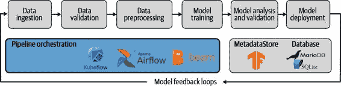
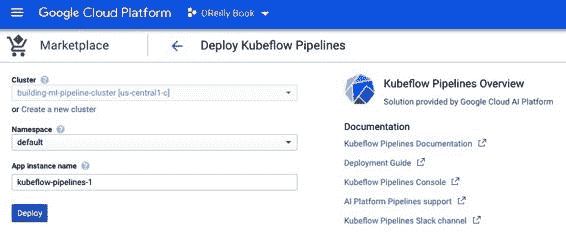

# 第十二章：流水线第二部分：Kubeflow Pipelines

在第十一章中，我们讨论了如何使用 Apache Beam 和 Apache Airflow 编排我们的流水线。这两个编排工具有一些很棒的优点：Apache Beam 设置简单，而 Apache Airflow 在其他 ETL 任务中被广泛采用。

在本章中，我们想讨论如何使用 Kubeflow Pipelines 编排我们的流水线。Kubeflow Pipelines 允许我们在 Kubernetes 集群中运行机器学习任务，从而提供了一个高度可扩展的流水线解决方案。正如我们在第十一章中讨论的并在图 12-1 中展示的那样，我们的编排工具负责协调流水线组件之间的关系。

图 12-1：流水线编排器

Kubeflow Pipelines 的设置比安装 Apache Airflow 或 Apache Beam 更复杂。但是，正如我们将在本章后面讨论的那样，它提供了许多出色的功能，包括 Pipeline Lineage Browser、TensorBoard 集成以及查看 TFDV 和 TFMA 可视化的能力。此外，它充分利用了 Kubernetes 的优势，例如计算 Pod 的自动扩展、持久卷、资源请求和限制等。

本章分为两个部分。在第一部分中，我们将讨论如何使用 Kubeflow Pipelines 设置和执行流水线。所示的设置与执行环境无关。可以是提供托管 Kubernetes 集群的云提供商，也可以是本地的 Kubernetes 安装。

> Kubernetes 简介
> 
> 如果 Kubernetes 的概念和术语对您来说很新，请查看我们的附录。附录 A 提供了 Kubernetes 的简要概述。

本章的第二部分将讨论如何在 Google Cloud AI 平台上运行 Kubeflow Pipelines。这是特定于 Google Cloud 环境的。它负责大部分基础架构，并允许您使用 Dataflow 轻松扩展数据任务（例如数据预处理）。如果您想使用 Kubeflow Pipelines 但不想花时间管理 Kubernetes 基础架构，我们建议选择这条路线。

Kubeflow Pipelines 简介

Kubeflow Pipelines 是一个以机器学习为核心的基于 Kubernetes 的编排工具。而 Apache Airflow 专为 ETL 流程设计，Kubeflow Pipelines 则注重机器学习流水线的端到端执行。

Kubeflow Pipelines 提供了一致的用户界面来追踪机器学习管道运行，作为数据科学家之间协作的中心位置（正如我们将在 “Kubeflow Pipelines 的有用特性” 中讨论的那样），并提供了一种计划连续模型构建运行的方式。此外，Kubeflow Pipelines 提供了其自己的软件开发工具包（SDK），用于构建用于管道运行的 Docker 容器或编排容器。Kubeflow Pipeline 领域特定语言（DSL）允许更灵活地设置管道步骤，但也需要组件之间更多的协调。我们认为 TFX 管道导致更高水平的管道标准化，因此更少出错。如果您对 Kubeflow Pipelines SDK 的更多细节感兴趣，我们可以推荐在 “Kubeflow 对比 Kubeflow Pipelines” 中建议的阅读内容。

当我们设置 Kubeflow Pipelines 时，正如我们在 “安装和初始设置” 中讨论的那样，Kubeflow Pipelines 将安装各种工具，包括 UI、工作流控制器、一个 MySQL 数据库实例，以及我们在 “什么是 ML Metadata？” 中讨论的 ML MetadataStore。

当我们在 Kubeflow Pipelines 中运行我们的 TFX 管道时，您会注意到每个组件都作为其自己的 Kubernetes pod 运行。正如在 图 12-2 中所示，每个组件都与集群中的中央元数据存储连接，并可以从 Kubernetes 集群的持久存储卷或云存储桶加载工件。所有组件的输出（例如 TFDV 执行的数据统计或导出的模型）都将在元数据存储中注册，并作为持久卷或云存储桶上的工件存储。

Figure 12-2\. Kubeflow Pipelines 概览

> KUBEFLOW 对比 KUBEFLOW PIPELINES
> 
> Kubeflow 和 Kubeflow Pipelines 经常被混淆。Kubeflow 是一个开源项目套件，包含多种机器学习工具，包括用于训练机器学习模型的 TFJob，用于优化模型超参数的 Katib，以及用于部署机器学习模型的 KFServing。Kubeflow Pipelines 是 Kubeflow 套件的另一个项目，专注于部署和管理端到端的机器学习工作流。
> 
> 在本章中，我们将专注于 Kubeflow Pipelines 的安装和操作。如果您对 Kubeflow 想要更深入的介绍，我们建议阅读 [项目文档](https://oreil.ly/cxmu7)。
> 
> 此外，我们可以推荐两本 Kubeflow 图书：
> 
+   > > > > Josh Patterson 等著，《Kubeflow 运维指南》（O'Reilly）
+   > > > > 
+   > > > > Holden Karau 等著，《即将推出的 Kubeflow 机器学习》（O'Reilly）

正如我们将在本章演示的那样，Kubeflow Pipelines 提供了一种高度可扩展的运行机器学习流水线的方式。Kubeflow Pipelines 在后台运行 Argo 来编排各个组件的依赖关系。由于这种通过 Argo 进行的编排，我们的流水线编排将具有不同的工作流程，正如我们在第十一章讨论的那样。我们将在“使用 Kubeflow Pipelines 编排 TFX Pipelines”中查看 Kubeflow Pipelines 的编排工作流程。

> 什么是 ARGO？
> 
> Argo 是一组工具，用于管理工作流程、部署和持续交付任务。最初设计用于管理 DevOps 任务，同时也是机器学习工作流的优秀管理工具。在 Kubernetes 环境中，Argo 将所有任务作为容器进行管理。更多信息，请参阅不断增长的[文档](https://oreil.ly/K2R5H)。

安装和初始设置

Kubeflow Pipelines 在 Kubernetes 集群内执行。对于本节，我们假设您已经创建了一个至少拥有 16 GB 内存和 8 个 CPU 的节点池的 Kubernetes 集群，并且已经配置了`kubectl`与您新创建的 Kubernetes 集群连接。

> 创建一个 Kubernetes 集群
> 
> 对于在本地计算机或 Google Cloud 等云提供商上基本设置 Kubernetes 集群，请参阅附录 A 和附录 B。由于 Kubeflow Pipelines 的资源需求，建议使用云提供商的 Kubernetes 设置。云提供商提供的托管 Kubernetes 服务包括：
> 
1.  > > > > 亚马逊弹性 Kubernetes 服务（Amazon EKS）
1.  > > > > 
1.  > > > > Google Kubernetes Engine（GKE）
1.  > > > > 
1.  > > > > 微软 Azure Kubernetes 服务（AKS）
1.  > > > > 
1.  > > > > IBM 的 Kubernetes 服务
1.  > > > > 
> 关于 Kubeflow 底层架构 Kubernetes 的更多细节，我们强烈推荐 Brendan Burns 等人的《Kubernetes: Up and Running》（O’Reilly）。

为了编排我们的流水线，我们正在安装 Kubeflow Pipelines 作为一个独立的应用程序，而不包括 Kubeflow 项目的所有其他工具。通过以下`bash`命令，我们可以设置我们的独立 Kubeflow Pipelines 安装。完整的设置可能需要五分钟才能正确完全启动。

> `$` `export` `PIPELINE_VERSION``=``0.5.0` `$` `kubectl apply -k` `"github.com/kubeflow/pipelines/manifests/"``\``"kustomize/cluster-scoped-resources?ref=``$PIPELINE_VERSION``"` `customresourcedefinition.apiextensions.k8s.io/     applications.app.k8s.io created ... clusterrolebinding.rbac.authorization.k8s.io/     kubeflow-pipelines-cache-deployer-clusterrolebinding created` `$` `kubectl` `wait` `--for` `condition``=``established` `\` `--timeout``=``60s crd/applications.app.k8s.io customresourcedefinition.apiextensions.k8s.io/     applications.app.k8s.io condition met` `$` `kubectl apply -k` `"github.com/kubeflow/pipelines/manifests/"``\``"kustomize/env/dev?ref=``$PIPELINE_VERSION``"`

您可以通过打印有关已创建的 pod 的信息来检查安装的进度：

> `$` `kubectl -n kubeflow get pods NAME                                              READY   STATUS       AGE cache-deployer-deployment-c6896d66b-62gc5         0/1     Pending      90s cache-server-8869f945b-4k7qk                      0/1     Pending      89s controller-manager-5cbdfbc5bd-bnfxx               0/1     Pending      89s ...`

几分钟后，所有 pod 的状态应该变为 Running。如果您的流水线遇到任何问题（例如，计算资源不足），pod 的状态将指示错误：

> `$` `kubectl -n kubeflow get pods NAME                                              READY   STATUS       AGE cache-deployer-deployment-c6896d66b-62gc5         1/1     Running      4m6s cache-server-8869f945b-4k7qk                      1/1     Running      4m6s controller-manager-5cbdfbc5bd-bnfxx               1/1     Running      4m6s ...`

可以使用以下命令单独调查每个 pod：

> `kubectl -n kubeflow describe pod <pod name>`
> 
> 管理的 Kubeflow Pipelines 安装
> 
> 如果您希望尝试 Kubeflow Pipelines，Google Cloud 提供通过 Google Cloud AI 平台进行托管安装。在“基于 Google Cloud AI 平台的 Pipelines”中，我们将深入讨论如何在 Google Cloud AI 平台上运行您的 TFX 管道以及如何从 Google Cloud Marketplace 上创建 Kubeflow Pipelines 的设置。

访问您的 Kubeflow Pipelines 安装

如果安装成功完成，无论您使用的是哪个云服务提供商或 Kubernetes 服务，您都可以通过在 Kubernetes 上创建端口转发来访问已安装的 Kubeflow Pipelines UI：

> `$` `kubectl port-forward -n kubeflow svc/ml-pipeline-ui 8080:80`

当端口转发正在运行时，您可以通过浏览器访问 [`localhost:8080`](http://localhost:8080) 来访问 Kubeflow Pipelines。对于生产用例，应为 Kubernetes 服务创建负载均衡器。

Google Cloud 用户可以通过访问为您的 Kubeflow 安装创建的公共域名来访问 Kubeflow Pipelines。您可以通过执行以下命令获取 URL：

> `$` `kubectl describe configmap inverse-proxy-config -n kubeflow` `\``|` `grep googleusercontent.com <id>-dot-<region>.pipelines.googleusercontent.com`

您可以使用浏览器访问提供的 URL。如果一切顺利，您将看到 Kubeflow Pipelines 仪表板或如 图 12-3 所示的起始页面。

图 12-3\. 使用 Kubeflow Pipelines 入门

一旦 Kubeflow Pipelines 设置完毕并运行，我们可以专注于如何运行流水线。在接下来的部分中，我们将讨论从 TFX 到 Kubeflow Pipelines 的流水线编排和工作流。

用 Kubeflow Pipelines 编排 TFX 流水线

在前面的章节中，我们讨论了如何在 Kubernetes 上设置 Kubeflow Pipelines 应用程序。在本节中，我们将描述如何在 Kubeflow Pipelines 设置上运行您的流水线，并且我们将专注于仅在您的 Kubernetes 集群内执行。这保证了流水线执行可以在与云服务提供商无关的集群上执行。在 “基于 Google Cloud AI 平台的流水线” 中，我们将展示如何利用像 GCP 的 Dataflow 这样的托管云服务来扩展您的流水线，超出您的 Kubernetes 集群的范围。

在深入讨论如何使用 Kubeflow Pipelines 编排机器学习流水线之前，我们想稍作停顿。从 TFX 代码到流水线执行的工作流比我们在 第十一章 中讨论的要复杂一些，因此我们将首先概述整体情况。图 12-4 展示了总体架构。

与 Airflow 和 Beam 一样，我们仍然需要一个定义流水线中 TFX 组件的 Python 脚本。我们将重用 第十一章 中的示例 11-1 脚本。与 Apache Beam 或 Airflow TFX 运行器执行不同，Kubeflow 运行器不会触发流水线运行，而是生成配置文件，以便在 Kubeflow 设置中执行。

如 图 12-4 所示，TFX KubeflowRunner 将把我们的 Python TFX 脚本与所有组件规格转换为 Argo 指令，然后可以在 Kubeflow Pipelines 中执行。Argo 将会为每个 TFX 组件启动一个单独的 Kubernetes Pod，并在容器中运行特定组件的 TFX `Executor`。

图 12-4\. 从 TFX 脚本到 Kubeflow Pipelines 的工作流程

> 自定义 TFX 容器镜像
> 
> 所有组件容器使用的 TFX 镜像需要包含所有所需的 Python 包。默认的 TFX 镜像提供了最新版本的 TensorFlow 和基本的包。如果您的流水线需要额外的包，您需要构建一个自定义的 TFX 容器镜像，并在 `KubeflowDagRunnerConfig` 中指定它。我们在 附录 C 中描述了如何做到这一点。

所有组件都需要读取或写入执行器容器之外的文件系统。例如，数据摄入组件需要从文件系统读取数据，或者最终模型需要被`Pusher`推送到特定位置。仅在组件容器内部读取和写入是不现实的；因此，我们建议将工件存储在可以被所有组件访问的硬盘中（例如，云存储桶或 Kubernetes 集群中的持久卷）。如果你有兴趣设置持久卷，请参阅“通过持久卷交换数据”在附录 C 中的内容。

管道设置

你可以将训练数据、Python 模块和管道工件存储在云存储桶或持久卷中；这取决于你。你的管道只需访问这些文件。如果你选择从云存储桶读取或写入数据，请确保你的 TFX 组件在 Kubernetes 集群中运行时具有必要的云凭据。

现在，所有文件已就绪，并且为我们的管道容器准备了自定义的 TFX 镜像（如果需要），我们现在可以“组装” TFX Runner 脚本，以生成 Argo YAML 指令，用于我们的 Kubeflow Pipelines 执行。1

正如我们在第十一章中讨论的那样，我们可以重用`init_components`函数来生成我们的组件。这使我们能够专注于 Kubeflow 特定的配置。

首先，让我们为运行`Transform`和`Trainer`组件所需的 Python 模块代码配置文件路径。此外，我们将设置原始训练数据、管道工件的文件夹位置，以及我们训练的模型应该存储的位置。在下面的示例中，我们展示了如何挂载一个持久卷与 TFX：

> `import``os``pipeline_name``=``'consumer_complaint_pipeline_kubeflow'``persistent_volume_claim``=``'tfx-pvc'``persistent_volume``=``'tfx-pv'``persistent_volume_mount``=``'/tfx-data'``# 管道输入``data_dir``=``os``.``path``.``join``(``persistent_volume_mount``,``'data'``)``module_file``=``os``.``path``.``join``(``persistent_volume_mount``,``'components'``,``'module.py'``)``# 管道输出``output_base``=``os``.``path``.``join``(``persistent_volume_mount``,``'output'``,``pipeline_name``)``serving_model_dir``=``os``.``path``.``join``(``output_base``,``pipeline_name``)`

如果你决定使用云存储提供商，文件夹结构的根目录可以是一个存储桶，如下例所示：

> `import``os``...``bucket``=``'gs://tfx-demo-pipeline'``# 管道输入``data_dir``=``os``.``path``.``join``(``bucket``,``'data'``)``module_file``=``os``.``path``.``join``(``bucket``,``'components'``,``'module.py'``)``...`

有了文件路径的定义，我们现在可以配置我们的`KubeflowDagRunnerConfig`。在我们的 Kubeflow Pipelines 设置中，配置 TFX 设置的三个重要参数是：

`kubeflow_metadata_config`

> > Kubeflow 在 Kubernetes 集群内运行一个 MySQL 数据库。调用`get_default_kubeflow_metadata_config()`将返回 Kubernetes 集群提供的数据库信息。如果您希望使用托管数据库（例如 AWS RDS 或 Google Cloud 数据库），可以通过参数覆盖连接详细信息。

`tfx_image`

> > 图像 URI 是可选的。如果未定义 URI，则 TFX 将设置与执行 runner 的 TFX 版本对应的映像。在我们的示例演示中，我们将 URI 设置为容器注册表中映像的路径（例如 gcr.io/oreilly-book/ml-pipelines-tfx-custom:0.22.0）。

`pipeline_operator_funcs`

> > 此参数访问一个配置信息列表，用于在 Kubeflow Pipelines 内运行 TFX（例如 gRPC 服务器的服务名称和端口）。由于这些信息可以通过 Kubernetes ConfigMap 提供，`get_default_pipeline_operator_funcs`函数将读取 ConfigMap 并将详细信息提供给`pipeline_operator_funcs`参数。在我们的示例项目中，我们将手动挂载一个持久卷以存储项目数据；因此，我们需要在列表中追加这些信息：
> > 
> `from``kfp``import``onprem``from``tfx.orchestration.kubeflow``import``kubeflow_dag_runner``...``PROJECT_ID``=``'oreilly-book'``IMAGE_NAME``=``'ml-pipelines-tfx-custom'``TFX_VERSION``=``'0.22.0'``metadata_config``=` `\` `kubeflow_dag_runner``.``get_default_kubeflow_metadata_config``()``pipeline_operator_funcs``=` `\` `kubeflow_dag_runner``.``get_default_pipeline_operator_funcs``()``pipeline_operator_funcs``.``append``(``onprem``.``mount_pvc``(``persistent_volume_claim``,``persistent_volume``,``persistent_volume_mount``))``runner_config``=``kubeflow_dag_runner``.``KubeflowDagRunnerConfig``(``kubeflow_metadata_config``=``metadata_config``,``tfx_image``=``"gcr.io/{}/{}:{}"``.``format``(``PROJECT_ID``,``IMAGE_NAME``,``TFX_VERSION``),``pipeline_operator_funcs``=``pipeline_operator_funcs``)`

> > 获得默认的元数据配置。

> > 获得默认的 OpFunc 函数。

> > 通过将它们添加到 OpFunc 函数中来挂载卷。

> > 根据需要添加自定义 TFX 映像。
> > 
> OPFUNC FUNCTIONS
> 
> OpFunc 函数允许我们设置特定于集群的细节，这些细节对于执行我们的流水线非常重要。这些函数允许我们与 Kubeflow Pipelines 中的底层数字订阅线（DSL）对象进行交互。OpFunc 函数以 Kubeflow Pipelines DSL 对象 dsl.ContainerOp 作为输入，应用额外的功能，并返回相同的对象。
> 
> 将 OpFunc 函数添加到`pipeline_operator_funcs`中的两个常见用例是请求最小内存或指定容器执行的 GPU。但是 OpFunc 函数还允许设置特定于云提供商的凭据或请求 TPU（对于 Google Cloud）。
> 
> 让我们看看 OpFunc 函数的两个最常见用法：设置运行 TFX 组件容器所需的最小内存限制和请求执行所有 TFX 组件的 GPU。以下示例设置运行每个组件容器所需的最小内存资源为 4 GB：
> 
> `def``request_min_4G_memory``():``def``_set_memory_spec``(``container_op``):``container_op``.``set_memory_request``(``'4G'``)``return``_set_memory_spec``...``pipeline_operator_funcs``.``append``(``request_min_4G_memory``())`
> 
> 函数接收`container_op`对象，设置限制，并返回函数本身。
> 
> 我们可以以同样的方式为执行 TFX 组件容器请求 GPU，如下例所示。如果您需要 GPU 来执行容器，只有在您的 Kubernetes 集群中完全配置和可用 GPU 时，您的流水线才会运行：3。
> 
> `def``request_gpu``():``def``_set_gpu_limit``(``container_op``):``container_op``.``set_gpu_limit``(``'1'``)``return``_set_gpu_limit``...``pipeline_op_funcs``.``append``(``request_gpu``())`
> 
> Kubeflow Pipelines SDK 为每个主要云提供商提供了常见的 OpFunc 函数。以下示例显示如何向 TFX 组件容器添加 AWS 凭据：
> 
> `from``kfp``import``aws``...``pipeline_op_funcs``.``append``(``aws``.``use_aws_secret``()``)`
> 
> 函数`use_aws_secret()`假设 AWS_ACCESS_KEY_ID 和 AWS_SECRET_ACCESS_KEY 已注册为 base64 编码的 Kubernetes 密钥。4 Google Cloud 凭据的等效函数称为`use_gcp_secrets()`。

有了`runner_config`的设置，我们现在可以初始化组件并执行`KubeflowDagRunner`。但是，与其开始管道运行不同，该运行程序将输出 Argo 配置，我们将在 Kubeflow Pipelines 的下一部分中上传它：

> `from``tfx.orchestration.kubeflow``import``kubeflow_dag_runner``from``pipelines.base_pipeline``import``init_components``,``init_pipeline``components``=``init_components``(``data_dir``,``module_file``,``serving_model_dir``,``training_steps``=``50000``,``eval_steps``=``15000``)``p``=``init_pipeline``(``components``,``output_base``,``direct_num_workers``=``0``)``output_filename``=``"{}.yaml"``.``format``(``pipeline_name``)``kubeflow_dag_runner``.``KubeflowDagRunner``(``config``=``runner_config``,``output_dir``=``output_dir``,``output_filename``=``output_filename``)``.``run``(``p``)`

> > 重复使用组件的基础模块。

> > 可选参数。

参数 `output_dir` 和 `output_filename` 是可选的。如果未提供，将提供 Argo 配置作为压缩的 tar.gz 文件，位置与执行以下 python 脚本的同一目录相同。为了更好地可见性，我们配置了输出格式为 YAML，并设置了特定的输出路径。

运行以下命令后，您将在目录 pipelines/kubeflow_pipelines/argo_pipeline_files/ 中找到 Argo 配置 consumer_complaint_pipeline_kubeflow.yaml：

> `$` `python pipelines/kubeflow_pipelines/pipeline_kubeflow.py`

执行流水线

现在是访问您的 Kubeflow Pipelines 仪表板的时候了。如果您想创建新的流水线，请点击“上传流水线”进行上传，如 图 12-5 所示。或者，您可以选择现有的流水线并上传新版本。

图 12-5\. 加载流水线的概述

选择 Argo 配置，如 图 12-6 所示。

图 12-6\. 选择生成的 Argo 配置文件

Kubeflow Pipelines 现在将可视化您的组件依赖关系。如果您想启动新的流水线运行，请选择“创建运行”，如 图 12-7 所示。

您现在可以配置流水线运行。流水线可以一次运行或定期运行（例如使用 cron 作业）。Kubeflow Pipelines 还允许您将流水线运行分组为实验。

图 12-7\. 创建流水线运行

一旦您点击开始，如 图 12-8 所示，Kubeflow Pipelines 在 Argo 的帮助下将启动并为每个容器创建一个 pod，具体取决于您的直接组件图。当组件的所有条件都满足时，将会为该组件创建一个 pod 并运行组件的执行器。

如果您想查看正在进行的运行的执行细节，可以点击“运行名称”，如 图 12-9 所示。

图 12-8\. 定义的流水线运行详细信息

图 12-9\. 运行中的流水线运行

您现在可以在组件执行期间或之后检查组件。例如，如果组件失败，您可以检查特定组件的日志文件。 图 12-10 显示一个示例，其中 `Transform` 组件缺少一个 Python 库。缺少的库可以通过将它们添加到自定义 TFX 容器映像中来提供，如 附录 C 中所述。

图 12-10\. 检查组件失败

成功的流水线运行显示在 图 12-11 中。运行完成后，您可以在设置为 `Pusher` 组件的文件系统位置找到经过验证和导出的机器学习模型。在我们的示例中，我们将模型推送到持久卷上的路径 /tfx-data/output/consumer_complaint_pipeline_kubeflow/。

图 12-11\. 成功的流水线运行

您还可以使用 `kubectl` 检查流水线的状态。由于每个组件都作为自己的 Pod 运行，所有带有流水线名称前缀的 Pod 应该处于完成状态：

> `$` `kubectl -n kubeflow get pods NAME                                                   READY  STATUS      AGE cache-deployer-deployment-c6896d66b-gmkqf              1/1    Running     28m cache-server-8869f945b-lb8tb                           1/1    Running     28m consumer-complaint-pipeline-kubeflow-nmvzb-1111865054  0/2    Completed   10m consumer-complaint-pipeline-kubeflow-nmvzb-1148904497  0/2    Completed   3m38s consumer-complaint-pipeline-kubeflow-nmvzb-1170114787  0/2    Completed   9m consumer-complaint-pipeline-kubeflow-nmvzb-1528408999  0/2    Completed   5m43s consumer-complaint-pipeline-kubeflow-nmvzb-2236032954  0/2    Completed   13m consumer-complaint-pipeline-kubeflow-nmvzb-2253512504  0/2    Completed   13m consumer-complaint-pipeline-kubeflow-nmvzb-2453066854  0/2    Completed   10m consumer-complaint-pipeline-kubeflow-nmvzb-2732473209  0/2    Completed   11m consumer-complaint-pipeline-kubeflow-nmvzb-997527881   0/2    Completed   10m ...

您还可以通过执行以下命令使用 `kubectl` 检查特定组件的日志。可以通过相应的 Pod 检索特定组件的日志：

> `$` `kubectl logs -n kubeflow` `podname`
> 
> TFX CLI
> 
> 与基于 UI 的流水线创建过程的替代方法是，您还可以通过 TFX CLI 编程方式创建流水线并启动流水线运行。您可以在 “TFX Command-Line Interface” 的 附录 C 中找到有关如何设置 TFX CLI 和如何在没有 UI 的情况下部署机器学习流水线的详细信息。

Kubeflow Pipelines 的有用功能

在接下来的部分中，我们想要强调 Kubeflow Pipelines 的有用功能。

重新启动失败的流水线

流水线运行的执行可能需要一段时间，有时甚至几个小时。TFX 将每个组件的状态存储在 ML MetadataStore 中，Kubeflow Pipelines 可以跟踪流水线运行的成功完成组件任务。因此，它提供重新启动失败流水线运行的功能，从上次失败的组件开始。这将避免重新运行已成功完成的组件，从而节省流水线重新运行的时间。

重复运行

除了启动单个流水线运行外，Kubeflow Pipelines 还允许我们根据时间表运行流水线。如 图 12-12 所示，我们可以类似于 Apache Airflow 中的调度运行。

图 12-12\. 使用 Kubeflow Pipelines 调度重复运行

协作和审核流水线运行

Kubeflow Pipelines 为数据科学家提供了界面，以便团队协作并审查管道运行。在第四章和第七章中，我们讨论了用于显示数据或模型验证结果的可视化工具。在完成这些管道组件之后，我们可以审查组件的结果。

图 12-13 显示了数据验证步骤的结果作为示例。由于组件输出保存到磁盘或云存储桶中，我们也可以回顾管道运行的结果。

Figure 12-13\. Kubeflow Pipelines 中提供的 TFDV 统计数据

由于每个管道运行和这些运行的组件的结果都保存在 ML MetadataStore 中，我们也可以比较这些运行。如图 12-14 所示，Kubeflow Pipelines 提供了一个 UI 来比较管道运行。

Figure 12-14\. 使用 Kubeflow Pipelines 比较流水线运行

Kubeflow Pipelines 还很好地集成了 TensorFlow 的 TensorBoard。正如您在图 12-15 中所看到的，我们可以使用 TensorBoard 查看模型训练运行的统计信息。在创建基础 Kubernetes pod 之后，我们可以使用 TensorBoard 查看模型训练运行的统计信息。

Figure 12-15\. 使用 TensorFlow 的 TensorBoard 审查训练运行

审计流水线血统

对于机器学习的广泛采用，审查模型的创建是至关重要的。例如，如果数据科学家观察到训练后的模型不公平（正如我们在第 7 章中讨论的），重溯和再现我们使用的数据或超参数是很重要的。我们基本上需要为每个机器学习模型建立审计追踪。

Kubeflow Pipelines 通过 Kubeflow Lineage Explorer 为这样的审计追踪提供了解决方案。它创建了一个可以轻松查询 ML MetadataStore 数据的用户界面。

如图 12-16 右下角所示，一个机器学习模型被推送到某个位置。血统探索器允许我们追溯到导出模型的所有组件和工件，一直回溯到最初的原始数据集。如果使用了人在回路组件（参见“人在回路”），我们可以追溯到谁签署了模型，或者我们可以检查数据验证结果并调查初始训练数据是否开始漂移。

如您所见，Kubeflow Pipelines 是一个非常强大的工具，用于编排我们的机器学习流水线。如果您的基础架构基于 AWS 或 Azure，或者如果您希望完全控制您的设置，我们建议使用这种方法。然而，如果您已经在使用 GCP，或者如果您希望使用 Kubeflow Pipelines 的简化方式，请继续阅读。

Figure 12-16\. 使用 Kubeflow Pipelines 检查流水线血统

基于 Google Cloud AI Platform 的 Pipelines

如果你不想花费时间管理自己的 Kubeflow Pipelines 设置，或者希望与 GCP 的 AI Platform 或其他 GCP 服务（如 Dataflow、AI Platform 训练与服务等）集成，那么这一节适合你。接下来，我们将讨论如何通过 Google Cloud 的 AI Platform 设置 Kubeflow Pipelines。此外，我们还将介绍如何使用 Google Cloud 的 AI 作业训练你的机器学习模型，并使用 Google Cloud 的 Dataflow 扩展你的预处理，后者可以用作 Apache Beam 运行器。

Pipeline 设置

Google 的 [AI Platform Pipelines](https://oreil.ly/WAft5) 允许你通过 UI 创建 Kubeflow Pipelines 设置。图 12-17 展示了 AI Platform Pipelines 的首页，你可以在这里开始创建你的设置。

> BETA 产品
> 
> 如你在图 12-17 中所见，截至撰写本文时，这款 Google Cloud 产品仍处于 beta 阶段。所展示的工作流程可能会有所更改。

图 12-17\. Google Cloud AI Platform Pipelines

当你点击页面右上角的 New Instance，它会将你导向 Google Marketplace，如图 12-18 所示。

图 12-18\. 用于 Kubeflow Pipelines 的 Google Cloud Marketplace 页面

在选择配置后，你将被要求在菜单顶部选择要么选择现有的 Kubernetes 集群，要么创建一个集群，如图 12-19 所示。

> 节点大小
> 
> 在创建新的 Kubernetes 集群或选择现有集群时，请考虑节点的可用内存。每个节点实例需要提供足够的内存以容纳整个模型。对于我们的演示项目，我们选择了 `n1-standard-4` 作为实例类型。在撰写本文时，我们无法在从 Marketplace 启动 Kubeflow Pipelines 时创建自定义集群。如果你的管道设置需要更大的实例，请首先创建集群及其节点，然后在从 GCP Marketplace 创建 Kubeflow Pipelines 设置时从现有集群列表中选择该集群。

图 12-19\. 配置你的集群以用于 Kubeflow Pipelines

> 访问范围
> 
> 在创建 Kubeflow Pipelines 或自定义集群时，请选择“允许对所有 Cloud APIs 的完全访问权限”，这是对集群节点访问范围的要求。Kubeflow Pipelines 需要访问多种 Cloud APIs。授予对所有 Cloud APIs 的访问权限可以简化设置过程。

在配置你的 Kubernetes 集群后，Google Cloud 将实例化你的 Kubeflow Pipelines 设置，如图 12-20 所示。

图 12-20\. 创建你的 Kubeflow Pipelines 设置

几分钟后，您的设置将准备就绪，您可以在 AI Platform Pipelines 部署的 Kubeflow 设置列表中找到作为实例列出的 Kubeflow Pipelines 设置。如果您单击“打开 Pipelines 仪表板”，如图 12-21 所示，您将被重定向到您新部署的 Kubeflow Pipelines 设置。从这里开始，Kubeflow Pipelines 将按照我们在前一节讨论的方式运行，并且 UI 看起来非常相似。

图 12-21. Kubeflow 部署列表

> 在 AI Platform Pipelines 仪表板中提供的逐步安装说明
> 
> 如果您按照逐步手动安装 Kubeflow Pipelines 的步骤，正如在“访问您的 Kubeflow Pipelines 安装”和附录 B 中讨论的那样，您的 Kubeflow Pipelines 设置也将在 AI Platform Pipelines 实例下列出。

TFX 管道设置

我们的 TFX 管道配置与我们之前讨论的`KubeflowDagRunner`的配置非常相似。事实上，如果您像在“管道设置”中讨论的那样挂载了一个带有所需 Python 模块和训练数据的持久卷，您可以在 AI Platform Pipelines 上运行您的 TFX 管道。

在接下来的章节中，我们将展示一些对早期 Kubeflow Pipelines 设置的更改，这些更改可以简化您的工作流程（例如，从 Google Storage 存储桶加载数据），或者帮助您扩展超出 Kubernetes 集群的管道（例如，通过 AI Platform Jobs 训练机器学习模型）。

使用 Cloud Storage 存储桶进行数据交换

在“管道设置”中，我们讨论了可以从挂载在 Kubernetes 集群中的持久卷加载管道执行所需的数据和 Python 模块。如果您在 Google Cloud 生态系统内运行管道，还可以从 Google Cloud Storage 存储桶加载数据。这将简化工作流程，使您能够通过 GCP Web 界面或`gcloud` SDK 上传和审查文件。

存储桶路径可以像磁盘上的文件路径一样提供，如下面的代码片段所示：

> `input_bucket``=``'gs://``YOUR_INPUT_BUCKET``'``output_bucket``=``'gs://``YOUR_OUTPUT_BUCKET``'``data_dir``=``os``.``path``.``join``(``input_bucket``,``'data'``)``tfx_root``=``os``.``path``.``join``(``output_bucket``,``'tfx_pipeline'``)``pipeline_root``=``os``.``path``.``join``(``tfx_root``,``pipeline_name``)``serving_model_dir``=``os``.``path``.``join``(``output_bucket``,``'serving_model_dir'``)``module_file``=``os``.``path``.``join``(``input_bucket``,``'components'``,``'module.py'``)`

将存储桶分割为输入（例如 Python 模块和训练数据）和输出数据（例如训练好的模型）通常是有益的，但您也可以使用相同的存储桶。

使用 AI Platform 作业训练模型

如果您想通过 GPU 或 TPU 扩展模型训练，可以配置流水线以在这些硬件上运行机器学习模型的训练步骤：

> `project_id``=``'``YOUR_PROJECT_ID``'``gcp_region``=``'``GCP_REGION>``'``ai_platform_training_args``=``{``'project'``:``project_id``,``'region'``:``gcp_region``,``'masterConfig'``:``{``'imageUri'``:``'gcr.io/oreilly-book/ml-pipelines-tfx-custom:0.22.0'``}``'scaleTier'``:``'BASIC_GPU'``,``}`

> > 例如，`us-central1`。

> > 提供自定义镜像（如果需要）。

> > 其他选项包括 `BASIC_TPU`、`STANDARD_1` 和 `PREMIUM_1`。

为了让 `Trainer` 组件能够观察 AI 平台的配置，您需要配置组件执行器，并将我们迄今为止使用的 `GenericExecutor` 替换为 `Trainer` 组件。以下代码片段显示了所需的附加参数：

> `from``tfx.extensions.google_cloud_ai_platform.trainer``import``executor` `\` `as``ai_platform_trainer_executor``trainer``=``Trainer``(``...``custom_executor_spec``=``executor_spec``.``ExecutorClassSpec``(``ai_platform_trainer_executor``.``GenericExecutor``),``custom_config``=``{``ai_platform_trainer_executor``.``TRAINING_ARGS_KEY``:``ai_platform_training_args``}``)`

与在 Kubernetes 集群内训练机器学习模型不同，您可以使用 AI 平台分发模型训练。除了分布式训练功能外，AI 平台还提供了像 TPU 这样的加速训练硬件的访问。

当流水线中触发 `Trainer` 组件时，它将在 AI 平台作业中启动训练作业，如 Figure 12-22 所示。在那里，您可以检查训练任务的日志文件或完成状态。

图 12-22\. AI 平台训练作业

通过 AI 平台端点提供模型服务

如果您在 Google Cloud 生态系统内运行流水线，还可以将机器学习模型部署到 AI 平台的端点。这些端点具有根据推断峰值来扩展模型的选项。

与我们在 “TFX Pusher Component” 中讨论过的设置 `push_destination` 不同，我们可以覆盖执行器并为 AI 平台部署提供 Google Cloud 详细信息。以下代码片段显示了所需的配置细节：

> `ai_platform_serving_args``=``{``'model_name'``:``'consumer_complaint'``,``'project_id'``:``project_id``,``'regions'``:``[``gcp_region``],``}`

与 `Trainer` 组件的设置类似，我们需要交换组件的执行器，并提供包含部署详细信息的 `custom_config`：

> `from``tfx.extensions.google_cloud_ai_platform.pusher``import``executor` `\` `as``ai_platform_pusher_executor``pusher``=``Pusher``(``...``custom_executor_spec``=``executor_spec``.``ExecutorClassSpec``(``ai_platform_pusher_executor``.``Executor``),``custom_config``=``{``ai_platform_pusher_executor``.``SERVING_ARGS_KEY``:``ai_platform_serving_args``}``)

如果您提供了`Pusher`组件的配置，则可以通过使用 AI 平台避免设置和维护 TensorFlow Serving 的实例。

> 部署限制
> 
> 此刻，模型通过 AI 平台进行部署的最大限制是 512 MB。我们的演示项目超出了此限制，因此目前无法通过 AI 平台端点进行部署。

与 Google 的 Dataflow 一起扩展

到目前为止，依赖于 Apache Beam 的所有组件都使用默认的`DirectRunner`执行数据处理任务，这意味着处理任务将在启动 Apache Beam 任务的同一实例上执行。在这种情况下，Apache Beam 会尽可能消耗多个 CPU 核心，但不会扩展到单个实例之外。

一个替代方案是使用 Google Cloud 的 Dataflow 执行 Apache Beam。在这种情况下，TFX 将使用 Apache Beam 处理作业，并且后者将向 Dataflow 提交任务。根据每个作业的要求，Dataflow 将启动计算实例并在实例之间分发作业任务。这是扩展数据预处理作业（如统计生成或数据预处理）的一种非常好的方式。

为了利用 Google Cloud Dataflow 的扩展能力，我们需要提供一些额外的 Beam 配置，这些配置将传递给我们的流水线实例化：

> `tmp_file_location``=``os``.``path``.``join``(``output_bucket``,``"tmp"``)``beam_pipeline_args``=``[``"--runner=DataflowRunner"``,``"--experiments=shuffle_mode=auto"``,``"--project={}"``.``format``(``project_id``),``"--temp_location={}"``.``format``(``tmp_file_location``),``"--region={}"``.``format``(``gcp_region``),``"--disk_size_gb=50"``,``]`

除了将`runner`类型配置为`DataflowRunner`之外，我们还将`shuffle_mode`设置为`auto`。这是 Dataflow 的一个有趣特性。不像在 Google Compute Engine 的 VM 中运行`GroupByKey`等转换操作，而是在 Dataflow 的服务后端处理该操作。这样可以减少计算实例的执行时间以及 CPU/内存成本。

流水线执行

在 Google Cloud AI 平台上执行流水线与我们在“使用 Kubeflow Pipelines 编排 TFX 流水线”中讨论的情况并无不同。TFX 脚本将生成 Argo 配置。然后可以将该配置上传到设在 AI 平台上的 Kubeflow Pipelines 设置中。

在管道执行期间，您可以检查训练作业，如在“Training models with an AI Platform job”中所讨论的，还可以详细观察 Dataflow 作业，如在 Figure 12-23 中所示。

图 12-23 详细介绍了 Google Cloud Dataflow 作业的详情。

Dataflow 仪表板提供有关作业进度和扩展需求的宝贵洞察。

总结

使用 Kubeflow 管道运行管道提供了很大的好处，我们认为这些好处超过了额外的设置要求。我们看到管道谱系浏览、与 TensorBoard 的无缝集成以及重复运行的选项是选择 Kubeflow 管道作为管道编排器的充分理由。

正如我们之前讨论的，与在第十一章中讨论的 Apache Beam 或 Apache Airflow 上运行的管道不同，使用 Kubeflow 管道运行 TFX 管道的当前工作流程是不同的。然而，TFX 组件的配置与我们在前一章中讨论的是相同的。

在本章中，我们介绍了两种 Kubeflow 管道设置：第一种设置几乎适用于任何托管的 Kubernetes 服务，如 AWS Elastic Kubernetes Service 或 Microsoft Azure Kubernetes Service。第二种设置适用于 Google Cloud 的 AI 平台。

在接下来的章节中，我们将讨论如何通过反馈循环将您的管道转变为循环。

> 1   您可以在[本书的 GitHub 存储库](https://oreil.ly/bmlp-gitkubeflowpy)中跟随生成 Argo YAML 指令的脚本。
> 
> 2   想了解更多关于 Kubernetes ConfigMaps 的信息，请查看“Some Kubernetes Definitions”。
> 
> 3   访问[Nvidia](https://oreil.ly/HGj50)获取有关为 Kubernetes 集群安装最新驱动程序的更多信息。
> 
> 4   参阅[文档](https://oreil.ly/AxcHf)获取有关 Kubernetes secrets 及其设置方法的信息。
> 
> 5   数据流仅透过 Google Cloud 提供。替代的分布式运行程序有 Apache Flink 和 Apache Spark。
