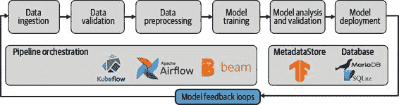
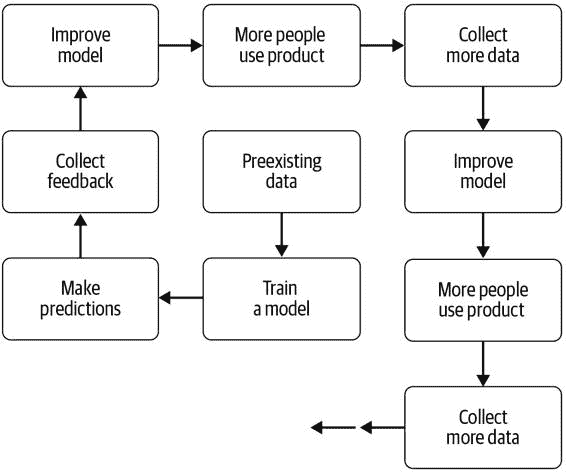
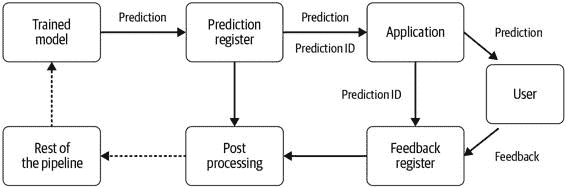

# 第十三章：反馈循环

现在，我们已经建立了一个顺畅的流水线，将机器学习模型投入生产中，我们不希望只运行一次。一旦部署了模型，模型就不应该是静态的。随着收集新数据、数据分布的变化（详见第四章）、模型漂移（讨论见第七章），我们希望我们的流水线能够不断改进。

将某种形式的反馈引入到机器流水线中将其转变为一个生命周期，如图 13-1 所示。模型的预测结果导致新数据的收集，从而持续改进模型。

图 13-1\. 作为 ML 流水线一部分的模型反馈

如果没有新鲜数据，模型的预测能力可能会随着时间的推移而下降。事实上，ML 模型的部署可能会改变输入的训练数据，因为用户体验发生变化；例如，在视频推荐系统中，模型提供更好的推荐会导致用户做出不同的观看选择。反馈循环可以帮助我们收集新数据来更新我们的模型。对于个性化模型特别有用，例如推荐系统或预测文本。

此时，确保流水线的其余部分设置稳健非常重要。引入新数据应仅在新数据导致数据验证中设置的限制超出范围，或者导致模型分析中设置的边界外移时才导致流水线失败。这时可以触发事件，例如模型重新训练、新的特征工程等。如果其中一个触发器发生，新模型应该获得一个新版本号。

除了收集新的训练数据外，反馈循环还可以提供有关模型实际使用情况的信息。这可以包括活跃用户的数量、他们与模型互动的时间以及许多其他数据。这类数据对向业务利益相关者展示模型价值非常有用。

> 反馈循环可能会带来危险
> 
> 反馈循环也可能带来负面影响，因此应谨慎处理。如果将模型的预测结果反馈到新的训练数据中而没有人为输入，模型将从其错误和正确预测中学习。反馈循环还可能放大原始数据中存在的任何偏见或不平等。仔细的模型分析可以帮助您发现其中的一些情况。

显性和隐性反馈

我们可以将反馈分为两种主要类型：隐式和显式。1 隐式反馈是指人们在正常使用产品时通过行动给模型提供反馈，例如通过购买推荐系统建议的东西或观看建议的电影。隐式反馈需要在用户隐私方面进行仔细考虑，因为很容易跟踪用户的每一个动作。显式反馈是指用户直接对预测提供一些直接的输入，例如对推荐的点赞或点踩，或者更正一个预测。

数据飞轮

在某些情况下，你可能已经拥有足够的数据来创建一个由机器学习驱动的新产品。但在其他情况下，你可能需要收集更多数据。这在处理监督学习问题时特别频繁。监督学习比无监督学习更成熟，通常提供更可靠的结果，因此在生产系统中部署的大多数模型都是监督模型。经常出现这样的情况：你拥有大量未标记数据但标记数据不足。然而，随着我们在示例项目中使用的迁移学习的发展，某些机器学习问题不再需要大量标记数据。

当你有大量未标记的数据并需要收集更多标签时，数据飞轮的概念尤为有用。这种数据飞轮允许你通过使用产品的现有数据、手动标记的数据或公共数据设置初始模型来扩展训练数据集。通过从用户那里收集对初始模型的反馈，你可以标记数据，从而改进模型预测，吸引更多用户使用产品，进而标记更多数据，如图 13-2 所示。

图 13-2. 数据飞轮

现实世界中的反馈循环

机器学习系统中最熟悉的反馈循环例子之一是当模型的预测暴露给客户时。这在推荐系统中尤为常见，其中模型预测特定用户的前 k 个最相关选择。通常在推出产品前很难为推荐系统收集训练数据，因此这些系统通常严重依赖于用户的反馈。

[Netflix 的电影推荐系统](https://oreil.ly/uX9Oo) 是反馈循环的经典案例。用户得到电影推荐后，通过评分提供反馈。随着用户评分的增加，他们会收到更符合个人口味的推荐。

最初，当 Netflix 的主要业务是邮寄 DVD 时，它使用了一个一到五星的评级系统来收集 DVD 的评级，这表明客户实际观看了 DVD。在这种情况下，Netflix 只能收集到显式反馈。但当其业务转向在线流媒体电影时，公司也能够收集到用户是否观看了推荐给他们的电影，以及用户是否观看了整部电影的隐式反馈。因此，Netflix 改用了一个简单的大拇指向上或向下的系统，而不再使用一到五星的评级系统，这使得它能够收集更多的反馈，因为这个系统需要用户投入的时间更少。此外，更精细的评级可能不太具有操作性：如果一部电影评为三星，模型应该如何响应？三星评价并不表明预测是正确还是错误，而大拇指向上或向下则对模型提供了明确的信号。

另一个反馈循环的例子——在这种情况下是负面反馈——是微软臭名昭著的 Twitter 机器人[TAY](https://oreil.ly/YM21r)。2016 年，它在推出后仅 16 小时内因其具有攻击性和有时带有种族主义色彩的推文而被下线。在被下线之前，它已经发布了超过 96,000 条推文。它是基于其推文的回复自动重新训练的，这些推文是有意挑衅的。这种情况下的反馈循环是，系统将其初始推文的回复并入其训练数据中。这可能本意是使机器人听起来更像人类，但结果是它吸引了最糟糕的回复，并变得极具攻击性。

> 什么可能会出错？
> 
> 重要的是考虑反馈循环可能出现的问题，以及最理想的情况。你的用户可能会做什么最糟糕的事情？如何保护系统免受可能以有组织或自动化方式破坏系统的恶意行为者的影响？

第三个现实世界的反馈循环例子来自在线支付公司 Stripe。Stripe 建立了一个二分类器来预测信用卡交易中的欺诈行为，如果模型预测交易可能涉及欺诈，其系统将阻止这些交易。公司从过去的交易数据中获得了一个训练集，并在其上训练了一个模型，在训练集上表现良好。然而，由于如果模型预测交易是欺诈的，那么这些交易就会被阻止，因此我们无法确定生产系统的精确度和召回率。我们无法确定这些交易是否真的是欺诈行为，因为它们从未发生过。

当模型基于新数据重新训练时，出现了一个更大的问题：其准确率下降。在这种情况下，反馈循环导致所有原始类型的欺诈交易被阻止，因此它们无法成为新的训练数据。新模型正在训练未被捕获的剩余欺诈交易。Stripe 的解决方案是放宽规则，允许少量的收费通过，即使模型预测它们可能是欺诈的。这使得它可以评估模型并提供新的相关训练数据。

> 反馈循环的后果
> 
> 反馈循环通常会产生一些在设计过程中并不明显的后果。在部署后继续监控系统是至关重要的，以确保反馈循环带来的是积极变化而不是负面循环。我们建议使用第七章中的技术密切关注系统。

在 Stripe 的前述示例中，反馈循环导致模型的准确率下降。然而，准确率的提高也可能是一个不希望的效果。[YouTube 的推荐系统](https://oreil.ly/QDCC2)旨在增加人们观看视频的时间。用户的反馈意味着模型准确预测他们将会观看的内容。这一策略非常成功：人们每天在 YouTube 上观看[超过十亿小时](https://oreil.ly/KVF4M)的视频。然而，有人担心这一系统会导致用户观看[越来越极端的内容视频](https://oreil.ly/_Iubw)。当系统变得非常庞大时，极其难以预见反馈循环的所有后果。因此，请谨慎行事，并确保为用户设置保护措施。

正如这些例子所示，反馈循环可以是积极的，并帮助我们获取更多的训练数据，以改善模型甚至构建业务。然而，它们也可能导致严重问题。如果你已经仔细选择了确保反馈循环是积极的模型指标，下一步就是学习如何收集反馈，我们将在下一节中讨论。

收集反馈的设计模式

在这一节中，我们将讨论一些常见的收集反馈的方法。你选择的方法将取决于几个因素：

+   > > > > 你试图解决的业务问题
+   > > > > 
+   > > > > 应用程序或产品的类型和设计
+   > > > > 
+   > > > > 机器学习模型的类型：分类、推荐系统等。

如果你计划从产品用户那里收集反馈，告知用户发生的情况非常重要，这样他们可以同意提供反馈。这也可以帮助你收集更多的反馈：如果用户投入到改进系统中，他们更有可能提供反馈。

我们将在接下来的部分详细解析收集反馈的不同选择：

+   “用户根据预测采取某些行动”

+   “用户评价预测的质量”

+   “用户纠正预测”

+   “众包标注”

+   “专家标注”

+   “自动产生反馈”

尽管您的机器学习流水线所要解决的问题在很大程度上会驱动您选择的设计模式，但您的选择将影响您如何跟踪反馈以及如何将其重新整合到您的机器学习流水线中。

用户根据预测采取某些行动

在这种方法中，我们将模型的预测直接展示给用户，用户因此采取一些在线行动。我们记录这个行动，并且这条记录为模型提供了一些新的训练数据。

一个例子是任何类型的产品推荐系统，比如亚马逊用来向用户推荐下一个购买的系统。系统向用户展示了一组模型预测将感兴趣的产品。如果用户点击了其中一个产品或者继续购买该产品，那么推荐是成功的。然而，关于用户没有点击的其他产品是否是好的推荐则没有信息。这是隐式反馈：它并没有提供我们训练模型所需的精确数据（即对每个预测进行排名）。相反，反馈需要在许多不同的用户上进行聚合，以提供新的训练数据。

用户评价预测的质量

使用这种技术，模型的预测显示给用户，用户通过某种信号来表明他们喜欢或不喜欢预测。这是显式反馈的一个例子，用户必须采取额外的行动来提供新的数据。反馈可以是星级评分或简单的二进制赞成或反对。这非常适合推荐系统，尤其对个性化很有用。必须注意反馈是可操作的：例如，在前面提到的 Netflix 示例中，五颗星中的三颗星并不提供有关模型预测是否有用或准确的太多信息。

这种方法的一个局限性是反馈是间接的——在推荐系统的情况下，用户表明哪些是不好的预测，但并没有告诉你正确的预测应该是什么。这个系统的另一个限制是反馈可以被解释的方式有很多。用户“喜欢”的东西未必是他们想要看到更多的东西。例如，在电影推荐系统中，用户可能点赞表示他们想看更多同一类型、同一导演或同一演员的电影。当只能提供二进制反馈时，所有这些细微差别都会丢失。

用户纠正预测

这种方法是显式反馈的一个例子，其工作方式如下：

+   > > > > 从低精度模型得出的预测结果被展示给用户。
+   > > > > 
+   > > > > 如果预测结果正确，用户接受该预测；如果不正确，则更新。
+   > > > > 
+   > > > > 预测结果（现在已由用户验证）可以用作新的训练数据。

在用户高度关注结果的情况下效果最佳。一个很好的例子是银行应用，用户可以通过该应用存款支票。图像识别模型会自动填写支票金额。如果金额正确，用户确认；如果不正确，则用户输入正确的金额。在这种情况下，用户有兴趣输入正确的金额，以便将钱存入他们的账户。随着用户创建更多的训练数据，该应用随时间变得更加准确。如果您的反馈循环可以使用这种方法，这将是快速收集大量高质量新数据的绝佳方式。

当使用这种方法时，务必确保机器学习系统的目标与用户的目标高度一致。如果用户接受不正确的响应，因为他们没有理由去努力更改它，那么训练数据将充满错误，模型也不会随时间变得更加准确。如果用户提供不正确的结果能够给用户带来一些好处，这将使新的训练数据存在偏差。

众包标注

如果您有大量未标记的数据并且无法通过产品的正常使用从用户那里收集标签，则此方法特别有用。许多自然语言处理和计算机视觉领域的问题属于此类：很容易收集大量图像语料库，但数据未针对您机器学习模型的特定用例进行标记。例如，如果您想训练一个图像分类模型，将手机图像分类为文档或非文档，您可能会让用户拍摄许多照片但不提供标签。

在这种情况下，通常会收集大量未标记的数据，然后将其传递给众包平台，如 AWS Mechanical Turk 或 Figure Eight。然后会付给人工标注者一定的费用（通常很少）来标记数据。这最适合不需要特别培训的任务。

使用此方法时，有必要控制标注质量的差异，并且通常设置注释工具，使多个人标记同一数据示例。[Google PAIR guide](https://oreil.ly/6FMFD) 提供了一些出色且详细的设计注释工具的建议，但需要考虑的关键因素是标注者的激励需要与模型的结果保持一致。此方法的主要优势在于可以对创建的新数据非常具体，以便完全符合复杂模型的需求。

然而，这种方法存在一些缺点，例如，可能不适用于私有或敏感数据。此外，务必确保有一个反映产品用户和整个社会的多样化评分池。此方法的成本也可能很高，不一定适合大量用户。

专家注释

专家注释设置类似于众包，但选择的注释者经过精心挑选。这可能是你（构建流水线的人），使用诸如[Prodigy](https://prodi.gy)这样的文本数据注释工具。或者可能是领域专家，例如，如果你正在对医学图像进行图像分类器的训练。这种方法特别适用于以下情况：

+   > > > > 数据需要一些专业知识来进行注释。
+   > > > > 
+   > > > > 数据在某种方式上是私有或敏感的。
+   > > > > 
+   > > > > 只需要少量标签（例如，迁移学习或半监督学习）。
+   > > > > 
+   > > > > 注释中的错误对人们有着高度真实世界的影响。

此方法允许收集高质量的反馈，但成本高昂，需要手动操作，并且不易扩展。

自动产生反馈

在某些机器学习流水线中，无需人类收集反馈。模型进行预测，然后发生某些未来事件，告诉我们模型是否正确。在这种情况下，系统会自动收集新的训练数据。虽然这不涉及任何单独的基础设施来收集反馈，但仍需小心：由于预测的存在可能会扰乱系统。来自 Stripe 的上述例子很好地说明了这一点：模型会影响其自身的未来训练数据。4

如何跟踪反馈回路

一旦确定了哪种类型的反馈回路最适合您的业务和您的模型类型，就该将其纳入您的机器学习流水线中了。这就是我们在第七章讨论的模型验证的重要性所在：新数据将通过系统传播，而且在这个过程中，不能使系统的性能下降违背您正在追踪的指标。

关键概念在于每个预测都应该有一个跟踪 ID，如图 13-3 所示。可以通过某种预测注册表来实现这一点，其中每个预测都与跟踪 ID 一起存储。预测和 ID 传递给应用程序，然后将预测显示给用户。如果用户提供反馈，则该过程继续。

图 13-3\. 跟踪反馈

当收集到反馈时，它会存储在一个反馈注册表中，与该预测的跟踪 ID 一起。数据处理步骤将反馈与原始预测连接起来。这使您能够通过数据和模型验证步骤跟踪反馈，从而知道哪些反馈推动了新模型版本的产生。

追踪显式反馈

如果系统正在收集显式反馈，如前文所述，有两种跟踪方法：

二进制反馈

> > 在大多数情况下，只有告诉您预测正确的反馈才能为您提供具有关联跟踪 ID 的新训练数据。例如，在多类分类系统中，用户反馈只告诉您预测的类是否正确。如果预测的类标记为不正确，您不知道应该是其他类中的哪一个。如果预测的类是正确的，数据与预测的配对形成一个新的训练样本。二进制分类问题是唯一可以使用预测不正确反馈的情况。在这种情况下，这个反馈告诉我们这个示例属于负类。

重新分类或更正

> > 当用户给出模型的正确答案时，输入数据与新分类的配对形成一个新的训练样本，并应该获得一个跟踪 ID。

追踪隐式反馈

隐式反馈生成二进制反馈。如果推荐系统建议一个产品，用户点击了该产品，产品与用户数据的配对形成一个新的训练样本并获得一个跟踪 ID。然而，如果用户没有点击一个产品，这并不意味着推荐是不好的。在这种情况下，可能需要等待许多推荐的产品的二进制反馈，然后重新训练模型。

摘要

反馈循环将机器学习管道转化为一个循环，并帮助其成长和改进。将新数据整合到机器学习管道中至关重要，以防止模型陈旧化和精度下降。确保选择最符合您模型类型和成功指标的反馈方法。

反馈循环需要仔细监控。一旦开始收集新数据，就很容易违反许多机器学习算法的最基本假设之一：您的训练和验证数据来自相同的分布。理想情况下，您的训练和验证数据将代表您建模的真实世界，但在实践中，这从未发生过。因此，在收集新数据时，生成新的验证数据集以及训练数据集非常重要。

反馈循环要求您与产品相关的设计师、开发人员和用户体验专家密切合作。他们需要建立捕获数据并改进模型的系统。重要的是您与他们合作，将反馈与用户将看到的改进联系起来，并设定反馈何时将改变产品的期望。这一努力将有助于保持用户对提供反馈的投入。

一个需要注意的地方是，反馈循环可能会强化初始模型中的任何有害偏见或不公平。永远不要忘记，这个过程可能会影响到某个人！考虑为用户提供一种方法，使其能够反馈模型对某人造成了伤害，以便他们能够轻松标记需要立即修复的情况。这将需要比一到五星评级更详细的细节。

一旦您设置好反馈循环，并能够跟踪模型的预测和对预测的响应，您就拥有了管道的所有组成部分。

> 1   更多详细信息，请参阅[Google 的 PAIR 手册](https://oreil.ly/N__j4)。
> 
> 2   反馈应该易于收集，并提供可操作的结果。
> 
> 3   见 Michael Manapat 的演讲《机器学习模型的反事实评估》，（演示文稿，PyData Seattle 2015），[`oreil.ly/rGCHo`](https://oreil.ly/rGCHo)。
> 
> 4   更多相关内容请参阅 D. Sculley 等人的文章《机器学习系统中的隐藏技术债务》，载于《神经信息处理系统进展》第 28 卷（NIPS，2015 年），[`oreil.ly/eUyZM`](https://oreil.ly/eUyZM)。
