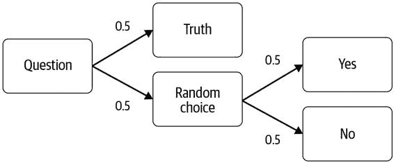
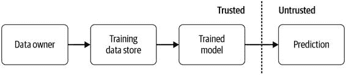
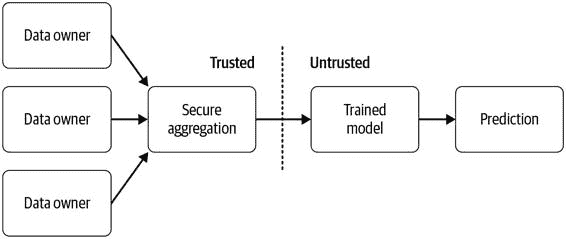
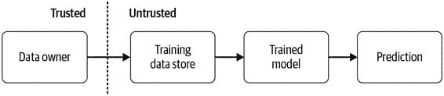

# 第十四章：机器学习的数据隐私

在本章中，我们将介绍数据隐私的一些方面，以其在机器学习流水线中的应用。隐私保护机器学习是一个非常活跃的研究领域，刚开始被纳入 TensorFlow 和其他框架。我们将解释写作时最有前途的技术背后的一些原则，并展示它们如何在机器学习流水线中应用的一些实际示例。

在本章中，我们将介绍隐私保护机器学习的三种主要方法：差分隐私、联邦学习和加密机器学习。

数据隐私问题

数据隐私关乎信任和限制人们希望保密的数据的曝光。有许多不同的隐私保护机器学习方法，为了在它们之间做出选择，您应该尝试回答以下问题：

+   > > > > 你试图保护数据免受谁的侵扰？
+   > > > > 
+   > > > > 系统的哪些部分可以保护隐私，哪些可以向世界公开？
+   > > > > 
+   > > > > 谁是可以查看数据的可信方？

这些问题的答案将帮助您决定本章描述的方法中哪一个最适合您的用例。

为什么我们关心数据隐私？

数据隐私正在成为机器学习项目的重要组成部分。有许多法律要求围绕用户隐私，例如 2018 年 5 月生效的欧盟通用数据保护条例（GDPR）和 2020 年 1 月生效的加利福尼亚消费者隐私法案。关于将个人数据用于机器学习存在伦理考虑，而使用由 ML 驱动的产品的用户开始关心其数据的去向。因为机器学习传统上需要大量数据，并且因为许多机器学习模型的预测基于从用户收集的个人数据，所以机器学习处于围绕数据隐私展开的辩论前沿。

在撰写时，隐私总是有成本的：增加隐私会带来模型精度、计算时间或两者的成本。在一个极端，不收集数据使得交互完全私密，但对机器学习来说完全无用。在另一个极端，了解一个人的所有细节可能会危及其隐私，但这使我们能够创建非常精确的机器学习模型。我们现在刚开始看到隐私保护 ML 的发展，其中可以增加隐私而不会如此大幅降低模型精度。

在某些情况下，隐私保护的机器学习可以帮助您使用由于隐私问题而无法用于训练机器学习模型的数据。然而，这并不意味着只要使用本章节中的某种方法，就可以随意处理数据。您应该与其他利益相关者讨论您的计划，例如数据所有者、隐私专家甚至公司的法律团队。

增加隐私的最简单方法

通常，建立基于机器学习的产品的默认策略是收集所有可能的数据，然后再决定哪些数据对训练特定模型有用。尽管这是在用户同意的情况下进行的，增加用户隐私的最简单方法是仅收集训练特定模型所需的数据。在结构化数据的情况下，诸如姓名、性别或种族等字段可以直接删除。文本或图像数据可以处理以删除大部分个人信息，例如从图像中删除面部或从文本中删除姓名。然而，在某些情况下，这可能会降低数据的效用或使其无法训练出准确的模型。如果不收集种族和性别的数据，就无法判断模型是否对特定群体存在偏见。

数据的收集控制也可以交给用户：收集数据的同意可以比简单的选择“接受”或“拒绝”更为细致，产品的使用者可以明确指定关于他们的数据可以收集哪些。这带来了设计挑战：提供较少数据的用户是否应该接收到比提供更多数据的用户更不准确的预测？我们如何通过机器学习管道跟踪同意？如何衡量我们模型中单个特征的隐私影响？这些都是机器学习社区需要更多讨论的问题。

哪些数据需要保持私密？

在机器学习管道中，数据通常来自人们，但某些数据更需要进行隐私保护的机器学习。个人识别信息（PII）是可以直接识别单个人的数据，例如他们的姓名、电子邮件地址、街道地址、ID 号码等，这些需要保持私密。PII 可能出现在自由文本中，例如反馈评论或客户服务数据，而不仅仅是在直接要求用户提供这些数据时。在某些情况下，人们的图像也可能被视为 PII。通常会有法律标准约束这一点——如果您的公司有隐私团队，最好在启动使用此类数据的项目之前咨询他们。

敏感数据也需要特别小心。这通常被定义为可能会对某人造成伤害的数据，例如健康数据或专有公司数据（例如财务数据）。在确保这类数据不会在机器学习模型的预测中泄露的过程中，应该小心谨慎。

另一类是准标识数据。如果已知足够多的准标识符，比如位置跟踪或信用卡交易数据，准标识数据可以唯一标识某人。如果了解了同一人的多个位置点，这就提供了一个可以与其他数据集组合以重新识别该人的唯一迹象。2019 年 12 月，《纽约时报》发表了关于使用手机数据重新识别的[深度文章](https://oreil.ly/VPea0)，这只是众多质疑释放此类数据的声音之一。

差分隐私

如果我们确定了机器学习流程中需要额外隐私的需求，有不同的方法可以在尽可能保留数据效用的同时增加隐私。我们将讨论的第一个方法是差分隐私 1。差分隐私（DP）是一个概念的形式化，即查询或数据集的转换不应揭示一个人是否在该数据集中。它通过添加噪音来给出一个人在数据集中的隐私损失的数学度量，并通过最小化这种隐私损失来减少它。

> 差分隐私描述了数据持有者或馆长向数据主体作出的承诺，这个承诺如下：“无论其他研究、数据集或信息来源如何，允许您的数据用于任何研究或分析都不会对您产生不利影响。”
> 
> 辛西娅·德沃克 2

换句话说，尊重隐私的数据集转换，在从该数据集中删除一个人时不应该改变。对于机器学习模型而言，如果一个模型在设计时考虑了隐私，那么模型做出的预测在从训练集中删除一个人后不应该改变。差分隐私通过向转换添加某种形式的噪音或随机性来实现。

要给出一个更具体的例子，实现差分隐私的最简单方法之一是随机响应的概念，如图 14-1 所示。这在问卷调查中尤其有用，这些问卷会问一些敏感问题，比如“你是否曾被判犯罪？”被问者需要抛硬币来回答这个问题。如果硬币正面朝上，他们就如实回答。如果是反面，他们需要再抛一次，并根据硬币的结果回答“是”或“否”。这使他们能够否认，称他们给出的是随机答案而不是真实答案。由于我们知道硬币抛掷的概率，如果我们向很多人询问这个问题，我们可以相对准确地计算出犯罪记录的比例。当更多人参与调查时，计算的准确性会增加。

图 14-1\. 随机响应流程图

这些随机变换是差分隐私的关键。

> 假设每个人只有一个训练样本。
> 
> 在本章中，为简化起见，假设数据集中的每个训练样本都与一个独立的个人相关联或收集自个人。

本地和全局差分隐私

DP 可以分为两种主要方法：本地 DP 和全局 DP。在本地 DP 中，如前面的随机响应示例中一样，会在个体级别添加噪音或随机性，因此在个体和数据收集者之间保持隐私。在全局 DP 中，会对整个数据集的转换添加噪音。数据收集者信任原始数据，但转换结果不会泄露有关个人的数据。

全局 DP 要求我们相对于本地 DP 添加更少的噪音，这导致在类似的隐私保证下查询的效用或准确性有所提高。缺点是对于全局 DP，必须信任数据收集者，而对于本地 DP，只有个体用户看到他们自己的原始数据。

ε、δ 和隐私预算

实现 DP 的最常见方式可能是使用（ε-δ）DP。当比较包含特定个人的数据集上的随机转换结果与不包含该人的另一个结果时，描述这些转换结果之间的最大差异。因此，如果 ε 是 0，两个转换将完全返回相同的结果。如果 ε 的值较小，则这两个转换返回相同结果的概率较大；ε 值越小，隐私保证越强。如果多次查询数据集，则需要将每个查询的 ε 相加以获得总的隐私预算。

是不满足的概率，或者说个体数据在随机转换结果中暴露的概率。通常情况下，我们将设置为人口规模的倒数：例如，对于包含 2000 人的数据集，我们将设置为 1/1000。3

您应该选择多少的值作为 ε？这允许我们比较不同算法和方法的隐私性，但给出“足够”隐私的绝对值取决于使用案例。4

为了决定使用哪个值来设置 ε，可以查看系统在 ε 减小时的准确性。在保留业务问题的可接受数据效用的同时，选择尽可能私密的参数值。或者，如果泄露数据的后果非常严重，则可以先设置 ε 和 δ 的可接受值，然后调整其他超参数以获得最佳的模型准确性。DP 的一个缺点是 ε 不容易解释。正在开发其他方法来帮助解决这个问题，例如在模型的训练数据中种植秘密，并测量它们在模型预测中暴露的可能性。5

机器学习中的差分隐私

如果您想将 DP 作为机器学习流程的一部分使用，目前有几个可选项可以添加，尽管我们预计未来会看到更多选项。首先，DP 可以包含在联邦学习系统中（参见“联邦学习”），并且可以使用全局或本地 DP。其次，TensorFlow Privacy 库是全局 DP 的一个示例：原始数据可用于模型训练。

第三个选项是 Private Aggregation of Teacher Ensembles（PATE）方法。6 这是一个数据共享场景：如果有 10 个人拥有标记数据，但你没有，他们会在本地训练一个模型，并对你的数据进行预测。然后执行 DP 查询，以生成数据集中每个示例的最终预测，以便您不知道哪个模型生成了预测。然后，从这些预测中训练一个新模型——这个模型以一种不可能了解那些隐藏数据集的方式包含了这 10 个隐藏数据集的信息。PATE 框架展示了在这种情况下如何花费。

TensorFlow 隐私简介

[TensorFlow 隐私](https://oreil.ly/vlcIy)（TFP）在模型训练期间将 DP 添加到优化器中。TFP 中使用的 DP 类型是全局 DP 的一个示例：在训练过程中添加噪声，以使私密数据不会暴露在模型的预测中。这使我们能够提供强大的 DP 保证，即个人数据未被记忆，同时最大化模型精度。如图 14-2 所示，在此情况下，原始数据可供信任的数据存储和模型训练者使用，但最终预测是不可信的。

图 14-2。DP 的受信方

使用差分私密优化器进行训练

优化器算法通过在每个训练步骤中向梯度添加随机噪声来进行修改。这比较了有或没有每个单独数据点的梯度更新，并确保无法确定特定数据点是否包含在梯度更新中。此外，梯度被剪裁，以防止它们变得过大——这限制了任一训练样本的贡献。作为额外的奖励，这也有助于防止过度拟合。

TFP 可以通过 pip 进行安装。在撰写本文时，它需要 TensorFlow 版本 1.X：

> `$` `pip install tensorflow_privacy`

我们从一个简单的`tf.keras`二元分类示例开始：

> `import``tensorflow``as``tf``model``=``tf``.``keras``.``models``.``Sequential``([``tf``.``keras``.``layers``.``Dense``(``128``,``activation``=``'relu'``),``tf``.``keras``.``layers``.``Dense``(``128``,``activation``=``'relu'``),``tf``.``keras``.``layers``.``Dense``(``1``,``activation``=``'sigmoid'``)``])`

要求不同 ially privat 优化器与正常的`tf.keras`模型相比需要设置两个额外的超参数：噪声倍增器和 L2 范数剪辑。最好调整这些参数以适应您的数据集，并测量它们对：  

> `NOISE_MULTIPLIER``=``2``NUM_MICROBATCHES``=``32``LEARNING_RATE``=``0.01``POPULATION_SIZE``=``5760``L2_NORM_CLIP``=``1.5``BATCH_SIZE``=``32``EPOCHS``=``70`  

> > 批处理大小必须与微批处理数量完全可除。  

  

> > 训练集中的示例数。  

> > 人口数量必须与批次大小完全可除。  

接下来，初始化不同 ially privat 优化器：  

> `from``tensorflow_privacy.privacy.optimizers.dp_optimizer` `\` `import``DPGradientDescentGaussianOptimizer``optimizer``=``DPGradientDescentGaussianOptimizer``(``l2_norm_clip``=``L2_NORM_CLIP``,``noise_multiplier``=``NOISE_MULTIPLIER``,``num_microbatches``=``NUM_MICROBATCHES``,``learning_rate``=``LEARNING_RATE``)``loss``=``tf``.``keras``.``losses``.``BinaryCrossentropy``(``from_logits``=``True``,``reduction``=``tf``.``losses``.``Reduction``.``NONE``)`  

  

> > 损失必须基于每个示例而不是整个小批量计算。  

训练私密模型就像训练正常的`tf.keras`模型一样：  

> `model``.``compile``(``optimizer``=``optimizer``,``loss``=``loss``,``metrics``=``[``'accuracy'``])``model``.``fit``(``X_train``,``y_train``,``epochs``=``EPOCHS``,``validation_data``=``(``X_test``,``y_test``),``batch_size``=``BATCH_SIZE``)`  

计算 Epsilon  

现在，我们计算我们的模型和我们选择的噪声倍增器和梯度剪辑的差分隐私参数：  

> `from``tensorflow_privacy.privacy.analysis``import``compute_dp_sgd_privacy``compute_dp_sgd_privacy``.``compute_dp_sgd_privacy``(``n``=``POPULATION_SIZE``,``batch_size``=``BATCH_SIZE``,``noise_multiplier``=``NOISE_MULTIPLIER``,``epochs``=``EPOCHS``,``delta``=``1e-4``)`

  

> > Delta 的值设置为数据集大小的倒数，四舍五入到最接近的数量级。  
> > 
> TFP 仅支持 TensorFlow 1.X  
> 
> 我们展示如何将先前章节的示例项目转换为我们的[GitHub 存储库](https://oreil.ly/bmlp-git)中的 DP 模型。不过，在 TFX 管道中，TFP 支持 TensorFlow 2.X 之前，无法使用此模型。

此计算的最终输出，epsilon 的值，告诉我们特定模型的隐私保证强度。然后，我们可以探索如何改变先前讨论的 L2 范数剪辑和噪声乘数超参数会同时影响 epsilon 和模型精度。如果增加这两个超参数的值，而保持其他参数不变，epsilon 将减少（因此隐私保证变得更强）。在某个点上，精度将开始减少，模型将不再有用。可以探索这种权衡，以获得尽可能强大的隐私保证，同时仍保持有用的模型精度。

联邦学习

联邦学习（FL）是一个协议，其中机器学习模型的训练分布在许多不同的设备上，并在中央服务器上组合训练好的模型。关键点在于原始数据永远不会离开各自的设备，也永远不会集中到一个地方。这与在中心位置收集数据集然后训练模型的传统架构非常不同。

在移动电话具有分布数据或用户的浏览器的背景下，FL 通常非常有用。另一个潜在的用例是在分布在多个数据所有者之间的敏感数据共享方面。例如，AI 初创公司可能希望训练一个模型来检测皮肤癌。皮肤癌图像由许多医院拥有，但由于隐私和法律问题，它们不能集中在一个地方。FL 允许初创公司在数据不离开医院的情况下训练模型。

在联邦学习（FL）设置中，每个客户端接收模型架构和一些训练指令。每个客户端的设备上训练一个模型，并将权重返回到中央服务器。这在一定程度上增加了隐私性，因为拦截者很难从模型权重中了解用户的任何信息，而不是从原始数据中获取，但这并不能提供任何隐私保证。分发模型训练的步骤并不能为用户提供免于公司收集数据影响的隐私保护，因为公司通常可以通过了解模型架构和权重来推断原始数据可能的内容。

然而，使用 FL 来增加隐私还有一个非常重要的步骤：将权重安全聚合到中央模型中。有许多算法可以做到这一点，但它们都要求中央方信任不会在权重组合之前尝试检查权重。

图 14-3 显示了在 FL 设置中哪些方可以访问用户的个人数据。收集数据的公司可以建立安全平均值，以便他们不会看到用户返回的模型权重。中立的第三方也可以执行安全聚合。在这种情况下，只有用户可以看到他们的数据。

图 14-3\. 联邦学习中的信任方

FL 的一个额外的隐私保护扩展是将 DP 整合到这一技术中。在这种情况下，DP 限制了每个用户对最终模型的贡献信息量。研究表明，如果用户数量庞大，生成的模型几乎和非 DP 模型一样准确。7 然而，目前尚未将其实施到 TensorFlow 或 PyTorch 中。

FL 在生产中的一个例子是[Google 的 Gboard 安卓手机键盘](https://oreil.ly/LXtSN)。Google 能够训练模型以更好地预测下一个单词，而无需了解用户的私密消息。FL 在以下具有相似特征的使用案例中最为有用：8

+   > > > > 模型所需的数据只能从分布源收集。
+   > > > > 
+   > > > > 数据源数量庞大。
+   > > > > 
+   > > > > 数据在某种程度上是敏感的。
+   > > > > 
+   > > > > 数据不需要额外标记，标签直接由用户提供且不离开源。
+   > > > > 
+   > > > > 理想情况下，数据来自接近相同的分布。

FL 在设计机器学习系统时引入了许多新的考虑因素：例如，不是所有数据源都可能在一次训练运行和下一次之间收集了新数据，不是所有移动设备都一直开机，等等。收集的数据通常不平衡，且几乎每个设备都是独特的。当设备池庞大时，每次训练运行获取足够的数据是最容易的。任何使用 FL 的项目都必须开发新的安全基础设施。9

在训练 FL 模型的设备上需要注意避免性能问题。训练可能会迅速消耗移动设备的电量或造成大量数据使用，从而增加用户的费用。尽管移动电话的处理能力在迅速增加，但它们仍然只能训练小型模型，因此更复杂的模型应该在中央服务器上进行训练。

TensorFlow 中的联邦学习

TensorFlow Federated（TFF）模拟了 FL 的分布式设置，并包含一种可以在分布数据上计算更新的随机梯度下降（SGD）版本。传统的 SGD 要求在集中数据集的批次上计算更新，而在联邦设置中不存在这种集中数据集。截至撰写本文时，TFF 主要用于研究和实验新的联邦算法。

[PySyft](https://oreil.ly/qlAWh) 是由 OpenMined 组织开发的用于隐私保护机器学习的开源 Python 平台。它包含使用安全多方计算来聚合数据的 FL 实现（在下一节中进一步解释）。最初开发时支持 PyTorch 模型，但已发布了[TensorFlow 版本](https://oreil.ly/01yw2)。

加密机器学习

加密机器学习是隐私保护机器学习的另一个领域，目前在研究人员和实践者中受到广泛关注。它依赖于密码学社区的技术和研究成果，并将这些技术应用于机器学习。迄今为止已经采用的主要方法包括同态加密（HE）和安全多方计算（SMPC）。有两种使用这些技术的方式：加密已经在明文数据上训练过的模型，以及在训练期间保持数据加密状态的整个系统。

HE 类似于公钥加密，但不同之处在于在应用计算之前，数据不需要解密。可以对加密数据执行计算（例如从机器学习模型中获取预测）。用户可以以加密形式提供其数据，使用本地存储的加密密钥，然后接收加密预测结果，随后可以解密以获取模型在其数据上的预测。这为用户提供了隐私保护，因为他们的数据不会与训练模型的一方共享。

SMPC 允许多个参与方合并数据，在其上执行计算，并在自己的数据上查看计算结果，而无需了解其他参与方的数据。这是通过 [秘密分享](https://oreil.ly/kIeOx) 实现的，即任何单个值被分割成发送到不同参与方的份额的过程。原始值无法从任何份额中重建，但仍然可以对每个份额进行个别计算。只有在重新组合所有份额后，计算的结果才有意义。

这些技术都有其成本。在撰写本文时，HE 很少用于训练机器学习模型：它导致训练和预测速度大幅减慢。因此，我们不再讨论 HE。SMPC 在网络传输时间方面也有开销，因为需要在各方之间传递份额和结果，但它比 HE 明显更快。这些技术与 FL 一起，适用于数据无法集中存储的情况。然而，它们无法阻止模型记忆敏感数据—差分隐私（DP）是解决这个问题的最佳方案。

TensorFlow 提供了针对加密机器学习的支持，通过 [TF Encrypted](https://tf-encrypted.io)（TFE）实现，主要由 [Cape Privacy](https://capeprivacy.com) 开发。TFE 还可以提供用于 FL 所需的 [安全聚合](https://oreil.ly/VVPJx)。

加密模型训练

您可能希望使用加密机器学习的第一种情况是在加密数据上训练模型。当原始数据需要对训练模型的数据科学家保密，或者两个或更多方拥有原始数据并希望使用所有方的数据训练模型时，这是非常有用的。如图 14-4 所示，在这种情况下，只信任数据所有者或所有者。

图 14-4\. 使用加密模型训练的受信任方

对于此用例，TFE 可用于训练加密模型。像往常一样使用 `pip` 安装：

> `$` `pip install tf_encrypted`

构建 TFE 模型的第一步是定义一个类，该类以批量方式提供训练数据。这个类由数据所有者（们）在本地实现。它使用装饰器转换为加密数据：

> `@tfe.local_computation`

在 TFE 中编写模型训练代码几乎与常规 Keras 模型相同 —— 只需用 `tfe` 替换 `tf`：

> `import``tf_encrypted``as``tfe``model``=``tfe``.``keras``.``Sequential``()``model``.``add``(``tfe``.``keras``.``layers``.``Dense``(``1``,``batch_input_shape``=``[``batch_size``,``num_features``]))``model``.``add``(``tfe``.``keras``.``layers``.``Activation``(``'sigmoid'``))`

唯一的区别是必须向 `Dense` 的第一层提供 `batch_input_shape` 参数。

本文档提供了这方面的工作示例 [TFE documentation](https://oreil.ly/ghGnu)。截至撰写本文时，TFE 尚未包含常规 Keras 的所有功能，因此我们无法以此格式展示我们的示例项目。

将训练好的模型转换为提供加密预测

TFE 的第二种有用场景是您希望为[在明文数据上训练的加密模型提供服务](https://oreil.ly/HBUBj)。在这种情况下，如图 14-5 所示，您可以完全访问未加密的训练数据，但希望应用程序的用户能够接收私密预测。这为上传加密数据并接收加密预测的用户提供了隐私保护。

图 14-5\. 在加密训练模型时的受信任方

此方法可能是当今机器学习管道的最佳选择，因为模型可以像正常训练一样进行训练并转换为加密版本。它还可用于使用 DP 训练的模型。与非加密模型的主要区别在于需要多个服务器：每个服务器都托管原始模型的一部分。如果任何人在一个服务器上查看模型的一部分或发送到任何一个服务器的数据的一部分，都不会泄露关于模型或数据的任何信息。

可通过以下方式将 Keras 模型转换为 TFE 模型：

> `tfe_model``=``tfe``.``keras``.``models``.``clone_model``(``model``)`

在这种情况下，需要执行以下步骤：

+   > > > > 在客户端上加载和预处理数据。
+   > > > > 
+   > > > > 在客户端对数据进行加密。
+   > > > > 
+   > > > > 将加密数据发送到服务器。
+   > > > > 
+   > > > > 在加密数据上进行预测。
+   > > > > 
+   > > > > 将加密预测结果发送到客户端。
+   > > > > 
+   > > > > 在客户端解密预测结果并显示给用户。

TFE 提供了一系列笔记本，展示如何提供私密预测结果的方法，详见[这里](https://oreil.ly/r0cKP)。

其他数据隐私方法

还有许多其他技术可为包含在机器学习模型中的个人增强隐私保护。仅仅使用正则表达式和命名实体识别模型对文本数据进行清理（如姓名、地址、电话号码等），可能会非常简单。

> K-匿名性
> 
> [K-匿名性](https://oreil.ly/sxQet)，通常简称为匿名化，在增强机器学习流程中的隐私保护方面并不是一个良好的选择。K-匿名性要求数据集中的每个个体在其准标识符（如性别、种族和邮政编码等间接识别个体的数据）方面与其他 k-1 个个体不可区分。这通常通过聚合或删除数据来实现，直到数据集满足此要求。这种数据的移除通常会显著降低机器学习模型的准确性。10

摘要

当您处理个人或敏感数据时，请选择最适合您需求的数据隐私解决方案，考虑谁可信、需要何种模型性能水平以及从用户那里获得了什么同意。

本章描述的所有技术都非常新颖，它们的实际应用还不广泛。不要认为使用本章描述的任何框架可以完全保护用户的隐私。为了在机器学习流程中增加隐私，通常需要大量的额外工程努力。隐私保护机器学习领域正在迅速发展，目前正在进行新的研究。我们鼓励您寻找该领域的改进，并支持诸如[PySyft](https://oreil.ly/rj0_c)和[TFE](https://oreil.ly/L5zik)等数据隐私的开源项目。

数据隐私和机器学习的目标通常是高度一致的，即我们希望了解整个人群并做出对每个人都同样有利的预测，而不是仅仅了解个体。添加隐私可以阻止模型过度拟合于某个人的数据。我们期望未来，在模型训练个人数据时，隐私将从一开始就被设计进机器学习流程中。

> 1   Cynthia Dwork，《差分隐私》，载于《密码学与安全百科全书》，编辑：Henk C. A. van Tilborg 和 Sushil Jajodia，波士顿：Springer，2006 年。
> 
> 2   Cynthia Dwork 和 Aaron Roth，《差分隐私的算法基础》，《理论计算机科学基础和趋势》，第 9 卷，第 3-4 期：211–407，（2014），https://www.cis.upenn.edu/~aaroth/Papers/privacybook.pdf。
> 
> 3   更多关于此背后数学的细节可以在 Dwork 和 Roth 的论文中找到，“差分隐私的算法基础”。
> 
> 4   更多细节可以在 Justin Hsu 等人的论文中找到，“差分隐私：选择ε的经济方法”（论文展示，2014 年 IEEE 计算机安全基础对称研讨会，奥地利维也纳，2014 年 2 月 17 日），[`arxiv.org/pdf/1402.3329.pdf`](https://arxiv.org/pdf/1402.3329.pdf)。
> 
> 5   Nicholas Carlini 等人，“秘密共享者”，2019 年 7 月。[`arxiv.org/pdf/1802.08232.pdf`](https://arxiv.org/pdf/1802.08232.pdf)。
> 
> 6   Nicolas Papernot 等人，“半监督知识转移用于来自私有训练数据的深度学习”，2016 年 10 月，[`arxiv.org/abs/1610.05755`](https://arxiv.org/abs/1610.05755)。
> 
> 7   Robin C. Geyer 等人，“差分私有联邦学习：客户端视角”，2017 年 12 月，[`arxiv.org/abs/1712.07557`](https://arxiv.org/abs/1712.07557)。
> 
> 8   这一点在 H. Brendan McMahan 等人的论文中有更详细的讨论，“分散数据中深度网络的通信有效学习”，发表于第 20 届人工智能与统计学国际会议论文集，PMLR 54 (2017): 1273–82，[`arxiv.org/pdf/1602.05629.pdf`](https://arxiv.org/pdf/1602.05629.pdf)。
> 
> 9   关于 FL 系统设计的更多细节，请参阅 Keith Bonawitz 等人的论文，“朝着规模化的联邦学习：系统设计”（演示，第 2 届 SysML 会议论文集，加利福尼亚州帕洛阿尔托，2019 年），[`arxiv.org/pdf/1902.01046.pdf`](https://arxiv.org/pdf/1902.01046.pdf)。
> 
> 10   此外，“匿名化”数据集中的个体可以使用外部信息重新识别；详见 Luc Rocher 等人的论文，“使用生成模型估算不完整数据集中重新识别的成功率”，自然通讯 10, 文章号 3069 (2019)，[`www.nature.com/articles/s41467-019-10933-3`](https://www.nature.com/articles/s41467-019-10933-3)。
