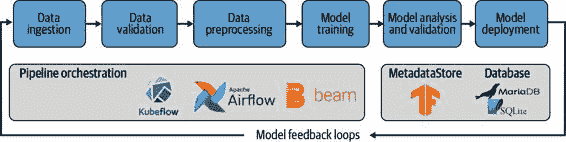

# 第十五章：管道的未来和下一步

在过去的 14 章中，我们捕捉了机器学习管道的当前状态，并给出了如何构建它们的建议。机器学习管道是一个相对较新的概念，在这个领域还有很多内容等待探索。在本章中，我们将讨论一些我们认为重要但与当前管道不太契合的事物，并考虑 ML 管道的未来步骤。

模型实验跟踪

在本书的整个过程中，我们假设你已经进行了实验，并且模型架构基本上已经确定。然而，我们想分享一些关于如何跟踪实验并使实验过程更顺利的想法。你的实验过程可能包括探索潜在的模型架构、超参数和特征集。但无论你探索什么，我们想要强调的关键点是，你的实验过程应该与你的生产过程密切配合。

无论是手动优化模型还是自动调整模型，捕获和分享优化过程的结果都是必不可少的。团队成员可以快速评估模型更新的进展。同时，模型的作者可以收到执行实验的自动记录。良好的实验跟踪有助于数据科学团队提高效率。

实验跟踪还增加了模型的审计追踪，并可能作为对潜在诉讼的防范措施。如果一个数据科学团队面临是否在训练模型时考虑了边缘案例的问题，实验跟踪可以帮助追踪模型参数和迭代过程。

实验跟踪工具包括[Weights and Biases](https://www.wandb.com)和[Sacred](https://oreil.ly/6zK3V)。图 15-1 展示了 Weights and Biases 在使用中的示例，显示了每个模型训练运行的损失随训练轮次的变化。有许多不同的可视化方式可供选择，我们可以存储每个模型运行的所有超参数。

图 15-1\. Weights and Biases 中的实验跟踪

在未来，我们预计实验和生产过程将更紧密地联系在一起，这样数据科学家可以顺利地从尝试新的模型架构转换到将其添加到他们的流水线中。

对模型发布管理的思考

在软件工程中，已经建立了版本控制和发布管理的成熟流程。可能造成向后不兼容的重大更改会导致主版本更改（例如从 0.x 到 1.0）。较小的功能增加会导致次要版本更改（1.0 到 1.1）。但这在机器学习领域意味着什么？从一个机器学习模型到下一个，数据的输入格式可能相同，预测结果的输出格式也保持不变，因此没有破坏性变化。管道仍然运行；不会抛出错误。但是新模型的性能可能与之前完全不同。机器学习管道的标准化要求模型版本控制实践。

我们建议以下模型发布管理策略：

+   > > > > 如果更改输入数据，则模型版本进行次要更改。
+   > > > > 
+   > > > > 如果改变了超参数，则模型版本进行主要更改。这包括网络中的层次数或层中的节点数。
+   > > > > 
+   > > > > 如果完全改变了模型架构（例如从递归神经网络[RNN]到 Transformer 架构），这将成为一个全新的管道。

模型验证步骤控制发布是否发生，通过验证新模型的性能是否优于先前模型的性能。在撰写本文时，TFX 管道仅使用此步骤中的单一指标。我们预期验证步骤将在未来变得更加复杂，包括其他因素，如推断时间或数据不同切片上的准确性。

未来管道能力

在本书中，我们记录了撰写时的机器学习管道状态。但是未来的机器学习管道将会是什么样子？我们希望看到的一些功能包括：

+   > > > > 隐私和公平成为首要关注：在撰写本文时，假设管道不包括保护隐私的机器学习。包含公平性分析，但 ModelValidator 步骤只能使用整体指标。
+   > > > > 
+   > > > > FL 的整合，正如我们在第十四章中讨论的那样。如果数据预处理和模型训练发生在大量个体设备上，机器学习管道将需要与本书描述的非常不同。
+   > > > > 
+   > > > > 测量我们管道的碳排放能力。随着模型变得越来越大，它们的能源消耗变得显著。尽管这在实验过程中通常更相关（特别是在搜索模型架构时），将排放追踪集成到管道中将非常有用。
+   > > > > 
+   > > > > 数据流的摄取：在本书中，我们仅考虑了在数据批次上训练的管道。但随着更复杂的数据管道，机器学习管道应该能够消耗数据流。

未来的工具可能进一步抽象本书中的一些过程，我们预期未来的流水线将更加顺畅易用且更加自动化。

我们还预测未来的流水线将需要解决其他类型的机器学习问题。我们仅讨论了监督学习，几乎完全是分类问题。从监督分类问题开始是有道理的，因为这些问题是最容易理解并纳入流水线的一些问题。回归问题以及其他类型的监督学习，如图像字幕或文本生成，将很容易替换成我们在本书中描述的流水线的大多数组件。但是强化学习问题和无监督问题可能不太适合。这些在生产系统中仍然很少见，但我们预计它们将在未来变得更加普遍。我们流水线的数据摄入、验证和特征工程组件应该仍然可以处理这些问题，但是训练、评估和验证部分将需要进行重大改变。反馈循环也将有所不同。

TFX 与其他机器学习框架

未来的机器学习流水线还可能包括对底层机器学习框架的开放性，这样数据科学家就不需要在在 TensorFlow、PyTorch、scikit-learn 或任何其他未来框架之间做出选择。

很高兴看到 TFX 正朝着去除对纯 TensorFlow 依赖的方向发展。正如我们在第四章中讨论的那样，一些 TFX 组件可以与其他 ML 框架一起使用。其他组件正在进行过渡，以允许与其他 ML 框架集成。例如，`Trainer`组件现在提供了一个执行器，可以独立于 TensorFlow 训练模型。我们希望能看到更多能够轻松集成 PyTorch 或 scikit-learn 等框架的通用组件。

测试机器学习模型

机器学习工程中一个新兴的话题是机器学习模型的测试。这里，我们指的不是模型验证，如我们在第七章中讨论的那样，而是模型推断的测试。这些测试可以是模型的单元测试，也可以是模型与应用程序交互的完整端到端测试。

以及测试系统是否端到端运行，其他测试可能围绕以下内容展开：

+   > > > > 推断时间
+   > > > > 
+   > > > > 内存消耗
+   > > > > 
+   > > > > 移动设备的电池消耗
+   > > > > 
+   > > > > 模型大小与准确性之间的权衡

我们期待软件工程中的最佳实践与数据科学实践融合，模型测试将成为其中的一部分。

用于机器学习的 CI/CD 系统

随着机器学习流水线在未来几个月变得更加简化，我们将看到机器学习流水线向更完整的 CI/CD 工作流迈进。作为数据科学家和机器学习工程师，我们可以从软件工程工作流中学习。例如，我们期待在 ML 流水线中更好地集成数据版本控制，或者采用促进机器学习模型部署回滚的最佳实践。

机器学习工程社区

随着机器学习工程领域的形成，围绕该主题的社区将至关重要。我们期待与机器学习社区分享最佳实践、定制组件、工作流程、使用案例和流水线设置。我们希望本出版物对新兴领域做出一点贡献。与软件工程中的 DevOps 类似，我们希望看到更多的数据科学家和软件工程师对机器学习工程学科产生兴趣。

总结

本书包含了我们如何将您的机器学习模型转化为流畅流水线的建议。图 15-2 展示了我们认为在撰写时最为必要的所有步骤和我们认为最佳的工具。我们鼓励您对这个主题保持好奇心，跟随新的发展，并为围绕机器学习流水线的各种开源努力做出贡献。这是一个非常活跃发展的领域，新的解决方案经常发布。

图 15-2\. 机器学习流水线架构

图 15-2 具有三个极为重要的特性：它是自动化的、可扩展的和可重现的。由于它是自动化的，它解放了数据科学家维护模型的时间，让他们有时间尝试新的模型。由于它是可扩展的，它能够扩展以处理大量数据。由于它是可重现的，一旦您在基础架构上为一个项目设置好，构建第二个项目将变得容易。这些都是成功的机器学习流水线所必需的。
