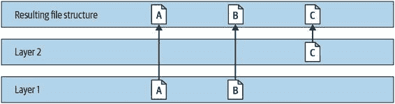
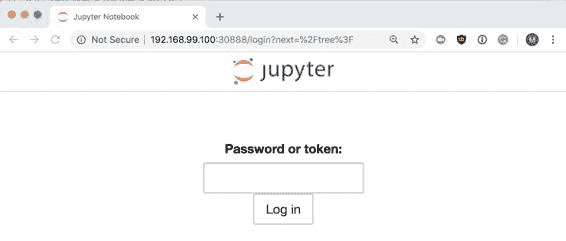

# 附录 A. 机器学习基础设施简介

本附录简要介绍了一些最有用的机器学习基础设施工具：以 Docker 或 Kubernetes 的形式的容器。虽然这可能是您将流水线交给软件工程团队的时候，但对于任何构建机器学习流水线的人来说，了解这些工具是非常有用的。

什么是容器？

所有 Linux 操作系统都基于文件系统，或包括所有硬盘和分区的目录结构。从这个文件系统的根目录（表示为 `/`）可以访问几乎所有 Linux 系统的方面。容器创建一个新的、更小的根目录，并将其用作在更大的主机内部的“小型 Linux”。这使您可以拥有一整套专用于特定容器的库。此外，容器还允许您控制每个容器的 CPU 时间或内存等资源。

Docker 是一个用户友好的 API，用于管理容器。使用 Docker 可以多次构建、打包、保存和部署容器。它还允许开发者在本地构建容器，然后发布到一个中央注册表，其他人可以从中拉取并立即运行容器。

依赖管理在机器学习和数据科学中是一个重大问题。无论您是在 R 还是 Python 中编写代码，几乎总是依赖于第三方模块。这些模块经常更新，可能会在版本冲突时对您的流水线造成破坏性变化。通过使用容器，您可以预先打包您的数据处理代码以及正确的模块版本，避免这些问题。

Docker 简介

要在 Mac 或 Windows 上安装 Docker，请访问 [`docs.docker.com/install`](https://docs.docker.com/install)，并下载适合您操作系统的最新稳定版 Docker Desktop。

对于 Linux 操作系统，Docker 提供了一个非常方便的脚本，只需几个命令即可安装 Docker：

> `$` `curl -fsSL https://get.docker.com -o get-docker.sh` `$` `sudo sh get-docker.sh`

您可以使用以下命令测试 Docker 安装是否正常工作：

> `docker run hello-world`

Docker 镜像简介

Docker 镜像是容器的基础，由对根文件系统的一系列更改和运行容器的执行参数组成。在运行之前，必须先“构建”镜像。

Docker 镜像背后一个有用的概念是存储层。构建镜像意味着为您的包安装一个几乎完整的专用 Linux 操作系统。为了避免每次都运行这个操作，Docker 使用了一个分层文件系统。其工作方式如下：如果第一层包含文件 A 和 B，第二层添加文件 C，结果的文件系统会显示 A、B 和 C。如果我们想创建第二个使用文件 A、B 和 D 的镜像，只需要更改第二层以添加文件 D。这意味着我们可以有基础镜像拥有所有基本软件包，然后我们可以专注于针对您的镜像的特定更改，如图 A-1 所示。

图 A-1\. 分层文件系统示例

Docker 镜像名称称为标签。它们遵循模式`docker registry``/``docker 命名空间``/``镜像名称``:``标签`。例如，docker.io/tensorflow/tensorflow:nightly 将指向 DockerHub 中 `tensorflow` 命名空间中的 `tensorflow` 镜像。标签通常用于标记特定镜像的版本。在我们的示例中，标签 `nightly` 保留用于 TensorFlow 的每夜构建版本。

Docker 镜像是根据`Dockerfile`构建的。Dockerfile 中的每一行都以几个子句之一开头。最重要的是：

`FROM`

> > 指示要构建的 Docker 基础容器。我们总是需要使用这个子句。可以下载许多基础容器，比如`ubuntu`。

`RUN`

> > 运行 bash。这是大多数 Docker 镜像的核心。在这里，我们希望执行包安装、目录创建等操作。因为每行操作都会在镜像中创建一个层，所以最好将包安装和其它的长时间任务作为 Dockerfile 中的最前面行之一。这意味着在重建过程中，Docker 将尝试使用缓存中的层。

`ARG`

> > 构建参数。如果您想要拥有同一镜像的多个版本，比如开发和生产版本，这很有用。

`COPY`

> > 从上下文中复制文件。上下文路径是`docker build`中使用的参数。上下文是一组本地文件，在构建过程中会暴露给 Docker，它只在过程中使用这些文件。这可以用来将源代码复制到容器中。

`ENV`

> > 设置环境变量。这个变量将成为镜像的一部分，将在构建和运行中可见。

`CMD`

> > 这是容器的默认命令。在 Docker 中的一个良好实践是每个容器运行一个命令。Docker 将监视该命令，当命令退出时退出，并将其标准输出（STDOUT）发布到`docker logs`。指定此命令的另一种方法是使用 `ENTRYPOINT`。这两者之间有几个细微差别，但这里我们将关注`CMD`。

`用户`

> > 容器中的默认用户。这与主机系统用户不同。如果要以某个用户身份运行命令，则应在构建过程中创建该用户。

`工作目录`

> > 图像中的默认目录。这将是执行默认命令的目录。

`暴露`

> > 指定容器将使用的端口。例如，HTTP 服务应该有 `EXPOSE 80`。

构建你的第一个 Docker 镜像

让我们来构建我们的第一个镜像！

首先，我们需要为我们的小型 Docker 项目创建一个新目录：

> `$` `mkdir hello-docker` `$` `cd` `hello-docker`

在这个目录中，创建一个名为 Dockerfile 的文件，内容如下：

> `FROM ubuntu RUN apt-get update RUN apt-get -y install cowsay CMD /usr/games/cowsay` `"Hello Docker"`

要构建它，使用命令 `docker build . -t hello-docker`。`-t` 标志指定了这个镜像的标签。你会看到一系列在容器中运行的命令。我们镜像中的每一层（对应于 `Dockerfile` 中的每个命令）在上一个层的临时容器中被调用。差异被保存下来，最终得到一个完整的镜像。第一层（我们不构建的那一层）基于 Ubuntu Linux。`Dockerfile` 中的 `FROM` 命令告诉 Docker 从注册表（在我们的情况下是 DockerHub）拉取这个镜像，并将其作为基础镜像使用。

构建完成后，调用 `docker images` 应该显示类似以下的内容：

> `REPOSITORY      TAG        IMAGE ID          CREATED          SIZE hello-docker    latest     af856e494ed4      2 minutes ago    155MB ubuntu          latest     94e814e2efa8      5 weeks ago      88.9MB`

我们应该能看到基础 Ubuntu 镜像和我们的新镜像。

即使我们已经构建了这个镜像，这并不意味着它已经可以使用了。下一步是运行这个镜像。`docker run` 可能是 Docker 中最重要的命令。它从现有镜像创建一个新容器（或者，如果系统上不存在镜像，则尝试从注册表拉取）。为了运行我们的镜像，我们应该调用 `docker run -it hello-docker`。这应该显示我们的 `cowsay` 命令的输出。

> Docker 注册表
> 
> Docker 的一个重要优势之一是方便地发布构建好的镜像。Docker 镜像的存储库称为注册表。默认的 Docker 注册表叫做 DockerHub，由 Docker, Inc. 支持。在 DockerHub 上注册账号是免费的，并且允许你将公共镜像推送到上面。

深入了解 Docker CLI

Docker CLI 是在本地机器上与镜像和容器交互的主要方式。在本节中，我们将讨论它的最重要的命令和选项。让我们从 `docker run` 开始。

我们可以传递许多重要的选项给 `docker run`。通过这些选项，我们可以覆盖 `Dockerfile` 中设置的大多数选项。这很重要，因为许多 Docker 镜像会有一个基本的默认命令，但通常这并不完全符合我们的运行需求。让我们来看看我们的 `cowsay` 示例：

> `docker run -it hello-docker /usr/games/cowsay` `"Our own message"`

图像标记之后的参数将覆盖我们在 `Dockerfile` 中设置的默认命令。这是指定我们自己的命令行标志给默认二进制文件的最佳方式。`docker run` 的其他有用标志包括：

`-it`

> > 意味着 “交互式”（i）和 `tty`（t），允许我们与从我们的 shell 运行的命令进行交互。

`-v`

> > 将 Docker 卷或主机目录挂载到容器中，例如包含数据集的目录。

`-e`

> > 通过环境变量传递配置。例如，`docker run -e MYVARNAME=value image` 将在容器中创建 `MYVARNAME` 环境变量。

`-d`

> > 允许容器以分离模式运行，非常适合长时间运行的任务。

`-p`

> > 将主机端口转发到容器，以允许外部服务通过网络与容器交互。例如，`docker run -d -p 8080:8080 imagename` 将主机的 `localhost:8080` 转发到容器的端口 8080。
> > 
> DOCKER COMPOSE
> 
> 当你开始挂载目录、管理容器链接等时，`docker run` 可以变得相当复杂。Docker Compose 是一个项目，旨在帮助处理这些问题。它允许你创建一个 `docker-compose.yaml` 文件，在其中可以为任意数量的容器指定所有 Docker 选项。然后，你可以通过网络连接容器，或者挂载相同的目录。

其他有用的 Docker 命令包括：

`docker ps`

> > 显示所有正在运行的容器。若要显示已退出的容器，添加 `-a` 标志。

`docker images`

> > 列出机器上存在的所有镜像。

`docker inspect 容器 ID`

> > 允许我们详细检查容器的配置。

`docker rm`

> > 删除容器。

`docker rmi`

> > 删除镜像。

`docker logs`

> > 显示容器产生的 STDOUT 和 STDERR 信息，非常有助于调试。

`docker exec`

> > 允许你在运行的容器内部调用命令。例如，`docker exec -it 容器 ID bash` 允许你使用 bash 进入容器环境并进行内部检查。`-it` 标志的工作方式与 `docker run` 中的相同。

Kubernetes 介绍

到目前为止，我们只讨论了在单台机器上运行的 Docker 容器。如果你想要扩展规模呢？Kubernetes 是一个开源项目，最初由 Google 开发，用于管理基础设施的调度和扩展。它动态地将负载扩展到多台服务器，并跟踪计算资源。Kubernetes 还通过将多个容器放置在一台机器上（取决于它们的大小和需求），并管理容器之间的通信来最大化效率。它可以在任何云平台上运行，如 AWS、Azure 或 GCP。

一些 Kubernetes 定义

Kubernetes 的入门中最难的部分之一是术语。以下是一些定义，帮助你理解：

集群

> > 一个集群是包含控制 Kubernetes API 服务器的中心节点和许多工作节点的一组机器。

节点

> > 一个节点是集群中的单个机器（可以是物理机器或虚拟机器）。

Pod

> > 一个 Pod 是一组在同一节点上运行的容器。通常，一个 Pod 只包含一个容器。

Kubelet

> > kubelet 是每个工作节点上管理与中心节点通信的 Kubernetes 代理。

服务

> > 服务是一组 Pod 和访问它们的策略。

卷

> > 卷是同一 Pod 中所有容器共享的存储空间。

命名空间

> > 命名空间是将物理集群空间划分为不同环境的虚拟集群。例如，我们可以将集群划分为开发环境、生产环境或不同团队的环境。

ConfigMap

> > ConfigMap 为在 Kubernetes 中存储非机密配置信息（环境变量、参数等）提供 API。ConfigMap 有助于将配置与容器映像分离。

kubectl

> > kubectl 是 Kubernetes 的命令行工具。

使用 Minikube 和 kubectl 入门

我们可以使用一个名为 Minikube 的工具创建一个简单的本地 Kubernetes 集群。Minikube 可以在任何操作系统上轻松设置 Kubernetes。它创建一个虚拟机，在其上安装 Docker 和 Kubernetes，并添加一个连接的本地用户。

> 不要在生产环境中使用 Minikube
> 
> Minikube 不应在生产环境中使用；它设计用于快速而轻松的本地环境。获取生产质量的 Kubernetes 集群的最简单方法是从任何主要公共云提供商购买托管的 Kubernetes 服务。

首先，安装 kubectl，即 Kubernetes 的命令行工具。

对于 Mac 用户，可以使用`brew`安装 kubectl：

> `brew install kubectl`

对于 Windows 用户，请参阅[其资源](https://oreil.ly/AhAwc)。

对于 Linux：

> `curl -LO https://storage.googleapis.com/kubernetes-release/release/v1.14.0/bin/linux/amd64/kubectl chmod +x ./kubectl sudo mv ./kubectl /usr/local/bin/kubectl`

要安装 Minikube，首先需要安装一个创建和运行虚拟机的 hypervisor，比如[VirtualBox](https://oreil.ly/LJgFJ)。

在 Mac 上，可以使用`brew`安装 Minikube：

> `brew install minikube`

对于 Windows 用户，请参阅[资源](https://oreil.ly/awtxY)。

对于 Linux 机器，请使用以下步骤：

> `curl -Lo minikube https://storage.googleapis.com/minikube/releases/latest/minikube-linux-amd64 chmod +x minikube sudo cp minikube /usr/local/bin && rm minikube`

安装完成后，可以通过一个简单的命令启动一个简单的 Kubernetes 集群：

> `minikube start`

要快速检查 Minikube 是否已准备就绪，可以尝试列出集群中的节点：

> `kubectl get nodes`

与 Kubernetes CLI 交互

Kubernetes API 基于资源。几乎 Kubernetes 世界中的所有内容都表示为资源。`kubectl`就是基于这一理念构建的，因此它在大多数资源交互中遵循类似的模式。

例如，列出所有 Pod 的典型`kubectl`调用为：

> `kubectl get pods`

这应该产生一个所有运行中的 pod 的列表，但因为我们还没有创建任何 pod，所以列表是空的。这并不意味着我们的集群上当前没有运行的 pod。Kubernetes 将其内部服务运行在名为 `kube-system` 的 namespace 中。要列出任何 namespace 中的所有 pod，可以使用 `-n` 选项：

> `kubectl get pods -n kube-system`

这应该返回多个结果。我们还可以使用 `--all-namespaces` 显示所有 namespace 中的所有 pod。

您可以仅使用名称显示一个 pod：

> `kubectl get po mypod`

您还可以通过标签进行过滤。例如，此调用应显示所有在 `kube-system` 中具有标签 `component=etcd` 值的 pod：

> `kubectl get po -n kube-system -l component=etcd`

`get` 显示的信息也可以修改。例如：

> `# 显示 pod 的节点和地址。` `kubectl get po -n kube-system -o wide` `# 显示名为 mypod 的 pod 的 yaml 定义。` `kubectl get po mypod -o yaml`

要创建新资源，`kubectl` 提供两个命令：`create` 和 `apply`。不同之处在于，`create` 将始终尝试创建新资源（如果已存在则失败），而 `apply` 将创建或更新现有资源。

创建新资源最常见的方法是使用包含资源定义的 YAML（或 JSON）文件，我们将在下一节中看到。以下 kubectl 命令允许我们创建或更新 Kubernetes 资源（例如 pod）：

> `# 创建在 pod.yaml 中定义的 pod。` `kubectl create -f pod.yaml` `# 这也可以与 HTTP 一起使用。` `kubectl create -f http://url-to-pod-yaml` `# apply 允许对资源进行更改。` `kubectl apply -f pod.yaml`

要删除资源，请使用 `kubectl delete`：

> `# 删除名为 foo 的 pod。` `kubectl delete pod foo` `# 删除在 pods.yaml 中定义的所有资源。` `kubectl delete -f pods.yaml`

您可以使用 `kubectl edit` 快速更新现有资源。这将打开一个编辑器，您可以在其中编辑加载的资源定义：

> `kubectl edit pod foo`

定义 Kubernetes 资源

Kubernetes 资源通常定义为 YAML（虽然也可以使用 JSON）。基本上，所有资源都是具有几个关键部分的数据结构。

`apiVersion`

> > 每个资源都是由 Kubernetes 本身或第三方提供的 API 的一部分。版本号显示 API 的成熟度。

`kind`

> > 资源类型（例如 pod、volume 等）。

`metadata`

> > 任何资源所需的数据。

`name`

> > 每个资源都可以通过查询的关键字来查询，这个关键字必须是唯一的。

`labels`

> > 每个资源可以有任意数量的键值对，称为标签。然后可以将这些标签用于选择器，用于查询资源，或仅作为信息。

`annotations`

> > 仅作信息用途的次要键值对，不能用于查询或选择器。

`namespace`

> > 显示资源属于特定命名空间或团队的标签。

`spec`

> > 资源的配置。所有实际运行所需的信息都应该在 `spec` 中。每个 `spec` 模式都是特定资源类型的唯一。

这是一个使用这些定义的示例 .yaml 文件：

> `apiVersion`:`v1` `kind`:`Pod` `metadata`:`name`:`myapp-pod` `labels`:`app`:`myapp` `spec`:`containers`:`— name`:`myapp-container     image: busybox     command: ['sh', '-c', 'echo Hello Kubernetes! && sleep 3600']

在这个文件中，我们有 `apiVersion` 和 `kind`，定义了这个资源是什么。我们有指定名称和标签的 `metadata`，还有构成资源主体的 `spec`。我们的 Pod 包含一个单一容器，在镜像 `busybox` 中运行命令 `sh -c echo Hello Kubernetes! && sleep 3600`。

将应用程序部署到 Kubernetes

在本节中，我们将通过 Minikube 完整部署一个功能性的 Jupyter Notebook。我们将为我们的笔记本创建一个持久卷，并创建一个 NodePort 服务，以允许我们访问我们的笔记本。

首先，我们需要找到正确的 Docker 镜像。jupyter/tensorflow-notebook 是由 Jupyter 社区维护的官方镜像。接下来，我们需要找出我们的应用程序将监听的端口：在这种情况下，它是 `8888`（Jupyter Notebooks 的默认端口）。

我们希望我们的笔记本在会话之间持久存在，因此我们需要使用 PVC（持久卷声明）。我们创建一个 pvc.yaml 文件来为我们完成这个任务：

> `kind`:`PersistentVolumeClaim` `apiVersion`:`v1` `metadata`:`name`:`notebooks` `spec`:`accessModes`:`— ReadWriteOnce` `resources`:`requests`:`storage`:`3Gi`

现在我们可以通过调用以下命令来创建此资源：

> `kubectl apply -f pvc.yaml`

这应该创建一个卷。要确认，我们可以列出所有的卷和 PVC：

> `kubectl get pv kubectl get pvc kubectl describe pvc notebooks`

接下来，我们创建我们的 deployment .yaml 文件。我们将有一个 Pod，它将挂载我们的卷并暴露端口 8888：

> `apiVersion`:`apps/v1` `kind`:`Deployment` `metadata`:`name`:`jupyter` `labels`:`app`:`jupyter` `spec`:`selector`:`matchLabels`:`app`:`jupyter` `template`:`metadata`:`labels`:`app`:`jupyter` `spec`:`containers`:`— image:`jupyter/tensorflow-notebook` `name`:`jupyter` `ports`:`— containerPort:`8888           name: jupyter` `volumeMounts`:`— name:`notebooks           mountPath: /home/jovyan` `volumes`:`— name:`notebooks         persistentVolumeClaim:`claimName:`notebooks

> > 非常重要的是，此选择器必须与模板中的标签匹配。

> > 我们的镜像。

通过应用此资源（与 PVC 相同的方式），我们将创建一个带有 Jupyter 实例的 Pod：

> `# 让我们看看我们的部署是否准备就绪。` `kubectl get deploy` `# 列出属于此应用程序的 Pod。` `kubectl get po -l` `app``=``jupyter`

当我们的 Pod 处于 `Running` 状态时，我们应该获取一个令牌，用于连接到我们的笔记本。此令牌将出现在日志中：

> `kubectl logs deploy/jupyter`

要确认 Pod 是否正常工作，让我们使用 `port-forward` 访问我们的笔记本：

> `# 首先我们需要为我们的 Pod 命名; 它将具有随机后缀。` `kubectl get po -l` `app``=``jupyter kubectl port-forward jupyter-84fd79f5f8-kb7dv 8888:8888`

有了这个，我们应该能够在 [`localhost:8888`](http://localhost:8888) 访问笔记本。问题是，其他人无法访问，因为它是通过我们的本地 `kubectl` 代理的。让我们创建一个 `NodePort` 服务来让我们访问这个笔记本：

> `apiVersion``:` `v1` `kind``:` `Service` `metadata``:``name``:` `jupyter-service` `labels``:``app``:` `jupyter` `spec``:``ports``:``— port``:` `8888       nodePort: 30888` `selector``:``app``:` `jupyter` `type``:` `NodePort`

当这个创建完成后，我们应该能够访问我们的 Jupyter！但首先，我们需要找到我们的 Pod 的 IP 地址。我们应该能够通过这个地址和端口 30888 访问 Jupyter：

> `minikube ip` `# 这将显示我们的 kubelet 地址是什么。` `192.168.99.100:30888`

其他人现在可以通过获取的 IP 地址和服务端口访问 Jupyter Notebook（见 Figure A-2）。一旦您在浏览器中访问该地址，您应该能看到 Jupyter Notebook 实例。

图 A-2\. 运行在 Kubernetes 上的 Jupyter Notebook

这是关于 Kubernetes 及其部件的简要概述。Kubernetes 生态系统非常广泛，简短的附录无法提供全面的概述。有关 Kubeflow 底层架构 Kubernetes 的更多详细信息，我们强烈推荐 O’Reilly 出版的《Kubernetes: Up and Running》一书，作者是 Brendan Burns 等人。
