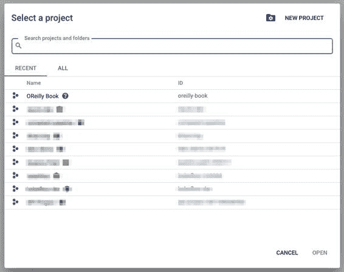

# 附录 B. 在 Google Cloud 上设置 Kubernetes 集群

本附录简要介绍了如何在 Google Cloud 上创建一个能够运行我们示例项目的 Kubernetes 集群。如果您对 Kubernetes 还不熟悉，请查看附录 A 以及我们在第九章末尾推荐的阅读内容。虽然我们将涵盖的确切命令仅适用于 Google Cloud，但是与其他托管 Kubernetes 服务如 AWS EKS 或 Microsoft Azure 的 AKS 相比，整体设置流程是相同的。

在开始之前

对于接下来的安装步骤，我们假设您已经拥有 Google Cloud 的账户。如果您没有账户，您可以[创建一个](https://oreil.ly/TFM-4)。此外，我们假设您已经在本地计算机上安装了 Kubernetes `kubectl`（客户端版本 1.18.2 或更高版本），并且您也可以执行 Google Cloud 的 SDK `gcloud`（版本 289.0.0 或更高版本）。

> 注意您的云基础设施成本
> 
> 经营 Kubernetes 集群可能会累积显著的基础设施成本。因此，我们强烈建议通过设置账单警报和预算来监控您的基础设施成本。详情请参阅[Google Cloud 文档](https://oreil.ly/ubjAa)。我们还建议关闭空闲的计算实例，因为它们即使处于空闲状态并且没有在计算管道任务时也会产生成本。

如何为您的操作系统安装 `kubectl` 客户端的详细步骤可以在[Kubernetes 文档](https://oreil.ly/syf_v)中找到。[Google Cloud 文档](https://oreil.ly/ZmhG5)提供了如何为您的操作系统安装他们的客户端的逐步详细说明。

Kubernetes 在 Google Cloud 上

在接下来的五个部分中，我们将逐步介绍如何使用 Google Cloud 从头开始创建 Kubernetes 集群的过程。

选择 Google Cloud 项目

对于 Kubernetes 集群，我们需要在[Google Cloud 项目仪表板](https://oreil.ly/LQS99)中创建一个新的 Google Cloud 项目或选择一个现有项目。

请注意接下来的步骤需要项目 ID。我们将在名为`oreilly-book`的项目中部署我们的集群，如图 B-1 所示。

图 B-1\. Google Cloud 项目仪表板

设置您的 Google Cloud 项目

在创建 Kubernetes 集群之前，让我们设置您的 Google Cloud 项目。在您操作系统的终端中，您可以通过以下命令对您的 Google Cloud SDK 客户端进行身份验证：

> `$` `gcloud auth login`

然后更新 SDK 客户端：

> `$` `gcloud components update`

在成功进行身份验证并更新 SDK 客户端之后，让我们配置一些基础设置。首先，我们将把 GCP 项目设置为默认项目，并选择一个计算区域作为默认区域。在我们的示例中，我们选择了 `us-central-1`。您可以在[Google Cloud 文档](https://oreil.ly/5beJg)中找到所有可用区域的列表。选择一个最接近您物理位置或所需的 Google Cloud 服务可用的区域（并非所有服务在所有区域都可用）。 

通过设置这些默认值，我们在后续命令中无需再指定它们。我们还将请求启用 Google Cloud 的容器 API。此最后一步仅需每个项目执行一次：

> `$` `export` `PROJECT_ID``=``<``your gcp project id``>` `$` `export` `GCP_REGION``=``us-central1-c` `$` `gcloud config` `set` `project` `$PROJECT_ID``$` `gcloud config` `set` `compute/zone` `$GCP_REGION``$` `gcloud services` `enable` `container.googleapis.com` 

> > 使用前一步骤中的项目 ID 替换。

> > 选择您偏好的区域或地域。

> > 启用 API。

创建 Kubernetes 集群

我们的 Google Cloud 项目准备就绪后，现在可以创建一个 Kubernetes 集群，该集群包含一些计算节点作为集群的一部分。在我们的示例集群 `kfp-oreilly-book` 中，我们允许集群在名为 `kfp-pool` 的池中的任意时间点运行零到五个节点，并且期望的可用节点数量为三个。我们还为集群分配了一个服务账号。通过服务账号，我们可以控制来自集群节点的请求的访问权限。要了解更多有关 Google Cloud 服务账号的信息，请查看[在线文档](https://oreil.ly/7Ar4X)：

> `$` `export` `CLUSTER_NAME``=``kfp-oreilly-book` `$` `export` `POOL_NAME``=``kfp-pool` `$` `export` `MAX_NODES``=``5` `$` `export` `NUM_NODES``=``3` `$` `export` `MIN_NODES``=``0` `$` `export` `SERVICE_ACCOUNT``=``service-account@oreilly-book.iam.gserviceaccount.com`

现在在环境变量中定义了集群参数，我们可以执行以下命令：

> `$` `gcloud container clusters create` `$CLUSTER_NAME``\` `--zone` `$GCP_REGION``\` `--machine-type n1-standard-4` `\` `--enable-autoscaling` `\` `--min-nodes``=``$MIN_NODES``\` `--num-nodes``=``$NUM_NODES``\` `--max-nodes``=``$MAX_NODES``\` `--service-account``=``$SERVICE_ACCOUNT`

对于我们的演示流水线，我们选择了实例类型 `n1-standard-4`，每个节点提供 4 个 CPU 和 15 GB 内存。这些实例提供足够的计算资源来训练和评估我们的机器学习模型及其数据集。您可以通过运行以下 SDK 命令找到所有可用实例类型的完整列表：

> `$` `gcloud compute machine-types list`

如果你想在集群中添加 GPU，你可以通过添加 `accelerator` 参数来指定 GPU 类型和数量，如下例所示：

> `$` `gcloud container clusters create` `$CLUSTER_NAME``\` `...       --accelerator``=``type``=``nvidia-tesla-v100,count``=``1`

创建 Kubernetes 集群可能需要几分钟，直到所有资源完全分配给你的项目并可用为止。这个时间取决于你请求的资源和节点数。对于我们的演示集群，你可以期待等待约 5 分钟，直到所有资源都可用。

使用 kubectl 访问你的 Kubernetes 集群

当你的新创建的集群可用时，你可以设置你的`kubectl`来访问这个集群。Google Cloud SDK 提供了一个命令来注册这个集群到你本地的`kubectl`配置：

> `$` `gcloud container clusters get-credentials` `$CLUSTER_NAME` `--zone` `$GCP_REGION`

在更新`kubectl`配置后，你可以通过运行以下命令来检查是否选择了正确的集群：

> `$` `kubectl config current-context gke_oreilly-book_us-central1-c_kfp-oreilly-book`

使用你的 Kubernetes 集群与 kubectl

因为你的本地`kubectl`可以连接到远程的 Kubernetes 集群，所有像我们在下面提到的 Kubeflow Pipelines 步骤和 第十二章 中提到的命令都将在远程集群上执行：

> `$` `export` `PIPELINE_VERSION``=``0.5.0` `$` `kubectl apply -k` `"github.com/kubeflow/pipelines/manifests/kustomize/"``\``"cluster-scoped-resources?ref=``$PIPELINE_VERSION``"``$` `kubectl` `wait` `--for` `condition``=``established` `\` `--timeout``=``60s crd/applications.app.k8s.io` `$` `kubectl apply -k` `"github.com/kubeflow/pipelines/manifests/kustomize/"``\``"env/dev?ref=``$PIPELINE_VERSION``"`

Kubeflow Pipelines 的持久卷设置

在 “通过持久卷交换数据”，我们将讨论在我们的 Kubeflow Pipelines 设置中设置持久卷的过程。持久卷及其声明的完整配置可以在以下代码块中看到。所展示的设置是针对 Google Cloud 环境的。

示例 B-1 展示了我们 Kubernetes 集群的持久卷配置：

示例 B-1\. 持久卷配置

`apiVersion`:`v1` `kind`:`PersistentVolume` `metadata`:`name`:`tfx-pv` `namespace`:`kubeflow` `annotations`:`kubernetes.io/createdby`:`gce-pd-dynamic-provisioner` `pv.kubernetes.io/bound-by-controller`:`"yes"` `pv.kubernetes.io/provisioned-by`:`kubernetes.io/gce-pd` `spec`:`accessModes`:`- ReadWriteOnce` `capacity`:`storage`:`20Gi` `claimRef`:`apiVersion`:`v1` `kind`:`PersistentVolumeClaim` `name`:`tfx-pvc` `namespace`:`kubeflow` `gcePersistentDisk`:`fsType`:`ext4` `pdName`:`tfx-pv-disk` `nodeAffinity`:`required`:`nodeSelectorTerms`:`- matchExpressions`:`- key`:`failure-domain.beta.kubernetes.io/zone` `operator`:`In` `values`:`- us-central1-c` `- key`:`failure-domain.beta.kubernetes.io/region` `operator`:`In` `values`:`- us-central1` `persistentVolumeReclaimPolicy`:`Delete` `storageClassName`:`standard` `volumeMode`:`Filesystem` `status`:`phase`:`Bound`

一旦持久卷被创建，我们可以通过持久卷声明索取可用存储的部分或全部。 配置文件可见于 示例 B-2：

示例 B-2\. 持久卷声明配置

`kind`:`PersistentVolumeClaim` `apiVersion`:`v1` `metadata`:`name`:`tfx-pvc` `namespace`:`kubeflow` `spec`:`accessModes`:`- ReadWriteOnce` `resources`:`requests`:`storage`:`20Gi`

使用所提供的配置，我们现在在 Kubernetes 集群中创建了持久卷及其声明。 如 “Pipeline Setup” 中所讨论的，该卷现在可以被挂载，或如附录中的 “Exchange Data Through Persistent Volumes” 中所讨论的那样使用。
