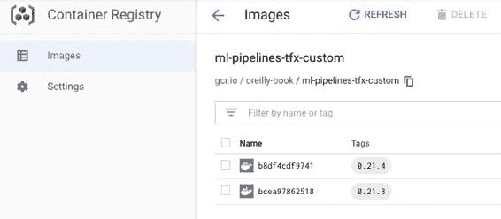

# 附录 C. 操作 Kubeflow Pipelines 的提示

当您使用 Kubeflow Pipelines 操作您的 TFX 管道时，您可能希望自定义 TFX 组件的底层容器映像。如果您的组件依赖于 TensorFlow 和 TFX 软件包之外的其他 Python 依赖项，则需要自定义 TFX 映像。在我们的演示管道中，我们有一个额外的 Python 依赖项，即 TensorFlow Hub 库，用于访问我们的语言模型。

在本附录的后半部分，我们希望向您展示如何在本地计算机和持久卷之间传输数据。如果可以通过云存储提供程序访问数据（例如使用本地 Kubernetes 集群），持久卷设置非常有用。提供的步骤将指导您完成在集群中复制数据的过程。

自定义 TFX 映像

在我们的示例项目中，我们使用 TensorFlow Hub 提供的语言模型。我们使用`tensorflow_hub`库来高效加载语言模型。这个特定的库不包含在原始的 TFX 映像中，因此我们需要构建一个带有所需库的自定义 TFX 映像。如果您计划使用自定义组件，比如我们在第十章讨论的组件，情况也是如此。

幸运的是，正如我们在附录 A 中讨论的那样，Docker 映像可以轻松构建。以下 Dockerfile 显示了我们的自定义映像设置：

> `FROM` `tensorflow/tfx:0.22.0``RUN` `python3.6 -m pip install` `"tensorflow-hub"``RUN` `...` `ENTRYPOINT` `["python3.6", "/tfx-src/tfx/scripts/run_executor.py"]` 


> > 安装所需的软件包。


> > 如有需要，请安装额外的包。


> > 不要更改容器的入口点。

我们可以轻松地将标准 TFX 映像作为自定义映像的基础。为了避免 TFX API 的突然更改，我们强烈建议将基础映像的版本固定到特定的构建版本（例如 tensorflow/tfx:0.22.0），而不是常见的`latest`标签。TFX 映像基于 Ubuntu Linux 分发，并预装有 Python。在我们的情况下，我们可以简单地为 TensorFlow Hub 模型安装额外的 Python 包。

提供与基础映像配置的相同入口点非常重要。Kubeflow Pipelines 期望入口点将触发组件的执行程序。

定义了 Docker 映像之后，我们可以构建并推送映像到容器注册表。可以是 AWS Elastic、GCP 或 Azure 容器注册表。确保运行的 Kubernetes 集群可以从容器注册表中拉取映像并具有对私有容器的权限非常重要。在下面的代码中，我们展示了 GCP 容器注册表的这些步骤：

> `$` `export` `TFX_VERSION``=``0.22.0` `$` `export` `PROJECT_ID``=``<``your gcp project id``>` `$` `export` `IMAGE_NAME``=``ml-pipelines-tfx-custom` `$` `gcloud auth configure-docker` `$` `docker build pipelines/kubeflow_pipelines/tfx-docker-image/.` `\` `    -t gcr.io/``$PROJECT_ID``/``$IMAGE_NAME``:``$TFX_VERSION``$` `docker push gcr.io/``$PROJECT_ID``/``$IMAGE_NAME``:``$TFX_VERSION`

一旦构建的镜像上传完成，您可以在云提供商的容器注册表中看到可用的镜像，如 图 C-1 所示。

> 特定组件图像
> 
> 在撰写本文时，还不能为特定组件容器定义自定义图像。目前，所有组件的要求都需要包含在图像中。不过，目前正在讨论允许将来使用特定组件图像的提案。



图 C-1\. 谷歌云的容器注册表

现在，我们可以在 Kubeflow Pipelines 设置中的所有 TFX 组件中使用这个容器镜像。

通过持久卷交换数据

正如我们之前讨论的，我们需要提供容器以挂载文件系统，以便在容器文件系统之外的位置读取和写入数据。在 Kubernetes 世界中，我们可以通过持久卷（PV）和持久卷声明（PVC）来挂载文件系统。简单来说，我们可以为 Kubernetes 集群内提供一个驱动器，并在其内部索取该文件系统的全部或部分空间。

您可以通过我们在 “Kubeflow Pipelines 的持久卷设置” 中提供的 Kubernetes 配置来设置这些 PV。如果您希望使用此设置，您需要在云提供商（例如 AWS 弹性块存储或 GCP 块存储）中创建一个磁盘。在下面的示例中，我们创建了一个名为 tfx-pv-disk 的大小为 20 GB 的磁盘驱动器：

> `$` `export` `GCP_REGION``=``us-central1-c` `$` `gcloud compute disks create tfx-pv-disk --size``=``20Gi --zone``=``$GCP_REGION`

现在，我们可以为 Kubernetes 集群中的 PV 提供磁盘。以下 `kubectl` 命令将帮助进行提供：

> `$` `kubectl apply -f` `"https://github.com/Building-ML-Pipelines/"``\``"building-machine-learning-pipelines/blob/master/pipelines/"``\``"kubeflow_pipelines/kubeflow-config/storage.yaml"``$` `kubectl apply -f` `"https://github.com/Building-ML-Pipelines/"``\``"building-machine-learning-pipelines/blob/master/pipelines/"``\``"kubeflow_pipelines/kubeflow-config/storage-claim.yaml"`

完成提供后，您可以通过调用 `kubectl get pvc` 来检查执行是否成功，如下例所示：

> `$` `kubectl -n kubeflow get pvc NAME             STATUS   VOLUME    CAPACITY   ACCESS MODES   STORAGECLASS   AGE tfx-pvc          Bound    tfx-pvc   20Gi       RWO            manual         2m`

Kubernetes 的 `kubectl` 提供了一个便捷的 `cp` 命令，用于将数据从我们的本地机器复制到远程 PV。为了复制流水线数据（例如，用于转换和训练步骤的 Python 模块以及训练数据），我们需要将卷挂载到 Kubernetes pod。对于复制操作，我们创建了一个简单的应用程序，基本上只是空闲状态，并允许我们访问 PV。您可以使用以下 kubectl 命令创建 pod：

> `$` `kubectl apply -f` `"https://github.com/Building-ML-Pipelines/"``\``"building-machine-learning-pipelines/blob/master/pipelines/"``\``"kubeflow_pipelines/kubeflow-config/storage-access-pod.yaml"`

pod `data-access` 将挂载 PV，然后我们可以创建必要的文件夹并将所需数据复制到卷中：

> `$` `export` `DATA_POD``=``` ` ```kubectl -n kubeflow get pods -o name` `|` `grep data-access``` ` ```$` `kubectl -n kubeflow` `exec``$DATA_POD` `-- mkdir /tfx-data/data` `$` `kubectl -n kubeflow` `exec``$DATA_POD` `-- mkdir /tfx-data/components` `$` `kubectl -n kubeflow` `exec``$DATA_POD` `-- mkdir /tfx-data/output`
> 
> `$` `kubectl -n kubeflow cp` `\` `../building-machine-learning-pipelines/components/module.py` `\``${``DATA_POD``#*/``}``:/tfx-data/components/module.py` `$` `kubectl -n kubeflow cp` `\` `../building-machine-learning-pipelines/data/consumer_complaints.csv` `${``DATA_POD``#*/``}``:/tfx-data/data/consumer_complaints.csv`

在所有数据传输到 PV 后，您可以通过运行以下命令删除 `data-access` pod：

> `$` `kubectl delete -f` `\` `pipelines/kubeflow_pipelines/kubeflow-config/storage-access-pod.yaml`

`cp` 命令也适用于反向操作，如果您想将从 Kubernetes 集群导出的模型复制到集群外的其他位置。

TFX 命令行界面

TFX 提供了一个 CLI 来管理您的 TFX 项目及其编排运行。该 CLI 工具为您提供了 TFX 模板，预定义的文件夹和文件结构。使用提供的文件夹结构的项目可以通过 CLI 工具管理，而不是通过 Web UI（在 Kubeflow 和 Airflow 的情况下）。它还集成了 Skaffold 库来自动创建和发布自定义 TFX 映像。

> TFX CLI 正在积极开发中
> 
> 在撰写本节时，TFX CLI 正在积极开发中。命令可能会更改或添加更多功能。此外，未来可能会提供更多的 TFX 模板。

TFX 和其依赖项

TFX CLI 需要 Kubeflow Pipelines SDK 和 [Skaffold](https://skaffold.dev)，这是一个用于持续构建和部署 Kubernetes 应用程序的 Python 工具。

如果您尚未安装或更新来自 Kubeflow Pipelines 的 TFX 和 Python SDK，请运行以下两个 `pip install` 命令：

> `$` `pip install -U tfx` `$` `pip install -U kfp`

Skaffold 的安装取决于您的操作系统：

Linux

> > `$` `curl -Lo skaffold` `\` `https://storage.googleapis.com/``\` `skaffold/releases/latest/skaffold-linux-amd64` `$` `sudo install skaffold /usr/local/bin/`

MacOS

> > `$` `brew install skaffold`

Windows

> > `$` `choco install -y skaffold`

安装 Skaffold 后，请确保将工具的执行路径添加到执行 TFX CLI 工具的终端环境的 `PATH` 中。以下是 Linux 用户如何将 Skaffold 路径添加到其 `PATH` bash 变量的示例：

> `$` `export` `PATH``=``$PATH``:/usr/local/bin/`

在讨论如何使用 TFX CLI 工具之前，让我们简要讨论一下 TFX 模板。

TFX 模板

TFX 提供了项目模板，用于组织机器学习流水线项目。这些模板提供了预定义的文件夹结构，以及特征、模型和预处理定义的蓝图。以下 `tfx template copy` 命令将下载 TFX 项目的出租车示例项目：

> `$` `export` `PIPELINE_NAME``=``"customer_complaint"``$` `export` `PROJECT_DIR``=``$PWD``/``$PIPELINE_NAME``$` `tfx template copy --pipeline-name``=``$PIPELINE_NAME``\` `--destination-path``=``$PROJECT_DIR``\` `--model``=``taxi`

当复制命令完成执行后，您可以找到如下所示的文件夹结构：

> `$` `tree . . ├── __init__.py ├── beam_dag_runner.py ├── data │   └── data.csv ├── data_validation.ipynb ├── kubeflow_dag_runner.py ├── model_analysis.ipynb ├── models │   ├── __init__.py │   ├── features.py │   ├── features_test.py │   ├── keras │   │   ├── __init__.py │   │   ├── constants.py │   │   ├── model.py │   │   └── model_test.py │   ├── preprocessing.py │   └── preprocessing_test.py ├── pipeline │   ├── __init__.py │   ├── configs.py │   └── pipeline.py └── template_pipeline_test.tar.gz`

我们采用了出租车模板 1，并调整了我们的书籍示例项目以匹配该模板。结果可以在 [书籍的 GitHub 仓库](https://oreil.ly/bmlp-git) 中找到。如果您想跟随这个示例，请将 CSV 文件 consumer_complaints.csv 复制到文件夹中：

> `$pwd``/``$PIPELINE_NAME``/data`

还要双重检查定义了 GCS 桶和其他流水线细节的 pipelines/config.py 文件。使用您创建的或通过 GCP 的 AI 平台创建 Kubeflow Pipelines 安装时创建的 GCS 桶路径更新。您可以使用以下命令找到路径：

> `$ gsutil -l`

使用 TFX CLI 发布您的流水线

我们可以将基于 TFX 模板创建的 TFX 管道发布到我们的 Kubeflow Pipelines 应用程序。要访问我们的 Kubeflow Pipelines 设置，我们需要定义我们的 GCP 项目、TFX 容器镜像的路径以及我们的 Kubeflow Pipelines 端点的 URL。在“访问您的 Kubeflow Pipelines 安装”中，我们讨论了如何获取端点 URL。在使用 TFX CLI 发布我们的管道之前，让我们为我们的示例设置所需的环境变量：

> `$` `export` `PIPELINE_NAME``=``"<``pipeline name``>"``$` `export` `PROJECT_ID``=``"<``your gcp project id``>"``$` `export` `CUSTOM_TFX_IMAGE``=``gcr.io/``$PROJECT_ID``/tfx-pipeline` `$` `export` `ENDPOINT``=``"``<id>-dot-<region>``.pipelines.googleusercontent.com"`

定义好详细信息后，我们现在可以通过 TFX CLI 创建管道，命令如下：

> `$` `tfx pipeline create --pipeline-path``=``kubeflow_dag_runner.py` `\` `--endpoint``=``$ENDPOINT``\` `--build-target-image``=``$CUSTOM_TFX_IMAGE`

`tfx pipeline create` 命令会执行各种操作。通过 Skaffold 的帮助，它创建一个默认的 Docker 镜像，并通过 Google Cloud Registry 发布容器镜像。正如我们在第十二章中讨论的那样，它还运行 Kubeflow Runner，并上传 Argo 配置到管道端点。命令执行完成后，在模板文件夹结构中会找到两个新文件：Dockerfile 和 build.yaml。

Dockerfile 包含一个与我们在“自定义 TFX 镜像”中讨论过的 Dockerfile 类似的镜像定义。build.yaml 文件配置 Skaffold，并设置了 docker 镜像注册表的详细信息和标签策略。

您现在可以在您的 Kubeflow Pipelines UI 中看到注册的管道。您可以使用以下命令启动管道运行：

> `$` `tfx run create --pipeline-name``=``$PIPELINE_NAME``\` `--endpoint``=``$ENDPOINT` `创建管道运行：customer_complaint_tfx 检测到 Kubeflow。如果您打算使用不同的编排器，请使用--engine 标志。为 pipeline: customer_complaint_tfx 创建运行：customer_complaint_tfx +------------------------+----------+----------+---------------------------+` `|` `pipeline_name` `|` `run_id` `|` `status` `|` `created_at` `|` `+``========================``+``==========``+``==========``+``===========================``+` `|` `customer_complaint_tfx` `|` `<run-id>` `|``|` `2020-05-31T21:30:03+00:00` `|` `+------------------------+----------+----------+---------------------------+`

你可以使用以下命令检查管道运行的状态：

> `$` `tfx run status --pipeline-name``=``$PIPELINE_NAME``\` `--endpoint``=``$ENDPOINT``\` `--run_id <run_id>  列出管道运行的所有运行：customer_complaint_tfx +------------------------+----------+------------+---------------------------+`

可以使用以下命令获取给定管道的所有运行列表：

> `$` `tfx run list --pipeline-name``=``$PIPELINE_NAME``\` `--endpoint``=``$ENDPOINT` `列出管道运行的所有运行：customer_complaint_tfx +------------------------+----------+------------+---------------------------+`
> 
> 停止和删除管道运行
> 
> 您可以使用 `tfx run terminate` 命令停止管道运行。可以使用 `tfx run delete` 删除管道运行。

TFX CLI 是 TFX 工具链中非常有用的工具。它不仅支持 Kubeflow Pipelines，还支持 Apache Airflow 和 Apache Beam 编排器。

> 1   在撰写本文时，这是唯一可用的模板。
