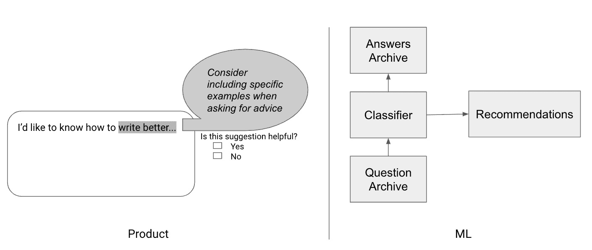

# 第一部分：寻找正确的 ML 方法

大多数个人或公司都清楚地知道他们有兴趣解决的问题，例如预测哪些客户会离开在线平台或构建一个可以在用户滑雪时跟随用户的无人机。同样，大多数人可以迅速学习如何训练模型以合理的准确率分类客户或检测对象，只需给定一个数据集。

然而，更少见的是能够将问题提出，估计如何最好地解决它，制定使用 ML 来解决它的计划，并自信地执行该计划。这通常是通过经验学习的技能，在多个过于雄心勃勃的项目和未能按期完成的情况下学习。

对于一个特定的产品，存在许多潜在的 ML 解决方案。在图 I-1 中，您可以看到左侧的一个潜在写作助手工具的草图，其中包括建议和用户提供反馈的机会。图像的右侧是一个潜在 ML 方法的图表，用于提供此类建议。

###### 图 I-1. 从产品到 ML

本节首先涵盖了这些不同的潜在方法，以及如何选择其中之一的方法。然后深入探讨了如何将模型的性能指标与产品需求调和。

为了做到这一点，我们将处理两个连续的主题：

第一章

在本章结束时，您将能够提出一个应用程序的想法，估计是否可能解决，确定是否需要 ML 来解决，并找出从哪种类型的模型开始是最合理的。

第二章

在本章中，我们将讨论如何在您应用程序的目标背景下准确评估您的模型的性能，以及如何利用这一指标定期取得进展。
