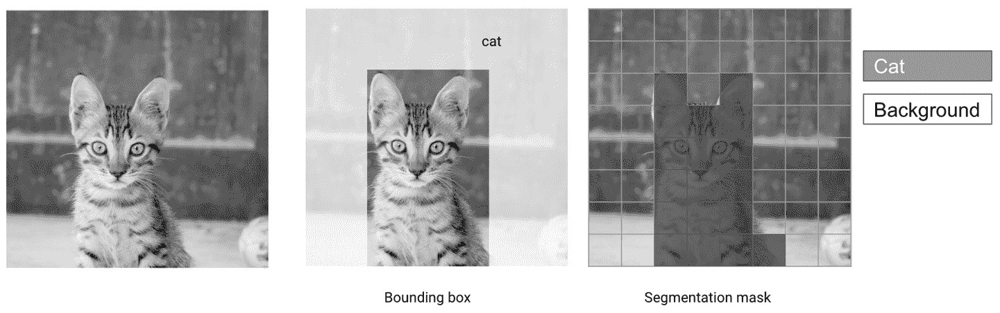

# 第一章：从产品目标到 ML 框架

机器学习允许机器从数据中学习，并以概率方式行事，以解决优化特定目标的问题。这与传统编程相对立，传统编程中程序员会编写逐步说明如何解决问题。这使得机器学习特别适合于*构建我们无法定义启发式解决方案的系统*。

图 1-1 描述了编写检测猫的系统的两种方法。在左侧，一个程序由手动编写的过程组成。在右侧，机器学习方法利用带有相应动物标签的猫和狗的照片数据集，允许模型学习从图像到类别的映射。在机器学习方法中，没有规定结果应该如何实现，只有一组示例输入和输出。

###### 图 1-1\. 从定义过程到展示示例

机器学习（ML）非常强大，可以解锁全新的产品，但由于它基于模式识别，所以引入了一定程度的不确定性。重要的是要确定产品的哪些部分会从 ML 中受益，并且如何框定学习目标，以最小化用户体验差的风险。

例如，对于人类来说，根据像素值自动检测图像中的动物并写出逐步说明几乎是不可能的（并且极其耗时）。然而，通过向卷积神经网络（CNN）输入成千上万张不同动物的图像，我们可以构建一个比人类更准确地进行分类的模型。这使得用机器学习解决这种问题变得很有吸引力。

另一方面，自动计算您的税款的应用程序应依赖政府提供的指南。正如您可能已经听说的那样，税务申报错误通常是不受欢迎的。这使得使用机器学习自动生成税务申报存在一定的风险。

当您可以通过一组可管理的确定性规则解决问题时，您永远不希望使用机器学习。在这里，可管理意味着您可以自信地编写这些规则，并且不会因维护过于复杂而困扰。

因此，虽然机器学习为不同的应用领域开辟了新世界，但重要的是要考虑哪些任务*可以*和*应该*通过机器学习来解决。在构建产品时，您应该从一个具体的业务问题出发，确定是否需要机器学习，然后努力找到一种机器学习方法，使您能够尽快迭代。

我们将在本章中详细介绍这个过程，首先介绍估算哪些任务可以通过机器学习解决，哪些机器学习方法适合哪些产品目标，以及如何处理数据需求。我将通过我们在“我们的案例研究：ML 辅助写作”中提到的 ML 编辑器案例研究以及与 Monica Rogati 的一次采访来说明这些方法。

# 评估可能性

由于机器学习模型能够处理任务而无需人类提供逐步指导，这意味着它们能够比人类专家更好地执行一些任务（例如从放射影像中检测肿瘤或打围棋），以及一些对人类完全无法接触的任务（例如从数百万篇文章中推荐文章或更改说话者的声音以听起来像其他人）。

机器学习能够直接从数据中学习使其在广泛的应用领域中非常有用，但这也使人们更难准确地区分哪些问题可以通过机器学习来解决。在每篇发表在研究论文或公司博客上的成功结果背后，都有数百个听起来合理但却彻底失败的想法。

虽然目前没有确切的方法可以预测机器学习的成功，但有一些指导原则可以帮助您减少处理机器学习项目所涉及的风险。最重要的是，您应始终以产品目标为出发点，然后决定如何最好地解决它。在此阶段，要对任何方法持开放态度，无论是需要机器学习还是不需要。在考虑机器学习方法时，务必根据它们对产品的适用性来评估这些方法，而不仅仅是考虑方法本身是否有趣。

最佳方法是通过以下两个连续步骤来完成：(1) 将您的产品目标构建成一个机器学习范式，以及 (2) 评估该机器学习任务的可行性。根据您的评估结果，您可以重新调整您的构建，直到我们满意为止。让我们探讨一下这些步骤的实际含义。

1.  *在机器学习范式中构建产品目标：* 当我们构建一个产品时，我们首先考虑要向用户提供什么样的服务。正如我们在介绍中提到的那样，我们将通过一个案例研究来说明本书中的概念，即一款帮助用户更好地提出问题的编辑器。这个产品的目标很明确：我们希望用户在他们写作的内容上获得可操作和有用的建议。然而，机器学习问题的构建方式完全不同。一个机器学习问题涉及*从数据中学习函数*。一个例子是学习将一种语言的句子输入并输出为另一种语言的句子。对于一个产品目标，通常会有许多不同的机器学习表述，其实施难度各不相同。

1.  *评估机器学习可行性：* 所有机器学习问题并非一视同仁！随着我们对机器学习的理解逐步深入，例如正确分类猫和狗的照片的模型构建问题已经能够在几小时内解决，而创建能够进行对话的系统等问题则仍然是开放性研究问题。要高效地构建机器学习应用程序，重要的是考虑多种潜在的机器学习框架，并从我们认为最简单的开始。评估机器学习问题难度的最佳方法之一是查看它所需的数据类型以及可以利用该数据的现有模型。

要提出不同的框架建议并评估其可行性，我们应该检查机器学习问题的两个核心方面：数据和模型。

我们将从模型开始。

## 模型

在机器学习中有许多常用的模型，我们将在此不进行全部概述。您可以参考“附加资源”中列出的书籍，以获取更全面的概述。除了常见模型外，每周都会发布许多模型变体、新颖架构和优化策略。仅在 2019 年 5 月，就有超过 13,000 篇论文被提交到[ArXiv](https://arxiv.org)，这是一个流行的电子研究存档，经常有关于新模型的论文被提交。

然而，分享不同类别模型的概述及其在不同问题中的应用是很有用的。为此，我在这里提出了一个简单的模型分类法，根据它们处理问题的方式。您可以将其作为选择解决特定机器学习问题方法的指南。由于模型和数据在机器学习中密切相关，您会注意到这一部分与“数据类型”存在一些重叠。

机器学习算法可以根据是否需要标签进行分类。在这里，标签指的是数据中一个理想输出的存在，模型应该为给定示例产生该输出。监督算法利用包含输入标签的数据集，并旨在学习从输入到标签的映射。另一方面，无监督算法则不需要标签。最后，弱监督算法利用并非完全符合期望输出但在某种程度上类似的标签。

许多产品目标可以通过监督和无监督算法来解决。例如，可以通过训练模型检测与平均交易不同的交易来构建欺诈检测系统，这不需要标签。此类系统也可以通过手动标记交易为欺诈或合法，并训练模型从这些标签中学习来构建。

对于大多数应用程序，监督方法更容易验证，因为我们可以访问标签来评估模型预测的质量。 这也使得训练模型变得更容易，因为我们可以访问所需的输出。 虽然创建带标签的数据集有时可能最初耗时，但这使得构建和验证模型变得更加容易。 因此，本书大部分内容将涵盖监督方法。

话虽如此，确定您的模型将接受哪种类型的输入和产生哪些输出将有助于显著缩小可能的方法。 根据这些类型，以下任何 ML 方法类别都可能是一个很好的选择：

+   分类和回归

+   知识提取

+   目录组织

+   生成模型

我将在以下部分进一步展开。 当我们探索这些不同的建模方法时，我建议考虑您可以使用或可以收集的数据类型。 数据可用性通常最终成为模型选择的限制因素。

### 分类和回归

一些项目的重点是有效地在两个或多个类别之间分类数据点，或者在连续尺度上为它们赋予一个值（称为*回归*而不是*分类*）。 回归和分类在技术上是不同的，但通常处理它们的方法有显著的重叠，因此我们在这里将它们放在一起。

分类和回归之间相似的原因之一是大多数分类模型输出一个模型属于某一类别的概率分数。 然后，分类方面归结为根据这些分数决定如何将对象归因于类别。 从高层次来看，因此分类模型可以被看作是对概率值的回归。

通常，我们对单个示例进行分类或评分，例如将每封电子邮件分类为有效或垃圾的垃圾邮件过滤器，将用户分类为欺诈或合法的欺诈检测系统，或将骨骼分类为骨折或健康的计算机视觉放射学模型。

在 图 1-2 中，您可以看到一个根据其情感和主题对句子进行分类的示例。

###### 图 1-2\. 将句子分类为多个类别

在回归项目中，与为每个示例分配一个类别不同，我们给它们一个值。 根据诸如房间数量和位置等属性预测房屋销售价格是回归问题的一个示例。

在某些情况下，我们可以访问一系列过去的数据点（而不是单个数据点）来预测未来的事件。这种类型的数据通常称为*时间序列*，从一系列数据点中进行预测被称为*预测*。时间序列数据可以代表患者的医疗历史或国家公园的一系列出勤测量。这些项目通常受益于可以利用这种增加的时间维度的模型和特征。

在其他情况下，我们尝试从数据集中检测异常事件。这被称为*异常检测*。当分类问题试图检测代表数据中小部分的事件时，因此很难准确检测到时，通常需要使用不同的方法集。这里用“从大数据集中找出一个小东西”来形容很贴切。

良好的分类和回归工作通常需要进行重要的特征选择和特征工程工作。特征选择包括识别具有最高预测价值的特征子集。特征生成是通过修改和组合数据集的现有特征来识别和生成目标的良好预测器的任务。我们将在第三部分更深入地讨论这两个主题。

近年来，深度学习表现出了自动从图像、文本和音频中生成有用特征的良好能力。未来，它可能在简化特征生成和选择方面发挥更大作用，但目前它们仍然是机器学习工作流的重要部分。

最后，我们通常可以在前述分类或评分的基础上提供有用的建议。这需要建立一个可解释的分类模型，并利用其特征生成可操作的建议。稍后会详细讨论这一点！

并非所有问题都旨在为示例归因一组类别或值。在某些情况下，我们希望在更细粒度的级别上操作，并从输入的部分提取信息，比如知道图片中的物体位置。

### 从非结构化数据中提取知识

*结构化数据*是以表格格式存储的数据。数据库表和 Excel 表格是结构化数据的好例子。*非结构化数据*指的是不以表格格式存储的数据集。这包括文本（来自文章、评论、维基百科等）、音乐、视频和歌曲。

在图 1-3 中，您可以看到左侧是结构化数据的示例，右侧是非结构化数据的示例。知识提取模型专注于通过机器学习从非结构化数据源中提取结构。

在文本的情况下，知识提取可用于为评论添加结构。可以训练模型来从评论中提取例如清洁度、服务质量和价格等方面。用户随后可以轻松访问提及他们感兴趣主题的评论。

###### Figure 1-3\. 结构化和非结构化数据的示例类型

在医疗领域，知识提取模型可以被建立为接受医学论文中的原始文本作为输入，并提取诸如论文讨论的疾病、相关的诊断及其性能等信息。在 Figure 1-4 中，一个模型以句子作为输入，并提取哪些词语指代媒体类型以及哪些词语指代媒体的标题。例如，在粉丝论坛的评论中使用这样的模型，我们可以生成关于经常被讨论的电影的摘要。

###### Figure 1-4\. 从句子中提取媒体类型和标题

对于图像，知识提取任务通常包括在图像中找到感兴趣的区域并对其进行分类。两种常见的方法如 Figure 1-5 所示：对象检测是一种粗略的方法，它涉及在感兴趣的区域周围绘制矩形（称为*边界框*），而分割则精确地将图像的每个像素归属到特定的类别。

###### Figure 1-5\. 边界框和分割掩模

有时，这些提取的信息可以作为另一个模型的输入。例如，使用姿势检测模型从瑜伽视频中提取关键点，并将这些关键点馈送给第二个模型，根据标记数据对姿势进行分类。Figure 1-6 展示了这样一系列模型的示例。第一个模型从非结构化数据（照片）中提取结构化信息（关节坐标），第二个模型则接受这些坐标并将其分类为瑜伽姿势。

###### Figure 1-6\. 瑜伽姿势检测

到目前为止，我们看到的模型主要关注于根据给定输入生成输出。在某些情况下，例如搜索引擎或推荐系统，产品的目标是展示相关的项目。这是我们将在下一个类别中讨论的内容。

### 目录组织

目录组织模型通常会生成一组结果供用户查看。这些结果可以基于键入搜索栏中的输入字符串、上传的图像或对家庭助手说的短语进行条件设定。在许多情况下，例如流媒体服务，这些结果也可以主动呈现给用户，作为他们可能喜欢的内容，而不需要他们发出任何请求。

Figure 1-7 展示了这样一个系统的示例，它基于用户刚刚观看的电影主动提供潜在的候选电影，而无需用户进行任何形式的搜索。

###### Figure 1-7\. 电影推荐

因此，这些模型要么*推荐*与用户已经表达兴趣的物品相关的物品（例如类似的 Medium 文章或 Amazon 产品），要么提供一个有用的*搜索*目录的方式（允许用户通过键入文本或提交他们自己的照片来搜索物品）。

这些推荐通常基于从先前用户模式学习的经验，这种情况下称为*协同*推荐系统。有时，它们基于物品的特定属性，这种情况下称为*基于内容*的推荐系统。一些系统结合了协同和基于内容的方法。

最后，机器学习也可以用于创造性目的。模型可以学习生成审美良好的图像、音频，甚至有趣的文本。这样的模型被称为生成模型。

### 生成模型

生成模型专注于生成数据，可能依赖于用户输入。因为这些模型侧重于生成数据而不是分类、评分、提取信息或组织信息，它们通常具有广泛的输出。这意味着生成模型非常适合像翻译这样输出多样的任务。

另一方面，生成模型通常用于训练和输出不受限制的情况，这使得它们成为生产中更具风险的选择。因此，除非它们对实现目标必不可少，否则建议首先使用其他模型。然而，对于希望深入了解生成模型的读者，我推荐 David Foster 的书籍[*Generative Deep Learning*](https://learning.oreilly.com/library/view/generative-deep-learning/9781492041931/)。

实际的例子包括翻译，将一种语言中的句子映射到另一种语言；摘要生成；字幕生成，将视频和音轨映射到文本；以及神经风格转移（参见[Gatys 等，“艺术风格的神经算法”](https://oreil.ly/XVwMs)），将图像映射到风格化的再现。

图 1-8 展示了一个生成模型的例子，通过给左侧的照片赋予与右侧小插图中的绘画类似风格的转换。

###### 图 1-8 的风格转移示例来自[Gatys 等，“艺术风格的神经算法”](https://oreil.ly/XVwMs)。

如您所见，每种类型的模型都需要不同类型的训练数据。通常情况下，模型的选择很大程度上取决于您能够获取的数据，因为数据的可用性通常决定了模型的选择。

让我们来看几种常见的数据情景及其关联的模型。

## 数据

监督机器学习模型利用数据中的模式来学习输入和输出之间有用的映射关系。如果数据集包含预测目标输出的特征，适当的模型应该能够从中学习。然而，大多数情况下，我们最初没有正确的数据来训练模型从头到尾解决产品使用案例。

例如，假设我们正在训练一个*语音识别*系统，它将监听客户的请求，理解他们的意图，并根据该意图执行操作。当我们开始这个项目时，我们可以定义一组我们希望理解的意图，比如“在电视上播放电影”。

要训练一个能够完成此任务的机器学习模型，我们需要有一个包含来自各种背景的用户的音频剪辑的数据集，这些用户用自己的术语请求系统播放电影。拥有代表性的输入集合至关重要，因为任何模型只能从我们提供给它的数据中学习。如果数据集仅包含某一人群的示例，产品将只对该人群有用。考虑到我们选择的专业领域，因此几乎不可能已经存在这样的示例数据集。

对于大多数我们想要解决的应用程序，我们需要搜索、策划和收集额外的数据。数据获取过程的范围和复杂性可能因项目的具体情况而异，提前估计面临的挑战是成功的关键。

首先，让我们定义一些在搜索数据集时可能遇到的不同情况。这个初始情况应该是决定如何继续的关键因素。

### 数据类型

一旦我们把问题定义为*将输入映射到输出*，我们可以搜索遵循此映射的数据来源。

对于欺诈检测，这些可能是欺诈和无辜用户的示例，以及他们账户的特征，我们可以用来预测他们的行为。对于翻译，这将是源语言和目标语言领域的句子对语料库。对于内容组织和搜索，这可能是过去搜索和点击的历史记录。

我们很少能找到我们正在寻找的确切映射。因此，考虑几种不同情况是有用的。把这看作是数据需求的层次结构。

### 数据可用性

大致有三个数据可用性级别，从最理想的情况到最具挑战性的情况。不幸的是，与大多数其他任务一样，通常可以假设最有用的数据类型最难找到。让我们详细讨论一下。

标记数据存在

这是图 1-9 中最左侧的类别。在处理监督模型时，找到一个*标记数据集*是每个从业者的梦想。这里的“标记”意味着许多数据点包含模型试图预测的目标值。这使得训练和评估模型质量变得更加容易，因为标签提供了真实的答案。在实践中，很难找到一个符合你需求并且在网上免费获取的标记数据集。然而，常见的情况是你可能会把你找到的数据集误认为是你所需要的数据集。

存在弱标记数据

这是图 1-9 中间的类别。一些数据集包含的标签与建模目标不完全一致，但与之相关。例如，音乐流媒体服务的回放和跳过历史是一个弱标记的数据集示例，用于预测用户是否不喜欢一首歌曲。虽然听众可能没有标记一首歌曲为不喜欢，但如果他们在播放时跳过了它，这表明他们可能不喜欢这首歌。弱标签按定义不够精确，但通常比完美标签更容易找到。

存在无标记数据

这是图 1-9 中右侧的类别。在某些情况下，虽然我们没有一个将期望输入映射到输出的标记数据集，但我们至少可以访问一个包含相关示例的数据集。以文本翻译为例，我们可能可以访问大量的文本集合，涵盖两种语言，但它们之间没有直接的映射。这意味着我们需要标记数据集，找到能够从无标记数据中学习的模型，或者两者兼而有之。

我们需要获取数据

在某些情况下，我们离无标记数据只有一步之遥，因为我们首先需要获取它。在许多情况下，我们没有我们所需的数据集，因此需要找到一种获取这些数据的方法。这通常被视为一项难以克服的任务，但现在存在许多快速收集和标记数据的方法。这将是第四章的重点。

对于我们的案例研究，一个理想的数据集将是一组用户提出的问题，以及一组更好的措辞问题。一个*弱标记*的数据集将是包含许多问题并带有一些弱标签，表明它们质量的数据集，例如“喜欢”或“点赞”。这将有助于模型学习什么是好问题和坏问题，但不提供相同问题的并列示例。你可以在图 1-9 中看到这两个例子。

###### 图 1-9\. 数据可用性与数据有用性

通常情况下，在机器学习中，弱标记数据集指的是包含可以帮助模型学习的信息，但不是精确的真实标签的数据集。实际上，我们可以收集到的大多数数据集都是弱标记的。

拥有一个不完美的数据集是完全可以接受的，不应该阻止你。ML 过程是迭代的，所以从一个数据集开始并获得一些初步结果是前进的最佳方式，无论数据质量如何。

### 数据集是迭代的

在许多情况下，由于您可能无法立即找到一个直接映射从输入到所需输出的数据集，我建议逐步迭代问题的表述方式，使得更容易找到一个足够的数据集作为起点。您探索和使用的每个数据集都将为您提供宝贵的信息，您可以利用这些信息策划下一个版本的数据集，并为您的模型生成有用的特征。

现在让我们深入案例研究，看看我们如何利用所学知识识别不同的模型和数据集，并选择最合适的。

# 构建 ML 编辑器

让我们看看如何通过一个产品用例的迭代来找到正确的 ML 框架。我们将通过概述从产品目标（帮助用户写出更好问题）到 ML 范式的方法来完成这一过程。

我们想要建立一个编辑器，接受用户的问题并改进它们，使其写作更好，但在这种情况下，“更好”是什么意思呢？让我们从更清晰地定义写作助手的产品目标开始。

许多人使用论坛、社交网络和网站如[Stack Overflow](https://stackoverflow.com/)来寻找答案。然而，人们提问的方式对于是否能得到有用的答案有着巨大的影响。这对于希望得到他们问题答案的用户和可能有相同问题的未来用户都是不利的。因此，我们的目标是*构建一个助手，可以帮助用户写出更好的问题*。

现在我们有了一个产品目标，需要决定使用哪种建模方法。为了做出这个决定，我们将进行前面提到的模型选择和数据验证的迭代循环。

## 尝试使用 ML 来做所有事情：一个端到端的框架

在这个背景下，*端到端*意味着使用单一模型从输入到输出，没有中间步骤。由于大多数产品目标非常具体，尝试通过端到端学习整个用例通常需要定制的尖端 ML 模型。这可能是那些有能力开发和维护这些模型的团队的正确解决方案，但通常最好先从更为成熟的模型开始。

在我们的情况下，我们可以尝试收集一个问题表述不佳及其专业编辑版本的数据集。然后，我们可以使用生成模型直接从一个文本生成另一个文本。

图 1-10 展示了这在实践中的样子。它显示了一个简单的图表，左侧是用户输入，右侧是期望的输出，中间是一个模型。

###### 图 1-10\. 端到端方法

如你所见，这种方法存在着显著的挑战：

数据

要获取这样的数据集，我们需要找到意图相同但措辞不同的问题对。这种数据集很难找到。自行构建将会很昂贵，因为我们需要专业编辑的帮助来生成这些数据。

模型

从一段文本到另一段文本的模型，如前面讨论的生成模型类别中所见，近年来取得了巨大进展。序列到序列模型（如 I. Sutskever 等人在 [“Sequence to Sequence Learning with Neural Networks”](https://arxiv.org/abs/1409.3215) 论文中描述的那样）最初是 2014 年提出用于翻译任务，并且正在缩小机器翻译与人类翻译之间的差距。然而，这些模型的成功主要集中在句子级任务上，并且它们并不经常用于处理比段落更长的文本。这是因为迄今为止，它们尚未能够从一段到另一段捕捉长期上下文。此外，由于它们通常具有大量参数，它们是训练速度最慢的模型之一。如果一个模型只需要训练一次，这并不一定是问题。但如果它需要每小时或每天重新训练，训练时间可能会成为一个重要因素。

延迟

序列到序列模型通常是*自回归模型*，这意味着它们需要上一个词的模型输出来开始处理下一个词。这使它们能够利用邻近词的信息，但导致它们在训练和推理时比更简单的模型要慢。这样的模型可能需要几秒钟来在推理时生成答案，而简单模型的延迟则为亚秒级。虽然可以优化这样的模型以使其运行速度足够快，但这将需要额外的工程工作。

实施的便利性

训练复杂的端到端模型是一个非常微妙且容易出错的过程，因为它们有许多移动部件。这意味着我们需要考虑模型潜在性能与其为流水线增加的复杂性之间的权衡。这种复杂性在构建流水线时会减慢我们的速度，同时也会增加维护负担。如果我们预期其他团队成员可能需要对您的模型进行迭代和改进，选择一组更简单、更为人熟知的模型可能是值得的。

这种端到端方法可能有效，但需要大量的前期数据收集和工程努力，并不能保证成功，因此探索其他替代方案是值得的，接下来我们将介绍。

## 最简单的方法：成为算法

正如您将在本节末尾的采访中看到的，对于数据科学家来说，*成为算法*通常是一个很好的想法，然后再实现它。换句话说，要想了解如何最好地自动化一个问题，首先尝试手动解决它是个不错的开始。那么，如果我们自己编辑问题以提高可读性和获取答案的几率，我们将如何进行？

一个初步的方法是完全不使用数据，而是利用先前的成果来定义什么样的问题或文本写得好。对于一般的写作技巧，我们可以向专业编辑或研究报纸的风格指南寻求帮助以了解更多信息。

此外，我们应该深入数据集以查看个别示例和趋势，并让它们指导我们的建模策略。由于我们将在第四章中更深入地介绍如何做到这一点，现在我们将跳过此步骤。

首先，我们可以查看现有的[研究](https://oreil.ly/jspYn)，以识别几个可能用于帮助人们更清晰地写作的属性。这些特征可能包括以下因素：

散文简洁性

我们经常建议新作家使用更简单的词语和句子结构。因此，我们可以建立一套适合句子和词语长度的标准，并在需要时推荐修改。

语气

我们可以测量副词、最高级和标点符号的使用情况来测量文本的极性。根据背景，更具意见的问题可能会得到较少的答案。

结构特征

最后，我们可以尝试提取重要结构属性的存在，如使用问候语或问号。

一旦我们确定并生成了有用的特征，我们可以构建一个简单的解决方案，利用它们提供建议。这里没有涉及机器学习，但这个阶段有两个关键原因：它提供了一个非常快速实施的基准，并将作为衡量模型的标准。

为了验证我们对如何识别优秀写作的直觉，我们可以收集一个“好”和“坏”文本的数据集，并看看是否能够利用这些特征区分好的和坏的。

## 中间地带：从我们的经验中学习

现在我们已经有了一组基准特征集，我们可以尝试从数据集中*学习样式模型*。为此，我们可以收集一个数据集，从中提取我们之前描述的特征，并对其进行分类器训练，以区分好的和坏的示例。

一旦我们有了可以对书面文本进行分类的模型，我们就可以检查它，以确定哪些特征具有很高的预测性，并将其用作推荐。我们将在实践中看到如何做到这一点，详情请见第七章。

图 1-11 描述了这种方法。左侧，一个模型被训练为将问题分类为好的或坏的。右侧，训练好的模型接受一个问题并对该问题的候选重构进行评分，以使其获得更高的分数。得分最高的重构建议给用户。

###### 图 1-11\. 手动与端到端之间的中间地带

让我们检查我们在“试图用 ML 做所有事情：端到端框架”中概述的挑战，并看看分类器方法是否能更轻松地解决它们：

数据集

我们可以通过从在线论坛收集问题及其质量指标（如浏览量或赞数）来获取一组好的和坏的示例数据集。与端到端方法相反，这不需要我们访问相同问题的修订版本。我们只需一个可以学习聚合特征的好和坏示例集合，这是一个更容易找到的数据集。

模型

我们需要考虑两件事情：模型的预测能力（它能有效区分好坏文章吗？）以及从中提取特征的便利性（我们能看到用于分类示例的哪些属性吗？）。在这里我们可以使用许多潜在的模型，以及从文本中提取不同特征以使其更具可解释性。

延迟

大多数文本分类器非常迅速。我们可以从一个简单的模型开始，比如随机森林，它可以在普通硬件上少于十分之一秒返回结果，并根据需要转向更复杂的架构。

实施的简易性

与文本生成相比，文本分类相对较为成熟，这意味着构建这样一个模型应该相对迅速。在线上存在许多工作的文本分类流水线示例，并且许多这样的模型已经部署到生产环境中。

如果我们从人类启发式开始，然后构建这个简单模型，我们将很快能够得到一个初始基准，并迈出解决问题的第一步。此外，初始模型将是指导接下来构建什么的良好方式（更多详情请参阅第三部分）。

关于从简单基线开始的重要性，我与 Monica Rogati 进行了交流，她分享了她在帮助数据团队交付产品过程中学到的一些经验教训。

# Monica Rogati：如何选择和优先处理 ML 项目

莫妮卡·罗加蒂在计算机科学博士学位后，从 LinkedIn 开始她的职业生涯，她在整合机器学习到“你可能认识的人”算法等核心产品上工作，并建立了职位到候选人匹配的第一个版本。然后她成为 Jawbone 的数据副总裁，领导整个数据团队。莫妮卡现在是几十家公司的顾问，这些公司的员工数量从 5 到 8,000 不等。她很慷慨地同意分享一些她在设计和执行机器学习产品时经常给团队的建议。

Q：*如何确定机器学习产品的范围？*

A：您必须记住，您正在尝试使用最佳工具来解决问题，并且只有在有意义的情况下才使用机器学习。

假设您想预测应用程序用户将要做什么，并将其显示给他们作为建议。您应该从模型和产品的讨论开始。除其他事项外，这还包括围绕优雅处理机器学习失败设计产品。

您可以从考虑我们的模型对其预测的信心开始。然后，根据信心分数不同，我们可以以不同方式表达我们的建议。如果信心高于 90％，我们会突出显示建议；如果超过 50％，我们仍然显示，但不那么强调；如果信心低于这个分数，我们不显示任何内容。

Q：*在机器学习项目中如何决定关注什么？*

A：您必须找到*影响瓶颈*，即如果您改进它，可能会提供最大价值的流程部分。在与公司合作时，我经常发现，它们可能没有解决正确的问题，或者不处于适合此问题的增长阶段。

在模型周围经常会出现问题。找出问题的最佳方法是用简单的东西替换模型，然后调试整个流程。经常情况下，问题并不在于您模型的准确性。即使您的模型成功，您的产品也可能失败。

Q：*为什么您通常建议从简单模型开始？*

A：我们计划的目标应该是以某种方式减少我们模型的风险。这样做的最佳方式是从“稻草人基准”开始评估最坏情况下的性能。对于我们之前的例子，这可能仅仅是建议用户之前采取的任何行动。

如果我们这样做了，我们的预测有多少时会是正确的，如果我们错了，我们的模型对用户会有多烦人？假设我们的模型比这个基准好不了多少，我们的产品仍然有价值吗？

这对自然语言理解和生成的例子非常适用，比如聊天机器人、翻译、问答和摘要。例如，在摘要中，仅仅提取文章涵盖的顶级关键词和类别通常足以满足大多数用户的需求。

Q：*一旦您有了整个流程，如何确定影响的瓶颈？*

A: 你应该从设想影响瓶颈已解决的情况开始，并问问自己预计的努力是否值得。我鼓励数据科学家在开始项目之前撰写一条推文，公司撰写一篇新闻稿。这有助于他们避免仅仅因为觉得酷而开始某些工作，并根据努力的影响将结果的影响置于上下文中。

理想情况是，你可以无论结果如何都推销结果：即使你没有获得最佳结果，这仍然具有影响力吗？你学到了什么或验证了一些假设吗？一种有助于这一点的方法是建立基础设施，帮助降低部署所需的工作量。

在 LinkedIn，我们可以使用非常有用的设计元素，一个带有几行文本和超链接的小窗口，我们可以根据我们的数据进行自定义。这使得为诸如职位推荐之类的项目启动实验变得更容易，因为设计已经得到批准。由于资源投入低，影响不必如此大，这允许更快的迭代周期。障碍随后变成了非工程问题，如伦理、公平性和品牌。

Q: *你是如何决定使用哪些建模技术的？*

A: 第一道防线是亲自查看数据。假设我们想建立一个模型来为 LinkedIn 用户推荐群组。一个天真的方法是推荐包含其公司名称的最流行群组。在查看了几个例子之后，我们发现公司 Oracle 的一个流行群组是“Oracle sucks!”，这将是向 Oracle 员工推荐的一个糟糕选择。

值得花费手动工作查看模型的输入和输出总是有价值的。浏览一堆示例以查看是否有异常情况。我在 IBM 的部门负责人有一个口头禅，在做任何工作之前，手动做一个小时的事情。

查看数据有助于你思考好的启发式、模型和重新构建产品的方法。如果你根据频率对数据集中的示例进行排名，甚至可以快速识别和标记 80%的用例。

例如，在 Jawbone，人们输入“短语”来记录他们的饮食内容。在我们手工标记了前 100 个短语之后，我们已经涵盖了 80%的短语，并且对我们需要处理的主要问题有了明确的想法，例如各种文本编码和语言的变化。

最后的防线是拥有多样化的工作人员来查看结果。这将允许您捕捉到模型展示出歧视行为的情况，例如将您的朋友标记为大猩猩，或者通过其智能的“去年此时”的回顾功能展示令人痛苦的过去经历。

# 结论

正如我们所见，构建一个由 ML 驱动的应用程序始于评估可行性并选择方法。在这些方法中，选择监督方法通常是开始的最简单方法。在这些方法中，分类、知识提取、目录组织或生成模型是实践中最常见的范式。

在选择方法时，您应该确定如何轻松或困难地访问有标签或无标签数据，或者根本没有数据。然后，您应该通过定义产品目标并选择最能帮助您实现此目标的建模方法，来比较潜在的模型和数据集。

我们为 ML 编辑器说明了这些步骤，选择从简单的启发式和基于分类的方法开始。最后，我们讲解了像 Monica Rogati 这样的领导者如何将这些实践应用到成功地推出 ML 模型给用户。

现在我们选择了一个初始方法，是时候定义成功的度量标准，并制定行动计划以保持定期进展了。这将涉及设置最低性能要求，深入了解可用的建模和数据资源，并构建一个简单的原型。

我们将在第二章中覆盖所有这些内容。
