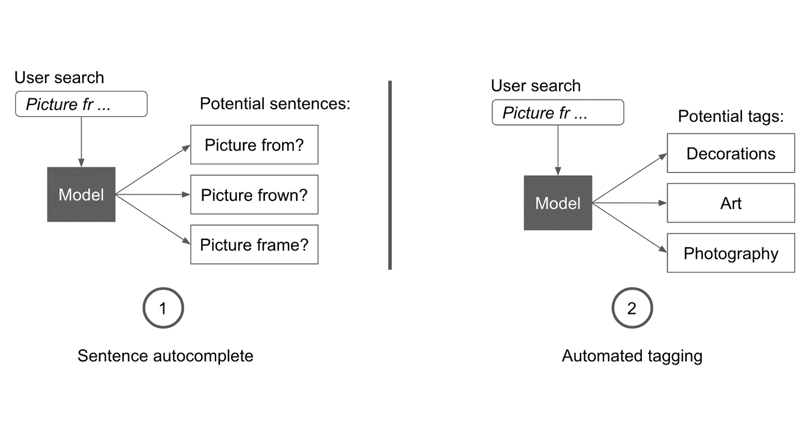
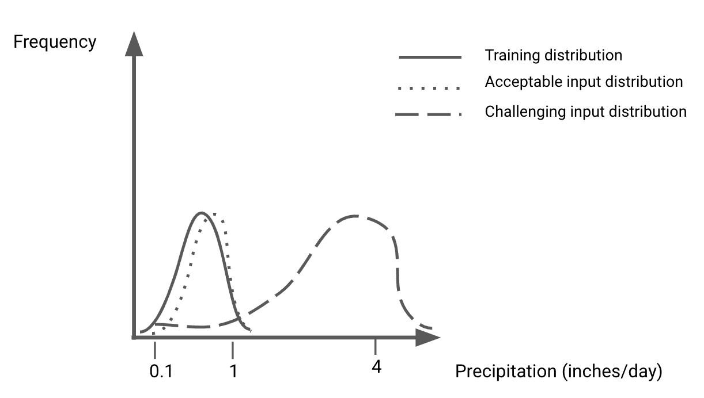
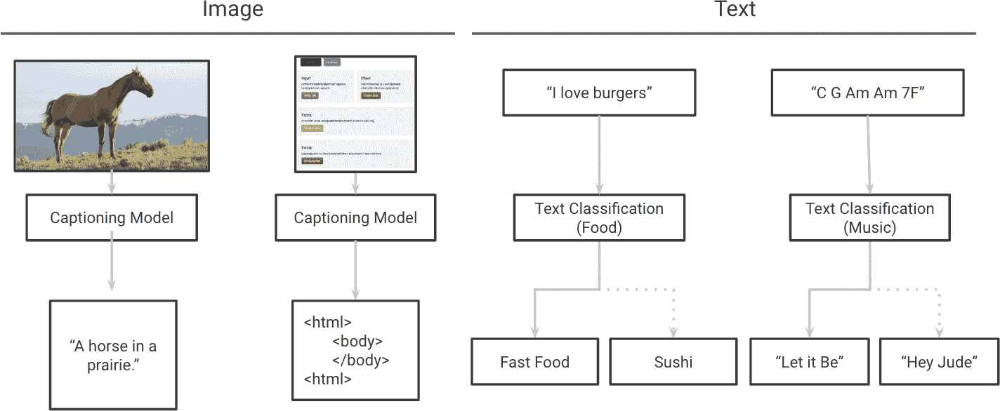
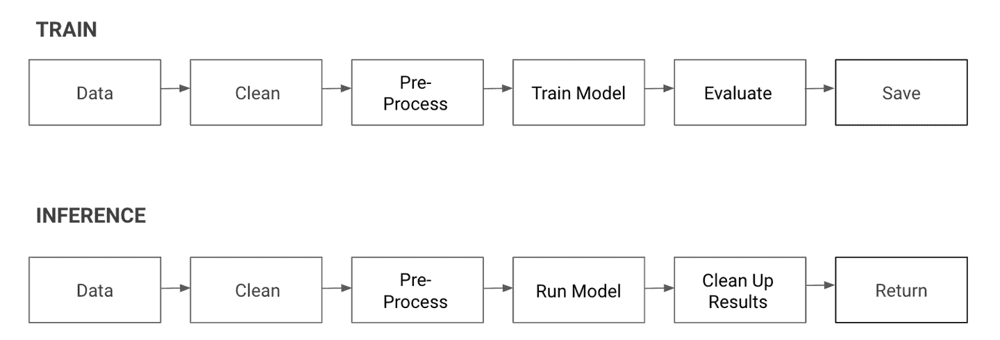
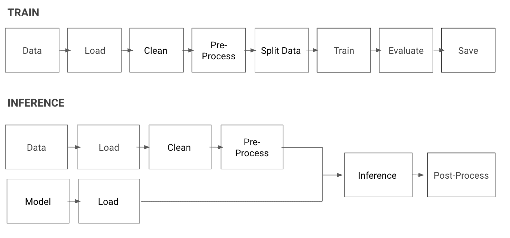

# 第二章：制定计划

在上一章中，我们讨论了如何估算是否需要机器学习，找到最合适使用机器学习的地方，并将产品目标转化为最合适的机器学习框架。在本章中，我们将讨论使用指标来跟踪机器学习和产品进展，并比较不同的机器学习实现。然后，我们将识别建立基准线和规划建模迭代的方法。

我不幸地看到许多机器学习项目从一开始就注定要失败，因为产品指标与模型指标之间存在不匹配。更多的项目失败不是因为建立了好的模型，而是因为这些模型对产品没有帮助。这就是为什么我想要专门讨论指标和规划的原因。

我们将讨论利用现有资源和问题的约束条件来构建可行计划的技巧，这将极大简化任何机器学习项目。

让我们更详细地定义性能指标。

# 测量成功

当涉及到机器学习时，我们建立的第一个模型应该是能够解决产品需求的最简单模型，因为生成和分析结果是快速推动机器学习进展的方法。在上一章中，我们提到了三种增加复杂性的潜在方法，用于机器学习编辑器。这里提醒一下：

基准线；基于领域知识设计启发式方法

我们可以从简单地定义规则开始，基于我们对写作优质内容的先前知识。我们将通过测试这些规则来看它们是否有助于区分优秀文本和糟糕文本。

简单模型；将文本分类为好或坏，并使用分类器生成推荐

然后我们可以训练一个简单的模型来区分好问题和坏问题。只要模型表现良好，我们可以检查它，看看它找到了哪些特征对好问题有很高的预测性，并将这些特征用作推荐。

复杂模型；训练一个从坏文本到好文本的端到端模型

这是最复杂的方法，无论是在模型还是数据方面，但如果我们有资源来收集训练数据，并构建和维护一个复杂的模型，我们就能直接解决产品需求。

所有这些方法都是不同的，随着我们在原型过程中的学习，它们可能会发展变化，但在进行机器学习时，您应该定义一套共同的指标来比较建模管道的成功。

###### 注意

**并非总是需要机器学习**

您可能已经注意到，基准线方法根本不依赖于机器学习。正如我们在第一章中讨论的那样，有些特征根本不需要机器学习。同样重要的是要意识到，即使是那些可能受益于机器学习的特征，通常也可以简单地使用启发式方法作为它们的第一个版本。一旦启发式方法被采用，您甚至可能会意识到根本不需要机器学习。

构建启发式方法通常也是构建功能的最快方式。一旦构建并使用了功能，您将更清晰地了解用户的需求。这将帮助您评估是否需要 ML，并选择建模方法。

在大多数情况下，开始时没有 ML 是构建 ML 产品的最快方式。

为此，我们将涵盖四类对任何 ML 产品有重大影响的性能指标：业务指标，模型指标，新鲜度和速度。清晰定义这些指标将允许我们准确衡量每次迭代的性能。

## 业务绩效

我们已经讨论了以明确的产品或功能目标开始的重要性。一旦这个目标明确，就应该定义一个度量标准来评判其成功。这个度量标准应该与任何模型指标分开，并且只是产品成功的反映。产品指标可能非常简单，例如吸引功能用户的数量，或者更复杂，例如我们提供的推荐的点击率（CTR）。

产品指标最终是唯一重要的，因为它们代表了您的产品或功能的目标。所有其他指标应该被用作改进产品指标的工具。然而，产品指标并不需要是唯一的。尽管大多数项目倾向于专注于改善一个产品指标，但它们的影响通常以多个指标来衡量，包括*安全指标*，即不应低于给定点的指标。例如，一个机器学习项目可以旨在提高如点击率（CTR）之类的给定指标，同时保持其他指标稳定，例如平均用户会话长度。

对于 ML 编辑器，我们将选择一个度量推荐的有用性的指标。例如，我们可以使用用户按照建议行动的比例。为了计算这样的指标，ML 编辑器的界面应该捕捉用户是否赞同建议，例如通过在输入上方叠加并使其可点击。

我们看到每个产品都适用于许多潜在的 ML 方法。为了衡量 ML 方法的有效性，您应该跟踪模型性能。

## 模型性能

对于大多数在线产品，决定模型成功的最终产品指标是使用模型输出的访问者比例，相对于所有可能受益的访问者。例如，在推荐系统的情况下，通常通过测量有多少人点击推荐产品来评估性能（参见第八章关于此方法的潜在问题）。

当产品仍在建设中尚未部署时，无法测量使用度量。为了仍然衡量进展，定义一个单独的成功度量标准叫做*离线度量*或*模型度量*至关重要。一个好的离线度量应该可以在不暴露模型给用户的情况下评估，并且尽可能与产品度量和目标相关联。

不同的建模方法使用不同的模型指标，改变方法可以使达到足以实现产品目标的建模性能水平变得更容易。

例如，假设您正在尝试为在线零售网站上用户输入搜索查询时提供有用的建议。您将通过测量点击率来衡量此功能的成功，即用户点击您提供的建议的频率。

要生成建议，您可以构建一个模型，试图猜测用户将要输入的单词，并在用户输入时将预测的完整句子呈现给他们。您可以通过计算模型的单词级准确率来衡量其性能，计算它多频繁地预测正确的下一个单词组。这样的模型需要达到极高的准确率，以帮助提高产品的点击率，因为一个单词的预测错误足以使建议失效。这种方法在图 2-1 的左侧勾画出来。

另一种方法是训练一个模型，将用户输入分类到目录中的类别，并建议最有可能的三个预测类别。您将使用所有类别的准确率来衡量模型的性能，而不是每个英文单词的准确率。由于目录中的类别数量比英语词汇要小得多，这将是一个更容易优化的建模指标。此外，该模型只需要正确预测一个类别即可生成点击。这种模型更容易提高产品的点击率。您可以在图 2-1 的右侧看到这种方法在实践中的模拟效果。

###### 图 2-1\. 稍微改变产品可以使建模任务更加容易

正如您所见，通过对模型和产品之间的交互进行小的更改，可以使用更直接的建模方法并更可靠地交付结果。以下是更新应用程序以使建模任务更简单的几个其他示例：

+   *更改接口，以便如果模型的置信度低于阈值，则可以省略模型的结果。*例如，当构建一个自动完成用户输入的模型时，该模型可能只对部分句子表现良好。我们可以实现逻辑，只有当模型的置信度得分超过 90%时，才向用户显示建议。

+   *除了模型的顶部预测外，还展示几个其他预测或启发法。* 例如，大多数网站会显示模型建议的不止一项推荐。显示五个候选项而不是一个，可以增加建议对用户有用的可能性，即使模型是相同的。

+   *向用户传达模型仍处于实验阶段，并给予他们提供反馈的机会。* 当自动检测到用户非母语的语言并为其翻译时，网站通常会添加一个按钮，让用户知道翻译是否准确和有用。

即使建模方法适用于问题，有时生成与产品性能更相关的额外模型指标也是值得的。

我曾与一位数据科学家合作，他构建了一个模型，用于从简单网站的手绘草图生成 HTML（参见[他的文章，“使用深度学习进行自动前端开发”](https://oreil.ly/SdYQj)）。该模型的优化指标使用交叉熵损失来比较每个预测的 HTML 标记与正确标记。然而，产品的目标是生成的 HTML 能够呈现与输入草图相似的网站，而不考虑标记的顺序。

交叉熵不考虑对齐：如果模型生成了一个正确的 HTML 序列，但在开头多了一个额外的标记，那么与目标相比，所有标记都会向后偏移一个。这样的输出会导致非常高的损失值，尽管实际上产生了几乎理想的结果。这意味着在试图评估模型的实用性时，我们应该超越其优化指标。在这个例子中，使用[BLEU 分数](https://oreil.ly/8s9JE)提供了更好地衡量生成的 HTML 与理想输出之间相似性的方法。

最后，产品设计应考虑到合理的模型性能假设。如果产品依赖于模型的完美性才能有用，那么很可能会产生不准确甚至危险的结果。

例如，如果你正在构建一个模型，让你拍一张药片的照片并告诉患者其类型和剂量，那么模型能够有多少最低准确率仍然是有用的？如果当前方法很难达到这一准确性要求，您是否可以重新设计产品，以确保用户得到良好服务，而不会因其可能产生的预测错误而受到伤害？

在我们的情况下，我们希望构建的产品将提供写作建议。大多数机器学习模型在某些输入上表现出色，在某些输入上可能遇到困难。从产品的角度来看，如果我们无法帮助——我们需要确保我们不会使情况变得更糟——我们希望限制输出比输入更差的结果的时间。我们如何在模型指标中表达这一点？

假设我们构建了一个分类模型，试图预测一个问题是否好，这是根据它所获得的点赞数量来衡量的。分类器的精确度被定义为预测为好的问题中实际上好的问题的比例。另一方面，它的召回率是预测为好的问题占数据集中所有好问题的比例。

如果我们想要始终提供相关的建议，我们将优先考虑模型的*精确度*，因为高精确度的模型将一个问题分类为好（从而做出推荐）时，实际上这个问题确实很好的可能性很高。高精确度意味着当我们做出推荐时，它往往是正确的。关于为什么高精确度模型对撰写推荐更有用的更多信息，请参阅“克里斯·哈兰德：发布实验”。

我们通过查看模型在代表性验证集上的输出来衡量这些指标。我们将深入探讨这意味着什么，详见“评估您的模型：超越准确度”，但现在，请将验证集视为从训练中留出并用于估计模型在未见数据上的表现。

初始模型性能很重要，但面对用户行为变化时，模型保持有用性的能力同样重要。一个在特定数据集上训练的模型将在类似数据上表现良好，但我们如何知道是否需要更新数据集呢？

## 新鲜度和分布转变

监督模型从学习输入特征和预测目标之间的关联中获得其预测能力。这意味着大多数模型需要接触到与给定输入类似的训练数据才能表现良好。一个仅使用男性照片预测用户年龄的模型，在女性照片上将表现不佳。但即使模型在充足的数据集上进行了训练，许多问题的数据分布随着时间的推移会发生变化。当数据的分布*转变*时，模型通常需要相应变化以维持相同的性能水平。

让我们假设在注意到旧金山的雨对交通的影响后，您建立了一个模型，根据过去一周的降雨量预测交通状况。如果您在十月份使用过去三个月的数据建立模型，那么您的模型可能是在日降水量低于一英寸的数据上进行训练的。请参见图 2-2，展示了这种分布可能的示例。随着冬季的临近，平均降水量将接近 3 英寸，这高于模型在训练期间所接触到的任何数据，正如您可以在图 2-2 中看到的。如果模型没有接受更近期数据的训练，它将难以保持良好的表现。

###### 图 2-2\. 分布变化

总的来说，只要模型在训练期间接触到的数据足够相似，它可以在之前没有见过的数据上表现良好。

不同问题的新鲜度要求并不相同。古代语言的翻译服务可以预期其操作的数据保持相对稳定，而搜索引擎需要建立在用户搜索习惯变化快速的假设上进行构建。

根据您的业务问题，您应考虑保持模型“新鲜度”的难度。您需要多频繁重新训练模型？每次重新训练会带来多少成本？

对于 ML 编辑器，我们设想“良好构思的英文散文”定义变化的频率相对较低，可能是每年一次。然而，如果我们针对特定领域，新鲜度的需求就会发生变化。例如，提问数学问题的正确方式变化的速度会比提问音乐趋势问题的最佳措辞慢得多。由于我们估计模型需要每年重新训练一次，因此我们需要每年获得新鲜数据来进行训练。

我们的基线模型和简单模型都可以从非配对数据中学习，这使得数据收集过程更简单（我们只需找到最近一年的新问题）。然而，复杂模型需要配对数据，这意味着我们每年都必须找到相同句子的示例，以“好”和“坏”的方式表达。这意味着满足我们定义的新鲜度要求对于需要配对数据的模型来说将更加困难，因为获取更新的数据集需要更多时间。

对于大多数应用程序来说，受欢迎程度可以帮助减轻数据收集的需求。如果我们的提问服务一夜爆红，我们可以为用户添加一个按钮来评估输出质量。然后，我们可以收集用户过去的输入以及模型的预测和相关用户评分，并将它们用作训练集。

应用程序要受欢迎，关键在于它是否有用。通常，这需要及时响应用户请求。因此，模型能够快速提供预测的速度成为需要考虑的重要因素。

## 速度

理想情况下，模型应该能快速地提供预测。这使得用户更容易与之交互，并且更容易为多个并发用户提供模型服务。那么模型需要多快呢？对于某些用例，如翻译短句，用户会期望立即得到答案。对于其他用例，如医学诊断，患者愿意等待 24 小时，只要能确保得到最准确的结果。

在我们的情况下，我们将考虑两种潜在的方式来提供建议：通过一个提交框，用户写入内容后点击提交按钮并获取结果，或者每次用户输入新字母时动态更新。虽然我们可能更倾向于后者，因为这样可以使工具更加互动，但这需要模型运行得更快。

我们可以设想用户点击提交按钮后等待几秒钟以获取结果，但对于一个模型在用户编辑文本时运行，它需要在一秒内显著运行。最强大的模型需要更长时间来处理数据，因此在迭代模型时，我们将牢记这一要求。我们使用的任何模型应该能够在不到两秒的时间内处理一个示例的整个流程。

随着模型变得越来越复杂，模型推断的运行时间也会增加。即使在每个数据点相对较小的数据（例如 NLP，而不是实时视频任务）中，差异也很显著。例如，本书案例研究中使用的文本数据，LSTM 大约比随机森林慢三倍（LSTM 约为 22 毫秒，而随机森林只需 7 毫秒）。在单个数据点上，这些差异很小，但在需要同时对数万个示例进行推断时，它们可能会迅速累积。

对于复杂的应用程序，推断调用将与多个网络调用或数据库查询相关联，模型执行时间可能会比应用程序逻辑的其他部分短。在这些情况下，所述模型的速度就不再是问题的关键。

根据您的问题，还有其他类别可以考虑，例如硬件限制、开发时间和可维护性。在选择模型之前，了解您的需求非常重要，以确保以知情的方式选择所述模型。

一旦确定了要求和相关指标，就是制定计划的时候了。这需要估计前方的挑战。在接下来的部分，我将介绍如何利用先前的工作和探索数据集来决定接下来要构建什么。

# 估算范围和挑战

正如我们所见，机器学习的性能通常以模型指标报告。虽然这些指标很有用，但应用它们来改进我们定义的产品指标，这些产品指标代表我们试图解决的实际任务。在管道的迭代过程中，我们应该牢记产品指标，并努力改进它们。

到目前为止，我们所涵盖的工具将帮助我们确定是否值得处理某个项目，并衡量我们目前的表现如何。下一个逻辑步骤是草拟一个攻击计划，以估算项目的范围和持续时间，并预料可能遇到的障碍。

在机器学习中，成功通常需要充分理解任务的背景，获取一个好的数据集，并构建一个合适的模型。

我们将在下一节中详细介绍每个类别。

## 利用领域专业知识

我们可以从最简单的启动模型开始，即启发式方法：基于问题和数据的知识得出的经验法则。制定启发式方法的最佳途径是观察专家目前的做法。

制定启发式方法的第二最佳途径是查看您的数据。基于您的数据集，如果您手动进行此任务，您将如何解决？

要找出良好的启发式方法，我建议要么向该领域的专家学习，要么熟悉数据。接下来，我将稍微详细描述这两种方法。

### 向专家学习

对于我们可能想要自动化的许多领域，向该领域的专家学习可以节省我们数十小时的工作时间。例如，如果我们试图为工厂设备建立预测性维护系统，我们应该首先与工厂经理联系，了解我们可以合理假设哪些内容。这可能包括了解当前维护频率，通常表明机器即将需要维护的症状，以及与维护相关的法律要求。

当然，也有一些例子，可能很难找到领域专家，比如用于预测独特网站功能使用情况的专有数据。然而，在这些情况下，我们通常可以找到那些曾经处理过类似问题并从中学习经验的专业人士。

这将使我们了解可以利用的有用特征，找到应该避免的陷阱，更重要的是，防止我们为许多数据科学家不好的声誉重新发明轮子。

### 检查数据

正如 Monica Rogati 在“Monica Rogati: How to Choose and Prioritize ML Projects” 和 Robert Munro 在“Robert Munro: How Do You Find, Label, and Leverage Data?” 中提到的，开始建模之前查看数据非常关键。

探索性数据分析（EDA）是可视化和探索数据集的过程，通常是为了对给定的业务问题有直觉。EDA 是构建任何数据产品的关键部分。除了 EDA 之外，还需要以希望模型能够适当利用数据集的方式对示例进行标记。这样做有助于验证假设，并确认您选择了可以适当利用您的数据集的模型。

EDA 过程将帮助您了解数据的趋势，自行标记将迫使您建立一套启发式方法来解决问题。在完成了前两个步骤之后，您应该更清楚地知道哪种模型最适合您，以及我们可能需要的任何额外数据收集和标记策略。

下一个逻辑步骤是看看其他人如何解决类似的建模问题。

## 站在巨人的肩膀上

是否有人已经解决过类似的问题？如果是这样，开始的最佳方法是理解并复制现有的结果。寻找公共实现，其模型或数据集与您相似，或两者都有关。

理想情况下，这将涉及找到开源代码和可用数据集，但这些并不总是容易获得，特别是对于非常特定的产品。尽管如此，在机器学习项目上开始的最快方式是复制现有的结果，然后在其基础上建立。

在像机器学习这样有许多不同组成部分的领域中，站在巨人的肩膀上是至关重要的。

###### 注意

如果您计划在您的工作中使用开源代码或数据集，请确保您有权这样做。大多数代码库和数据集都会包含定义可接受使用方式的许可证。此外，请给您最终使用的任何来源信用，最好附上对他们原始作品的引用。

在投入大量资源之前，构建一个令人信服的概念证明通常是一个好主意。例如，在使用时间和金钱标记数据之前，我们需要确信我们能够构建一个能够从这些数据中学习的模型。

那么，我们如何找到一个高效的开始方式呢？就像我们在本书中将要讨论的大多数主题一样，这包括两个主要部分：数据和代码。

### 开放数据

您可能并不总是能够找到符合您要求的数据集，但通常可以找到在性质上足够相似以帮助的数据集。在这种情况下，什么是类似的数据集？在这里将机器学习模型视为将输入映射到输出是有帮助的。基于这个想法，类似的数据集简单地意味着具有类似输入和输出类型的数据集（但不一定是相同领域的）。

经常，使用类似输入和输出的模型可以应用于完全不同的上下文。在图 2-3 的左侧是两个模型，它们都从图像输入中预测文本序列。一个用于描述照片，而另一个从该网站的截图生成网站的 HTML 代码。类似地，图 2-3 的右侧显示了一个模型，它从英文文本描述中预测食物类型，另一个从乐谱转录中预测音乐流派。

###### 图 2-3\. 具有相似输入和输出的不同模型

例如，假设我们试图构建一个模型来预测新闻文章的观看次数，但却难以找到新闻文章及其关联观看次数的数据集。我们可以先使用公开访问的[Wikipedia 页面流量统计数据集](https://oreil.ly/PdwgN)训练一个预测模型。如果模型表现良好，可以合理地认为，给定一个新闻文章观看次数的数据集，我们的模型也能表现得相当不错。寻找类似的数据集有助于验证方法的有效性，并使得在获取数据方面的资源投入更具合理性。

在处理专有数据时，这种方法同样适用。往往情况下，用于预测任务的数据集可能并不容易获取。在某些情况下，所需的数据当前并未被收集。在这种情况下，构建一个在类似数据集上表现良好的模型通常是说服利益相关者建立新的数据收集流水线或促进现有流水线访问的最佳方式。

当涉及到公开数据时，新的数据源和集合经常出现。以下是我发现有用的一些：

+   [互联网档案馆](https://oreil.ly/tIjl9)维护着包括网站数据、视频和书籍在内的一组数据集。

+   subreddit [r/datasets](http://reddit.com/r/datasets) 致力于分享数据集。

+   Kaggle 的[数据集页面](https://www.kaggle.com/datasets)提供多个领域的大量选择。

+   [UCI 机器学习库](https://oreil.ly/BXLA5)是一个庞大的 ML 数据集资源。

+   Google 的[数据集搜索](https://oreil.ly/Gpv8S)涵盖了一个大型可搜索的数据集索引。

+   [Common Crawl](https://commoncrawl.org)从全网抓取和存档数据，并公开发布结果。

+   Wikipedia 也有一个不断更新的[ML 研究数据集列表](https://oreil.ly/kXGiz)。

对于大多数用例来说，这些来源中的一个将为你提供足够接近你所需的数据集。

在这个*相关数据集*上训练一个模型将能够快速原型化和验证你的结果。在某些情况下，你甚至可以在相关数据集上训练一个模型，并将其性能部分转移到最终数据集上（更多内容请参见第 4 章）。

一旦确定了要从哪个数据集开始，就是时候把注意力转向模型了。虽然简单地从头开始构建自己的流程可能很诱人，但至少观察其他人的做法通常也是值得的。

### 开源代码

搜索现有代码可以实现两个高级目标。它让我们看到其他人在进行类似建模时面临的挑战，并揭示了给定数据集可能存在的问题。因此，我建议寻找既处理您产品目标的管道，又处理您选择的数据集的代码。如果找到一个例子，第一步将是自己复现其结果。

我见过许多数据科学家尝试利用他们在网上找到的机器学习代码，却发现他们无法将给定的模型训练到作者声称的类似精度水平。因为新方法并不总是伴随着良好文档和功能良好的代码，机器学习的结果往往难以复现，因此应始终进行验证。

类似于您搜索数据的方式，找到类似代码库的一个好方法是将问题抽象为其输入和输出类型，并找到处理具有类似类型问题的代码库。

例如，当试图从网站截图生成 HTML 代码时，论文作者 Tony Beltramelli 意识到他的问题归结为将图像转换为序列。他利用了现有的体系结构和最佳实践，这些实践来自一个更成熟的领域，并且还能从图像生成序列，这意味着图像字幕！这使他在一个全新的任务上获得了出色的结果，并利用了相邻应用多年的工作成果。

一旦您查看了数据和代码，您就可以继续前进了。理想情况下，这个过程已经给了您一些指导，让您开始工作并获得对问题更加细致的理解。让我们总结一下，在寻找先前工作后您可能会遇到的情况。

### 将两者结合起来

正如我们刚刚讨论的，利用现有的开源代码和数据集可以帮助加快实施过程。在最坏的情况下，如果没有现有模型在一个开放数据集上表现良好，那么您现在至少知道这个项目将需要大量的建模和/或数据收集工作。

如果您找到了一个解决类似任务的现有模型，并成功在其原始训练数据集上训练它，那么剩下的就是将其调整到您的领域。为此，我建议按照以下连续步骤进行：

1.  找到一个类似的开源模型，最好是与其训练的数据集配对，并尝试自己复现训练结果。

1.  一旦您复现了结果，请找一个与您使用情况更接近的数据集，并尝试在该数据集上训练之前的模型。

1.  一旦您将数据集集成到训练代码中，就是时候使用您定义的指标来评估您的模型表现，并开始迭代。

我们将探讨每一个步骤的缺陷及其如何克服，从第二部分开始。现在，让我们回到案例研究，回顾刚刚描述的过程。

# ML 编辑计划

让我们检查常见的写作建议，并搜索 ML 编辑的候选数据集和模型。

## 编辑的初始计划

我们应该从基于常见写作指南的启发式方法开始实施。我们将通过搜索现有的写作和编辑指南来收集这些规则，比如在“最简单的方法：成为算法”中描述的那些。

我们理想的数据集应该包括问题及其相关的质量。首先，我们应该快速找到一个更容易获取的类似数据集。根据这个数据集的表现，如果需要的话，我们将扩展和深化我们的搜索。

社交媒体帖子和在线论坛是与质量指标相关的文本的好例子。由于大多数这些指标存在以支持有用内容为目的，它们通常包括“赞”或“点赞”等质量指标。

[Stack Exchange](https://stackexchange.com/)，一个问答社区网络，是一个流行的问答网站。同时，在[互联网档案馆](https://oreil.ly/NR6iQ)上有整个匿名化的 Stack Exchange 数据备份，这是我们之前提到的数据来源之一。这是一个很好的数据集来开始研究。

我们可以通过使用 Stack Exchange 的问题来构建一个初始模型，并尝试根据其内容预测问题的点赞分数。我们还将利用这个机会浏览数据集并标记它，试图找出模式。

我们想要构建的模型试图准确分类文本质量，然后提供写作建议。有许多开源模型用于文本分类；请查看关于这个主题的[这个流行的 Python ML 库 scikit-learn 教程](https://oreil.ly/y6Qdp)。

一旦我们有了一个工作的分类器，我们将讨论如何利用它来做推荐，在第七章中。

现在我们有了一个潜在的初始数据集，让我们过渡到模型，并决定从哪里开始。

## 始终从一个简单的模型开始

本章的一个重要收获是，建立初始模型和数据集的目的是产生信息丰富的结果，以指导进一步的建模和数据收集工作，以实现更有用的产品。

通过从一个简单的模型开始并提取 Stack Overflow 问题成功的趋势，我们可以快速测量性能并进行迭代。

试图从头开始建立一个完美模型的相反方法在实践中是行不通的。这是因为 ML 是一个迭代过程，其中取得进展的最快方式是看模型如何失败。我们将在第三部分中更详细地探讨这个迭代过程。

然而，我们应该记住每种方法的注意事项。例如，问题收到的关注度取决于远比问题质量更多的因素。帖子的上下文、发布社区、发布者的知名度、发布时间以及其他许多细节都非常重要，而这些初始模型可能会忽略。为了考虑这些因素，我们将限制数据集的范围到一部分社区。我们的第一个模型将忽略与帖子相关的所有元数据，但如果有必要的话，我们将考虑将其纳入。

因此，我们的模型使用了通常被称为*弱标签*的标签，这种标签只与所需输出略有关联。随着我们分析模型的表现，我们将确定这个标签是否包含足够的信息以便于实用。

我们有了一个起点，现在可以决定如何进展。在机器学习中，要实现稳定的进展通常似乎很困难，因为建模具有不可预测的方面。很难事先知道特定建模方法将成功到何种程度。因此，我想分享一些小贴士，帮助您实现稳定的进展。

# 要实现稳定的进展：从简开始

值得重申的是，机器学习中的许多挑战与软件中最大的挑战之一相似——抵制构建尚不需要的部分的冲动。许多机器学习项目失败是因为它们依赖于初始数据获取和模型构建计划，并且不定期评估和更新此计划。由于机器学习的随机性质，极其难以预测特定数据集或模型能走多远。

因此，从能够满足您需求的最简单模型开始，构建一个包含此模型的端到端原型，并根据产品目标评估其性能，这是*至关重要*的。

## 从简单的流水线开始

在绝大多数情况下，查看初始数据集上简单模型的表现是决定下一步应该解决哪个任务的最佳方法。然后，目标是为每个后续步骤重复这种方法，进行小幅增量改进，这样易于跟踪，而不是试图一次性构建完美模型。

为此，我们需要构建一个可以接收数据并返回结果的流水线。对于大多数机器学习问题，实际上有两个独立的流水线需要考虑。

### 训练

要使您的模型能够进行准确的预测，首先需要对其进行训练。

训练流水线将摄入所有您想要训练的标记数据（对于某些任务，数据集可能非常庞大，无法放在单台机器上），并将其传递给模型。然后，它在数据集上训练该模型，直到达到令人满意的性能。最常见的情况是，训练流水线用于训练多个模型，并在保留验证集上比较它们的性能。

### 推断

这是您生产中的管道。它将训练好的模型结果提供给用户。

在高层次上，推理管道从接受输入数据并对其进行预处理开始。预处理阶段通常包括多个步骤。最常见的步骤包括清理和验证输入数据，生成模型所需的特征，并将数据格式化为适合机器学习模型的数值表示。在更复杂的系统中，管道通常还需要获取模型需要的其他信息，例如存储在数据库中的用户特征。然后，管道将示例输入到模型中，应用任何后处理逻辑，并返回结果。

图 2-4 显示了典型推理和训练管道的流程图。理想情况下，清洁和预处理步骤对训练和推理管道应该是相同的，以确保训练好的模型在推理时接收到具有相同格式和特征的数据。

###### 图 2-4\. 训练和推理管道是互补的

不同模型的管道将考虑到不同的问题，但总体基础设施保持相对稳定。这就是为什么从构建端到端的训练和推理管道开始，快速评估莫妮卡·罗加蒂提到的瓶颈影响的价值所在“莫妮卡·罗加蒂：如何选择和优先处理机器学习项目”。

大多数管道具有类似的高级结构，但由于数据集结构的差异，这些功能本身通常没有共同点。我们来看一下编辑器的管道来加以说明。

## 机器学习编辑器的管道

对于编辑器，我们将使用 Python 构建端到端的训练和推理管道，Python 是机器学习中常用的语言选择。在这个第一个原型中，我们的目标是构建一个端到端的管道，而不是过于关注其完美性。

正如在任何需要时间的工作中应该做的那样，我们可以并*会*重新审视其中的部分以改进它们。对于训练，我们将编写一个相当标准的管道，适用于许多机器学习问题，并且有一些主要的功能，主要包括：

+   加载数据记录。

+   通过删除不完整的记录和在必要时输入缺失值来清洁数据。

+   以一种可以被模型理解的方式预处理和格式化数据。

+   删除一组数据，这些数据不会被用来训练，而是用来验证模型的结果（验证集）。

+   对给定数据子集进行模型训练，并返回训练好的模型和总结统计信息。

对于推理，我们将利用一些来自训练管道的功能，并编写一些自定义的功能。理想情况下，我们需要的功能包括：

+   加载训练好的模型并将其保存在内存中（以提供更快的结果）

+   将预处理（与训练相同）

+   收集任何相关的外部信息

+   将一个例子通过模型传递（推断函数）

+   将进行后处理，以在提供给用户之前清理结果

通常最容易将一个流水线可视化为流程图，例如 图 2-5 所示的流程图。

###### 图 2-5\. 编辑器的流水线

此外，我们将编写各种分析和探索函数，以帮助我们诊断问题，例如：

+   可视化模型表现最佳和最差的示例的函数

+   探索数据的函数

+   探索模型结果的函数

许多流水线包含验证模型输入和检查其最终输出的步骤。这些检查有助于调试，正如您将在 第 10 章 中看到的，并通过捕捉任何不良结果在显示给用户之前帮助保证应用程序的质量标准。

记住，在使用机器学习时，模型在未见数据上的输出通常是不可预测的，并且不总是令人满意。因此，重要的是要认识到模型不总是有效，并在此基础上设计系统以应对可能的错误。

# 结论

我们现在已经了解了如何定义核心指标，使我们能够比较完全不同的模型，并理解它们之间的权衡。我们涵盖了加快建立您的前几个流水线过程的资源和方法。然后，我们概述了构建每个流水线所需的概述，以获取一组初始结果。

现在我们已经将一个问题构建成了一个机器学习问题，有了衡量进展的方法和一个初始计划。现在是深入实施的时候了。

在 第 II 部分 中，我们将深入探讨如何构建第一个流水线，并探索和可视化初始数据集。
