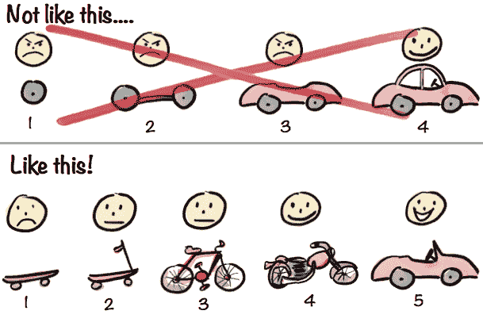

# 第二部分：构建工作管道

由于研究、训练和评估模型是一个耗时的过程，走错方向在机器学习中可能代价高昂。这就是为什么本书侧重于减少风险和确定最高优先级以进行工作。

虽然第一部分侧重于计划以最大化我们的速度和成功的机会，本章将深入实施。正如图 II-1 所示，在机器学习和大部分软件工程中，你应该尽快达到最小可行产品（MVP）。本节将仅覆盖此内容：快速建立管道并评估它的最快方式。

改进这个模型将是本书第三部分的重点。

###### 图 II-1. 构建您的第一个管道的正确方式（经 Henrik Kniberg 许可重现）

我们将分两步建立我们的初始模型：

第三章

本章中，我们将构建应用程序的结构和脚手架。这将涉及建立一个管道来接受用户输入并返回建议，以及一个单独的管道来训练我们的模型，然后再使用它们。

第四章

本章将侧重于收集和检查初始数据集。这里的目标是快速识别数据中的模式，并预测哪些模式对我们的模型是预测性和有用的。
