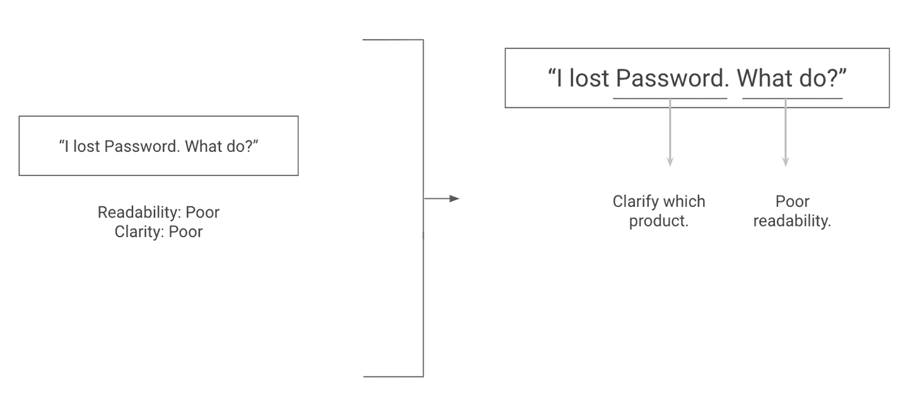

# 第三章：建立您的第一个端到端管道

在第 I 部分中，我们首先介绍了如何从产品需求到候选建模方法。然后，我们进入了规划阶段，并描述了如何找到相关资源并利用它们来制定一个建设初步计划的初始计划。最后，我们讨论了建立一个功能系统的初步原型是取得进展的最佳途径。这是我们将在本章中涵盖的内容。

这个第一次迭代设计的目的是有意缺乏亮点。它的目标是使我们能够将管道的所有部分放在一起，以便我们可以优先改进哪些部分。拥有一个完整的原型是识别 Monica Rogati 在“Monica Rogati：如何选择和优先处理 ML 项目”中描述的影响瓶颈的最简单方法。

让我们从构建最简单的管道开始，这个管道可以从输入产生预测。

# 最简单的脚手架

在“从简单管道开始”中，我们描述了大多数 ML 模型由两个管道组成，训练和推断。训练允许我们生成高质量的模型，而推断则是为用户提供结果。有关训练和推断之间区别的更多信息，请参见“从简单管道开始”。

对于应用程序的第一个原型，我们将专注于能够向用户提供结果。这意味着在我们描述的两个管道中的一个——第二章中的推断管道，我们将从推断管道开始。这将使我们能够快速检查用户如何与模型输出交互，从而收集有用的信息，以便更轻松地训练模型。

如果我们只专注于推断，我们将暂时忽略训练。既然我们不训练模型，我们可以写一些简单的规则。编写这些规则或启发式经常是一个很好的入门方式。这是快速构建原型的最快方式，使我们可以立即看到完整应用程序的简化版本。

尽管如果我们打算在书中的后面实施 ML 解决方案，这可能看起来是多余的，但它是一个关键的推动因素，使我们直面问题并制定一个关于如何最好解决它的初始假设集。

建立、验证和更新关于如何对数据进行建模的最佳方式的假设是迭代模型构建过程的核心部分，这甚至在我们构建第一个模型之前就开始了！

###### 注意

这里有几个我在指导 Insight 数据科学院学员时见过的项目中使用的优秀启发式的例子。

+   *代码质量估计:* 当构建一个旨在预测编程者在 HackerRank（一个竞争性编程网站）上表现良好的模型时，Daniel 首先计算开放和关闭的括号、方括号和花括号的数量。

    在大多数有效的工作代码中，开放和闭合括号的计数是匹配的，因此这一规则被证明是一个相当强大的基线。此外，这使他产生了使用[抽象语法树](https://oreil.ly/L0ZFk)捕获更多关于代码结构信息的直觉。

+   *树木计数：* 当试图从卫星图像中统计城市中的树木时，Mike 在查看了一些数据后，首先制定了一个规则，根据给定图像中绿色像素的比例来估算树木密度。

    结果表明，这种方法适用于分散的树木，但在树木林地时失败了。同样，这有助于定义接下来的建模步骤，重点是构建一个可以处理密集树木群的流水线。

大多数 ML 项目应该从类似的启发式方法开始。关键在于记住根据专家知识和数据探索设计它，并使用它来确认初始假设并加速迭代。

一旦您有了启发式方法，就是创建一个可以收集输入、预处理它、应用规则并提供结果的流水线的时候了。这可以简单到您可以从终端调用的 Python 脚本，也可以是收集用户摄像头输入然后提供实时结果的 Web 应用程序。

这里的重点是为您的产品做与您的 ML 方法相同的事情，尽可能简化它，并构建一个简单的功能版本。这通常被称为 MVP（最小可行产品），是尽快获得有用结果的经过测试的方法。

# ML 编辑器的原型

对于我们的 ML 编辑器，我们将利用常见的编辑建议来制定关于什么是好问题和坏问题的几条规则，并向用户显示这些规则的结果。

对于从命令行接收用户输入并返回建议的我们项目的最小版本，我们只需要编写四个函数，如下所示：

```
input_text = parse_arguments()
processed = clean_input(input_text)
tokenized_sentences = preprocess_input(processed)
suggestions = get_suggestions(tokenized_sentences)
```

让我们深入了解每一个！我们将保持参数解析器简单，并从用户那里获取文本字符串，不带任何选项。您可以在本书的[GitHub 代码库](https://oreil.ly/ml-powered-applications)中找到示例和所有其他代码示例的源代码。

## 解析和清理数据

首先，我们简单地解析从命令行接收的数据。这在 Python 中相对简单地编写。

```
def parse_arguments():
    """

 :return: The text to be edited
 """
    parser = argparse.ArgumentParser(
        description="Receive text to be edited"
    )
    parser.add_argument(
        'text',
        metavar='input text',
        type=str
    )
    args = parser.parse_args()
    return args.text
```

每当模型根据用户输入运行时，您都应该开始验证和验证它！在我们的情况下，用户将输入数据，因此我们将确保他们的输入包含我们可以解析的字符。为了清理我们的输入，我们将删除非 ASCII 字符。这不应过多限制我们用户的创造力，并且允许我们对文本中的内容做出合理的假设。

```
def clean_input(text):
    """

 :param text: User input text
 :return: Sanitized text, without non ascii characters
 """
    # To keep things simple at the start, let's only keep ASCII characters
    return str(text.encode().decode('ascii', errors='ignore'))
```

现在，我们需要对输入进行预处理并提供建议。为了开始工作，我们将依赖我们在“最简单的方法：成为算法”中提到的一些关于文本分类的现有研究。这将涉及计算诸如“告诉”和“说”的词语频率，并计算音节、单词和句子的摘要统计数据，以估计句子的复杂性。

要计算词级别的统计数据，我们需要能够从句子中识别单词。在自然语言处理领域，这被称为*分词*。

## 文本分词

分词并不简单，大多数你能想到的简单方法，比如根据空格或句号将输入拆分为单词，将在实际文本中失败，因为单词分隔方式多种多样。例如，考虑斯坦福大学的[NLP 课程](https://oreil.ly/vdrZW)提供的这个例子：

> “奥尼尔先生认为男孩们关于智利首都的故事并不有趣。”

大多数简单的方法在处理这句话时会失败，因为其中包含具有不同含义的句点和撇号。我们不会自己构建分词器，而是会利用[nltk](https://www.nltk.org/)，这是一个流行的开源库，可以通过两个简单步骤来完成，如下所示：

```
def preprocess_input(text):
    """

 :param text: Sanitized text
 :return: Text ready to be fed to analysis, by having sentences and
 words tokenized
 """
    sentences = nltk.sent_tokenize(text)
    tokens = [nltk.word_tokenize(sentence) for sentence in sentences]
    return tokens
```

一旦我们的输出被预处理，我们可以用它来生成特征，以帮助评估问题的质量。

## 生成特征

最后一步是编写一些规则，可以用来向用户提供建议。对于这个简单的原型，我们将首先计算几个常见动词和连接词的频率，然后统计副词的使用情况，并计算[Flesch 可读性分数](https://oreil.ly/iKhmk)。然后，我们将向用户返回这些指标的报告：

```
def get_suggestions(sentence_list):
    """
 Returns a string containing our suggestions
 :param sentence_list: a list of sentences, each being a list of words
 :return: suggestions to improve the input
 """
    told_said_usage = sum(
        (count_word_usage(tokens, ["told", "said"]) for tokens in sentence_list)
    )
    but_and_usage = sum(
        (count_word_usage(tokens, ["but", "and"]) for tokens in sentence_list)
    )
    wh_adverbs_usage = sum(
        (
            count_word_usage(
                tokens,
                [
                    "when",
                    "where",
                    "why",
                    "whence",
                    "whereby",
                    "wherein",
                    "whereupon",
                ],
            )
            for tokens in sentence_list
        )
    )
    result_str = ""
    adverb_usage = "Adverb usage: %s told/said, %s but/and, %s wh adverbs" % (
        told_said_usage,
        but_and_usage,
        wh_adverbs_usage,
    )
    result_str += adverb_usage
    average_word_length = compute_total_average_word_length(sentence_list)
    unique_words_fraction = compute_total_unique_words_fraction(sentence_list)

    word_stats = "Average word length %.2f, fraction of unique words %.2f" % (
        average_word_length,
        unique_words_fraction,
    )
    # Using HTML break to later display on a webapp
    result_str += "<br/>"
    result_str += word_stats

    number_of_syllables = count_total_syllables(sentence_list)
    number_of_words = count_total_words(sentence_list)
    number_of_sentences = len(sentence_list)

    syllable_counts = "%d syllables, %d words, %d sentences" % (
        number_of_syllables,
        number_of_words,
        number_of_sentences,
    )
    result_str += "<br/>"
    result_str += syllable_counts

    flesch_score = compute_flesch_reading_ease(
        number_of_syllables, number_of_words, number_of_sentences
    )

    flesch = "%d syllables, %.2f flesch score: %s" % (
        number_of_syllables,
        flesch_score,
        get_reading_level_from_flesch(flesch_score),
    )

    result_str += "<br/>"
    result_str += flesch

    return result_str
```

现在，我们可以从命令行调用我们的应用程序并实时查看其结果。虽然现在还不是非常有用，但我们有了一个可以测试和迭代的起点，接下来我们将做这些工作。

# 测试您的工作流程

现在我们已经构建了这个原型，我们可以测试我们对问题框架的假设以及我们提出的解决方案的实用性。在本节中，我们将评估我们初始规则的客观质量，并检查我们是否以有用的方式呈现输出。

正如 Monica Rogati 之前分享的，“即使你的模型成功了，你的产品也可能一无是处。”如果我们选择的方法在测量问题质量方面表现出色，但我们的产品没有为用户提供改善写作的建议，那么尽管我们的方法质量很高，产品也将毫无用处。在审视我们的完整流程时，让我们评估当前用户体验的实用性以及我们手工制作模型的结果。

## 用户体验

首先，让我们独立于我们模型的质量来检查我们的产品使用体验有多满意。换句话说，如果我们想象最终将获得一个表现足够好的模型，这是向用户展示结果最有用的方式吗？

例如，如果我们正在进行树木普查，我们可能希望将我们的结果呈现为对整个城市长期分析的摘要。我们可能希望包括报告树木数量，以及按社区细分的统计数据，以及对黄金标准测试集误差的度量。

换句话说，我们希望确保我们呈现的结果是有用的（或者如果我们改进我们的模型会变得更有用）。当然，反过来，我们也希望我们的模型表现良好。这是我们将评估的下一个方面。

## 建模结果

我们提到了在“衡量成功”中集中精力选择正确的度量标准的价值。早期拥有一个可工作的原型将使我们能够识别和迭代我们选择的度量标准，以确保它们代表产品成功。

例如，如果我们正在构建一个帮助用户搜索附近租车的系统，我们可能会使用像折扣累积增益（DCG）这样的度量标准。DCG 通过输出一个评分来衡量排名质量，在最相关的项目早于其他项目时得分最高（详见[DCG 的维基百科文章](https://oreil.ly/b_8Xq)了解更多关于排名指标的信息）。在最初构建我们的工具时，我们可能假设我们希望至少有一个有用的建议出现在前五个结果中。因此，我们使用 DCG@5 来评估我们的模型。然而，当用户试用这个工具时，我们可能注意到用户只考虑前三个显示的结果。在这种情况下，我们应该将我们的成功度量从 DCG@5 更改为 DCG@3。

考虑用户体验和模型性能的目标在于确保我们处理最具影响力的方面。如果用户体验差，改进模型是没有帮助的。事实上，你可能会意识到最好采用完全不同的模型！让我们看两个例子。

### 寻找影响瓶颈

同时查看建模结果和产品当前展示的目标是确定下一个解决挑战的方向。大多数情况下，这意味着在我们向用户展示结果的方式上进行迭代（这可能意味着改变我们训练模型的方式）或者通过识别关键失败点来改进模型性能。

虽然我们将在第三部分更深入地进行错误分析，但我们应该确定失败模式和适当的解决方式。重要的是确定要解决的最具影响力的任务是在建模还是产品领域，因为它们各自需要不同的修复方法。让我们看一个每个方面的例子：

在产品方面

假设你建立了一个模型，该模型查看研究论文的图像，并预测它们是否会被顶级会议接受（参见贾斌黄的论文["Deep Paper Gestalt,"](https://oreil.ly/RRfIN)，该论文解决了这个问题）。然而，你注意到仅返回用户一个拒绝的概率并不是最令人满意的输出。在这种情况下，改进你的模型将*没有*帮助。专注于从模型中提取建议，以便我们可以帮助用户改进他们的论文并增加被接受的机会，这才是有意义的。

在模型方面

你建立了一个信用评分模型，并注意到在其他因素相同的情况下，它会给某个特定种族群体分配更高的违约风险。这很可能是由于你使用的训练数据中存在偏见，因此你应该收集更具代表性的数据，并建立新的清理和增强流水线来尝试解决这个问题。在这种情况下，无论你如何呈现结果，*模型都需要修正*。类似这样的例子很常见，这也是为什么你应该总是深入探究聚合指标以及分析模型对数据不同切片影响的原因。这就是我们在第五章中将要做的事情。

为了进一步说明这一点，让我们为我们的 ML 编辑器进行这个练习。

# ML 编辑器原型评估

让我们看看我们的初始流水线在用户体验和模型性能方面的表现如何。让我们首先输入一些内容到我们的应用程序中。我们将开始测试一个简单问题，一个复杂问题和一个完整段落。

由于我们使用的是阅读易度分数，我们希望我们的工作流能为简单的句子返回高分，为复杂句子返回低分，并提出改进段落的建议。让我们实际运行几个示例通过我们的原型。

简单问题：

```
$ python ml_editor.py  "Is this workflow any good?"
Adverb usage: 0 told/said, 0 but/and, 0 wh adverbs
Average word length 3.67, fraction of unique words 1.00
6 syllables, 5 words, 1 sentences
6 syllables, 100.26 flesch score: Very easy to read
```

复杂问题：

```
$ python ml_editor.py  "Here is a needlessly obscure question, that"\
"does not provide clearly which information it would"\
"like to acquire, does it?"

Adverb usage: 0 told/said, 0 but/and, 0 wh adverbs
Average word length 4.86, fraction of unique words 0.90
30 syllables, 18 words, 1 sentences
30 syllables, 47.58 flesch score: Difficult to read
```

之前你已经认识到的整个段落：

```
$ python ml_editor.py "Ideally, we would like our workflow to return a positive"\
" score for the simple sentence, a negative score for the convoluted one, and "\
"suggestions for improving our paragraph. Is that the case already?"
Adverb usage: 0 told/said, 1 but/and, 0 wh adverbs
Average word length 4.03, fraction of unique words 0.76
52 syllables, 33 words, 2 sentences
52 syllables, 56.79 flesch score: Fairly difficult to read
```

让我们使用我们刚刚定义的两个方面来检查这些结果。

## 模型

目前还不清楚我们的结果是否与我们认为的优质写作相符。复杂的句子和整个段落接受到了类似的可读性评分。现在，我将首先承认，我的散文有时可能很难阅读，但与之前测试的复杂句子相比，之前的段落更易理解。

我们从文本中提取的属性未必与“好写作”最相关。这通常是因为我们没有清晰地定义成功：在给定两个问题的情况下，我们如何说一个比另一个更好？在下一章中构建数据集时，我们将更清晰地定义这一点。

正如预期的那样，我们还有一些建模工作要做，但我们是否正在以有用的方式呈现结果？

## 用户体验

根据之前展示的结果，立即出现了两个问题。我们返回的信息既过于冗余又不相关。我们产品的目标是向用户提供可操作的建议。特征和可读性分数是质量指标，但不会帮助用户决定如何改进他们的提交。我们可能希望将我们的建议归纳为一个单一的分数，以及行动建议来改进它。

例如，我们可以建议一般性的更改，比如使用更少的副词，或者在更细粒度的级别上建议单词和句子级别的更改。理想情况下，我们可以通过突出或下划线显示需要用户注意的输入部分来呈现结果。我已经添加了一个如何在图 3-1 中看起来的模拟。



###### 图 3-1\. 更具操作性的写作建议

即使我们不能直接在输入字符串中突出显示建议，我们的产品仍然可以从提供类似于图 3-1 右侧的更具操作性建议中受益，这些建议比分数列表更具操作性。

# 结论

我们已经建立了一个初始推理原型，并用它来评估我们的启发式和产品工作流的质量。这使我们能够缩小我们的绩效标准范围，并在向用户展示结果的方式上进行迭代。

对于 ML 编辑器，我们已经学到，通过提供具有操作性的建议来改善用户体验，并通过查看数据来更清晰地定义好问题的特征生成和建模方法，可以改进我们的建模方法。

在前三章中，我们利用产品目标来定义初始方法，探索现有资源以制定我们的方法计划，并建立了一个初始原型来验证我们的计划和假设。

现在，是时候深入研究 ML 项目中经常被忽视的部分了——探索我们的数据集。在第四章中，我们将看到如何收集一个初始数据集，评估其质量，并逐步标记其子集，以帮助指导我们的特征生成和建模决策。
