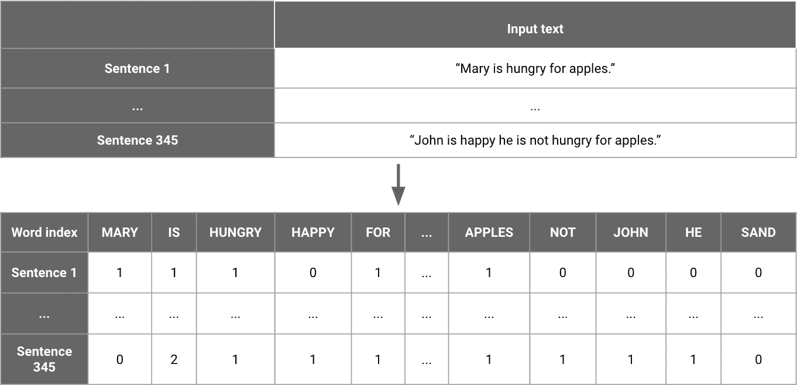

# 第四章：获取初始数据集

一旦您制定了解决产品需求并构建了初始原型以验证您提议的工作流程和模型是否合理的计划，就是深入研究您的数据集的时候了。我们将利用我们发现的内容来指导我们的建模决策。通常情况下，深入了解您的数据会带来最大的性能改进。

在本章中，我们将首先看看如何高效评估数据集的质量。然后，我们将涵盖如何对数据进行向量化以及如何使用这种向量化表示更高效地标记和检查数据集。最后，我们将探讨这种检查如何指导特征生成策略。

让我们从发现数据集并评估其质量开始。

# 迭代数据集

构建机器学习产品的最快方法是快速构建、评估和迭代模型。数据集本身是模型成功的核心组成部分。这就是为什么数据收集、准备和标记应该被视为一个*迭代过程*，就像建模一样。从您可以立即获取的简单数据集开始，并根据您所学到的知识进行改进。

这种对数据的迭代方法一开始可能会令人困惑。在机器学习研究中，性能通常是报告在社区中作为基准使用的标准数据集上的。因此，这些数据集是不可变的。在传统软件工程中，我们为程序编写确定性规则，因此我们将数据视为接收、处理和存储的内容。

机器学习工程结合了工程和机器学习，以便构建产品。因此，我们的数据集只是允许我们构建产品的另一种工具。在机器学习工程中，选择初始数据集、定期更新和增强它通常是*大部分的工作*。这种工作流程在研究和行业之间的差异在图 4-1 中有所体现。


###### 图 4-1。研究中的数据集是固定的，但在工业中是产品的一部分

将数据视为您可以（并且应该）迭代、更改和改进的产品的一部分，对于行业新人来说通常是一种重大范式转变。然而，一旦你习惯了，数据将成为您开发新模型的最佳灵感来源，并且当事情出错时您寻找答案的第一处去处。

## 进行数据科学

我见过整理数据集的过程比我能数的次数更多次成为构建机器学习产品的主要障碍。这部分原因是因为相对缺乏有关该主题的教育（大多数在线课程提供数据集并侧重于模型），这导致许多从业者害怕这部分工作。

很容易认为处理数据是在玩乐模型之前要解决的烦心事，但模型只是从现有数据中提取趋势和模式的一种方法。确保我们使用的数据展现出足够预测模型利用的模式（并检查它是否包含明显偏差）因此是数据科学家工作的基本部分（事实上，您可能已经注意到角色的名称并不是模型科学家）。

本章将专注于这一过程，从收集初始数据集到检查和验证其在机器学习中的适用性。让我们从有效地探索数据集开始，以评估其质量。

# 探索你的第一个数据集

那么我们如何开始探索初始数据集呢？当然，第一步是收集数据集。这是我看到从业者最常陷入困境的地方，因为他们寻找完美的数据集。记住，我们的目标是从中获得初步结果的简单数据集。与机器学习中的其他事物一样，从简单开始，逐步扩展。

## 高效率，从小处开始

对于大多数机器学习问题，更多的数据可能会导致更好的模型，但这并不意味着你应该从最大可能的数据集开始。在开始项目时，一个小数据集可以让你轻松检查和理解数据及其更好地建模方式。你应该瞄准一个易于处理的初始数据集。只有一旦你制定了策略，扩展到更大的规模才有意义。

如果你在一个存储有数百万兆字节数据的集群中工作，你可以开始提取一个在本地机器内存中适合的均匀抽样子集。例如，如果您想开始一个副业项目，试图识别驶过你家前面的汽车品牌，请从街上几十辆汽车的图像开始。

一旦你看到你的初始模型表现及其困难之处，你将能够以经过明智决策的方式迭代你的数据集！

你可以在诸如[Kaggle](https://www.kaggle.com/)或[Reddit](https://www.reddit.com/r/datasets)等平台上找到许多现有的数据集，或者自行收集一些示例，可以通过网页抓取，利用大型开放数据集（如[Common Crawl site](https://commoncrawl.org)）或生成数据！欲了解更多信息，请参阅“开放数据”。

收集和分析数据不仅是必要的，尤其是在项目早期阶段，它还能加速你的进展。查看你的数据集并了解其特征是提出良好建模和特征生成管道的最简单方法。

大多数从业者高估了工作模型的影响，低估了处理数据的价值，因此我建议始终努力纠正这种趋势，偏向于查看数据。

在检查数据时，探索性地识别趋势是一个很好的方法，但你不应该止步于此。如果您的目标是构建机器学习产品，您应该问自己如何以自动化的方式利用这些趋势。这些趋势如何帮助您驱动一个自动化的产品？

## 洞察力与产品

一旦您获得了数据集，现在是时候深入探讨其内容了。当我们这样做时，让我们记住数据探索的目的分为分析目的和产品构建目的两种。虽然两者都旨在从数据趋势中提取和理解，但前者关注从趋势中创造洞察力（例如，学习到大多数网站的欺诈登录发生在星期四，并且来自西雅图地区），而后者则是利用趋势来构建功能（使用登录尝试的时间和其 IP 地址来构建防止欺诈账户登录的服务）。

尽管差异可能看似微妙，但在产品构建的情况下，这导致了额外的复杂性层级。我们需要确信我们所看到的模式将适用于将来收到的数据，并量化我们在训练数据和预期收到的生产数据之间的差异。

对于欺诈预测来说，注意欺诈登录的季节性是第一步。然后，我们应该利用观察到的季节性趋势来估计我们需要多频繁地基于最近收集到的数据来训练我们的模型。在本章的后续部分，随着我们更深入地探索数据，我们将深入探讨更多示例。

在注意到预测趋势之前，我们应该首先检查质量。如果我们选择的数据集不符合质量标准，我们应该在进行建模之前对其进行改进。

## 数据质量评估表

在本节中，我们将涵盖首次使用新数据集时需要检查的一些方面。每个数据集都带有其自己的偏见和奇怪之处，需要不同的工具来理解，因此编写一份涵盖您可能想要在数据集中查找的任何内容的全面规则已超出本书的范围。然而，在初次接触数据集时，有几个类别是值得注意的。让我们从格式开始。

### 数据格式

数据集是否已经格式化，使您拥有清晰的输入和输出，或者是否需要额外的预处理和标记？

例如，当构建一个试图预测用户是否会点击广告的模型时，常见的数据集将包含一个给定时间段内所有点击的历史记录。您需要转换此数据集，使其包含向用户展示广告的多个实例以及用户是否点击了广告。您还希望包括您认为您的模型可以利用的用户或广告的任何特征。

如果你得到了一个已经处理或聚合过的数据集，你应该验证你理解数据处理的方式。比如，如果你得到的列包含了平均转化率，你能计算出这个转化率并验证它与提供的数值是否一致吗？

在某些情况下，你将无法访问到重现和验证预处理步骤所需的信息。在这些情况下，查看数据质量将帮助你确定哪些特征是可信的，哪些是最好忽略的。

### 数据的质量

在开始建模之前，检查数据集的质量至关重要。如果你知道一个关键特征的一半数值是缺失的，你就不会花几个小时来调试一个模型，试图弄清楚为什么模型表现不佳。

数据可以有许多质量低下的方式。它可能缺失，可能不精确，甚至可能损坏。准确评估其质量不仅能让你估计合理的性能水平，还能更容易地选择潜在的特征和模型使用。

如果你正在使用用户活动日志来预测在线产品的使用情况，你能估计有多少事件没有被记录下来吗？对于你已经记录的事件，有多少只包含用户信息的一个子集？

如果你正在处理自然语言文本，你会如何评价文本的质量？例如，是否有很多难以理解的字符？拼写错误或不一致的情况很多吗？

如果你处理的是图像，它们的清晰度足够高，你能自己执行任务吗？如果你在图像中难以检测一个物体，你觉得你的模型会遇到困难吗？

总的来说，你的数据中有多大比例是嘈杂或不正确的？有多少输入对你来说是难以解释或理解的？如果数据有标签，你是否倾向于同意它们，还是经常质疑它们的准确性？

例如，我曾经参与过一些从卫星图像中提取信息的项目。在最好的情况下，这些项目可以访问到带有相应注释的图像数据集，标记出感兴趣的对象，如田地或飞机。然而，在某些情况下，这些注释可能是不准确的，甚至缺失的。这些错误对任何建模方法都有显著影响，因此及早了解这些问题非常重要。我们可以通过自己为初始数据集标注标签或找到一个可以使用的弱标签来处理缺失的标签，但前提是我们要在时间*上有所察觉*。

在验证数据的格式和质量之后，还有一个额外的步骤可以帮助及早发现问题：检查数据的数量和特征分布。

### 数据的数量和分布

让我们评估一下我们是否有足够的数据，以及特征值是否在合理范围内。

我们有多少数据？如果我们有大量数据集，我们应选择一个子集来开始分析。另一方面，如果我们的数据集太小或某些类别代表性不足，那么我们训练的模型可能会像我们的数据一样存在偏差。避免这种偏差的最佳方法是通过数据收集和增强增加数据的多样性。您衡量数据质量的方式取决于您的数据集，但 表 4-1 涵盖了一些问题，供您开始使用。

表 4-1\. 数据质量评分表

| 质量 | 格式 | 数量和分布 |  |
| --- | --- | --- | --- |
| 有任何相关字段是空的吗？ | 您的数据需要多少预处理步骤？ | 您有多少示例？ |  |
| 存在测量错误的可能性吗？ | 您能在生产中以相同的方式预处理吗？ | 每个类别有多少示例？有任何缺失的吗？ |  |

作为一个实际例子，当构建一个模型自动将客户支持电子邮件分类到不同的专业领域时，我与之合作的数据科学家 Alex Wahl 收到了九个不同类别的示例，每个类别只有一个示例。这样的数据集对于模型学习来说太小了，所以他将大部分精力集中在了一个 [数据生成策略](https://oreil.ly/KRn0B) 上。他使用常见表述的模板为每个九个类别生成了成千上万个示例，模型可以从中学习。通过这种策略，他成功将流水线的准确性提升到比仅仅从九个示例中尝试构建足够复杂的模型要高得多的水平。

让我们将这个探索过程应用到我们为 ML 编辑器选择的数据集上，并估计其质量！

### ML 编辑器数据检查

对于我们的 ML 编辑器，我们最初决定使用匿名化的 [Stack Exchange 数据转储](https://oreil.ly/6jCGY) 作为数据集。Stack Exchange 是一个以哲学或游戏等主题为中心的问答网站网络。数据转储包含许多存档，每个存档对应 Stack Exchange 网络中的一个网站。

对于我们的初始数据集，我们选择了一个看起来足够广泛的网站，以便从中构建有用的启发式。乍一看，[写作社区](https://writing.stackexchange.com/) 看起来很合适。

每个网站存档都以 XML 文件的形式提供。我们需要建立一个流水线来摄取这些文件，并将其转换为我们可以从中提取特征的文本。以下示例展示了 *datascience.stackexchange.com* 的 `Posts.xml` 文件：

```
<?xml version="1.0" encoding="utf-8"?>
<posts>
  <row Id="5" PostTypeId="1" CreationDate="2014-05-13T23:58:30.457"
Score="9" ViewCount="516" Body="&lt;p&gt; &quot;Hello World&quot; example? "
OwnerUserId="5" LastActivityDate="2014-05-14T00:36:31.077"
Title="How can I do simple machine learning without hard-coding behavior?"
Tags="&lt;machine-learning&gt;" AnswerCount="1" CommentCount="1" />
  <row Id="7" PostTypeId="1" AcceptedAnswerId="10" ... />
```

为了能够利用这些数据，我们需要能够加载 XML 文件，解码文本中的 HTML 标记，并以更易于分析的格式表示问题和关联数据，例如 pandas DataFrame。以下函数就是这样做的。提醒一下，本书中此函数的代码和所有其他代码都可以在[本书的 GitHub 存储库](https://oreil.ly/ml-powered-applications)中找到。

```
import xml.etree.ElementTree as ElT

def parse_xml_to_csv(path, save_path=None):
    """
 Open .xml posts dump and convert the text to a csv, tokenizing it in the
 process
 :param path: path to the xml document containing posts
 :return: a dataframe of processed text
 """

    # Use python's standard library to parse XML file
    doc = ElT.parse(path)
    root = doc.getroot()

    # Each row is a question
    all_rows = [row.attrib for row in root.findall("row")]

    # Using tdqm to display progress since preprocessing takes time
    for item in tqdm(all_rows):
        # Decode text from HTML
        soup = BeautifulSoup(item["Body"], features="html.parser")
        item["body_text"] = soup.get_text()

    # Create dataframe from our list of dictionaries
    df = pd.DataFrame.from_dict(all_rows)
    if save_path:
        df.to_csv(save_path)
    return df
```

即使对于只包含 30,000 个问题的相对较小的数据集，此过程也需要超过一分钟的时间，因此我们将处理后的文件序列化回磁盘，只需处理一次。为此，我们可以简单地使用 pandas 的`to_csv`函数，如代码片段的最后一行所示。

这通常是训练模型所需的任何预处理的推荐实践。在模型优化过程之前运行的预处理代码可能会显著减慢实验。尽可能在预处理数据并将其序列化到磁盘。

一旦数据格式确定，我们可以检查前面描述的各个方面。我们接下来详细介绍的整个探索过程可以在[本书的 GitHub 存储库](https://oreil.ly/ml-powered-applications)的数据集探索笔记本中找到。

首先，我们使用`df.info()`来显示关于我们的 DataFrame 的摘要信息，以及任何空值。这是它的返回结果：

```
>>>> df.info()

AcceptedAnswerId         4124 non-null float64
AnswerCount              33650 non-null int64
Body                     33650 non-null object
ClosedDate               969 non-null object
CommentCount             33650 non-null int64
CommunityOwnedDate       186 non-null object
CreationDate             33650 non-null object
FavoriteCount            3307 non-null float64
Id                       33650 non-null int64
LastActivityDate         33650 non-null object
LastEditDate             10521 non-null object
LastEditorDisplayName    606 non-null object
LastEditorUserId         9975 non-null float64
OwnerDisplayName         1971 non-null object
OwnerUserId              32117 non-null float64
ParentId                 25679 non-null float64
PostTypeId               33650 non-null int64
Score                    33650 non-null int64
Tags                     7971 non-null object
Title                    7971 non-null object
ViewCount                7971 non-null float64
body_text                33650 non-null object
full_text                33650 non-null object
text_len                 33650 non-null int64
is_question              33650 non-null bool
```

我们可以看到，我们有超过 31,000 个帖子，其中约 4,000 个帖子有一个被接受的答案。此外，我们可以注意到`Body`的一些值，代表帖子的内容，是空的，这似乎有些可疑。我们期望所有帖子都包含文本。快速查看具有空`Body`的行，很快发现它们属于数据集提供的文档中没有参考的一种帖子类型，因此我们将其移除。

让我们快速了解一下格式，看看我们是否理解它。每个帖子的`PostTypeId`值为 1 表示问题，2 表示答案。我们希望查看哪种类型的问题获得了高分，因为我们希望将问题的分数作为真正标签的弱标签，即问题的质量。

首先，让我们将问题与相关答案进行匹配。以下代码选择所有具有已接受答案的问题，并将它们与所述答案的文本连接起来。然后我们可以查看前几行，并验证答案是否与问题匹配。这还允许我们快速查看文本并评估其质量。

```
questions_with_accepted_answers = df[
    df["is_question"] & ~(df["AcceptedAnswerId"].isna())
]
q_and_a = questions_with_accepted_answers.join(
    df[["Text"]], on="AcceptedAnswerId", how="left", rsuffix="_answer"
)

pd.options.display.max_colwidth = 500
q_and_a[["Text", "Text_answer"]][:5]
```

在表 4-2 中，我们可以看到问题和答案似乎是匹配的，并且文本看起来大部分是正确的。我们现在相信我们可以将问题与其关联的答案匹配起来了。

表 4-2\. 带有其关联答案的问题

| Id | body_text | body_text_answer |
| --- | --- | --- |
| 1 | 我一直想要开始写作（完全是业余的），但每当我想要开始时，我立刻被各种问题和疑虑所困扰。\n 有没有一些关于如何开始成为作家的资源？\n 我想要一些有关提示和简单练习的东西，以便让我开始写作。\n | 当我考虑我是如何学会写作的时候，我觉得阅读对我来说是最重要的指导。这可能听起来很傻，但通过阅读写得好的报纸文章（事实、观点、科学文章，尤其是影视和音乐评论），我学会了别人是如何做这份工作的，什么是有效的，什么是无效的。在我自己的写作中，我尝试模仿我喜欢的其他人的风格。此外，通过阅读，我学到了新的知识，为我提供了更广泛的背景，这在重新… |
| 2 | 对于每种视角，哪种故事更适合？它们固有的优势或劣势是什么？\n 例如，第一人称写作时，你总是跟随一个角色，而在第三人称写作中，你可以在不同的故事线之间“跳跃”。\n | 使用第一人称讲述故事时，你意图让读者更加投入到主角身上。因为读者看到主角看到的东西，感受到主角的感受，读者会对这个角色产生情感投入。第三人称则没有这种紧密联系；读者可以产生情感投入，但不会像第一人称那样强烈。\n 与此相反，当你使用第一人称时，你不能有多个视角的主要角色，没有例… |
| 3 | 我完成了我的小说，我和所有我谈过的人都说我需要一个代理。我该如何找到一个代理？\n | 尝试找到一份代理人名单，他们在你的体裁中写作，查看他们的网站！\n 了解他们是否接受新客户。如果不接受，那么就找另一位代理。但如果接受，尝试向他们发送你小说的几章，简要说明，以及一封简短的求职信，请求他们代表你。\n 在求职信中提及你的先前出版成就。如果通过邮件发送，请提供给他们回复的方式，无论是电子邮件还是贴上邮票的地址信封。\n 代理… |

作为最后一次健全性检查，让我们看看有多少问题没有答案，有多少问题至少有一个答案，以及有多少问题有被接受的答案。

```
has_accepted_answer = df[df["is_question"] & ~(df["AcceptedAnswerId"].isna())]
no_accepted_answers = df[
    df["is_question"]
    & (df["AcceptedAnswerId"].isna())
    & (df["AnswerCount"] != 0)
]
no_answers = df[
    df["is_question"]
    & (df["AcceptedAnswerId"].isna())
    & (df["AnswerCount"] == 0)
]

print(
    "%s questions with no answers, %s with answers, %s with an accepted answer"
    % (len(no_answers), len(no_accepted_answers), len(has_accepted_answer))
)

3584 questions with no answers, 5933 with answers, 4964 with an accepted answer.
```

我们已经在已答复问题和部分答复问题以及未答复问题之间有一个相对均匀的分布。这看起来是合理的，因此我们可以足够自信地继续我们的探索。

我们理解我们数据的格式，并且有足够的数据可以开始。如果您正在进行一个项目，您当前的数据集要么太小，要么包含大多数难以解释的特征，您应该收集更多数据或尝试完全不同的数据集。

我们的数据集质量足以继续。现在是时候深入探讨它，以便为我们的建模策略提供信息。

# 标签以查找数据趋势

在我们的数据集中识别趋势不仅仅是关于质量的问题。这部分工作是要让我们模型的思路和结构预测的能力更强。我们将通过将数据分成不同的聚类（我将在 “聚类” 中解释）并尝试提取每个聚类中的共性来实现这一点。

以下是实际操作的逐步列表。我们将从生成数据集的摘要统计开始，然后看看如何通过利用向量化技术快速探索它。借助向量化和聚类的帮助，我们将高效地探索我们的数据集。

## 摘要统计

当您开始查看数据集时，通常建议查看每个特征的一些摘要统计数据。这不仅帮助您对数据集中的特征有一个总体感觉，还有助于识别任何简单分离类别的方法。

早期识别数据类别之间分布的差异对于机器学习非常有帮助，因为它要么使我们的建模任务更加容易，要么防止我们高估仅仅依赖一个特别信息丰富特征的模型的性能。

例如，如果您试图预测推文是否表达了积极或消极的观点，您可以从每个推文的平均字数开始计数。然后，您可以绘制该特征的直方图以了解其分布情况。

直方图将允许您注意到所有积极推文是否比负面推文更短。这可能导致您添加字长作为预测器以使任务更容易，或者相反，收集额外数据以确保您的模型可以学习推文的内容而不仅仅是它们的长度。

让我们为我们的 ML 编辑绘制一些摘要统计数据，以说明这一点。

### ML 编辑的摘要统计

对于我们的示例，我们可以绘制我们数据集中问题长度的直方图，突出显示高分和低分问题之间的不同趋势。以下是使用 pandas 如何实现这一点的方法：

```
import matplotlib.pyplot as plt
from matplotlib.patches import Rectangle

"""
df contains questions and their answer counts from writers.stackexchange.com
We draw two histograms:
one for questions with scores under the median score
one for questions with scores over
For both, we remove outliers to make our visualization simpler
"""

high_score = df["Score"] > df["Score"].median()
# We filter out really long questions
normal_length = df["text_len"] < 2000

ax = df[df["is_question"] & high_score & normal_length]["text_len"].hist(
    bins=60,
    density=True,
    histtype="step",
    color="orange",
    linewidth=3,
    grid=False,
    figsize=(16, 10),
)

df[df["is_question"] & ~high_score & normal_length]["text_len"].hist(
    bins=60,
    density=True,
    histtype="step",
    color="purple",
    linewidth=3,
    grid=False,
)

handles = [
    Rectangle((0, 0), 1, 1, color=c, ec="k") for c in ["orange", "purple"]
]
labels = ["High score", "Low score"]
plt.legend(handles, labels)
ax.set_xlabel("Sentence length (characters)")
ax.set_ylabel("Percentage of sentences")
```

我们可以在 图 4-2 中看到，分布大部分相似，高分问题倾向于稍长（这种趋势在约 800 字符处尤为明显）。这表明问题长度可能是一个模型预测问题分数的有用特征。

我们可以以类似的方式绘制其他变量，以识别更多潜在特征。一旦我们确定了一些特征，让我们仔细看一下我们的数据集，以便能够识别更细粒度的趋势。


###### 图 4-2\. 高分和低分问题文本长度的直方图

## 高效探索和标记

如果只看描述性统计数据，如平均值和直方图，您只能走得那么远。要对数据有直觉，您应花一些时间查看单个数据点。但是，随机查看数据集中的点效率低下。在本节中，我将介绍如何在可视化单个数据点时提高效率。

在这里使用聚类是一种有用的方法。[聚类](https://oreil.ly/16f7Z)是将一组对象分组的任务，以便同一组（称为*聚类*）中的对象比其他组（聚类）中的对象更相似（某种意义上）。我们将使用聚类来探索我们的数据，以及稍后的模型预测（参见“降维”）。

许多聚类算法通过测量数据点之间的距离并将距离接近的点分配到同一聚类中来分组数据点。图 4-3 展示了聚类算法将数据集分成三个不同聚类的示例。聚类是一种无监督方法，通常没有一种单一正确的聚类方法。在本书中，我们将使用聚类作为指导探索的一种方法。

因为聚类依赖于计算数据点之间的距离，我们选择如何数值化表示数据点对生成的聚类有很大影响。我们将在下一节“矢量化”深入探讨这一点。


###### 图 4-3\. 从数据集生成三个聚类

绝大多数数据集可以根据它们的特征、标签或二者的组合分为不同的聚类。逐个检查每个聚类以及聚类之间的相似性和差异是识别数据集结构的好方法。

这里有多个需要注意的事项：

+   您在数据集中识别出多少个聚类？

+   您认为这些聚类各不相同吗？在哪些方面不同？

+   有些聚类比其他聚类密集得多吗？如果是这样，您的模型可能会在较稀疏的区域表现不佳。增加特征和数据可以帮助缓解这个问题。

+   所有聚类是否表示看似“难以”建模的数据？如果某些聚类似乎表示更复杂的数据点，请注意它们，以便在评估我们的模型性能时重新审视。

正如我们所提到的，聚类算法处理向量，因此我们不能简单地将一组句子传递给聚类算法。为了准备我们的数据进行聚类，我们首先需要将其矢量化。

### 矢量化

矢量化数据集是从原始数据到表示它的向量的过程。图 4-4 展示了文本和表格数据的矢量化表示示例。


###### 图 4-4\. 矢量化表示的示例

有许多方法可以对数据进行向量化，因此我们将专注于适用于一些最常见数据类型（如表格数据、文本和图像）的几种简单方法。

#### 表格数据

对于既包含分类特征又包含连续特征的表格数据，一种可能的向量表示方法就是简单地将每个特征的向量表示连接起来。

连续特征应该被归一化到一个通用的尺度，以便具有更大尺度的特征不会导致较小的特征被模型完全忽略。有各种方法可以对数据进行归一化，但从使每个特征的均值为零且方差为一的转换开始通常是一个很好的第一步。这通常被称为[*标准化分数*](https://oreil.ly/QTEvI)。

例如，颜色等分类特征可以转换为独热编码：一个与特征的不同值数量一样长的列表，只包含零和一个单一的一，其索引表示当前值（例如，在包含四种不同颜色的数据集中，我们可以将红色编码为[1, 0, 0, 0]，将蓝色编码为[0, 0, 1, 0]）。也许你会好奇，为什么我们不简单地为每个可能的值分配一个数字，比如将红色设为 1，将蓝色设为 3。这是因为这样的编码方案会暗示值之间的排序关系（蓝色大于红色），而这通常对于分类变量是错误的。

独热编码的一个特性是任意两个给定特征值之间的距离始终为一。这通常为模型提供了一个良好的表示，但在一些情况下，如星期几，某些值可能比其他值更相似（星期六和星期天都属于周末，因此理想情况下，它们的向量应该比星期三和星期天更接近，例如）。神经网络已经开始证明它们在学习这类表示方面是有用的（参见 C. Guo 和 F. Berkhahn 的论文["Entity Embeddings of Categorical Variables"](https://arxiv.org/abs/1604.06737)）。已经证明，使用这些表示方法的模型性能比其他编码方案要好。

最后，诸如日期之类的更复杂特征应该转换为几个捕捉其显著特征的数值特征。

让我们通过一个关于表格数据向量化的实际示例来说明。你可以在[这本书的 GitHub 仓库](https://oreil.ly/ml-powered-applications)中找到示例的代码。

假设我们不看问题的内容，而是想根据其标签、评论数和创建日期来预测问题的评分。在表 4-3 中，你可以看到一个关于*writers.stackexchange.com*数据集的示例。

表 4-3\. 未经任何处理的表格输入

| Id | Tags | CommentCount | CreationDate | Score |
| --- | --- | --- | --- | --- |
| 1 | <resources><first-time-author> | 7 | 2010-11-18T20:40:32.857 | 32 |
| 2 | <fiction><grammatical-person><third-person> | 0 | 2010-11-18T20:42:31.513 | 20 |
| 3 | <publishing><novel><agent> | 1 | 2010-11-18T20:43:28.903 | 34 |
| 5 | <plot><short-story><planning><brainstorming> | 0 | 2010-11-18T20:43:59.693 | 28 |
| 7 | <fiction><genre><categories> | 1 | 2010-11-18T20:45:44.067 | 21 |

每个问题都有多个标签，还有日期和评论数量。让我们预处理每个问题。首先，我们对数值字段进行归一化：

```
def get_norm(df, col):
    return (df[col] - df[col].mean()) / df[col].std()

tabular_df["NormComment"]= get_norm(tabular_df, "CommentCount")
tabular_df["NormScore"]= get_norm(tabular_df, "Score")
```

然后，我们从日期中提取相关信息。例如，我们可以选择发布的年份、月份、日期和时间。这些都是我们的模型可以使用的数值。

```
# Convert our date to a pandas datetime
tabular_df["date"] = pd.to_datetime(tabular_df["CreationDate"])

# Extract meaningful features from the datetime object
tabular_df["year"] = tabular_df["date"].dt.year
tabular_df["month"] = tabular_df["date"].dt.month
tabular_df["day"] = tabular_df["date"].dt.day
tabular_df["hour"] = tabular_df["date"].dt.hour
```

我们的标签是分类特征，每个问题可能会有任意数量的标签。正如我们之前看到的，表示分类输入的最简单方法是进行独热编码，将每个标签转换为其自己的列，每个问题只有在该标签与此问题相关联时，该标签特征才为 1。

因为我们的数据集中有超过三百个标签，所以我们选择只为使用频率超过五百次的五个最流行标签创建列。我们可以添加每一个标签，但因为大多数标签只出现一次，这并没有帮助我们识别模式。

```
# Select our tags, represented as strings, and transform them into arrays of tags
tags = tabular_df["Tags"]
clean_tags = tags.str.split("><").apply(
    lambda x: [a.strip("<").strip(">") for a in x])

# Use pandas' get_dummies to get dummy values
# select only tags that appear over 500 times
tag_columns = pd.get_dummies(clean_tags.apply(pd.Series).stack()).sum(level=0)
all_tags = tag_columns.astype(bool).sum(axis=0).sort_values(ascending=False)
top_tags = all_tags[all_tags > 500]
top_tag_columns = tag_columns[top_tags.index]

# Add our tags back into our initial DataFrame
final = pd.concat([tabular_df, top_tag_columns], axis=1)

# Keeping only the vectorized features
col_to_keep = ["year", "month", "day", "hour", "NormComment",
               "NormScore"] + list(top_tags.index)
final_features = final[col_to_keep]
```

在表格 4-4 中，您可以看到我们的数据现在完全向量化，每行都只包含数值。我们可以将这些数据输入到聚类算法或监督学习模型中。

表格 4-4\. 向量化的表格输入

| Id | Year | Month | Day | Hour | Norm-Comment | Norm-Score | Creative writing | Fiction | Style | Char-acters | Tech-nique | Novel | Pub-lishing |
| --- | --- | --- | --- | --- | --- | --- | --- | --- | --- | --- | --- | --- | --- |
| 1 | 2010 | 11 | 18 | 20 | 0.165706 | 0.140501 | 0 | 0 | 0 | 0 | 0 | 0 | 0 |
| 2 | 2010 | 11 | 18 | 20 | -0.103524 | 0.077674 | 0 | 1 | 0 | 0 | 0 | 0 | 0 |
| 3 | 2010 | 11 | 18 | 20 | -0.065063 | 0.150972 | 0 | 0 | 0 | 0 | 0 | 1 | 1 |
| 5 | 2010 | 11 | 18 | 20 | -0.103524 | 0.119558 | 0 | 0 | 0 | 0 | 0 | 0 | 0 |
| 7 | 2010 | 11 | 18 | 20 | -0.065063 | 0.082909 | 0 | 1 | 0 | 0 | 0 | 0 | 0 |

不同类型的数据需要不同的向量化方法。特别是文本数据通常需要更有创意的方法。

#### 文本数据

文本向量化的最简单方法是使用计数向量，这是词汇版本的一种独热编码。首先构建一个词汇表，包含数据集中唯一词汇的列表。将词汇表中的每个单词与一个索引关联（从 0 到词汇表大小）。然后，可以用一个与词汇表长度相同的列表来表示每个句子或段落。每个索引处的数字表示给定句子中相关单词的出现次数。

这种方法忽略了句子中单词的顺序，因此被称为*词袋*。图 4-5 显示了两个句子及其词袋表示。这两个句子都被转换为包含关于单词在句子中出现次数信息的向量，但不包括单词出现在句子中的顺序。



###### 图 4-5\. 从句子中获取词袋向量

使用词袋表示或其标准化版本 TF-IDF（全称词频-逆文档频率）在 scikit-learn 中很简单，您可以在这里看到：

```
# Create an instance of a tfidf vectorizer,
# We could use CountVectorizer for a non normalized version
vectorizer = TfidfVectorizer()

# Fit our vectorizer to questions in our dataset
# Returns an array of vectorized text
bag_of_words = vectorizer.fit_transform(df[df["is_question"]]["Text"])
```

多种新型文本向量化方法已经开发出来，从 2013 年的[Word2Vec（参见论文，“Efficient Estimation of Word Representations in Vector Space” by Mikolov et al.）](https://oreil.ly/gs-AC)开始，到更近期的方法如[fastText（参见论文，“Bag of Tricks for Efficient Text Classification” by Joulin et al.）](https://arxiv.org/abs/1607.01759)。这些向量化技术产生的词向量试图学习一种能够更好地捕捉概念间相似性的表示，优于 TF-IDF 编码。它们通过学习哪些单词倾向于在大量文本（如维基百科）中出现在类似的上下文中来实现这一点。这种方法基于分布假设，声称具有相似分布的语言单元具有相似的含义。

具体而言，这是通过为每个单词学习一个向量，并训练一个模型来预测句子中缺失的单词，使用周围单词的词向量。考虑的相邻单词数称为*窗口大小*。在图 4-6，您可以看到窗口大小为二时此任务的描绘。左侧，目标词前后两个单词的词向量被输入到一个简单的模型中。然后优化这个简单模型和单词向量的值，使得输出匹配缺失单词的词向量。


###### 图 4-6\. 学习词向量，来自[Mikolov 等人的 Word2Vec 论文“Efficient Estimation of Word Representations in Vector Space”](https://oreil.ly/gs-AC)

存在许多开源预训练的词向量模型。使用在大语料库上预训练的模型生成的向量（通常是维基百科或新闻存档）可以更好地利用我们模型的语义含义。

例如，Joulin 等人的[fastText](https://fasttext.cc/)论文中提到的词向量可以在线获取独立工具。对于更定制化的方法，[spaCy](https://spacy.io)是一个自然语言处理工具包，提供预训练模型以及构建自己模型的简便方法。

这里是使用 spaCy 加载预训练词向量并使用它们获取语义有意义的句子向量的示例。在幕后，spaCy 检索我们数据集中每个单词的预训练值（如果它不是其预训练任务的一部分，则忽略它），并平均所有问题中的向量以获取问题的表示。

```
import spacy

# We load a large model, and disable pipeline unnecessary parts for our task
# This speeds up the vectorization process significantly
# See https://spacy.io/models/en#en_core_web_lg for details about the model
nlp = spacy.load('en_core_web_lg', disable=["parser", "tagger", "ner",
      "textcat"])

# We then simply get the vector for each of our questions
# By default, the vector returned is the average of all vectors in the sentence
# See https://spacy.io/usage/vectors-similarity for more
spacy_emb = df[df["is_question"]]["Text"].apply(lambda x: nlp(x).vector)
```

要查看我们数据集中使用 TF-IDF 模型与预训练词嵌入的比较，请参阅[书的 GitHub 存储库](https://oreil.ly/ml-powered-applications)中的文本向量化笔记本。

自 2018 年以来，使用大型语言模型在更大的数据集上进行单词向量化已经开始产生最准确的结果（参见 J. Howard 和 S. Ruder 的论文[“Universal Language Model Fine-Tuning for Text Classification”](https://arxiv.org/abs/1801.06146)以及 J. Devlin 等人的论文[“BERT: Pre-training of Deep Bidirectional Transformers for Language Understanding”](https://arxiv.org/abs/1810.04805)）。然而，这些大型模型的缺点是比简单的词嵌入更慢更复杂。

最后，让我们来看看另一种常用数据类型，即图像的向量化。

#### 图像数据

图像数据已经向量化，因为图像只是一个多维数组的集合，通常在 ML 社区中称为[tensors](https://oreil.ly/w7jQi)。例如，大多数标准的三通道 RGB 图像简单地存储为像素高度乘以宽度乘以三（用于红、绿和蓝通道）的数字列表。在 Figure 4-7 中，您可以看到我们如何将图像表示为一组数字的张量，表示每个主色的强度。

虽然我们可以直接使用这种表示形式，但我们希望我们的张量能够更多地捕捉图像的语义含义。为了做到这一点，我们可以采用类似于文本的方法，并利用大型预训练神经网络。

训练过大规模分类数据集（如[VGG（参见 A. Simonyan 和 A. Zimmerman 的论文，“Very Deep Convolutional Networks for Large-Scale Image Recognition”](https://oreil.ly/TVHID)）或[Inception（参见 C. Szegedy 等人的论文，“Going Deeper with Convolutions”）](https://oreil.ly/nbetp)在[ImageNet 数据集](http://www.image-net.org/)上学习后，为了进行良好的分类，这些模型最终学习到了非常表达丰富的表示形式。这些模型大多遵循相似的高级结构。输入是一张图像，通过许多连续的计算层，每一层生成图像的不同表示。

最后，倒数第二层被传递给一个函数，为每个类生成分类概率。因此，这个倒数第二层包含了图像的表示，足以对包含的对象进行分类，这使得它成为其他任务的有用表示。


###### 图 4-7\. 表示 3 作为从 0 到 1 的值的矩阵（仅显示红色通道）

提取此表示层在生成图像有意义的向量方面表现出色。除了加载预训练模型之外，无需任何自定义工作。在 图 4-8 中，每个矩形代表其中一个预训练模型的不同层。最有用的表示被突出显示。通常位于分类层之前，因为这是需要最好地总结图像以使分类器表现良好的表示。


###### 图 4-8\. 使用预训练模型来向量化图像

使用像 Keras 这样的现代库可以使这项任务变得更加容易。以下是从文件夹加载图像并使用 Keras 中可用的预训练网络将其转换为语义上有意义的向量的函数：

```
import numpy as np

from keras.preprocessing import image
from keras.models import Model
from keras.applications.vgg16 import VGG16
from keras.applications.vgg16 import preprocess_input

def generate_features(image_paths):
    """
 Takes in an array of image paths
 Returns pretrained features for each image
 :param image_paths: array of image paths
 :return: array of last-layer activations,
 and mapping from array_index to file_path
 """

    images = np.zeros(shape=(len(image_paths), 224, 224, 3))

    # loading a  pretrained model
    pretrained_vgg16 = VGG16(weights='imagenet', include_top=True)

    # Using only the penultimate layer, to leverage learned features
    model = Model(inputs=pretrained_vgg16.input,
                  outputs=pretrained_vgg16.get_layer('fc2').output)

    # We load all our dataset in memory (works for small datasets)
    for i, f in enumerate(image_paths):
        img = image.load_img(f, target_size=(224, 224))
        x_raw = image.img_to_array(img)
        x_expand = np.expand_dims(x_raw, axis=0)
        images[i, :, :, :] = x_expand

    # Once we've loaded all our images, we pass them to our model
    inputs = preprocess_input(images)
    images_features = model.predict(inputs)
    return images_features
```

一旦您拥有向量化表示，您可以对其进行聚类或将数据传递给模型，但您也可以使用它更高效地检查数据集。通过将具有相似表示的数据点分组在一起，您可以更快地查看数据集中的趋势。接下来我们将看到如何做到这一点。

### 降维

拥有向量表示对算法至关重要，但我们还可以利用这些表示直接可视化数据！这可能看起来很具挑战性，因为我们描述的向量通常在两个以上的维度中，这使得它们在图表上显示起来具有挑战性。我们如何显示一个 14 维向量呢？

深度学习领域的图灵奖得主 Geoffrey Hinton 在他的演讲中承认了这个问题，并给出了以下建议：“要处理 14 维空间中的超平面，请在 3D 空间中进行可视化并大声说 *fourteen*。每个人都这样做。”（参见 G. Hinton 等人的演讲第 16 页，“An Overview of the Main Types of Neural Network Architecture” [这里](https://oreil.ly/wORb-)）。如果这对您来说似乎很困难，您将对降维技术感到兴奋，这是在尽可能保持其结构的同时将向量表示为更少维度的技术。

降维技术如 t-SNE（参见 L. van der Maaten 和 G. Hinton 的论文，[PCA](https://oreil.ly/kXwvH)，[“Visualizing Data Using t-SNE”](https://oreil.ly/x8S2b)）和 [UMAP（参见 L. McInnes 等人的论文，“UMAP: Uniform Manifold Approximation and Projection for Dimension Reduction”](https://oreil.ly/IYrHH)）允许您将高维数据（如表示句子、图像或其他特征的向量）投影到二维平面上。

这些投影对于注意数据中的模式非常有用，然后您可以进一步调查它们。然而，它们只是真实数据的近似表示，因此您应该通过使用其他方法来验证您从这样的图中得出的任何假设。例如，如果您看到一类点的集群似乎都有一个共同的特征，请检查您的模型是否实际上正在利用该特征。

要开始，使用降维技术绘制你的数据，并根据你要检查的属性为每个点着色。对于分类任务，首先根据标签为每个点着色。对于无监督任务，你可以根据你正在查看的特征的值来着色点，例如。这可以让你看到是否有任何区域看起来会让你的模型容易分离，或者更棘手。

这里是如何在我们在“向量化”中生成的嵌入中轻松使用 UMAP 来做到这一点：

```
import umap

# Fit UMAP to our data, and return the transformed data
umap_emb = umap.UMAP().fit_transform(embeddings)

fig = plt.figure(figsize=(16, 10))
color_map = {
    True: '#ff7f0e',
    False:'#1f77b4'
}
plt.scatter(umap_emb[:, 0], umap_emb[:, 1],
            c=[color_map[x] for x in sent_labels],
            s=40, alpha=0.4)
```

作为提醒，我们决定首先使用来自 Stack Exchange 作者社区的数据。此数据集的结果显示在图 4-9 上。乍一看，我们可以看到一些应该探索的区域，比如左上角的未解答问题的密集区域。如果我们能确定它们共有哪些特征，我们可能会发现一个有用的分类特征。

数据向量化并绘制后，系统地开始识别相似数据点的群组通常是个好主意。我们可以简单地通过查看 UMAP 图来做到这一点，但我们也可以利用聚类。


###### 图 4-9\. UMAP plot colored by whether a given question was successfully answered

### 聚类

我们前面提到过聚类作为从数据中提取结构的方法。无论您是用于检查数据集还是分析模型性能，正如我们将在第五章中所做的那样，聚类都是您工具库中的核心工具。我使用聚类类似于降维，作为发现问题和有趣数据点的另一种方式。

在实践中，一种简单的聚类数据的方法是从尝试几种简单的算法开始，例如[k-means](https://oreil.ly/LKdYP)，并调整它们的超参数，如聚类数，直到达到令人满意的性能。

聚类的表现很难量化。在实践中，使用数据可视化和诸如[肘部法](https://oreil.ly/k98SV)或[轮廓图](https://oreil.ly/QGky6)之类的方法对我们的用例已经足够了，这并不是为了完美地分离我们的数据，而是为了确定我们的模型可能存在问题的区域。

下面是一个示例代码片段，用于对我们的数据集进行聚类，并使用我们早期描述的降维技术 UMAP 来可视化我们的聚类。

```
from sklearn.cluster import KMeans
import matplotlib.cm as cm

# Choose number of clusters and colormap
n_clusters=3
cmap = plt.get_cmap("Set2")

# Fit clustering algorithm to our vectorized features
clus = KMeans(n_clusters=n_clusters, random_state=10)
clusters = clus.fit_predict(vectorized_features)

# Plot the dimentionality reduced features on a 2D plane
plt.scatter(umap_features[:, 0], umap_features[:, 1],
            c=[cmap(x/n_clusters) for x in clusters], s=40, alpha=.4)
plt.title('UMAP projection of questions, colored by clusters', fontsize=14)
```

如您在 图 4-10 中所见，我们在 2D 表示中本能地聚类的方式并不总是与我们的算法在向量化数据上找到的聚类匹配。这可能是由于我们降维算法中的人为因素或复杂的数据拓扑。事实上，有时将点的分配簇作为特征添加到模型中可以提高模型的性能。

一旦您有了簇，就检查每个簇并尝试识别数据的每个趋势。为此，您应该选择每个簇的几个点，并像模型一样操作，因此用您认为正确答案的标签来标记这些点。在接下来的章节中，我将描述如何进行这项标注工作。


###### 图 4-10\. 可视化我们的问题，按簇着色

## 成为算法

一旦您查看了聚合指标和簇信息，我鼓励您遵循“Monica Rogati: 如何选择和优先处理 ML 项目”中的建议，并尝试通过标记每个簇中的几个数据点来执行您的模型工作，以期望模型产生的结果。

如果您从未尝试过执行您的算法的工作，那么很难判断其结果的质量。另一方面，如果您花一些时间自己标记数据，您通常会注意到一些趋势，这将使您的建模任务变得更加容易。

您可能会在我们关于启发式的前一节中认出这个建议，这应该不会让您感到意外。选择建模方法涉及对我们的数据几乎与构建启发式方法一样多的假设，因此对这些假设进行数据驱动的选择是有意义的。

即使您的数据集包含标签，也应进行标注。这样可以验证您的标签是否捕捉到了正确的信息，并且它们是正确的。在我们的案例研究中，我们使用问题的得分作为其质量的衡量标准，这是一个较弱的标签。自己标注一些示例将帮助我们验证这个标签是否合适。

一旦您标记了一些示例，请随时更新您的向量化策略，通过添加您发现的任何特征来使数据表示尽可能信息丰富，并继续标记。这是一个迭代的过程，正如 图 4-11 所示。


###### 图 4-11\. 数据标注过程

为了加快标注速度，请确保利用先前分析的结果，在您已识别的每个簇中标记几个数据点，并针对特征分布中的每个常见值进行标记。

一种方法是利用可视化库对数据进行交互式探索。[Bokeh](https://oreil.ly/6eORd) 提供制作交互式图表的功能。快速标记数据的一种方法是通过浏览我们的向量化示例的图表，为每个簇标记几个示例。

图 4-12 显示了一个代表性的个体示例，来自大部分未答复问题的一个聚类。此聚类中的问题往往相当模糊且难以客观回答，因此没有收到答案。这些问题被准确标记为差劲的问题。要查看此图的源代码以及其在 ML 编辑器中的使用示例，请转到本书的 GitHub 存储库中的“探索数据生成特征”笔记本。


###### 图 4-12\. 使用 Bokeh 检查和标记数据

在标注数据时，您可以选择将标签与数据本身一起存储（例如，作为 DataFrame 中的额外列），或者使用文件或标识符到标签的映射来单独存储。这纯粹是个人偏好的问题。

当您标记示例时，请注意您使用哪种过程来做出决策。这将有助于识别趋势并生成有助于模型的特征。

## 数据趋势

在标记数据一段时间后，通常会发现一些趋势。有些可能很有信息量（简短的推文更容易分类为积极或消极），并指导您为模型生成有用的特征。其他可能是无关的相关性，是因为数据收集的方式不同造成的。

可能我们收集的所有法语推文恰好都是负面的，这可能会导致模型自动将法语推文分类为负面。我让您决定在更广泛、更具代表性的样本上这可能有多不准确。

如果您注意到任何此类情况，请不要绝望！在开始构建模型之前，识别这些趋势至关重要，因为它们会人为地提高训练数据的准确性，并可能导致您的模型在生产中表现不佳。

处理这种有偏见的示例的最佳方法是收集额外的数据，使您的训练集更具代表性。您也可以尝试从训练数据中消除这些特征以避免模型的偏见，但在实践中可能不够有效，因为模型经常通过与其他特征的相关性来利用偏见（参见第八章）。

一旦您确定了一些趋势，就是利用它们的时候了。最常见的方法是通过创建表征该趋势的特征或者使用能够轻松利用它的模型之一。

# 让数据指导特征和模型

我们希望利用我们在数据中发现的趋势来指导我们的数据处理、特征生成和建模策略。首先，让我们看看如何生成能帮助我们捕捉这些趋势的特征。

## 利用模式构建特征

机器学习是利用统计学习算法来利用数据中的模式，但有些模式对于模型而言比其他模式更容易捕捉。想象一个简单的例子，用数值本身除以 2 作为特征来预测数值的情况。模型只需学会乘以 2 就能完美预测目标值。另一方面，从历史数据预测股市则是一个需要利用更复杂模式的问题。

这就是为什么机器学习的许多实际收益来自于生成额外的*特征*，这些特征将帮助我们的模型识别有用的模式。模型识别模式的容易程度取决于我们表示数据的方式以及我们拥有的数据量。数据越多且数据越少噪声，通常需要进行的特征工程工作就越少。

通常情况下，从生成特征开始是有价值的；首先是因为我们通常从一个小数据集开始，其次是因为它有助于编码我们对数据的信念并调试我们的模型。

季节性是一个常见的趋势，可以通过特定的特征生成来受益。假设在线零售商注意到他们的大多数销售都发生在月底的最后两个周末。在构建预测未来销售的模型时，他们希望确保它能够捕捉到这种模式。

如您所见，根据日期的表示方式，该任务可能对他们的模型来说非常困难。大多数模型只能接受数值输入（参见“向量化”以了解将文本和图像转换为数值输入的方法），因此让我们来探讨几种表示日期的方法。

### 原始日期时间

表示时间最简单的方式是使用[Unix 时间](https://oreil.ly/hMlX3)，它表示“自 1970 年 1 月 1 日星期四 00:00:00 以来经过的秒数”。

虽然这种表示方式很简单，但我们的模型需要学习一些相当复杂的模式来识别月底的最后两个周末。例如，2018 年的最后一个周末（从 12 月 29 日的 00:00:00 到 12 月 30 日的 23:59:59）在 Unix 时间中表示为从 1546041600 到 1546214399 的范围（您可以验证这一点，如果您计算这两个数字之间的差异，该间隔表示为以秒计算的 23 小时 59 分钟 59 秒）。

这个时间范围并没有什么特别容易与其他月份的周末联系起来的地方，所以当使用 Unix 时间作为输入时，模型将很难将相关的周末与其他周末分开。通过生成特征，我们可以使模型的任务变得更加简单。

### 提取星期几和月份中的日期

使我们对日期的表示更清晰的一种方法是将星期几和月份中的日期分别提取为两个单独的属性。

例如，我们将表示 2018 年 12 月 30 日 23:59:59 的方式与前面相同，再加上代表星期几（例如星期日为 0）和日期（30）的两个额外值。

这种表示方法将使我们的模型更容易学习与周末相关的数值（星期日和星期六的 0 和 6）以及月末较晚日期对应的更高活动度。

还值得注意的是，表示通常会向我们的模型引入偏见。例如，通过将星期几编码为数字，星期五的编码（等于五）将比星期一的编码（等于一）大五倍。这种数值尺度是我们表示的产物，不代表我们希望模型学习的内容。

### 特征交叉

虽然前面的表示方法让我们的模型任务更容易，但它们仍然需要学习星期几和日期之间复杂的关系：高流量不会发生在月初的周末或月底的工作日。

一些模型，如深度神经网络，利用特征的非线性组合，因此可以掌握这些关系，但它们通常需要大量数据。解决这个问题的常见方法是通过让任务更容易，并引入 *特征交叉*。

特征交叉是通过简单地将两个或更多特征相乘（交叉）而生成的特征。这种引入特征的非线性组合使得我们的模型可以更容易地基于多个特征值的组合进行区分。

在 表 4-5 中，您可以看到我们描述的每种表示方法对几个示例数据点的效果。

表 4-5\. 以更清晰的方式表示您的数据将使您的算法更容易执行良好

| 人类代表 | 原始数据（Unix 日期时间） | 周几 | 日期 | 交叉（周几 / 日期） |
| --- | --- | --- | --- | --- |
| 2018 年 12 月 29 日星期六，00:00:00 | 1,546,041,600 | 7 | 29 | 174 |
| 2018 年 12 月 29 日星期六，01:00:00 | 1,546,045,200 | 7 | 29 | 174 |
| … | … | … | … | … |
| 2018 年 12 月 30 日星期日，23:59:59 | 1,546,214,399 | 1 | 30 | 210 |

在 图 4-13 中，您可以看到这些特征值随时间变化的方式，以及哪些特征使得模型更容易将特定数据点与其他数据点分离开来。


###### 图 4-13\. 使用特征交叉和提取特征最容易区分月末的最后周末

还有一种表示我们的数据的方法，可以让我们的模型更轻松地学习月末的最后两个周末的预测价值。

### 为您的模型提供答案

这可能看起来像作弊，但如果您确实知道某种特征值组合特别具有预测性，您可以创建一个新的二进制特征，只有当这些特征采用相关组合值时才会取非零值。在我们的情况下，这意味着添加一个名为“is_last_two_weekends”的特征，例如，在月末的最后两个周末期间该特征将设置为 1。

如果最近两个周末像我们预期的那样具有预测性，模型将简单地利用这一特征，并且将更加准确。在构建 ML 产品时，永远不要犹豫让任务对模型来说更容易。最好让模型在简单的任务上运行，而不是在复杂的任务上挣扎。

特征生成是一个广泛的领域，存在适用于大多数数据类型的方法。讨论为不同类型的数据生成有用特征的每个特征是本书范围之外的内容。如果您想看到更多实际例子和方法，我建议您查看[*机器学习特征工程*](http://shop.oreilly.com/product/0636920049081.do)（O’Reilly），作者是 Alice Zheng 和 Amanda Casari。

总的来说，生成有用特征的最佳方法是使用我们描述的方法查看您的数据，并问自己以使模型学习其模式的方式表示它的最简单方法是什么。在接下来的部分中，我将描述使用这一过程为 ML 编辑器生成的几个特征示例。

## ML 编辑器特性

对于我们的 ML 编辑器，使用之前描述的技术来检查我们的数据集（请参阅在[本书的 GitHub 存储库中的探索数据以生成特征笔记本中的详细信息](https://oreil.ly/ml-powered-applications)），我们生成了以下特征：

+   诸如*can*和*should*之类的动作动词预示着问题会得到回答，因此我们添加了一个检查每个问题中是否存在这些动作动词的二进制值。

+   问号也是一个很好的预测因子，因此我们生成了一个`has_question`特征。

+   对于英语语言正确使用的问题，往往得不到答案，因此我们添加了一个`is_language_question`特征。

+   问题的文本长度是另一个因素，非常短的问题往往得不到答复。这导致添加了一个归一化的问题长度特征。

+   在我们的数据集中，问题的标题也包含关键信息，并且在标注时查看标题使任务变得更加容易。这导致在所有较早的特征计算中包括标题文本。

一旦我们有了一组初始特征，我们就可以开始构建模型。构建这个第一个模型是下一章第五章的主题。

在进入模型之前，我想更深入地探讨如何收集和更新数据集的主题。为此，我与罗伯特·门罗进行了交流，他是这个领域的专家。我希望你喜欢我们讨论的摘要，并期待你对我们下一个部分，构建我们的第一个模型，感到兴奋！

# 罗伯特·门罗：你如何找到、标记和利用数据？

罗伯特·门罗成立了几家人工智能公司，在人工智能领域建立了一些顶尖团队。他曾是 Figure Eight 的首席技术官，在该公司最大的增长期间领导数据标注业务。在此之前，罗伯特负责了 AWS 的首个本地自然语言处理和机器翻译服务的产品。在我们的对话中，罗伯特分享了他在构建机器学习数据集时学到的一些经验。

Q: *如何开始一个机器学习项目？*

A: 最好的方法是从业务问题开始，因为它会为你的工作提供边界。在你的机器学习编辑器案例研究中，例如，你是在提交后编辑别人写的文本，还是在别人写作时实时提出建议？第一种方式可以让你使用较慢的模型批量处理请求，而第二种方式则需要更快的处理。

在模型方面，第二种方法会使序列到序列模型失效，因为它们会变得过慢。此外，今天的序列到序列模型在句子级推荐之外并不起作用，需要大量平行文本来训练。更快的解决方案是利用分类器，并使用它提取的重要特征作为建议。你想要从这个初始模型中得到的是一个简单的实现和你可以信任的结果，例如从词袋特征的朴素贝叶斯开始。

最后，你需要花一些时间查看一些数据并自己标记它。这将让你对问题的难度有直观感觉，并找出可能合适的解决方案。

Q: *你需要多少数据才能开始？*

A: 在收集数据时，你要确保你拥有一个代表性和多样化的数据集。首先查看你拥有的数据，并看看是否有任何未被代表的类型，以便你可以收集更多数据。对数据集进行聚类并寻找异常值可以帮助加快这个过程。

对于数据标记，通常在分类的常见情况下，我们发现，对于你更稀少的类别，标记约 1000 个示例在实践中效果良好。至少你会得到足够的信号告诉你是否继续使用当前的建模方法。大约在 10000 个示例时，你可以开始信任你正在构建的模型的置信度。

随着你获取更多数据，你的模型准确性会慢慢提高，为你提供一个随数据增加而改进性能的曲线。在任何时候，你只关心曲线的最后部分，这应该给你一个当前价值的估计，更多的数据将会给你更大的改进。在绝大多数情况下，从标记更多数据中获得的改进将比迭代模型更为显著。

Q: *你使用什么过程来收集和标记数据？*

A: 你可以查看你当前的最佳模型，看看它遇到了什么问题。不确定性采样是一种常见方法：识别你的模型最不确定的例子（即最接近其决策边界的例子），并找到类似的例子添加到训练集中。

你还可以训练一个“错误模型”来找出当前模型难以处理的更多数据。使用你的模型犯错作为标签（将每个数据点标记为“预测正确”或“预测错误”）。一旦你在这些例子上训练了一个“错误模型”，你可以将其用于你的未标记数据，并标记它预测你的模型会失败的例子。

或者，你可以训练一个“标注模型”来找到下一个最佳标注的例子。假设你有一百万个例子，你只标注了一千个。你可以创建一个包含一千个随机抽样标记图像和一千个未标记图像的训练集，并训练一个二元分类器来预测哪些图像你已经标记过。然后，你可以使用这个标注模型来识别与你已经标记过的内容最不同的数据点，并进行标注。

Q: *你如何验证你的模型学到了有用的东西？*

A: 一个常见的陷阱是将标注工作集中在相关数据集的一小部分上。也许你的模型在篮球相关的文章上表现不佳。如果你继续标注更多的篮球文章，你的模型可能会在篮球方面表现出色，但其他方面表现不佳。这就是为什么在使用数据收集策略的同时，你应该始终从测试集中随机抽样以验证你的模型。

最后，最好的方法是跟踪你部署模型性能何时出现漂移。你可以追踪模型的不确定性，或者最理想的是将其转化为业务指标：你的使用指标是否逐渐下降？这可能是由其他因素引起的，但是这是一个很好的触发点，可以调查并可能更新你的训练集。

# 结论

在本章中，我们介绍了有效和高效地检查数据集的重要提示。

我们首先看数据的质量以及如何决定它是否足够满足我们的需求。接下来，我们介绍了熟悉你所拥有的数据类型的最佳方式：从汇总统计开始，然后转向相似点的聚类，以识别广泛的趋势。

我们随后讨论了为什么花费大量时间标记数据以识别趋势是有价值的，这些趋势我们可以利用来构建有价值的特征。最后，我们从罗伯特·蒙罗（Robert Munro）帮助多个团队构建先进机器学习数据集的经验中学到了一些东西。

现在，我们已经检查了一个数据集并生成了我们希望能够预测的特征，我们准备构建我们的第一个模型，这将在第五章中完成。
