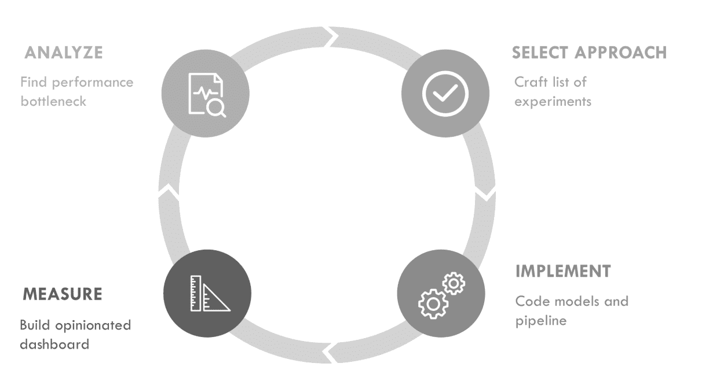

# 第三部分：对模型进行迭代

第 I 部分涵盖了设置机器学习项目并跟踪其进展的最佳实践。在第 II 部分中，我们了解了尽可能快速地构建端到端管道以及探索初步数据集的价值。

由于机器学习（ML）具有实验性特质，它是一个高度迭代的过程。你应该计划对模型和数据进行反复迭代，遵循如图 III-1 所示的实验循环。

###### 图 III-1。机器学习循环

第 III 部分将描述一次迭代循环的过程。在进行机器学习项目时，你应该计划进行多个这样的迭代，才有望达到令人满意的性能。以下是本部分各章的概述：

第 5 章

在本章中，我们将训练第一个模型并对其进行基准测试。然后，深入分析其性能并识别可以改进的方面。

第 6 章

本章介绍了快速构建和调试模型的技术，并避免耗时的错误。

第 7 章

在本章中，我们将使用机器学习编辑器作为案例研究，展示如何利用一个训练好的分类器向用户提供建议，并构建一个功能完整的建议模型。
