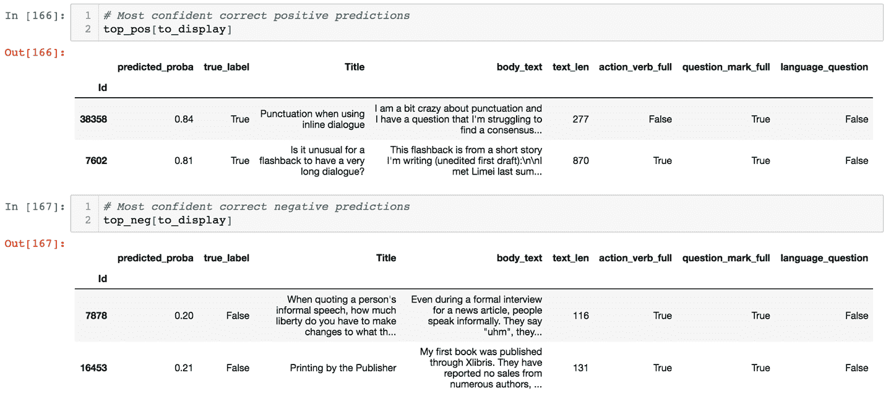

# 第五章：训练和评估你的模型

在之前的章节中，我们已经介绍了如何识别要解决的正确问题，制定解决方案的计划，构建一个简单的流水线，探索数据集，并生成一组初始特征。这些步骤已经为我们收集到足够的信息，以开始训练一个适当的模型。这里的适当模型意味着适合当前任务并有良好表现机会的模型。

在本章中，我们将首先简要讨论选择模型时的一些注意事项。然后，我们将描述最佳实践来分离你的数据，这将有助于在真实条件下评估你的模型。最后，我们将探讨分析建模结果和诊断错误的方法。

# 最简单合适的模型

现在我们准备训练模型了，我们需要决定从哪个模型开始。或许尝试每个可能的模型、对它们进行基准测试，然后根据一些指标在一个保留的测试集上选择表现最好的那个模型，这看起来很诱人。

总的来说，这并不是最佳方法。它不仅计算密集（有许多模型集和每个模型的许多参数，所以实际上你只能测试一个次优子集），而且将模型视为预测性黑匣子，并完全忽略了*机器学习模型在学习方式中对数据的隐含假设*。

不同的模型对数据有不同的假设，因此适合不同的任务。此外，由于机器学习是一个迭代的领域，你会想要选择可以快速构建和评估的模型。

让我们首先定义如何识别简单模型。然后，我们将涵盖一些数据模式的示例和适合利用它们的模型。

## 简单模型

一个简单的模型应该快速实现，易于理解和可部署：快速实现是因为你的第一个模型可能不是最后一个，易于理解是因为这将让你更容易调试它，可部署是因为这是一个基本要求，适用于基于机器学习的应用程序。让我们首先探索我所说的快速实现是什么意思。

### 快速实现

选择一个对你来说实现简单的模型。通常，这意味着选择一个大家对其有很多教程并且愿意帮助你的广为人知的模型（特别是如果你能用我们的 ML 编辑器提出形式良好的问题的话！）。对于一个新的基于机器学习的应用程序来说，在处理数据和部署可靠结果方面已经有足够的挑战，所以你最初应尽量避免所有模型问题。

如果可能的话，首先使用来自流行库如 Keras 或 scikit-learn 的模型，然后在深入研究那些没有文档且在过去九个月内没有更新的实验性 GitHub 存储库之前保留观望。

一旦您的模型实施完成，您将希望检查并理解它如何利用您的数据集。为此，您需要一个可以理解的模型。

### 可理解的

模型的*可解释性*和*解释性*描述了模型暴露出导致其进行预测的原因的能力（例如给定的预测器组合）。解释性对于多种原因非常有用，例如验证我们的模型没有以不希望的方式偏见，或向用户解释他们可以做什么来改善预测结果。它还使迭代和调试变得更加容易。

如果您可以提取模型依赖于做出决策的特征，您将更清楚地了解哪些特征可以添加、调整或删除，或者哪个模型可以做出更好的选择。

不幸的是，即使对于简单模型，模型可解释性通常也很复杂，对于较大的模型有时甚至无法解决。在“评估特征重要性”中，我们将看到解决这一挑战的方法，帮助您识别模型改进的要点。除其他事项外，我们将使用黑盒解释器，试图提供模型预测的解释，而不考虑其内部运作方式。

简单模型如逻辑回归或决策树往往更容易解释，因为它们提供了某种程度的特征重要性，这也是它们通常是首选的模型之一的原因。

### 可部署的

作为提醒，您模型的最终目标是为将要使用它的人们提供有价值的服务。这意味着当您考虑要训练哪种模型时，您应始终考虑是否能够部署它。

我们将在第四部分介绍部署，但您应该已经在考虑以下问题：

+   训练模型为用户做出预测需要多长时间？在考虑预测延迟时，您应该包括不仅模型输出结果所需的时间，还包括用户提交预测请求和接收结果之间的延迟。这包括任何预处理步骤，如特征生成，任何网络调用，以及在模型输出和呈现给用户的数据之间发生的任何后处理步骤。

+   如果考虑到我们预期的并发用户数量，这个推理管道是否足够快速？

+   训练模型需要多长时间，以及我们需要多频繁地进行训练？如果训练需要 12 小时，而您需要每 4 小时重新训练模型以保持新鲜，不仅计算成本会很昂贵，而且您的模型将永远处于过时状态。

我们可以通过使用诸如图 5-1 的表格来比较简单模型的情况。随着机器学习领域的发展和新工具的建立，今天可能复杂或难以解释的模型未来可能变得更容易使用，因此这个表格需要定期更新。基于这个原因，我建议您根据您特定的问题领域建立自己的版本。


###### 图 5-1\. 基于简易性评分模型

即使在简单、可解释和可部署的模型中，仍然有许多潜在的候选项。为了选择一个模型，您还应考虑在第四章中识别出的模式。

## 从模式到模型

我们已经识别出的模式和我们生成的特征应该指导我们选择模型。让我们来看几个数据中的模式和适当的模型示例，以利用它们。

### 我们希望忽略特征尺度

许多模型会更加重视较大的特征而忽略较小的特征。在某些情况下这是可以接受的，但在其他情况下可能不合适。对于使用梯度下降等优化程序的模型（如神经网络），特征尺度的差异有时会导致训练过程的不稳定性。

如果您希望同时使用年龄（从一到一百岁）和收入（假设我们的数据高达九位数）作为两个预测变量，您需要确保您的模型能够利用最具预测性的特征，而不受其尺度影响。

通过预处理特征以使其标准化到零均值和单位方差，可以确保这一点。如果所有特征都被归一化到相同的范围，模型将最初视每个特征为平等重要。

另一种解决方案是使用不受特征尺度差异影响的模型。最常见的实际例子是决策树、随机森林和梯度提升决策树。[XGBoost](https://oreil.ly/CWpnk) 是一种常用的梯度提升树实现，在生产环境中因其稳健性和速度而广泛使用。

### 我们的预测变量是预测因子的线性组合

有时候，我们有充分理由相信，只使用特征的线性组合就可以做出良好的预测。在这些情况下，我们应该使用像线性回归这样的线性模型来处理连续性问题，或者像逻辑回归或朴素贝叶斯分类器这样的模型来解决分类问题。

这些模型简单高效，并且通常允许直接解释其权重，有助于我们识别重要特征。如果我们认为特征与预测变量之间的关系更复杂，可以使用非线性模型，如多层神经网络或生成特征交叉（见“让数据驱动特征和模型”的开始）。

### 我们的数据具有时间性

如果我们处理的是数据点的时间序列，其中给定时间点的值依赖于先前的值，我们将希望利用能够显式编码此信息的模型。此类模型的示例包括统计模型，如自回归积分移动平均（ARIMA）或递归神经网络（RNN）。

### 每个数据点都是模式的组合

当处理图像域中的问题时，例如卷积神经网络（CNN）通过其学习*平移不变滤波器*的能力已被证明是有用的。这意味着它们能够提取图像中的局部模式，而不考虑它们的位置。一旦 CNN 学会了如何检测眼睛，它就可以在图像的任何位置检测到它，而不仅仅是在训练集中出现的位置。

卷积滤波器已被证明在其他包含局部模式的领域中非常有用，例如语音识别或文本分类，CNN 已成功用于句子分类。例如，可以参考 Yoon Kim 在论文中的实现，[“用于句子分类的卷积神经网络”](https://arxiv.org/abs/1408.5882)。

在考虑使用正确的模型时，还有许多其他要考虑的因素。对于大多数经典机器学习问题，我建议使用这个便捷的[流程图](https://oreil.ly/tUsD6)，这是 scikit-learn 团队提供的有用参考。它为许多常见用例提供了模型建议。

### ML 编辑器模型

对于 ML 编辑器，我们希望我们的第一个模型快速且相对容易调试。此外，我们的数据由个别示例组成，无需考虑时间方面的因素（例如一系列问题）。因此，我们将从一个流行且有韧性的基准开始，即随机森林分类器。

一旦您确定了一个看起来合理的模型，就该是训练它的时候了。作为一般指导方针，您不应该在您在第四章中收集的整个数据集上训练模型。您需要从训练集中保留一些数据。让我们来看看为什么以及如何做到这一点。

## 分割您的数据集

我们模型的主要目标是为我们的用户提交的数据提供有效的预测。这意味着我们的模型最终将必须在它*以前从未见过的数据*上表现良好。

当您在数据集上训练模型时，仅在相同数据集上测量其性能只能告诉您它在已经看过的数据上进行预测的能力有多好。如果您仅在数据的子集上训练模型，然后可以使用模型未经训练的数据来估计其在未见数据上的表现。

在图 5-2 中，您可以看到一个基于数据集的属性（问题的作者）将数据集分割成三个单独的集合（训练集、验证集和测试集）的示例。在本章中，我们将介绍每个集合的含义以及如何考虑它们。


###### 图 5-2\. 在保留作者数据的同时将问题正确分配到每个拆分的示例

要考虑的第一个保留集是验证集。

### 验证集

为了估计我们的模型在未见数据上的表现，我们有意地从训练集中保留部分数据集，然后使用这个保留的数据集的性能作为我们模型在生产中表现的代理。保留的集合允许我们验证我们的模型能够推广到未见数据，因此通常称为*验证集*。

您可以选择数据的不同部分作为验证集来评估您的模型，并在剩余数据上训练它。执行此过程的多轮有助于控制由于特定验证集选择而引起的任何方差，这称为*交叉验证*。

当您更改数据预处理策略、使用的模型类型或其超参数时，您的模型在验证集上的表现将会改变（并且理想情况下会改善）。使用验证集允许您像使用训练集调整模型参数一样调整超参数。

在多次迭代使用验证集进行模型调整后，您的建模流程可能会专门针对在验证数据上表现良好。这违背了验证集的目的，即应该是未见数据的代理。因此，您应该保留一个额外的测试集。

### 测试集

因为我们将在模型上进行多次迭代循环，并在每个周期中测量其在验证集上的表现，所以我们可能会偏向于使模型在验证集上表现良好。这有助于我们的模型推广超出训练集，但也存在仅仅学习在特定验证集上表现良好的模型的风险。理想情况下，我们希望拥有一个在新数据上表现良好的模型，因此不包含在验证集中。

因此，通常我们会保留第三个称为*测试集*的数据集，这将作为我们在满意迭代后对未见数据性能的最终基准。虽然使用测试集是最佳实践，但从业者有时会将验证集作为测试集使用。这增加了使模型偏向验证集的风险，但在仅运行少量实验时可能是合适的。

避免使用测试集上的表现来指导建模决策非常重要，因为这个数据集应该代表我们在生产中将面对的未见数据。调整建模方法以在测试集上表现良好会增加高估模型性能的风险。

要让模型在生产中表现良好，你训练的数据应该与将与产品互动的用户生成的数据相似。理想情况下，你从用户那里接收到的任何数据类型都应该在你的数据集中有所体现。如果不是这样的话，那么请记住，你的测试集表现只能反映出部分用户的表现。

对于 ML 编辑器来说，这意味着不符合*writers.stackoverflow.com*的人群可能无法得到我们的推荐服务。如果我们想要解决这个问题，我们应该扩展数据集，包含更多符合这些用户的问题。我们可以从其他 Stack Exchange 网站收录问题，以涵盖更广泛的主题，或者选择完全不同的问答网站。

对于一个旁边的项目来说，对数据集进行这样的修正可能具有挑战性。然而，在构建消费级产品时，有必要在用户接触到之前帮助模型的弱点被早期捕捉。我们将在第八章中涵盖的许多失败模式可以通过更具代表性的数据集来避免。

### 相对比例

总体而言，你应该最大化模型可以学习的数据量，同时保留足够大的验证和测试集来提供准确的性能指标。实践者通常使用数据的 70%进行训练，20%进行验证，10%进行测试，但这完全取决于数据的量。对于非常大的数据集，你可以负担得起使用更大比例的数据进行训练，同时仍有足够的数据来验证模型。对于较小的数据集，你可能需要使用较小比例的数据进行训练，以便拥有足够大的验证集来提供准确的性能测量。

现在你知道为什么要分割数据，以及应该考虑哪些分割方法，但是你应该如何决定哪个数据点放入每个分割中呢？你使用的分割方法对建模性能有重大影响，并且应该依赖于数据集的特定特征。

### 数据泄露

你用来分离数据的方法是验证的一个关键部分。你应该努力使你的验证/测试集与你预期的未见数据尽可能接近。

大多数情况下，训练集、验证集和测试集是通过随机抽样数据点来分离的。在某些情况下，这可能会导致*数据泄露*。数据泄露发生在（由于我们的训练过程）模型在训练期间接收到了在实际使用时不会访问到的信息。

数据泄露必须尽量避免，因为它会导致我们模型性能的夸大看法。在数据集中训练的模型存在数据泄露时，可以利用信息进行预测，而当它遇到不同的数据时，这些信息是不可得的。这使得模型的任务在保留数据上看起来人为更容易，但这仅仅是由于泄露的信息。模型在保留数据上的性能表现很高，但在生产中会差得多。

在图 5-3 中，我画出了几种常见的情况，随机将数据分割为集合会导致数据泄露。数据泄露有许多潜在原因，接下来我们将探讨两种常见的情况。

为了开始我们的探索，让我们先看看图 5-3 顶部的例子，即时间数据泄露。接着，我们将转向样本污染，这是包含在图 5-3 底部两个例子中的一类。


###### 图 5-3\. 随机分割数据通常会导致数据泄露

#### 时间数据泄露

在时间序列预测中，模型需要从过去的数据点学习，以预测尚未发生的事件。如果我们对预测数据集进行随机拆分，我们将引入数据泄露：一个在随机点集上训练并在剩余点上评估的模型将可以访问在其试图预测的事件*之后*发生的训练数据。

该模型在验证集和测试集上的表现会人为地非常好，但在生产环境中会失败，因为它所学到的都是利用未来信息，而在真实世界中这些信息是不可用的。

一旦你意识到了它，时间数据泄露通常很容易被发现。其他类型的数据泄露可能会使模型在训练过程中获得不应该有的信息，并通过“污染”其训练数据来人为地提高其性能。它们通常更难检测到。

#### 样本污染

数据泄露的一个常见来源在于随机性发生的层次。当建立一个预测学生文章评分的模型时，一位我曾经协助的数据科学家发现他的模型在一个保留测试集上表现接近完美。

在这样一个艰巨的任务上，一个表现如此优秀的模型应该进行仔细检查，因为这通常表明管道中存在错误或*数据泄露*。有人说，机器学习中墨菲定律的等效物是，当你对模型在测试数据上的表现感到愉快惊讶时，你越有可能在流程中有错误。

在这个例子中，因为大多数学生写了多篇文章，随机分割数据导致了同一学生的文章同时出现在训练集和测试集中。这使得模型能够捕捉到识别学生的特征，并利用这些信息进行准确预测（这个数据集中的学生倾向于在所有文章中有类似的成绩）。

如果我们要部署这个文章评分预测器以便将来使用，它将无法为它之前没有见过的学生预测有用的分数，并且只会为那些它已经训练过的学生预测历史分数。这将毫无用处。

在这个例子中解决数据泄露的方法是，在学生而不是文章级别进行新的分割。这意味着每个学生只出现在训练集或验证集中的其中一个。由于任务变得更加困难，这导致了模型准确性的降低。然而，由于训练任务现在更接近于生产环境，这个新模型变得更有价值。

在常见任务中，样本污染可能以微妙的方式发生。让我们以公寓租赁预订网站为例。该网站整合了点击预测模型，根据用户查询和项目，预测用户是否会点击项目。该模型用于决定向用户展示哪些房源。

要训练这样的模型，该网站可以使用用户特征数据集，例如他们的先前预订次数，与展示给他们的公寓以及他们是否点击了它们。这些数据通常存储在可以查询以生成这些配对的生产数据库中。如果该网站的工程师仅仅是查询数据库来构建这样的数据集，他们可能会面临数据泄露的情况。你能看出原因吗？

在图 5-4 中，我勾画了一个针对特定用户的预测的插图，说明了可能出错的情况。在顶部，你可以看到模型在生产中可能使用的特征。在这里，一个没有先前预订的新用户被呈现给一个特定的公寓。在底部，你可以看到几天后工程师从数据库中提取数据时特征的状态。


###### 图 5-4。数据泄露可能出现在微妙的原因，比如由于缺乏数据版本控制。

注意 `previous_bookings` 的差异，这是由于用户在最初看到列表后发生的活动造成的。通过使用数据库的快照，用户未来的行为信息泄漏到了训练集中。我们现在知道用户最终将预订五套公寓！这种泄漏可能导致模型在不正确的训练数据上进行正确预测。模型在生成的数据集上的准确率会很高，因为它利用了生产环境中无法访问的数据。当模型部署后，其性能将低于预期。

如果你从这个轶事中学到了什么，那就是要始终调查模型的结果，特别是如果它显示出令人惊讶的强大性能。

## ML Editor 数据分割

我们用来训练我们的 ML Editor 的数据集包含在 Stack Overflow 上提出的问题及其答案。乍一看，随机分割似乎足够，并且在 scikit-learn 中实现起来非常简单。例如，我们可以编写如下所示的函数：

```
from sklearn.model_selection import train_test_split

def get_random_train_test_split(posts, test_size=0.3, random_state=40):
    """
 Get train/test split from DataFrame
 Assumes the DataFrame has one row per question example
 :param posts: all posts, with their labels
 :param test_size: the proportion to allocate to test
 :param random_state: a random seed
 """
    return train_test_split(
        posts, test_size=test_size, random_state=random_state
    )
```

这种方法存在潜在的泄漏风险；你能识别出它吗？

如果我们回顾一下我们的使用案例，我们知道我们希望我们的模型能够处理以前没有见过的问题，只看其内容。然而，在问答网站上，许多其他因素可能影响问题是否成功得到回答。其中一个因素是作者的身份。

如果我们随机分割数据，某个作者可能同时出现在我们的训练集和验证集中。如果某些知名作者具有独特的风格，我们的模型可能会在验证集上因数据泄漏而过度拟合到这种风格，并达到人为高的性能。为了避免这种情况，最好确保每个作者只出现在训练集或验证集中。这与之前描述的学生分级示例中描述的泄漏类型相同。

使用 scikit-learn 的 `GroupShuffleSplit` 类，并将表示作者唯一 ID 的特征传递给其分割方法，我们可以保证给定作者仅出现在其中一个分割中。

```
from sklearn.model_selection import GroupShuffleSplit

def get_split_by_author(
    posts, author_id_column="OwnerUserId", test_size=0.3, random_state=40
):
    """
 Get train/test split
 Guarantee every author only appears in one of the splits
 :param posts: all posts, with their labels
 :param author_id_column: name of the column containing the author_id
 :param test_size: the proportion to allocate to test
 :param random_state: a random seed
 """
    splitter = GroupShuffleSplit(
        n_splits=1, test_size=test_size, random_state=random_state
    )
    splits = splitter.split(posts, groups=posts[author_id_column])
    return next(splits)
```

要查看两种分割方法之间的比较，请参考这本书的 GitHub 存储库中的分割数据笔记本。

一旦数据集被分割，模型就可以拟合到训练集中。我们已经在 “从简单的流水线开始” 中覆盖了训练流水线的必要部分。在本书的 GitHub 存储库中的简单模型笔记本的训练中，我展示了一个端到端的训练流水线示例。我们将分析这个流水线的结果。

我们已经覆盖了我们在分割数据时要牢记的主要风险，但是一旦我们的数据集被分割并且我们在训练分割上训练了一个模型，我们应该做些什么呢？在下一节中，我们将讨论评估训练模型的不同实用方法以及如何最好地利用它们。

## 评估性能

现在我们已经分割了我们的数据，我们可以训练我们的模型并评估其表现。大多数模型被训练来最小化成本函数，该函数代表模型预测与真实标签的偏离程度。成本函数的值越小，模型对数据的拟合越好。你要最小化的具体函数取决于你的模型和问题，但总体来说，查看它在训练集和验证集上的值通常是个好主意。

这通常有助于估计我们模型的*偏差-方差权衡*，即衡量我们的模型在多大程度上从数据中学习到了有价值且可推广的信息，而不是记住训练集的细节。

###### 注意

我假设你对标准分类指标很熟悉，但万一你不熟悉，这里是一个简短的提醒。对于分类问题，准确率表示模型正确预测的示例比例。换句话说，它是真实结果的比例，即真正例和真负例的比例。在存在严重不平衡的情况下，高准确率可能掩盖了模型的糟糕表现。如果 99%的情况都是正例，一个总是预测正类的模型将具有 99%的准确率，但可能并不是很有用。精确率、召回率和 f1 分数解决了这个问题。精确率是预测为正类的示例中真正例的比例。召回率是真正例在所有标签为正的元素中的比例。f1 分数是精确率和召回率的调和平均。

在[这本书的 GitHub 仓库](https://oreil.ly/ml-powered-applications)中，我们训练了一个简单模型笔记本的训练过程，使用了 TF-IDF 向量和我们在“ML 编辑器特性”中确定的特征，训练了第一个随机森林版本。

这里是我们训练集和验证集的准确率、精确率、召回率和 f1 分数。

```
Training accuracy = 0.585, precision = 0.582, recall = 0.585, f1 = 0.581
Validation accuracy = 0.614, precision = 0.615, recall = 0.614, f1 = 0.612
```

通过快速查看这些指标，我们可以注意到两件事情：

+   由于我们有一个由两个类组成的平衡数据集，对每个示例随机选择一个类别会给我们大约 50%的准确率。我们模型的准确率达到了 61%，比随机基线要好。

+   我们在验证集上的准确率高于训练集。看来我们的模型在未见过的数据上表现良好。

让我们深入了解模型的表现更多细节。

### 偏差方差权衡

训练集上的性能差表明存在高偏差，也称为*欠拟合*，这意味着模型未能捕捉到有用的信息：它甚至不能在它已经知道标签的数据点上表现良好。

训练集表现强劲但验证集表现疲软是高方差的症状，也称为*过拟合*，意味着模型已经找到了学习输入/输出映射的方法，但它所学习的内容并不能泛化到未见数据。

欠拟合和过拟合是偏差-方差权衡的两个极端情况，描述了模型在复杂度增加时错误类型的变化。随着模型复杂度的增加，方差增加而偏差减少，模型由欠拟合逐渐转变为过拟合。你可以在图 5-5 中看到这一点。


###### 图 5-5\. 随着复杂度增加，偏差减少但方差也增加

在我们的情况下，由于验证性能优于训练性能，我们可以看出模型没有过度拟合训练数据。我们可能可以增加模型的复杂度或特征以改善性能。应对偏差-方差权衡需要找到在减少偏差（提高模型在训练集上的性能）和减少方差（提高模型在验证集上的性能，通常作为副产品恶化训练性能）之间的最佳点。

性能指标有助于生成模型性能的整体视角。这对猜测模型的表现很有帮助，但并不能提供对模型在具体方面成功或失败的深刻理解。要改进我们的模型，我们需要深入挖掘。

### 超越汇总指标

性能度量帮助确定模型是否从数据集中正确学习，或者是否需要改进。下一步是进一步检查结果，以了解模型是失败还是成功的方式。这一点至关重要，原因有两个：

性能验证

性能指标可能非常具有误导性。在处理严重不平衡数据（例如预测少于 1% 患者中出现的罕见疾病）的分类问题时，任何总是预测患者健康的模型将达到 99% 的准确率，尽管它根本没有预测能力。大多数问题适用的性能指标（[f1 分数](https://oreil.ly/fQAq9) 对于前述问题更合适），但关键是要记住它们是汇总指标，描绘了情况的不完整图景。要信任模型的性能，需要在更细粒度的水平上检查结果。

迭代

模型构建是一个迭代过程，开始迭代循环的最佳方式是确定需要改进的内容及其改进方法。性能指标不能帮助确定模型在哪些方面存在问题，以及管道的哪一部分需要改进。我经常看到数据科学家仅仅通过尝试许多其他模型或超参数，或者随意构建额外特征来试图提高模型性能。这种方法就像闭着眼睛往墙上扔飞镖一样。快速构建成功模型的关键是识别和解决模型失败的具体原因。

在考虑这两个动机的基础上，我们将介绍几种深入了解模型性能的方法。

# 评估您的模型：超越准确率

有很多方法可以检查模型的表现，我们不会涵盖每种潜在的评估方法。我们将专注于一些通常有助于挖掘潜在问题的方法。

当涉及调查模型性能时，把自己想象成侦探，每种涵盖的方法都是揭示线索的不同方式。我们将首先介绍多种技术，通过对比模型预测与数据来发现有趣的模式。

## 对比数据和预测

深入评估模型的第一步是找到比聚合指标更细粒度的方式，以对比数据和预测。我们希望分析不同数据子集上的聚合性能指标，例如分类中的准确率、精确率或召回率。让我们看看如何针对常见的机器学习挑战来实现这一点。

您可以在[该书的 GitHub 代码库](https://oreil.ly/ml-powered-applications)的“将数据与预测进行比较”笔记本中找到所有代码示例。

对于分类问题，我通常建议首先查看混淆矩阵，显示在图 5-6 中，其行表示每个真实类别，列表示我们模型的预测。一个预测完美的模型将拥有一个只有对角线上非零的混淆矩阵。然而在现实中，这种情况很少见。让我们看看为什么混淆矩阵通常非常有用。

## 混淆矩阵

混淆矩阵能够让我们一眼看出模型在某些类别上是否特别成功，而在其他类别上是否有困难。这对于包含许多不同类别或类别不平衡的数据集尤其有用。

我经常看到那些准确率惊人的模型展示一个完全空的列的混淆矩阵，这意味着有一个模型从不预测的类别。这通常发生在稀有类别上，并且有时是无害的。然而，如果稀有类别代表一个重要的结果，比如借款人违约，混淆矩阵将帮助我们注意到问题。我们可以通过在模型损失函数中更加重视稀有类别来纠正这一问题，例如。

图 5-6 的顶行显示，我们训练的初始模型在预测低质量问题时表现良好。底行显示，模型在检测所有高质量问题方面存在困难。确实，在所有得分高的问题中，我们的模型只有一半时间正确预测其类别。然而，观察右列，我们可以看到当模型预测问题是高质量时，其预测往往是准确的。

混淆矩阵在处理多类问题时尤为有用。例如，我曾与一名工程师合作，他试图对语音中的单词进行分类，并绘制了最新模型的混淆矩阵。他立即注意到两个对称的非对角线数值异常高。这两个类别（每个代表一个单词）混淆了模型，并导致了大部分错误的原因。进一步检查后发现，混淆模型的单词是*when*和*where*。为这两个示例收集额外数据足以帮助模型更好地区分这些听起来相似的单词。

混淆矩阵允许我们将模型的预测与每个类别的真实类别进行比较。在调试模型时，我们可能希望深入查看模型输出的概率，而不仅仅是它们的预测结果。


###### 图 5-6\. 我们问题分类任务的初始基线混淆矩阵

## ROC 曲线

对于二元分类问题，接收者操作特征（ROC）曲线也可以提供非常有用的信息。ROC 曲线将真正率（TPR）作为误报率（FPR）的函数进行绘制。

在分类中使用的绝大多数模型返回一个给定示例属于某一类的概率分数。这意味着在推断时，如果模型给出的概率高于某个阈值，我们可以选择将示例归属于某一类。这通常称为*决策阈值*。

大多数分类器默认使用 50%的概率作为决策阈值，但这是可以根据我们的用例进行更改的。通过定期从 0 到 1 变化阈值，并在每个点测量 TPR 和 FPR，我们得到一个 ROC 曲线。

一旦我们有了模型的预测概率和相关的真实标签，使用 scikit-learn 简单地获取 FPR 和 TPR，然后生成 ROC 曲线。

```
from sklearn.metrics import roc_curve

fpr, tpr, thresholds = roc_curve(true_y, predicted_proba_y)
```

了解 ROC 曲线的两个重要细节，例如在图 5-7 中绘制的那条。首先，沿着从左下到右上的对角线表示随机猜测。这意味着为了超越随机基线，分类器/阈值对应应该在这条线的上方。此外，完美模型将由左上角的绿色虚线表示。


###### 图 5-7\. 初始模型的 ROC 曲线

由于这两个细节，分类模型通常使用曲线下面积（AUC）来表示性能。AUC 越大，我们的分类器就越接近“完美”模型。随机模型的 AUC 为 0.5，而完美模型的 AUC 为 1。然而，在考虑实际应用时，我们应选择一个特定的阈值，以获得对我们用例最有用的 TPR/FPR 比率。

因此，我建议在 ROC 曲线上添加垂直或水平线，以表示我们的产品需求。在构建一个系统，如果认为紧急情况足够紧急，则将客户请求路由到员工的情况下，您能够承受的 FPR 完全由您支持人员的能力和您拥有的用户数量决定。这意味着任何 FPR 高于该限制的模型都不应被考虑。

在 ROC 曲线上绘制一个阈值使您可以设定一个比仅仅获取最大 AUC 分数更具体的目标。确保您的努力能够达到您的目标！

我们的 ML 编辑器模型将问题分类为好的或坏的。在这种情况下，TPR 表示我们的模型正确判断为好的高质量问题的比例。FPR 是我们的模型声称是好问题的坏问题的比例。如果我们不能帮助我们的用户，那么我们至少希望不要伤害他们。这意味着我们不应使用任何可能频繁推荐坏问题的模型。因此，我们应该设置一个 FPR 的阈值，例如 10%，并使用我们能找到的在该阈值以下的最佳模型。在图 5-8 中，您可以看到这一要求在我们的 ROC 曲线上的表示；这显著减少了适用于模型的可接受决策阈值的空间。

ROC 曲线为我们提供了一个更细致的视角，显示了模型在我们使其预测更保守或更激进时的性能变化。观察模型的预测概率分布与真实类分布的比较是另一种方式，用于检查其是否校准良好。


###### 图 5-8\. 添加表示我们产品需求的 ROC 线条

## 校准曲线

校准图是二元分类任务中另一个信息丰富的图表，因为它可以帮助我们了解我们的模型输出的概率是否很好地代表了其置信度。校准图显示了我们分类器的置信度作为真正例子的分数的函数。

例如，我们的分类器对所有数据点都给出了高于 80%的正分类概率，其中有多少数据点实际上是正的？一个完美模型的校准曲线将是一个从左下到右上的对角线。

在图 5-9 中，我们可以看到在顶部，我们的模型在 0.2 到 0.7 之间的校准很好，但在该范围之外的概率上并不好。在下面查看预测概率直方图，我们可以看出，我们的模型很少预测超出该范围的概率，这可能导致之前显示的极端结果。该模型对其预测很少有信心。


###### 图 5-9\. 校准曲线：对角线代表一个完美的模型（顶部）；预测值的直方图（底部）

对于许多问题，例如在广告投放中预测点击率，当概率接近 0 或 1 时，数据将导致我们的模型相当倾斜，而校准曲线将帮助我们一目了然地看到这一点。

为了诊断模型的性能，可视化单个预测结果非常有价值。让我们讨论一些方法来使这个可视化过程更加高效。

## 错误的降维

我们在“向量化”和“降维”章节描述了数据探索中的向量化和降维技术。让我们看看这些技术如何用于使错误分析更加高效。

当我们首次介绍如何使用降维方法来可视化数据时，我们通过其类别对数据集中的每个点进行了颜色标记，以观察标签的拓扑结构。在分析模型错误时，我们可以使用不同的颜色方案来识别错误。

要识别错误趋势，可以根据模型预测的准确性对每个数据点进行颜色标记。这样可以帮助您找出模型在哪些类型的相似数据点上表现不佳。一旦确定了模型表现不佳的区域，可以对其中的几个数据点进行可视化。可视化难例是生成能帮助模型更好拟合这些例子中所表示特征的一种很好的方式。

为了帮助发现难例中的趋势，还可以使用来自“聚类”的聚类方法。在对数据进行聚类后，评估模型在每个簇上的性能，并识别模型表现最差的簇。检查这些簇中的数据点可以帮助您生成更多的特征。

降维技术是浮现挑战性示例的一种方式。为此，我们还可以直接使用模型的置信度分数。

## Top-k 方法

找到密集错误区域有助于识别模型的失败模式。在上文中，我们使用降维技术帮助我们找到这些区域，但我们也可以直接使用模型本身。通过利用预测概率，我们可以识别模型最具挑战性或最不确定的数据点。让我们称这种方法为 *top-k 方法*。

Top-k 方法很直接。首先，选择一些易于可视化的示例，我们将其称为 k。对于单人进行的个人项目，建议从十到十五个示例开始。对于您先前找到的每个类别或聚类，请进行可视化：

+   最优表现的 k 个示例

+   最差表现的 k 个示例

+   最不确定的 k 个示例

通过可视化这些示例，您可以识别模型认为易、难或令人困惑的示例。让我们更详细地探讨每个类别。

### 最优表现的 k 个示例

首先，显示模型预测正确且最有信心的 k 个示例。在可视化这些示例时，目标是识别它们之间的特征值共性，以解释模型的性能。这将帮助您识别模型成功利用的特征。

在可视化成功示例以识别模型利用的特征后，再绘制不成功的示例以识别模型未能捕捉到的特征。

### 最差表现的 k 个示例

显示模型预测错误且最有信心的 k 个示例。首先使用训练数据中的 k 个示例，然后再使用验证数据。

就像可视化错误聚类一样，通过可视化模型在训练集中表现最差的 k 个示例，可以帮助识别模型失败的数据点的趋势。显示这些数据点以帮助您识别能够使模型更轻松的其他特征。

当探索 ML 编辑器的初始模型错误时，例如，我发现一些发布的问题由于没有包含实际问题而得分低。初始模型无法预测这些“非问题”问题，因此我添加了一个功能来计算文本主体中的问号数。添加此功能使得模型能够准确预测这些问题。

可视化验证数据中最差的 k 个示例有助于识别与训练数据显著不同的示例。如果您在验证集中确实识别出太难的示例，请参考“分割数据集”中的提示更新您的数据分割策略。

最后，模型并非始终自信地正确或错误；它们也可能输出不确定的预测。接下来我将介绍这些情况。

### 最不确定的 k 个示例

可视化最不确定的 k 个示例包括显示模型在其预测中最不自信的示例。对于本书主要关注的分类模型，不确定的示例是模型对每个类输出尽可能接近相等概率的示例。

如果模型经过良好的校准（参见“校准曲线”以了解校准的解释），它将为人工标注员也会不确定的示例输出均匀的概率。例如，对于猫与狗分类器，包含狗和猫的图片会属于这一类别。

在训练集中的不确定示例通常是冲突标签的症状。确实，如果训练集包含两个重复或相似的示例，每个示例被标记为不同的类，则当模型使用此示例时，为了最小化损失，它将为每个类输出相等的概率。因此，冲突标签会导致不确定的预测，您可以使用 top-k 方法来尝试找到这些示例。

绘制验证集中最不确定的 top-k 示例可以帮助找出训练数据中的差距。对于模型不确定但对于人工标注员明确的验证示例，通常表明模型在其训练集中未接触到这种数据类型。绘制验证集中最不确定的 top-k 示例可以帮助识别应该存在于训练集中的数据类型。

Top-k 评估可以以直接的方式实现。在下一节中，我将分享一个工作示例。

### Top-k 实现技巧

以下是与 pandas DataFrame 一起工作的简单的 top-k 实现。该函数以包含预测概率和标签的 DataFrame 作为输入，并返回每个 top-k 以上的结果。它可以在[这本书的 GitHub 仓库](https://oreil.ly/ml-powered-applications)中找到。

```
def get_top_k(df, proba_col, true_label_col, k=5, decision_threshold=0.5):
    """
 For binary classification problems
 Returns k most correct and incorrect example for each class
 Also returns k most unsure examples
 :param df: DataFrame containing predictions, and true labels
 :param proba_col: column name of predicted probabilities
 :param true_label_col: column name of true labels
 :param k: number of examples to show for each category
 :param decision_threshold: classifier decision boundary to classify as
 positive
 :return: correct_pos, correct_neg, incorrect_pos, incorrect_neg, unsure
 """
    # Get correct and incorrect predictions
    correct = df[
        (df[proba_col] > decision_threshold) == df[true_label_col]
    ].copy()
    incorrect = df[
        (df[proba_col] > decision_threshold) != df[true_label_col]
    ].copy()

    top_correct_positive = correct[correct[true_label_col]].nlargest(
        k, proba_col
    )
    top_correct_negative = correct[~correct[true_label_col]].nsmallest(
        k, proba_col
    )

    top_incorrect_positive = incorrect[incorrect[true_label_col]].nsmallest(
        k, proba_col
    )
    top_incorrect_negative = incorrect[~incorrect[true_label_col]].nlargest(
        k, proba_col
    )

    # Get closest examples to decision threshold
    most_uncertain = df.iloc[
        (df[proba_col] - decision_threshold).abs().argsort()[:k]
    ]

    return (
        top_correct_positive,
        top_correct_negative,
        top_incorrect_positive,
        top_incorrect_negative,
        most_uncertain,
    )
```

让我们通过 ML Editor 来说明 top-k 方法。

### ML Editor 的 top-k 方法

我们将应用 top-k 方法于我们训练的第一个分类器。关于 top-k 方法的使用示例的笔记本可以在[这本书的 GitHub 仓库](https://oreil.ly/ml-powered-applications)中找到。

图 5-10 显示了我们的第一个 ML Editor 模型每个类别最正确的前两个示例。两个类别之间最大的特征差异是`text_len`，表示文本的长度。分类器已学会好问题往往较长，而差问题较短。它严重依赖文本长度来区分类别。



###### 图 5-10\. 最正确的 top-k

图 5-11 证实了这一假设。我们的分类器预测未回答的问题最有可能被回答的是最长的问题，反之亦然。这一观察结果也证实了我们在“评估特征重要性”中发现的情况，即`text_len`是最重要的特征。


###### 图 5-11. 最不正确的 Top-k

我们已经确定分类器利用`text_len`轻松识别已回答和未回答的问题，但这个特征并不足够，会导致错误分类。我们应该添加更多特征来改进我们的模型。通过可视化超过两个示例可以帮助识别更多候选特征。

在训练和验证数据上使用 top-k 方法有助于确定我们模型和数据集的限制。我们已经讨论了它如何帮助确定模型是否具备表示数据的能力，数据集是否足够平衡以及是否包含足够的代表性示例。

我们主要讨论了分类模型的评估方法，因为这些模型适用于许多具体问题。让我们简要地看看在不进行分类时如何检查性能。

## 其他模型

许多模型可以使用分类框架进行评估。例如，在目标检测中，模型的目标是在图像中输出围绕感兴趣对象的边界框，准确率是常见的指标。由于每个图像可以有多个表示对象和预测的边界框，计算准确度需要额外的步骤。首先，计算预测和标签之间的重叠（通常使用[Jaccard 指数](https://oreil.ly/eklQm)）允许将每个预测标记为正确或不正确。然后，可以计算准确度并在本章节中使用所有先前的方法。

类似地，当构建旨在推荐内容的模型时，迭代的最佳方式通常是在各种类别上测试模型并报告其性能。评估过程类似于一个分类问题，其中每个类别代表一个类。

对于可能证明棘手的问题类型，例如生成模型，您仍然可以使用之前对数据的探索来将数据集分成多个类别，并为每个类别生成性能指标。

当我与一位数据科学家合作构建句子简化模型时，检查模型在句子长度条件下的表现显示，较长的句子对模型来说更加困难。这需要检查和手动标记，但却指明了明确的下一步行动，即通过增加包含长句子的训练数据来改善性能，这帮助显著提高了表现。

我们已经涵盖了许多检验模型性能的方法，通过将其预测与标签进行对比，但我们也可以检查模型本身。如果一个模型表现不佳，尝试解释其预测可能是值得的。

# 评估特征重要性

分析模型性能的另一种方法是检查模型用于进行预测的数据特征。这样做被称为特征重要性分析。评估特征重要性有助于消除或迭代当前对模型没有帮助的特征。特征重要性还可以帮助识别那些可疑预测的特征，这通常是数据泄漏的迹象。我们将首先为可以轻松生成特征重要性的模型生成特征重要性，然后涵盖那些直接提取这些特征可能不容易的情况。

## 直接从分类器获取

要验证模型是否正常工作，可视化模型正在使用或忽略的特征。对于简单模型如回归或决策树，通过查看模型的学习参数，可以直观地提取特征的重要性。

对于我们在 ML 编辑案例研究中使用的第一个模型，即随机森林，我们可以简单地使用 scikit-learn 的 API 来获取所有特征重要性的排名列表。特征重要性代码及其使用方法可以在[此书的 GitHub 仓库中的特征重要性笔记本](https://oreil.ly/ml-powered-applications)找到。

```
def get_feature_importance(clf, feature_names):
    importances = clf.feature_importances_
    indices_sorted_by_importance = np.argsort(importances)[::-1]
    return list(
        zip(
            feature_names[indices_sorted_by_importance],
            importances[indices_sorted_by_importance],
        )
    )
```

如果我们在训练好的模型上使用上述函数，并进行一些简单的列表处理，我们可以得到一个简单的十大最具信息量特征列表：

```
Top 10 importances:

text_len: 0.0091
are: 0.006
what: 0.0051
writing: 0.0048
can: 0.0043
ve: 0.0041
on: 0.0039
not: 0.0039
story: 0.0039
as: 0.0038
```

在这里需要注意几点：

+   文本长度是最具信息量的特征。

+   我们生成的其他特征根本不会出现，其重要性比其他特征低一个数量级以上。该模型无法利用它们有效地区分类别。

+   其他特征代表的是非常常见的词汇，或者与写作主题相关的名词。

因为我们的模型和特征都很简单，这些结果实际上可以给我们提供构建新特征的思路。例如，我们可以添加一个计数常见和罕见词汇使用情况的特征，以查看它们是否能预测答案得到高分。

如果特征或模型变得复杂，生成特征重要性需要使用模型可解释性工具。

## 黑盒解释器

当特征变得复杂时，特征的重要性可能变得更难解释。一些复杂模型如神经网络甚至可能无法公开其学习到的特征重要性。在这种情况下，利用黑盒解释器可能是有用的，它们试图独立解释模型的预测，而不关注其内部运作。

通常，这些解释器识别给定数据点上模型的预测特征，而不是全局性的。它们通过改变给定示例的每个特征值，并观察模型预测如何随之变化来实现这一点。[LIME](https://github.com/marcotcr/lime) 和 [SHAP](https://github.com/slundberg/shap) 是两种流行的黑盒解释器。

要了解如何使用这些的端到端示例，请参阅[书籍的 GitHub 仓库中的黑盒解释器笔记本](https://oreil.ly/ml-powered-applications)。

图 5-12 展示了由 LIME 提供的解释，说明了决定将这个示例问题分类为高质量的最重要单词。LIME 通过反复从输入问题中删除单词并观察哪些单词使我们的模型更倾向于一个类别而生成这些解释。


###### 图 5-12\. 解释一个特定的示例

我们可以看到，模型正确预测该问题将获得高分。然而，模型并不自信，仅输出 52%的概率。图 5-12 右侧显示了预测中最具影响力的单词。这些词似乎不应特别与问题高质量相关联，因此让我们查看更多示例，看看模型是否利用了更有用的模式。

要快速了解趋势，我们可以在更大的问题样本上使用 LIME。对每个问题运行 LIME 并汇总结果可以让我们了解我们的模型在整体上认为哪个词具有预测性来做出其决策。

在 图 5-13 中，我们绘制了数据集中 500 个问题的最重要预测。我们可以看到我们的模型倾向于利用常见单词的趋势在这个更大的样本中也很明显。看起来模型在推广到利用频繁单词之外时遇到了困难。表示稀有单词的词袋特征通常有零值。为了改进这一点，我们可以收集更大的数据集，让我们的模型接触更多样化的词汇，或者创建少量稀疏的特征。


###### 图 5-13\. 解释多个示例

你经常会对你的模型最终使用的预测器感到惊讶。如果某些特征对模型的预测比你预期的更具预测性，请尝试找到训练数据中包含这些特征的示例并检查它们。利用这个机会再次检查你如何分割你的数据集，并注意数据泄漏的情况。

例如，当构建一个模型自动将电子邮件根据其内容分类到不同主题时，有一次我在指导的机器学习工程师发现，最佳预测器是电子邮件顶部的一个三字母代码。结果发现这是数据集的内部代码，几乎完美地映射到了标签。模型完全忽略了电子邮件的内容，而是记忆了一个预先存在的标签。这是数据泄漏的一个明显例子，只有通过查看特征重要性才能发现。

# 结论

我们从覆盖到如何根据我们到目前为止学到的所有知识来决定初始模型的标准开始了本章。然后，我们讨论了将数据分割成多组的重要性，以及避免数据泄漏的方法。

训练了一个初始模型后，我们深入研究了如何评估其性能，通过不同的方式比较和对比其预测与数据。最后，我们检查了模型本身，显示了特征重要性，并使用黑盒解释器来直观地理解它用于预测的特征。

到现在为止，你应该对如何改进你的建模有了一些直觉。这将引导我们到第六章的话题，深入探讨我们在此处提到的问题处理方法，通过调试和故障排除机器学习管道。
