# 第六章：调试你的机器学习问题

在上一章中，我们训练并评估了我们的第一个模型。

将管道提升到令人满意的性能水平是困难的，并且需要多次迭代。本章的目标是引导你通过一个这样的迭代周期。在本章中，我将介绍调试建模管道的工具以及编写测试的方法，以确保一旦我们开始更改它们，它们仍然可以正常工作。

软件最佳实践鼓励从业者定期测试、验证和检查他们的代码，特别是对于诸如安全性或输入解析等敏感步骤。这对于机器学习同样适用，因为模型中的错误比传统软件更难检测。

我们将介绍一些技巧，帮助你确保你的管道是稳健的，并且你可以在不导致整个系统失败的情况下进行尝试，但首先让我们深入了解软件最佳实践！

# 软件最佳实践

对于大多数机器学习项目而言，你将重复构建模型、分析其缺陷并多次解决它们的过程。你还可能多次更改基础架构的每个部分，因此找到提高迭代速度的方法至关重要。

在机器学习项目中，就像在任何其他软件项目中一样，你应该遵循经过时间考验的软件最佳实践。其中大部分可以直接应用于机器学习项目而无需修改，比如只构建你所需的部分，通常被称为保持简单愚蠢（[KISS](https://oreil.ly/ddzav)）原则。

机器学习项目是迭代性质的，并且经历了许多不同的数据清理和特征生成算法以及模型选择的迭代过程。即使遵循了这些最佳实践，调试和测试仍然是减慢迭代速度的两个主要因素。加快调试和编写测试的速度对任何项目都会产生显著影响，但对于机器学习项目来说尤为重要，因为模型的随机性质往往会把一个简单的错误变成数天的调查。

存在许多资源可以帮助你学习如何调试通用程序，比如芝加哥大学的简明[调试指南](https://oreil.ly/xwfYn)。如果像大多数机器学习从业者一样，你的首选语言是 Python，我建议查阅 Python 文档中有关标准库调试器[pdb](https://oreil.ly/CBldR)的内容。

然而，与大多数软件不同的是，机器学习代码通常可能会表现得看似正确，但实际产生完全荒谬的结果。这意味着虽然这些工具和技巧可以直接应用于大多数机器学习代码，但它们并不足以诊断常见问题。我在图 6-1 中举例说明了这一点：在大多数软件应用中，强大的测试覆盖率可以让我们对应用程序的功能性有很高的信心，而机器学习管道可以通过许多测试，但仍然产生完全不正确的结果。一个机器学习程序不仅仅要运行——它应该产生准确的预测输出。

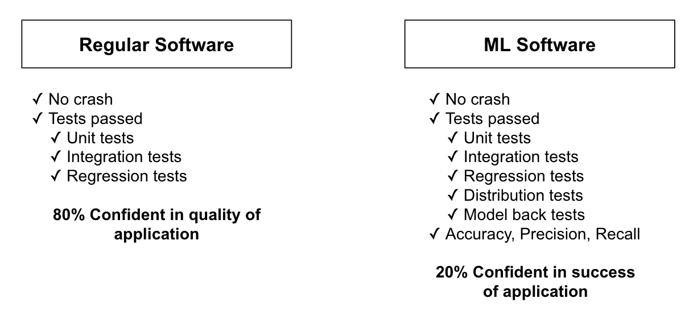

###### 图 6-1\. 一个机器学习管道可以执行无误，但仍可能是错误的

因为机器学习在调试时面临额外的一系列挑战，让我们讨论一些有助于解决这些问题的具体方法。

## 机器学习特定的最佳实践

对于机器学习而言，仅仅让程序端到端执行是不足以确信其正确性的。一个整个的管道可以运行无误地生成一个完全无用的模型。

假设你的程序加载数据并传递给模型。你的模型接受这些输入，并根据学习算法优化模型的参数。最后，你训练好的模型从另一组数据中产生输出。你的程序运行时没有显示任何 bug。问题在于，仅仅让程序运行，并不能保证你的模型预测是正确的。

大多数模型仅接受给定形状的数值输入（比如代表图像的矩阵），并输出不同形状的数据（例如输入图像中关键点的坐标列表）。这意味着，如果数据处理步骤在将数据传递给模型之前损坏了数据，大多数模型仍然可以运行，只要数据仍然是数值型的，并且是模型可以接受的形状。

如果你的建模管道表现不佳，你如何知道是模型质量不佳，还是在过程的早期阶段存在 bug？

在机器学习中解决这些问题的最佳方法是采用逐步的方法。首先验证数据流，然后是学习能力，最后是泛化和推断。图 6-2 展示了本章将涵盖的流程概述。

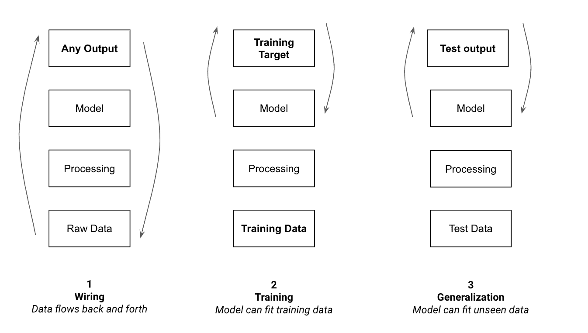

###### 图 6-2\. 调试管道的顺序

这一章将带领你逐步完成这三个步骤，并深入解释每一个步骤。当面对棘手的 bug 时，有时会很诱人地跳过计划中的某些步骤，但我发现，绝大多数情况下，遵循这种有原则的方法是识别和纠正错误的最快途径。

让我们从验证数据流开始。最简单的方法是采用非常小的数据子集，并验证它是否可以顺利通过整个管道。

# 调试布线：可视化和测试

这第一步非常简单，但一旦采纳，会极大地简化生活：从让你的管道在数据集的一个小子集上工作开始。这对应于图 6-2 中的布线步骤。一旦确保你的管道适用于一些示例，你就可以编写测试，以确保在进行更改时，你的管道仍然能够正常工作。

## 从一个示例开始

此初步步骤的目标是验证你能够接受数据，将其转换为正确的格式，传递给模型，并使模型输出正确的结果。在这个阶段，你不是在评判你的模型是否能够学到东西，而是在评估管道是否能够顺利传递数据。

具体来说，这意味着：

+   从你的数据集中选择几个示例

+   让你的模型为这些示例输出预测结果

+   使你的模型更新其参数，为这些示例输出正确的预测

前两项集中在验证我们的模型能够接受输入数据并产生看起来合理的输出。从建模的角度来看，这初步输出很可能是错误的，但它将允许我们检查数据是否完全流动。

最后一项的目标是确保我们的模型能够从给定输入到相关输出的映射中学习。拟合几个数据点不会产生有用的模型，而且很可能会导致过拟合。这个过程只是让我们验证模型是否能够更新其参数以适应一组输入和输出。

这是第一步在实践中的应用方式：如果你正在训练一个模型来预测 Kickstarter 项目是否成功，你可能计划在过去几年的所有项目上进行训练。按照这个提示，你应该从检查你的模型是否能够输出两个项目的预测开始。然后，使用这些项目的标签（它们是否成功）来优化模型的参数，直到它预测出正确的结果。

如果我们选择了合适的模型，它应该有能力从我们的数据集中学习。如果我们的模型能够从整个数据集中学习，它应该有能力记忆一个数据点。从几个示例中学习是模型从整个数据集中学习的必要条件。验证它比整个学习过程要容易得多，因此从一个示例开始允许我们迅速缩小任何潜在的未来问题。

在这个初步阶段可能出现的绝大多数错误与数据不匹配有关：你加载和预处理的数据以一种模型无法接受的格式输入。例如，由于大多数模型只接受数值，当给定值为空且具有空值时，它们可能会失败。

一些数据不匹配的情况可能更加难以察觉，并导致悄无声息的失败。如果一个管道输入的值不在正确的范围或形状内，它仍然可以运行，但会生成性能较差的模型。需要标准化数据的模型通常仍会在非标准化数据上进行训练：它们只是不能以有用的方式适应它。类似地，向模型提供错误形状的矩阵可能会导致它错误地解释输入并产生错误的输出。

捕捉这类错误更加困难，因为它们将在评估模型性能时稍后在流程中显现。主动检测它们的最佳方法是在构建管道时将数据可视化，并构建测试来编码假设。接下来我们将看看如何做到这一点。

### 可视化步骤

正如我们在前几章中看到的那样，虽然指标是建模工作的重要组成部分，但定期检查和调查我们的数据同样重要。从几个例子开始观察，会更容易注意到变化或不一致。

这个过程的目标是定期检查变化。如果你将数据管道比作装配线，你会希望在每次*重要变更*后检查产品。这意味着在每一行检查数据点的价值可能太频繁，而仅查看输入和输出值显然不够信息丰富。

在图 6-3 中，我展示了一些可以用来检查数据管道的示例检查点。在这个例子中，我们在多个步骤检查数据，从原始数据到模型输出。

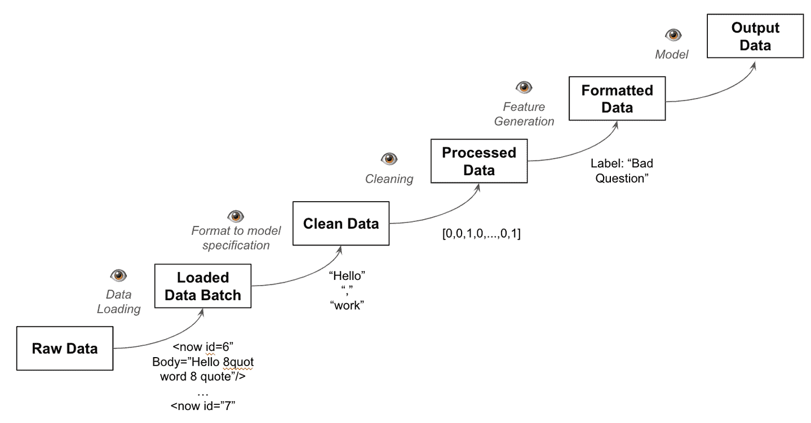

###### 图 6-3\. 潜在的检查点

接下来，我们将讨论几个通常值得检查的关键步骤。我们将从数据加载开始，然后进行清理、特征生成、格式化和模型输出。

### 数据加载

无论您是从磁盘加载数据还是通过 API 调用，都需要验证数据格式是否正确。这个过程类似于进行 EDA 时的过程，但是这里是在您构建的管道的上下文中进行，以验证没有错误导致数据损坏。

它是否包含您预期的所有字段？这些字段中是否有任何空值或常量值？任何值是否在看起来不正确的范围内，例如年龄变量有时为负数？如果您处理的是文本、语音或图像，示例是否符合您对其外观、声音或读取方式的预期？

我们大多数处理步骤依赖于我们对输入数据结构的假设，因此验证这一方面至关重要。

因为这里的目标是识别我们对数据的期望与实际情况之间的不一致，您可能希望可视化超过一两个数据点。可视化代表性样本将确保我们不仅观察到“幸运”的示例，并错误地假设所有数据点质量相同。

图 6-4 显示了来自[本书的 GitHub 存储库](https://oreil.ly/ml-powered-applications)中数据集探索笔记本案例研究的示例。在这里，我们归档的数百篇帖子中有一些未记录的帖子类型，因此需要进行筛选。在图中，您可以看到带有 PostTypeId 为 5 的行，这在数据集文档中未被引用，因此我们将其从训练数据中移除。

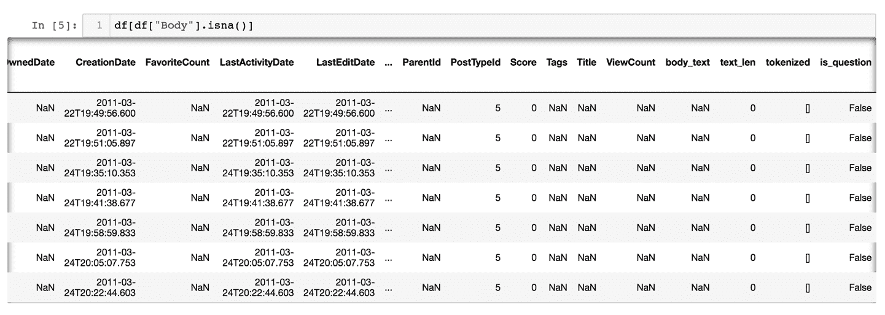

###### 图 6-4\. 数据的可视化

一旦验证数据符合数据集文档中的预期，就可以开始为建模目的处理数据了。这始于数据清洗。

### 清洗和特征选择

大多数管道的下一步是移除任何不必要的信息。这可能包括模型不会在生产中使用的字段或值，以及可能包含有关标签信息的字段，而我们的模型在生产中将无法访问（参见“拆分数据集”）。

每个移除的特征都可能成为模型的一个潜在预测器。决定保留哪些特征，移除哪些特征的任务被称为*特征选择*，是迭代模型的一个不可或缺的部分。

你应该验证没有遗漏关键信息，所有不需要的值都已移除，并且没有额外信息留在数据集中，这些信息可能通过泄露信息来人为地提升我们模型的性能（参见“数据泄露”）。

数据清洗完成后，你需要为模型生成一些特征来使用。

### 特征生成

当生成新的特征时，例如在描述 Kickstarter 活动中添加对产品名称引用频率的特征时，检查其值非常重要。你需要检查特征值是否填充，并且这些值看起来是否合理。这是一个具有挑战性的任务，因为它不仅需要识别所有特征，还需要为每个特征估计合理的值。

此时，你不需要再深入分析它了，因为这一步是专注于验证关于数据流经模型的假设，而不是数据或模型的实用性。

特征生成完成后，你应该确保它们能够以模型能理解的格式传递给模型。

### 数据格式化

正如我们在之前的章节中讨论过的，在将数据点传递给模型之前，你需要将它们转换为模型能理解的格式。这可以包括规范化输入值，通过数值化表示将文本向量化，或将黑白视频格式化为 3D 张量（参见“向量化”）。

如果你在解决一个监督问题，除了输入之外，你还会使用一个标签，比如分类中的类名，或者图像分割中的分割图。这些也需要转换为模型可理解的格式。

根据我在多个图像分割问题上的经验，例如，标签与模型预测之间的数据不匹配是错误的最常见原因之一。分割模型使用分割掩模作为标签。这些掩模与输入图像大小相同，但不同于像素值，它们包含每个像素的类标签。不幸的是，不同的库使用不同的约定来表示这些掩模，因此标签经常以错误的格式结束，阻止模型学习。

我在 图 6-5 中说明了这个常见的陷阱。假设一个模型期望分割掩模的像素值为 255，表示某个类，其他情况下为 0。如果用户错误地假设掩模内的像素应该是 1 而不是 255，则他们可能以“提供的”格式传递他们的标记掩模。这将导致模型将掩模视为几乎为空，从而输出不准确的预测结果。

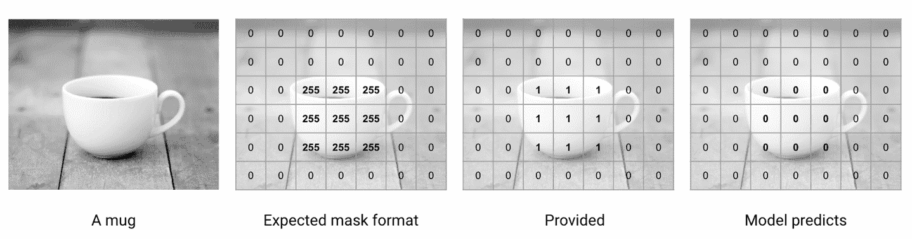

###### 图 6-5\. 标签格式不佳将阻止模型学习

同样，分类标签通常表示为一个以真实类索引处为单个 1，其余为零的列表。简单的误差可能导致标签被移位，模型学习始终预测移位后的标签。如果您没有花时间查看数据，则很难排除此类错误。

因为机器学习模型通常可以适应大多数数字输出，而不管它们是否具有准确的结构或内容，这一阶段是许多棘手错误发生的地方，也是找出这些错误的有用方法。

这是我们案例研究的格式化函数的示例。我生成我们问题文本的向量化表示。然后，我将附加特征附加到这个表示中。由于该函数包含多个转换和向量操作，可视化此函数的返回值将帮助我验证它确实按我们打算的方式格式化数据。

```
def get_feature_vector_and_label(df, feature_names):
    """
 Generate input and output vectors using the vectors feature and
 the given feature names
 :param df: input DataFrame
 :param feature_names: names of feature columns (other than vectors)
 :return: feature array and label array
 """
    vec_features = vstack(df["vectors"])
    num_features = df[feature_names].astype(float)
    features = hstack([vec_features, num_features])
    labels = df["Score"] > df["Score"].median()
    return features, labels

features = [
    "action_verb_full",
    "question_mark_full",
    "text_len",
    "language_question",
]

X_train, y_train = get_feature_vector_and_label(train_df, features)
```

尤其是在处理文本数据时，通常需要多个步骤才能正确格式化数据以供模型使用。从文本字符串到标记化列表，再到包括潜在附加特征的向量化表示，这是一个容易出错的过程。甚至在每个步骤检查对象的形状也有助于捕捉许多简单的错误。

一旦数据格式正确，您可以将其传递给模型。最后一步是可视化和验证模型的输出。

### 模型输出

首先，观察输出有助于我们确定模型的预测是否是正确类型或形状（如果我们预测房价和市场上市时间，我们的模型是否输出一个包含两个数字的数组？）。

此外，当将模型拟合到仅有几个数据点时，我们应该看到其输出开始匹配真实标签。如果模型不适合数据点，则可能表明数据格式不正确或已损坏。

如果模型的输出在训练过程中根本不改变，这可能意味着我们的模型实际上没有利用输入数据。在这种情况下，我建议参考“站在巨人的肩膀上”来验证模型是否被正确使用。

一旦我们为几个示例完整地通过了整个管道，现在是时候编写一些测试来自动化部分可视化工作了。

### 系统化我们的视觉验证

完成早期描述的可视化工作有助于捕捉大量错误，并且对每一个新的管道来说都是一个良好的时间投资。验证数据如何流经模型的假设有助于节省大量时间，现在可以用于专注于训练和泛化。

然而，管道经常发生变化。当您迭代更新不同方面以改进您的模型并修改一些处理逻辑时，如何确保一切仍按预期工作？每次进行任何更改时，通过整个管道和每个步骤的示例进行可视化将很快变得令人疲倦。

这就是我们之前讨论过的软件工程最佳实践发挥作用的地方。现在是时候隔离管道的每一部分，并将我们的观察编码为测试，随着管道的变化而运行，以验证它。

### 分开你的关注点

就像常规软件一样，ML 从模块化组织中受益良多。为了使当前和未来的调试更容易，将每个函数分开，这样你可以在查看更广泛的流程之前逐个检查它们的工作情况。

一旦管道被拆分成单独的函数，您就可以为它们编写测试。

## 测试您的 ML 代码

测试模型的行为很难。然而，ML 管道中的大多数代码并不涉及训练管道或模型本身。如果回顾我们在“从一个简单的管道开始”中的管道示例，大多数函数表现出确定性的行为，可以进行测试。

根据我的经验，帮助工程师和数据科学家调试其模型时，我学到了大多数错误都来自数据获取、处理或输入模型的方式。因此，测试数据处理逻辑对于构建成功的 ML 产品至关重要。

关于 ML 系统潜在测试的更多信息，我建议阅读 E. Breck 等人的论文[“ML 测试分数：ML 生产准备和技术债务减少的标尺”](https://oreil.ly/OjYVl)，其中包含更多的例子和从谷歌部署这类系统中学到的经验。

在接下来的部分中，我们将描述为三个关键领域编写的有用测试。在图 6-6 中，您可以看到每个领域以及我们将接下来描述的一些测试示例。

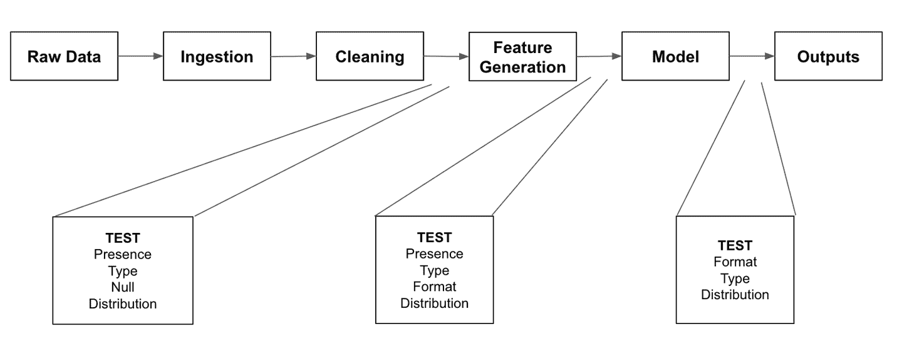

###### 图 6-6. 测试的三个关键领域

管道从摄入数据开始，因此我们首先要测试这部分。

### 测试数据摄入

数据通常存储在磁盘或数据库中。在将数据从存储传输到我们的管道时，我们应确保验证数据的完整性和正确性。我们可以开始编写测试，验证我们加载的数据点是否具备我们将需要的每个特征。

下面是验证我们解析器返回正确类型（数据帧）、所有重要列已定义以及特征不全为空的三个测试。你可以在[本书的 GitHub 存储库的测试文件夹](https://oreil.ly/ml-powered-applications)中找到本章涵盖的测试（以及额外的测试）。

```
def test_parser_returns_dataframe():
    """
 Tests that our parser runs and returns a DataFrame
 """
    df = get_fixture_df()
    assert isinstance(df, pd.DataFrame)

def test_feature_columns_exist():
    """
 Validate that all required columns are present
 """
    df = get_fixture_df()
    for col in REQUIRED_COLUMNS:
        assert col in df.columns

def test_features_not_all_null():
    """
 Validate that no features are missing every value
 """
    df = get_fixture_df()
    for col in REQUIRED_COLUMNS:
        assert not df[col].isnull().all()
```

我们还可以测试每个特征的类型，并验证它不是空的。最后，我们可以通过测试它们的平均、最小和最大值来编码我们对这些值分布和范围的假设。最近，像[Great Expectations](https://oreil.ly/VG6b1)这样的库已经出现，直接测试特征的分布。

在这里，您可以看到如何编写一个简单的平均测试：

```
ACCEPTABLE_TEXT_LENGTH_MEANS = pd.Interval(left=20, right=2000)

def test_text_mean():
    """
 Validate that text mean matches with exploration expectations
 """
    df = get_fixture_df()
    df["text_len"] = df["body_text"].str.len()
    text_col_mean = df["text_len"].mean()
    assert text_col_mean in ACCEPTABLE_TEXT_LENGTH_MEANS
```

这些测试使我们能够验证不管存储端或数据源 API 进行了哪些更改，我们都可以知道我们的模型可以访问与最初训练时相同类型的数据。一旦我们对摄入的数据的一致性感到自信，请看管道的下一步——数据处理。

### 测试数据处理

在测试数据达到管道开始时符合我们的期望后，我们应测试我们的清理和特征生成步骤是否如预期那样操作。我们可以从我们拥有的预处理函数开始编写测试，验证它确实执行我们意图的操作。此外，我们可以编写类似于数据摄入的测试，并专注于确保我们关于输入模型数据状态的假设是有效的。

这意味着测试我们处理管道后的数据点的存在性、类型和特征。以下是测试生成特征存在性、类型以及最小、最大和平均值的示例：

```
def test_feature_presence(df_with_features):
    for feat in REQUIRED_FEATURES:
        assert feat in df_with_features.columns

def test_feature_type(df_with_features):
    assert df_with_features["is_question"].dtype == bool
    assert df_with_features["action_verb_full"].dtype == bool
    assert df_with_features["language_question"].dtype == bool
    assert df_with_features["question_mark_full"].dtype == bool
    assert df_with_features["norm_text_len"].dtype == float
    assert df_with_features["vectors"].dtype == list

  def test_normalized_text_length(df_with_features):
    normalized_mean = df_with_features["norm_text_len"].mean()
    normalized_max = df_with_features["norm_text_len"].max()
    normalized_min = df_with_features["norm_text_len"].min()
    assert normalized_mean in pd.Interval(left=-1, right=1)
    assert normalized_max in pd.Interval(left=-1, right=1)
    assert normalized_min in pd.Interval(left=-1, right=1)
```

这些测试可以让我们注意到对我们的管道产生影响的任何变化，这些变化会影响到我们模型的输入，而无需编写任何额外的测试。只有在添加新功能或更改模型输入时，我们才需要编写新的测试。

现在我们可以对我们摄入的数据以及我们应用的转换感到自信，因此是时候测试管道的下一部分——模型了。

### 测试模型输出

类似于前两类，我们将编写测试来验证模型输出的值是否具有正确的尺寸和范围。我们还将测试特定输入的预测。这有助于及早检测新模型预测质量的退化，并保证我们使用的任何模型始终在这些示例输入上产生预期的输出。当一个新模型显示出更好的综合性能时，很难注意到它在特定类型的输入上的性能是否恶化。编写这些测试有助于更轻松地检测这些问题。

在下面的例子中，我首先测试我们模型预测的形状，以及它们的值。第三个测试旨在通过保证模型将特定的语句不佳的输入问题分类为低质量，从而防止回归。

```
def test_model_prediction_dimensions(
    df_with_features, trained_v1_vectorizer, trained_v1_model
):
    df_with_features["vectors"] = get_vectorized_series(
        df_with_features["full_text"].copy(), trained_v1_vectorizer
    )

    features, labels = get_feature_vector_and_label(
        df_with_features, FEATURE_NAMES
    )

    probas = trained_v1_model.predict_proba(features)
    # the model makes one prediction per input example
    assert probas.shape[0] == features.shape[0]
    # the model predicts probabilities for two classes
    assert probas.shape[1] == 2

def test_model_proba_values(
    df_with_features, trained_v1_vectorizer, trained_v1_model
):
    df_with_features["vectors"] = get_vectorized_series(
        df_with_features["full_text"].copy(), trained_v1_vectorizer
    )

    features, labels = get_feature_vector_and_label(
        df_with_features, FEATURE_NAMES
    )

    probas = trained_v1_model.predict_proba(features)
    # the model's probabilities are between 0 and 1
    assert (probas >= 0).all() and (probas <= 1).all()

def test_model_predicts_no_on_bad_question():
    input_text = "This isn't even a question. We should score it poorly"
    is_question_good = get_model_predictions_for_input_texts([input_text])
    # The model classifies the question as poor
    assert not is_question_good[0]
```

我们首先通过视觉检查数据来验证其在整个管道中保持有用和可用。然后，我们编写测试来保证这些假设在我们的处理策略发展过程中仍然正确。现在是时候解决图 6-2 的第二部分，调试训练过程。

# 调试训练：使您的模型学习

一旦您测试了您的管道并验证了它对一个示例的工作方式，您就会知道一些事情。您的管道接收数据并成功转换它。然后，它将这些数据传递给一个正确格式的模型。最后，模型可以取几个数据点并从中学习，输出正确的结果。

现在是时候看看你的模型是否可以处理更多的数据点，并从你的训练集中学习。这一节的重点是能够在许多示例上训练你的模型，并且*适应所有的训练数据*。

为此，您现在可以将整个训练集传递给您的模型，并测量其性能。或者，如果您有大量数据，您可以逐渐增加您向模型提供的数据量，同时注意综合性能。

逐步增加您的训练数据集大小的一个优点是，您将能够测量额外数据对您模型性能的影响。从几百个示例开始，然后转向几千个，在传递整个数据集之前（如果您的数据集小于一千个示例，可以直接跳过）。

在每一步，将你的模型拟合到数据上，并评估其*在同一数据上的表现*。如果你的模型有能力从你使用的数据中学习，它在训练数据上的表现应该保持相对稳定。

为了将模型的表现置于背景之中，我建议通过自行标记一些示例来生成一个关于任务的可接受错误水平的估计，并将您的预测与真实标签进行比较。大多数任务也伴随着一个不可减少的错误，代表了在任务复杂性下的最佳表现。参见 图 6-7 来说明通常的训练表现与这些指标的比较。

一个模型在整个数据集上的表现应该比仅使用一个示例时更差，因为记忆整个训练集比单个示例更难，但应该仍然保持在之前定义的界限内。

如果你能够提供整个训练集并且你的模型的表现达到了你在查看产品目标时定义的要求，那么可以放心地进入下一节！如果没有，我在下一节中概述了一些模型在训练集上可能遇到困难的常见原因。

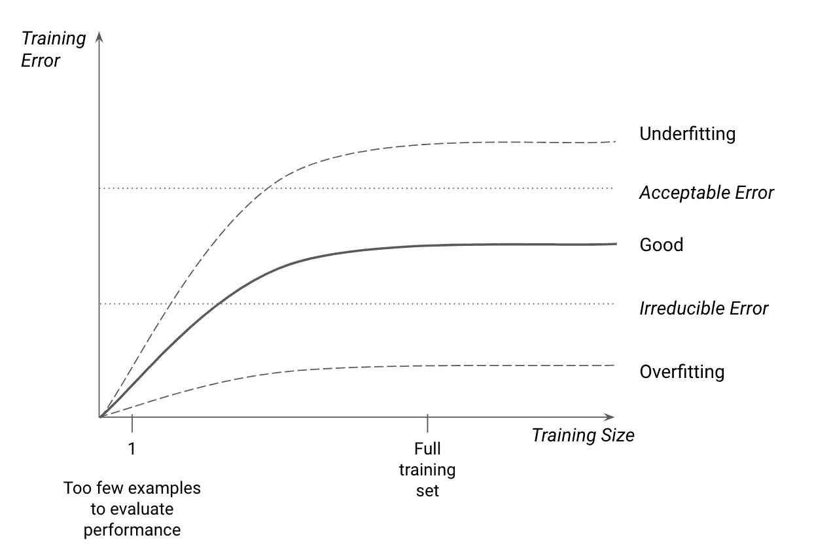

###### 图 6-7\. 随数据集大小变化的训练准确度

## 任务难度

如果一个模型的表现显著低于预期，可能是任务太难了。要评估任务的难度，考虑以下几点：

+   你拥有的数据的数量和多样性

+   你生成的特征有多预测性

+   你的模型的复杂性

让我们稍微详细看看每一个。

### 数据的质量、数量和多样性

你的问题越多样化和复杂，你的模型就需要更多的数据来学习它。为了让你的模型学习模式，你应该尽量拥有每种数据类型的许多示例。例如，如果你要将猫的图片分类为一百种可能的品种之一，你就需要比仅仅试图区分猫和狗要多得多的图片。事实上，你需要的数据量通常会随着类别数量的增加呈指数增长，因为更多的类别意味着更多的误分类机会。

此外，你拥有的数据越少，标签中的任何错误或缺失值对其影响就越大。这就是为什么值得花时间检查和验证数据集的特征和标签。

最后，大多数数据集包含*异常值*，即与其他数据点明显不同且对模型非常难以处理的数据点。从训练集中删除异常值通常可以通过简化任务来改善模型的性能，但这并不总是正确的方法：如果你认为你的模型可能在生产中遇到类似的数据点，你应该保留异常值并*专注于改进你的数据和模型*，使模型能够成功地适应它们。

数据集越复杂，找到使模型学习变得更容易的数据表示方式就越有帮助。让我们看看这意味着什么。

### 数据表示

仅使用您给出的表示形式就能轻松检测到您关心的模式吗？如果模型在训练数据上表现不佳，您应该添加使数据更具表现力的特征，从而帮助模型更好地学习。

这可能包括我们之前决定忽略但可能具有预测能力的新特征。在我们的 ML 编辑器示例中，模型的第一次迭代只考虑了问题正文中的文本。在进一步探索数据集后，我注意到问题标题通常能够很好地表明一个问题是否好。将该特征重新加入数据集中使得模型表现更好。

新特征通常可以通过迭代现有特征或以创造性的方式组合它们来生成。我们在“让数据指导特征和模型”中看到了一个例子，当我们研究如何结合星期几和月份的特征来生成与特定业务案例相关的特征时。

在某些情况下，问题出在您的模型上。接下来我们来看看这些情况。

### 模型容量

提高数据质量和改进特征通常能够带来最大的好处。当模型导致性能不佳时，往往意味着它不适合当前任务。正如我们在“从模式到模型”中看到的那样，特定的数据集和问题需要特定的模型。一个不适合特定任务的模型将难以在其上表现良好，即使它能够对少数样本过拟合。

如果一个模型在似乎具有许多预测特征的数据集上表现不佳，请首先询问自己是否使用了正确类型的模型。如果可能的话，使用给定任务的简化版本更容易检查模型。例如，如果随机森林模型根本不起作用，可以尝试在同一任务上使用决策树，并可视化其分割，以检查它们是否使用了您认为会具有预测能力的特征。

另一方面，您使用的模型可能过于简单。从最简单的模型开始是快速迭代的好方法，但某些任务可能完全超出了某些模型的能力范围。为了解决这些问题，您可能需要向模型添加复杂性。要验证模型确实适合任务，我建议查看我们在“站在巨人的肩膀上”中描述的先前工作。找到类似任务的示例，并检查用于解决它们的模型。使用这些模型之一应该是一个很好的起点。

如果模型看似适合当前任务，但表现平平，可能是由于训练过程的问题。

## 优化问题

通过验证模型能否拟合少量示例，我们可以确信数据可以来回流动。然而，我们不知道我们的训练过程是否能够充分拟合整个数据集的模型。我们模型用于更新权重的方法可能不适合当前数据集。这类问题经常发生在更复杂的模型（如神经网络）中，其中超参数的选择对训练性能有重大影响。

处理使用梯度下降技术（如神经网络）拟合的模型时，使用诸如[TensorBoard](https://oreil.ly/xn2tY)之类的可视化工具可以帮助发现训练中的问题。在优化过程中绘制损失曲线时，您应该看到其最初急剧下降，然后逐渐平缓。在图 6-8 中，您可以看到 TensorBoard 仪表板的示例，显示了训练过程中的损失函数（在本例中为交叉熵）。

这样的曲线显示损失下降非常缓慢，表明模型可能学习得太慢。在这种情况下，您可以增加学习率并绘制相同的曲线，以查看损失是否下降得更快。另一方面，如果损失曲线看起来非常不稳定，这可能是由于学习率过大造成的。

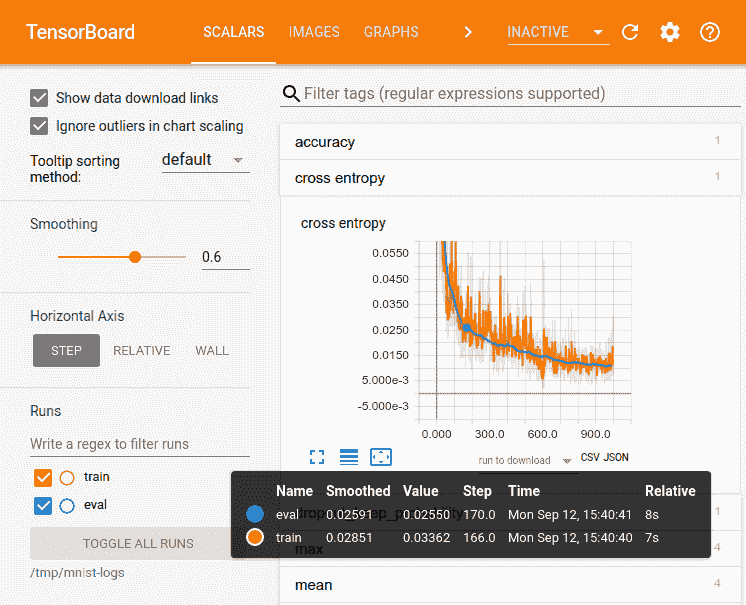

###### 图 6-8。来自 TensorBoard 文档的 TensorBoard 仪表板截图

除了损失之外，可视化权重值和激活还可以帮助您确定网络是否学习得不好。在图 6-9 中，您可以看到权重分布随训练进展而发生变化的例子。如果您看到分布在几个周期内保持稳定，这可能表明您应该增加学习率。如果它们变化太大，则应该降低学习率。

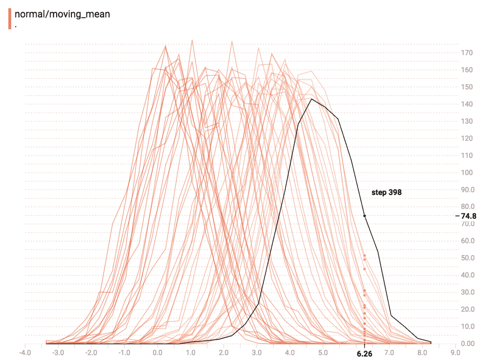

###### 图 6-9。随着训练进展而变化的权重直方图

成功将模型拟合到训练数据是机器学习项目中的重要里程碑，但并非最后一步。构建机器学习产品的最终目标是构建一个在以前从未见过的示例上表现良好的模型。为此，我们需要一个能够很好地泛化到未见示例的模型，因此接下来我将介绍泛化。

# 调试泛化能力：使您的模型更有用

泛化是图 6-2 的第三部分，也是最后一部分，重点是使 ML 模型在未曾见过的数据上表现良好。在“分割数据集”中，我们看到了创建单独的训练、验证和测试拆分的重要性，以评估模型对未见示例的泛化能力。在“评估您的模型：超越准确性”中，我们涵盖了分析模型性能并识别潜在额外特征以帮助改进的方法。在这里，我们将介绍在多次迭代后模型仍无法在验证集上表现的建议。

## 数据泄露

我们在“数据泄露”一节中更详细地讨论了数据泄露问题，但在泛化的背景下，我想在这里提一下。一个模型在验证集上的表现通常会比在训练集上差。这是可以预期的，因为模型在之前未接触过的数据上进行预测要比在其训练时使用的数据上更困难。

###### 注意

在训练尚未完成时查看训练损失和验证损失时，验证性能可能会比训练性能更好。这是因为随着模型训练的进行，训练损失会随着时期累积，而验证损失是在时期完成后计算的，使用的是模型的最新版本。

如果验证性能优于训练性能，有时可能是由于数据泄露。如果训练数据中的示例包含验证数据中的其他信息，模型将能够利用这些信息，并在验证集上表现良好。如果您对验证性能感到惊讶，请检查模型使用的特征，看看它们是否显示出数据泄露。修复此类泄露问题将导致更低的验证性能，但模型将更好。

数据泄露可能会导致我们误认为模型具有泛化能力，而实际上并非如此。在其他情况下，通过观察模型在留置验证集上的表现，我们可以清楚地看到模型只在训练集上表现良好。在这种情况下，模型可能存在过拟合问题。

## 过拟合

在“偏差方差权衡”中，我们看到当模型难以拟合训练数据时，我们称其为欠拟合。我们也看到欠拟合的反义词是过拟合，这意味着我们的模型对训练数据拟合得*过于*好。

“过于好地拟合数据”是什么意思？这意味着，与学习与优秀或糟糕写作相关的可泛化趋势不同，例如，模型可能会捕捉到训练集中个别示例中存在但在其他数据中不存在的特定模式。这些模式有助于其在训练集上获得高分，但对于分类其他示例则无用。

图 6-10 展示了一个玩具数据集的过拟合和欠拟合的实际例子。过拟合模型完美拟合训练数据，但无法准确近似潜在趋势，因此在预测未见数据点时表现不佳。欠拟合模型则完全未能捕捉数据的趋势。标记为合理拟合的模型在训练数据上表现比过拟合模型差，但在未见数据上表现更好。

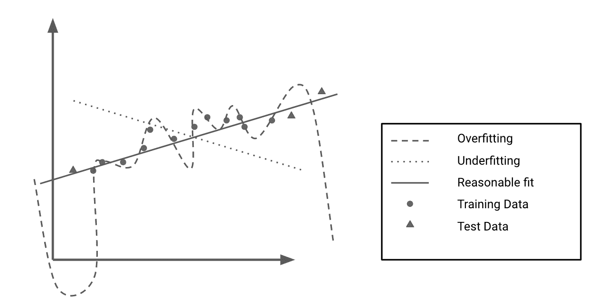

###### 图 6-10\. 过拟合与欠拟合

当模型在训练集上的表现远远优于测试集时，通常意味着它过拟合了。它已经学习了训练数据的具体细节，但不能在未见数据上表现良好。

由于过拟合是由模型过度学习训练数据引起的，我们可以通过降低模型从数据集中学习的能力来防止过拟合。有几种方法可以做到这一点，我们将在这里介绍。

### 正则化

*正则化*会对模型表示信息的能力施加惩罚。正则化旨在限制模型集中于许多无关模式的能力，并鼓励其选择更少但更具预测性的特征。

正则化模型的一种常见方法是对其权重的绝对值施加惩罚。例如，对于线性和逻辑回归等模型，L1 和 L2 正则化会在损失函数中增加一个额外项，惩罚大权重。在 L1 的情况下，该项是权重的绝对值之和。对于 L2，它是权重平方值的和。

不同的正则化方法有不同的效果。L1 正则化可以通过将无信息的特征设为零来帮助选择信息量大的特征（更多内容请参阅[“套索回归”维基百科页面](https://oreil.ly/Su9Bf)）。当一些特征相关时，L1 正则化也很有用，因为它鼓励模型仅利用其中的一个特征。

正则化方法也可以是特定于模型的。神经网络通常使用 dropout 作为正则化方法。在训练过程中，dropout 会随机忽略网络中一定比例的神经元。这可以防止单个神经元过于影响网络，从而避免网络记忆训练数据的各个方面。

对于基于树的模型，如随机森林，减少树的最大深度可以降低每棵树对数据的过拟合能力，从而有助于正则化森林。增加森林中使用的树的数量也能实现正则化。

另一种防止模型过拟合训练数据的方法是使数据本身更难过拟合。我们可以通过称为*数据增强*的过程来实现这一点。

### 数据增强

数据增强是通过轻微改变现有数据点来创建新的训练数据的过程。其目标是人为产生与现有数据点不同的数据点，以使模型接触到更多种类的输入。增强策略取决于数据类型。在图 6-11 中，您可以看到图像的几种潜在增强方法。

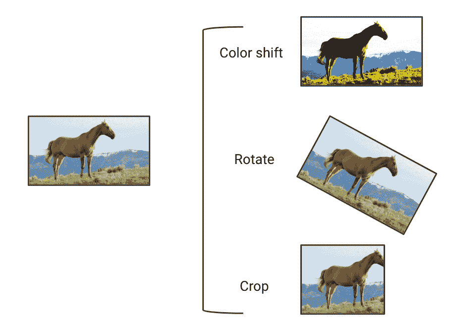

###### 图 6-11\. 图像数据增强的几个示例

数据增强使得训练集变得不那么同质化，从而更加复杂。这使得拟合训练数据更加困难，但在训练期间使模型接触到更广泛的输入。数据增强通常会导致训练集上的性能降低，但在未见数据（如验证集和生产中的示例）上的性能更高。如果我们能够利用增强使训练集更加接近实际场景中的示例，这种策略尤其有效。

我曾经帮助一位工程师使用卫星图像来检测飓风后的被淹没道路。这个项目很具挑战性，因为他只能访问非受灾城市的标记数据。为了帮助改善他的模型在飓风图像上的表现，这些图像通常更暗、质量更低，他们建立了增强流水线，使训练图像看起来更暗、更模糊。这降低了训练性能，因为道路现在更难检测到。另一方面，它提高了模型在验证集上的表现，因为增强过程使模型接触到更接近验证集中所遇到的图像。数据增强帮助使训练集更具代表性，从而使模型更加健壮。

如果在之前描述的方法使用后，模型在验证集上表现仍然不佳，你应该对数据集本身进行迭代。

### 数据集重新设计

在某些情况下，困难的训练/验证分割可能导致模型欠拟合并在验证集上表现困难。如果模型只接触到训练集中的简单示例，并且只接触到验证集中的挑战性示例，它将无法从困难的数据点中学习。同样，某些类别的示例在训练集中可能表现不足，从而阻止模型学习这些示例。如果模型训练以最小化聚合指标，则有可能主要适应大多数类别，而忽略少数类别。

虽然增强策略可以帮助，但重新设计训练集以使其更具代表性通常是最佳路径。在这样做时，我们应该小心控制数据泄露，并尽可能使难度在分割时平衡。如果新的数据分割将所有简单示例分配到验证集，模型在验证集上的性能将人为地提高，但这不会转化为生产结果。为了减轻数据分割可能存在的不均质问题，我们可以使用[k 折交叉验证](https://oreil.ly/NkhZa)，在其中进行 k 个连续不同的分割，并在每个分割上评估模型的性能。

一旦我们平衡了训练和验证集，确保它们的复杂性相似，我们的模型性能应该会提高。如果性能仍然不令人满意，我们可能只是在处理一个非常困难的问题。

## 考虑手头的任务

模型可能难以泛化，因为任务过于复杂。例如，我们使用的输入可能无法预测目标。为了确保你正在处理的任务对当前机器学习的状态来说具有适当的难度，我建议再次参考“站在巨人的肩膀上”，在那里我描述了如何探索和评估当前技术水平。

此外，拥有数据集并不意味着任务可以解决。考虑一个不可能的任务，即准确预测随机输入的随机输出。你可以通过记忆来构建一个在训练集上表现良好的模型，但这种模型将无法准确预测其他随机输入的随机输出。

如果你的模型没有泛化能力，你的任务可能太难了。你的训练样本中可能没有足够的信息来学习*有意义的特征*，这些特征将为未来的数据点提供信息。如果是这种情况，那么你面临的问题并不适合使用机器学习，我建议你重新阅读第一章，找到更合适的框架。

# 结论

在本章中，我们介绍了三个连续的步骤，你应该遵循这些步骤来使模型工作。首先，通过检查数据和编写测试来调试你的流水线。然后，在训练测试上让模型表现良好，以验证它有学习能力。最后，验证它是否能泛化，并在未见数据上产生有用的输出。

这个过程将帮助你调试模型，更快地构建它们，并使它们更加稳健。一旦你建立、训练和调试好你的第一个模型，下一步就是评估其性能，然后要么进行迭代，要么部署它。

在第七章，我们将讨论如何使用训练过的分类器为用户提供可操作的建议。然后，我们将比较 ML 编辑器的候选模型，并决定应该使用哪个来支持这些建议。
