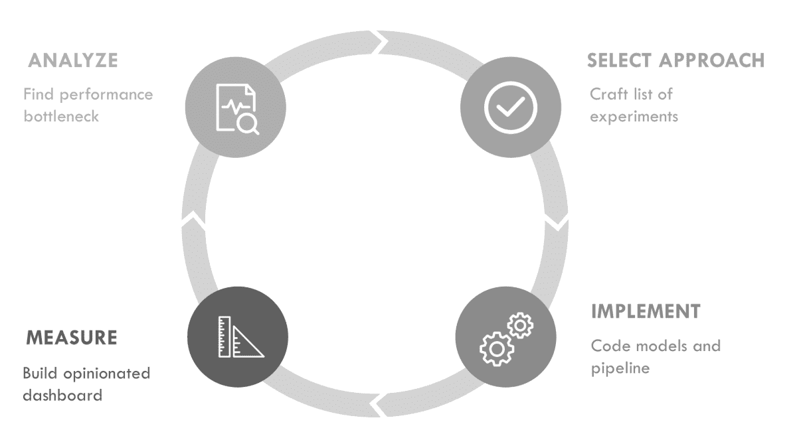
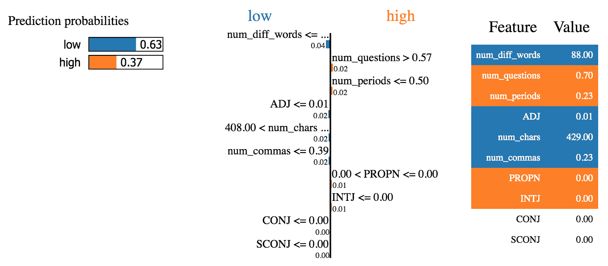
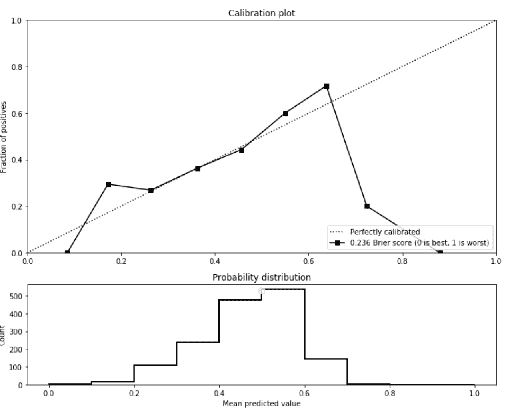
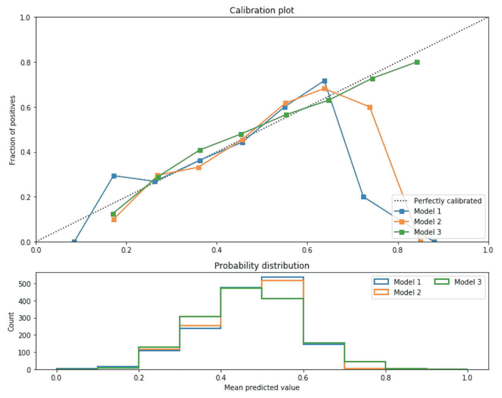

# 第七章：使用分类器撰写建议

在 ML 中取得进展的最佳方式是通过反复遵循第 III 部分介绍中所示的迭代循环（参见图 7-1）。首先建立建模假设，迭代建模管道，并进行详细的错误分析以指导下一个假设。



###### 图 7-1\. ML 循环

前几章描述了此循环中的多个步骤。在第五章中，我们讨论了如何训练和评分模型。在第六章中，我们分享了如何更快地构建模型和解决 ML 相关错误的建议。本章通过首先展示如何使用训练有素的分类器为用户提供建议，然后选择用于 ML Editor 的模型，并最终结合两者来构建工作中的 ML Editor，从而结束了循环的一个迭代。

在“ML Editor 规划”中，我们概述了我们的 ML Editor 计划，其中包括训练一个能将问题分类为高分和低分类别的模型，并使用这个训练有素的模型来引导用户撰写更好问题的方法。让我们看看如何使用这样的模型为用户提供写作建议。

# 从模型中提取推荐

ML Editor 的目标是提供写作建议。将问题分类为好与坏是朝这个方向迈出的第一步，因为它可以向用户展示问题的当前质量。我们希望进一步，通过提供可操作的建议帮助用户改善问题的表达方式。

本节介绍了提供此类建议的方法。我们将从依赖聚合特征度量且不需要在推断时使用模型的简单方法开始。然后，我们将看到如何同时使用模型得分及其对扰动的敏感性来生成更个性化的建议。您可以在[本书的 GitHub 站点](https://oreil.ly/ml-powered-applications)上的生成推荐笔记本中找到本章展示的每种方法的示例，应用于 ML Editor。

## 没有模型我们能实现什么？

通过多次 ML 循环迭代来训练表现良好的模型。每次迭代都有助于通过研究先前的技术成果、迭代潜在数据集和检查模型结果来创建更好的特征集。为了向用户提供建议，您可以利用这些特征迭代工作。这种方法不一定需要在用户提交的每个问题上运行模型，而是专注于提供一般性建议。

您可以直接使用特征或将训练有素的模型纳入以帮助选择相关特征。

### 使用特征统计

一旦确定了预测性特征，可以直接向用户传达这些特征而无需使用模型。如果一个特征的均值在每个类别中有显著不同，您可以直接分享这些信息，以帮助用户朝着目标类别的方向调整其示例。

在 ML 编辑器早期识别的一个特征是问号的存在。检查数据显示，得分高的问题倾向于问题标点少。为了利用这些信息生成推荐，我们可以编写一个规则，警告用户如果其问题中问号的比例远高于高评分问题。

可以通过几行代码使用 pandas 可视化每个标签的平均特征值。

```
class_feature_values = feats_labels.groupby("label").mean()
class_feature_values = class_feature_values.round(3)
class_feature_values.transpose()
```

运行前述代码将生成如表 7-1 所示的结果。从这些结果中，我们可以看到，我们生成的许多特征在高分和低分问题中具有显著不同的值，这里标记为真和假。

表 7-1\. 类别间特征值差异

| 标签 | 假 | 真 |
| --- | --- | --- |
| num_questions | 0.432 | 0.409 |
| num_periods | 0.814 | 0.754 |
| num_commas | 0.673 | 0.728 |
| num_exclam | 0.019 | 0.015 |
| num_quotes | 0.216 | 0.199 |
| num_colon | 0.094 | 0.081 |
| num_stops | 10.537 | 10.610 |
| num_semicolon | 0.013 | 0.014 |
| num_words | 21.638 | 21.480 |
| num_chars | 822.104 | 967.032 |

使用特征统计是提供稳健推荐的简单方法。在很多方面，它与我们在“最简单的方法：成为算法”中首次构建的启发式方法类似。

在比较类别间特征值时，很难确定哪些特征对于问题分类有最大贡献。为了更好地估计这一点，我们可以使用特征重要性。

## 提取全局特征重要性

我们首先展示了在“评估特征重要性”中模型评估背景下生成特征重要性的示例。特征重要性还可以用于优先考虑基于特征的推荐。在向用户展示推荐时，应优先考虑对训练过的分类器最具预测性的特征。

接下来，我展示了一个问题分类模型的特征重要性分析结果，该模型使用了共 30 个特征。每个顶部特征的重要性远高于底部特征。引导用户首先基于这些顶部特征行动将帮助他们根据模型更快地改进问题。

```
Top 5 importances:

num_chars: 0.053
num_questions: 0.051
num_periods: 0.051
ADV: 0.049
ADJ: 0.049

Bottom 5 importances:

X: 0.011
num_semicolon: 0.0076
num_exclam: 0.0072
CONJ: 0
SCONJ: 0
```

结合特征统计和特征重要性可以使推荐更具可操作性和聚焦性。第一种方法为每个特征提供目标值，而后者则优先显示最重要特征的较小子集。这些方法还能够快速提供推荐，因为它们不需要在推断时运行模型，只需根据最重要特征的特征统计检查输入即可。

正如我们在“评估特征重要性” 中看到的，对于复杂模型来说，提取特征重要性可能更为困难。如果您正在使用不公开特征重要性的模型，可以利用大量示例上的黑盒解释器来尝试推断它们的值。

特征重要性和特征统计也带来另一个缺点，即它们并不总是提供准确的推荐。由于推荐基于整个数据集上聚合的统计数据，因此它们不一定适用于每个单独的示例。特征统计仅提供一般性推荐，例如“含有更多副词的问题往往得到更高评分”。然而，存在一些含有低于平均比例副词的问题得到高分的例子。这些推荐对这些问题并不适用。

在接下来的两个部分中，我们将讨论在个别示例级别提供更精细推荐的方法。

## 使用模型得分

第五章 描述了分类器如何为每个示例输出得分。然后根据该得分是否超过某个阈值，来为示例分配类别。如果模型的得分校准良好（详见“校准曲线” 了解更多关于校准的信息），那么它可以被用作估计输入示例属于给定类别的概率。

若要显示一个 scikit-learn 模型的得分而不是类别，请使用 `predict_proba` 函数，并选择要显示得分的类别。

```
# probabilities is an array containing one probability per class
probabilities = clf.predict_proba(features)

# Positive probas contains only the score of the positive class
positive_probs = clf[:,1]
```

如果它校准良好，向用户展示得分可以让他们在跟随修改建议改进其问题时跟踪得分提升。得分等快速反馈机制帮助用户更加信任模型提供的推荐。

在校准得分之上，训练好的模型还可以用来提供改进特定示例的推荐。

## 提取局部特征重要性

可以通过在训练模型的基础上使用黑盒解释器为单个示例生成推荐。在“评估特征重要性”中，我们看到黑盒解释器如何通过反复应用轻微扰动到输入特征并观察模型预测得分变化来估计特定示例的特征值重要性。这使得这样的解释器成为提供推荐的好工具。

我们使用 [LIME](https://github.com/marcotcr/lime) 包来演示这一点，为一个示例生成解释。在以下代码示例中，我们首先实例化一个表格解释器，然后选择我们测试数据中要解释的一个示例。我们在[这本书的 GitHub 仓库](https://oreil.ly/ml-powered-applications)的生成推荐笔记本中展示这些解释，并以数组格式显示它们。

```
from lime.lime_tabular import LimeTabularExplainer

explainer = LimeTabularExplainer(
    train_df[features].values,
    feature_names=features,
    class_names=["low", "high"],
    discretize_continuous=True,
)

idx = 8
exp = explainer.explain_instance(
    test_df[features].iloc[idx, :],
    clf.predict_proba,
    num_features=10,
    labels=(1,),
)

print(exp_array)
exp.show_in_notebook(show_table=True, show_all=False)
exp_array = exp.as_list()
```

运行前面的代码会生成 图 7-2 中显示的图以及下面代码中显示的特征重要性数组。模型的预测概率显示在图的左侧。图的中间，特征值按其对预测贡献的排名。



###### 图 7-2\. 作为推荐的解释

这些值与下面更易读的控制台输出中的值相同。此输出中的每一行代表一个特征值及其对模型得分的影响。例如，特征 `num_diff_words` 的值低于 88.00 会将模型得分降低约 0.038。根据这个模型，增加输入问题的长度超过这个数字将提高其质量。

```
[('num_diff_words <= 88.00', -0.038175093133182826),
 ('num_questions > 0.57', 0.022220445063244717),
 ('num_periods <= 0.50', 0.018064270196074716),
 ('ADJ <= 0.01', -0.01753028452563776),
 ('408.00 < num_chars <= 655.00', -0.01573650444507041),
 ('num_commas <= 0.39', -0.015551364531963608),
 ('0.00 < PROPN <= 0.00', 0.011826217792851488),
 ('INTJ <= 0.00', 0.011302327527387477),
 ('CONJ <= 0.00', 0.0),
 ('SCONJ <= 0.00', 0.0)]
```

更多用法示例，请参阅[这本书的 GitHub 仓库](https://oreil.ly/ml-powered-applications)中的生成推荐笔记本。

黑盒解释器可以为单个模型生成准确的推荐，但它们确实有一个缺点。这些解释器通过扰动输入特征并在每个扰动的输入上运行模型来生成估计，因此使用它们生成推荐比讨论的其他方法要慢。例如，LIME 用于评估特征重要性的默认扰动次数是 500 次。这使得这种方法比那些只需要运行模型一次的方法慢两个数量级，甚至比根本不需要运行模型的方法还要慢。在我的笔记本电脑上，运行一个示例问题的 LIME 大约需要 2 秒多一点。这样的延迟可能会阻止我们在用户输入时为其提供推荐，并要求他们手动提交问题。

就像许多 ML 模型一样，我们在这里看到的推荐方法在准确性和延迟之间存在权衡。对产品的正确推荐取决于其需求。

我们所介绍的每一种建议方法都依赖于在模型迭代过程中生成的特性，并且其中一些利用了训练过的模型。在接下来的部分中，我们将比较 ML 编辑器的不同模型选项，并决定哪一个最适合提供建议。

# 比较模型

“衡量成功”覆盖了判断产品成功的重要指标。“评估表现”描述了评估模型的方法。这些方法也可以用于比较模型和特性的连续迭代，以识别表现最佳的那些。

在本节中，我们将选择一组关键指标，并使用它们来评估 ML 编辑器的三个连续迭代在模型性能和建议的有用性方面。

ML 编辑器的目标是使用上述技术提供建议。为了支持这些建议，模型应满足以下要求。它应该校准良好，以使其预测的概率代表问题质量的有意义估计。正如我们在“衡量成功”中所讨论的，它应该具有高精度，以确保其所做的推荐是准确的。它所使用的特性应该对用户可理解，因为它们将作为建议的基础。最后，它应该足够快，以允许我们使用黑盒解释器提供建议。

让我们描述一下 ML 编辑器的几种连续建模方法，并比较它们的表现。这些性能比较的代码可以在[这本书的 GitHub 存储库](https://oreil.ly/ml-powered-applications)中的比较模型笔记本中找到。

## 版本 1：成绩单

在第三章中，我们构建了一个完全基于启发式的编辑器的第一个版本。这个第一个版本使用了旨在编码可读性并以结构化格式向用户显示结果的硬编码规则。通过构建这个流水线，我们能够修改我们的方法，并将机器学习的努力集中在提供更清晰建议而不是一组测量上。

由于这个初始原型是为了发展我们所处理问题的直觉而建立的，我们不会在这里将其与其他模型进行比较。

## 版本 2：更强大，更不明确

在建立基于启发式的版本和探索 Stack Overflow 数据集之后，我们选择了一个初始建模方法。我们训练的简单模型可以在[这本书的 GitHub 存储库](https://oreil.ly/ml-powered-applications)中的简单模型笔记本中找到。 

该模型使用了通过使用“矢量化”中描述的方法对文本进行向量化生成的特征的组合，以及在数据探索过程中出现的手动创建的特性。当首次探索数据集时，我注意到了一些模式：

+   更长的问题得到了更高的分数。

+   特别涉及英语使用的问题得分较低。

+   至少包含一个问号的问题得分较高。

我创建了一些特征来编码这些假设，通过计算文本长度、包含诸如*punctuate*和*abbreviate*等词的情况以及问号的频率。

除了这些特征外，我还使用了 TF-IDF 对输入问题进行了向量化。使用简单的向量化方案使我能够将模型的特征重要性与个别单词联系起来，这可以允许使用前述方法进行单词级别的推荐。

这种方法首次展示了可接受的总体性能，精度为`0.62`。但其校准程度仍有待提高，如您在第 7-3 图中所见。



###### 图 7-3\. V2 模型校准

检查了这个模型的特征重要性后，我意识到唯一有预测能力的手工创建特征是问题长度。其他生成的特征没有预测能力。再次探索数据集后发现，还有几个特征似乎具有预测能力：

+   适度使用标点符号似乎预测得分较高。

+   看起来更具情感色彩的问题得分较低。

+   描述性更强、使用更多形容词的问题似乎得分较高。

为了编码这些新的假设，我生成了一组新的特征。我为每个可能的标点元素创建了计数。然后我创建了计数，对于每个词性类别，如动词或形容词，测量了问题中属于该类别的词的数量。最后，我添加了一个特征来编码问题的情感倾向。关于这些特征的更多细节，请参阅[此书的 GitHub 存储库中的第二个模型笔记本](https://oreil.ly/ml-powered-applications)。

这个更新版本的模型在总体上表现略有改善，精度为`0.63`。但其校准并未超越前一模型。展示这个模型的特征重要性揭示，该模型仅依赖于手工制作的特征，显示这些特征具有一定的预测能力。

使模型依赖于这些易于理解的特征，比使用向量化的单词级特征更容易向用户解释推荐。例如，对于这个模型来说，最重要的单词级特征是*are*和*what*。我们可以猜测为什么这些词可能与问题质量相关，但向用户推荐他们在问题中减少或增加任意单词的发生频率并不会产生清晰的建议。

为了解决向量化表示的局限性，并认识到手工制作的特征具有预测能力，我尝试构建一个更简单的模型，不使用任何向量化特征。

## 版本 3：可理解的推荐

第三个模型仅包含前面描述的特征（标点符号和词性的计数、问题情感以及问题长度）。因此，该模型仅使用 30 个特征，而不是使用向量化表示时的 7000 多个特征。详细信息请参阅[该书的 GitHub 存储库中的第三个模型笔记本](https://oreil.ly/ml-powered-applications)。删除向量化特征并保留手动特征使得 ML 编辑器只能利用对用户可解释的特征。然而，这可能会导致模型的表现较差。

在总体性能方面，该模型的表现比以前的模型差，精度为`0.597`。然而，它的校准比以前的模型好得多。在图 7-4 中，您可以看到模型 3 在大多数概率上都有良好的校准，甚至是其他模型难以处理的大于 0.7 的概率。直方图显示这是由于该模型相比其他模型更经常预测这样的概率。

由于它生成的分数范围增加并且分数校准得到了改进，当涉及到显示分数以指导用户时，这个模型是最佳选择。当需要明确推荐时，由于它仅依赖于可解释特征，这个模型也是最佳选择。最后，因为它依赖的特征比其他模型少，所以运行速度也是最快的。



###### 图 7-4\. 校准比较

模型 3 是 ML 编辑器的最佳选择，因此是我们应该部署的模型的初始版本。在下一节中，我们将简要介绍如何使用此模型结合推荐技术向用户提供编辑建议。

# 生成编辑建议

ML 编辑器可以从我们描述的四种方法中受益以生成建议。实际上，所有这些方法都展示在生成建议笔记本中，[该书的 GitHub 存储库](https://oreil.ly/ml-powered-applications)中展示了这些方法。因为我们使用的模型速度快，我们将在这里演示最详尽的方法，使用黑匣子解释器。

让我们首先看一下完整的推荐函数，该函数接受一个问题并基于训练模型提供编辑建议。函数如下所示：

```
def get_recommendation_and_prediction_from_text(input_text, num_feats=10):
    global clf, explainer
    feats = get_features_from_input_text(input_text)
    pos_score = clf.predict_proba([feats])[0][1]

    exp = explainer.explain_instance(
        feats, clf.predict_proba, num_features=num_feats, labels=(1,)
    )
    parsed_exps = parse_explanations(exp.as_list())
    recs = get_recommendation_string_from_parsed_exps(parsed_exps)
    return recs, pos_score
```

对一个示例输入调用此函数并美观地打印其结果会生成诸如以下的建议。然后，我们可以将这些建议显示给用户，让他们可以对其问题进行迭代。

```
>> recos, score = get_recommendation_and_prediction_from_text(example_question)
>> print("%s score" % score)
0.4 score
>> print(*recos, sep="\n")
Increase question length
Increase vocabulary diversity
Increase frequency of question marks
No need to increase frequency of periods
Decrease question length
Decrease frequency of determiners
Increase frequency of commas
No need to decrease frequency of adverbs
Increase frequency of coordinating conjunctions
Increase frequency of subordinating conjunctions
```

让我们逐步解析这个函数。从其签名开始，该函数接受一个表示问题的输入字符串作为参数，以及一个可选参数，确定要为其推荐的最重要特征数量。它返回推荐结果，以及表示当前问题质量的分数。

在问题主体中，第一行提到了两个全局定义的变量，训练好的模型和一个像我们在“提取本地特征重要性”中定义的 LIME 解释器的实例。接下来的两行生成输入文本的特征，并将这些特征传递给分类器进行预测。然后，通过使用 LIME 生成解释来定义`exp`。

最后两个函数调用将这些解释转换为易于理解的建议。让我们通过查看这些函数的定义来看看，从`parse_explanations`开始。

```
def parse_explanations(exp_list):
    global FEATURE_DISPLAY_NAMES
    parsed_exps = []
    for feat_bound, impact in exp_list:
        conditions = feat_bound.split(" ")

        # We ignore doubly bounded conditions , e.g. 1 <= a < 3 because
        # they are harder to formulate as a recommendation
        if len(conditions) == 3:
            feat_name, order, threshold = conditions

            simple_order = simplify_order_sign(order)
            recommended_mod = get_recommended_modification(simple_order, impact)

            parsed_exps.append(
                {
                    "feature": feat_name,
                    "feature_display_name": FEATURE_DISPLAY_NAMES[feat_name],
                    "order": simple_order,
                    "threshold": threshold,
                    "impact": impact,
                    "recommendation": recommended_mod,
                }
            )
    return parsed_exps
```

这个函数很长，但它完成了一个相对简单的目标。它接受 LIME 返回的特征重要性数组，并生成一个更结构化的字典，可以用于建议。这里是这个转换的一个例子：

```
# exps is in the format of LIME explanations
>> exps = [('num_chars <= 408.00', -0.03908691525058592),
 ('DET > 0.03', -0.014685507408497802)]

>> parse_explanations(exps)

[{'feature': 'num_chars',
 'feature_display_name': 'question length',
 'order': '<',
 'threshold': '408.00',
 'impact': -0.03908691525058592,
 'recommendation': 'Increase'},
 {'feature': 'DET',
 'feature_display_name': 'frequency of determiners',
 'order': '>',
 'threshold': '0.03',
 'impact': -0.014685507408497802,
 'recommendation': 'Decrease'}]
```

请注意，函数调用将 LIME 显示的阈值转换为建议，即是否增加或减少特征值。这是通过这里显示的`get_recommended_modification`函数完成的：

```
def get_recommended_modification(simple_order, impact):
    bigger_than_threshold = simple_order == ">"
    has_positive_impact = impact > 0

    if bigger_than_threshold and has_positive_impact:
        return "No need to decrease"
    if not bigger_than_threshold and not has_positive_impact:
        return "Increase"
    if bigger_than_threshold and not has_positive_impact:
        return "Decrease"
    if not bigger_than_threshold and has_positive_impact:
        return "No need to increase"
```

一旦解释被解析为建议，剩下的就是以适当的格式显示它们。这通过在`get_recommendation_and_prediction_from_text`中的最后一个函数调用完成，这里显示如下：

```
def get_recommendation_string_from_parsed_exps(exp_list):
    recommendations = []
    for feature_exp in exp_list:
        recommendation = "%s %s" % (
            feature_exp["recommendation"],
            feature_exp["feature_display_name"],
        )
        recommendations.append(recommendation)
    return recommendations
```

如果你想尝试这个编辑器并对其进行迭代，可以参考本书 GitHub 仓库中的生成建议笔记本。在笔记本的结尾，我包含了一个例子，使用模型的建议多次重述问题并提高其分数。我在这里重现这个例子，以演示如何利用这些建议来指导用户编辑问题。

```
// First attempt at a question
>> get_recommendation_and_prediction_from_text(
 """
I want to learn how models are made
"""
)

0.39 score
Increase question length
Increase vocabulary diversity
Increase frequency of question marks
No need to increase frequency of periods
No need to decrease frequency of stop words

// Following the first three recommendations
>> get_recommendation_and_prediction_from_text(
 """
I'd like to learn about building machine learning products.
Are there any good product focused resources?
Would you be able to recommend educational books?
"""
)

0.48 score
Increase question length
Increase vocabulary diversity
Increase frequency of adverbs
No need to decrease frequency of question marks
Increase frequency of commas

// Following the recommendations once more
>> get_recommendation_and_prediction_from_text(
 """
I'd like to learn more about ML, specifically how to build ML products.
When I attempt to build such products, I always face the same challenge:
how do you go beyond a model?
What are the best practices to use a model in a concrete application?
Are there any good product focused resources?
Would you be able to recommend educational books?
"""
)

0.53 score
```

现在，我们有一个可以接受问题并向用户提供可操作建议的流水线。这个流水线当然不完美，但我们现在拥有一个可工作的端到端 ML 驱动的编辑器。如果你想尝试改进它，我鼓励你与当前版本互动，并识别需要解决的故障模式。有趣的是，虽然模型总是可以迭代，但我认为为这个编辑器改进最有前途的方面是生成对用户更加清晰的新特征。

# 结论

在本章中，我们介绍了不同的方法来从训练好的分类模型中生成建议。考虑到这些方法，我们比较了 ML 编辑器的不同建模方法，并选择了一个能够优化我们产品目标——帮助用户提出更好问题的方法。然后，我们建立了一个 ML 编辑器的端到端流水线，并用它来提供建议。

我们最终确定的模型仍有很大改进空间，并且可以从更多的迭代周期中获益。如果你想要实践我们在 第三部分 中概述的概念，我鼓励你自行完成这些周期。总体而言，第三部分 中的每一章都代表了机器学习迭代循环的一个方面。要在机器学习项目中取得进展，请反复执行本节中概述的步骤，直到你估计一个模型已经准备好部署为止。

在 第四部分，我们将涵盖部署模型所伴随的风险、如何减轻这些风险，以及监测和应对模型性能变化的方法。
