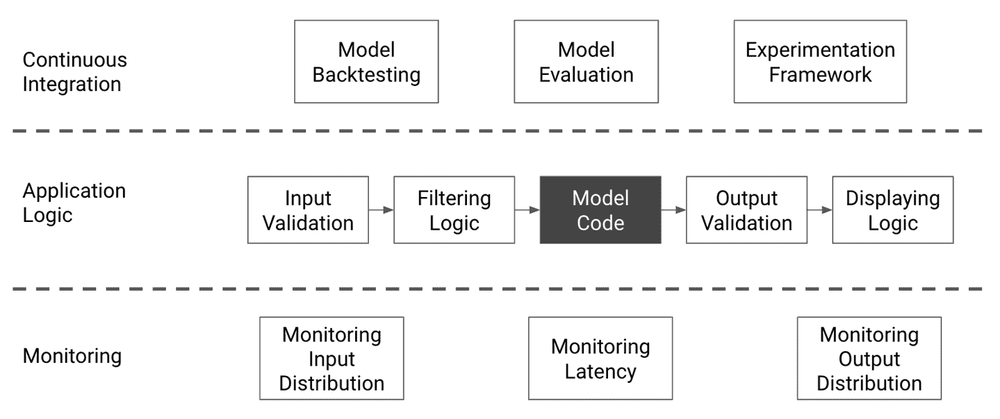

# 第四部分： 部署和监控

一旦我们构建了一个模型并验证过它，我们希望用户能够访问它。有许多不同的方法可以展示机器学习模型。最简单的情况涉及构建一个小型 API，但为了确保您的模型能够为所有用户有效运行，您需要更多。

查看图 IV-1 以了解接下来几章中我们将涵盖的系统的插图，通常与生产中的模型伴随使用。

###### 图 IV-1\. 典型的生产建模管道

生产环境的机器学习管道需要能够检测数据和模型失败，并优雅地处理它们。理想情况下，您还应该预测任何可能的失败，并有部署更新模型的策略。如果这些对您来说听起来具有挑战性，不用担心！这正是我们将在第四部分中覆盖的内容。

第八章

在部署之前，我们应始终进行最后一轮验证。目标是彻底检查模型可能存在的滥用和负面使用，并尽力预见并建立相应的保障措施。

第九章

我们将讨论不同的方法和平台来部署模型，以及如何选择其中一种。

第十章

在本章中，我们将学习如何构建一个能够支持模型的健壮生产环境。这包括检测和解决模型失败、优化模型性能以及系统化重新训练。

第十一章

在这最后一章中，我们将处理监控的关键步骤。特别是，我们将讨论为什么需要监控模型、最佳的监控方法，以及如何将监控设置与部署策略结合起来。
