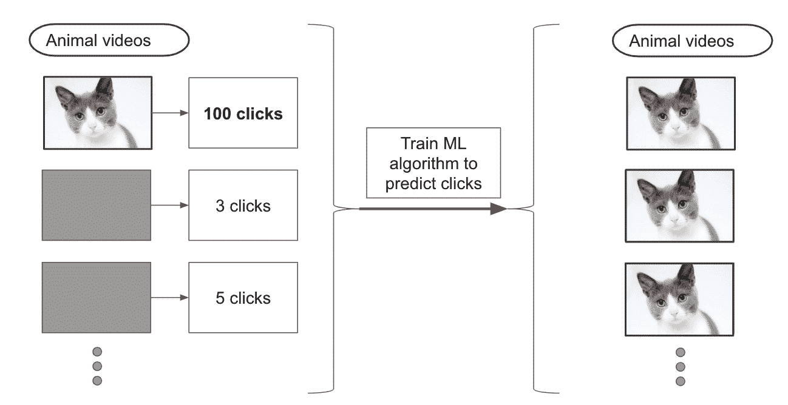

# 第八章：部署模型时的考虑因素

前几章涵盖了模型训练和泛化性能。 这些是部署模型所必需的步骤，但不足以保证 ML 驱动产品的成功。

部署模型需要更深入地研究可能影响用户的故障模式。 在构建从数据中学习的产品时，以下是您应该回答的几个问题：

+   您使用的数据是如何收集的？

+   您的模型通过从这个数据集学习得出什么假设？

+   此数据集是否足够代表性以生成有用的模型？

+   您的工作结果如何可能被滥用？

+   您的模型的预期使用和范围是什么？

数据伦理学旨在回答其中一些问题，使用的方法不断发展。 如果您想更深入地了解，O'Reilly 有一份由 Mike Loukides 等人编写的关于这一主题的综合报告，[*Ethics and Data Science*](https://www.oreilly.com/library/view/ethics-and-data/9781492043898/)。

在本章中，我们将讨论围绕数据收集和使用的一些关注点以及确保模型对每个人保持良好运作的挑战。 我们将通过一个实用的访谈结束本节，介绍将模型预测翻译为用户反馈的技巧。

让我们从数据开始，首先涵盖所有权问题，然后再讨论偏见。

# 数据关注

在本节中，我们将首先概述存储、使用和生成数据时应牢记的几个提示。 我们将从数据所有权和存储数据所带来的责任开始。 然后，我们将讨论数据集中常见偏见的来源及在构建模型时考虑这些偏见的方法。 最后，我们将讨论此类偏见的负面后果示例及其为何重要的原因。

## 数据所有权

数据所有权指的是与数据收集和使用相关的要求。 以下是几个关于数据所有权需要考虑的重要方面：

+   *数据收集：*您是否有法律授权收集和使用您希望在模型上训练的数据集？

+   *数据使用和许可：*您是否向用户清楚解释了为什么需要他们的数据以及您希望如何使用它，并且他们是否同意？

+   *数据存储：*您如何存储数据，谁可以访问它，何时将其删除？

从用户那里收集数据可以帮助个性化和定制产品体验。 这也意味着道德和法律责任。 尽管保护用户提供的数据始终存在道德义务，但新的法规越来越多地使其成为法律义务。 例如，在欧洲，GDPR 法规现在设置了严格的数据收集和处理指南。

对于存储大量数据的组织来说，数据泄露代表了重大的责任风险。这些泄露不仅侵蚀了用户对组织的信任，还经常导致法律诉讼。因此，限制收集的数据量可以减少法律风险。

对于我们的机器学习编辑器，我们将首先使用公开可用的数据集，这些数据集是在用户同意的情况下收集并在线存储的。如果我们想要记录额外的数据，例如记录我们的服务如何使用以便改进，我们必须明确定义数据收集政策并与用户分享。

除了数据收集和存储外，考虑使用收集的数据可能导致性能不佳也很重要。在某些情况下，数据集适合使用，但在其他情况下则不适合。让我们来探讨一下为什么。

## 数据偏见

数据集是特定数据收集决策的结果。这些决策导致数据集呈现了对世界的偏见观点。机器学习模型从数据集中学习，因此会重现这些偏见。

例如，假设一个模型是基于历史数据进行训练的，以预测领导能力，即预测一个人成为 CEO 的可能性，其中包括他们的性别信息。根据皮尤研究中心编制的《女性领导数据》信息表所述，历史上大多数财富 500 强公司的 CEO 都是男性。使用这些数据来训练模型将导致模型学习到男性是领导力宝贵的预测因素。在所选数据集中，男性和 CEO 之间存在相关性，这是由于社会原因，导致女性甚至不被考虑这样的角色。通过盲目地在这些数据上训练模型并用于预测，我们只会加强过去的偏见。

认为数据是真实的可能很诱人。实际上，大多数数据集是近似测量的集合，忽略了更大背景。我们应该假设任何数据集都存在偏见，并估计这种偏见将如何影响我们的模型。然后，我们可以采取措施改进数据集，使其更具代表性，并调整模型以限制其传播现有偏见的能力。

以下是数据集中常见错误和偏见的几个例子：

+   *测量误差或数据损坏：* 每个数据点由于生成方法的不确定性而带有不确定性。大多数模型忽略这种不确定性，因此可能传播系统测量误差。

+   *代表性：* 大多数数据集呈现了人口的不典型视图。许多早期的面部识别数据集主要包含白人男性的图像。这导致模型在这个人群中表现良好，但在其他人群中失败。

+   *获取:* 有些数据集比其他数据集更难获取。例如，英文文本比其他语言更容易在线获取。这种获取的便利性导致大多数最先进的语言模型仅基于英文数据进行训练。因此，英语使用者将比非英语使用者能够访问到更好的机器学习服务。这种差异通常是自我强化的，因为英语产品的用户量更大有助于使这些模型相比其他语言的模型更加优秀。

测试集用于评估模型的性能。因此，您应特别注意确保您的测试集尽可能准确和代表性。

### 测试集

在每个机器学习问题中都会出现表示问题。在《分割数据集》中，我们讨论了将数据分成不同集合以评估模型性能的价值。在执行此操作时，您应努力构建一个包含、代表和现实的测试集。这是因为测试集充当了生产环境性能的代理。

为了实现这一点，在设计测试集时，请考虑每个可能与您的模型互动的用户。为了提高每个用户都能有同样积极体验的机会，尽量在测试集中包含每种类型用户的代表性示例。

设计您的测试集以编码产品目标。在构建诊断模型时，您将希望确保它对所有性别的表现都足够好。为了评估是否达到了这一目标，您需要在测试集中包含所有性别的代表性数据。收集多样化的观点可以帮助实现这一努力。如果可能的话，在部署模型之前，让多样化的用户有机会检查、与之互动并分享反馈。

当涉及到偏见时，我想最后指出一点。模型通常是基于历史数据进行训练的，这些数据反映了过去的世界状态。因此，偏见往往最容易影响到那些已经处于弱势的群体。致力于消除偏见是一个可以帮助使系统对最需要帮助的人群更公平的努力。

## 制度性偏见

制度性偏见指的是导致某些人群受到不公平歧视的体制和结构性政策。由于这种歧视，这些人群在历史数据集中往往被过度或不足地代表。例如，如果社会因素导致某些人群在犯罪逮捕数据库中历史上被过度代表，那么从这些数据训练的机器学习模型将会编码这种偏见，并将其延续到现代预测中。

这可能会带来灾难性的后果，并导致某些人群的边缘化。具体示例，请参见 J. Angwin 等人的[《机器偏见》ProPublica 报告](https://oreil.ly/6UE3z)，关于犯罪预测中的机器学习偏见。

移除或限制数据集中的偏差是具有挑战性的。当试图防止模型对某些特征（如种族或性别）存在偏见时，有些人尝试从模型用于预测的特征列表中删除相关属性。

实际上，仅仅删除一个特征并不能防止模型对其存在偏见，因为大多数数据集中还有许多与之强相关的其他特征。例如，在美国，邮政编码和收入与种族高度相关。如果只移除一个特征，模型可能仍然存在偏见，尽管这种偏见可能更难以检测。

相反，你应该明确你试图强制执行的公平约束。例如，你可以遵循 M. B. Zafar 等人在论文中提出的方法，["公平约束：公平分类的机制"](https://oreil.ly/JWlIi)，其中模型的公平性是使用 p%规则来衡量的。p%规则被定义为“具有某一敏感属性值的受试者接收积极结果的百分比与不具备该值的受试者接收相同结果的百分比之比不得低于 p:100”。使用这样的规则允许我们量化偏差，并更好地加以解决，但需要跟踪我们希望模型不偏见的特征。

除了评估数据集中的风险、偏见和错误之外，ML 还需要评估模型本身。

# 建模关注点

我们如何最小化模型引入不良偏差的风险？

模型可以对用户产生负面影响的方式有多种。首先，我们将解决失控的反馈循环问题，然后探讨模型在小部分人群中悄悄失败的风险。接着，我们将讨论适当地为用户提供 ML 预测的重要性，并通过讨论恶意行为者滥用模型的风险来结束本节。

## 反馈循环

在大多数由 ML 驱动的系统中，用户跟随模型的推荐会使未来的模型更有可能做出相同的推荐。如果不加以控制，这种现象会导致模型进入自我强化的反馈循环。

例如，如果我们训练一个模型来向用户推荐视频，并且我们的第一个版本的模型比推荐猫的视频要稍微多一点，那么用户平均来看会观看更多的猫视频而不是狗视频。如果我们使用历史推荐和点击数据集训练第二个版本的模型，我们将把第一个模型的偏见纳入我们的数据集，第二个模型将更偏向于大量推荐猫的视频。

由于内容推荐模型通常每天更新多次，不久后我们的模型最新版本将只推荐猫视频。你可以在图 8-1 中看到一个例子。由于猫视频的初始受欢迎程度，该模型逐渐学会更多推荐猫视频，直到最终仅推荐猫视频。

###### 图 8-1\. 反馈循环示例

尽管填充互联网充斥着猫视频可能看起来不像是一场悲剧，但你可以想象这些机制如何快速强化负面偏见，向毫无戒备的用户推荐不当或危险的内容。事实上，试图最大化用户点击概率的模型将学会推荐点击诱饵内容，即非常诱人点击但对用户没有任何价值的内容。

反馈循环还倾向于引入偏见，以偏爱少数非常活跃的用户。如果视频平台使用每个视频的点击次数来训练其推荐算法，它有风险将其推荐过度拟合到占点击数量绝大多数的最活跃用户。平台的其他用户将会看到相同的视频，而不考虑他们的个人偏好。

为了限制反馈循环的负面影响，选择一个不易造成这种循环的指标。点击仅仅衡量用户是否打开了视频，而不是他们是否喜欢它。将点击作为优化目标会导致推荐更吸引眼球的内容，而不考虑其相关性。用观看时间替换目标指标，这与用户满意度更相关，有助于减轻这种反馈循环。

即使如此，优化任何形式参与度的推荐算法始终存在退化为反馈循环的风险，因为它们的唯一目标是最大化一个实际上无限制的指标。例如，即使算法优化观看时间以鼓励更吸引人的内容，最大化这一指标的世界状态是每个用户整天观看视频。使用这样的参与度指标可能有助于增加使用率，但这引发了一个问题：这是否总是一个值得优化的目标。

除了存在创造反馈循环的风险外，模型在生产环境中的表现也可能比离线验证指标预期的要差。

## 包容性模型表现

在“评估您的模型：超越准确性”中，我们涵盖了多种评估指标，试图评估数据集不同子集上的性能。这种类型的分析有助于确保模型对不同类型的用户表现同样出色。

这在训练现有模型的新版本并决定是否部署它们时尤为重要。如果您仅比较总体性能，您可能会忽视数据的某个段落性能显著下降。

忽视性能下降的问题导致了灾难性的产品失败。2015 年，一个自动化照片标记系统将非裔美国用户的照片分类为大猩猩（请参阅这篇[2015 年 BBC 文章](https://oreil.ly/nVkZv)）。这是一个令人震惊的失败，是因为没有在代表性输入集上验证模型的结果。

当更新现有模型时可能会出现这种问题。比如说，你正在更新一个面部识别模型。之前的模型精度为 90%，而新模型的精度为 92%。在部署这个新模型之前，你应该在几个不同的用户子集上评估其性能。你可能会发现，虽然总体性能略有提高，但新模型在 40 岁以上女性的照片上表现非常糟糕，因此你应该避免部署它。相反，你应该修改训练数据，增加更多代表性的例子，并重新训练一个可以在每个类别中表现良好的模型。

忽略这些基准可能导致模型无法为其预期受众的大部分工作。大多数模型永远不会对每个可能的输入都有效，但验证它们对所有预期输入的有效性非常重要。

## 考虑到上下文

用户并不总是意识到某些信息来自 ML 模型的预测。在可能的情况下，您应该与用户分享预测背后的背景信息，以便他们能够决定如何利用它。为此，您可以开始描述模型的训练方式。

目前尚无行业标准的“模型免责声明”格式，但该领域的活跃研究显示出了一些有前景的格式，例如模型卡片（参见 M. Mitchell 等人的文章[“模型报告的模型卡片”](https://arxiv.org/abs/1810.03993)）。在提议的方法中，模型附带有关其训练方式、测试数据以及预期用途等元数据。

在我们的案例研究中，ML 编辑器根据特定的问题数据集提供反馈。如果我们将其作为产品部署，我们将包含一个关于模型预期表现良好输入类型的免责声明。这样的免责声明可以简单地表述为“本产品试图推荐更好的问题表达方式。它是在写作 Stack Exchange 的问题上进行训练的，因此可能反映了该社区的特定偏好。”

保持善意用户的信息通知是重要的。现在，让我们来看看可能由不友好用户带来的潜在挑战。

## 对手

一些机器学习项目需要考虑模型被对手击败的风险。欺诈者可能试图愚弄一个旨在检测可疑信用卡交易的模型。或者，对手可能希望探测一个训练好的模型，以获取有关底层训练数据的信息，这些信息他们本不应该访问，例如敏感用户信息。

### 打败一个模型

许多机器学习模型被部署来保护账户和交易免受欺诈者的侵害。反过来，欺诈者试图击败这些模型，以使它们相信他们是合法用户。

如果您试图防止对在线平台的欺诈登录，例如，您可能希望考虑包括用户原籍国家在内的一组特征（许多大规模攻击使用同一地区的多个服务器）。如果您在这些特征上训练一个模型，您将面临引入针对非欺诈用户的偏见的风险，这些用户居住在欺诈者所在的国家。此外，仅依赖这样一个特征将使恶意行为者轻而易举地通过伪造他们的位置来愚弄您的系统。

为了防范对手，定期更新模型至关重要。随着攻击者了解现有的防御模式并调整他们的行为以击败它们，更新您的模型，使其能够快速将这种新行为分类为欺诈行为。这需要监控系统以便检测活动模式的变化。我们将在第十一章中详细讨论这一点。在许多情况下，防御攻击者需要生成新的特征以更好地检测他们的行为。请随时参考“让数据指导特征和模型”以便对特征生成进行复习。

攻击模型的最常见方式是欺骗它们产生错误的预测，但还存在其他类型的攻击。一些攻击旨在利用训练好的模型来了解它所训练的数据。

### 利用一个模型

超出简单欺骗模型的范畴，攻击者可以利用它来获取私人信息。模型反映了它所训练的数据，因此可以利用其预测来推断原始数据集中的模式。为了说明这个想法，考虑一个在包含两个示例的数据集上训练的分类模型的例子。每个示例属于不同的类，并且两个示例仅在单个特征值上有所不同。如果您让攻击者访问一个在此数据集上训练的模型，并允许他们观察其对任意输入的预测，他们最终可以推断出这个特征是数据集中唯一的预测性特征。类似地，攻击者可以推断训练数据中特征的分布。这些分布通常涉及敏感或私人信息。

在欺诈登录检测的例子中，假设邮政编码是登录时的必填字段之一。攻击者可以尝试使用许多不同的账户登录，测试不同的邮政编码，以确定哪些值能够成功登录。这样做可以帮助他们估计训练集中邮政编码的分布，从而推断出该网站客户的地理分布。

限制这类攻击效率的最简单方法是限制特定用户可以发出的请求次数，从而限制其探索特征值的能力。这并非万能药，因为复杂的攻击者可能能够创建多个账户来规避此类限制。

本节描述的对手不是你唯一需要关注的恶意用户。如果你选择与更广泛的社区分享你的工作，你还应该问自己它是否可能被用于危险的应用程序。

## 滥用和双重用途

双重用途指的是为一种目的开发的技术，但可以用于其他目的。由于机器学习在类似类型的数据集上表现出色（见图 2-3），ML 模型经常引起双重用途的关注。

如果你开发了一个允许人们改变声音以模仿朋友的模型，是否可能被滥用来未经同意地冒充他人？如果你决定开发它，如何包含适当的指导和资源，确保用户理解模型的正确使用方式？

同样，任何能准确分类人脸的模型都可能存在监控的双重用途。虽然这样的模型最初可能是为了智能门铃而建立的，但它们随后可能被用于自动跟踪城市范围内的个体，通过摄像头网络实现这一功能。模型是根据特定数据集构建的，但在重新训练时可能带来风险，尤其是在使用类似数据集时。

目前尚无明确的最佳实践以考虑双重用途。如果你认为你的工作可能会被用于不道德的用途，我建议你考虑增加难以复制的条件，或者与社区进行深入讨论。最近，OpenAI 决定不发布其最强大的语言模型，因为担心其可能会使在线传播虚假信息变得更容易（见 OpenAI 的公告文章，[“更好的语言模型及其影响”](https://oreil.ly/W1Y6f)）。虽然这是一个相对新颖的决定，但我认为类似的担忧未来可能会更频繁地被提出。

总结本章节，在接下来的部分，我将分享与克里斯·哈兰德的讨论，他目前是 Textio 的工程总监，拥有丰富的模型部署经验，并在呈现结果时提供足够的背景信息，使其有用。

# 克里斯·哈兰德：航运实验

克里斯拥有物理学博士学位，并在多个 ML 任务中工作，包括计算机视觉，从收据中提取结构化信息以用于报销软件。他在微软的搜索团队工作时意识到 ML 工程的价值。后来，克里斯加入了 Textio，一家专门构建增强写作产品的公司，帮助用户撰写更具吸引力的职位描述。我与克里斯坐下来讨论了他在推出基于 ML 的产品和如何验证结果的经验。

Q: *Textio 使用 ML 直接指导用户。这与其他 ML 任务有何不同？*

A: 当你只专注于预测，比如何时买黄金或者在 Twitter 上关注谁，你可以容忍一定程度的变化。但当你进行写作指导时，情况就不同了，因为你的建议背后潜藏着大量的含义。

如果你告诉我写 200 个字，你的模型应该是一致的，并允许用户遵循其建议。一旦用户写了 150 个字，模型就不能改变主意并建议减少字数了。

指导还需要清晰度：像“减少 50%的停用词”这样的指令是令人困惑的，但像“缩短这三个句子的长度”可能以更具体的方式帮助用户。一个挑战是在使用更易于理解的特征时保持性能。

本质上，ML 写作助手通过我们的模型，引导用户从一个初始点到更好的点在我们的特征空间中移动。有时，这可能涉及经过更糟糕的点，这可能是一种令用户沮丧的体验。产品在建设时需要考虑到这些限制。

Q: *如何进行这种引导？*

A: 对于指导来说，精确度比召回率更加有趣。如果你考虑给某人建议，召回率就是在所有潜在相关的领域以及一些无关的领域（其中有很多）中给出建议的能力，而精确度则是在几个有前景的领域中给出建议，忽略潜在的其他领域。

在给出建议时，错误的成本非常高，所以精确度是最有用的。用户还会从你的模型先前给出的建议中学习，并在未来的输入中自动应用这些建议，这使得这些建议的精确度变得更加重要。

另外，因为我们展示了不同的因素，我们要衡量用户是否真正利用了它们。如果没有，我们就要了解为什么。一个实际的例子是我们的“主动到被动比率”特征，它被低估了。我们意识到这是因为建议不够具体可行，所以我们通过突出显示推荐更改的具体单词来改进它。

Q: *你如何找到新的指导用户或新特性的方法？*

A: 自上而下和自下而上的方法都是有价值的。

自顶向下的假设调查是基于领域知识驱动的，基本上是通过先前经验的特征匹配来进行的。例如，这可能来自产品或销售团队。自顶向下的假设可能是“我们认为招聘邮件中神秘方面有助于提高参与度。” 自顶向下的挑战通常在于找到一种实用的方法来提取该特征。只有这样，我们才能验证该特征是否具有预测性。

自下而上的目标是审视分类管道以理解其发现预测性的方法。如果我们有文本的一般表示形式，如词向量、标记和词性标注，然后将其提供给多模型集合以分类好或坏的文本，哪些特征最能预测我们的分类？领域专家通常是最适合从模型预测中识别这些模式的人。难点在于找到一种使这些特征人类可理解的方法。

Q: *如何确定一个模型是否足够好？*

A: 您不应低估相关语言的小文本数据集能为您带来多大进展。事实证明，在许多用例中，仅使用域内的一千份文档就足够了。有能力对这小部分数据集进行标记是值得的。然后，您可以开始在样本外数据上测试您的模型。

您应该简化运行实验的流程。您对于改变产品的大多数想法最终都会产生零效果，这应该使您对于新功能稍微少担心一些。

最后，建立一个糟糕的模型是可以接受的，并且这是您应该开始的。修复糟糕的模型将使您的产品更加稳健，并帮助其更快地发展。

Q: *一旦模型投入使用，如何确定其表现如何？*

A: 在生产环境中，明确向用户展示您的模型预测，并允许他们覆盖它。记录特征值、预测值和覆盖值，以便稍后监控和分析它们。如果您的模型生成分数，找到比较此分数与用户推荐使用情况的方法可能是一个额外的信号。例如，如果您在预测邮件是否会被打开，获取用户的真实数据将非常有价值，因此您可以改进您的模型。

最终的成功指标是客户的成功，这是最为延迟的，并且受到许多其他因素的影响。

# 结论

我们首先讨论了使用和存储数据时的关注点。然后，我们深入探讨了数据集中偏见的原因以及识别和减少它们的技巧。接下来，我们看了模型在实际应用中面临的挑战，以及如何减少将其暴露给用户所带来的风险。最后，我们研究了如何设计系统，使其能够对错误具有弹性。

这些是复杂的问题，机器学习领域仍然有很多工作要做，以解决所有可能的滥用形式。第一步是让所有从业者意识到这些问题，并在他们自己的项目中注意这些问题。

现在我们准备部署模型。首先，我们将在第九章中探讨不同部署选项之间的权衡。然后，我们将介绍一些减少部署模型风险的方法，在第十章中。
