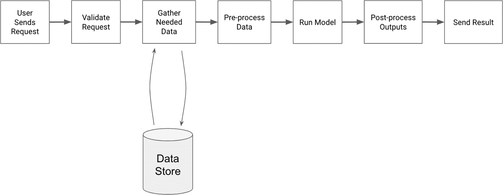
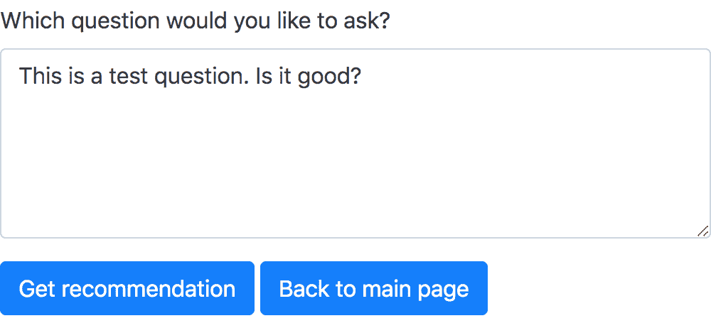
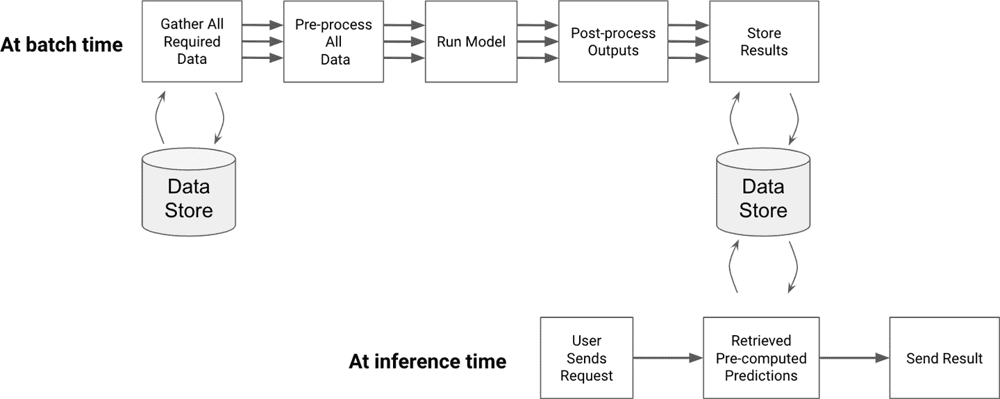
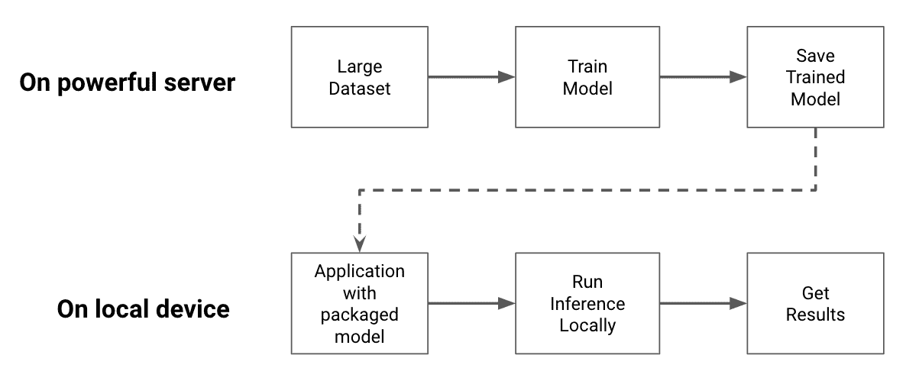
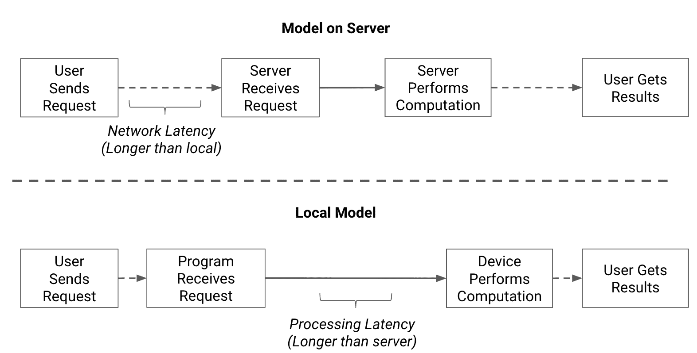
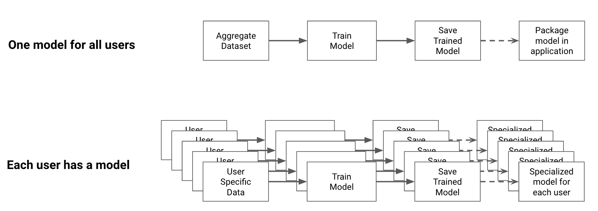

# 第九章：选择您的部署选项

前面的章节介绍了从产品创意到 ML 实现的过程，以及迭代此应用程序直至准备部署的方法。

本章涵盖了不同的部署选项以及它们之间的权衡。不同的部署方法适合不同的需求集合。在选择时，您需要考虑多个因素，如延迟、硬件和网络要求，以及隐私、成本和复杂性问题。

部署模型的目标是允许用户与之交互。我们将介绍实现此目标的常见方法，以及在部署模型时如何在不同方法之间进行选择的技巧。

我们将从部署模型和启动 Web 服务器提供预测的最简单方法开始。

# 服务器端部署

服务器端部署包括设置一个能够接受客户端请求、通过推断管道运行请求并返回结果的网络服务器。这种解决方案适用于 Web 开发范式，因为它将模型视为应用程序中的另一个端点。用户向此端点发送请求，并期望得到结果。

服务器端模型有两种常见的工作负载，流式处理和批处理。流式处理工作流在接收请求时立即处理它们。批处理工作流则较少频繁运行，一次处理大量请求。让我们首先看看流式处理工作流。

## 流式应用程序或 API

流式处理方法将模型视为用户可以发送请求的端点。在这种情况下，用户可以是应用程序的最终用户，也可以是依赖于模型预测的内部服务。例如，预测网站流量的模型可以被内部服务使用，负责根据预测的用户数量调整服务器数量。

在流式应用程序中，请求的代码路径经过我们在“从简单流水线开始”中介绍的一系列步骤。作为提醒，这些步骤包括：

1.  验证请求。验证传递的参数值，并可选择检查用户是否具有运行此模型的正确权限。

1.  收集额外数据。查询其他数据源，获取可能需要的任何额外数据，例如与用户相关的信息。

1.  预处理数据。

1.  运行模型。

1.  后处理结果。验证结果是否在可接受范围内。增加上下文，使用户能够理解，例如解释模型的置信度。

1.  返回结果。

您可以在图 9-1 中看到这些步骤的示例。



###### 图 9-1。流式 API 工作流程

端点方法实现快速，但需要基础设施按当前用户数量线性扩展，因为每个用户会导致单独的推断调用。如果流量增加超出服务器处理请求的能力，则会开始延迟或甚至失败。因此，根据流量模式调整这样的流水线需要能够轻松启动和关闭新服务器，这将需要一定程度的自动化。

然而，对于像 ML 编辑器这样的简单演示，通常一次只需几个用户，流式方法通常是一个不错的选择。为了部署 ML 编辑器，我们使用轻量级 Python Web 应用程序，例如[Flask](https://oreil.ly/cKLMn)，它使得通过几行代码轻松设置一个 API 来为模型提供服务。

你可以在书的[GitHub 存储库](https://github.com/hundredblocks/ml-powered-applications)中找到原型的部署代码，但我将在这里进行高层次的概述。Flask 应用程序由两部分组成，一个 API 接收请求并使用 Flask 将其发送到模型进行处理，另一个是用 HTML 构建的简单网站，用户可以在其中输入其文本并显示结果。定义这样的 API 不需要太多代码。在这里，你可以看到两个处理大部分工作的函数，用于为 ML 编辑器的 v3 版本提供服务：

```
from flask import Flask, render_template, request

@app.route("/v3", methods=["POST", "GET"])
def v3():
    return handle_text_request(request, "v3.html")

def handle_text_request(request, template_name):
    if request.method == "POST":
        question = request.form.get("question")
        suggestions = get_recommendations_from_input(question)
        payload = {"input": question, "suggestions": suggestions}
        return render_template("results.html", ml_result=payload)
    else:
        return render_template(template_name)
```

v3 函数定义了一个路由，允许它确定当用户访问`/v3`页面时要显示的 HTML。它使用`handle_text_request`函数来决定显示什么内容。当用户首次访问页面时，请求类型为`GET`，因此该函数显示 HTML 模板。此 HTML 页面的截图显示在图 9-2 中。如果用户点击“获取推荐”按钮，则请求类型为`POST`，因此`handle_text_request`获取问题数据，将其传递给模型，并返回模型输出。



###### 图 9-2\. 使用模型的简单网页

当存在严格的延迟约束时，需要流式应用程序。如果模型需要的信息只在预测时可用，并且需要立即进行模型预测，则需要一种流式方法。例如，在打车应用中预测特定行程的价格时，需要用户位置信息和司机当前的可用性信息来进行预测，这些信息只在请求时可用。这样的模型还需要立即输出预测结果，因为必须显示给用户，以便他们决定是否使用该服务。

在其他一些情况下，计算预测所需的信息可以提前获得。在这些情况下，一次处理大量请求可能比随时处理更容易。这称为*批处理预测*，我们将在下面进行介绍。

## 批量预测

批处理方法将推断管道视为可以一次运行多个示例的作业。批处理作业在许多示例上运行模型并存储预测，以便在需要时使用。当您在模型的预测需要之前就能获得需要的特征时，批处理作业是适当的。

例如，假设您想要建立一个模型，为您团队的每个销售人员提供最有价值的潜在客户列表。这是一个常见的机器学习问题，称为*潜在客户评分*。为了训练这样的模型，您可以使用历史电子邮件对话和市场趋势等特征。在销售人员决定联系哪个潜在客户时，这些特征是可用的，这也是预测所需的时间点。这意味着您可以在夜间批处理作业中计算潜在客户列表，并在早晨准备好显示结果，这时它们将被需要。

类似地，一个利用机器学习来在早晨优先和排名最重要的消息通知以阅读的应用程序并不需要很强的延迟要求。这种应用程序的适当工作流程是在早晨批处理处理所有未读邮件，并保存优先列表以便用户需要时使用。

与流式处理相比，批处理方法需要像流式处理一样多次推断运行，但可能更加资源高效。因为预测是在预定的时间进行的，并且在批处理开始时已知预测的数量，因此更容易分配和并行化资源。此外，批处理方法在推断时间上可能更快，因为结果已经预先计算并且只需检索。这提供了类似缓存的收益。

图 9-3 展示了这个工作流程的两个方面。在批处理时，我们计算所有数据点的预测并存储我们产生的结果。在推断时，我们检索预先计算的结果。



###### 图 9-3\. 批处理工作流程示例

还可以使用混合方法。在尽可能多的情况下预先计算，在推断时要么检索预先计算的结果，要么在现场计算如果结果不可用或已过时。这种方法可以尽快产生结果，因为可以提前计算的任何内容都会被计算。但同时也需要维护批处理管道和流式处理管道，这显著增加了系统的复杂性。

我们已经讨论了两种在服务器上部署应用程序的常见方式，即流式处理和批处理。这两种方法都需要托管服务器来为客户运行推断，如果产品变得流行起来，这很快会变得昂贵。此外，这些服务器代表了您应用程序的中心故障点。如果预测需求突然增加，您的服务器可能无法容纳所有请求。

或者，您可以直接在客户端设备上处理客户的请求。在用户设备上运行模型可以降低推断成本，并允许您保持服务水平的恒定，无论应用程序的流行程度如何，因为客户端提供了必要的计算资源。这称为*客户端部署*。

# 客户端部署

在客户端部署模型的目标是在客户端上运行所有计算，消除服务器运行模型的需求。计算机、平板电脑、现代智能手机以及一些连接设备如智能音箱或门铃具有足够的计算能力来自行运行模型。

本节仅涵盖*在设备上部署的经过训练的模型*，而不是在设备上训练模型。模型仍然以相同的方式进行训练，然后发送到设备进行推断。模型可以通过包含在应用程序中的方式或从 Web 浏览器加载来到达设备。请参见 图 9-4 以了解在应用程序中打包模型的示例工作流程。



###### 图 9-4\. 模型在设备上运行推断（我们仍然可以在服务器上进行训练）

便携设备的计算能力比强大的服务器更有限，因此这种方法限制了可使用模型的复杂性，但在设备上运行模型可以提供多种优势。

首先，这减少了需要为每个用户运行推断的基础设施的需求。此外，将模型运行在设备上可以减少设备和服务器之间需要传输的数据量。这可以降低网络延迟，甚至允许应用程序在无网络访问的情况下运行。

最后，如果推断所需的数据包含敏感信息，则在设备上运行模型可以消除将此数据传输到远程服务器的需求。不将敏感数据存储在服务器上可降低未经授权的第三方访问这些数据的风险（参见 “数据问题” 为什么这可能是一个严重的风险）。

图 9-5 比较了为用户获取预测的服务器端模型和客户端模型的工作流程。在顶部，您可以看到服务器端工作流程的最长延迟通常是将数据传输到服务器所需的时间。在底部，您可以看到，虽然客户端模型几乎没有延迟，但由于硬件限制，它们处理示例的速度通常比服务器慢。



###### 图 9-5\. 在服务器上运行，或本地运行

就像服务器端部署一样，有多种方法可以在客户端部署应用程序。在接下来的章节中，我们将涵盖两种方法，即本地部署模型和通过浏览器运行模型。这些方法适用于拥有应用商店和 Web 浏览器访问权限的智能手机和平板电脑，但不适用于其他连接设备，比如微控制器，在此我们将不进行介绍。

## 在设备上

笔记本电脑和手机中的处理器通常不会针对运行机器学习模型进行优化，因此会较慢地执行推断流水线。为了使客户端模型能够快速运行且不消耗过多电力，它应尽可能小。

减小模型尺寸可以通过使用更简单的模型、减少模型参数数量或计算精度来实现。例如，在神经网络中，通常会对权重进行修剪（删除接近零值的权重）和量化（降低权重精度）。您可能还希望减少模型使用的特征数量，以进一步提高效率。近年来，诸如[Tensorflow Lite](https://oreil.ly/GKYDs)之类的库开始提供有用的工具，用于减小模型尺寸并帮助使其更容易在移动设备上部署。

由于这些要求，大多数模型在移植到设备上时性能会稍微下降。那些不能容忍模型性能下降的产品，比如依赖于无法在智能手机等设备上运行的前沿模型的产品，应部署在服务器上。通常来说，如果在设备上运行推断所需的时间大于将数据传输到服务器进行处理所需的时间，您应考虑在云端运行您的模型。

对于其他应用，比如在智能手机上提供帮助快速输入的预测键盘，具有无需访问互联网的本地模型的价值超过了精度损失。类似地，一款通过拍照帮助远足者识别植物的智能手机应用应支持离线工作，以便在远足中使用。这样的应用程序需要在设备上部署模型，即使这意味着牺牲预测精度。

翻译应用程序是另一个依赖于本地运行的机器学习驱动产品的例子。这样的应用程序可能会在用户无法访问网络的国外地区使用。因此，拥有可以本地运行的翻译模型成为一种需求，即使它不像只能在服务器上运行的更复杂模型那样精确。

除了网络问题外，将模型运行在云端会增加隐私风险。将用户数据发送到云端并临时存储会增加攻击者访问数据的可能性。考虑到一个看似无害的应用，比如在照片上叠加滤镜。许多用户可能不希望他们的照片被传输到服务器进行处理并永久存储。在越来越注重隐私的世界中，向用户保证他们的照片永远不会离开设备是一个重要的差异化点。正如我们在“数据问题”中看到的，避免将敏感数据置于风险之中的最佳方法是确保它永远不离开设备或存储在您的服务器上。

另一方面，量化、修剪和简化模型是一个耗时的过程。只有在延迟、基础设施和隐私好处值得投入工程工作的情况下，设备端部署才是值得的。对于 ML 编辑器，我们将限制在基于 web 的流媒体 API。

最后，专门优化模型以在特定类型设备上运行可能是耗时的，因为优化过程可能因设备而异。有更多选项可以在本地运行模型，包括利用设备之间的共同点来减少所需的工程工作。在这一领域中一个令人兴奋的地方是浏览器中的机器学习。

## 浏览器端

大多数智能设备都可以访问浏览器。这些浏览器通常已经经过优化，支持快速的图形计算。这导致了对使用浏览器让客户端执行机器学习任务的库的兴趣日益增加。

这些框架中最流行的是[Tensorflow.js](https://www.tensorflow.org/js)，它使得在浏览器中使用 JavaScript 进行大多数可微分模型的训练和推断成为可能，甚至可以处理用不同语言如 Python 训练的模型。

这使用户能够通过浏览器与模型进行交互，而无需安装任何额外的应用程序。此外，由于模型在浏览器中使用 JavaScript 运行，计算是在用户的设备上完成的。您的基础设施只需提供包含模型权重的网页。最后，Tensorflow.js 支持 WebGL，这使它能够利用客户端设备上的 GPU，从而加快计算速度。

使用 JavaScript 框架可以更轻松地在客户端部署模型，而无需像以前的方法那样进行太多的设备特定工作。但是，这种方法的缺点是增加了带宽成本，因为每次客户端打开页面时都需要下载模型，而不是在安装应用程序时仅下载一次。

只要您使用的模型几兆字节或更小，并且可以快速下载，使用 JavaScript 在客户端上运行它们可以是降低服务器成本的有效方法。如果服务器成本对于 ML 编辑器成为问题，我会建议首先探索使用 Tensorflow.js 等框架部署模型的方法。

到目前为止，我们考虑的客户端纯粹是为了部署已经训练过的模型，但我们也可以决定在客户端训练模型。在接下来的部分，我们将探讨这种做法何时会有用。

# 联邦学习：混合方法

我们主要涵盖了已经训练的模型的不同部署方式（理想情况下是按照前几章的指南），现在我们正在选择如何部署。我们已经看过了让所有用户面前都有一个独特模型的不同解决方案，但如果我们希望每个用户都有不同的模型怎么办？

图 9-6 展示了顶部系统中所有用户都有一个共同训练模型的区别，以及底部每个用户都有略微不同版本模型的情况。



###### 图 9-6\. 一个大模型或许多个个体模型

对于许多应用程序，如内容推荐、提供写作建议或医疗保健，模型最重要的信息来源是其对用户的数据。我们可以通过为模型生成用户特定的特征，或者决定每个用户都应该有自己的模型来利用这一事实。这些模型可以共享相同的架构，但每个用户的模型将具有反映其个体数据的不同参数值。

这个想法是联邦学习的核心，这是一个深度学习领域，近年来引起越来越多的关注，例如[OpenMined](https://www.openmined.org/)项目。在联邦学习中，每个客户端都有自己的模型。每个模型从其用户数据中学习，并将聚合（可能匿名化）的更新发送到服务器。服务器利用所有更新来改进其模型，并将这个新模型提炼回个体客户端。

每个用户接收到根据其需求个性化的模型，同时仍然从其他用户的汇总信息中受益。联邦学习提升了用户的隐私，因为他们的数据从不传输到服务器，服务器仅接收聚合的模型更新。这与通过收集每个用户数据并将其全部存储在服务器上来训练模型的传统方式形成鲜明对比。

联邦学习是机器学习的一个令人兴奋的方向，但它增加了额外的复杂性。确保每个个体模型表现良好，并且传输回服务器的数据得到适当的匿名化，比训练单一模型更复杂。

联邦学习已经被那些有资源部署它的团队在实际应用中使用。例如，正如 A. Hard 等人在本文中所述，[“联邦学习用于移动键盘预测”](https://arxiv.org/abs/1811.03604)，Google 的 GBoard 使用联邦学习为智能手机用户提供下一个单词预测。由于用户之间写作风格的多样性，构建一个适合所有用户且性能良好的唯一模型是具有挑战性的。在用户级别训练模型使 GBoard 能够了解用户特定的模式，并提供更好的预测。

我们已经讨论了在服务器、设备甚至两者上部署模型的多种方法。您应根据应用程序的要求考虑每种方法及其权衡。与本书其他章节一样，我建议您从简单的方法开始，并仅在验证必要性后才转向更复杂的方法。

# 结论

有多种方法可以为基于机器学习的应用程序提供服务。您可以设置流式 API，使模型能够处理到达的示例。您可以使用批处理工作流，定期一次性处理多个数据点。或者，您可以选择在客户端部署模型，方法是将它们打包到应用程序中或通过 Web 浏览器提供服务。这样做可以降低推断成本和基础设施需求，但会使部署过程更加复杂。

正确的方法取决于应用程序的需求，例如延迟要求、硬件、网络和隐私问题以及推断成本。对于像 ML Editor 这样的简单原型，建议从端点或简单的批处理工作流开始，并从中迭代。

部署模型不仅仅是让用户接触到它。在第十章中，我们将介绍围绕模型构建保护措施以减少错误的方法、工程工具以提高部署过程的效率，以及验证模型表现是否符合预期的方法。
