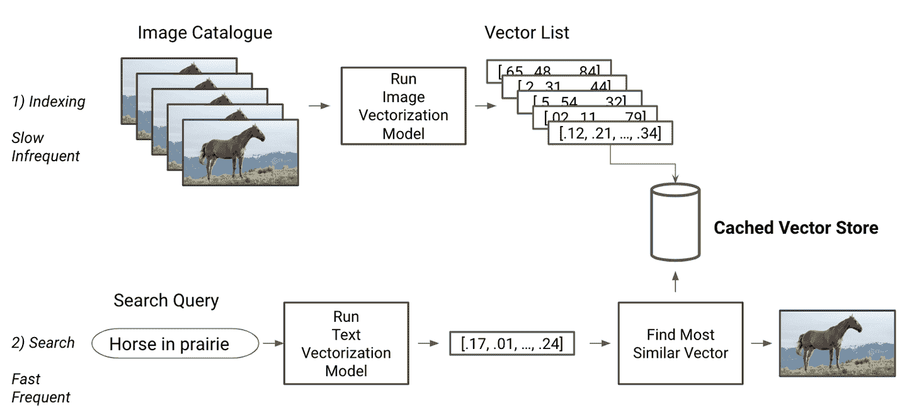

# 第十章：为模型构建保障

在设计数据库或分布式系统时，软件工程师关注的是容错能力，即系统在某些组件失败时仍能继续工作的能力。在软件中，问题不在于系统的某个部分是否会失败，而在于何时会失败。同样的原则也适用于机器学习。无论模型有多好，在某些示例上它都会失败，因此您应该设计一个能够优雅处理这类失败的系统。

在本章中，我们将介绍不同的方法来帮助预防或减轻故障。首先，我们将看看如何验证我们接收和生成的数据的质量，并利用这些验证来决定如何向用户显示结果。然后，我们将探讨如何使建模管道更加健壮，以便有效服务于许多用户。接下来，我们将看看利用用户反馈来评估模型表现的选项。最后，我们将以与克里斯·穆迪关于部署最佳实践的访谈结束本章。

# 围绕故障设计

让我们来看看机器学习管道可能失败的最可能方式。敏锐的读者会注意到，这些故障案例与我们在“调试布线：可视化和测试”中看到的调试技巧有些相似。事实上，在生产中向用户公开模型会带来一系列与调试模型类似的挑战。

错误和 bug 可以在任何地方出现，但有三个特别重要的区域需要验证：管道的输入、模型的置信度以及它生成的输出。让我们依次来解决每个问题。

## 输入和输出检查

任何给定的模型都是在展示特定特征的特定数据集上训练的。训练数据具有特定数量的特征，每个特征都是特定类型的。此外，每个特征都遵循给定的分布，模型学习了这些分布以便准确执行。

正如我们在“新鲜度和分布偏移”中看到的，如果生产数据与模型训练时的数据不同，模型可能会难以表现出色。为了帮助解决这个问题，您应该检查管道的输入。

### 检查输入

一些模型可能在面对数据分布的微小差异时仍然表现良好。然而，如果一个模型接收到与其训练数据非常不同的数据，或者某些特征缺失或类型不符合预期，它将很难表现出色。

正如我们之前所见，即使给定不正确的输入（只要这些输入的形状和类型正确），ML 模型也能够运行。模型将产生输出，但这些输出可能是完全不正确的。考虑以下示例，在图 10-1 中有所说明。一个流水线通过首先对句子进行向量化并在向量化表示上应用分类模型，将句子分类为两个主题。如果流水线收到一串随机字符，它仍然会将其转换为向量，然后模型将进行预测。这个预测是荒谬的，但仅凭查看模型的结果是无法知道的。


###### 图 10-1\. 模型将仍然为随机输入输出预测

为了防止模型在错误输出上运行，我们需要在将其传递给模型之前检测这些输入是否错误。

这些检查覆盖了类似于“测试您的 ML 代码”中的测试的领域。按重要性顺序，它们将会：

1.  验证所有必要特征是否存在

1.  检查每种特征类型

1.  验证特征值

在隔离验证特征值时可能会很困难，因为特征分布可能很复杂。执行此类验证的简单方法是定义特征可能取值的合理范围，并验证其是否落在该范围内。

如果任何输入检查失败，则不应运行模型。您应该根据用例决定应采取的措施。如果缺失的数据代表核心信息的一部分，您应返回一个指明错误来源的错误。如果您估计仍然可以提供结果，则可以将模型调用替换为启发式算法。这是在任何 ML 项目中首先建立启发式算法的另一个原因；它为您提供了一个备用选项！

在图 10-2 中，您可以看到这种逻辑的示例，其中所采取的路径取决于输入检查的结果。


###### 图 10-2\. 输入检查的分支逻辑示例

以下是来自 ML 编辑器的一些控制流逻辑示例，用于检查缺失特征和特征类型。根据输入的质量，它要么引发错误，要么运行启发式算法。我在这里复制了示例，但您也可以在[本书的 GitHub 存储库](https://github.com/hundredblocks/ml-powered-applications)中找到 ML 编辑器代码的其余部分。

```
def validate_and_handle_request(question_data):
    missing = find_absent_features(question_data)
    if len(missing) > 0:
        raise ValueError("Missing feature(s) %s" % missing)

    wrong_types = check_feature_types(question_data)
    if len(wrong_types) > 0:
        # If data is wrong but we have the length of the question, run heuristic
        if "text_len" in question_data.keys():
            if isinstance(question_data["text_len"], float):
                return run_heuristic(question_data["text_len"])
        raise ValueError("Incorrect type(s) %s" % wrong_types)

    return run_model(question_data)
```

验证模型输入允许您缩小故障模式并识别数据输入问题。接下来，您应该验证模型的输出。

### 模型输出

一旦模型进行预测，您应该确定是否应将其显示给用户。如果预测结果不在模型可接受答案范围内，您应考虑不显示它。

例如，如果您正在从照片预测用户的年龄，输出值应在 0 到略高于 100 岁之间（如果您在公元 3000 年阅读本书，请随时调整范围）。如果模型输出超出此范围的值，则不应显示它。

在这种情况下，可接受的结果不仅由可能的结果定义。它还取决于您对对用户有用的结果种类的估计。

对于我们的机器学习编辑器，我们希望只提供可操作的建议。如果模型预测用户所写的一切都应完全删除，那将是一个相当无用（并且侮辱性的）建议。以下是一个示例片段，验证模型输出并在必要时返回到一种启发式方法：

```
def validate_and_correct_output(question_data, model_output):
    # Verify type and range and raise errors accordingly
    try:
        # Raises value error if model output is incorrect
        verify_output_type_and_range(model_output)
    except ValueError:
        # We run a heuristic, but could run a different model here
        run_heuristic(question_data["text_len"])

    # If we did not raise an error, we return our model result
    return model_output
```

当模型失败时，您可以像之前看到的那样返回到一个启发式方法，或者返回到您之前可能构建的一个简单模型。尝试早期类型的模型通常是值得的，因为不同的模型可能存在不相关的错误。

我在图 10-3 上展示了一个玩具示例。在左侧，您可以看到一个性能更好的模型，具有更复杂的决策边界。在右侧，您可以看到一个更糟糕、更简单的模型。更糟糕的模型会犯更多错误，但其错误与复杂模型不同，因为其决策边界形状不同。因此，简单模型会正确处理一些复杂模型处理错误的案例。这就是在主模型失败时使用简单模型作为备用的直觉合理性。

如果您确实将简单模型用作备用，您还应以相同方式验证其输出，并在未通过检查时退回到一种启发式方法或显示错误。

验证模型输出是否在合理范围内是一个良好的开始，但这还不够。在接下来的部分中，我们将讨论我们可以围绕模型构建的额外保护措施。


###### 图 10-3\. 简单模型通常会犯不同的错误

## 模型失败的备用方案

我们已经建立了防范措施来检测和纠正错误的输入和输出。然而，在某些情况下，我们的模型的输入可能是正确的，而模型的输出可能是合理的，但完全是错误的。

要回到从照片预测用户年龄的示例，保证模型预测的年龄是一个合理的人类年龄是一个良好的开始，但理想情况下，我们希望为这个特定用户预测正确的年龄。

没有模型会百分之百正确，轻微的错误通常是可以接受的，但尽可能地，您应该努力检测模型何时错误。这样做可以让您可能标记某个案例过于困难，并鼓励用户提供更简单的输入（例如，形式良好的照片）。

检测错误有两种主要方法。最简单的方法是跟踪模型的置信度来估计输出是否准确。第二种方法是构建一个额外的模型，任务是检测主模型可能失败的示例。

对于第一种方法，分类模型可以输出一个概率，可以用作模型对其输出的置信度的估计。如果这些概率被很好地校准（见“校准曲线”），它们可以用来检测模型不确定的实例，并决定不向用户显示结果。

有时候，即使模型为一个例子分配了很高的概率，也会出现错误。这就是第二种方法的出现的地方：使用一个模型来过滤最难的输入。

### 过滤模型

除了不总是可信之外，使用模型的置信度得分还有另一个强大的缺点。要获得这个分数，需要运行整个推理管道，无论其预测是否会被使用。当使用需要在 GPU 上运行的更复杂的模型时，这种方式尤其浪费。理想情况下，我们希望在不运行模型的情况下估计模型在一个示例上的表现。

这就是过滤模型的理念。由于你知道某些输入对于模型来说很难处理，你应该提前检测到它们，而不需要在它们上运行模型。过滤模型是输入测试的机器学习版本。它是一个二元分类器，被训练来预测一个模型在给定示例上的表现是否良好。这种模型的核心假设是，有些数据点对主模型来说很难。如果这些困难的示例有足够的共同点，过滤模型可以学会将它们与更容易的输入区分开来。

这里有一些你可能希望过滤模型捕捉到的输入类型：

+   与主模型表现良好的输入质量上有所不同的输入

+   主模型在训练过程中有困难的输入

+   有意欺骗主模型的对抗性输入

在图 10-4 中，你可以看到更新的示例，展示了图 10-2 中的逻辑，现在包括一个过滤模型。如你所见，只有在输入检查通过时才运行过滤模型，因为你只需过滤掉可能进入“运行模型”框的输入。

要训练一个过滤模型，你只需收集一个包含两类示例的数据集；主模型成功的类别和失败的类别。这可以使用我们的训练数据完成，不需要额外的数据收集！


###### 图 10-4\. 在我们的输入检查中添加一个过滤步骤（加粗）

在 图 10-5 中，我展示了如何通过利用训练好的模型及其在数据集上的结果来做到这一点，正如左侧图表所示。随机抽取一些模型预测正确的数据点和一些模型预测失败的数据点。然后，您可以训练一个过滤模型来预测原始模型预测失败的数据点。


###### 图 10-5\. 为过滤模型获取训练数据

一旦你有了训练好的分类器，训练过滤模型就相对简单。给定一个测试集和一个训练好的分类器，以下函数将完成此任务。

```
def get_filtering_model(classifier, features, labels):
    """
 Get prediction error for a binary classification dataset
 :param classifier: trained classifier
 :param features: input features
 :param labels: true labels
 """
    predictions = classifier.predict(features)
    # Create labels where errors are 1, and correct guesses are 0
    is_error = [pred != truth for pred, truth in zip(predictions, labels)]

    filtering_model = RandomForestClassifier()
    filtering_model.fit(features, is_error)
    return filtering_model
```

Google 在其智能回复功能中使用了这种方法，该功能为即将到达的电子邮件建议几个简短的回复（参见 A. Kanan 等人的文章 [“Smart Reply: Automated Response Suggestion for Email”](https://oreil.ly/2EQvu)）。他们使用所谓的触发模型，负责决定是否运行建议回复的主模型。在他们的情况下，仅约 11% 的电子邮件适合该模型。通过使用过滤模型，他们将基础设施需求降低了一个数量级。

过滤模型通常需要满足两个标准。它应该快速，因为其主要目的是减少计算负担，并且应该擅长消除困难案例。

一个试图识别困难案例的过滤模型不需要能够捕获所有这些案例；它只需检测足够多的案例以证明在每次推理中运行它的额外成本是合理的。通常情况下，你的过滤模型越快，它需要的效果就越小。原因如下：

假设你仅使用一个模型的平均推理时间是<math alttext="i"><mi>i</mi></math>。

使用过滤模型的平均推理时间将是 <math alttext="f plus i left-parenthesis 1 minus b right-parenthesis"><mrow><mi>f</mi> <mo>+</mo> <mi>i</mi> <mo>(</mo> <mn>1</mn> <mo>-</mo> <mi>b</mi> <mo>)</mo></mrow></math> ，其中 *f* 是您的过滤模型执行时间，*b* 是它过滤掉的平均例子比例（b 代表 block）。

要通过使用过滤模型来减少您的平均推理时间，您因此需要 <math alttext="f plus i left-parenthesis 1 minus b right-parenthesis less-than i"><mrow><mi>f</mi> <mo>+</mo> <mi>i</mi> <mo>(</mo> <mn>1</mn> <mo>-</mo> <mi>b</mi> <mo>)</mo> <mo><</mo> <mi>i</mi></mrow></math> ，这等同于 <math alttext="StartFraction f Over i EndFraction less-than b"><mrow><mfrac><mi>f</mi> <mi>i</mi></mfrac> <mo><</mo> <mi>b</mi></mrow></math> 。

这意味着你的模型过滤掉的案例比其推理速度与你更大模型速度之间的比例要高。

例如，如果您的过滤模型比常规模型快 20 倍（ <math alttext="StartFraction f Over i EndFraction equals 5 percent-sign"><mrow><mfrac><mi>f</mi> <mi>i</mi></mfrac> <mo>=</mo> <mn>5</mn> <mo>%</mo></mrow></math> ），它需要阻止超过 5%的情况（ <math alttext="5 percent-sign b"><mrow><mn>5</mn> <mo>%</mo> <mo><</mo> <mi>b</mi></mrow></math> ），才能在生产中发挥作用。

当然，您还需要确保您的过滤模型的精度很高，这意味着它所阻止的大多数输入实际上对于您的主模型来说确实太难了。

一个方法是定期让一些例子通过，这些例子被您的过滤模型阻止了，然后检查主模型在这些例子上的表现。我们将在“选择监控内容”中更深入地讨论这一点。

由于过滤模型与推理模型不同，并且专门训练来预测困难情况，因此它可以比依赖主模型的概率输出更准确地检测这些情况。因此，使用过滤模型既有助于减少不良结果的可能性，又有助于改善资源使用。

由于这些原因，将过滤模型添加到现有的输入和输出检查中，可以显著增加生产管道的稳健性。在接下来的部分中，我们将讨论更多方法，通过讨论如何将机器学习应用程序扩展到更多用户以及如何组织复杂的训练流程，来使管道更加稳健。

# 为性能进行工程设计

在将模型部署到生产环境时保持性能是一个重大挑战，特别是产品变得越来越受欢迎，新版本的模型定期部署。我们将从讨论允许模型处理大量推理请求的方法开始这一部分。然后，我们将涵盖使定期部署更新的模型版本更容易的功能。最后，我们将讨论通过使训练流程更可复制来减少模型性能变化的方法。

## 扩展到多个用户

许多软件工作负载是横向可扩展的，这意味着在请求数量增加时，启动额外的服务器是一种有效的策略，以保持响应时间合理。在这个方面，机器学习也不例外，因为我们可以简单地启动新服务器来运行我们的模型，并处理额外的容量。

###### 注意

如果使用深度学习模型，您可能需要一个 GPU 在可接受的时间内提供结果。如果是这种情况，并且您预计将有足够的请求需要超过一个启用 GPU 的机器，您应该在两个不同的服务器上运行应用逻辑和模型推理。

因为 GPU 实例在大多数云服务提供商中的价格往往比普通实例高出一个数量级，因此采用一个较便宜的实例扩展应用程序，而 GPU 实例仅处理推理，将显著降低计算成本。在使用此策略时，应注意引入一些通信开销，并确保这对您的使用案例影响不大。

除了增加资源分配外，机器学习还有助于处理额外流量的高效方式，例如缓存。

### 机器学习的缓存

缓存是存储函数调用结果的实践，以便以后使用相同参数调用此函数时可以通过简单检索存储的结果来更快地运行。缓存是加速工程管道的常见实践，对机器学习非常有用。

#### 推理结果的缓存

最近最少使用（LRU）缓存是一种简单的缓存方法，它包括跟踪模型的最近输入及其对应的输出。在对任何新输入运行模型之前，查找缓存中的输入。如果找到相应条目，则直接从缓存中提供结果。图 10-6 显示了这种工作流程的示例。第一行表示首次遇到输入时的缓存步骤。第二行描述了再次看到相同输入时的检索步骤。


###### 图 10-6\. 图像字幕模型的缓存

这种缓存策略适用于用户提供相同类型输入的应用程序。如果每个输入都是唯一的，则不适用。例如，一个应用程序接收动物爪印的照片以预测它们属于哪种动物，它很少会收到两张完全相同的照片，所以 LRU 缓存对其无济于事。

使用缓存时，应仅缓存无副作用的函数。例如，如果`run_model`函数还将结果存储到数据库中，则使用 LRU 缓存将导致不保存重复函数调用，这可能不是预期的行为。

在 Python 中，`functools`模块提供了一个 LRU 缓存的默认[实现](https://oreil.ly/B73Bo)，您可以通过简单的装饰器来使用，如下所示：

```
from functools import lru_cache

@lru_cache(maxsize=128)
def run_model(question_data):
    # Insert any slow model inference below
    pass
```

当检索特征、处理它们和运行推理速度慢于访问缓存时，缓存最为有用。根据缓存方法的不同（例如内存中还是磁盘中）以及所使用模型的复杂性，缓存的有用程度会有所不同。

#### 按索引缓存

尽管所描述的缓存方法在接收唯一输入时不适用，我们可以缓存管道的其他可预先计算部分。如果模型不仅依赖用户输入，则这样做最为简单。

假设我们正在构建一个系统，允许用户搜索与他们提供的文本查询或图像相关的内容。如果我们预计查询会显著变化，缓存用户查询可能不会显著提升性能。然而，作为一个搜索系统的构建者，我们可以访问我们目录中潜在项目的列表，这些项目我们事先知道，无论我们是在线零售商还是文档索引平台。

这意味着我们可以预先计算仅依赖于我们目录中项目的建模方面。如果我们选择一种允许我们提前进行此计算的建模方法，我们可以显著加快推理速度。

因此，构建搜索系统时的一种常见方法是首先将所有索引文档转换为有意义的向量（有关向量化方法，请参阅“向量化”）。一旦创建了嵌入，它们可以存储在数据库中。这在图 10-7 的顶行有所说明。当用户提交搜索查询时，在推理时对其进行嵌入，并在数据库中执行查找以找到最相似的嵌入并返回对应这些嵌入的产品。您可以在图 10-7 的底行中看到这一过程的图示。

这种方法显著加快了推理速度，因为大部分计算工作都已提前完成。在诸如 Twitter（参见[Twitter 博客上的这篇文章](https://oreil.ly/3R5hL)）和 Airbnb（参见 M. Haldar 等人的文章，[“将深度学习应用于 Airbnb 搜索”](https://arxiv.org/abs/1810.09591)）等公司的大规模生产流水线中已成功使用了嵌入技术。



###### 图 10-7\. 带有缓存嵌入的搜索查询

缓存可以提高性能，但会增加复杂性。缓存的大小成为一个额外的超参数，根据您的应用工作负载进行调整。此外，任何时候模型或基础数据更新，都需要清除缓存，以防止提供过时的结果。更普遍地说，将正在生产中运行的模型更新到新版本通常需要小心处理。在接下来的部分，我们将介绍一些领域，可以帮助使这些更新更容易。

## 模型和数据生命周期管理

保持缓存和模型的更新可能具有挑战性。许多模型需要定期重新训练以维持其性能水平。虽然我们将在第十一章中介绍何时重新训练您的模型，但我想简要讨论一下如何将更新的模型部署给用户。

通常，训练好的模型被存储为一个包含其类型、架构以及学习到的参数信息的二进制文件。大多数生产应用程序在启动时将训练好的模型加载到内存中，并调用其提供结果。用新版本替换模型的一个简单方法是替换应用程序加载的二进制文件。如图 10-8（#replacing_model_binary）所示，这只会影响到流水线中的粗体框。

然而，在实践中，这个过程通常更加复杂。理想情况下，一个机器学习应用程序能够产生可重现的结果，能够适应模型更新，并且足够灵活，以处理重大的建模和数据处理变化。确保这一点需要进行一些额外的步骤，接下来我们将详细介绍。


###### 图 10-8\. 部署更新版本的相同模型似乎是一个简单的改变

### 可重现性

要追踪和重现错误，您需要知道生产环境中运行的是哪个模型。为此，需要保留训练过的模型及其训练数据集的存档。每个模型/数据集对应一个唯一标识符。每次在生产中使用模型时，应记录此标识符。

在图 10-9 中，我已将这些要求添加到加载和保存框中，以展示这对机器学习流水线的复杂性产生的影响。


###### 图 10-9\. 在保存和加载时添加关键元数据

除了能够提供不同版本的现有模型外，生产流水线还应该努力在没有显著停机时间的情况下更新模型。

### 弹性

使应用程序能够在更新后加载新模型需要建立一个过程，能够加载更新后的模型，理想情况下不会影响到用户的服务。这可能包括启动一个新的服务器来提供更新后的模型，并逐渐将流量转移到新模型上，但对于较大的系统来说，这很快就会变得更加复杂。如果新模型表现不佳，我们希望能够回滚到以前的版本。正确执行这两项任务是具有挑战性的，并且传统上被归类为 DevOps 领域。虽然我们不会深入探讨这个领域，但我们会在第 11 章中介绍监控。

生产环境的变更可能比更新模型更加复杂。它们可以包括对数据处理的大幅更改，这些更改也应该可以部署。

### 流水线的灵活性

我们之前看到，改进模型的最佳方法通常是通过迭代数据处理和特征生成。这意味着新版本的模型通常需要额外的预处理步骤或不同的特征。

这种变化不仅体现在模型二进制文件中，通常还与您的应用程序的新版本相关联。因此，在模型进行预测时，还应记录应用程序版本，以使此预测可重现。

这样做增加了我们管道的另一个复杂层次，在图 10-10 中以增加的预处理和后处理框进行了描述。这些现在也需要是可重现和可修改的。

部署和更新模型具有挑战性。在构建服务基础设施时，最重要的是能够复现模型在生产中运行的结果。这意味着将每个推理调用与运行的模型、模型训练的数据集以及为该模型提供服务的数据管道版本相关联起来。


###### 图 10-10\. 添加模型和应用程序版本

## 数据处理和 DAGs

要像前面描述的那样生成可重现的结果，训练管道也应该是可重现和确定性的。对于给定的数据集组合、预处理步骤和模型，训练管道应该在每次训练运行时生成相同的训练模型。

构建模型需要许多连续的转换步骤，因此管道经常会在不同位置中断。这使得确保每个部分都成功运行并且按正确顺序运行成为可能。

简化这一挑战的一种方法是将从原始数据到训练模型的过程表示为一个有向无环图（DAG），其中每个节点表示一个处理步骤，每个步骤表示两个节点之间的依赖关系。这个想法是数据流编程的核心，这也是流行的 ML 库 TensorFlow 所基于的编程范式。

DAG 可以是可视化预处理的一种自然方式。在图 10-11 中，每个箭头代表一个依赖于另一个任务的任务。该表示允许我们保持每个任务简单，使用图结构来表达复杂性。


###### 图 10-11\. 我们应用程序的 DAG 示例

一旦我们有了一个 DAG（有向无环图），我们就能够保证对每个生成的模型采取相同的操作序列。有多种方法可以为 ML 定义 DAG，包括像[Apache Airflow](https://oreil.ly/8ztqj)或 Spotify 的[Luigi](https://oreil.ly/jQFj8)这样的活跃开源项目。这两个软件包允许您定义 DAG，并提供一组仪表板，以便您监视 DAG 的进展和任何相关日志。

当首次构建 ML 管道时，使用 DAG 可能会显得不必要复杂，但一旦模型成为生产系统的核心组成部分，可重现性要求使 DAG 变得非常吸引人。一旦模型定期进行重新训练和部署，任何能帮助系统化、调试和版本化管道的工具都将成为重要的时间节省者。

结束本章，我将介绍另一种直接的方式来确保模型的性能良好——询问用户。

# 请求反馈

本章介绍了能够确保我们及时向每个用户提供准确结果的系统。为了保证结果的质量，我们讨论了检测模型预测是否不准确的策略。为什么不问问用户呢？

当显示模型预测时，你可以通过请求明确反馈或测量隐式信号来从用户那里获取反馈。这可以简单到一个对话框询问“这个预测有用吗？”或者更为微妙的方式。

例如，预算应用 Mint 自动为账户上的每笔交易分类（包括*旅行*、*食品*等）。正如在图 10-12 中所示，每个类别在用户界面中显示为用户可以编辑和纠正的字段。这样的系统允许收集宝贵的反馈，以持续改进模型，比起满意度调查等方式，更少侵入性。


###### Figure 10-12\. 让用户直接修正错误

用户无法为模型每次预测提供反馈，因此收集隐式反馈是评估 ML 性能的重要方式。收集此类反馈包括查看用户执行的操作，以推断模型是否提供了有用的结果。

隐式信号非常有用但更难解释。你不能指望找到一个总是与模型质量相关的隐式信号，只能找到在总体上相关的信号。例如，在推荐系统中，如果用户点击了一个推荐的物品，你可以合理地假设该推荐是有效的。这在所有情况下都不成立（有时人们会误点击！），但只要大多数情况下是真的，这就是一个合理的隐式信号。

通过收集这些信息，如图 10-13 所示，你可以估计用户发现结果有用的频率。收集此类隐式信号非常有用，但也伴随着收集和存储数据的风险，并且可能引入我们在第八章中讨论过的负反馈循环。


###### Figure 10-13\. 用户行为作为反馈的来源

在你的产品中构建隐式反馈机制可以是收集额外数据的一种有价值的方式。许多动作可以被视为隐式和显式反馈的混合。

假设我们在我们的 ML 编辑器的推荐中添加了一个“在 Stack Overflow 上提问”的按钮。通过分析导致用户点击此按钮的预测，我们可以衡量推荐中可以作为问题发布的比例。通过添加此按钮，我们并不直接询问用户建议是否良好，而是允许他们采取行动，从而为我们提供了“弱标签”（请参见“数据类型”中对弱标记数据的提醒）来评估问题质量。

除了作为训练数据的良好来源外，隐式和显式用户反馈也可以是注意到 ML 产品性能下降的第一种方式。虽然理想情况下应在显示给用户之前捕获错误，但监控此类反馈有助于更快地检测和修复错误。我们将在第十一章中更详细地讨论这一点。

部署和更新模型的策略因团队规模和他们在机器学习方面的经验而异。本章中的一些解决方案对于像 ML 编辑器这样的原型而言过于复杂。另一方面，一些投入大量资源到机器学习的团队已经建立了复杂的系统，使他们能够简化部署过程，并保证给用户高水平的质量。接下来，我将分享一个关于克里斯·穆迪的采访，他领导着 Stitch Fix 的 AI Instruments 团队，并将带我们了解他们在部署机器学习模型时的理念。

# 克里斯·穆迪：赋予数据科学家们部署模型的权力

克里斯·穆迪毕业于加州理工学院和加州大学圣克鲁兹分校，拥有物理学背景，现在领导着 Stitch Fix 的 AI Instruments 团队。他对自然语言处理有浓厚兴趣，并涉足深度学习、变分方法和高斯过程。他为深度学习库 [Chainer](http://chainer.org/) 做出了贡献，为 [scikit-learn](https://oreil.ly/t3Q0k) 贡献了超快的 Barnes–Hut 版本的 t-SNE，还编写了（为数不多的！）稀疏张量分解库 [Python](https://oreil.ly/tS_qD)。他还建立了自己的 NLP 模型，[lda2vec](https://oreil.ly/t7XFr)。

Q：*在 Stitch Fix，数据科学家们在模型生命周期的哪个部分工作？*

A: 在 Stitch Fix，数据科学家拥有整个建模管道。这个管道很广泛，包括构思、原型设计、设计和调试、ETL 以及使用 scikit-learn、pytorch 和 R 等语言和框架进行模型训练。此外，数据科学家负责建立度量系统和为模型设置“健全性检查”。最后，数据科学家运行 A/B 测试，监控错误和日志，并根据观察到的情况重新部署更新的模型版本。为了能够做到这一点，他们利用平台和工程团队的工作成果。

Q: *平台团队为简化数据科学工作做了什么？*

A: 平台团队的工程师的目标是为建模找到合适的抽象。这意味着他们需要了解数据科学家的工作方式。工程师们不为在特定项目上工作的数据科学家构建单独的数据管道。他们构建的是能让数据科学家自己完成这些工作的解决方案。更普遍地说，他们构建工具来赋予数据科学家全流程所有权。这使工程师们能够花更多时间改进平台，而不是构建临时解决方案。

Q: *一旦部署了模型，你如何评估其性能？*

A: Stitch Fix 的一大优势在于使人类和算法共同工作。例如，Stitch Fix 投入了大量时间思考向他们的设计师呈现信息的正确方式。从根本上说，如果你在一端暴露你的模型有一个 API，并在另一端有像设计师或商品购买者这样的用户，你应该如何设计他们之间的交互？

乍一看，你可能会想要构建一个前端，简单地向用户展示算法的结果。不幸的是，这可能会让用户感觉他们对算法和整个系统没有控制权，在算法表现不佳时会感到沮丧。相反，你应该将这种交互视为一个反馈循环，允许用户进行纠正和调整结果。这样做可以让用户训练算法，并对整个过程产生更大的影响，因为他们可以提供反馈。此外，这还可以帮助你收集标记数据以评估模型的性能。

要做到这一点，数据科学家应该问自己如何向用户展示模型，以便既能简化他们的工作，又能赋予他们使模型变得更好的能力。这意味着由于数据科学家最了解什么样的反馈对他们的模型最有用，因此他们对从端到端拥有整个过程至关重要。他们可以捕捉到任何错误，因为他们可以看到整个反馈循环。

Q: *你如何监控和调试模型？*

-   A: 当你的工程团队构建了优秀的工具时，监控和调试变得更加容易。Stitch Fix 已经构建了一个内部工具，它接收建模管道并创建 Docker 容器，验证参数和返回类型，将推断管道作为 API 公开，部署到我们的基础设施上，并在其之上构建仪表板。这些工具允许数据科学家在部署期间或之后直接修复任何错误。因为数据科学家现在负责解决模型故障，我们还发现这种设置促使简单且稳健的模型更少出现故障。整个流程的所有权促使个人优化影响和可靠性，而不是模型复杂性。

Q: *你是如何部署新模型版本的？*

-   A: 此外，数据科学家们通过使用自定义构建的 A/B 测试服务来运行实验，该服务允许他们定义精细的参数。然后他们分析测试结果，如果团队认为结果是确凿的，他们会自行部署新版本。

在部署方面，我们使用类似金丝雀开发的系统，从一个实例开始部署新版本，然后逐步更新实例并监控性能。数据科学家们可以访问仪表板，显示每个版本下的实例数量和随着部署进展的连续性能指标。

# 结论

在本章中，我们已经讨论了通过积极检测模型潜在故障并找到缓解方法来使我们的响应更具弹性的方式。这包括确定性验证策略和使用过滤模型。我们还讨论了保持生产模型更新的一些挑战。然后，我们探讨了如何评估模型性能的几种方法。最后，我们看了一个频繁部署 ML 的大规模公司的实际例子，以及他们为此构建的流程。

在 第十一章 中，我们将介绍额外的方法来监控模型的性能，并利用各种指标来诊断 ML 驱动应用的健康状况。
