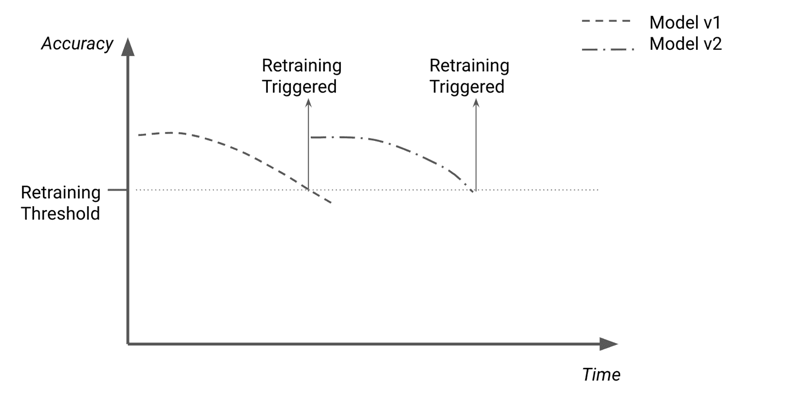
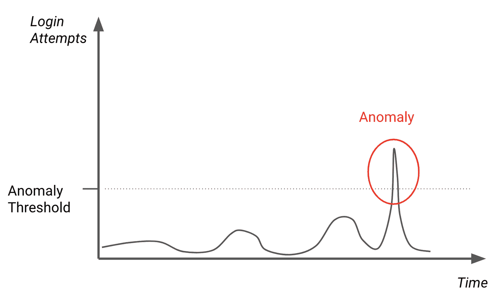
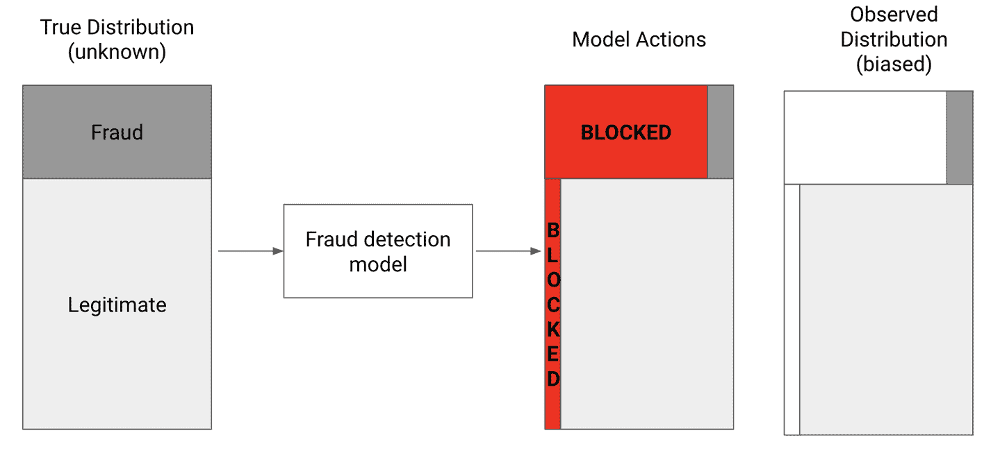
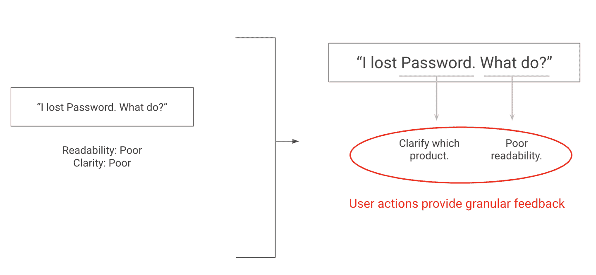
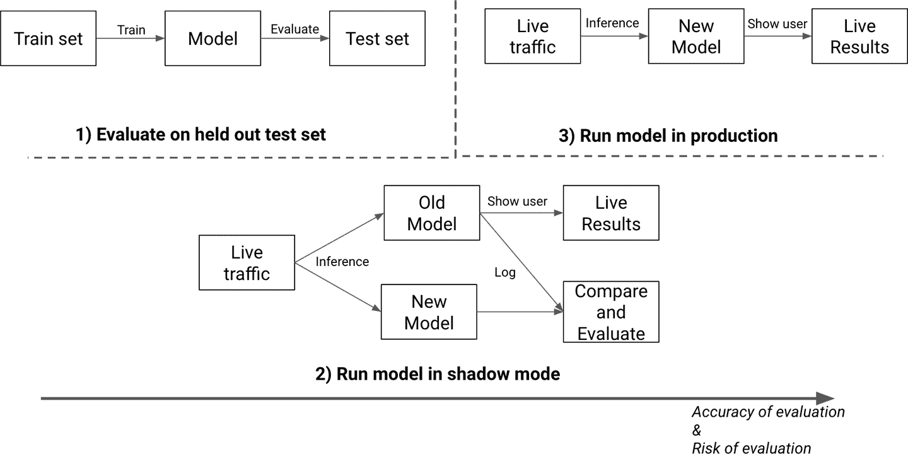
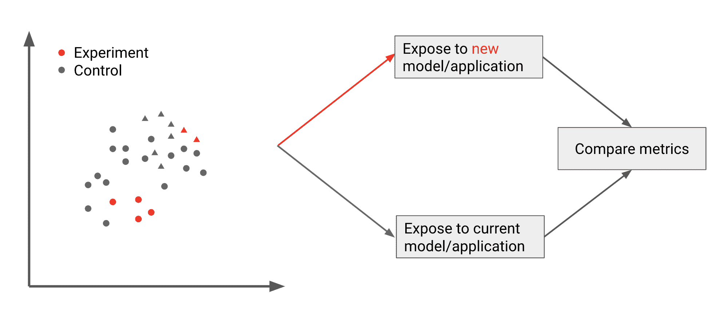
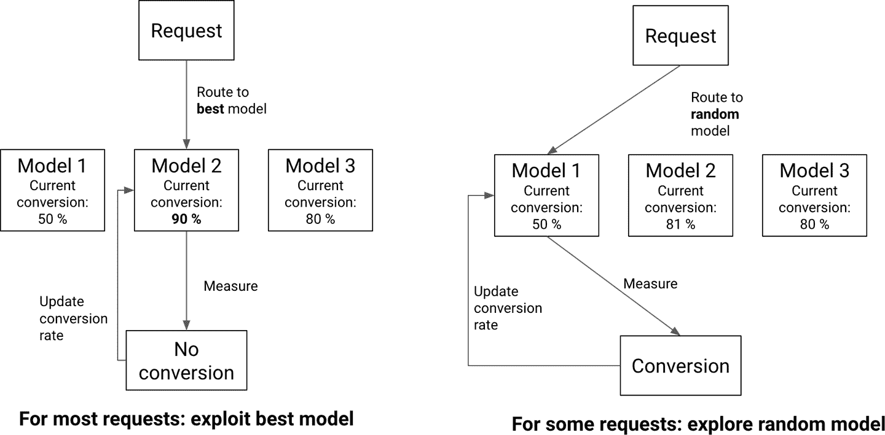

# 第十一章：监控和更新模型

一旦模型部署，其性能应该像任何其他软件系统一样受到监控。就像他们在 “测试你的 ML 代码” 中所做的那样，常规软件最佳实践同样适用。并且就像在 “测试你的 ML 代码” 中一样，处理机器学习模型时还有其他需要考虑的事项。

在本章中，我们将描述监控机器学习模型时需要牢记的关键方面。更具体地，我们将回答三个问题：

1.  为什么我们应该监控我们的模型？

1.  我们如何监控我们的模型？

1.  我们的监控应该驱动什么行动？

开始我们先讨论监控模型如何帮助决定何时部署新版本或发现生产中的问题。

# 监控能够挽救生命

监控的目标是跟踪系统的健康状况。对于模型来说，这意味着监控它们的性能和预测质量。

如果用户习惯的改变突然导致模型产生次优的结果，一个良好的监控系统将允许您尽快注意并作出反应。让我们讨论一些监控可以帮助我们捕捉的关键问题。

## 用于指导刷新率的监控

我们在 “新鲜度和分布变化” 中看到，大多数模型需要定期更新以保持给定性能水平。监控可以用来检测模型何时不再新鲜并需要重新训练。

例如，假设我们利用用户的隐式反馈（例如他们是否点击推荐内容）来估计模型的准确性。如果我们持续监控模型的准确性，我们可以在准确性低于定义的阈值时立即训练一个新模型。 图 11-1 展示了这一过程的时间轴，重新训练事件发生在准确性低于阈值时。

###### 图 11-1\. 触发重新部署的监控

在重新部署更新模型之前，我们需要验证新模型是否更好。我们稍后将介绍如何做到这一点，在本节中的 “ML 的 CI/CD”。首先，让我们解决其他需要监控的方面，比如潜在的滥用问题。

## 监控以检测滥用

在某些情况下，例如构建滥用预防或欺诈检测系统时，一部分用户正在积极地尝试击败模型。在这些情况下，监控成为检测攻击和估算其成功率的关键方式。

监控系统可以使用异常检测来检测攻击。例如，当追踪银行在线门户的每次登录尝试时，如果登录尝试数量突然增加十倍，监控系统可能会发出警报，这可能是攻击的迹象。

根据越过阈值值发出警报的监控，就像您在图 11-2 中看到的那样，或包括更加微妙的指标，例如登录尝试增加的速率。根据攻击的复杂性，构建一个模型来检测这些异常可能比简单的阈值更有价值。

###### 图 11-2\. 监控仪表板上明显的异常。您可以构建一个额外的 ML 模型来自动检测它。

除了监控新鲜度和检测异常之外，我们应该监控哪些其他指标？

# 选择监控内容

软件应用通常监控指标，如处理请求的平均时间、未能处理的请求比例以及可用资源的数量。这些对于任何生产服务的跟踪都是有用的，并允许在太多用户受到影响之前采取积极的补救措施。

接下来，我们将覆盖更多的指标以便检测模型性能开始下降的情况。

## 性能指标

如果数据分布开始变化，模型可能会变得陈旧。您可以在图 11-3 中看到这一点。

###### 图 11-3\. 特征分布漂移示例

在处理分布变化时，数据的输入和输出分布都可能发生变化。例如，考虑一个试图猜测用户将来会观看哪部电影的模型。给定相同的用户历史作为输入，基于可用电影目录的新条目，模型的预测应该会改变。

+   *跟踪输入分布的变化*（也称为特征漂移）比跟踪输出分布更容易，因为访问满足用户期望的理想输出值可能具有挑战性。

+   *监控输入分布*可以简单地监控诸如关键特征的均值和方差等汇总统计数据，并在这些统计数据偏离训练数据中的值超过给定阈值时发出警报。

+   *监控分布变化*可能更具挑战性。一个首要方法是监控模型输出的分布。类似于输入，输出分布的显著变化可能表明模型性能已经降低。然而，用户希望看到的结果分布可能更难估计。

估计基础事实可能困难的原因之一是，模型的行动通常会阻止我们观察它。为了理解可能的情况，请考虑信用卡欺诈检测模型的示例图 11-4。模型将接收到的数据分布在左侧。随着模型对数据进行预测，应用代码根据这些预测采取行动，阻止任何预测为欺诈的交易。

一旦交易被阻止，我们就无法观察如果我们让其通过会发生什么。这意味着我们无法知道被阻止的交易是否真的是欺诈的。我们只能观察和标记我们放行的交易。因为基于模型预测行动，我们只能观察到一个偏斜的非阻止交易分布，显示在右侧。

###### 图 11-4。基于模型预测采取行动可能会偏倚观察到的数据分布。

由于只能访问偏斜样本的真实分布，这使得正确评估模型的性能变得不可能。这是*反事实评估*的焦点，其目标是评估如果我们没有对模型采取行动会发生什么。为了在实践中执行这样的评估，您可以在一小部分示例上暂停运行模型（参见李力宏等人的文章，“点击指标的反事实估计和优化”（https://arxiv.org/abs/1403.1891））。不对随机示例采取行动将使我们能够观察到一个无偏的欺诈交易分布。通过比较模型预测与随机数据的真实结果，我们可以开始估计模型的精度和召回率。

这种方法提供了一种评估模型的方式，但代价是让一部分欺诈交易通过。在许多情况下，这种权衡是有利的，因为它允许模型的基准测试和比较。在某些情况下，比如在医疗领域，随机预测输出是不可接受的，就不应该采用这种方法。

在“ML 的 CI/CD”中，我们将涵盖其他比较模型并决定部署哪些模型的策略，但首先让我们了解要跟踪的其他关键类型的指标。

## 业务指标

正如我们在整本书中所看到的，与产品和业务目标相关的最重要的指标。它们是我们评判模型性能的标尺。如果所有其他指标都是良好的，而其余的生产系统也表现良好，但用户不点击搜索结果或使用推荐，那么产品在定义上是失败的。

因此，应密切监控产品指标。对于诸如搜索或推荐系统之类的系统，此监控可以跟踪点击率（CTR），即看到模型推荐后实际点击它的比率。

一些应用程序可能会从对产品进行修改中受益，以更轻松地追踪产品成功，类似于我们在 “请求反馈” 中看到的反馈示例。我们讨论了添加共享按钮，但我们可以在更细粒度的水平上跟踪反馈。如果我们能够让用户点击推荐内容以实施它们，我们可以跟踪每个建议的使用情况，并使用这些数据训练模型的新版本。图 11-5 显示了左侧的整体方法和右侧的细粒度方法的对比图。

###### 图 11-5\. 提议词级建议为我们提供了更多收集用户反馈的机会

由于我不希望 ML 编辑器原型频繁使用，以致于描述的方法无法提供足够大的数据集，我们将在此处放弃构建它。如果我们打算维护一个产品，收集这样的数据将使我们能够精确地获取用户对哪些建议最有用的反馈。

现在我们已经讨论了监控模型的原因和方法，接下来让我们探讨如何处理监控中检测到的任何问题。

# CI/CD 用于机器学习

CI/CD 指的是持续集成（CI）和持续交付（CD）。粗略来说，CI 是让多个开发者定期将他们的代码合并到一个中心代码库的过程，而 CD 则专注于提高发布新软件版本速度的方法。采用 CI/CD 实践使个人和组织能够快速迭代和改进应用程序，不论是发布新功能还是修复现有的 bug。

因此，CI/CD 用于机器学习旨在使部署新模型或更新现有模型变得更加容易。快速发布更新很容易，但挑战在于保证其质量。

在涉及机器学习时，我们看到仅仅拥有一个测试套件并不能保证新模型优于之前的模型。训练一个新模型并测试其在留存数据上的表现是一个良好的第一步，但最终，正如我们之前看到的，没有什么能够取代实时性能来评判模型的质量。

在将模型部署给用户之前，团队通常会在其论文中所指的“机器学习模型管理挑战”中提到的 *影子模式* 中部署它们。这指的是将新模型与现有模型并行部署的过程。在运行推理时，会计算和存储两个模型的预测结果，但应用程序仅使用现有模型的预测结果。

通过记录新预测值，并在可能时将其与旧版本和地面实况进行比较，工程师可以估计新模型在生产环境中的性能，而不改变用户体验。这种方法还允许测试运行用于运行比现有模型更复杂的新模型所需的基础设施。影子模式唯一无法提供的是观察用户对新模型的响应的能力。唯一的方法是实际部署它。

一旦模型经过测试，就有可能部署该模型。部署新模型伴随着向用户展示性能下降的风险。减轻这种风险需要一些注意，并且是实验领域的焦点。

图 11-6 显示了我们在此处介绍的三种方法的可视化，从最安全的在测试集上评估模型到最具信息量且最危险的在生产环境中部署模型。请注意，虽然影子模式确实需要工程投入以能够在每个推断步骤中运行两个模型，但它允许评估模型几乎与使用测试集一样安全，并提供几乎与在生产中运行相同数量的信息。

###### 图 11-6\. 评估模型的方式，从最安全和最不准确到最危险和最准确

由于在生产中部署模型可能是一个风险的过程，工程团队已经开发了逐步部署更改的方法，从仅向一小部分用户展示新结果开始。我们将在接下来进行介绍。

## A/B 测试和实验

在机器学习中，实验的目标是在尽可能减少试验次优模型的成本的同时，最大化使用最佳模型的机会。有许多实验方法，其中最流行的是 A/B 测试。

A/B 测试的原则很简单：向用户样本展示新模型，其余展示另一个。这通常通过将较大的“控制”组提供当前模型，并将较小的“处理”组提供我们想要测试的新版本来完成。一旦我们运行了足够长时间的实验，我们比较两组的结果，并选择更好的模型。

在 图 11-7 中，您可以看到如何从总体人群中随机抽样用户以分配到测试集。在推断时，用于给定用户的模型由其分配的组确定。

A/B 测试背后的理念很简单，但实验设计的问题，例如选择控制组和处理组，决定足够的时间量，以及评估哪个模型表现更好，都是具有挑战性的问题。

###### 图 11-7\. A/B 测试示例

此外，A/B 测试需要构建额外的基础设施，以支持能够向不同用户提供不同模型的能力。让我们更详细地讨论这些挑战。

### 选择组和持续时间

决定哪些用户应该服务哪些模型有一些要求。两组用户应尽可能相似，以便可以将任何观察到的结果差异归因于我们的模型，而不是归因于队列中的差异。如果 A 组的所有用户都是核心用户，而 B 组只包含偶发用户，则实验的结果将不具有决定性。

此外，治疗组 B 应足够大，以便得出具有统计学意义的结论，但尽可能小，以限制潜在较差模型的曝光。测试的持续时间存在类似的权衡：太短，我们面临信息不足的风险，太长，我们面临失去用户的风险。

这两个约束已经足够具有挑战性，但请考虑一下拥有数百名数据科学家并行运行数十个 A/B 测试的大型公司的情况。多个 A/B 测试可能同时测试管道的同一方面，这使得准确确定单个测试效果更加困难。当公司达到这种规模时，这导致它们构建实验平台以处理复杂性。请参阅 Jonathan Parks 的文章中描述的 Airbnb 的 ERF，[“Scaling Airbnb’s Experimentation Platform”](https://oreil.ly/VFcxu)；A. Deb 等人的文章中描述的 Uber 的 XP，[“Under the Hood of Uber’s Experimentation Platform”](https://eng.uber.com/xp/)；或 Intuit 开源的 Wasabi 的 GitHub 存储库，[Wasabi](https://oreil.ly/txQJ2)。

### 估计更好的变体

大多数 A/B 测试选择他们想在组之间比较的指标，例如 CTR。不幸的是，估计哪个版本表现更好比选择具有最高 CTR 的组更复杂。

由于我们预计任何指标结果都会有自然波动，因此我们首先需要确定结果是否具有统计学意义。由于我们正在估计两个群体之间的差异，因此最常用的测试是双样本假设检验。

为了得出结论性实验，需要在足够量的数据上运行。确切的数量取决于我们正在测量的变量值和我们试图检测的变化的规模。有关实际示例，请参见 Evan Miller 的[样本大小计算器](https://oreil.ly/g4Bs3)。

重要的是在运行实验之前决定每个组的大小和实验的长度。如果您在进行 A/B 测试时不断测试显著性，并且一旦看到显著结果就宣布测试成功，那么您将犯下重复显著性测试错误。这种错误是通过机会主义地寻找显著性来严重高估实验的显著性（Evan Miller 在这里有一个很好的解释 [here](https://oreil.ly/Ybhmu)）。

###### 注意

虽然大多数实验专注于比较单一指标的价值，但也重要考虑其他影响。如果平均点击率增加，但停止使用产品的用户数量翻倍，我们可能不应认为该模型更好。

同样，A/B 测试的结果应考虑不同用户段的结果。如果平均点击率增加，但某一段的点击率暴跌，也许不应该部署新模型。

实施实验需要能力将用户分配到一个组中，跟踪每个用户的分配，并根据此呈现不同结果。这需要建立额外的基础设施，接下来我们将详细介绍。

### 构建基础设施

实验还伴随着基础设施需求。运行 A/B 测试的最简单方法是将每个用户关联的组与其他用户相关信息一起存储，例如在数据库中。

应用程序随后可以依赖于分支逻辑，根据给定字段的值决定运行哪个模型。这种简单的方法在用户已登录的系统中运行良好，但如果模型对未登录用户可访问，则变得更加困难。

这是因为实验通常假设每个组是独立的，并且只暴露给一个变体。当向未登录用户提供模型时，很难保证某个用户在每个会话中始终服务于相同的变体。如果大多数用户接触多个变体，这可能会使实验结果无效。

其他信息以识别用户，如浏览器 cookie 和 IP 地址，可用于识别用户。然而，这些方法再次需要建立新的基础设施，这对于小型资源受限的团队可能很困难。

## 其他方法

A/B 测试是一种流行的实验方法，但也存在其他方法试图解决一些 A/B 测试的限制。

多臂老虎机是一种更灵活的方法，可以持续测试变体并超过两种替代方案。 它们根据每个选项的表现动态更新要提供的模型。 我在图 11-8 中说明了多臂老虎机的工作原理。 老虎机不断地记录每个替代方案的表现情况，基于它们路由的每个请求的成功。 大多数请求简单地路由到当前最佳替代方案，如左侧所示。 小部分请求路由到随机替代方案，如右侧所示。 这允许老虎机更新它们对哪个模型最好的估计，并检测目前未提供服务的模型是否开始表现更好。

###### 图 11-8\. 实践中的多臂老虎机

上下文多臂老虎机将这一过程推向更深层次，通过学习每个特定用户更好的模型选项。 如需更多信息，我建议查看 Stitch Fix 团队的这篇[概述](https://oreil.ly/K5Jpx)。

###### 注意

尽管本节覆盖了使用实验验证模型的方法，但公司越来越多地使用实验方法来验证他们应用程序所做的任何重大更改。 这使他们能够持续评估用户发现有用的功能以及新功能的表现。

由于实验是如此艰难且容易出错的过程，多家初创公司已开始提供“优化服务”，允许客户将其应用程序集成到托管的实验平台中，以决定哪些变体表现最佳。 对于没有专门实验团队的组织来说，这些解决方案可能是测试新模型版本的最简单方法。

# 结论

总体而言，部署和监控模型仍然是一个相对新的实践。 这是验证模型是否产生价值的关键方法，但通常需要在基础设施工作和仔细的产品设计方面做出重大努力。

随着该领域开始成熟，诸如[Optimizely](https://www.optimizely.com/)之类的实验平台已经出现，以简化部分工作。 理想情况下，这应该赋予 ML 应用程序的构建者持续改进它们的能力，造福所有人。

回顾本书描述的所有系统，只有少部分旨在训练模型。 大多数与构建 ML 产品相关的工作涉及数据和工程工作。 尽管事实如此，我指导过的大多数数据科学家发现更容易找到涵盖建模技术的资源，因此感到没有准备好处理该领域之外的工作。 本书是我帮助弥合这一差距的尝试。

构建机器学习应用程序需要广泛的技能，涵盖统计学、软件工程和产品管理等多个领域。该过程的每个部分都足够复杂，需要多本书来详细阐述。本书的目标是为您提供一整套工具，帮助您构建这样的应用程序，并通过“附加资源”中提出的建议来决定更深入探索哪些主题，例如。

基于此，我希望本书能为您提供工具，使您更有信心地应对构建机器学习驱动产品所涉及的大部分工作。我们涵盖了机器学习产品生命周期的每个环节，从将产品目标转化为机器学习方法开始，然后找到和筛选数据，迭代模型，最后验证其性能并部署它们。

无论您是从头到尾阅读了本书，还是深入研究了与您工作最相关的特定章节，现在您应该具备了开始构建自己的机器学习应用程序所需的知识。如果本书帮助您构建了什么，或者对书中内容有任何问题或意见，请通过电子邮件联系我：mlpoweredapplications@gmail.com。期待收到您的来信，看到您的机器学习作品。
