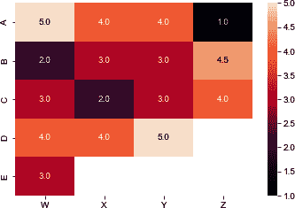
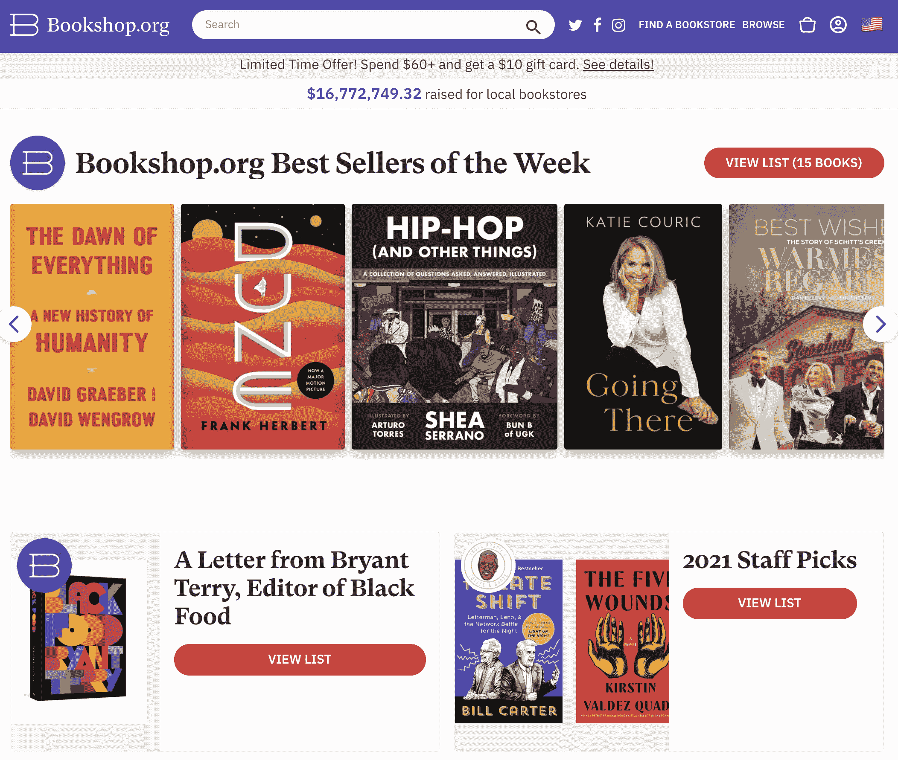
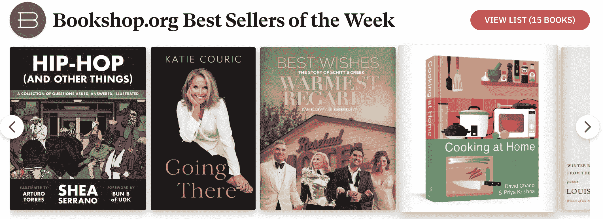
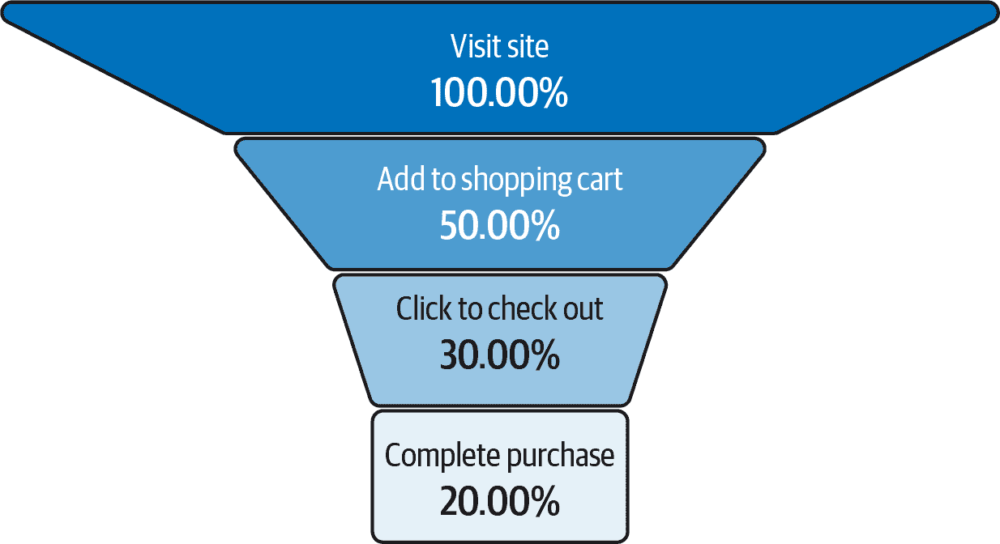

# 第二章：用户-物品评分及问题的构建

如果你被要求为当地咖啡馆的奶酪拼盘进行策划，你可能会从你的最爱开始。你也可能会花一点时间询问你朋友的最爱。在为咖啡馆订购大量这些奶酪之前，你可能会想进行一次小实验 —— 也许请一群朋友品尝你的选择，并告诉你他们的偏好。

除了收到朋友们的反馈意见外，你还将了解到有关朋友和奶酪的信息。你将会了解到朋友们喜欢哪种类型的奶酪，哪些朋友口味相似。你还可以了解到哪些奶酪最受欢迎，以及哪些奶酪被同一些人喜欢。

这些数据将开始为你的第一个奶酪推荐系统提供线索。在本章中，我们将讨论如何将这个想法转化为推荐系统的正确组成部分。通过这个例子，我们将讨论推荐系统的一个基本概念：如何预测用户对他们从未见过的东西的喜好。

# 用户-物品矩阵

非常常见的是听到从事推荐系统工作的人谈论矩阵，特别是用户-物品矩阵。虽然线性代数在数学上很深奥，但它在推荐系统中的应用很简单直观。

在我们讨论矩阵形式之前，让我们先列出一些用户集合和物品集合之间的二元关系。为了举例，想象一组五个朋友（神秘地被命名为*A*, *B*, *C*, *D*, *E*）和一个盲目品尝奶酪的场景，包括四种奶酪（*gouda*, *chèvre*, *emmentaler*, *brie*）。朋友们被要求对这些奶酪评分，从 1 到 4：

1.  *A*开始说：“好吧，我真的很喜欢*gouda*，所以给它 5 分；*chèvre*和*emmentaler*也很好吃，给 4 分；而*brie*太难吃了，只给 1 分。”

1.  *B*回答说：“什么？！*brie*是我的最爱！4.5！*chèvre*和*emmentaler*很好，3；而*gouda*只是还行，2。”

1.  *C*分别给出 3、2、3 和 4 的评分。

1.  *D*给出 4、4、5 的评分，但我们在*D*试之前已经没*brie*了。

1.  *E*开始感觉不舒服，并只尝试了*gouda*，给了它 3 分。

你可能首先注意到这种解说性写作有点乏味并且难以解析。让我们在一个方便的表格中总结这些结果（表 2-1）：

表 2-1\. 奶酪及评分

| 奶酪品鉴师 | Gouda | Chèvre | Emmentaler | Brie |
| --- | --- | --- | --- | --- |
| A | 5 | 4 | 4 | 1 |
| B | 2 | 3 | 3 | 4.5 |
| C | 3 | 2 | 3 | 4 |
| D | 4 | 4 | 5 | - |
| E | 3 | - | - | - |

你的第一个直觉可能是将这些内容写成更适合计算机的形式。你可以创建一系列的列表：

<math alttext="StartLayout 1st Row 1st Column upper A 2nd Column colon 3rd Column left-bracket 5 comma 4 comma 4 comma 1 right-bracket 2nd Row 1st Column upper B 2nd Column colon 3rd Column left-bracket 2 comma 3 comma 3 comma 4.5 right-bracket 3rd Row 1st Column upper C 2nd Column colon 3rd Column left-bracket 3 comma 2 comma 3 comma 4 right-bracket 4th Row 1st Column upper D 2nd Column colon 3rd Column left-bracket 4 comma 4 comma 5 comma minus right-bracket 5th Row 1st Column upper E 2nd Column colon 3rd Column left-bracket 3 comma minus comma minus comma minus right-bracket EndLayout" display="block"><mtable displaystyle="true"><mtr><mtd columnalign="right"><mi>A</mi></mtd> <mtd><mo>:</mo></mtd> <mtd columnalign="left"><mrow><mo>[</mo> <mn>5</mn> <mo>,</mo> <mn>4</mn> <mo>,</mo> <mn>4</mn> <mo>,</mo> <mn>1</mn> <mo>]</mo></mrow></mtd></mtr> <mtr><mtd columnalign="right"><mi>B</mi></mtd> <mtd><mo>:</mo></mtd> <mtd columnalign="left"><mrow><mo>[</mo> <mn>2</mn> <mo>,</mo> <mn>3</mn> <mo>,</mo> <mn>3</mn> <mo>,</mo> <mn>4</mn> <mo>.</mo> <mn>5</mn> <mo>]</mo></mrow></mtd></mtr> <mtr><mtd columnalign="right"><mi>C</mi></mtd> <mtd><mo>:</mo></mtd> <mtd columnalign="left"><mrow><mo>[</mo> <mn>3</mn> <mo>,</mo> <mn>2</mn> <mo>,</mo> <mn>3</mn> <mo>,</mo> <mn>4</mn> <mo>]</mo></mrow></mtd></mtr> <mtr><mtd columnalign="right"><mi>D</mi></mtd> <mtd><mo>:</mo></mtd> <mtd columnalign="left"><mrow><mo>[</mo> <mn>4</mn> <mo>,</mo> <mn>4</mn> <mo>,</mo> <mn>5</mn> <mo>,</mo> <mo>-</mo> <mo>]</mo></mrow></mtd></mtr> <mtr><mtd columnalign="right"><mi>E</mi></mtd> <mtd><mo>:</mo></mtd> <mtd columnalign="left"><mrow><mo>[</mo> <mn>3</mn> <mo>,</mo> <mo>-</mo> <mo>,</mo> <mo>-</mo> <mo>,</mo> <mo>-</mo> <mo>]</mo></mrow></mtd></mtr></mtable></math>

在某些情况下这可能有效，但你可能希望更清楚地表明每个列表中的位置意义。你可以简单地使用热图来可视化这些数据（图 2-1）：

```py
import seaborn as sns

_ = np.nan
scores = np.array([[5,4,4,1],
    [2,3,3,4.5],
    [3,2,3,4],
    [4,4,5,_],
    [3,_,_,_]])
sns.heatmap(
    scores,
    annot=True,
    fmt=".1f",
    xticklabels=['Gouda', 'Chevre', 'Emmentaler', 'Brie',],
    yticklabels=['A','B','C','D','E',]
)
```



###### 图 2-1\. 奶酪评分矩阵

当我们观察到拥有大量用户或物品，并且稀疏度越来越高的数据集时，我们需要使用更适合表示必要数据的数据结构。存在各种所谓的*稠密表示*，但现在我们将使用最简单的形式：`user_id`、`item_id`和`rating`的元组。在实践中，这种结构通常是一个由 ID 提供索引的字典。

# 稠密和稀疏表示

这些数据的两种类型结构是稠密和稀疏表示。宽泛地说，*稀疏表示*是这样一种表示，即每个非平凡观察都存在一个数据。*稠密表示*总是包含每个可能性的数据，即使是在平凡（`null`或零）情况下也是如此。

让我们看看这些数据作为字典的样子：

```py
'indices': [
  (0,0),(0,1),(0,2),(0,3),
  (1,0),(1,1),(1,2),(1,3),
  (2,0),(2,1),(2,2),(2,3),
  (3,0),(3,1),(3,2),
  (4,0)
]
'values': [
  5,4,4,1,
  2,3,3,4.5,
  3,2,3,4,
  4,4,5,
  3
]
```

出现了几个自然的问题：

1.  从迄今的观察来看，最受欢迎的奶酪是什么？看起来*emmentaler*可能是最喜欢的，但*E*没有尝试过*emmentaler*。

1.  *D*会喜欢*brie*吗？看起来这是一种有争议的奶酪。

1.  如果你只被要求买两种奶酪，你应该买哪两种来最好地满足所有人的需求？

这个例子及其相关问题故意简单，但其要点是很明确的，即这种矩阵表示至少对捕捉这些评分是方便的。

也许并不明显的是，除了这种数据可视化的便利性之外，这种表示法在数学上的实用性也是存在的。问题 2 暗示了一个固有的推荐系统问题：“预测用户未看到的物品会喜欢多少。”这个问题也可以被认出是线性代数课程中的问题：“如何从我们知道的元素中填充矩阵的未知元素？”这被称为*矩阵完成*。

在创造捕捉用户需求的用户体验和数学建模数据及需求之间的反复过程中，推荐系统的核心问题浮出水面。

# 用户-用户与物品-物品协同过滤

在我们深入线性代数之前，让我们考虑一下纯数据科学的视角，称为*协同过滤*（*CF*），这个术语最初是由 David Goldberg 等人在他们 1992 年的论文[“Using Collaborative Filtering to Weave an Information Tapestry”](https://oreil.ly/Nd3oe)中使用的。

CF 的基本思想是，具有相似品味的人可以帮助其他人了解他们喜欢的东西，而无需自己去尝试。*协同*术语最初是指类似品味的用户之间的协同，*过滤*最初是指过滤掉人们不喜欢的选择。

你可以用两种方式来思考这种协同过滤策略：

+   两个具有相似品味的用户将继续拥有相似的品味。

+   两个具有相似用户粉丝的物品将继续受到其他类似粉丝的用户的欢迎。

这些听起来可能相同，但在数学解释上它们看起来不同。在高层次上，区别在于你的推荐系统应该优先考虑哪种相似性：用户相似性还是物品相似性。

如果你优先考虑 *用户相似性*，那么为了为用户 *A* 提供推荐，你会找到一个类似的用户 *B*，然后从 *B* 喜欢的内容列表中选择一个 *A* 还没看过的推荐。

如果你优先考虑 *物品相似性*，那么为了为用户 *A* 提供推荐，你会找到一个 *A* 喜欢的物品 *奶酪*，然后找到一个与 *奶酪* 相似的 *A* 还没看过的物品 *埃门塔勒*，并向 *A* 推荐它。

稍后我们将深入探讨相似性，但让我们快速将这些想法与前面的讨论联系起来。*相似的用户* 是用户-物品矩阵中作为向量相似的行；*相似的物品* 是作为向量相似的用户-物品矩阵中的列。

# 向量相似性

*点积相似性* 在 第十章 中有更精确的定义。暂时来说，相似性是通过将向量归一化然后计算它们的余弦相似度来计算的。给定任何类型的实体，你已经将它们关联到向量（数字列表）中，*向量相似性* 比较的是哪些实体在特征上最相似，这些特征由这些数字列表（称为 *潜在空间*）捕获。

# Netflix 挑战

2006 年，Netflix 启动了一个名为 Netflix 奖 的在线竞赛。这个竞赛挑战团队在由公司发布的开放数据集上改进 Netflix 的 CF 算法的性能。虽然像 Kaggle 或者会议网站上的这类竞赛如今已经很普遍，但在当时对于对推荐系统感兴趣的人来说，这是非常令人兴奋和新颖的。

这个竞赛包括多个中间回合，颁发进步奖以及 2009 年颁发的最终 Netflix 奖。提供的数据集包括 2,817,131 个三元组，包括 (`用户，电影，评分日期`)。其中一半还包括评分本身。请注意，就像我们前面的例子一样，用户-物品信息几乎足以指定问题。在这个特定的数据集中，日期是已提供的信息。稍后，我们将探讨时间可能是如何成为因素的，特别是对于顺序推荐系统。

这个竞赛的赌注非常高。击败内部性能的要求是将均方根误差（RMSE）提高 10%；稍后我们将讨论这个损失函数。奖金总额超过了 110 万美元。最终的获胜者是 BellKor's Pragmatic Chaos（其实也赢得了之前两个进步奖）的测试 RMSE 为 0.8567。最终，仅仅是 20 分钟的提前提交时间使 BellKor 领先于竞争对手 The Ensemble。

要详细了解获胜作品，请查看[“Netflix 大奖的 BigChaos 解决方案”](https://oreil.ly/joaqu)由 Andreas Töscher 和 Michael Jahrer 以及相同作者的[“Netflix Prize 2008 的 BigChaos 解决方案”](https://oreil.ly/D51iM)。与此同时，让我们回顾一下这场比赛中的几个重要教训：

首先，我们看到我们讨论过的用户-项目矩阵在这些解决方案中出现为关键的数学数据结构。模型选择和训练很重要，但参数调整在几种算法中提供了巨大的改进。我们将在后续章节中回到参数调整。作者指出，几种模型创新来自于反思业务用例和人类行为，并尝试在模型架构中捕捉这些模式。接下来，线性代数方法导致了第一个相对性能良好的解决方案，并在此基础上构建了获胜模型。最后，为了获得 Netflix 最初要求赢得比赛的性能，花费了很长时间，而业务环境却发生了变化，[解决方案不再有用](https://oreil.ly/fz6rz)。

最后一点可能是机器学习开发者需要了解的*最*重要的关于推荐系统的事情；请看以下提示。

# 从简单开始

快速构建一个可用的工作模型，并在模型仍然符合业务需求时进行迭代。

# 软评分

在我们品尝奶酪的例子中，每种奶酪都会收到一个数字评分或者客人未尝试过。这些是*硬评分*：无论奶酪是布里还是露琪，评分都是明确的，其缺失表明用户与项目之间缺乏互动。在某些情况下，我们需要处理表明用户确实与项目进行了互动但未提供评分的数据。

一个常见的例子是电影应用程序；用户可能使用应用程序观看了电影，但未提供星级评分。这表明项目（在这种情况下是电影）已被观察到，但我们的算法没有学习的评分。然而，我们仍然可以使用这些隐含数据来执行以下操作：

+   从未来的推荐中排除这个项目

+   将这些数据作为我们学习者中的一个单独项使用

+   分配一个默认的评分值，以指示“有趣但不足以评级”

结果表明，隐含评分对训练有效的推荐系统至关重要，不仅因为用户经常不提供硬评分，而且因为隐含评分提供了不同水平的信号。稍后，当我们希望训练多级模型以预测点击和购买可能性时，这两个级别将非常重要。

总结一下：

+   当用户直接对项目的反馈提出请求时，会产生硬评分。

+   当用户的行为在未直接回应提示的情况下隐含地传达对项目的反馈时，会产生软评分。

# 数据收集和用户记录

我们已经确定，我们既从显式评级学习，也从隐式评级学习，那么我们如何以及从哪里获取这些数据？为了深入探讨这一点，我们需要开始关注应用程序代码。在许多企业中，数据科学家和机器学习工程师与软件工程师是分开的，但是处理推荐系统需要两个功能之间的协调。

## 记录什么内容

最简单和最明显的数据收集是用户评级。如果用户可以选择提供评级，甚至是赞成或反对的选项，那么就需要构建该组件并存储这些数据。这些评级不仅需要存储，以便建立推荐，还要防止用户评级某物品后不久再次访问页面时评级消失，从而导致不好的用户体验。

同样地，了解几个其他关键互动也可以改进和扩展您的推荐系统：页面加载、页面浏览、点击和加入购物袋。

对于这些类型的数据，让我们使用一个稍微复杂的例子：电子商务网站 [Bookshop.org](https://www.bookshop.org)。这个站点有多个推荐系统的应用，我们将逐步回到几乎所有这些应用。现在，让我们专注于一些互动（图 2-2）。



###### 图 2-2\. Bookshop.org 首页

### 页面加载

当您首次加载 Bookshop.org 时，页面上会显示项目。本周畅销书都是可点击的书籍列表的图片。尽管用户在加载此初始页面时没有选择，但记录这个初始页面加载的内容实际上非常重要。

这些选项代表用户看过的所有书籍的总体。如果用户看过某个选项，他们就有点击它的机会，这将最终成为一个重要的隐式信号。

# 倾向评分

考虑用户看过的所有项目的总体与倾向评分匹配密切相关。在数学上，*倾向评分*是观察单元被分配到处理组与对照组的概率。

将这种设置与简单的 50-50 A/B 测试进行比较：每个单元有 50% 的机会暴露于您的处理。在特征分层的 A/B 测试中，您有意根据某些特征或特征集（在这种情况下通常称为*协变量*）更改暴露的概率。这些暴露概率就是倾向评分。

为什么在这里提到 A/B 测试？稍后，我们将对用户偏好的软评级进行挖掘，但我们必须考虑到缺乏软评级可能并不意味着隐含的不良评级。回想起奶酪：品鉴员 *D* 没有机会评价 *brie*，因此没有理由认为 *D* 对 *brie* 有偏好或厌恶。这是因为 *D* 没有*接触到* *brie*。

现在回想起 Bookshop.org：首页没有显示《银河系漫游指南》，所以用户无法点击它并隐式表达对该书的兴趣。用户可以使用搜索选项，但这是一种不同类型的信号——我们稍后会讨论，实际上是一种更强的信号。

在理解像“用户是否看过某物”这样的隐式评级时，我们需要正确考虑他们暴露给的所有选择，并使用该人群规模的倒数来衡量点击的重要性。因此，理解所有页面加载都很重要。

### 页面浏览和悬停

网站已经变得更加复杂，现在用户必须应对各种交互。图 2-3 展示了如果用户在本周畅销书籍的轮播中点击右箭头，然后将鼠标移动到《家庭烹饪》选项上会发生什么。



###### 图 2-3\. Bookshop.org 畅销书籍

用户揭示了一个新选项，并通过将鼠标悬停在其上，使其变大并产生视觉效果。这些都是向用户传达更多信息的方法，并提醒用户这些选项是可点击的。对于推荐系统来说，这些点击可以被用作更多的隐式反馈。

首先，用户点击了轮播滚动条——因此他们在轮播中看到的部分内容足够有趣，以便进一步挖掘。其次，他们将鼠标悬停在《家庭烹饪》上，这可能会导致点击，也可能只是想看看在悬停时是否提供了额外信息。许多网站使用悬停交互来提供弹出式详细信息。尽管 Bookshop.org 没有实现类似的功能，但互联网用户已经习惯了所有实现此行为的网站，因此这个信号仍然具有意义。第三，用户现在在轮播滚动中发现了一个新的潜在项目——我们应该将其添加到我们的页面加载中，但评分较高，因为它需要交互才能揭示。

所有这些信息和更多信息都可以编码到网站的日志中。丰富和详细的日志记录是改善推荐系统的最重要方法之一。比你实际需要的更多的日志数据几乎总是比相反情况更好。

### 点击

如果您认为悬停意味着兴趣，那么等您考虑到点击时会怎样！在大多数情况下，点击是产品兴趣的强有力指标。对于电子商务来说，点击经常作为推荐团队核心关键绩效指标（KPI）的一部分计算。

这是出于两个原因：

+   点击几乎总是购买所必需的，因此对于大多数业务交易来说，它是一个上游过滤器。

+   点击需要明确的用户操作，因此它是意图的良好衡量指标。

当然，噪音总是存在的，但点击是客户兴趣的主要指标。许多生产推荐系统是基于点击数据训练的，而不是评级数据，因为点击行为和购买行为之间存在强烈的相关性，且数据量更大。

# 点击流数据

有时在推荐系统中，您会听到人们谈论*点击流*数据。这一重要的点击数据视图还考虑了用户在单个*会话*中点击的顺序。现代推荐系统致力于利用用户点击顺序，称之为*顺序推荐*，并通过这一额外的维度显示了显著的改进。我们将在第七章中讨论基于序列的推荐。

### 添加到购物袋

我们终于到了；用户已将物品添加到他们的购物袋、购物车或队列中。这是极其强烈的兴趣指示器，通常与购买行为高度相关。甚至有理由认为添加到购物袋比购买/订单/观看更好作为信号。添加到购物袋基本上是软评级的终点，通常在此之后您希望开始收集评级和评价。

### 印象

我们可能还希望记录那些未被点击的项目的*印象*。这为推荐系统提供了用户对不感兴趣项目的负反馈。例如，如果用户被提供了*gouda*、*chèvre*和*emmentaler*这些奶酪，但用户只尝试了*chèvre*，也许用户不喜欢*gouda*。另一方面，他们可能还没来得及尝试*emmentaler*，所以这些印象可能只带来噪声信号。

## 收集和仪器化

Web 应用程序通常通过事件来仪表化我们讨论过的所有交互。如果您还不知道什么是事件，可以向您工程组织的同事询问，但我们也会为您提供简略信息。与日志记录类似，*事件*是应用程序在执行某段代码时发送的特殊格式消息。

正如点击的例子中，应用程序需要调用以获取下一个要向用户显示的内容，此时通常也会“触发事件”，指示有关用户的信息，他们点击了什么，会话 ID 以供以后参考，时间以及其他各种有用的细节。此事件可以在下游以任何方式处理，但有一种越来越普遍的路径分歧模式如下：

+   一个日志数据库，如与服务绑定的 mySQL 应用程序数据库

+   一个实时处理事件流

后者将很有趣：事件流通常通过诸如 Apache Kafka 之类的技术与侦听器连接。这种基础设施可能会迅速变得复杂（请咨询您的本地数据工程师或 MLOps 人员），但发生的简单模型是所有特定类型的日志都发送到您认为可以利用这些事件的几个目的地。

在推荐系统的情况下，事件流可以连接到一系列转换以处理下游的学习任务数据。如果您希望构建一个使用这些日志的推荐系统，这将非常有用。其他重要用途包括实时度量日志，用于了解网站上的实时情况。

## 漏斗

我们刚刚通过了我们的第一个漏斗示例，任何一个好的数据科学家都无法避免考虑它们。无论喜欢与否，漏斗分析对于评估你的网站以及扩展你的推荐系统至关重要。

# 点击流

*漏斗*是用户从一个状态到另一个状态必须执行的步骤集合；之所以称为漏斗，是因为在每个离散步骤，用户可能会停止继续进行，或者*掉队*，从而在每个步骤中减少人口数量。

在我们对事件和用户日志的讨论中，每个步骤都与前面的某个子集相关。这意味着该过程是一个漏斗，如图 2-4 所示。了解每个步骤的流失率揭示了你的网站和推荐的重要特征。



###### 图 2-4\. 一个入门漏斗

可以在图 2-4 中考虑三种重要的漏斗分析：

1.  页面浏览到加入购物袋用户流

1.  页面浏览到每个推荐的加入购物袋

1.  从加入购物袋到完成购买

第一个漏斗只是在高层次上识别用户在流程中每个步骤中的占比。这是你的网站优化的高级衡量标准，产品提供的一般吸引力，以及用户引导的质量。

第二个更为精细的漏斗考虑了推荐系统本身。正如在倾向性评分方面之前提到的那样，用户只有在看到某个物品时才能进入特定物品的推荐漏斗。这个概念与漏斗的使用相交汇，因为你希望从高层次理解某些推荐与漏斗流失的关系，但是同时，在使用推荐系统时，你对推荐的信心应该与漏斗指标很好地相关。我们将在第三部分详细讨论这个问题，但现在你应该记住考虑不同类别的推荐用户对和他们的漏斗可能与平均水平有何不同。

最后，我们可以考虑从加入购物车到完成购买。这实际上不是推荐系统问题的一部分，但作为试图改进产品的数据科学家或机器学习工程师，你应该时刻关注这一点。*无论你的推荐有多好，这一漏斗可能会摧毁你的所有努力。*在解决推荐问题之前，你几乎总是应该调查漏斗在从加入购物车到完成购买过程中的表现。如果流程中有任何复杂或困难之处，修复这些问题几乎肯定比改进推荐系统更有价值。调查流失情况，进行用户研究以理解可能的混淆因素，并与产品和工程团队合作，确保每个人在开始构建电子商务推荐系统之前都对这一流程有共识。

# 业务见解和用户喜好

在之前来自 Bookshop.org 的例子中，本周热销排行榜是页面上的主要轮播内容。回顾我们之前的`get_most_popular_recs`工作；轮播的动力仅仅是推荐系统应用于特定收藏者的结果——一个只看最近一周的收藏者。

这个轮播示例展示了推荐系统在提供业务见解的同时，也推动了推荐功能。增长团队的常见任务是理解每周的趋势和关键绩效指标，通常是每周活跃用户和新注册用户这样的指标。对于许多数字化公司来说，增长团队还对理解用户参与的主要驱动因素感兴趣。

让我们举个例子：截至目前，Netflix 的节目《鱿鱼游戏》成为了该公司有史以来最受欢迎的系列，刷新了大量记录。《鱿鱼游戏》在第一个月就吸引了 1.11 亿观众。显而易见，《鱿鱼游戏》需要在本周热门节目或最热门标题的轮播中亮相，但是像这样的爆款还应该在哪些地方受到重视呢？

公司几乎总是会首先寻求的第一个重要洞见是*归因*：如果数字在一周内上升，是什么导致了这一点？推动额外增长的重要或特别因素是什么？我们如何从这些信号中学习以在未来做得更好？在*Squid Game*这样的外语节目引起英语观众的巨大兴趣的情况下，高管可能会倾向于增加对来自韩国的节目或具有高戏剧性的字幕节目的投资。另一面同样重要：当增长指标滞后时，高管几乎总是会问为什么。能够指出什么是最受欢迎的，以及它可能如何偏离预期，会有很大帮助。

另一个重要的洞见可以反馈到推荐中；在像*Squid Game*这样令人兴奋的首播期间，当你看到所有指标都在上升时很容易被兴奋所影响，但这是否会对指标产生负面影响呢？如果你的节目和*Squid Game*在同一周或两周内首播，你可能对这一成功不那么热衷。总体而言，这种成功通常会带动*增量*增长，这对业务非常有利，整体而言，指标可能会全部看起来向好的方向发展。然而，其他项目可能由于核心用户群体之间的零和游戏而推出不成功。这可能会对长期指标产生负面影响，甚至可能使后续的推荐效果不佳。

后来，你将会了解到推荐的多样性；关于为何关心推荐多样化有很多理由，但我们在这里观察其中一个：多样化可以增加匹配用户与物品的整体能力。当你保持广泛的用户基础高度参与时，你增加了未来增长的机会。

最后，在突显热门命中之外，了解平台或服务上真正热门的另一个好处是广告。当一个现象开始时，通过引导和推广成功可以带来巨大优势。有时这会导致网络效应，在这些天病毒式内容和简易传播，这可以对平台的增长产生多重影响。

# 总结

这构成了制定推荐问题和为解决问题做好准备的最基本方面。

用户-物品矩阵为我们提供了一个工具，以数字评分的最简单情况总结用户和物品之间的关系，并且将在后续更复杂的模型中进行泛化。我们看到了第一个向量相似性的概念，它将扩展到深层次的相关性概念。接下来，我们了解了用户通过显式和隐式行动提供的信号类型。最后，我们学会了如何捕捉这些行动来训练模型。

现在我们完成了问题框架，接下来为您进行一些数学复习。别担心，您可以将尺子和圆规收起来，无需证明任何事情或计算任何积分。然而，您会看到一些重要的数学概念，这些概念将帮助您清晰地思考推荐系统的期望，并确保您提出正确的问题。
