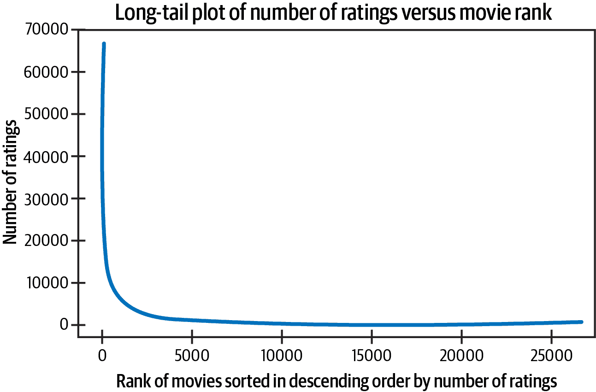
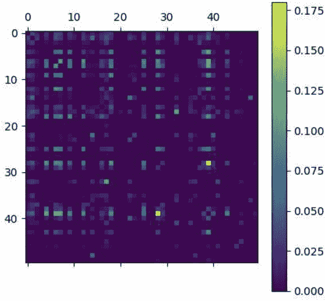
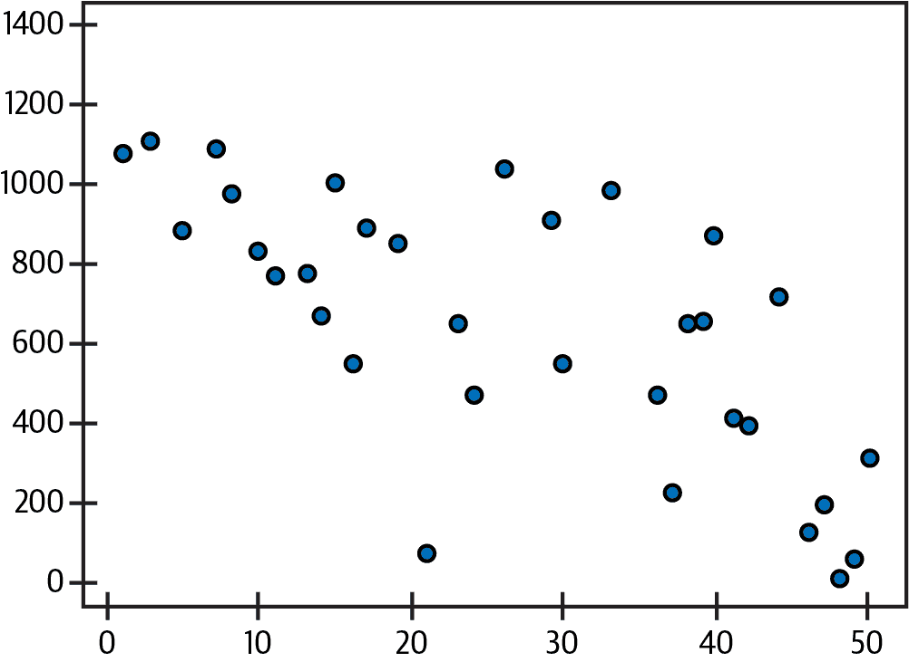

# 第三章\. 数学考虑

本书大部分内容侧重于实施和让推荐系统正常运行所需的实际考虑。在本章中，你将找到本书最抽象和理论性的概念。本章的目的是涵盖支撑该领域的一些基本思想。理解这些思想很重要，因为它们导致推荐系统中的病态行为，并激励许多架构决策。

我们将从讨论你经常在推荐系统中看到的数据形状开始，以及为什么这种形状可能需要仔细思考。接下来，我们将谈论推动大多数现代推荐系统的基本数学思想——相似性。我们将简要涵盖一种不同的思考推荐者作用的方式，适合那些更倾向于统计的人。最后，我们将使用与自然语言处理类比的方法来制定流行的方法。

# 推荐系统中的 Zipf 定律和马太效应

在许多机器学习应用中，早期就提到了一个警告：大语料库中唯一项的观察分布由*Zipf 定律*建模，即出现频率呈指数级下降。在推荐系统中，*马太效应*体现在热门项目的点击率或热门用户的反馈率上。例如，热门项目的点击量远远大于平均水平，而更积极参与的用户比平均水平给出更多评分。

# 马太效应

马太效应或*流行偏见*表明，最受欢迎的项目将继续吸引最多的注意力，并扩大与其他项目之间的差距。

以[MovieLens 数据集](https://oreil.ly/xiUaq)为例，这是一个用于基准推荐系统的极为流行的数据集。[Jenny Sheng](https://oreil.ly/Uzm2G)观察到图 3-1 中展示的电影评分行为：



###### 图 3-1\. 电影排名评分的 Zipf 分布

乍一看，评分的急剧下降显而易见，但这是否是问题呢？让我们假设我们的推荐系统将建立为基于用户的协同过滤（CF）模型——正如在第二章中所暗示的。那么这些分布会如何影响推荐系统呢？

我们将考虑这一现象的分布影响。让概率质量函数由简单的 Zipf 定律描述：

<math alttext="f left-parenthesis k comma upper M right-parenthesis equals StartFraction 1 slash k Over sigma-summation Underscript n equals 1 Overscript upper M Endscripts left-parenthesis 1 slash n right-parenthesis EndFraction" display="block"><mrow><mi>f</mi> <mrow><mo>(</mo> <mi>k</mi> <mo>,</mo> <mi>M</mi> <mo>)</mo></mrow> <mo>=</mo> <mfrac><mrow><mn>1</mn><mo>/</mo><mi>k</mi></mrow> <mrow><msubsup><mo>∑</mo> <mrow><mi>n</mi><mo>=</mo><mn>1</mn></mrow> <mi>M</mi></msubsup> <mrow><mo>(</mo><mn>1</mn><mo>/</mo><mi>n</mi><mo>)</mo></mrow></mrow></mfrac></mrow></math>

对于语料库中的<math alttext="upper M"><mi>M</mi></math>个标记（在我们的例子中是电影的数量），<math alttext="k"><mi>k</mi></math>是按出现次数排序的标记的排名。

让我们考虑用户<math alttext="upper A"><mi>A</mi></math>和<math alttext="upper B"><mi>B</mi></math>，分别具有<math alttext="upper N Subscript upper A Baseline equals StartAbsoluteValue script upper I Subscript upper A Baseline EndAbsoluteValue"><mrow><msub><mi>N</mi> <mi>A</mi></msub> <mo>=</mo> <mrow><mo>|</mo> <msub><mi>ℐ</mi> <mi>A</mi></msub> <mo>|</mo></mrow></mrow></math>和<math alttext="upper N Subscript upper B Baseline equals StartAbsoluteValue script upper I Subscript upper B Baseline EndAbsoluteValue"><mrow><msub><mi>N</mi> <mi>B</mi></msub> <mo>=</mo> <mrow><mo>|</mo> <msub><mi>ℐ</mi> <mi>B</mi></msub> <mo>|</mo></mrow></mrow></math>的评级。注意，<math alttext="upper V Subscript i"><msub><mi>V</mi> <mi>i</mi></msub></math>，即第<math alttext="i"><mi>i</mi></math>个最流行的视频，在用户<math alttext="upper X"><mi>X</mi></math>的<math alttext="script upper I Subscript upper X"><msub><mi>ℐ</mi> <mi>X</mi></msub></math>中出现的概率由以下公式给出：

<math alttext="upper P left-parenthesis i right-parenthesis equals StartFraction f left-parenthesis i comma upper M right-parenthesis Over sigma-summation Underscript j equals 1 Overscript upper M Endscripts f left-parenthesis j comma upper M right-parenthesis EndFraction equals StartFraction 1 slash i Over sigma-summation Underscript j equals 1 Overscript upper M Endscripts 1 slash j EndFraction" display="block"><mrow><mi>P</mi> <mrow><mo>(</mo> <mi>i</mi> <mo>)</mo></mrow> <mo>=</mo> <mfrac><mrow><mi>f</mi><mo>(</mo><mi>i</mi><mo>,</mo><mi>M</mi><mo>)</mo></mrow> <mrow><msubsup><mo>∑</mo> <mrow><mi>j</mi><mo>=</mo><mn>1</mn></mrow> <mi>M</mi></msubsup> <mi>f</mi><mrow><mo>(</mo><mi>j</mi><mo>,</mo><mi>M</mi><mo>)</mo></mrow></mrow></mfrac> <mo>=</mo> <mfrac><mrow><mn>1</mn><mo>/</mo><mi>i</mi></mrow> <mrow><msubsup><mo>∑</mo> <mrow><mi>j</mi><mo>=</mo><mn>1</mn></mrow> <mi>M</mi></msubsup> <mn>1</mn><mo>/</mo><mi>j</mi></mrow></mfrac></mrow></math>

因此，一个项目出现在两个用户评级中的联合概率如下所示：

<math alttext="upper P left-parenthesis i squared right-parenthesis equals left-parenthesis StartFraction 1 slash i Over sigma-summation Underscript j equals 1 Overscript upper M Endscripts 1 slash j EndFraction right-parenthesis squared" display="block"><mrow><mi>P</mi> <mrow><mo>(</mo> <msup><mi>i</mi> <mn>2</mn></msup> <mo>)</mo></mrow> <mo>=</mo> <msup><mfenced close=")" open="(" separators=""><mfrac><mrow><mn>1</mn><mo>/</mo><mi>i</mi></mrow> <mrow><msubsup><mo>∑</mo> <mrow><mi>j</mi><mo>=</mo><mn>1</mn></mrow> <mi>M</mi></msubsup> <mn>1</mn><mo>/</mo><mi>j</mi></mrow></mfrac></mfenced> <mn>2</mn></msup></mrow></math>

换句话说，两个用户共享其评级集中项目的概率随其受欢迎排名的平方而减小。

当我们考虑到我们尚未明确的基于用户的 CF 定义基于用户评级集中的相似性时，这变得很重要。这种相似性是*两个用户共同评级项目的数量除以任一用户评级的总项目数*。

以此定义，例如，我们可以计算在用户<math alttext="upper A"><mi>A</mi></math>和<math alttext="upper B"><mi>B</mi></math>之间共享项目的相似性分数：

<math alttext="sigma-summation Underscript i equals 1 Overscript upper M Endscripts StartFraction upper P left-parenthesis i squared right-parenthesis Over double-vertical-bar script upper I Subscript upper A Baseline union script upper I Subscript upper B Baseline double-vertical-bar EndFraction" display="block"><mrow><munderover><mo>∑</mo> <mrow><mi>i</mi><mo>=</mo><mn>1</mn></mrow> <mi>M</mi></munderover> <mfrac><mrow><mi>P</mi><mo>(</mo><msup><mi>i</mi> <mn>2</mn></msup> <mo>)</mo></mrow> <mrow><mrow><mo>∥</mo></mrow><msub><mi>ℐ</mi> <mi>A</mi></msub> <mo>∪</mo><msub><mi>ℐ</mi> <mi>B</mi></msub> <mrow><mo>∥</mo></mrow></mrow></mfrac></mrow></math>

然后，两个用户的平均相似性分数通过前述方程的重复应用被概括如下：

<math alttext="sigma-summation Underscript t equals 1 Overscript min left-parenthesis upper N Subscript upper A Baseline comma upper N Subscript upper B Baseline right-parenthesis Endscripts left-parenthesis product Underscript i Subscript k Baseline equals i Subscript k minus 1 Baseline plus 1 Overscript t minus 1 Endscripts sigma-summation Underscript i equals 1 Overscript upper M Endscripts left-parenthesis StartStartFraction upper P left-parenthesis i Subscript k Baseline Superscript 2 Baseline right-parenthesis OverOver StartFraction double-vertical-bar script upper I Subscript upper A Baseline union script upper I Subscript upper B Baseline double-vertical-bar Over t EndFraction EndEndFraction right-parenthesis right-parenthesis" display="block"><mrow><munderover><mo>∑</mo> <mrow><mi>t</mi><mo>=</mo><mn>1</mn></mrow> <mrow><mo form="prefix" movablelimits="true">min</mo><mo>(</mo><msub><mi>N</mi> <mi>A</mi></msub> <mo>,</mo><msub><mi>N</mi> <mi>B</mi></msub> <mo>)</mo></mrow></munderover> <mfenced close=")" open="(" separators=""><munderover><mo>∏</mo> <mrow><msub><mi>i</mi> <mi>k</mi></msub> <mo>=</mo><msub><mi>i</mi> <mrow><mi>k</mi><mo>-</mo><mn>1</mn></mrow></msub> <mo>+</mo><mn>1</mn></mrow> <mrow><mi>t</mi><mo>-</mo><mn>1</mn></mrow></munderover> <munderover><mo>∑</mo> <mrow><mi>i</mi><mo>=</mo><mn>1</mn></mrow> <mi>M</mi></munderover> <mfenced close=")" open="(" separators=""><mfrac><mrow><mi>P</mi><mo>(</mo><msup><mrow><msub><mi>i</mi> <mi>k</mi></msub></mrow> <mn>2</mn></msup> <mo>)</mo></mrow> <mfrac><mrow><mrow><mo>∥</mo></mrow><msub><mi>ℐ</mi> <mi>A</mi></msub> <mo>∪</mo><msub><mi>ℐ</mi> <mi>B</mi></msub> <mrow><mo>∥</mo></mrow></mrow> <mi>t</mi></mfrac></mfrac></mfenced></mfenced></mrow></math>

通过前述观察的重复应用。

这些组合公式不仅指示了我们算法中 Zipfian 的相关性，而且我们还看到这对得分输出的几乎直接影响。考虑 Hao Wang 等人在《量化分析马太效应和推荐系统稀疏问题》中的实验，针对[Last.fm 数据集](https://oreil.ly/NqJOw)中用户的平均相似性分数，作者发现这种马太效应在相似性矩阵中持续存在（参见图 3-2）。



###### 图 3-2。Last.fm 数据集上的马太效应

观察“热门”单元格与其他单元格之间的根本差异。明亮的单元格在大多数暗色单元格中为数不多，表明某些极其热门的项目在更普通频率接近零的项目中难以组合。虽然这些结果可能看起来令人担忧，但后来我们将考虑能够减轻马修效应的多样性感知损失函数。一个更简单的方法是使用下游采样方法，我们将作为探索利用算法的一部分进行讨论。最后，马修效应只是这种 Zipf 分布的两大主要影响之一，让我们把注意力转向第二个方面。

# 稀疏性

现在我们必须认识到稀疏性的存在。随着评分越来越偏向最受欢迎的项目，较不受欢迎的项目将因数据和推荐的匮乏而受到影响，这被称为*数据稀疏性*。这与线性代数中的定义相联系：向量中大多数为零或未被填充的元素。当您再次考虑我们的用户-物品矩阵时，不受欢迎的项目构成了具有少量条目的列；这些是稀疏向量。同样，在规模上，我们看到马修效应将更多的总评分推向某些列，并且矩阵在传统数学意义上变得稀疏。因此，稀疏性是推荐系统面临的一个极其知名的挑战。

正如之前所述，让我们从这些稀疏评分对我们的协同过滤算法的影响考虑一下。再次观察到，对于用户<math alttext="upper X"><mi>X</mi></math>，<math alttext="i"><mi>i</mi></math> th 最受欢迎的项目出现在<math alttext="script upper I Subscript upper X"><msub><mi>ℐ</mi> <mi>X</mi></msub></math>的概率由以下给出：

<math alttext="upper P left-parenthesis i right-parenthesis equals StartFraction f left-parenthesis i comma upper M right-parenthesis Over sigma-summation Underscript j equals 1 Overscript upper M Endscripts f left-parenthesis j comma upper M right-parenthesis EndFraction equals StartFraction 1 slash i Over sigma-summation Underscript j equals 1 Overscript upper M Endscripts 1 slash j EndFraction" display="block"><mrow><mi>P</mi> <mrow><mo>(</mo> <mi>i</mi> <mo>)</mo></mrow> <mo>=</mo> <mfrac><mrow><mi>f</mi><mo>(</mo><mi>i</mi><mo>,</mo><mi>M</mi><mo>)</mo></mrow> <mrow><msubsup><mo>∑</mo> <mrow><mi>j</mi><mo>=</mo><mn>1</mn></mrow> <mi>M</mi></msubsup> <mi>f</mi><mrow><mo>(</mo><mi>j</mi><mo>,</mo><mi>M</mi><mo>)</mo></mrow></mrow></mfrac> <mo>=</mo> <mfrac><mrow><mn>1</mn><mo>/</mo><mi>i</mi></mrow> <mrow><msubsup><mo>∑</mo> <mrow><mi>j</mi><mo>=</mo><mn>1</mn></mrow> <mi>M</mi></msubsup> <mn>1</mn><mo>/</mo><mi>j</mi></mrow></mfrac></mrow></math>

然后

<math alttext="left-parenthesis upper M minus 1 right-parenthesis asterisk upper P left-parenthesis i right-parenthesis" display="block"><mrow><mo>(</mo> <mi>M</mi> <mo>-</mo> <mn>1</mn> <mo>)</mo> <mo>*</mo> <mi>P</mi> <mo>(</mo> <mi>i</mi> <mo>)</mo></mrow></math>

是预期的点击<math alttext="i"><mi>i</mi></math> th 最受欢迎项目的其他用户数量，因此总结所有<math alttext="i"><mi>i</mi></math>，得到与<math alttext="upper X"><mi>X</mi></math>共享评分的其他用户总数：

<math alttext="sigma-summation Underscript i equals 1 Overscript upper M Endscripts left-parenthesis upper M minus 1 right-parenthesis asterisk upper P left-parenthesis i right-parenthesis" display="block"><mrow><munderover><mo>∑</mo> <mrow><mi>i</mi><mo>=</mo><mn>1</mn></mrow> <mi>M</mi></munderover> <mrow><mo>(</mo> <mi>M</mi> <mo>-</mo> <mn>1</mn> <mo>)</mo></mrow> <mo>*</mo> <mi>P</mi> <mrow><mo>(</mo> <mi>i</mi> <mo>)</mo></mrow></mrow></math>

再次，当我们回到整体趋势时，我们观察到这种稀疏性潜入到我们的协同过滤算法的实际计算中，考虑不同排名的用户的趋势，并看到他们的排名在其他用户的排名中*协作*（图 3-3）。



###### 图 3-3\. Last.fm 数据集的用户相似性计数

我们看到这是一个始终要注意的重要结果：稀疏性将重点放在最受欢迎的用户身上，并有可能使您的推荐系统变得近视。

# 基于物品的协同过滤

虽然方程式不同，但在本节中，它们同样适用于基于物品的协同过滤。物品之间的相似性表现出与它们的分数中的 Zipf 分布的相同继承，并且在 CF 过程中咨询的物品按排名下降。

# 协同过滤的用户相似性

在数学中，经常听到讨论*距离*。甚至回溯到毕达哥拉斯定理，我们被教导将点之间的关系看作是距离或不相似性。事实上，这一基本思想被数学确立为度量的一部分：

<math alttext="d left-parenthesis a comma c right-parenthesis less-than-or-equal-to d left-parenthesis a comma b right-parenthesis plus d left-parenthesis b comma c right-parenthesis" display="block"><mrow><mi>d</mi> <mo>(</mo> <mi>a</mi> <mo>,</mo> <mi>c</mi> <mo>)</mo> <mo>≤</mo> <mi>d</mi> <mo>(</mo> <mi>a</mi> <mo>,</mo> <mi>b</mi> <mo>)</mo> <mo>+</mo> <mi>d</mi> <mo>(</mo> <mi>b</mi> <mo>,</mo> <mi>c</mi> <mo>)</mo></mrow></math>

在机器学习中，我们通常更关注相似性的概念——这是一个极为相关的主题。在许多情况下，我们可以计算相似性或不相似性，因为它们是互补的；当 <math alttext="d colon upper X times upper X right-arrow left-bracket 0 comma 1 right-bracket subset-of double-struck upper R"><mrow><mi>d</mi> <mo>:</mo> <mi>X</mi> <mo>×</mo> <mi>X</mi> <mo>→</mo> <mo>[</mo> <mn>0</mn> <mo>,</mo> <mn>1</mn> <mo>]</mo> <mo>⊂</mo> <mi>ℝ</mi></mrow></math> 是一个*dissimilarity function*，那么我们通常定义如下：

<math alttext="upper S i m left-parenthesis a comma b right-parenthesis colon equals 1 minus d left-parenthesis a comma b right-parenthesis" display="block"><mrow><mi>S</mi> <mi>i</mi> <mi>m</mi> <mo>(</mo> <mi>a</mi> <mo>,</mo> <mi>b</mi> <mo>)</mo> <mo>:</mo> <mo>=</mo> <mn>1</mn> <mo>-</mo> <mi>d</mi> <mo>(</mo> <mi>a</mi> <mo>,</mo> <mi>b</mi> <mo>)</mo></mrow></math>

这可能看起来像是一个过分精确的陈述，但实际上你会看到，有多种选择可以用来构建相似性的框架。此外，有时我们甚至制定相似性度量，其中关联的距离度量并不在对象集合上建立度量。这些所谓的伪空间仍然可能非常重要，我们将展示它们在第十章中的应用场景。

在文献中，你会发现论文通常以介绍新的相似性度量开始，然后在该新度量上训练一个你之前见过的模型。正如你将看到的，你选择如何关联对象（用户、物品、特征等）可以对你的算法学到什么有很大影响。

现在，让我们专注于一些具体的相似性度量方法。考虑一个经典的机器学习问题，即聚类：我们有一个空间（通常是 <math alttext="double-struck upper R Superscript n"><msup><mi>ℝ</mi> <mi>n</mi></msup></math> ），我们的数据在其中表示，并且被要求将数据分成子集，并为这些集合分配名称。这些集合经常旨在捕捉某种意义，或者至少对于总结集合元素的特征是有用的。

当你进行聚类时，你经常考虑在该空间中彼此接近的点。此外，如果给定一个新的观测值，并要求将其分配给一个集合作为推理任务，你通常计算新观测值的*最近邻*。这可以是*k*最近邻或者仅仅是最接近的集群中心的最近邻；无论哪种方式，你的任务是利用相似性的概念来关联——从而分类。在协同过滤中，这个相同的概念被用来将你希望推荐的用户与你已有数据的用户联系起来。

# 最近邻

*最近邻* 是一个总称，它源于一个简单的几何概念，即在给定某个空间（由特征向量定义的点）和该空间中的一个点的情况下，可以找到距离它最近的其他点。这在所有的机器学习中都有应用，包括分类、排名/推荐和聚类。“近似最近邻” 提供了更多细节。

如何为我们的用户在 CF 中定义相似性呢？他们显然不处于同一空间，所以我们通常的工具似乎不够用。

## 皮尔逊相关系数

我们最初的 CF 公式表明，口味相似的用户合作推荐物品给彼此。让两个用户 <math alttext="upper A"><mi>A</mi></math> 和 <math alttext="upper B"><mi>B</mi></math> 有一组共同评分的项目 —— 简单地说就是每个人评分的项目集合，写成 <math alttext="script upper R Subscript upper A comma upper B"><msub><mi>ℛ</mi> <mrow><mi>A</mi><mo>,</mo><mi>B</mi></mrow></msub></math> ，以及用户 <math alttext="upper A"><mi>A</mi></math> 对项目 <math alttext="x"><mi>x</mi></math> 的评分写成 <math alttext="r Subscript upper A comma x"><msub><mi>r</mi> <mrow><mi>A</mi><mo>,</mo><mi>x</mi></mrow></msub></math> 。那么以下是从 <math alttext="upper A"><mi>A</mi></math> 对其所有与 <math alttext="upper B"><mi>B</mi></math> 共同评分的项目的平均评分偏差之和：

<math alttext="sigma-summation Underscript x element-of script upper R Subscript upper A comma upper B Endscripts left-parenthesis r Subscript upper A comma x Baseline minus r overbar Subscript upper A Baseline right-parenthesis" display="block"><mrow><munder><mo>∑</mo> <mrow><mi>x</mi><mo>∈</mo><msub><mi>ℛ</mi> <mrow><mi>A</mi><mo>,</mo><mi>B</mi></mrow></msub></mrow></munder> <mrow><mo>(</mo> <msub><mi>r</mi> <mrow><mi>A</mi><mo>,</mo><mi>x</mi></mrow></msub> <mo>-</mo> <msub><mover accent="true"><mi>r</mi> <mo>¯</mo></mover> <mi>A</mi></msub> <mo>)</mo></mrow></mrow></math>

如果我们将这些评分视为随机变量，并考虑 <math alttext="upper B"><mi>B</mi></math> 的类似物，即联合分布变量之间的相关性（总体协方差）就是我们的 *皮尔逊相关系数*：

<math alttext="USim Subscript upper A comma upper B Baseline equals StartFraction sigma-summation Underscript x element-of script upper R Subscript upper A comma upper B Baseline Endscripts left-parenthesis r Subscript upper A comma x Baseline minus r overbar Subscript upper A Baseline right-parenthesis left-parenthesis r Subscript upper B comma x Baseline minus r overbar Subscript upper B Baseline right-parenthesis Over StartRoot sigma-summation Underscript x element-of script upper R Subscript upper A comma upper B Baseline Endscripts left-parenthesis r Subscript upper A comma x Baseline minus r overbar Subscript upper A Baseline right-parenthesis squared EndRoot StartRoot sigma-summation Underscript x element-of script upper R Subscript upper A comma upper B Baseline Endscripts left-parenthesis r Subscript upper B comma x Baseline minus r overbar Subscript upper B Baseline right-parenthesis squared EndRoot EndFraction" display="block"><mrow><msub><mi>USim</mi> <mrow><mi>A</mi><mo>,</mo><mi>B</mi></mrow></msub> <mo>=</mo> <mfrac><mrow><msub><mo>∑</mo> <mrow><mi>x</mi><mo>∈</mo><msub><mi>ℛ</mi> <mrow><mi>A</mi><mo>,</mo><mi>B</mi></mrow></msub></mrow></msub> <mrow><mo>(</mo><msub><mi>r</mi> <mrow><mi>A</mi><mo>,</mo><mi>x</mi></mrow></msub> <mo>-</mo><msub><mover accent="true"><mi>r</mi> <mo>¯</mo></mover> <mi>A</mi></msub> <mo>)</mo></mrow><mrow><mo>(</mo><msub><mi>r</mi> <mrow><mi>B</mi><mo>,</mo><mi>x</mi></mrow></msub> <mo>-</mo><msub><mover accent="true"><mi>r</mi> <mo>¯</mo></mover> <mi>B</mi></msub> <mo>)</mo></mrow></mrow> <mrow><msqrt><mrow><msub><mo>∑</mo> <mrow><mi>x</mi><mo>∈</mo><msub><mi>ℛ</mi> <mrow><mi>A</mi><mo>,</mo><mi>B</mi></mrow></msub></mrow></msub> <msup><mrow><mo>(</mo><msub><mi>r</mi> <mrow><mi>A</mi><mo>,</mo><mi>x</mi></mrow></msub> <mo>-</mo><msub><mover accent="true"><mi>r</mi> <mo>¯</mo></mover> <mi>A</mi></msub> <mo>)</mo></mrow> <mn>2</mn></msup></mrow></msqrt> <msqrt><mrow><msub><mo>∑</mo> <mrow><mi>x</mi><mo>∈</mo><msub><mi>ℛ</mi> <mrow><mi>A</mi><mo>,</mo><mi>B</mi></mrow></msub></mrow></msub> <msup><mrow><mo>(</mo><msub><mi>r</mi> <mrow><mi>B</mi><mo>,</mo><mi>x</mi></mrow></msub> <mo>-</mo><msub><mover accent="true"><mi>r</mi> <mo>¯</mo></mover> <mi>B</mi></msub> <mo>)</mo></mrow> <mn>2</mn></msup></mrow></msqrt></mrow></mfrac></mrow></math>

在这里记住一些细节非常重要：

+   这是描述用户评分的联合分布变量的相似性。

+   我们通过所有共同评分的项目来计算这一点，因此用户相似性是通过项目评分来定义的。

+   这是一个取值范围在 [-1,1] 的成对相似度测量 <math alttext="element-of double-struck upper R"><mrow><mo>∈</mo> <mi>ℝ</mi></mrow></math>。

# 相关性和相似性

在 第三部分 中，您将了解更多关于处理排名数据的 *相关性* 和 *相似性* 的其他定义，特别是适合处理隐式排名的定义。

## 通过相似性进行评分

现在我们介绍了用户相似性，让我们来使用它吧！对于用户 <math alttext="upper A"><mi>A</mi></math> 和项目 <math alttext="x"><mi>x</mi></math> ，我们可以通过相似用户的评分来估计评分：

<math alttext="upper A f f Subscript upper A comma i Baseline equals r overbar Subscript upper A Baseline plus StartFraction sigma-summation Underscript upper U element-of script upper N left-parenthesis upper A right-parenthesis Endscripts USim Subscript upper A comma upper U Baseline asterisk left-parenthesis r Subscript upper U comma i Baseline minus r overbar Subscript upper A Baseline right-parenthesis Over sigma-summation Underscript upper U element-of script upper N left-parenthesis upper A right-parenthesis Endscripts USim Subscript upper A comma upper U Baseline EndFraction" display="block"><mrow><mi>A</mi> <mi>f</mi> <msub><mi>f</mi> <mrow><mi>A</mi><mo>,</mo><mi>i</mi></mrow></msub> <mo>=</mo> <msub><mover accent="true"><mi>r</mi> <mo>¯</mo></mover> <mi>A</mi></msub> <mo>+</mo> <mfrac><mrow><msub><mo>∑</mo> <mrow><mi>U</mi><mo>∈</mo><mi>𝒩</mi><mo>(</mo><mi>A</mi><mo>)</mo></mrow></msub> <msub><mi>USim</mi> <mrow><mi>A</mi><mo>,</mo><mi>U</mi></mrow></msub> <mo>*</mo><mrow><mo>(</mo><msub><mi>r</mi> <mrow><mi>U</mi><mo>,</mo><mi>i</mi></mrow></msub> <mo>-</mo><msub><mover accent="true"><mi>r</mi> <mo>¯</mo></mover> <mi>A</mi></msub> <mo>)</mo></mrow></mrow> <mrow><msub><mo>∑</mo> <mrow><mi>U</mi><mo>∈</mo><mi>𝒩</mi><mo>(</mo><mi>A</mi><mo>)</mo></mrow></msub> <msub><mi>USim</mi> <mrow><mi>A</mi><mo>,</mo><mi>U</mi></mrow></msub></mrow></mfrac></mrow></math>

这是用户 <math alttext="upper A"><mi>A</mi></math> 对物品 <math alttext="x"><mi>x</mi></math> 的评分预测，它考虑了 <math alttext="upper A"><mi>A</mi></math> 的邻居的相似加权平均评分。换句话说：<math alttext="upper A"><mi>A</mi></math> 的评分可能是与 <math alttext="upper A"><mi>A</mi></math> 评分相似的人的平均评分，调整为 <math alttext="upper A"><mi>A</mi></math> 通常的评分慷慨程度。我们称这个估计为 *用户-物品亲和分数*。

但等等！什么是 <math alttext="script upper N left-parenthesis upper A right-parenthesis"><mrow><mi>𝒩</mi> <mo>(</mo> <mi>A</mi> <mo>)</mo></mrow></math>？这是通过我们前一节的 USim 定义来确定 <math alttext="upper A"><mi>A</mi></math> 的邻域。这里的想法是，我们正在聚合那些通过先前的 USim 度量确定为与目标用户相似的本地用户的评分。多少个邻居？如何选择这些邻居？这将是后续章节的主题；现在，假设它们是 <math alttext="k"><mi>k</mi></math> -最近邻居，并假设使用一些超参数调整来确定一个好的 <math alttext="k"><mi>k</mi></math> 值。

# 探索-利用作为推荐系统

到目前为止，我们提出了两个稍微存在紧张关系的想法：

+   MPIR，一个简单易懂的推荐系统

+   推荐系统中的马太效应及其在评分分布中的失控行为

现在你可能意识到 MPIR 将增强马太效应，并且马太效应将在极限情况下推动 MPIR 成为微不足道的推荐系统。这是在没有随机化的情况下最大化损失函数的经典困难：它很快会定型为一种模态状态。

这个问题——以及许多类似的问题——鼓励对算法进行一些修改，以防止这种失败模式并继续向算法和用户展示其他选择。*探索-利用方案* 或所谓的 *多臂老虎机* 的基本策略，不仅是采用最大化结果的推荐，还采用了一系列替代 *变体*，并随机确定其作为响应使用的方式。

退一步说：给定一组变体推荐或*臂*，<math alttext="upper A"><mi>A</mi></math> ，每个推荐的结果是<math alttext="y Subscript t"><msub><mi>y</mi> <mi>t</mi></msub></math> ，我们有一个先验奖励函数<math alttext="upper R left-parenthesis y Subscript t Baseline right-parenthesis"><mrow><mi>R</mi> <mo>(</mo> <msub><mi>y</mi> <mi>t</mi></msub> <mo>)</mo></mrow></math> 。老虎机（在这篇文献中称为*代理*）希望最大化<math alttext="upper R left-parenthesis y Subscript t Baseline right-parenthesis"><mrow><mi>R</mi> <mo>(</mo> <msub><mi>y</mi> <mi>t</mi></msub> <mo>)</mo></mrow></math> ，但不知道结果<math alttext="upper Y Subscript a element-of upper A"><msub><mi>Y</mi> <mrow><mi>a</mi><mo>∈</mo><mi>A</mi></mrow></msub></math> 的分布。因此，代理假设一些先验分布<math alttext="upper Y Subscript a element-of upper A"><msub><mi>Y</mi> <mrow><mi>a</mi><mo>∈</mo><mi>A</mi></mrow></msub></math> ，然后收集数据来更新这些分布；在足够的观察之后，代理可以估计每个分布的期望值，<math alttext="mu Subscript a element-of upper A Baseline equals double-struck upper E left-parenthesis script upper R left-parenthesis upper Y Subscript a Baseline right-parenthesis right-parenthesis"><mrow><msub><mi>μ</mi> <mrow><mi>a</mi><mo>∈</mo><mi>A</mi></mrow></msub> <mo>=</mo> <mi>𝔼</mi> <mrow><mo>(</mo> <mi>ℛ</mi> <mrow><mo>(</mo> <msub><mi>Y</mi> <mi>a</mi></msub> <mo>)</mo></mrow> <mo>)</mo></mrow></mrow></math> 。

如果代理能够自信地估计这些奖励值，推荐问题就会得到解决：在推断时，代理将简单地估计用户的所有变体的奖励值，并选择优化奖励的*臂*。当然，这在整体上是荒谬的，但基本思想仍然有用：对将获得最大预期奖励的事先假设，并定期探索替代方案，以继续更新分布并改进估计器。

即使没有明确使用多臂老虎机，这一见解仍然是理解推荐系统目标的强大和有用的框架。利用先前估计良好推荐的想法并探索其他选项以获取信号是一个经常出现的核心思想。让我们看看这种方法的一个实际应用。

## <math alttext="epsilon"><mi>ϵ</mi></math> -贪心

您应该多久探索一次，而不是使用您的奖励优化手臂？第一个最佳算法是<math alttext="epsilon"><mi>ϵ</mi></math> -贪婪算法：对于<math alttext="epsilon element-of left-parenthesis 0 comma 1 right-parenthesis"><mrow><mi>ϵ</mi> <mo>∈</mo> <mo>(</mo> <mn>0</mn> <mo>,</mo> <mn>1</mn> <mo>)</mo></mrow></math>，每次请求时，代理有<math alttext="epsilon"><mi>ϵ</mi></math>的概率选择一个随机手臂和<math alttext="1 minus epsilon"><mrow><mn>1</mn> <mo>-</mo> <mi>ϵ</mi></mrow></math>的概率选择当前最高估计奖励的手臂。

让我们接受 MPIR，并稍作修改以包括一些探索：

```py
from jax import random
key = random.PRNGKey(0)

def get_item_popularities() -> Optional[Dict[str, int]]:
    ...
        # Dict of pairs: (item-identifier, count item chosen)
        return item_choice_counts
    return None

def get_most_popular_recs_ep_greedy(
    max_num_recs: int,
    epsilon: float
) -> Optional[List[str]]:
    assert epsilon<1.0
    assert epsilon>0

    items_popularity_dict = get_item_popularities()
    if items_popularity_dict:
        sorted_items = sorted(
            items_popularity_dict.items(),
            key=lambda item: item[1]),
            reverse=True,
        )
        top_items = [i[0] for i in sorted_items]
        recommendations = []
        for i in range(max_num_recs): # we wish to return max_num_recs
            if random.uniform(key)>epsilon: # if greater than epsilon, exploit
                recommendations.append(top_items.pop(0))
            else: # otherwise, explore
                explore_choice = random.randint(1,len(top_items))
                recommendations.append(top_items.pop(explore_choice))
        return recommendations

    return None
```

我们的 MPIR 唯一的修改是，现在对于我们的`max_num_recs`中的每个潜在推荐，有两种情况。如果随机概率小于我们的<math alttext="epsilon"><mi>ϵ</mi></math>，我们像以前一样选择最热门的；否则，我们选择一个随机推荐。

# 最大化奖励

我们将奖励最大化解释为选择最受欢迎的物品。这是一个重要的假设，随着我们进入更复杂的推荐系统，这将是我们修改以获得不同算法和方案的关键假设。

现在让我们再次总结我们的推荐组件：

收集器

这里的收集器不需要改变；我们仍然希望首先获得物品的流行度。

排序器

排序器也不改变！我们首先按热门程度对可能的推荐进行排名。

服务器

如果收集器和排序器保持不变，显然服务器必须适应这个新的推荐系统。这种情况下，我们不再仅仅获取`max_num_recs`中的前几项，而是在每一步中利用我们的<math alttext="epsilon"><mi>ϵ</mi></math>来确定是否下一个添加到列表中的推荐应该是从排序器中的下一个还是一个随机选择。否则，我们遵循相同的 API 模式并返回相同的数据形状。

## <math alttext="epsilon"><mi>ϵ</mi></math>应该是什么？

在前面的讨论中，<math alttext="epsilon"><mi>ϵ</mi></math>是整个调用过程中的一个固定数值，但它应该是多少呢？这实际上是一个研究的重要领域，一般的智慧是从较大的<math alttext="epsilon"><mi>ϵ</mi></math>开始（以鼓励更多的探索），然后随着时间的推移逐渐减少。确定减少速度、起始值等问题需要认真思考和研究。此外，这个值可以与您的预测循环联系起来，成为训练过程的一部分。参见 Joseph Rocca 的[《探索-利用的权衡：直觉和策略》](https://oreil.ly/wk-OB)以深入了解。

其他——通常更好的采样技术用于优化。*重要性采样*可以利用我们稍后构建的排名函数来整合探索-开发和我们的数据所教导的内容。

# NLP-RecSys 关系

让我们利用一些来自机器学习的不同领域直觉，自然语言处理。自然语言处理中的一个基本模型是*word2vec*：一种基于序列的语言理解模型，它使用在句子中一起出现的单词。

对于*skipgram-word2vec*，该模型接受句子并尝试通过它们与句子中其他单词的共现关系来学习单词的隐含含义。每对共现单词构成一个样本，该样本进行了独热编码并发送到一个大小为词汇大小的神经元层，其中包括一个瓶颈层和一个用于单词出现概率的词汇大小的输出层。

通过这个网络，我们将我们的表示大小减小到瓶颈维度，从而找到比原始语料库大小的独热嵌入更小的维度表示。这样做的想法是现在可以通过在这个新的表示空间中的向量相似性来计算单词的相似性。

这与推荐系统有何关系呢？好吧，因为如果我们取用户-物品交互的有序序列（例如，用户评价的电影序列），我们可以利用与 word2vec 相同的思想来寻找项目相似性而不是单词相似性。在这个类比中，用户历史就是*句子*。

以前，使用我们的 CF 相似度，我们决定相似的用户可以帮助确定对用户的一个好的推荐是什么。在这个模型中，我们正在找到项目-项目的相似性，所以我们假设用户将喜欢与之前喜欢的项目相似的项目。

# 项目作为单词

您可能已经注意到自然语言模型将单词视为序列，事实上，我们的用户历史也是一个序列！现在，牢记这一知识。稍后，这将引导我们采用基于序列的方法进行推荐系统。

## 向量搜索

我们已经建立了我们项目的向量表示集合，并声称在这个空间中的相似性（通常称为*潜在空间*、*表示空间*或*环境空间*）意味着用户对*喜欢性*的相似性。

要将此相似性转换为推荐，考虑一个用户<math alttext="upper A"><mi>A</mi></math>，其中包含以前喜欢的项目的集合<math alttext="script upper R Subscript upper A"><msub><mi>ℛ</mi> <mi>A</mi></msub></math>，并考虑<math alttext="script upper A equals StartSet v Subscript x Baseline vertical-bar x element-of script upper R Subscript upper A Baseline EndSet"><mrow><mi>𝒜</mi> <mo>=</mo> <mo>{</mo> <msub><mi>v</mi> <mi>x</mi></msub> <mo>|</mo> <mi>x</mi> <mo>∈</mo> <msub><mi>ℛ</mi> <mi>A</mi></msub> <mo>}</mo></mrow></math>这些项目在这个潜在空间中关联的向量集合。我们正在寻找一个新的项目<math alttext="y"><mi>y</mi></math>，我们认为这对<math alttext="upper A"><mi>A</mi></math> 是好的。

# 古老的诅咒

这些潜在空间往往是高维的，欧几里得距离在其中表现糟糕而著名。随着区域变得稀疏，距离函数的性能下降；局部距离有意义，但全局距离不可信。相反，余弦距离表现更好，但这是一个深入探讨的主题。此外，实践中并非最小化距离，而是最大化相似性。

利用相似性生成推荐的一种简单方法是找到最接近`upper A`喜欢的项目平均值的项目：

<math alttext="argmax Subscript y Baseline StartSet USim left-parenthesis v Subscript y Baseline comma a v g left-parenthesis script upper A right-parenthesis right-parenthesis bar y element-of Items EndSet" display="block"><mrow><msub><mi>argmax</mi> <mi>y</mi></msub> <mfenced close="}" open="{" separators=""><mi>USim</mi> <mo>(</mo> <msub><mi>v</mi> <mi>y</mi></msub> <mo>,</mo> <mi>a</mi> <mi>v</mi> <mi>g</mi> <mrow><mo>(</mo> <mi>𝒜</mi> <mo>)</mo></mrow> <mo>)</mo> <mo>∣</mo> <mi>y</mi> <mo>∈</mo> <mi>Items</mi></mfenced></mrow></math>

这里，`d(left-parenthesis minus comma minus right-parenthesis)`是潜在空间中的距离函数（通常是余弦距离）。

`argmax`基本上平等对待`upper A`所有的评分，并建议接近这些评分的内容。实际上，这个过程经常充满挑战。首先，您可以按照评分加权各项：

<math alttext="argmax Subscript y Baseline StartSet USim left-parenthesis v Subscript y Baseline comma StartFraction sigma-summation Underscript v Subscript x Baseline element-of script upper A Endscripts r Subscript x Baseline Over StartAbsoluteValue script upper R Subscript script upper A Baseline EndAbsoluteValue EndFraction right-parenthesis bar y element-of Items EndSet" display="block"><mrow><msub><mi>argmax</mi> <mi>y</mi></msub> <mfenced close="}" open="{" separators=""><mi>USim</mi> <mo>(</mo> <msub><mi>v</mi> <mi>y</mi></msub> <mo>,</mo> <mfrac><mrow><msub><mo>∑</mo> <mrow><msub><mi>v</mi> <mi>x</mi></msub> <mo>∈</mo><mi>𝒜</mi></mrow></msub> <msub><mi>r</mi> <mi>x</mi></msub></mrow> <mrow><mrow><mo>|</mo></mrow><msub><mi>ℛ</mi> <mi>𝒜</mi></msub> <mrow><mo>|</mo></mrow></mrow></mfrac> <mo>)</mo> <mo>∣</mo> <mi>y</mi> <mo>∈</mo> <mi>Items</mi></mfenced></mrow></math>

这可以潜在地改善推荐中用户反馈的代表性。或者，您可能会发现用户对各种类型和主题的电影都评分。在这种情况下，简单取平均将导致更糟糕的结果，因此也许您只想简单地找到与用户喜欢的某部电影相似的推荐，根据其评分加权：

<math alttext="argmax Subscript y Baseline StartSet StartFraction USim left-parenthesis v Subscript y Baseline comma v Subscript x Baseline right-parenthesis Over r Subscript x Baseline EndFraction bar y element-of Items comma v Subscript x Baseline element-of script upper A EndSet" display="block"><mrow><msub><mi>argmax</mi> <mi>y</mi></msub> <mfenced close="}" open="{" separators=""><mfrac><mrow><mi>USim</mi> <mo>(</mo><msub><mi>v</mi> <mi>y</mi></msub> <mo>,</mo><msub><mi>v</mi> <mi>x</mi></msub> <mo>)</mo></mrow> <msub><mi>r</mi> <mi>x</mi></msub></mfrac> <mo>∣</mo> <mi>y</mi> <mo>∈</mo> <mi>Items</mi> <mo>,</mo> <msub><mi>v</mi> <mi>x</mi></msub> <mo>∈</mo> <mi>𝒜</mi></mfenced></mrow></math>

最后，您甚至可能希望对用户喜欢的不同物品多次执行此过程，以获取`k`个推荐：

<math alttext="min hyphen k StartSet argmax Subscript y Baseline StartSet StartFraction USim left-parenthesis v Subscript y Baseline comma v Subscript x Baseline right-parenthesis Over r Subscript x Baseline EndFraction bar y element-of Items EndSet bar v Subscript x Baseline element-of script upper A EndSet" display="block"><mrow><mi>min</mi> <mo>-</mo> <mi>k</mi> <mfenced close="}" open="{" separators=""><msub><mi>argmax</mi> <mi>y</mi></msub> <mfenced close="}" open="{" separators=""><mfrac><mrow><mi>USim</mi> <mo>(</mo><msub><mi>v</mi> <mi>y</mi></msub> <mo>,</mo><msub><mi>v</mi> <mi>x</mi></msub> <mo>)</mo></mrow> <msub><mi>r</mi> <mi>x</mi></msub></mfrac> <mo>∣</mo> <mi>y</mi> <mo>∈</mo> <mi>Items</mi></mfenced> <mo>∣</mo> <msub><mi>v</mi> <mi>x</mi></msub> <mo>∈</mo> <mi>𝒜</mi></mfenced></mrow></math>

现在我们有`k`个推荐；每个推荐都与用户喜欢的某物品相似，并按其喜欢程度加权。这种方法仅利用了由它们的共现形成的物品的隐式几何。

对于推荐来说，潜在空间及其所具有的几何能力将贯穿本书的主线。我们将经常通过这些几何来制定我们的损失函数，并利用几何直觉来探讨下一步技术扩展的方向。

## 最近邻搜索

一个合理的问题是：“我怎么才能得到这些向量以使距离最小？”在所有前述方案中，我们都在计算许多距离，然后找到最小值。总体而言，最近邻问题是一个极其重要且深入研究的问题。

虽然精确查找最近邻有时可能会很慢，但在近似最近邻（ANN）搜索方面已经取得了很大进展。这些算法不仅返回接近实际最近邻的结果，而且计算复杂度更低。通常情况下，当您看到我们（或其他出版物）在某些距离上计算`argmin`（最小化函数的参数）时，实际上很可能在实践中使用的是 ANN。

# 总结

前一章节中的推荐系统讨论了数据分布原理，如 Zipf 定律和马太效应。这些原理导致了挑战，例如用户相似性评分的偏斜和数据稀疏性。在机器学习领域中，虽然传统数学侧重于距离，但重点在于相似性的概念。不同的相似度度量可以极大地改变算法的学习结果，聚类是其中的主要应用之一。

在推荐领域中，物品通常用高维潜在空间来表示。在这些空间中的相似性暗示了用户的偏好。方法包括推荐接近用户平均喜欢物品的物品，这可以通过加权用户评分来改进。然而，个体偏好需要多样化的推荐。潜在空间继续发挥影响，推动推荐技术的发展。

有效定位这些向量需要进行最近邻搜索。尽管精确方法资源密集，但近似最近邻提供了快速且精确的解决方案，为当前章节讨论的推荐系统奠定了基础。
