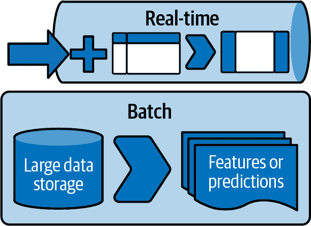

# 第四章\. 推荐系统的系统设计

现在您已经对推荐系统的工作原理有了基础理解，让我们更仔细地看一下所需的要素，并设计一个能够在工业规模下提供推荐的系统。在我们的背景下，“工业规模”主要指的是“合理规模”（由 Ciro Greco、Andrea Polonioli 和 Jacopo Tagliabue 在[“ML and MLOps at a Reasonable Scale”](https://oreil.ly/jNIRY)中引入的术语）——适用于有数十到数百名工程师致力于产品开发的公司的生产应用，而不是千人以上。

理论上，推荐系统是一组数学公式，可以利用用户与物品的历史交互数据返回用户-物品对亲和性的概率估计。实际上，推荐系统是 5、10 或者可能是 20 个软件系统，实时通信并且使用有限信息，受限物品可用性和永远的样本外行为，所有这些都是为了确保用户看到*某些东西*。

本章受到[Eugene Yan 的“System Design for Recommendations and Search”](https://oreil.ly/UBMB2)和[Even Oldridge 与 Karl Byleen-Higley 的“Recommender Systems, Not Just Recommender Models”](https://oreil.ly/G2aiH)的深刻影响。

# 在线与离线

机器学习系统由您预先完成的工作和即时完成的工作组成。在线与离线之间的这种分工是关于执行各种类型任务所需信息的实际考虑。要观察和学习大规模模式，系统需要访问大量数据；这是离线组件。然而，执行推理只需要训练过的模型和相关输入数据。这就是为什么许多机器学习系统架构是这样构建的原因。您经常会遇到描述在线-离线范式两侧的术语*批处理*和*实时*（见图 4-1）。

###### 图 4-1\. 实时对比批处理

*批处理*不需要用户输入，通常需要更长的完成时间，并且能够同时拥有所有必要的数据。批处理通常包括训练基于历史数据的模型、通过额外的特征集合增强数据集或转换计算密集型数据等任务。在批处理中更频繁见到的另一个特征是，它们使用涉及的完整相关数据集，而不仅仅是按时间切片或其他方式切分的数据实例。

*实时* *过程* 是在请求时执行的；换句话说，在推断过程中进行评估。例如，在页面加载时提供推荐、在用户完成上一集后更新下一集、在某个推荐标记为*不感兴趣*后重新排名推荐等。由于需要快速响应，实时过程通常受到资源限制的影响；但与该领域的许多事物一样，随着世界计算资源的扩展，我们改变了资源限制的定义。

让我们回到第一章中介绍的组件——收集器、排名器和服务器，并考虑它们在离线和在线系统中的作用。

# 收集器

收集器的角色是了解可能推荐的项目集合及这些项目的必要特征或属性。

## 离线收集器

*离线收集器* 具有对最大数据集的访问权限，并对其负责。理解所有用户-项目交互、用户相似性、项目相似性、用户和项目的特征存储以及最近邻居查找索引都在离线收集器的监管范围内。离线收集器需要能够非常快速地访问相关数据，有时还需要大批量操作。为此，离线收集器通常实现亚线性搜索函数或专门调整的索引结构。它们还可能利用分布式计算进行这些转换。

需要记住的是，离线收集器不仅需要访问和了解这些数据集，还要负责编写必要的下游数据集，以供实时使用。

## 在线收集器

*在线收集器* 使用离线收集器索引和准备的信息，实时提供对数据部分的访问，这对推断过程至关重要。这包括技术如寻找最近邻居、从特征存储中增补观察、了解完整的库存目录等。在线收集器还需要处理最近的用户行为；当我们在第十七章中看到顺序推荐器时，这将变得尤为重要。

在线收集器可能还承担另一个角色，即对请求进行编码。在搜索推荐系统的上下文中，我们希望将查询编码成*搜索空间*，通过嵌入模型。对于上下文推荐系统，我们也需要将上下文编码到*潜在空间*，同样使用嵌入模型。

# 嵌入模型

收集者工作中一个流行的子组件将涉及一个嵌入步骤；参见[*机器学习设计模式*](https://www.oreilly.com/library/view/machine-learning-design/9781098115777/)，作者瓦利亚帕·拉克什马南等（O'Reilly）。离线方面的嵌入步骤涉及训练嵌入模型和构建后续使用的潜在空间。在在线方面，嵌入转换将需要将查询嵌入到正确的空间中。通过这种方式，嵌入模型作为您模型架构的一部分的转换服务。

# 排序器

排名器的角色是接受收集者提供的集合，并根据上下文和用户的模型对其部分或全部元素进行排序。排名器实际上包括两个组件，即过滤和评分。

*过滤* 可以被视为适合推荐的项目的粗略包含和排除。这个过程通常的特征是迅速地削减我们绝对不希望展示的大量潜在推荐。一个简单的例子是不推荐用户过去已经选择过的项目。

*评分* 是对排名更传统的理解：根据选择的目标函数创建潜在推荐的排序。

## 离线排名器

*离线排名器* 的目标是促进过滤和评分。它与在线排名器的区别在于如何运行验证以及输出如何用于构建在线排名器可以利用的快速数据结构。此外，离线排名器可以与*人机协作机器学习*的人工审查流程集成。

一个后面将讨论的重要技术是*布隆过滤器*。布隆过滤器允许离线排名器批处理工作，因此实时过滤可以更快地进行。这个过程的一个简化版本是利用请求的几个特征来快速选择所有可能候选集的子集。如果可以快速完成这一步骤——在计算复杂度方面，力求少于候选数的二次——那么下游复杂算法可以大幅提升性能。

在离线组件中，排名是训练学习如何对项目进行排名的模型的过程。正如稍后将看到的那样，学习如何根据目标函数对项目进行排名是推荐模型的核心。训练这些模型并准备其输出的方面是排名器的批处理职责的一部分。

## 在线排名器

*在线排名器*受到很多赞赏，但实际上是利用了其他组件的辛勤工作。在线排名器首先进行过滤，利用离线构建的过滤基础设施，例如索引查找或布隆过滤器应用。过滤后，候选推荐的数量已经被控制住，因此我们实际上可以来完成最臭名昭著的任务：排名推荐。

在在线排名阶段，通常会访问特征存储来获取候选项并为其添加必要的细节，然后应用评分和排名模型。评分或排名可能会在几个独立的维度上进行，然后汇总为一个最终排名。在多目标范式中，你可能会有几个与排名器返回的候选列表相关联的这些排名。

# 服务器

服务器的角色是接收排名器提供的有序子集，确保满足必要的数据模式（包括基本业务逻辑），并返回请求的推荐数量。

## 离线服务器

*离线服务器*负责系统返回的推荐的硬需求的高级对齐。除了建立和执行架构外，这些规则可能更细化，比如“在推荐这种上装时，永远不要推荐这条裤子”。通常被视为“业务逻辑”，离线服务器负责创建有效的方式，以在返回的推荐中施加顶级优先级。

离线服务器的另一个责任是处理像实验这样的任务。在某些时候，你可能想运行在线实验，以测试你用本书构建的所有惊人推荐系统。离线服务器是你将实现实验决策逻辑并以在线服务器可以实时使用的方式提供其影响的地方。

## 在线服务器

*在线服务器*接受已经建立的规则、要求和配置，并将它们最终应用到排名推荐上。一个简单的例子是多样化规则；正如稍后将看到的，推荐多样化对用户体验的质量有显著影响。在线服务器可以从离线服务器读取多样化要求，并将其应用到排名列表中，以返回预期数量的多样化推荐。

# 总结

记住在线服务器是其他系统获取响应的端点很重要。虽然通常它是消息的来源，但系统中最复杂的组件多数是上游的。务必以一种方式来监测这个系统，使得当响应变慢时，每个系统都足够可观察，从而可以确定性能降级的原因所在。

现在我们已经建立了框架，您了解了核心组件的功能，接下来我们将讨论机器学习系统的方面以及与其相关的技术类型。

在接下来的章节中，我们将动手操作上述的组件，并看看如何实现关键的部分。最后，我们将把所有内容整合到一个仅使用每个项目内容的生产规模推荐系统中。出发吧！
