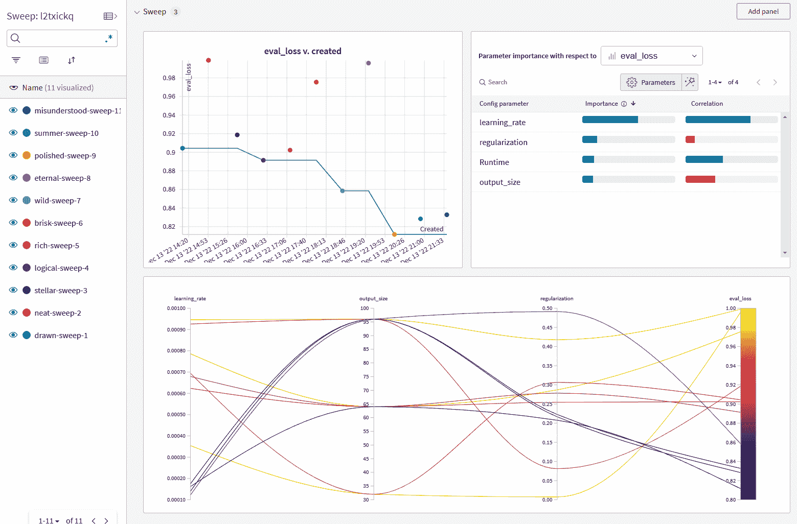

# 第五章。将所有内容整合起来：基于内容的推荐系统

在本书的这一部分中，我们介绍了推荐系统中最基本的一些组件。在本章中，我们将亲自动手。我们将为来自 Pinterest 的图像设计并实现推荐系统。这一章以及本书的其他“将所有内容整合起来”章节将向您展示如何使用开源工具处理数据集。这类章节的材料是指在 GitHub 上托管的代码，您需要下载并与之互动，以便全面体验内容。

由于这是第一个实践操作章节，这里提供了开发环境的额外设置说明。我们在运行 Windows 子系统 Linux（WSL）Ubuntu 虚拟机的 Windows 上开发了这段代码。该代码应该可以在 Linux 机器上正常运行，对于 macOS 需要更多的技术适配，而对于 Windows，则最好在 WSL2 Ubuntu 虚拟机上运行。您可以查看[Windows 的 Microsoft 文档](https://oreil.ly/VWPhi)来了解 WSL 的设置。我们选择 Ubuntu 作为映像。如果您有 NVIDIA GPU 并希望使用它，您还需要[NVIDIA CUDA](https://oreil.ly/rnCw4)和[cuDNN](https://oreil.ly/LHa-I)。

我们将使用[“完成外观：基于场景的补充产品推荐”](https://oreil.ly/2EDnZ)中的[Shop the Look (STL) 数据集](https://oreil.ly/PxfJn)，作者是康旺诚（Wang-Cheng Kang）等人。

在本章中，我们将向您展示如何构建基于内容的推荐系统。请记住，基于内容的推荐系统使用间接的、可推广的项目表示。例如，假设您想推荐一个蛋糕，但不能使用蛋糕的名称。相反，您可以使用蛋糕的描述或其成分作为内容特征。

使用 STL 数据集，我们将尝试将场景（人物在特定环境中的图片）与可能与场景搭配的产品匹配。训练集包含场景与单个产品的配对，我们希望使用内容推荐系统将推荐扩展到整个产品目录，并按某种排序顺序进行排序。基于内容的推荐系统利用间接的内容特征进行推荐，可用于推荐尚未包含在推荐系统中的新产品，或者在用户开始使用之前手动策划数据和建立反馈循环。在 STL 数据集的情况下，我们将重点放在场景和产品的视觉外观上。

我们将通过卷积神经网络（CNN）架构生成内容嵌入，然后通过三元损失训练嵌入，并展示如何创建内容推荐系统。

本章涵盖以下主题：

+   修订控制软件

+   Python 构建系统

+   随机项目推荐

+   获取 STL 数据集的图像

+   CNN 的定义

+   JAX、Flax 和 Optax 中的模型训练

+   输入流水线

# 版本控制软件

*版本控制软件*是一种跟踪代码更改的软件系统。可以将其视为跟踪您编写的代码版本的数据库，同时提供显示每个代码版本之间差异的附加功能，并允许您恢复到先前版本。

有许多种版本控制系统。我们在[GitHub](https://oreil.ly/DsolH)上托管本书的代码。

我们使用的版本控制软件名为[Git](https://git-scm.com)。代码更改以*patch*批次的形式进行，每个*patch*都会上传到类似 GitHub 的源代码控制存储库，以便许多人同时克隆并进行工作。

您可以使用此命令克隆书中代码示例存储库：

```py
git clone git@github.com:BBischof/ESRecsys.git
```

对于这一章，查看目录 *ESRecsys/pinterest* 以了解如何详细运行代码的说明。这一章主要侧重于描述和指向存储库，以便你能够实际感受这些系统。

# Python 构建系统

Python *包*是提供超出标准 Python 库功能的库。这些包括诸如 TensorFlow 和 JAX 等 ML 包，但也包括更实用的包，例如 absl 标志库或机器学习操作（MLOps）库，如[Weights & Biases](https://wandb.ai)。

这些包通常托管在[Python 软件包索引](https://pypi.org)上。

查看文件 *requirements.txt*：

```py
absl-py==1.1.0
tensorflow==2.9.1
typed-ast==1.5.4
typing_extensions==4.2.0
jax==0.3.25
flax==0.5.2
optax==0.1.2
wandb==0.13.4
```

您可以看到我们选择了一小组 Python 包来安装我们的依赖项。格式为包名、两个等号，然后是包的版本。

还有其他与 Python 一起工作的构建系统，包括以下内容：

+   [pip](https://oreil.ly/QNevQ)

+   [Bazel](https://oreil.ly/3BdIC)

+   [Anaconda](https://oreil.ly/4z182)

对于这一章，我们将使用 pip。

然而，在安装包之前，您可能想要了解一下[Python 虚拟环境](https://oreil.ly/fnQKD)。Python 虚拟环境是一种跟踪每个项目的 Python 包依赖关系的方法，因此，如果不同项目使用不同版本的相同包，它们不会相互干扰，因为每个项目都有自己的 Python 虚拟环境来运行。

您可以通过在 Unix shell 中键入以下内容来创建和激活 Python 虚拟环境：

```py
python -m venv pinterest_venv
source pinterest_venv/bin/activate
```

第一个命令创建一个 Python 虚拟环境，第二个命令激活它。每次打开新的 shell 时，您都需要激活一个虚拟环境，以便 Python 知道要在哪个环境中工作。

创建虚拟环境后，您可以使用 pip 将软件包安装到虚拟环境中，新安装的软件包不会影响系统级软件包。

您可以通过在 *ESRecsys/pinterest* 目录中运行此命令来执行此操作：

```py
pip install -r requirements.txt
```

这将安装指定的软件包及其可能依赖的任何子软件包到虚拟环境中。

# 随机项目推荐器

我们首先要看的程序是一个随机项目推荐器（示例 5-1）。

##### 示例 5-1\. 设置标志

```py
FLAGS = flags.FLAGS
_INPUT_FILE = flags.DEFINE_string(
  "input_file", None, "Input cat json file.")
_OUTPUT_HTML = flags.DEFINE_string(
  "output_html", None, "The output html file.")
_NUM_ITEMS = flags.DEFINE_integer(
  "num_items", 10, "Number of items to recommend.")

# Required flag.
flags.mark_flag_as_required("input_file")
flags.mark_flag_as_required("output_html")

def read_catalog(catalog: str) -> Dict[str, str]:
    """
 Reads in the product to category catalog.
 """
    with open(catalog, "r") as f:
        data = f.read()
    result = json.loads(data)
    return result

def dump_html(subset, output_html:str) -> None:
    """
 Dumps a subset of items.
 """
    with open(output_html, "w") as f:
        f.write("<HTML>\n")
        f.write("""
 <TABLE><tr>
 <th>Key</th>
 <th>Category</th>
 <th>Image</th>
 </tr>""")
        for item in subset:
            key, category = item
            url = pin_util.key_to_url(key)
            img_url = "" % url
            out = "<tr><td>%s</td><td>%s</td><td>%s</td></tr>\n" %
            (key, category, img_url)
            f.write(out)
        f.write("</TABLE></HTML>")

def main(argv):
    """
 Main function.
 """
    del argv  # Unused.

    catalog = read_catalog(_INPUT_FILE.value)
    catalog = list(catalog.items())
    random.shuffle(catalog)
    dump_html(catalog[:_NUM_ITEMS.value], _OUTPUT_HTML.value)
```

在这里，我们使用 absl 标志库来传递程序参数，例如包含 STL 场景和产品配对的 JSON 目录文件的路径。

标志可以有不同的类型，如字符串和整数，并且您可以将它们标记为必需的。如果未传递必需的标志到程序中，程序将报错并停止运行。可以通过它们的值方法访问标志。

我们通过使用 JSON Python 库加载和解析 STL 数据集，然后随机洗牌目录并将前几个结果转储到 HTML 中。

您可以通过以下命令来运行随机项目推荐器：

```py
python3 random_item_recommender.py
--input_file=STL-Dataset/fashion-cat.json --output_html=output.html
```

完成后，您可以使用 Web 浏览器打开*output.html*文件，查看目录中的一些随机项目。图 5-1 展示了一个示例。


###### 图 5-1\. 随机项目推荐器

*fashion-catalog.json* 文件包含产品描述及其 Pinterest ID，而*fashion.json* 包含场景与推荐产品的配对信息。

接下来，我们将看看如何通过对场景-产品配对进行训练 ML 模型来为单个场景推荐多个新项目。

当您第一次遇到一个语料库时，创建一个随机项目推荐器通常是一个好主意，这样您可以了解语料库中的项目类型，并有一个比较的基准。

# 获取 STL 数据集图像

创建基于内容的推荐系统的第一步是获取内容。在这种情况下，STL 数据集的内容主要是图像，还包括一些关于图像的元数据（如产品类型）。本章节我们将仅使用图像内容。

您可以查看*fetch_images.py*中的代码，了解如何使用 Python 标准库 urllib 获取图像。请注意，在其他网站上进行过多的抓取可能会触发其机器人防御机制，并导致将您的 IP 地址列入黑名单，因此限制抓取速率或找到其他获取数据的方法可能是个明智的选择。

我们已经下载了成千上万个图像文件，并将它们放在一个 Weights & Biases 工件中。由于存档已经包含在此工件中，您无需自行抓取这些图像，但我们提供的代码将允许您这样做。

您可以在[Weights & Biases 文档](https://oreil.ly/NXTYP)中了解有关工件的更多信息。工件是 MLOps 概念，用于版本控制和打包数据的归档，并跟踪数据的生产者和消费者。

您可以通过运行以下命令来下载图像文件：

```py
wandb artifact get building-recsys/recsys-pinterest/shop_the_look:latest
```

图像将会位于本地目录*artifacts/shop_the_look:v1*中。

# 卷积神经网络定义

现在我们有了图像，下一步是找出如何表示数据。图像有不同的大小，是一种复杂的内容类型进行分析。我们可以使用原始像素作为我们内容的表示，但缺点是像素值的微小变化可能会导致图像之间的距离差异很大。我们不希望这样。相反，我们希望某种方式学习图像中重要的内容，忽略像背景颜色这样的图像部分，这些部分可能不那么重要。

对于这个任务，我们将使用[卷积神经网络（CNN）](https://oreil.ly/r6KpS)来计算图像的嵌入向量。*嵌入向量* 是从数据中学习到的图像的一种特征向量，大小固定。我们使用嵌入向量作为我们的表示，因为我们希望我们的数据库小而紧凑，易于在大量图像中进行评分，并与手头的任务相关，即将产品匹配到给定场景图像。

我们使用的神经网络架构是残差网络的一种变体，或称为 ResNet。有关架构的详细信息和 CNN 的参考，请参阅 Kaiming He 等人的[“深度残差学习用于图像识别”](https://oreil.ly/XQYUh)。简而言之，卷积层重复地在图像上应用一个通常为 3×3 大小的小滤波器。如果步幅为（1，1）（这意味着在 x 方向和 y 方向上以 1 像素步幅应用滤波器），则这会产生与输入相同分辨率的特征图，如果步幅为（2，2），则为四分之一大小。残差跳跃连接只是从前一个输入层到下一个的一种快捷方式，因此实际上，网络的非线性部分学习线性跳跃部分的残差，因此得名残差网络。

另外，我们使用 BatchNorm 层，其详细信息可以在[Sergey Ioffe 和 Christian Szegedy 的“批归一化：通过减少内部协变量偏移加速深度网络训练”](https://oreil.ly/qM-yg)和[Prajit Ramachandran，Barret Zoph 和 Quoc V. Le 的“搜索激活函数”](https://oreil.ly/9Zlqb)中找到。

一旦我们指定了模型，我们还需要为任务进行优化。

# 在 JAX、Flax 和 Optax 中进行模型训练

在任何 ML 框架中优化我们的模型应该是相当简单的。这里我们展示如何使用[JAX](https://oreil.ly/pcmCU)，[Flax](https://oreil.ly/RtzDn)和[Optax](https://oreil.ly/vOCvF)轻松地完成这项任务。*JAX* 是一个类似于 NumPy 的低级 ML 库，*Flax* 是一个更高级的神经网络库，提供神经网络模块和嵌入层等功能。*Optax* 是一个库，用于优化我们将用来最小化损失函数的内容。

如果你熟悉 NumPy，学习 JAX 会很容易。JAX 与 NumPy 共享相同的 API，但通过即时编译具备在矢量处理器（如 GPU 或 TPU）上运行生成的代码的能力。JAX 设备数组和 NumPy 数组可以轻松相互转换，这使得在 GPU 上开发变得简单，但在 CPU 上进行调试也很容易。

除了学习如何表示图像外，我们还需要指定它们之间的关系。

由于嵌入向量具有固定的维度，最简单的相似度分数只是两个向量的点积。参见“共现相似度”获取其他类型的相似度度量方法。因此，给定一个场景的图像，我们计算场景嵌入，并对产品执行相同操作以获取产品嵌入，然后取两者的点积以获取场景 <math alttext="ModifyingAbove s With right-arrow"><mover accent="true"><mi>s</mi> <mo>→</mo></mover></math> 与产品 <math alttext="ModifyingAbove p With right-arrow"><mover accent="true"><mi>p</mi> <mo>-></mo></mover></math> 的拟合紧密程度分数：

<math alttext="s c o r e left-parenthesis ModifyingAbove s With right-arrow comma ModifyingAbove p With right-arrow right-parenthesis equals ModifyingAbove s With right-arrow asterisk ModifyingAbove p With right-arrow" display="block"><mrow><mi>s</mi> <mi>c</mi> <mi>o</mi> <mi>r</mi> <mi>e</mi> <mrow><mo>(</mo> <mover accent="true"><mi>s</mi> <mo>→</mo></mover> <mo>,</mo> <mover accent="true"><mi>p</mi> <mo>→</mo></mover> <mo>)</mo></mrow> <mo>=</mo> <mover accent="true"><mi>s</mi> <mo>→</mo></mover> <mo>*</mo> <mover accent="true"><mi>p</mi> <mo>→</mo></mover></mrow></math>

我们使用 CNN 来获取图像的嵌入。

我们为场景和产品使用单独的 CNN，因为它们来自不同类型的图像。场景往往显示我们要匹配产品的背景和人物设置，而产品则往往是鞋子和包的目录图像，背景是空白的，因此我们需要不同的神经网络来确定图像中重要的内容。

一旦我们有了分数，仅仅这些还不够。我们需要确保一个场景和产品的良好匹配，我们称之为*正面产品*，比负面产品得分更高。正面产品是场景的良好匹配，而负面产品是场景的不太良好匹配。正面产品来自训练数据，而负面产品来自随机采样的目录。能够捕捉正面场景-产品对（A, B）和负面场景-产品对（A, C）之间关系的损失称为*三元损失*。让我们详细定义一下[三元损失](https://oreil.ly/alBxu)。

假设我们希望正面场景-产品对的分数比负面场景-产品对多一个。那么我们有以下不等式：

<math alttext="s c o r e left-parenthesis s c e n e comma p o s Subscript p r o d u c t Baseline right-parenthesis greater-than s c o r e left-parenthesis s c e n e comma n e g Subscript p r o d u c t Baseline right-parenthesis plus 1" display="block"><mrow><mi>s</mi> <mi>c</mi> <mi>o</mi> <mi>r</mi> <mi>e</mi> <mrow><mo>(</mo> <mi>s</mi> <mi>c</mi> <mi>e</mi> <mi>n</mi> <mi>e</mi> <mo>,</mo> <mi>p</mi> <mi>o</mi> <msub><mi>s</mi> <mrow><mi>p</mi><mi>r</mi><mi>o</mi><mi>d</mi><mi>u</mi><mi>c</mi><mi>t</mi></mrow></msub> <mo>)</mo></mrow> <mo>></mo> <mi>s</mi> <mi>c</mi> <mi>o</mi> <mi>r</mi> <mi>e</mi> <mrow><mo>(</mo> <mi>s</mi> <mi>c</mi> <mi>e</mi> <mi>n</mi> <mi>e</mi> <mo>,</mo> <mi>n</mi> <mi>e</mi> <msub><mi>g</mi> <mrow><mi>p</mi><mi>r</mi><mi>o</mi><mi>d</mi><mi>u</mi><mi>c</mi><mi>t</mi></mrow></msub> <mo>)</mo></mrow> <mo>+</mo> <mn>1</mn></mrow></math>

1 只是我们使用的一个任意常数，称为*间隔*，以确保正面场景-产品分数大于负面场景-产品分数。

由于梯度下降的过程是最小化一个函数，我们将前述不等式转化为损失函数，通过将所有项移到一边实现：

<math alttext="0 greater-than 1 plus s c o r e left-parenthesis s c e n e comma n e g Subscript p r o d u c t Baseline right-parenthesis minus s c o r e left-parenthesis s c e n e comma p o s Subscript p r o d u c t Baseline right-parenthesis" display="block"><mrow><mn>0</mn> <mo>></mo> <mn>1</mn> <mo>+</mo> <mi>s</mi> <mi>c</mi> <mi>o</mi> <mi>r</mi> <mi>e</mi> <mrow><mo>(</mo> <mi>s</mi> <mi>c</mi> <mi>e</mi> <mi>n</mi> <mi>e</mi> <mo>,</mo> <mi>n</mi> <mi>e</mi> <msub><mi>g</mi> <mrow><mi>p</mi><mi>r</mi><mi>o</mi><mi>d</mi><mi>u</mi><mi>c</mi><mi>t</mi></mrow></msub> <mo>)</mo></mrow> <mo>-</mo> <mi>s</mi> <mi>c</mi> <mi>o</mi> <mi>r</mi> <mi>e</mi> <mrow><mo>(</mo> <mi>s</mi> <mi>c</mi> <mi>e</mi> <mi>n</mi> <mi>e</mi> <mo>,</mo> <mi>p</mi> <mi>o</mi> <msub><mi>s</mi> <mrow><mi>p</mi><mi>r</mi><mi>o</mi><mi>d</mi><mi>u</mi><mi>c</mi><mi>t</mi></mrow></msub> <mo>)</mo></mrow></mrow></math>

只要右侧的数量大于 0，我们希望将其最小化；但如果已经小于 0，则不进行操作。因此，我们将数量编码为修正线性单元，其由函数`max(0, *x*)`表示。因此，我们可以将我们的损失函数写成如下形式：

+   <math alttext="l o s s left-parenthesis s c e n e comma p o s Subscript p r o d u c t Baseline comma n e g Subscript p r o d u c t Baseline right-parenthesis equals"><mrow><mi>l</mi> <mi>o</mi> <mi>s</mi> <mi>s</mi> <mo>(</mo> <mi>s</mi> <mi>c</mi> <mi>e</mi> <mi>n</mi> <mi>e</mi> <mo>,</mo> <mi>p</mi> <mi>o</mi> <msub><mi>s</mi> <mrow><mi>p</mi><mi>r</mi><mi>o</mi><mi>d</mi><mi>u</mi><mi>c</mi><mi>t</mi></mrow></msub> <mo>,</mo> <mi>n</mi> <mi>e</mi> <msub><mi>g</mi> <mrow><mi>p</mi><mi>r</mi><mi>o</mi><mi>d</mi><mi>u</mi><mi>c</mi><mi>t</mi></mrow></msub> <mo>)</mo> <mo>=</mo></mrow></math> <math alttext="m a x left-parenthesis 0 comma 1 plus s c o r e left-parenthesis s c e n e comma n e g Subscript p r o d u c t Baseline right-parenthesis minus s c o r e left-parenthesis s c e n e comma p o s Subscript p r o d u c t Baseline right-parenthesis right-parenthesis"><mrow><mi>m</mi> <mi>a</mi> <mi>x</mi> <mo>(</mo> <mn>0</mn> <mo>,</mo> <mn>1</mn> <mo>+</mo> <mi>s</mi> <mi>c</mi> <mi>o</mi> <mi>r</mi> <mi>e</mi> <mrow><mo>(</mo> <mi>s</mi> <mi>c</mi> <mi>e</mi> <mi>n</mi> <mi>e</mi> <mo>,</mo> <mi>n</mi> <mi>e</mi> <msub><mi>g</mi> <mrow><mi>p</mi><mi>r</mi><mi>o</mi><mi>d</mi><mi>u</mi><mi>c</mi><mi>t</mi></mrow></msub> <mo>)</mo></mrow> <mo>-</mo> <mi>s</mi> <mi>c</mi> <mi>o</mi> <mi>r</mi> <mi>e</mi> <mrow><mo>(</mo> <mi>s</mi> <mi>c</mi> <mi>e</mi> <mi>n</mi> <mi>e</mi> <mo>,</mo> <mi>p</mi> <mi>o</mi> <msub><mi>s</mi> <mrow><mi>p</mi><mi>r</mi><mi>o</mi><mi>d</mi><mi>u</mi><mi>c</mi><mi>t</mi></mrow></msub> <mo>)</mo></mrow> <mo>)</mo></mrow></math>

由于我们通常会最小化损失函数，这确保只要`score(scene, neg_product)`比`score(scene, pos_product)`多 1，优化过程将尝试减少负对的分数，同时增加正对的分数。

下一个示例按顺序涵盖以下模块，以便它们在数据从读取到训练再到制作推荐的流程中具有意义：

*input__pipeline.py*

如何读取数据

*models.py*

如何指定神经网络

*train_shop_the_look.py*

如何使用 Optax 拟合神经网络

*make_embeddings.py*

如何制作一个紧凑的场景和产品数据库

*make_recommendations.py*

如何使用嵌入的紧凑数据库创建每个场景的产品推荐列表

# 输入流水线

示例 5-2 展示了*input_pipeline.py*的代码。我们使用 ML 库[TensorFlow](https://oreil.ly/hsqPr)来进行数据流水线处理。

##### 示例 5-2\. TensorFlow 数据流水线

```py
import tensorflow as tf

def normalize_image(img):
  img = tf.cast(img, dtype=tf.float32)
  img = (img / 255.0) - 0.5
  return img

def process_image(x):
  x = tf.io.read_file(x)
  x = tf.io.decode_jpeg(x, channels=3)
  x = tf.image.resize_with_crop_or_pad(x, 512, 512)
  x = normalize_image(x)
  return x

def process_image_with_id(id):
  image = process_image(id)
  return id, image

def process_triplet(x):
  x = (process_image(x[0]), process_image(x[1]), process_image(x[2]))
  return x

def create_dataset(
    triplet: Sequence[Tuple[str, str, str]]):
    """Creates a triplet dataset.
 Args:
 triplet: filenames of scene, positive product, negative product.
 """
    ds = tf.data.Dataset.from_tensor_slices(triplet)
    ds = ds.map(process_triplet)
    return ds
```

您可以看到 `create_dataset` 接受三个文件名：场景的文件名，然后是正匹配和负匹配。对于这个示例，负匹配只是从目录中随机选择的。我们在 第十二章 中介绍了选择负面的更复杂的方法。图像文件名通过读取文件，解码图像，裁剪到固定大小，然后重新缩放数据，使其成为围绕 0 居中并具有在 –1 和 1 之间的小值的浮点图像来处理。我们这样做是因为大多数神经网络被初始化时假定它们接收到的数据大致上是正态分布的，因此如果您传入的值太大，它将远远超出预期输入范围的正常值。

示例 5-3 展示了如何使用 Flax 指定我们的 CNN 和 STL 模型。

##### 示例 5-3\. 定义 CNN 模型

```py
from flax import linen as nn
import jax.numpy as jnp

class CNN(nn.Module):
    """Simple CNN."""
    filters : Sequence[int]
    output_size : int

    @nn.compact
    def __call__(self, x, train: bool = True):
        for filter in self.filters:
            # Stride 2 downsamples 2x.
            residual = nn.Conv(filter, (3, 3), (2, 2))(x)
            x = nn.Conv(filter, (3, 3), (2, 2))(x)
            x = nn.BatchNorm(
              use_running_average=not train, use_bias=False)(x)
            x = nn.swish(x)
            x = nn.Conv(filter, (1, 1), (1, 1))(x)
            x = nn.BatchNorm(
              use_running_average=not train, use_bias=False)(x)
            x = nn.swish(x)
            x = nn.Conv(filter, (1, 1), (1, 1))(x)
            x = nn.BatchNorm(
              use_running_average=not train, use_bias=False)(x)
            x = x + residual
            # Average pool downsamples 2x.
            x = nn.avg_pool(x, (3, 3), strides=(2, 2), padding="SAME")
        x = jnp.mean(x, axis=(1, 2))
        x = nn.Dense(self.output_size, dtype=jnp.float32)(x)
        return x

class STLModel(nn.Module):
    """Shop the look model that takes in a scene
 and item and computes a score for them.
 """
    output_size : int

    def setup(self):
        default_filter = [16, 32, 64, 128]
        self.scene_cnn = CNN(
          filters=default_filter, output_size=self.output_size)
        self.product_cnn = CNN(
          filters=default_filter, output_size=self.output_size)

    def get_scene_embed(self, scene):
        return self.scene_cnn(scene, False)

    def get_product_embed(self, product):
        return self.product_cnn(product, False)

    def __call__(self, scene, pos_product, neg_product,
                 train: bool = True):
        scene_embed = self.scene_cnn(scene, train)

        pos_product_embed = self.product_cnn(pos_product, train)
        pos_score = scene_embed * pos_product_embed
        pos_score = jnp.sum(pos_score, axis=-1)

        neg_product_embed = self.product_cnn(neg_product, train)
        neg_score = scene_embed * neg_product_embed
        neg_score = jnp.sum(neg_score, axis=-1)

        return pos_score, neg_score, scene_embed,
          pos_product_embed, neg_product_embed
```

在这里，我们使用了 Flax 的神经网络类 `Module`。注释 `nn.compact` 存在是为了对于像这样的简单神经网络架构，我们不必指定一个设置函数，而是可以简单地在 `call` 函数中指定层。`call` 函数接受两个参数，一个图像 `*x*` 和一个布尔值 `train`，告诉模块我们是否在训练模式下调用它。我们需要布尔值训练的原因是 BatchNorm 层仅在训练期间更新，并在网络完全学习时不会更新。

如果您查看 CNN 规范代码，您可以看到我们如何设置残差网络。我们可以自由地混合神经网络函数，比如 `swish`，和 JAX 函数，比如 `mean`。`swish` 函数是神经网络的非线性激活函数，它将输入转换为一种方式，以便对某些激活值给予更高的权重。

另一方面，STL 模型具有更复杂的设置，因此我们必须指定设置代码来创建两个 CNN tower：一个用于场景，另一个用于产品。*CNN tower* 只是相同架构的副本，但对于不同的图像类型具有不同的权重。如前所述，我们对于每种图像类型都有一个不同的 tower，因为每种代表不同的事物；一个 tower 用于场景（提供我们匹配产品的上下文），另一个 tower 用于产品。因此，我们添加了两种不同的方法，用于将场景和产品图像转换为场景和产品嵌入。

调用也是不同的。它没有注释紧凑，因为我们有一个更复杂的设置。在 STL 模型的调用函数中，我们首先计算场景嵌入，然后计算正产品嵌入和正分数。之后，我们对负分数进行同样的操作。然后，我们返回正分数、负分数和所有三个嵌入向量。我们返回嵌入向量以及分数，因为我们希望确保模型泛化到新的、未见过的数据，例如保留验证集，因此我们希望确保嵌入向量不会过大。限制它们大小的概念称为*正则化*。

现在让我们来看一下 *train_shop_the_look.py* (示例 5-4)。我们将其分解为单独的函数调用，并逐一讨论它们。

##### 示例 5-4\. 生成训练用三元组

```py
def generate_triplets(
    scene_product: Sequence[Tuple[str, str]],
    num_neg: int) -> Sequence[Tuple[str, str, str]]:
    """Generate positive and negative triplets."""
    count = len(scene_product)
    train = []
    test = []
    key = jax.random.PRNGKey(0)
    for i in range(count):
        scene, pos = scene_product[i]
        is_test = i % 10 == 0
        key, subkey = jax.random.split(key)
        neg_indices = jax.random.randint(subkey, [num_neg], 0, count - 1)
        for neg_idx in neg_indices:
            _, neg = scene_product[neg_idx]
            if is_test:
                test.append((scene, pos, neg))
            else:
                train.append((scene, pos, neg))
    return train, test

 def shuffle_array(key, x):
    """Deterministic string shuffle."""
    num = len(x)
    to_swap = jax.random.randint(key, [num], 0, num - 1)
    return [x[t] for t in to_swap]
```

代码片段读取场景产品的 JSON 数据库，并为输入流水线生成场景、正产品和负产品的三元组。这里值得注意的有趣部分是 JAX 如何处理随机数。JAX 的理念是功能性的，意味着函数是纯净的，没有副作用。随机数生成器带有状态，因此为了使 JAX 的随机数生成器能够工作，你必须将状态传递给随机数生成器。其机制是使用伪随机数生成器密钥 PNRGKey 作为携带状态的对象。我们任意地从数字 0 初始化一个。然而，每当我们希望使用密钥时，我们必须使用 `jax.random.split` 将其分成两部分，然后使用其中一部分生成下一个随机数，使用子密钥执行随机操作。在本例中，我们使用子密钥从整个产品语料库中选择一个随机负例。在第 12 章中，我们介绍了更复杂的负例抽样方法，但随机选择一个负例是构建三元组损失的最简单方法。

类似于选择负例的方式，我们再次使用 JAX 的随机功能生成要交换的索引列表，以便在训练步骤中对数组进行洗牌。在随机梯度下降中，随机洗牌对于打破训练数据的任何结构都是重要的，以确保梯度是随机的。我们使用 JAX 的随机洗牌机制来提高再现性，以便在相同的初始数据和设置下实验更有可能是相同的。

我们将看一下的下一对函数列在 示例 5-5 中，展示了训练和评估步骤的编写方式。训练步骤采用了模型状态，其中包含模型参数以及梯度信息，这取决于所使用的优化器。此步骤还接受场景批次、正产品和负产品，以构建三元损失。除了优化三元损失外，我们还希望在嵌入超出单位球时最小化其大小。最小化嵌入大小的过程称为*正则化*，因此我们将其添加到三元损失中以获得最终损失。

##### 示例 5-5\. 训练和评估步骤

```py
def train_step(state, scene, pos_product,
               neg_product, regularization, batch_size):
    def loss_fn(params):
        result, new_model_state = state.apply_fn(
            params,
            scene, pos_product, neg_product, True,
            mutable=['batch_stats'])
        triplet_loss = jnp.sum(nn.relu(1.0 + result[1] - result[0]))
        def reg_fn(embed):
            return nn.relu(
              jnp.sqrt(jnp.sum(jnp.square(embed), axis=-1)) - 1.0)
        reg_loss = reg_fn(result[2]) +
                   reg_fn(result[3]) + reg_fn(result[4])
        reg_loss = jnp.sum(reg_loss)
        return (triplet_loss + regularization * reg_loss) / batch_size

    grad_fn = jax.value_and_grad(loss_fn)
    loss, grads = grad_fn(state.params)
    new_state = state.apply_gradients(grads=grads)
    return new_state, loss

def eval_step(state, scene, pos_product, neg_product):
    def loss_fn(params):
        result, new_model_state = state.apply_fn(
            state.params,
            scene, pos_product, neg_product, True,
            mutable=['batch_stats'])
        # Use a fixed margin for the eval.
        triplet_loss = jnp.sum(nn.relu(1.0 + result[1] - result[0]))
        return triplet_loss
```

Flax 基于 JAX 编写，同样具有功能哲学，因此使用现有状态计算损失函数的梯度，应用后返回一个新的状态变量。这确保函数保持纯粹且状态变量可变。

正是这种功能哲学使得 JAX 能够即时编译或使用即时函数，从而在 CPU、GPU 或 TPU 上运行得更快。

相比之下，评估步骤相对简单。它仅计算三元损失，不考虑正则化损失作为我们的评估指标。我们将在 第 11 章 中介绍更复杂的评估指标。

最后，让我们来看看训练程序的主体部分，如 示例 5-6 所示。我们将学习率、正则化以及输出大小等超参数存储在配置字典中。我们这样做是为了将配置字典传递给 Weights & Biases MLOps 服务进行安全存储，同时也能进行超参数调优。

##### 示例 5-6\. 训练模型的主体代码

```py
def main(argv):
    """Main function."""
    del argv  # Unused.
    config = {
        "learning_rate" : _LEARNING_RATE.value,
        "regularization" : _REGULARIZATION.value,
        "output_size" : _OUTPUT_SIZE.value
    }

    run = wandb.init(
        config=config,
        project="recsys-pinterest"
    )

    tf.config.set_visible_devices([], 'GPU')
    tf.compat.v1.enable_eager_execution()
    logging.info("Image dir %s, input file %s",
      _IMAGE_DIRECTORY.value, _INPUT_FILE.value)
    scene_product = pin_util.get_valid_scene_product(
      _IMAGE_DIRECTORY.value, _INPUT_FILE.value)
    logging.info("Found %d valid scene product pairs." % len(scene_product))

    train, test = generate_triplets(scene_product, _NUM_NEG.value)
    num_train = len(train)
    num_test = len(test)
    logging.info("Train triplets %d", num_train)
    logging.info("Test triplets %d", num_test)

     # Random shuffle the train.
    key = jax.random.PRNGKey(0)
    train = shuffle_array(key, train)
    test = shuffle_array(key, test)
    train = np.array(train)
    test = np.array(test)

    train_ds = input_pipeline.create_dataset(train).repeat()
    train_ds = train_ds.batch(_BATCH_SIZE.value).prefetch(
      tf.data.AUTOTUNE)

    test_ds = input_pipeline.create_dataset(test).repeat()
    test_ds = test_ds.batch(_BATCH_SIZE.value)

    stl = models.STLModel(output_size=wandb.config.output_size)
    train_it = train_ds.as_numpy_iterator()
    test_it = test_ds.as_numpy_iterator()
    x = next(train_it)
    key, subkey = jax.random.split(key)
    params = stl.init(subkey, x[0], x[1], x[2])
    tx = optax.adam(learning_rate=wandb.config.learning_rate)
    state = train_state.TrainState.create(
        apply_fn=stl.apply, params=params, tx=tx)
    if _RESTORE_CHECKPOINT.value:
        state = checkpoints.restore_checkpoint(_WORKDIR.value, state)

    train_step_fn = jax.jit(train_step)
    eval_step_fn = jax.jit(eval_step)

    losses = []
    init_step = state.step
    logging.info("Starting at step %d", init_step)
    regularization = wandb.config.regularization
    batch_size = _BATCH_SIZE.value
    eval_steps = int(num_test / batch_size)
    for i in range(init_step, _MAX_STEPS.value + 1):
        batch = next(train_it)
        scene = batch[0]
        pos_product = batch[1]
        neg_product = batch[2]

        state, loss = train_step_fn(
            state, scene, pos_product, neg_product,
            regularization, batch_size)
        losses.append(loss)
        if i % _CHECKPOINT_EVERY_STEPS.value == 0 and i > 0:
            logging.info("Saving checkpoint")
            checkpoints.save_checkpoint(
              _WORKDIR.value, state, state.step, keep=3)
        metrics = {
            "step" : state.step
        }
        if i % _EVAL_EVERY_STEPS.value == 0 and i > 0:
            eval_loss = []
            for j in range(eval_steps):
                ebatch = next(test_it)
                escene = ebatch[0]
                epos_product = ebatch[1]
                eneg_product = ebatch[2]
                loss = eval_step_fn(
                  state, escene, epos_product, eneg_product)
                eval_loss.append(loss)
            eval_loss = jnp.mean(jnp.array(eval_loss)) / batch_size
            metrics.update({"eval_loss" : eval_loss})
        if i % _LOG_EVERY_STEPS.value == 0 and i > 0:
            mean_loss = jnp.mean(jnp.array(losses))
            losses = []
            metrics.update({"train_loss" : mean_loss})
            wandb.log(metrics)
            logging.info(metrics)

    logging.info("Saving as %s", _MODEL_NAME.value)
    data = flax.serialization.to_bytes(state)
    metadata = { "output_size" : wandb.config.output_size }
    artifact = wandb.Artifact(
        name=_MODEL_NAME.value,
        metadata=metadata,
        type="model")
    with artifact.new_file("pinterest_stl.model", "wb") as f:
        f.write(data)
    run.log_artifact(artifact)

if __name__ == "__main__":
    app.run(main)
```

*超参数调优*是一个调整服务，通过运行许多不同数值的试验来帮助您找到诸如学习率之类的超参数的最佳值，并寻找最佳值。将配置作为字典允许我们通过运行超参数调优并保存最佳参数来复现最佳参数用于最终模型。

在 图 5-2 中，您可以看到 Weights & Biases 超参数调优的示例。左侧显示了调优中的所有运行；每个运行尝试不同的数值组合，我们在配置字典中指定了这些值。中间显示了随着调优试验次数变化的最终评估损失。右侧显示了影响评估损失的超参数重要性图。在这里，我们可以看到学习率对评估损失有最大影响，其次是正则化量。



###### 图 5-2\. Weights & Biases 超参数调优

在图的右下角，平行坐标图显示了每个参数如何影响评估损失。阅读图表时，请跟随每条线并查看其在最终评估损失上的位置。通过追踪从右下方评估损失的目标值到左侧的线路，可以找到最佳超参数。在这种情况下，选择的最佳数值为学习率为`0.0001618`，正则化为`0.2076`，输出大小为 64。

代码的其余部分主要是设置模型并将输入流水线连接到模型。决定何时记录指标和模型序列化在很大程度上是不言自明的。详情可以参阅 Flax 文档。

在保存模型时，请注意使用了两种方法。一种是检查点，另一种是 Flax 序列化。我们之所以两者都有，是因为当训练作业被取消时，需要使用检查点来恢复作业取消的步骤，以便能够恢复训练。最终的序列化在训练完成时使用。

我们还将模型保存为[Weights & Biases artifact](https://oreil.ly/gmGGt)的副本。这样，Weights & Biases 平台可以跟踪创建模型的超参数、确切的代码和生成模型的确切 Git 哈希，以及模型的衍生线。这条衍生线包括用于生成模型的上游工件（如训练数据）、用于创建模型的作业状态，以及未来可能使用该工件的所有作业的反向链接。在您的组织较大且人员正在寻找有关如何创建模型的信息时，这将非常方便。通过使用工件，他们可以简单地查找代码和训练数据工件的位置以复现模型。

现在我们已经训练了模型，我们希望为场景和产品数据库生成嵌入。与使用模型作为评分函数不同之处在于，您可以独立生成场景和产品嵌入，然后在推断时扩展这些计算。这种扩展将在第八章介绍，但现在我们将显示*make_embeddings.py*的相关部分，如示例 5-7 所示。

##### 示例 5-7. 寻找前*k*个推荐

```py
    model = models.STLModel(output_size=_OUTPUT_SIZE.value)
    state = None
    logging.info("Attempting to read model %s", _MODEL_NAME.value)
    with open(_MODEL_NAME.value, "rb") as f:
        data = f.read()
        state = flax.serialization.from_bytes(model, data)
    assert(state != None)

    @jax.jit
    def get_scene_embed(x):
      return model.apply(state["params"], x, method=models.STLModel.get_scene_embed)
    @jax.jit
    def get_product_embed(x):
      return model.apply(
      state["params"],
      x,
      method=models.STLModel.get_product_embed
      )

    ds = tf.data.Dataset
      .from_tensor_slices(unique_scenes)
      .map(input_pipeline.process_image_with_id)
    ds = ds.batch(_BATCH_SIZE.value, drop_remainder=True)
    it = ds.as_numpy_iterator()
    scene_dict = {}
    count = 0
    for id, image in it:
      count = count + 1
      if count % 100 == 0:
        logging.info("Created %d scene embeddings", count * _BATCH_SIZE.value)
      result = get_scene_embed(image)
      for i in range(_BATCH_SIZE.value):
        current_id = id[i].decode("utf-8")
        tmp = np.array(result[i])
        current_result = [float(tmp[j]) for j in range(tmp.shape[0])]
        scene_dict.update({current_id : current_result})
    scene_filename = os.path.join(_OUTDIR.value, "scene_embed.json")
    with open(scene_filename, "w") as scene_file:
      json.dump(scene_dict, scene_file)
```

正如您所见，我们简单地使用相同的 Flax 序列化库加载模型，然后使用`apply`函数调用模型的适当方法。然后我们将向量保存在 JSON 文件中，因为我们已经在场景和产品数据库中使用 JSON。

最后，我们将使用*make_recommendations.py*中的评分代码为样本场景生成产品推荐（示例 5-8）。

##### Example 5-8\. 核心检索定义

```py
def find_top_k(
  scene_embedding,
  product_embeddings,
  k):
  """
 Finds the top K nearest product embeddings to the scene embedding.
 Args:
 scene_embedding: embedding vector for the scene
 product_embedding: embedding vectors for the products.
 k: number of top results to return.
 """

  scores = scene_embedding * product_embeddings
  scores = jnp.sum(scores, axis=-1)
  scores_and_indices = jax.lax.top_k(scores, k)
  return scores_and_indices

top_k_finder = jax.jit(find_top_k, static_argnames=["k"])
```

最相关的代码片段是评分代码，我们在其中有一个场景嵌入，并希望使用 JAX 来评分所有产品嵌入，而不是单个场景嵌入。在这里，我们使用了 JAX 的一个子库 Lax，提供了直接调用 XLA 的 API，XLA 是 JAX 的底层 ML 编译器，用于访问像`top_k`这样的加速函数。此外，我们通过使用 JAX 的 JIT 编译函数 `find_top_k`。您可以将包含 JAX 命令的纯 Python 函数传递给 `jax.jit`，以便将它们编译到特定的目标架构，例如使用 XLA 的 GPU。请注意我们有一个特殊的参数 `static_argnames`；这允许我们告知 JAX，`k` 是固定的，并且不会经常更改，以便 JAX 能够为一个固定值 `k` 编译一个特定用途的 `top_k_finder`。

图 5-3 展示了一个女性穿红衬衫场景的产品推荐示例。推荐的产品包括红色天鹅绒和深色裤子。


###### 图 5-3\. 室内场景推荐物品

图 5-4 展示了另一个场景：一个女性在户外穿着红色外套，搭配的配件是黄色手提包和黄色裤子。

我们预先生成了一些结果，并将其存储为一个工件，您可以通过输入以下命令查看：

```py
wandb artifact get building-recsys/recsys-pinterest/scene_product_results:v0
```

你可能会注意到黄色包和裤子经常被推荐。黄色包的嵌入向量可能很大，因此会与许多场景匹配。这被称为*流行物品问题*，是推荐系统中的一个常见问题。我们将在后面的章节中涵盖一些处理多样性和流行度的业务逻辑，但这是一个您可能希望留意的推荐系统问题。


###### 图 5-4\. 户外场景推荐物品

# 总结

至此，我们完成了第一个“全面介绍”章节。我们讲解了如何使用 JAX 和 Flax 来读取现实世界的数据，训练模型，并找出一个外观的顶级推荐物品。如果你还没有尝试过这些代码，请移步到 GitHub 仓库来试试看吧！我们希望通过提供一个实际工作的内容推荐器的示例，让你更好地理解理论如何转化为实践。享受与代码的互动吧！
