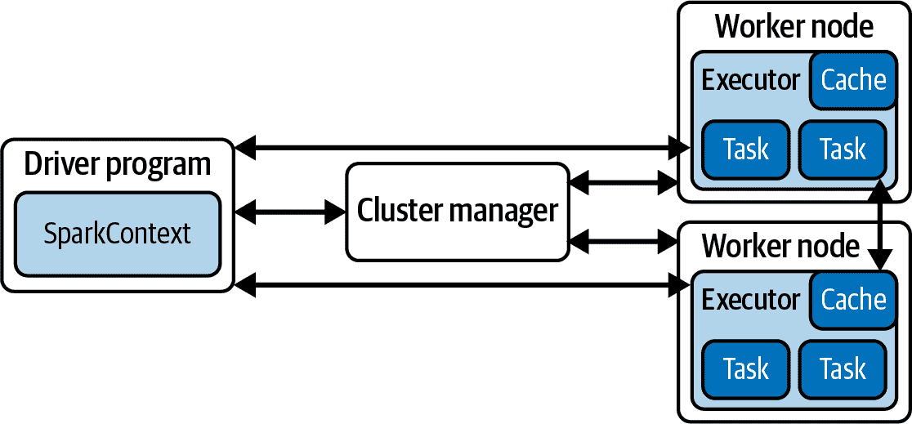
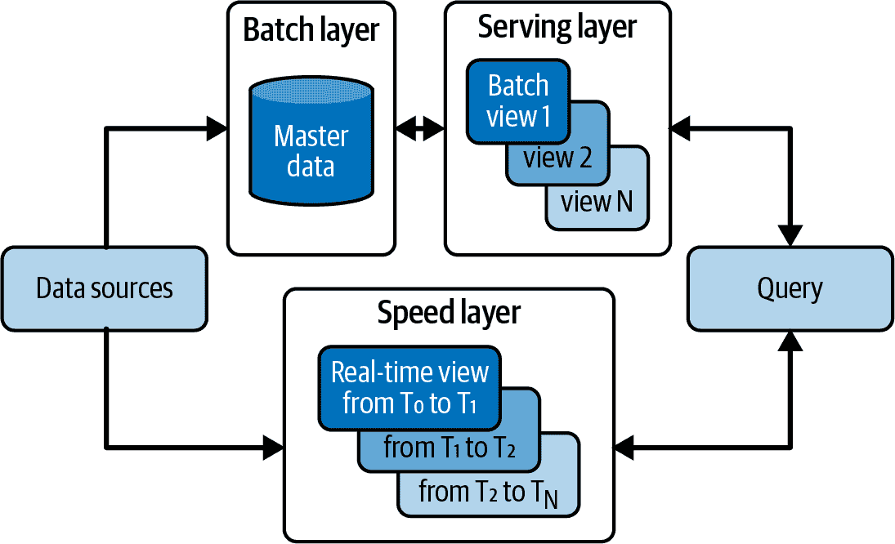
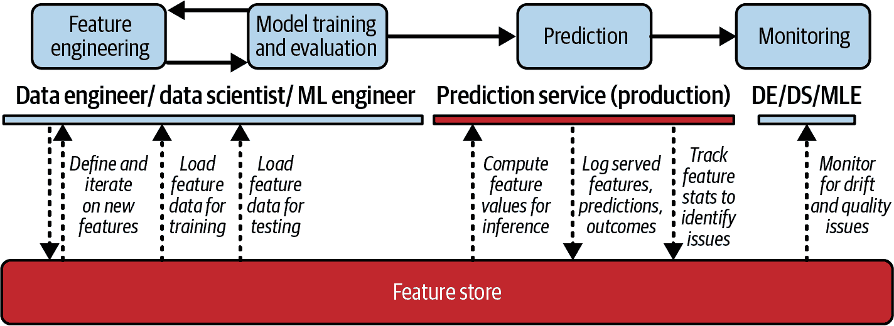

# 第六章 数据处理

在我们在第一章中定义的简单推荐器中，我们使用了`get_availability`方法；而在 MPIR 中，我们使用了`get_item_popularities`方法。我们希望这些命名选择能提供足够的上下文来说明它们的功能，但我们并未关注实现细节。现在我们将开始分解一些这种复杂性的细节，并呈现在线和离线收集工具集。

# 系统水合

将数据导入管道中幽默地称为*水合*。ML 和数据领域有很多与水相关的命名惯例；[《《(数据 ∩ 水) 术语》》](https://oreil.ly/XVlzd)由帕迪斯·努尔扎德涵盖了这个主题。

## PySpark

Spark 是一个非常通用的计算库，提供 Java、Python、SQL 和 Scala 的 API。PySpark 在许多 ML 流水线中用于数据处理和转换大规模数据集。

让我们回顾一下我们为推荐问题引入的数据结构；回想一下用户-物品矩阵是所有用户、物品及用户对物品评分的线性代数表示。这些三元组在野外并不自然存在。最常见的情况是，你从系统的日志文件开始；例如，Bookshop.org 可能有类似以下内容的东西：

```py
	'page_view_id': 'd15220a8e9a8e488162af3120b4396a9ca1',
	'anonymous_id': 'e455d516-3c08-4b6f-ab12-77f930e2661f',
	'view_tstamp': 2020-10-29 17:44:41+00:00,
	'page_url': 'https://bookshop.org/lists/best-sellers-of-the-week',
	'page_url_host': 'bookshop.org',
	'page_url_path': '/lists/bookshop-org-best-sellers-of-the-week',
	'page_title': 'Best Sellers of the Week',
	'page_url_query': None,
	'authenticated_user_id': 15822493.0,
	'url_report_id': 511629659.0,
	'is_profile_page': False,
	'product_viewed': 'list',
```

这是一个捏造的日志文件，它可能类似于 Bookshop.org 本周畅销书的后端数据。这些是你从工程部门获取的事件，并且很可能存储在你的列式数据库中。对于这样的数据，使用 SQL 语法将是我们的入口点。

PySpark 提供了一个方便的 SQL API。基于你的基础设施，这个 API 将允许你编写看起来像对大规模数据集的 SQL 查询。

# 示例架构

这些示例数据库架构仅仅是对 Bookshop.org 可能使用的猜测，但它们是基于作者多年来查看多家公司数百个数据库架构经验的建模。此外，我们试图将这些模式提炼到与我们主题相关的组件。在实际系统中，你会期望有更多的复杂性，但同样的基本部分。每个数据仓库和事件流都有其独特的特点。请咨询你附近的数据工程师。

让我们使用 Spark 查询前面的日志：

```py
user_item_view_counts_qry = """
SELECT
 page_views.authenticated_user_id
 , page_views.page_url_path
 , COUNT(DISTINCT page_views.page_view_id) AS count_views

FROM prod.page_views
JOIN prod.dim_users
 ON page_views.authenticated_user_id = dim_users.authenticated_user_id

WHERE DATE page_views.view_tstamp >= '2017-01-01'
 AND dim_users.country_code = 'US'

GROUP BY
 page_views.authenticated_user_id
 , page_views.page_url_path

ORDER BY 3, page_views.authenticated_user_id
"""

user_item_view_counts_sdf = spark.sql(user_item_view_counts_qry)
```

这是一个简单的 SQL 查询，假设前面的日志模式，它可以让我们看到每个用户-物品对被查看的次数。在这里纯粹使用 SQL 的便利性意味着我们可以利用我们在列式数据库上的经验快速上手 Spark。

然而，Spark 的主要优势尚未展现出来。在 Spark 会话中执行前述代码时，此查询不会立即运行。它将被准备好以执行，但 Spark 将等待直到您在下游使用此数据，并且需要*立即执行*时才开始执行。这被称为*惰性评估*，它允许您在不立即应用每个更改和交互的情况下操作数据对象。有关更多详细信息，请参阅像 [*Learning Spark*](https://www.oreilly.com/library/view/learning-spark-2nd/9781492050032/) 这样更深入的指南，由 Jules Damji 等人（O'Reilly）编写，但 Spark 范式的另一个重要特征值得讨论。

Spark 本质上是一种分布式计算语言。具体来说，这意味着即使在强制执行之后，前述查询仍将数据存储在多台计算机上。Spark 通过程序或笔记本中的*驱动程序*工作，该驱动程序驱动*集群管理器*，后者进一步协调*工作节点*上的*执行程序*。当我们使用 Spark 查询数据时，数据并非全部返回到我们使用的计算机上的内存中的 DataFrame 中，而是将部分数据发送到执行程序的内存中。当我们对 DataFrame 进行转换时，它将适用于存储在每个执行程序上的 DataFrame 片段。

如果这听起来有点像魔术，那是因为它在几个便利层后面隐藏了许多技术细节。Spark 是一种技术层，允许机器学习工程师编程时像在一台机器上工作一样，并使这些更改在整个机器群集上生效。在查询时理解网络结构并不重要，但如果出了问题，了解一些细节是很重要的；在故障排除时理解错误输出所指的内容至关重要。这一切都在 图 6-1 中总结，这是来自 [Spark 文档](https://oreil.ly/89kAm) 的一张图。



###### 图 6-1\. Spark 3.0 的组件架构

需要注意的是，这一切并非免费；惰性评估和分布式 DataFrame 需要在编写程序时额外思考。尽管 Spark 让许多工作变得更容易，但理解如何在这种范式中编写与体系结构兼容但仍能实现复杂目标的高效代码，可能需要一年的经验积累。

回到推荐系统，特别是离线收集器，我们希望使用 PySpark 构建训练模型所需的数据集。使用 PySpark 可以轻松将日志数据转换为训练模型所需的适当形式。在我们的简单查询中，我们对数据应用了一些过滤器，并按用户和项目分组以获取观看次数。许多其他任务可能自然而然地适合这种范例，例如添加存储在其他数据库中的用户或项目特征，或者进行高级聚合。

在我们的 MPIR 中，我们要求使用 `get_item_popularities`；我们有点假设了一些事情：

+   这将返回每个项目被选择的次数。

+   这种方法将会很快。

如果要实时调用终端节点，则第二点非常重要。那么 Spark 可能如何发挥作用呢？

首先，让我们假设我们有大量数据，足以使我们无法将其全部适应我们的小 MacBook Pro 的内存中。此外，让我们继续使用前面的架构。我们可以编写一个更简单的查询：

```py
item_popularity_qry = """
SELECT
 page_views.page_url_path
 , COUNT(DISTINCT page_views.authenticated_user_id) AS count_viewers

FROM prod.page_views
JOIN prod.dim_users
 ON page_views.authenticated_user_id = dim_users.authenticated_user_id

WHERE DATE page_views.view_tstamp >= '2017-01-01'
 AND dim_users.country_code = 'US'

GROUP BY
 page_views.page_url_path

ORDER BY 2
"""

item_view_counts_sdf = spark.sql(item_popularity_qry)
```

现在，我们可以将这个聚合的`(item, count)`对列表写入应用程序数据库以提供`get_item_popularities`（当调用时不需要我们进行任何解析），或者我们可以获取此列表的前<math alttext="upper N"><mi>N</mi></math>个子集，并将其存储在内存中，以根据特定排名获取最佳项目。无论哪种方式，我们都已经将解析所有日志数据和进行聚合的任务与实时调用中的`get_item_popularities`函数调用分离开来。

此示例使用了一个过于简单的数据聚合，可以在诸如 PostgreSQL 等数据库中轻松完成，那么为什么还要费这个劲呢？第一个原因是可伸缩性。Spark 真的是为水平扩展而构建的，这意味着随着我们需要访问的数据增长，我们只需添加更多的工作节点。

第二个原因是 PySpark 不仅仅是 SparkSQL；任何完成复杂 SQL 查询的人都可能同意 SQL 的强大和灵活性是巨大的，但是经常需要在完全 SQL 环境中执行一些你想要的任务需要很多创造力。PySpark 为您提供了 pandas DataFrames、Python 函数和类的所有表现力，以及将 Python 代码应用于 PySpark 数据结构的用户定义函数（UDFs）的简单接口。UDFs 类似于您在 pandas 中使用的 lambda 函数，但它们是为 PySpark DataFrames 构建和优化的。正如您在较小的数据范围内编写 ML 程序时可能遇到的情况一样，有一天您会从仅使用 SQL 切换到使用 pandas API 函数执行数据转换，同样您将欣赏到在 Spark 数据规模上拥有的这种功能。

PySpark 允许您编写看起来非常像 Python 和 pandas 代码的代码，并以分布式方式执行该代码！您不需要编写代码来指定应在哪些工作节点执行操作；PySpark 会为您处理这些工作。这个框架并不完美；一些您期望能够正常工作的事情可能需要一些小心，而且对代码的优化可能需要额外的抽象级别，但总的来说，PySpark 为您提供了一种快速将代码从一个节点移动到一个集群并利用该能力的方法。

为了在 PySpark 中更实用地说明一些内容，让我们回到协同过滤（CF）并计算一些更适合排名的特征。

## 示例：PySpark 中的用户相似度

用户相似度表允许您将用户映射到与推荐系统相关的其他用户。这提醒了一个假设，即两个相似的用户喜欢相似的事物，因此您可以向这两个用户推荐其中一个尚未看过的项目。构建这个用户相似度表是一个 PySpark 作业的示例，您可能会在离线收集器的职责范围内看到。尽管在许多情况下，评分将继续不断流入，但为了大型离线作业的目的，我们通常考虑每日批处理以更新我们模型的基本表。实际上，在许多情况下，这种每日批处理作业足以提供足够好的特性，以满足大多数 ML 工作的需求。其他重要的范例存在，但这些范例通常将更频繁的更新与这些每日批处理作业结合起来，而不是完全消除它们。

这种每日批处理作业与更小、更频繁的批处理作业的架构称为*lambda 架构*，我们将在稍后更详细地讨论如何以及为什么这样做。简言之，这两个层次——批处理和速度——通过它们处理数据的处理频率和每次运行的数据量（反向）进行区分。请注意，速度层可能具有与之关联的不同频率，并且可能会有不同的速度层，用于执行不同操作的小时和分钟频率作业。图 6-2 概述了架构。



###### 图 6-2\. Lambda 架构概览

在用户相似度的情况下，让我们着手实现一个计算每日表格的批处理作业。首先，我们需要从昨天之前的架构中获取评分。我们还将包括一些其他模拟这个查询在现实生活中可能看起来如何的过滤器：

```py
user_item_ratings_qry = """
SELECT
 book_ratings.book_id
 book_ratings.user_id
 , book_ratings.rating_value
 , book_ratings.rating_tstamp

FROM prod.book_ratings
JOIN prod.dim_users
 ON book_ratings.user_id = dim_users.user_id
JOIN prod.dim_books
 ON book_ratings.book_id = dim_books.dim_books

WHERE
 DATE book_ratings.rating_tstamp
 BETWEEN (DATE '2017-01-01')
 AND (CAST(current_timestamp() as DATE)
 AND book_ratings.rating_value IS NOT NULL
 AND dim_users.country_code = 'US'
 AND dim_books.book_active
"""

user_item_ratings_sdf = spark.sql(user_item_ratings_qry)
```

与以前一样，利用 SQL 语法将数据集导入 Spark DataFrame 是第一步，但现在我们在 PySpark 方面有更多的工作。一个常见的模式是通过简单的 SQL 语法和逻辑获取要处理的数据集，然后使用 PySpark API 进行更详细的数据处理。

首先，让我们观察一下，我们对用户-项目评分的唯一性没有任何假设。为了这个表格，让我们决定使用最近的评分对：

```py
from pyspark.sql.window import Window

windows = Window().partitionBy(
	['book_id', 'user_id']
).orderBy(
	col("rating_tstamp").desc()
)

user_item_ratings_sdf.withColumn(
	"current_rating",
	first(
		user_item_ratings_sdf("rating_tstamp")
	).over(windows).as("max_rating_tstamp")
).filter("rating_tstamp = max_rating_tstamp")
```

现在，我们将使用`current_rating`作为我们的评分列，用于下游计算。回顾之前我们基于评分定义的用户相似度：

<math alttext="normal upper U normal upper S normal i normal m Subscript upper A comma upper B Baseline equals StartFraction sigma-summation Underscript x element-of script upper R Subscript upper A comma upper B Baseline Endscripts left-parenthesis r Subscript upper A comma x Baseline minus r overbar Subscript upper A Baseline right-parenthesis left-parenthesis r Subscript upper B comma x Baseline minus r overbar Subscript upper B Baseline right-parenthesis Over StartRoot sigma-summation Underscript x element-of script upper R Subscript upper A comma upper B Baseline Endscripts left-parenthesis r Subscript upper A comma x Baseline minus r overbar Subscript upper A Baseline right-parenthesis squared EndRoot StartRoot sigma-summation Underscript x element-of script upper R Subscript upper A comma upper B Baseline Endscripts left-parenthesis r Subscript upper B comma x Baseline minus r overbar Subscript upper B Baseline right-parenthesis squared EndRoot EndFraction" display="block"><mrow><msub><mi>USim</mi> <mrow><mi>A</mi><mo>,</mo><mi>B</mi></mrow></msub> <mo>=</mo> <mfrac><mrow><msub><mo>∑</mo> <mrow><mi>x</mi><mo>∈</mo><msub><mi>ℛ</mi> <mrow><mi>A</mi><mo>,</mo><mi>B</mi></mrow></msub></mrow></msub> <mrow><mo>(</mo><msub><mi>r</mi> <mrow><mi>A</mi><mo>,</mo><mi>x</mi></mrow></msub> <mo>-</mo><msub><mover accent="true"><mi>r</mi> <mo>¯</mo></mover> <mi>A</mi></msub> <mo>)</mo></mrow><mrow><mo>(</mo><msub><mi>r</mi> <mrow><mi>B</mi><mo>,</mo><mi>x</mi></mrow></msub> <mo>-</mo><msub><mover accent="true"><mi>r</mi> <mo>¯</mo></mover> <mi>B</mi></msub> <mo>)</mo></mrow></mrow> <mrow><msqrt><mrow><msub><mo>∑</mo> <mrow><mi>x</mi><mo>∈</mo><msub><mi>ℛ</mi> <mrow><mi>A</mi><mo>,</mo><mi>B</mi></mrow></msub></mrow></msub> <msup><mrow><mo>(</mo><msub><mi>r</mi> <mrow><mi>A</mi><mo>,</mo><mi>x</mi></mrow></msub> <mo>-</mo><msub><mover accent="true"><mi>r</mi> <mo>¯</mo></mover> <mi>A</mi></msub> <mo>)</mo></mrow> <mn>2</mn></msup></mrow></msqrt> <msqrt><mrow><msub><mo>∑</mo> <mrow><mi>x</mi><mo>∈</mo><msub><mi>ℛ</mi> <mrow><mi>A</mi><mo>,</mo><mi>B</mi></mrow></msub></mrow></msub> <msup><mrow><mo>(</mo><msub><mi>r</mi> <mrow><mi>B</mi><mo>,</mo><mi>x</mi></mrow></msub> <mo>-</mo><msub><mover accent="true"><mi>r</mi> <mo>¯</mo></mover> <mi>B</mi></msub> <mo>)</mo></mrow> <mn>2</mn></msup></mrow></msqrt></mrow></mfrac></mrow></math>

我们需要的重要值如下：

<math alttext="r Subscript left-parenthesis minus comma minus right-parenthesis"><msub><mi>r</mi> <mrow><mo>(</mo><mo>-</mo><mo>,</mo><mo>-</mo><mo>)</mo></mrow></msub></math>

用户-项目对应的评分

<math alttext="r overbar Subscript left-parenthesis minus right-parenthesis"><msub><mover accent="true"><mi>r</mi> <mo>¯</mo></mover> <mrow><mo>(</mo><mo>-</mo><mo>)</mo></mrow></msub></math>

用户的所有项目的平均评分

行已经是<math alttext="r Subscript left-parenthesis minus comma minus right-parenthesis"><msub><mi>r</mi> <mrow><mo>(</mo><mo>-</mo><mo>,</mo><mo>-</mo><mo>)</mo></mrow></msub></math>值，所以让我们计算用户平均评分<math alttext="r overbar Subscript left-parenthesis minus right-parenthesis"><msub><mover accent="true"><mi>r</mi> <mo>¯</mo></mover> <mrow><mo>(</mo><mo>-</mo><mo>)</mo></mrow></msub></math>和评分偏差：

```py
from pyspark.sql.window import Window
from pyspark.sql import functions as F

user_partition = Window.partitionBy('user_id')

user_item_ratings_sdf = user_item_ratings_sdf.withColumn(
	"user_average_rating",
	F.avg("current_rating").over(user_partition)
)

user_item_ratings_sdf = user_item_ratings_sdf.withColumn(
	"rating_deviation_from_user_mean",
	F.col("current_rating") - F.col("user_average_rating")
)
```

现在我们的模式应该如下所示（我们对其进行了比默认 Spark 输出稍微优化的格式化）：

```py
+-------+-------+------------+-------------+
|book_id|user_id|rating_value|rating_tstamp|
+-------+-------+------------+-------------+
+-------------+-------------------+-------------------------------+
current_rating|user_average_rating|rating_deviation_from_user_mean|
+-------------+-------------------+-------------------------------+
```

让我们完成创建一个包含我们用户相似度计算的数据集：

```py
user_pair_item_rating_deviations = user_item_ratings_sdf.alias("left_ratings")
.join(user_item_ratings_sdf.alias("right_ratings"),
  (
F.col("left_ratings.book_id") == F.col("right_ratings.book_id") &\
F.col("left_ratings.user_id") != F.col("right_ratings.user_id")
	),
	"inner"
).select(
	F.col("left_ratings.book_id"),
	F.col("left_ratings.user_id").alias("user_id_1"),
	F.col("right_ratings.user_id").alias("user_id_2"),
  F.col("left_ratings.rating_deviation_from_user_mean").alias("dev_1"),
  F.col("right_ratings.rating_deviation_from_user_mean").alias("dev_2")
).withColumn(
	'dev_product',
	F.col("dev_1")*F.col("dev_2")
)

user_similarities_sdf = user_pair_item_rating_deviations.groupBy(
	"user_id_1", "user_id_2"
).agg(
	sum('dev_product').alias("dev_product_sum"),
	sum(F.pow(F.col("dev_1"),2)).alias("sum_of_sqrd_devs_1"),
	sum(F.pow(F.col("dev_2"),2)).alias("sum_of_sqrd_devs_2")
).withColumn(
	"user_similarity",
	(
		F.col("dev_product_sum") / (
			F.sqrt(F.col("sum_of_sqrd_devs_2")) *
			F.sqrt(F.col("sum_of_sqrd_devs_2"))
		)
	)
)
```

在构建这个数据集时，我们首先进行自连接，避免将相同用户与自身匹配，而是根据匹配的书籍进行连接。在进行此连接时，我们使用之前计算得出的用户平均评分偏差值。同时，我们利用这个机会将它们相乘，作为用户相似度函数中的分子。在最后一步，我们再次使用`groupBy`，以便对所有匹配的书籍 ID（通过对`user_id_1`和`user_id_2`进行`groupBy`）进行求和；我们对每组偏差值的产品和幂进行求和，以便最终进行除法，并生成新的用户相似度列。

尽管这个计算并不特别复杂，但让我们注意一些我们可能会欣赏的事情。首先，我们从记录中完整构建了用户相似度矩阵。现在可以将这个矩阵存储在更快的访问格式中，因此如果我们希望进行实时操作，它已经准备好了。其次，我们在 Spark 中完成了所有这些数据转换，因此可以在大数据集上运行这些操作，并让 Spark 处理并行化到集群上。我们甚至能够编写类似于 pandas 和 SQL 的代码。最后，所有我们的操作都是基于列的，不需要迭代计算。这意味着这段代码将比某些其他方法更好地扩展。这还确保了 Spark 能够很好地并行化我们的代码，并且我们可以期望良好的性能。

我们已经看到了 PySpark 如何用于准备我们的用户相似度矩阵。我们有这样一个定义的亲和力，用于评估一个项目对于用户的适宜性；我们可以将这些分数收集到一个表格中——用户行和项目列——以生成一个矩阵。作为一项练习，你能否拿这个矩阵并生成亲和力矩阵？

<math alttext="normal upper A normal f normal f Subscript upper A comma i Baseline equals r overbar Subscript upper A Baseline plus StartFraction sigma-summation Underscript upper U element-of script upper N left-parenthesis upper A right-parenthesis Endscripts normal upper U normal upper S normal i normal m Subscript upper A comma upper U Baseline asterisk left-parenthesis r Subscript upper U comma i Baseline minus r overbar Subscript upper A Baseline right-parenthesis Over sigma-summation Underscript upper U element-of script upper N left-parenthesis upper A right-parenthesis Endscripts normal upper U normal upper S normal i normal m Subscript upper A comma upper U Baseline EndFraction" display="block"><mrow><msub><mi>Aff</mi> <mrow><mi>A</mi><mo>,</mo><mi>i</mi></mrow></msub> <mo>=</mo> <msub><mover accent="true"><mi>r</mi> <mo>¯</mo></mover> <mi>A</mi></msub> <mo>+</mo> <mfrac><mrow><msub><mo>∑</mo> <mrow><mi>U</mi><mo>∈</mo><mi>𝒩</mi><mo>(</mo><mi>A</mi><mo>)</mo></mrow></msub> <msub><mi>USim</mi> <mrow><mi>A</mi><mo>,</mo><mi>U</mi></mrow></msub> <mo>*</mo><mrow><mo>(</mo><msub><mi>r</mi> <mrow><mi>U</mi><mo>,</mo><mi>i</mi></mrow></msub> <mo>-</mo><msub><mover accent="true"><mi>r</mi> <mo>¯</mo></mover> <mi>A</mi></msub> <mo>)</mo></mrow></mrow> <mrow><msub><mo>∑</mo> <mrow><mi>U</mi><mo>∈</mo><mi>𝒩</mi><mo>(</mo><mi>A</mi><mo>)</mo></mrow></msub> <msub><mi>USim</mi> <mrow><mi>A</mi><mo>,</mo><mi>U</mi></mrow></msub></mrow></mfrac></mrow></math>

请随意假设<math alttext="script upper N left-parenthesis upper A right-parenthesis"><mrow><mi>𝒩</mi> <mo>(</mo> <mi>A</mi> <mo>)</mo></mrow></math>只是关于用户相似性的<math alttext="upper A"><mi>A</mi></math>的五个最近邻。

## 数据加载器

数据加载器是源自 PyTorch 的编程范式，但已经在其他梯度优化的 ML 工作流中得到了应用。随着我们开始将基于梯度的学习整合到我们的推荐系统架构中，我们将在 MLOps 工具中面临挑战。第一个与训练数据大小和可用内存有关。数据加载器是一种指定数据如何被批处理并有效地发送到训练循环中的方式；随着数据集变大，这些训练集的谨慎调度可能会对学习产生重大影响。但为什么我们必须考虑数据的*批次*？那是因为我们将使用一种适用于大量数据的梯度下降的变体。

首先，让我们回顾一下*小批量梯度下降*的基础知识。在通过梯度下降进行训练期间，我们对训练样本进行前向传播，得出预测结果，然后通过我们的模型计算错误和适当的梯度向后传播以更新参数。批量梯度下降在单次传递中获取所有数据以计算训练集的梯度并将其传回；这意味着您在内存中拥有整个训练数据集。随着数据集的扩大，这从昂贵到不可能；为了避免这种情况，我们可以只计算一次数据集的一部分的损失函数的梯度。这种最简单的范式称为*随机梯度下降*（SGD），它逐个样本计算这些梯度和参数更新。小批量版本执行我们的批量梯度下降，但是在一系列子集上进行，以形成数据集的分区。在数学表示中，我们根据较小的批次编写更新规则：

<math alttext="theta equals theta minus eta asterisk nabla Subscript theta Baseline upper J left-parenthesis theta semicolon x Superscript left-parenthesis i colon i plus n right-parenthesis Baseline semicolon y Superscript left-parenthesis i colon i plus n right-parenthesis Baseline right-parenthesis" display="block"><mrow><mi>θ</mi> <mo>=</mo> <mi>θ</mi> <mo>-</mo> <mi>η</mi> <mo>*</mo> <msub><mi>∇</mi> <mi>θ</mi></msub> <mi>J</mi> <mfenced close=")" open="(" separators=""><mi>θ</mi> <mo>;</mo> <msup><mi>x</mi> <mrow><mo>(</mo><mi>i</mi><mo>:</mo><mi>i</mi><mo>+</mo><mi>n</mi><mo>)</mo></mrow></msup> <mo>;</mo> <msup><mi>y</mi> <mrow><mo>(</mo><mi>i</mi><mo>:</mo><mi>i</mi><mo>+</mo><mi>n</mi><mo>)</mo></mrow></msup></mfenced></mrow></math>

这种优化有几个目的。首先，在这些步骤期间，它仅需要可能很小的数据子集保存在内存中。其次，它比 SGD 中的纯迭代版本需要的传递要少得多。第三，对这些小批量的梯度操作可以组织为雅可比矩阵，因此我们有可能高度优化的线性代数运算。

# 雅可比矩阵

数学概念中的雅可比矩阵最简单的意义是一种用于一组具有相关索引的向量导数的组织工具。您可能还记得，对于多个变量的函数，您可以相对于每个变量进行导数计算。对于单个多变量标量函数，雅可比矩阵简单地是该函数的一阶导数的行向量——恰好是梯度的转置。

这是最简单的情况；多变量标量函数的梯度可以写成雅可比矩阵。然而，一旦我们有了（向量）导数的向量，我们可以将其写成矩阵；这里的实用性实际上只在于符号，虽然如此。当您将一系列多变量标量函数收集成函数向量时，相关的梯度向量是导数的向量。这称为 *雅可比矩阵*，它将梯度推广到矢量值函数。正如您可能已经意识到的那样，神经网络层是希望进行导数推导的矢量值函数的绝佳来源。

如果您确信小批量很有用，现在是讨论 *DataLoaders* 的时候了——这是一个简单的 PyTorch API，用于从大型数据集中提取小批量。DataLoader 的关键参数包括 `batch_size`、`shuffle` 和 `num_workers`。批次大小很容易理解：每个批次中包含的样本数量（通常是数据集总大小的整数因子）。通常会对这些批次应用随机顺序操作；这旨在提高模型的稳健性。最后，`num_workers` 是用于 CPU 批次生成的并行化参数。

DataLoader 的效用最好通过演示来理解：

```py
params = {
         'batch_size': _,
         'shuffle': _,
         'num_workers': _
}

training_generator = torch.utils.data.DataLoader(training_set, params)

validation_generator = torch.utils.data.DataLoader(validation_set, params)

// Loop over epochs
for epoch in range(max_epochs):
    // Training
    for local_batch, local_labels in training_generator:

        // Model computations
        [...]

    // Validation
    with torch.set_grad_enabled(False):
        for local_batch, local_labels in validation_generator:

            // Model computations
            [...]
```

代码中的第一个重要细节是，它的任何生成器都将从您的总数据集中读取小批量，并可以指示并行加载这些批次。还要注意，模型计算中的任何差分步骤现在将在这些小批量上运行。

容易认为 DataLoaders 只是用于提高代码清洁度的工具（诚然，它确实改进了），但重要的是不要低估批次顺序、并行化和形状控制对模型训练的重要性。最后，您的代码结构现在看起来像是批量梯度下降，但它利用了小批量，进一步暴露了代码实际执行的内容而非所需步骤。

## 数据库快照

让我们通过远离这些高级技术来结束这一部分，讨论一些重要而经典的事情：对生产数据库进行快照。

极有可能的情况是，建立推荐服务器的工程师们（可能还包括您）正在将其日志和其他应用程序数据写入 SQL 数据库。很可能，这种数据库架构和部署是针对应用程序跨其最常见使用情况进行快速查询进行了优化。正如我们讨论过的那样，这些日志可能处于事件样式架构中，还有其他可能需要聚合和汇总以得出任何意义的表格。例如，*当前库存* 表可能需要了解每天开始的库存，然后聚合一系列购买事件列表。

总的来说，生产 SQL 数据库通常是针对特定用途设计的堆栈中的关键组件。作为这些数据的下游消费者，您可能希望拥有不同的模式，对这些数据库有大量的访问，并对这些数据执行重要的操作。最常见的范式是*数据库快照*。快照是由各种 SQL 版本提供的功能，用于高效地创建数据库的克隆。虽然快照可以采用各种形式，但让我们专注于一些简化系统并确保其具备所需数据的方式：

+   每日表快照可能与`as_of`字段相关联，或者*这个表在这一天的状态*。

+   每日表快照可能受时间限制，只能查看*今天新增了哪些记录*。

+   事件表快照可用于将一组事件馈送到像 Segment 这样的事件流处理器（请注意，您也可以设置像 Kafka 这样的实时事件流）。

+   每小时汇总的表可用于状态记录或监视。

一般而言，范式通常是操作下游数据处理的快照。我们前面提到的许多数据处理种类，如计算用户相似性，都是可能需要大量数据读取的操作。*重要的是不要构建需要在生产数据库上进行大量查询的 ML 应用程序*，因为这样做可能会降低应用程序的性能，并导致用户体验变慢。这种降低将会损害推荐系统可能实现的改进。

一旦您对感兴趣的表进行了快照，通常可以找到一系列数据管道，有助于将数据转换为更具体的表格，存放在*数据仓库*中（您应该在这里完成大部分工作）。像 Dagster、dbt、Apache Airflow、Argo 和 Luigi 这样的工具是流行的数据管道和工作流编排工具，用于提取、转换和加载（ETL）操作。

# 用于学习和推断的数据结构

本节介绍了三种重要的数据结构，这些结构将使我们的推荐系统能够快速执行复杂操作。每种结构的目标是尽可能少地牺牲精度，同时加速对实时数据的访问。正如您将看到的，这些数据结构构成了实时推断管道的核心，并尽可能精确地近似了批处理管道的运行过程。

这三种数据结构如下：

+   向量搜索/ANN 索引

+   布隆过滤器用于候选过滤

+   特征存储

到目前为止，我们已经讨论了在系统中使数据流动所必需的组件。这些帮助组织数据，使其在学习和推断过程中更易于访问。此外，我们还将找到一些快捷方式来加速检索过程中的推断。向量搜索将允许我们在规模上识别相似的项目。布隆过滤器将允许我们快速评估许多排除结果的标准。特征存储将为我们提供有关用户的推荐推断所需的必要数据。

## 向量搜索

就理解这些实体之间的关系而言，我们已经讨论了用户相似性和项目相似性，但我们还没有谈论这些过程的任何*加速结构*。

首先让我们讨论一些术语；如果我们将表示具有由距离函数提供的相似度度量的实体的向量集合视为一个*潜空间*。简单的目标是利用我们的潜空间及其相关的相似度度量（或补充距离度量），以便能够快速检索*相似的*项目。在我们以前的相似性示例中，我们谈到了用户邻域及其如何被利用来建立用户与未见项目之间的亲和分数。但是你如何找到这个邻域呢？

要理解这一点，请回想一下我们定义了一个元素<math alttext="x"><mi>x</mi></math>的邻域，写成<math alttext="script upper N left-parenthesis x right-parenthesis"><mrow><mi>𝒩</mi> <mo>(</mo> <mi>x</mi> <mo>)</mo></mrow></math>，作为潜空间中与最大相似度的<math alttext="k"><mi>k</mi></math>个元素的集合；或者换句话说，项目相似性样本的<math alttext="j"><mi>j</mi></math>阶统计的集合小于或等于<math alttext="k"><mi>k</mi></math>。这些*<math alttext="k"><mi>k</mi></math> -最近邻居*，通常被称为，将用作被视为与<math alttext="x"><mi>x</mi></math>相似的元素集合。

从 CF 得出的这些向量还产生了一些其他有用的副作用：

+   一个简单的推荐系统，从用户邻域的喜欢项目中随机抽取未见项目

+   关于用户特征的预测，从邻域中已知用户的已知特征

+   通过口味相似性进行用户分割

那么我们如何加速这些过程呢？这个领域的第一个重大改进之一来自倒排索引。利用倒排索引的核心是在查询的标记之间（用于基于文本的搜索）和候选项之间谨慎地构建一个大哈希。

这种方法非常适合像句子或小词典集合这样的可标记化实体。由于能够查找与查询共享一个或多个标记的项目，您甚至可以使用一般的潜在嵌入来按相似性对候选响应进行排名。随着规模化，这种方法值得额外考虑：它会产生速度成本，因为它需要两个步骤，并且因为相似性分布可能与返回比我们需要的更多候选者所需的标记相似性不相关。

构建搜索系统的经典方法基于大型查找表，并具有确定性的感觉。随着我们转向 ANN 查找，我们希望放松一些强大的确定性行为，并引入能够“修剪”这些大索引的数据结构的假设。与仅为元素的可标记化组件构建索引不同，您可以预先计算*k*-d 树并使用索引作为索引。 *k*-d 树将以批处理过程预计算最近邻居（这可能很慢），以填充用于快速查找的前*k*个响应。 *k*-d 树是一种有效的数据结构，用于编码前述邻域，但在更高维度中读取时已众所周知较慢。然而，使用它们来构建倒排索引可以带来很大的改进。

最近，明确使用向量数据库进行向量搜索变得越来越可能和可行。Elasticsearch 已添加了这一功能；[Faiss](https://oreil.ly/AZ-Ai)是一个 Python 库，可以帮助您在系统中实现此功能；[Pinecone](https://oreil.ly/LSaos)是一种专门针对此目标的向量数据库系统；而[Weaviate](https://oreil.ly/Z6la_)是一种本地向量数据库架构，允许您在前述基于标记的倒排索引和向量相似性搜索之上构建层。

## 近似最近邻

这个元素的*k*个最近邻是什么？令人惊讶的是，近似最近邻（ANN）与实际最近邻相比可以达到非常高的准确性，并且通过令人眼花缭乱的加速技术更快地到达那里。对于这些问题，您经常对近似解决方案感到满意。

专门处理这些近似值的开源库之一是[PyNNDescent](https://oreil.ly/i5LyM)，它通过优化的实现和精心设计的数学技巧实现了巧妙的加速。使用 ANN，您可以采用如下讨论的两种策略：

+   可以显著改善预索引。

+   在没有预先索引选项的查询中，您仍可以期望良好的性能。

在实践中，这些相似性查找对于使您的应用程序实际工作非常重要。虽然我们大多数时候都在讨论已知项目目录的推荐，但我们不能在其他推荐上下文中做出这种假设。这些上下文包括以下内容：

+   基于查询的推荐（如搜索）

+   上下文推荐

+   冷启动新项目

当我们深入研究相似性和最近邻时，你会越来越多地看到这些参考，每当这些时刻到来时，请想一想：“我知道如何使这个过程变得快速！”

## 布隆过滤器

*布隆过滤器*是一种概率数据结构，允许我们非常高效地测试集合的包含性，但有一个缺点：集合的排除是确定的，但集合的包含是概率性的。*实际上，这意味着询问“<math alttext="x"><mi>x</mi></math>是否在这个集合中”永远不会产生假阴性，但可能会产生假阳性！* 请注意，这种类型-I 错误随着布隆大小的增加而增加。

通过向量搜索，我们已经确定了用户的大量潜在推荐项目。从这些项目中，我们需要立即进行一些排除。最明显的高级过滤类型是删除*用户以前没有显示兴趣或已经购买的商品*。你可能经历过被反复推荐同一件商品的经历，然后想：“我不想要这个，请别再给我看了。”通过我们介绍的简单协同过滤模型，你现在可能会明白为什么会出现这种情况。

系统已经通过 CF 识别出了一组更有可能被你选择的项目。在没有任何外部影响的情况下，这些计算将继续返回相同的结果，你将永远无法摆脱这些推荐。作为系统设计师，你可以从一个启发式开始：

> 如果用户看到这个推荐的商品三次都没有点击，我们就不再向他们展示了。

这是一种完全合理的策略，旨在改善你推荐系统中的*新鲜度*（确保用户看到新项目推荐的想法）。虽然这是改善推荐的简单策略，但你如何在规模上实现它呢？

通过定义以下的集合，可以使用布隆过滤器：“这个用户看到这个推荐的商品三次但从未点击过吗？”布隆过滤器的一个注意事项是它们仅能进行添加操作：一旦某物被加入布隆中，就无法将其移除。当观察这种启发式的二进制状态时，这并不是一个问题。

让我们构建一个用户-商品 ID，用作我们在布隆中的哈希。请记住，布隆过滤器的关键特性是快速确定哈希后的项目是否在布隆中。当我们观察到满足上述标准的用户-商品对时，请将该对作为 ID 并进行哈希。现在，由于可以从用户的项目列表中轻松重建这个哈希对，我们有了一种非常快速的过滤方式。

让我们讨论一下这个话题的一些技术细节。首先，你可能希望进行各种类型的过滤 —— 也许新鲜度是其中之一，另一个可能是用户已经购买的商品，第三个可能是排除已售罄的商品。

在这里，独立实施每个过滤器将是很好的；前两个可以像以前一样遵循我们的用户-商品 ID 哈希，第三个可以仅对商品 ID 进行哈希。

另一个考虑因素是填充布隆过滤器。最佳实践是在离线批处理作业期间从数据库构建这些布隆过滤器。无论您的批处理训练按什么时间表运行，都要从记录存储重新构建布隆过滤器，以确保保持布隆过滤器的准确性。请记住，布隆过滤器不允许删除，因此在前面的示例中，如果某个项目从售罄状态变为补货状态，您的批量刷新操作可以重新捕捉其可用性。在批量重新训练之间，向布隆过滤器添加内容也非常高效，因此您可以在实时过滤需要考虑的更多数据时继续向布隆过滤器添加内容。但务必将这些事务记录到表中！当您想要刷新时，这些日志记录将非常重要。

## 有趣的一点：布隆过滤器作为推荐系统

布隆过滤器不仅提供了一种有效的方式来根据包含条件消除某些推荐，而且还可以用来执行推荐本身！特别是，Manuel Pozo 等人在 [“An Item/User Representation for Recommender Systems Based on Bloom Filters”](https://oreil.ly/VsvN2) 中指出，对于具有高维特征集和大量稀疏性的推荐系统（正如我们在 第三章 中讨论的那样），布隆过滤器所做的哈希类型可以帮助克服定义良好相似性函数的关键挑战！

让我们观察到，通过布隆过滤器数据结构，我们可以对集合执行两种自然操作。首先，考虑两个集合 <math alttext="upper A"><mi>A</mi></math> 和 <math alttext="upper B"><mi>B</mi></math>，并为它们关联布隆过滤器 <math alttext="script upper B script upper F Subscript upper A"><msub><mi>ℬℱ</mi> <mi>A</mi></msub></math> 和 <math alttext="script upper B script upper F Subscript upper B"><msub><mi>ℬℱ</mi> <mi>B</mi></msub></math>。那么 <math alttext="upper A intersection upper B"><mrow><mi>A</mi> <mo>∩</mo> <mi>B</mi></mrow></math> 的定义是什么？我们能为这个交集设计一个布隆过滤器吗？当然可以！回想一下，我们的布隆过滤器保证能告诉我们元素不在集合中，但如果元素在集合中，则布隆过滤器只能以一定的概率回应。在这种情况下，我们只需查找根据 <math alttext="script upper B script upper F Subscript upper A"><msub><mi>ℬℱ</mi> <mi>A</mi></msub></math> 和 <math alttext="script upper B script upper F Subscript upper B"><msub><mi>ℬℱ</mi> <mi>B</mi></msub></math> 声明为“在”的元素。当然，每个集合返回的“在”元素集合都比实际集合更大（即 <math alttext="upper A subset-of script upper B script upper F Subscript upper A"><mrow><mi>A</mi> <mo>⊂</mo> <msub><mi>ℬℱ</mi> <mi>A</mi></msub></mrow></math> ），因此交集也会更大。

<math alttext="upper A intersection upper B subset-of script upper B script upper F Subscript upper A intersection script upper B script upper F Subscript upper B" display="block"><mrow><mi>A</mi> <mo>∩</mo> <mi>B</mi> <mo>⊂</mo> <msub><mi>ℬℱ</mi> <mi>A</mi></msub> <mo>∩</mo> <msub><mi>ℬℱ</mi> <mi>B</mi></msub></mrow></math>

请注意，您可以通过有关哈希函数选择的信息计算基数的确切差异。还请注意，方程式是滥用符号的，通过将<math alttext="script upper B script upper F Subscript upper A"><msub><mi>ℬℱ</mi> <mi>A</mi></msub></math>称为对应于<math alttext="upper A"><mi>A</mi></math>的布隆过滤器返回的事物集。

其次，我们还需要构建联合。通过考虑根据<math alttext="script upper B script upper F Subscript upper A"><msub><mi>ℬℱ</mi> <mi>A</mi></msub></math> *OR* *in*根据<math alttext="script upper B script upper F Subscript upper B"><msub><mi>ℬℱ</mi> <mi>B</mi></msub></math>。因此，类似地：

<math alttext="upper A union upper B subset-of script upper B script upper F Subscript upper A union script upper B script upper F Subscript upper B" display="block"><mrow><mi>A</mi> <mo>∪</mo> <mi>B</mi> <mo>⊂</mo> <msub><mi>ℬℱ</mi> <mi>A</mi></msub> <mo>∪</mo> <msub><mi>ℬℱ</mi> <mi>B</mi></msub></mrow></math>

现在，如果我们将项目<math alttext="upper X"><mi>X</mi></math>和<math alttext="upper Y"><mi>Y</mi></math>作为可能具有许多特征的串联向量，并对这些串联特征进行哈希处理，我们将它们表示为我们的布隆的位向量。我们之前看到两个布隆的交集是有意义的，事实上等价于它们的布隆表示的位*AND*。这意味着两个项目的特征相似性可以通过它们的布隆哈希的位*and*相似性来表示：

<math alttext="normal s normal i normal m left-parenthesis upper X comma upper Y right-parenthesis equals StartAbsoluteValue script upper B script upper F left-parenthesis upper X right-parenthesis intersection script upper B script upper F left-parenthesis upper Y right-parenthesis EndAbsoluteValue equals script upper B script upper F left-parenthesis upper X right-parenthesis asterisk Subscript normal b normal i normal t normal w normal i normal s normal e Baseline script upper B script upper F left-parenthesis upper X right-parenthesis" display="block"><mrow><mi>sim</mi> <mrow><mo>(</mo> <mi>X</mi> <mo>,</mo> <mi>Y</mi> <mo>)</mo></mrow> <mo>=</mo> <mrow><mo>|</mo> <mi>ℬℱ</mi> <mrow><mo>(</mo> <mi>X</mi> <mo>)</mo></mrow> <mo>∩</mo> <mi>ℬℱ</mi> <mrow><mo>(</mo> <mi>Y</mi> <mo>)</mo></mrow> <mo>|</mo></mrow> <mo>=</mo> <mi>ℬℱ</mi> <mrow><mo>(</mo> <mi>X</mi> <mo>)</mo></mrow> <msub><mo>*</mo> <mi>bitwise</mi></msub> <mi>ℬℱ</mi> <mrow><mo>(</mo> <mi>X</mi> <mo>)</mo></mrow></mrow></math>

对于静态数据集，这种方法具有真正的优势，包括速度、可伸缩性和性能。限制因素基于各种特征以及改变可能项目集的能力。稍后我们将讨论*局部敏感哈希*，它进一步迭代查找速度，并降低在高维空间中碰撞风险，一些类似的想法也将重新出现。

## 特征存储

到目前为止，我们专注于我们可能称为*纯协同过滤*的推荐系统。我们只在试图做出好的推荐时使用了用户或项目相似性数据。如果您一直在想，“嘿，实际用户和项目的信息呢？”您现在将满足您的好奇心。

除了以前的 CF 方法外，您可能对特征感兴趣的原因有很多。让我们列举一些高级别的关注点：

+   您可能希望首先向新用户展示特定的一组项目。

+   您可能希望在推荐中考虑地理边界。

+   区分儿童和成年人可能对给予的推荐类型很重要。

+   项目特征可用于确保推荐中的高级别多样性（更多内容请参见第十五章）。

+   用户特征可以启用各种类型的实验测试。

+   项目特征可用于将项目分组为上下文推荐的集合（更多内容请参见第十五章）。

除了这些问题，另一种重要的特征通常是必不可少的：实时特征。虽然特征存储的目的是提供对所有必要特征的实时访问，但值得注意的是要区分那些变化不频繁的稳定特征和我们预计会经常变化的实时特征。

一些实时特征存储的重要示例包括动态价格、当前商品可用性、*趋势*状态、愿望清单状态等。这些特征可能会在一天之中发生变化，我们希望通过其他服务和系统的实时方式对特征存储中的值进行可变更。因此，实时特征存储将需要提供 API 访问以进行特征的变更。这是你可能不想为*稳定*特征提供的功能。

当我们设计我们的特征存储时，我们可能希望稳定的特征通过数据仓库表格通过 ETL 和转换构建，并且我们可能也希望实时特征以相同的方式构建，但是在更快的时间表上或允许 API 访问进行变更。无论哪种情况，特征存储的关键质量是*非常快的读取访问*。通常建议为离线模型训练单独构建特征存储，以便在测试中构建以确保支持新模型。

那么架构和实施可能是什么样子呢？参见图 6-3。



###### 图 6-3\. 特征存储的演示

设计特征存储涉及设计管道，定义并将特征*转换到该存储中*（通过像 Airflow、Luigi、Argo 等协调的方式），并且通常看起来类似于构建我们收集器使用的数据管道类型。特征存储需要考虑的一个额外复杂因素是速度层。在本章早些时候讨论的 Lambda 架构中，我们提到可以将批量数据处理用于收集器，并为中间更新提供更快的速度层，但是对于特征存储来说，这更为重要。特征存储可能还需要一个*流处理层*。这一层操作于连续的数据流，并可以对这些数据进行数据转换；然后实时将适当的输出写入在线特征存储。这增加了复杂性，因为流数据的数据转换提出了一组非常不同的挑战，并且通常需要不同的算法策略。在这方面有帮助的一些技术包括 Spark Streaming 和 Kinesis。您还需要配置系统以正确处理数据流，其中最常见的是 Kafka。数据流处理层涉及许多组件和架构考虑因素，这超出了我们的范围；如果您考虑开始使用 Kafka，请查看[*Kafka：权威指南*](https://www.oreilly.com/library/view/kafka-the-definitive/9781492043072/)（Gwen Shapira 等人编著，O’Reilly）。

特征存储还需要一个*存储层*；这里有许多方法，但在在线特征存储中使用 NoSQL 数据库是常见的。原因是检索更快和数据存储的性质。推荐系统的特征存储往往是非常基于键的（例如，*获取此用户的特征*或*获取此项的特征*），这很适合键值存储。这里的一些示例技术包括 DynamoDB、Redis 和 Cassandra。离线特征存储的存储层可能只是 SQL 样式数据库，以减少复杂性，但这样做会在离线和在线之间产生差异。这种差异和其他类似的称为[*训练-服务偏差*](https://oreil.ly/IcE1R)。

特征存储的一个独特但至关重要的方面是*注册表*。注册表对于特征存储非常有用，因为它协调了现有特征及其定义方式的信息。一个更复杂的注册表实例还包括输入和输出的模式和类型，并且有分布预期。这些是数据管道必须遵守和满足的合同，以避免在特征存储中填充垃圾数据。此外，注册表的定义允许并行的数据科学家和 ML 工程师开发新特征，共享彼此的特征，并通常了解模型可能使用的特征假设。

这些注册表的一个重要优势是它们激励团队和开发人员之间的对齐。特别是，如果你决定关注用户的*国家*，并在注册表中看到一个名为*国家*的特征，你更有可能使用它（或者询问负责此特征的开发人员），而不是从头开始创建一个新的。实际上，数据科学家在定义模型时会做出数百个小决策和假设，这减轻了依赖现有资源的负担。

# 模型注册表

与特征注册表密切相关的概念是模型注册表。这些概念有很多共同点，但我们提醒您以不同的方式思考它们。一个优秀的模型注册表可以对模型的输入和输出有类型合同，并且可以提供与对齐和清晰度相关的许多相同的好处。特征注册表应该真正关注业务逻辑和特征的定义。因为特征工程也可以是模型驱动的，清楚地表达这两者之间的差异可能是具有挑战性的，因此总结起来，我们将专注于它们的作用：模型注册表关注于 ML 模型和相关的元数据，而特征注册表关注于模型将使用的特征。

最后，我们需要讨论如何*提供*这些特征。通过合适高效的存储层支持，我们需要通过 API 请求提供必要的特征向量。这些特征向量包括模型在提供推荐时需要的用户详细信息，例如用户的位置或内容的年龄限制。API 可以返回指定键的全部特征集，或者更具体的规定。通常，响应以 JSON 序列化形式进行快速数据传输。重要的是，所提供的特征应是*最新的特征集*，并且此处的延迟预计应小于 100 毫秒，以满足更严肃的工业应用需求。

在离线训练中的一个重要注意事项是，这些特征存储需要适应*时间旅行*。因为在训练期间，我们的目标是以*最具普遍性的方式*提供模型所需的数据，因此在训练模型时，关键是不让其访问超出时间范围的特征。这被称为*数据泄漏*，可能导致训练和生产中性能出现严重偏差。因此，离线训练的特征存储必须具备对历史时间段内特征的知识，以便在训练期间提供时间索引，以获取那时的特征。这些`as_of`键可以与历史训练数据关联，就像*重放*用户-项目交互历史一样。

有了这些基础设施，并伴随着这个系统所需的重要监控，您将能够向模型提供离线和在线特征。在第三部分，您将看到利用这些特征的模型架构。

# 总结

我们不仅讨论了为了滋养您的系统和提供推荐所必需的关键组件，还探讨了使这些组件成为现实所需的一些工程基础构件。配备了数据加载器、嵌入、特征存储和检索机制，我们已准备好开始构建我们的管道和系统拓扑。

在接下来的章节中，我们将把目光集中在 MLOps 上，以及构建和迭代这些系统所需的其他工程工作。对我们来说，认真考虑部署和监控是至关重要的，以便我们的推荐系统能在 IPython 笔记本中运行。

继续向前看，了解到向生产环境迁移的架构考虑因素。
