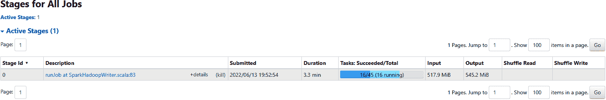

# 第八章。将所有内容整合在一起：数据处理和计数推荐

现在我们已经讨论了推荐系统的大致轮廓，本章将对其进行具体实现，以便我们可以讨论技术选择和实现在现实生活中的工作方式的细节。

本章涵盖以下主题：

+   使用协议缓冲区进行数据表示

+   数据处理框架

+   一个 PySpark 示例程序

+   GloVE 嵌入模型

+   JAX、Flax 和 Optax 中的额外基础技术

我们将逐步展示如何从下载的维基百科数据集转化为一个推荐系统，该系统可以根据与维基百科文章中词的共现来推荐单词。我们选择自然语言示例是因为单词易于理解，并且它们的关系很容易被抓住，因为我们可以看到相关单词在句子中彼此靠近。此外，维基百科语料库可以轻松下载并由任何有互联网连接的人浏览。这种共现的想法可以推广到任何共同出现的集合，比如在同一会话中观看视频或在同一购物袋中购买奶酪。

本章将演示一个基于项目-项目和特征-项目的具体实现。在这种情况下，项目是文章中的单词，而特征是单词计数的相似性——例如 MinHash 或一种用于单词的局部敏感哈希。第十六章将更详细地讨论局部敏感哈希，但现在我们将这些简单的哈希函数视为内容的编码函数，使具有相似属性的内容映射到相似的共域。这个一般的想法可以作为在缺乏日志数据的新语料库上的热启动机制使用，如果我们有用户-项目特征（如喜欢），这些特征可以作为特征-项目推荐系统的特征使用。共现的原则是相同的，但通过使用维基百科作为示例，您可以下载数据并使用提供的工具进行操作。

# 技术栈

技术栈（*technology stack*或*tech stack*）是一组常一起使用的技术。每个技术栈的组件通常可以被其他类似技术替代。我们将列举每个组件的几个替代方案，但不会详细讨论它们的利弊，因为可能有很多情况影响部署组件的选择。例如，您的公司可能已经使用了特定的组件，所以出于熟悉度和支持的考虑，您可能希望继续使用它。

本章涵盖了构建具体实现收集器所需数据处理技术的一些技术选择。

示例代码可以在[GitHub](https://github.com/BBischof/ESRecsys)上找到。您可能想要将代码克隆到本地目录。

# 数据表示

我们需要做的第一个技术选择将决定我们如何表示数据。以下是一些选择：

+   [协议缓冲区](https://oreil.ly/Oc0cE)

+   [Apache Thrift](https://oreil.ly/BUHkW)

+   [JSON](https://oreil.ly/_QwWR)

+   [XML](https://oreil.ly/JigfM)

+   [CSV](https://oreil.ly/it5TA)

在这个实现中，我们主要使用协议缓冲区，因为它易于指定模式，然后序列化和反序列化。

对于文件格式，我们使用序列化的协议缓冲区，将其编码为单行每个记录，然后使用 Bzip 进行压缩。这仅仅是为了方便，以便我们可以轻松地解析文件，而不需要依赖太多库。例如，您的公司可能会将数据存储在可通过 SQL 访问的数据仓库中。

协议缓冲区通常比原始数据更易于解析和处理。在我们的实现中，我们将解析维基百科 XML 为协议缓冲区，以便更轻松地处理，使用*xml2proto.py*。您可以从代码中看到，XML 解析是一件复杂的事情，而协议缓冲区解析则简单得多，只需调用`ParseFromString`方法，然后所有数据随后都以便捷的 Python 对象形式可用。

截至 2022 年 6 月，维基百科转储文件约为 20 GB 大小，转换为协议缓冲区格式大约需要 10 分钟。请按照 GitHub 存储库中 README 中描述的步骤运行程序的最新步骤。

在*proto*目录中，查看一些定义的协议消息。例如，这是我们可能存储维基百科页面文本的方式：

```py
// Generic text document.
message TextDocument {
  // Primary entity, in wikipedia it is the title.
  string primary = 1;
  // Secondary entity, in wikipedia it is other titles.
  repeated string secondary = 2;
  // Raw body tokens.
  repeated string tokens = 3;
  // URL. Only visible documents have urls, some e.g. redirect shouldn't.
  string url = 4;
}
```

支持的类型和模式定义可以在协议缓冲区文档页面上找到。此模式通过使用协议缓冲区编译器转换为代码。该编译器的工作是将模式转换为您可以在不同语言中调用的代码，而在我们的情况下是 Python。协议缓冲区编译器的安装取决于平台，安装说明可以在[协议缓冲区文档](https://oreil.ly/k2QEv)中找到。

每次更改模式时，您都需要使用协议缓冲区编译器获取新版本的协议缓冲区代码。可以通过使用像 Bazel 这样的构建系统轻松自动化此步骤，但这超出了本书的范围。为了本书的目的，我们将简单地生成协议缓冲区代码一次，并将其检入存储库以保持简单。

按照 GitHub 的 README 上的说明，下载维基百科数据集的副本，然后运行*xml2proto.py*将数据转换为协议缓冲区格式。可选择使用*codex.py*查看协议缓冲区格式的样子。在使用 Windows 子系统来运行 Windows 工作站的 Windows 工作站上，这些步骤花费了 10 分钟。使用的 XML 解析器并不很好地并行化，因此这一步是基本上串行的。接下来，我们将讨论如何将工作并行分配，无论是在本地的多个核心之间还是在集群上。

# 大数据框架

我们选择的下一个技术将在多台机器上规模化处理数据。这里列出了一些选项：

+   [Apache Spark](https://spark.apache.org)

+   [Apache Beam](https://beam.apache.org)

+   [Apache Flink](https://flink.apache.org)

在这个实现中，我们在 Python 中使用 Apache Spark，或者称为 PySpark。仓库中的 README 显示了如何使用`pip install`在本地安装 PySpark 的副本。

PySpark 中实现的第一步是标记化和 URL 标准化。代码在[*tokenize_wiki_pyspark.py*](https://oreil.ly/TF_vU)，但我们不会在这里详细介绍，因为很多处理只是分布式自然语言解析和将数据写入协议缓冲区格式。我们将详细讨论第二步，即制作一个字典以及有关单词计数的一些统计信息。但是，我们将运行代码，以查看 Spark 使用体验如何。Spark 程序使用`spark-submit`程序运行，如下所示：

```py
bin/spark-submit
--master=local[4]
--conf="spark.files.ignoreCorruptFiles=true"
tokenize_wiki_pyspark.py
--input_file=data/enwiki-latest-parsed --output_file=data/enwiki-latest-tokenized
```

运行 Spark 提交脚本允许您在本地机器上执行控制程序，例如，在命令行中我们使用了[*tokenize_wiki_pyspark.py*](https://oreil.ly/pQp7r)，请注意，`local[4]`表示使用最多四个核心。相同的命令可以用于将作业提交到 YARN 集群，以在数百台机器上运行，但是出于尝试 PySpark 的目的，一个足够好的工作站应该能够在几分钟内处理所有数据。

此标记化程序将从特定于源的格式（在本例中，是维基百科协议缓冲区）转换为用于自然语言处理的更通用的文本文档。一般来说，最好使用一个所有数据源都可以转换成的通用格式，因为这样可以简化下游的数据处理。可以将数据转换为每个语料库的标准格式，这个格式被流水线中所有后续程序统一处理。

提交作业后，您可以在本地机器上导航至 Spark UI（在图 8-1 中显示）。您应该会看到作业并行执行，使用您机器上的所有核心。您可能想要尝试使用`local[4]`参数；使用`local[*]`将使用您机器上的所有空闲核心。如果您可以访问集群，还可以指向适当的集群 URL。



###### 图 8-1\. Spark UI

## 集群框架

编写 Spark 程序的好处在于它可以从单机多核扩展到拥有数千核的多机集群。完整的集群类型列表可以在[Spark“提交应用程序”文档](https://oreil.ly/0apFm)中找到。

Spark 可以运行在以下几种集群类型上：

+   [Spark 独立集群](https://oreil.ly/NIiwB)

+   [Mesos 集群](https://oreil.ly/lHzRG)

+   [YARN 集群](https://oreil.ly/nuEQh)

+   [Kubernetes 集群](https://oreil.ly/sXIfK)

根据您的公司或机构设置的集群类型不同，大多数情况下提交作业只是指向正确 URL 的问题。许多公司，如 Databricks 和 Google，还提供了完全托管的 Spark 解决方案，可以让您轻松设置一个 Spark 集群。

## PySpark 示例

统计单词实际上是信息检索中的一个强大工具，因为我们可以使用方便的技巧，比如词频、逆文档频率（TF-IDF），它简单地是文档中单词出现次数除以单词出现在文档中的次数。表示如下：

<math alttext="t f i d f Subscript word Baseline left-parenthesis i right-parenthesis equals StartFraction log Subscript 10 Baseline left-parenthesis number of times w o r d Subscript i Baseline has occurred in corpus right-parenthesis Over number of documents in corpus containing w o r d Subscript i Baseline EndFraction" display="block"><mrow><mi>t</mi> <mi>f</mi> <mi>i</mi> <mi>d</mi> <msub><mi>f</mi> <mtext>word</mtext></msub> <mrow><mo>(</mo> <mi>i</mi> <mo>)</mo></mrow> <mo>=</mo> <mstyle displaystyle="true" scriptlevel="0"><mfrac><mrow><msub><mo form="prefix">log</mo> <mn>10</mn></msub> <mfenced close=")" open="(" separators=""><mtext>number</mtext><mtext>of</mtext><mtext>times</mtext><mi>w</mi><mi>o</mi><mi>r</mi><msub><mi>d</mi> <mi>i</mi></msub> <mtext>has</mtext><mtext>occurred</mtext><mtext>in</mtext><mtext>corpus</mtext></mfenced></mrow> <mrow><mtext>number</mtext><mtext>of</mtext><mtext>documents</mtext><mtext>in</mtext><mtext>corpus</mtext><mtext>containing</mtext><mi>w</mi><mi>o</mi><mi>r</mi><msub><mi>d</mi> <mi>i</mi></msub></mrow></mfrac></mstyle></mrow></math>

例如，因为单词 *the* 经常出现，我们可能认为它很重要。但通过除以文档频率，*the* 就变得不那么特殊，重要性降低了。这个技巧在简单的自然语言处理中非常方便，可以得到比随机加权更好的单词重要性。

因此，我们的下一步是运行 [*make_dictionary.py*](https://oreil.ly/lESlx)。如其名称所示，这个程序简单地统计单词和文档，并创建一个字典，记录单词出现的次数。

我们有一些概念要介绍，以便您正确理解 Spark 如何以分布式方式处理数据。大多数 Spark 程序的入口点是 `SparkContext`。这个 Python 对象是在控制器上创建的。*控制器* 是启动实际处理数据的工作节点的中央程序。这些工作节点可以作为进程在单台机器上本地运行，也可以作为独立的工作节点在云上的许多机器上运行。

`SparkContext` 可以用于创建弹性分布式数据集，或称 RDD。这些是对数据流的引用，可以在控制器上进行操作，并且可以将 RDD 上的处理分配到所有工作节点上。`SparkContext` 允许您加载存储在分布式文件系统（如 Hadoop 分布式文件系统（HDFS）或云存储桶）中的数据文件。通过调用 `SparkContext` 的 `textFile` 方法，我们得到了一个 RDD 的句柄。然后可以对 RDD 应用或映射一个无状态函数，通过重复应用函数到 RDD 的内容，将其从一个 RDD 转换为另一个 RDD。

例如，这个程序片段加载一个文本文件，并通过运行一个匿名的 lambda 函数将所有行转换为小写：

```py
def lower_rdd(input_file: str,
              output_file: str):
  """Takes a text file and converts it to lowercase.."""
  sc = SparkContext()
  input_rdd = sc.textFile(input_file)
  input_rdd.map(lambda line: line.lower()).saveAsTextFile(output_file)
```

在单机实现中，我们简单地加载每篇维基百科文章，在 RAM 中保持运行中的字典，并对每个标记进行计数，然后在字典中将标记计数加 1。*标记*是文档的原子元素，被分成片段。在常规英语中，它可能是一个词，但维基百科文档还有其他实体，如文档引用本身，需要单独跟踪，因此我们称其为*标记化*的分割和原子元素为*标记*。单机实现将花费一些时间浏览维基百科的成千上万篇文章，这就是为什么我们使用 Spark 等分布式处理框架的原因。在 Spark 范式中，计算被分成映射，其中一个函数在每个文档上并行无状态地应用。Spark 还具有减少函数，其中单独映射的输出被连接在一起。

例如，假设我们有一个单词计数列表，并想要对出现在不同文档中的单词的值进行求和。减少器的输入将类似于这样：

+   (苹果, 10)

+   (橙子, 20)

+   (苹果, 7)

然后我们调用 Spark 函数`reduceByKey(lambda a, b: a+ b)`，它将所有具有相同键的值加在一起，并返回以下内容：

+   (橙子, 20)

+   (苹果, 17)

如果你查看[*make_dictionary.py*](https://oreil.ly/lESlx)中的代码，*映射阶段*是我们将文档作为输入，然后将其分解为（标记，1）元组的地方。在*减少阶段*，映射输出由键连接在一起，这里的键是标记本身，而减少函数只是简单地对所有标记的计数求和。

注意，减少函数假设缩减是可结合的——也就是说，<math alttext="left-parenthesis a plus b plus c right-parenthesis equals left-parenthesis a plus b right-parenthesis plus c equals a plus left-parenthesis b plus c right-parenthesis"><mrow><mo>(</mo> <mi>a</mi> <mo>+</mo> <mi>b</mi> <mo>+</mo> <mi>c</mi> <mo>)</mo> <mo>=</mo> <mo>(</mo> <mi>a</mi> <mo>+</mo> <mi>b</mi> <mo>)</mo> <mo>+</mo> <mi>c</mi> <mo>=</mo> <mi>a</mi> <mo>+</mo> <mo>(</mo> <mi>b</mi> <mo>+</mo> <mi>c</mi> <mo>)</mo></mrow></math>。这使得 Spark 框架能够在内存中对映射阶段的标记字典的某些部分进行求和（在某些框架中，这称为*合并步骤*，其中在映射器机器上运行减少的一部分结果）然后在减少阶段的多次传递中对它们进行求和。

作为一种优化，我们使用了 Spark 函数`mapPartitions`。Map 对每一行运行一次提供的函数（我们已将整个维基百科文档编码为协议缓冲区，并将其 uuencode 为单个文本行），而`mapPartitions`在整个分区上运行它，通常是许多文档，通常为 64 MB。这种优化使我们能够在整个分区上构建一个小的 Python 字典，因此我们有更少的令牌计数对要减少。这节省了网络带宽，因此 mapper 需要发送给 reducer 的数据较少，并且总体上对于这些数据处理管道来说是一个不错的提示，以减少网络带宽（通常是数据处理中最耗时的部分之一，与计算相比）。

接下来，我们展示了一个完整的 Spark 程序，它读取了上一节代码块中所示的`TextDocument`的协议缓冲区格式的文档，然后计算整个语料库中单词或标记出现的频率。GitHub 仓库中的文件是[*make_dictionary.py*](https://oreil.ly/lESlx)。以下代码与仓库文件略有不同，因为为了可读性将其分成了三个片段，并且将主程序和子程序的顺序进行了交换以便更清晰地展示。在这里，我们首先呈现依赖项和标志，然后是主体部分，然后是主体调用的函数，以便更清楚地了解函数的目的。

首先，让我们看一下依赖项。主要的依赖项是代表维基百科文章的文本文档的协议缓冲区，如前所述。这是我们期望的输入。对于输出，我们有`TokenDictionary`协议缓冲区，它主要统计文章中单词的出现次数。我们将使用单词的共现来形成文章的相似性图，然后将其用作基于热启动的推荐系统的基础。我们还依赖于 PySpark，这是我们用来处理数据的数据处理框架，以及一个处理程序选项的标志库。absl 标志库非常方便，可以解析和解释命令行标志的目的，并且可以轻松地检索标志的集合值。以下是依赖项和标志：

```py
#!/usr/bin/env python
# -*- coding: utf-8 -*-
#
#

"""
 This reads a doc.pb.b64.bz2 file and generates a dictionary.
"""
import base64
import bz2
import nlp_pb2 as nlp_pb
import re
from absl import app
from absl import flags
from pyspark import SparkContext
from token_dictionary import TokenDictionary

FLAGS = flags.FLAGS
flags.DEFINE_string("input_file", None, "Input doc.pb.b64.bz2 file.")
flags.DEFINE_string("title_output", None,
                    "The title dictionary output file.")
flags.DEFINE_string("token_output", None,
                    "The token dictionary output file.")
flags.DEFINE_integer("min_token_frequency", 20,
                     "Minimum token frequency")
flags.DEFINE_integer("max_token_dictionary_size", 500000,
                     "Maximum size of the token dictionary.")
flags.DEFINE_integer("max_title_dictionary_size", 500000,
                     "Maximum size of the title dictionary.")
flags.DEFINE_integer("min_title_frequency", 5,
                     "Titles must occur this often.")

# Required flag.
flags.mark_flag_as_required("input_file")
flags.mark_flag_as_required("token_output")
flags.mark_flag_as_required("title_output")
```

接下来是程序的主体部分，在这里调用所有的子程序。我们首先创建`SparkContext`，这是进入 Spark 数据处理系统的入口点，然后调用其`textFile`方法来读取压缩的维基百科文章。请阅读存储库上的 README 文件以了解它是如何生成的。接着，我们解析文本文档，并将 RDD 发送到两个处理管道，一个用于创建文章正文的字典，另一个用于创建标题的字典。我们可以选择为两者创建一个统一的字典，但将它们分开允许我们使用标记字典创建基于内容的推荐器，并使用标题字典创建文章对文章的推荐器，因为标题是维基百科文章的标识符。这是主体部分：

```py
def main(argv):
  """Main function."""
  del argv  # Unused.
  sc = SparkContext()
  input_rdd = sc.textFile(FLAGS.input_file)
  text_doc = parse_document(input_rdd)
  make_token_dictionary(
    text_doc,
    FLAGS.token_output,
    FLAGS.min_token_frequency,
    FLAGS.max_token_dictionary_size
  )
  make_title_dictionary(
    text_doc,
    FLAGS.title_output,
    FLAGS.min_title_frequency,
    FLAGS.max_title_dictionary_size
  )

if __name__ == "__main__":
    app.run(main)
```

最后，我们有由主函数调用的子程序，所有这些都分解为更小的子程序，用于计算文章正文和标题中的标记数量：

```py
def update_dict_term(term, dictionary):
    """Updates a dictionary with a term."""
    if term in dictionary:
        x = dictionary[term]
    else:
        x = nlp_pb.TokenStat()
        x.token = term
        dictionary[term] = x
    x.frequency += 1

def update_dict_doc(term, dictionary):
    """Updates a dictionary with the doc frequency."""
    dictionary[term].doc_frequency += 1

def count_titles(doc, title_dict):
    """Counts the titles."""
    # Handle the titles.
    all_titles = [doc.primary]
    all_titles.extend(doc.secondary)
    for title in all_titles:
        update_dict_term(title, title_dict)
    title_set = set(all_titles)
    for title in title_set:
        update_dict_doc(title, title_dict)

def count_tokens(doc, token_dict):
    """Counts the tokens."""
    # Handle the tokens.
    for term in doc.tokens:
        update_dict_term(term, token_dict)
    term_set = set(doc.tokens)
    for term in term_set:
        update_dict_doc(term, token_dict)

def parse_document(rdd):
    """Parses documents."""
    def parser(x):
        result = nlp_pb.TextDocument()
        try:
            result.ParseFromString(x)
        except google.protobuf.message.DecodeError:
            result = None
        return result
    output = rdd.map(base64.b64decode)\
        .map(parser)\
        .filter(lambda x: x is not None)
    return output

def process_partition_for_tokens(doc_iterator):
    """Processes a document partition for tokens."""
    token_dict = {}
    for doc in doc_iterator:
        count_tokens(doc, token_dict)
    for token_stat in token_dict.values():
        yield (token_stat.token, token_stat)

def tokenstat_reducer(x, y):
    """Combines two token stats together."""
    x.frequency += y.frequency
    x.doc_frequency += y.doc_frequency
    return x

def make_token_dictionary(
    text_doc,
    token_output,
    min_term_frequency,
    max_token_dictionary_size
):
    """Makes the token dictionary."""
    tokens = text_doc.mapPartitions(process_partition_for_tokens)
        .reduceByKey(tokenstat_reducer).values()
    filtered_tokens = tokens.filter(
        lambda x: x.frequency >= min_term_frequency)
    all_tokens = filtered_tokens.collect()
    sorted_token_dict = sorted(
        all_tokens, key=lambda x: x.frequency, reverse=True)
    count = min(max_token_dictionary_size, len(sorted_token_dict))
    for i in range(count):
        sorted_token_dict[i].index = i
    TokenDictionary.save(sorted_token_dict[:count], token_output)

def process_partition_for_titles(doc_iterator):
    """Processes a document partition for titles."""
    title_dict = {}
    for doc in doc_iterator:
        count_titles(doc, title_dict)
    for token_stat in title_dict.values():
        yield (token_stat.token, token_stat)

def make_title_dictionary(
    text_doc,
    title_output,
    min_title_frequency,
    max_title_dictionary_size
):
    """Makes the title dictionary."""
    titles = text_doc
      .mapPartitions(process_partition_for_titles)
      .reduceByKey(tokenstat_reducer).values()
    filtered_titles = titles.filter(
      lambda x: x.frequency >= min_title_frequency)
    all_titles = filtered_titles.collect()
    sorted_title_dict = sorted(
      all_titles, key=lambda x: x.frequency, reverse=True)
    count = min(max_title_dictionary_size, len(sorted_title_dict))
    for i in range(count):
        sorted_title_dict[i].index = i
    TokenDictionary.save(sorted_title_dict[:count], title_output)
```

如您所见，Spark 使得将程序从单台计算机扩展到运行在多台计算机集群上变得非常容易！从主函数开始，我们创建`SparkContext`，将输入文件作为文本文件读取，解析它，然后制作标记和标题字典。RDD 作为处理函数的参数传递，并可以多次使用，并馈送到各种映射函数（如标记和标题字典方法）中。

制作字典方法中的重要工作由处理分区函数完成，这些函数是一次应用于整个分区的映射函数。*分区*是输入的大块，通常约为 64 MB 大小，并且作为一个块一次处理，这样我们通过执行映射端组合可以节省网络带宽。这是一种技术，重复应用于映射分区以及通过键（在本例中为标记）进行连接后对计数求和的减少器。我们这样做的原因是为了节省网络带宽，通常是数据处理流水线中磁盘访问后最慢的部分。

您可以通过使用实用程序*codex.py*查看`make_dictionary`阶段的输出，它会转储程序中注册的不同类型的协议缓冲区。由于我们所有的数据都被序列化为压缩和编码的文本文件，唯一的区别是使用哪种协议缓冲区模式来解码序列化数据，因此我们可以使用同一个程序来打印出用于调试的数据的前几个元素。尽管将数据存储为 JSON、XML 或 CSV 文件可能更简单，但拥有模式将使您免受未来烦恼，因为协议缓冲区是可扩展的并支持可选字段。它们还是有类型的，这可以使您免受在 JSON 中出现意外错误的影响，例如不知道一个值是字符串、浮点数还是整数，或者在某些文件中将字段作为字符串，而在其他文件中将字段作为整数。拥有显式类型化的模式可以使我们避免许多这些错误。

管道中的下一步是*make_cooccurrence.py*。顾名思义，这个程序只是计算每个标记与另一个标记共现的次数。这本质上是表示图的一种稀疏方式。在*nlp.proto*中，稀疏共现矩阵的每一行如下所示：

```py
// Co-occurrence matrix row.
message CooccurrenceRow {
    uint64 index = 1;
    repeated uint64 other_index = 2;
    repeated float count = 3;
}
```

在*共现矩阵*中，每行*i*在列*j*处有一个条目，表示标记*j*与标记*i*共现的次数。这是一种方便的方法，可以将标记*i*和*j*之间的相似性关联起来，因为如果它们经常共同出现，它们必须比不共同出现的标记更相关。在协议缓冲区格式中，这些被存储为两个并行数组`other_index`和`count`。我们使用索引是因为它们比存储原始单词要小，特别是使用协议缓冲区的变化编码（即由标记索引的行和列的矩阵，以及元素是索引的共现）。在这种编码中，小整数需要的位数比大整数少；由于我们按频率反向排序了字典，因此最常出现的标记具有最小的索引。

在这个阶段，如果您想基于频繁项相似性共现构建一个非常简单的推荐系统，您可以查找标记*i*的行并按计数顺序返回标记<math alttext="j"><mi>j</mi></math> 。这个简单的推荐系统将是对前几章中描述的流行物品推荐系统的一个很好的变体。

# 客户还购买了

这种共现概念将在第九章进一步发展，但让我们花一点时间来思考 MPIR 和共现概念。当我们查看物品的共现矩阵时，我们可以对行求和或列求和，以确定每个物品被看到（或购买）的次数。这就是我们在第二章中构建 MPIR 的方式。如果我们查看对应于用户已看到物品的特定行的 MPIR，那么这就是*条件 MPIR*——即给定用户已看到物品<math alttext="i"><mi>i</mi></math> 的最受欢迎的物品。

但是，在这里我们可以选择对共现矩阵进行嵌入或低秩表示。矩阵的嵌入表示很方便，因为它允许我们将每个项表示为向量。通过奇异值分解或 SVD（参见“潜在空间”）来分解矩阵的一种方法，但我们在这里不会这样做。相反，我们将学习用于自然语言处理的 GloVE 嵌入。

GloVE 嵌入的目标函数是学习两个向量，使得它们的点积与两个向量之间共现的对数计数成比例。这种损失函数有效的原因是点积将成比例于共现的对数计数；因此，经常一起出现的单词的点积将大于不经常一起出现的单词。为了计算嵌入，我们需要有共现矩阵可用，幸运的是，管道中的上一步已经为我们生成了这样一个矩阵供我们处理。

# GloVE 模型定义

对于本节，请参考[*train_coccurence.py*](https://oreil.ly/exOH2)中的代码。

假设我们有来自令牌字典的令牌 *i* 和 *j*。我们知道它们相互共现了 *N* 次。我们希望以某种方式生成一个嵌入空间，使得向量<math alttext="x left-parenthesis i right-parenthesis asterisk x left-parenthesis j right-parenthesis"><mrow><mi>x</mi> <mo>(</mo> <mi>i</mi> <mo>)</mo> <mo>*</mo> <mi>x</mi> <mo>(</mo> <mi>j</mi> <mo>)</mo></mrow></math>与 log(*N*) 成比例。对于 log 计数和确切的方程式，是由 Jeffrey Pennington 等人在[“GloVe: 全局词向量表示”](https://oreil.ly/cMHB3)中推导出来的。我们只展示推导出的结果：

<math alttext="y Subscript predicted Baseline equals x left-parenthesis i right-parenthesis ModifyingAbove x With dot left-parenthesis j right-parenthesis plus bias left-parenthesis i right-parenthesis plus bias left-parenthesis j right-parenthesis" display="block"><mrow><msub><mi>y</mi> <mtext>predicted</mtext></msub> <mo>=</mo> <mi>x</mi> <mrow><mo>(</mo> <mi>i</mi> <mo>)</mo></mrow> <mover accent="true"><mi>x</mi> <mo>˙</mo></mover> <mrow><mo>(</mo> <mi>j</mi> <mo>)</mo></mrow> <mo>+</mo> <mtext>bias</mtext> <mrow><mo>(</mo> <mi>i</mi> <mo>)</mo></mrow> <mo>+</mo> <mtext>bias</mtext> <mrow><mo>(</mo> <mi>j</mi> <mo>)</mo></mrow></mrow></math>

这里，<math alttext="x"><mi>x</mi></math>是嵌入查找。在代码中，我们使用 64 维向量，它们不会太小以至于容量不足以表示嵌入空间，但也不会太大，以至于当我们对整个字典进行嵌入时会占用太多内存。偏置项用于吸收与许多其他项共现的非常流行的项的大计数，例如 *the*、*a* 和 *and*。

我们要最小化的损失是预测值与实际值之间的平方差：

<math alttext="StartLayout 1st Row 1st Column Blank 2nd Column y Subscript target Baseline equals 1 plus log Subscript 10 Baseline left-parenthesis upper N right-parenthesis 2nd Row 1st Column Blank 2nd Column weight equals min left-parenthesis 1 comma upper N slash 100 right-parenthesis Superscript 0.75 Baseline 3rd Row 1st Column Blank 2nd Column loss equals weight asterisk left-parenthesis y Subscript predicted Baseline minus y Subscript target Baseline right-parenthesis squared EndLayout" display="block"><mtable displaystyle="true"><mtr><mtd columnalign="left"><mrow><msub><mi>y</mi> <mtext>target</mtext></msub> <mo>=</mo> <mn>1</mn> <mo>+</mo> <msub><mtext>log</mtext> <mn>10</mn></msub> <mrow><mo>(</mo> <mi>N</mi> <mo>)</mo></mrow></mrow></mtd></mtr> <mtr><mtd columnalign="left"><mrow><mtext>weight</mtext> <mo>=</mo> <mtext>min</mtext> <msup><mfenced close=")" open="(" separators=""><mn>1</mn><mo>,</mo><mi>N</mi><mo>/</mo><mn>100</mn></mfenced> <mrow><mn>0</mn><mo>.</mo><mn>75</mn></mrow></msup></mrow></mtd></mtr> <mtr><mtd columnalign="left"><mrow><mtext>loss</mtext> <mo>=</mo> <mtext>weight</mtext> <mo>*</mo> <msup><mrow><mo>(</mo><msub><mi>y</mi> <mtext>predicted</mtext></msub> <mo>-</mo><msub><mi>y</mi> <mtext>target</mtext></msub> <mo>)</mo></mrow> <mn>2</mn></msup></mrow></mtd></mtr></mtable></math>

损失函数中的加权项是为了防止非常流行的共现项的主导以及减少较少见的共现项的权重。

## JAX 和 Flax 中的 GloVE 模型规范

让我们来看看基于 JAX 和 Flax 的 GloVE 模型的实现。这在 GitHub 仓库的文件*wikipedia/models.py*中：

```py
import flax
from flax import linen as nn
from flax.training import train_state
import jax
import jax.numpy as jnp

class Glove(nn.Module):
    """A simple embedding model based on gloVe.
 https://nlp.stanford.edu/projects/glove/
 """
    num_embeddings: int = 1024
    features: int = 64

    def setup(self):
        self._token_embedding = nn.Embed(self.num_embeddings,
                                         self.features)
        self._bias = nn.Embed(
            self.num_embeddings, 1, embedding_init=flax.linen.initializers.zeros)

    def __call__(self, inputs):
        """Calculates the approximate log count between tokens 1 and 2.
 Args:
 A batch of (token1, token2) integers representing co-occurence.
 Returns:
 Approximate log count between x and y.
 """
        token1, token2 = inputs
        embed1 = self._token_embedding(token1)
        bias1 = self._bias(token1)
        embed2 = self._token_embedding(token2)
        bias2 = self._bias(token2)
        dot_vmap = jax.vmap(jnp.dot, in_axes=[0, 0], out_axes=0)
        dot = dot_vmap(embed1, embed2)
        output = dot + bias1 + bias2
        return output

    def score_all(self, token):
        """Finds the score of token vs all tokens.
 Args:
 max_count: The maximum count of tokens to return.
 token: Integer index of token to find neighbors of.
 Returns:
 Scores of nearest tokens.
 """
        embed1 = self._token_embedding(token)
        all_tokens = jnp.arange(0, self.num_embeddings, 1, dtype=jnp.int32)
        all_embeds = self._token_embedding(all_tokens)
        dot_vmap = jax.vmap(jnp.dot, in_axes=[None, 0], out_axes=0)
        scores = dot_vmap(embed1, all_embeds)
        return scores
```

Flax 使用起来相当简单；所有网络都继承自 Flax 的亚麻神经网络库，并且都是模块。Flax 模块也是 Python 的数据类，因此模块的任何超参数都在模块开头定义为变量。对于这个简单的模型，我们只有两个超参数：我们想要的嵌入数量，对应于字典中的令牌数量，以及嵌入向量的维度。接下来，在模块的设置中，我们实际上创建了我们想要的层，这只是每个令牌的偏置项和嵌入。

定义的下一部分是当我们使用此模块时调用的默认方法。在这种情况下，我们想传入一对标记，*i*，*j*；将它们转换为嵌入，<math alttext="x left-parenthesis i right-parenthesis comma x left-parenthesis j right-parenthesis"><mrow><mi>x</mi> <mo>(</mo> <mi>i</mi> <mo>)</mo> <mo>,</mo> <mi>x</mi> <mo>(</mo> <mi>j</mi> <mo>)</mo></mrow></math>；然后计算预测的 log(*count*(*y*[predicted])。

在这段代码的这一部分，我们遇到了 JAX 和 NumPy 之间的第一个区别——即向量化映射或`vmap`。`vmap`接受一个函数，并在张量的轴上以相同的方式应用它；这使得编码更容易，因为您只需考虑原始函数如何在较低秩张量（如向量）上操作。在这个例子中，由于我们正在传入一批标记对并对它们进行嵌入，我们实际上有一批向量，因此我们希望在批次维度上运行点积。我们传入 JAX 的 dot 函数，它接受向量，沿批次维度（即轴 0）运行，并告诉`vmap`将输出作为另一个批次维度（轴 0）返回。这使我们可以简单高效地编写处理低维张量的代码，并通过`vmap`处理额外的轴获得可以操作高维张量的函数。从概念上讲，这就好像我们在第一维上循环并返回一个点积数组。然而，通过将此过程转换为函数，我们允许 JAX 将此循环推入可即时编译的代码中，在 GPU 上快速运行。

最后，我们还声明助手函数[`score_all`](https://oreil.ly/-zYon)，它接受一个标记并针对所有其他标记进行评分。再次，我们使用`vmap`来与特定标记的点积，但是运行它与所有其他标记的嵌入。这里的区别在于，因为<math alttext="x left-parenthesis i right-parenthesis"><mrow><mi>x</mi> <mo>(</mo> <mi>i</mi> <mo>)</mo></mrow></math>已经是一个向量，我们不需要对其进行`vmap`。因此，在`in_axes`中，我们提供`[None, 0]`，这意味着不要在第一个参数的轴上进行`vmap`，而是在第二个参数的轴 0 上进行`vmap`，即所有标记的所有嵌入的批处理。然后我们返回结果，这是<math alttext="x left-parenthesis i right-parenthesis"><mrow><mi>x</mi> <mo>(</mo> <mi>i</mi> <mo>)</mo></mrow></math>与所有其他嵌入的点积，但没有偏置项。我们在评分中不使用偏置项，因为它被用来吸收非常常见标记的流行度，如果仅使用其点积部分进行评分，我们的评分函数会更有趣。

## 使用 Optax 训练 GloVE 模型

接下来，让我们看一下[*wikipedia/train_coocurrence.py*](https://oreil.ly/A1o24)。让我们特别看一下调用模型以深入了解一些 JAX 特定细节的部分：

```py
@jax.jit
def apply_model(state, inputs, target):
    """Computes the gradients and loss for a single batch."""

    # Define glove loss.
    def glove_loss(params):
        """The GloVe weighted loss."""
        predicted = state.apply_fn({'params': params}, inputs)
        ones = jnp.ones_like(target)
        weight = jnp.minimum(ones, target / 100.0)
        weight = jnp.power(weight, 0.75)
        log_target = jnp.log10(1.0 + target)
        loss = jnp.mean(jnp.square(log_target - predicted) * weight)
        return loss

    grad_fn = jax.value_and_grad(glove_loss)
    loss, grads = grad_fn(state.params)

    return grads, loss
```

第一个要注意的是函数装饰器，`@jax.jit`。这告诉 JAX 函数中的所有内容都可以进行即时编译（JIT）。要使函数可以进行即时编译，有一些要求——主要是函数必须是纯函数，这是计算机科学术语，表示如果你用相同的参数调用函数，你会期望得到相同的结果。该函数不应该有任何副作用，也不应该依赖于缓存状态，比如私有计数器或具有隐式状态的随机数生成器。作为参数传入的张量可能也应该具有固定的形状，因为每个新的形状都会触发新的 JIT 编译。你可以用`static_argnums`来给编译器一些参数是常量的提示，但这些参数不应该经常变化，否则将花费大量时间为每个常量编译程序。

纯函数哲学的一个结果是模型结构和模型参数是分开的。这样，模型函数是纯函数，参数传递给模型函数，允许模型函数进行即时编译。这就是为什么我们将模型的`apply_fn`应用于参数，而不是简单地将参数作为模型的一部分的原因。

然后可以编译这个`apply_model`函数来实现我们之前描述的 GloVE 损失。JAX 提供的另一个新功能是自动计算函数的梯度。JAX 函数`value_and_grad`计算损失相对于参数的梯度。由于梯度总是指向损失增加的方向，我们可以使用梯度下降去减少损失。Optax 库提供了几种优化器可供选择，包括 SGD（带动量的随机梯度下降）和 ADAM。

当你运行训练程序时，它将循环遍历共现矩阵，并尝试通过使用 GloVE 损失函数生成其简洁形式。大约一个小时后，你应该能够看到得分最高的术语。

例如，“民主”的最近邻包括：民主：1.064498，自由主义：1.024733，改革：1.000746，事务：0.961664，社会主义：0.952792，组织：0.935910，政治：0.919937，政策：0.917884，政策：0.907138，以及--日期：0.889342。

正如你所见，查询令牌本身通常是评分最高的邻居，但这并不一定是真的，因为一个非常受欢迎的令牌实际上可能比查询令牌本身得分更高。

## 总结

阅读完本章后，你应该对组装推荐系统的基本要素有了很好的概述。你已经学习了如何搭建基本的 Python 开发环境；管理包；使用标志指定输入和输出；以各种方式编码数据，包括使用协议缓冲区；并且用 PySpark 处理数据的分布式框架。你还学会了如何将几十 GB 的数据压缩成几 MB 的模型，这个模型能够在给定查询项的情况下进行泛化并快速评分。

请花些时间去尝试这些代码，并阅读各种引用包的文档，以对基础知识有个清晰的理解。这些基础示例具有广泛的应用，熟练掌握它们将使你的生产环境更加准确。
