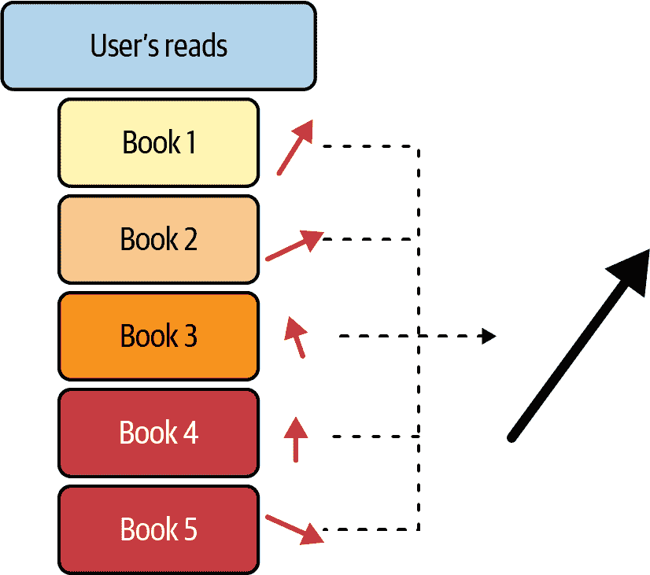

# 第九章。基于特征和基于计数的推荐

考虑这个简化的问题：给定一群新用户，预测哪些用户会喜欢我们的新型超级超级有趣新品项，简称为马芬。您可以开始询问哪些老用户喜欢马芬；这些用户是否有任何共同点？如果有，您可以构建一个模型，从这些相关的用户特征预测马芬的亲和力。

或者，您可以问：“人们与马芬一起购买的其他物品是什么？”如果您发现其他人经常还购买果酱（just-awesome-merch），那么马芬对那些已经拥有果酱的人来说可能是一个不错的建议。这将使用马芬和果酱的共现作为预测器。同样，如果您的朋友有与您相似的口味——您都喜欢司康、果酱、饼干和茶——但您的朋友尚未品尝过马芬，如果您喜欢马芬，那么对于您的朋友来说，这可能是一个不错的选择。这是利用您和朋友之间的物品共现。

这些物品关系特征将在本章形成我们的第一种排名方法；所以拿起一份美味的小吃，让我们深入了解一下。

# 双线性因子模型（度量学习）

根据关于在马前奔跑和在车后行走的通俗语，让我们从可以视为*天真*的机器学习方法开始我们的排名系统之旅。通过这些方法，我们将开始感受构建推荐系统中的难点所在，以及为什么一些即将进行的努力是必要的。

让我们重新从推荐问题的基本假设开始：估计用户<math alttext="i"><mi>i</mi></math>对物品<math alttext="x"><mi>x</mi></math>的评分，表示为<math alttext="r Subscript i comma x"><msub><mi>r</mi> <mrow><mi>i</mi><mo>,</mo><mi>x</mi></mrow></msub></math> 。*请注意符号与之前稍有不同的原因很快就会明白。* 在通常的机器学习范式中，我们可能会声称通过物品和用户的特性来估计这个分数，并且通常这些特性会被描述为特征，因此<math alttext="bold i"><mi>𝐢</mi></math> 和 <math alttext="bold x"><mi>𝐱</mi></math> 可以是用户和物品向量，分别由这些特征组成。

现在，我们考虑用户<math alttext="i"><mi>i</mi></math>及其之前互动过的物品集合<math alttext="script upper R Subscript i"><msub><mi>ℛ</mi> <mi>i</mi></msub></math>，并考虑<math alttext="script upper I equals StartSet bold x vertical-bar x element-of script upper R Subscript i Baseline EndSet"><mrow><mi>ℐ</mi> <mo>=</mo> <mo>{</mo> <mi>𝐱</mi> <mo>|</mo> <mi>x</mi> <mo>∈</mo> <msub><mi>ℛ</mi> <mi>i</mi></msub> <mo>}</mo></mrow></math>，这些物品在特征空间中相关联的向量集合。然后，我们可以将这些向量映射到一个表示中，以生成一个*用户<math alttext="i"><mi>i</mi></math>的基于内容的特征向量*。图 9-1 展示了一个映射示例。



###### 图 9-1\. 内容到特征向量

这种极其简单的方法可以将一组物品特征和用户-物品交互转化为用户的特征。在接下来的内容中，将会探讨越来越丰富的方法。通过深入思考映射、特征以及*交互*的需求，为本书的许多关键洞察铺平道路。

让我们将前述映射<math alttext="bold i colon equals upper F left-parenthesis script upper I right-parenthesis"><mrow><mi>𝐢</mi> <mo>:</mo> <mo>=</mo> <mi>F</mi> <mfenced close=")" open="("><mi>ℐ</mi></mfenced></mrow></math>，视为一个简单的聚合，如维度平均。然后认识到该映射将提供与物品相同维度的向量。现在我们有了一个与物品相同“空间”的用户向量，我们可以像我们在第三章中讨论潜在空间那样提出相似性问题。

我们需要回到数学框架中来建立如何使用这些向量。最终，我们现在处于一个潜在空间中，其中包括用户和物品，但我们怎么能够做任何事情呢？也许你已经记得如何比较向量相似性了。让我们定义相似性为*cosine-similarity*：

<math alttext="s i m left-parenthesis bold i comma bold x right-parenthesis equals StartFraction bold i dot bold x Over StartAbsoluteValue bold i EndAbsoluteValue asterisk StartAbsoluteValue bold x EndAbsoluteValue EndFraction" display="block"><mrow><mi>s</mi> <mi>i</mi> <mi>m</mi> <mrow><mo>(</mo> <mi>𝐢</mi> <mo>,</mo> <mi>𝐱</mi> <mo>)</mo></mrow> <mo>=</mo> <mstyle displaystyle="true" scriptlevel="0"><mfrac><mrow><mi>𝐢</mi><mo>·</mo><mi>𝐱</mi></mrow> <mrow><mfenced close="|" open="|"><mi>𝐢</mi></mfenced><mo>*</mo><mfenced close="|" open="|"><mi>𝐱</mi></mfenced></mrow></mfrac></mstyle></mrow></math>

如果我们使用向量归一化预先构造我们的相似性，这就是简单的内积—*这是推荐系统的一个重要的第一步*。为方便起见，让我们假设我们工作的空间是经过归一化的，因此所有相似度测量都是在单位球上进行的：

<math alttext="r Subscript i comma x Baseline tilde s i m left-parenthesis bold i comma bold x right-parenthesis equals sigma-summation Underscript k Endscripts bold i Subscript k Baseline asterisk bold x Subscript k" display="block"><mrow><msub><mi>r</mi> <mrow><mi>i</mi><mo>,</mo><mi>x</mi></mrow></msub> <mo>∼</mo> <mi>s</mi> <mi>i</mi> <mi>m</mi> <mrow><mo>(</mo> <mi>𝐢</mi> <mo>,</mo> <mi>𝐱</mi> <mo>)</mo></mrow> <mo>=</mo> <munder><mo>∑</mo> <mi>k</mi></munder> <msub><mi>𝐢</mi> <mi>k</mi></msub> <mo>*</mo> <msub><mi>𝐱</mi> <mi>k</mi></msub></mrow></math>

现在这近似了我们的评分。但等等，亲爱的读者，学习参数在哪里？让我们继续，通过一个对角矩阵<math alttext="upper A"><mi>A</mi></math>，将其变为加权求和：

<math alttext="r Subscript i comma x Baseline tilde s i m Superscript upper A Baseline left-parenthesis bold i comma bold x right-parenthesis equals sigma-summation Underscript k Endscripts a Subscript k Baseline asterisk bold i Subscript k Baseline asterisk bold x Subscript k" display="block"><mrow><msub><mi>r</mi> <mrow><mi>i</mi><mo>,</mo><mi>x</mi></mrow></msub> <mo>∼</mo> <mi>s</mi> <mi>i</mi> <msup><mi>m</mi> <mi>A</mi></msup> <mrow><mo>(</mo> <mi>𝐢</mi> <mo>,</mo> <mi>𝐱</mi> <mo>)</mo></mrow> <mo>=</mo> <munder><mo>∑</mo> <mi>k</mi></munder> <msub><mi>a</mi> <mi>k</mi></msub> <mo>*</mo> <msub><mi>𝐢</mi> <mi>k</mi></msub> <mo>*</mo> <msub><mi>𝐱</mi> <mi>k</mi></msub></mrow></math>

这个轻微的泛化已经将我们置于统计学习的世界中。你可能已经看到<math alttext="upper A"><mi>A</mi></math>如何用来学习这个空间中哪些维度对于逼近评分最重要，但在我们确立之前，让我们再次泛化：

<math alttext="r Subscript i comma x Baseline tilde s i m Superscript upper A Baseline left-parenthesis bold i comma bold x right-parenthesis equals sigma-summation Underscript k comma l Endscripts a Subscript k l Baseline asterisk bold i Subscript k Baseline asterisk bold x Subscript l" display="block"><mrow><msub><mi>r</mi> <mrow><mi>i</mi><mo>,</mo><mi>x</mi></mrow></msub> <mo>∼</mo> <mi>s</mi> <mi>i</mi> <msup><mi>m</mi> <mi>A</mi></msup> <mrow><mo>(</mo> <mi>𝐢</mi> <mo>,</mo> <mi>𝐱</mi> <mo>)</mo></mrow> <mo>=</mo> <munder><mo>∑</mo> <mrow><mi>k</mi><mo>,</mo><mi>l</mi></mrow></munder> <msub><mi>a</mi> <mrow><mi>k</mi><mi>l</mi></mrow></msub> <mo>*</mo> <msub><mi>𝐢</mi> <mi>k</mi></msub> <mo>*</mo> <msub><mi>𝐱</mi> <mi>l</mi></msub></mrow></math>

这给我们带来了更多的参数！现在我们看到 <math alttext="s i m Superscript upper A Baseline left-parenthesis bold i comma bold x right-parenthesis equals bold i upper A bold x"><mrow><mi>s</mi> <mi>i</mi> <msup><mi>m</mi> <mi>A</mi></msup> <mrow><mo>(</mo> <mi>𝐢</mi> <mo>,</mo> <mi>𝐱</mi> <mo>)</mo></mrow> <mo>=</mo> <mi>𝐢</mi> <mi>A</mi> <mi>𝐱</mi></mrow></math> ，我们只差一步就到达了线性回归的熟悉领域。目前，我们的模型处于*bilinear regression*的形式，因此让我们利用一点线性代数知识。为了阐述清楚，让我们设定 <math alttext="bold i element-of double-struck upper R Superscript n"><mrow><mi>𝐢</mi> <mo>∈</mo> <msup><mi>ℝ</mi> <mi>n</mi></msup></mrow></math> ， <math alttext="bold x element-of double-struck upper R Superscript m"><mrow><mi>𝐱</mi> <mo>∈</mo> <msup><mi>ℝ</mi> <mi>m</mi></msup></mrow></math> ，以及 <math alttext="upper A element-of double-struck upper R Superscript n times m"><mrow><mi>A</mi> <mo>∈</mo> <msup><mi>ℝ</mi> <mrow><mi>n</mi><mo>×</mo><mi>m</mi></mrow></msup></mrow></math> ，然后我们有如下结果：

<math alttext="bold vect left-parenthesis bold i asterisk bold x Superscript upper T Baseline right-parenthesis element-of double-struck upper R Superscript n asterisk m" display="block"><mrow><mi>𝐯𝐞𝐜𝐭</mi> <mfenced close=")" open="(" separators=""><mi>𝐢</mi> <mo>*</mo> <msup><mi>𝐱</mi> <mi>T</mi></msup></mfenced> <mo>∈</mo> <msup><mi>ℝ</mi> <mrow><mi>n</mi><mo>*</mo><mi>m</mi></mrow></msup></mrow></math>

我们可以简化为以下形式：

<math alttext="s i m Superscript upper A Baseline left-parenthesis bold i comma bold x right-parenthesis equals bold i upper A bold x equals bold vect left-parenthesis bold i asterisk bold x Superscript upper T Baseline right-parenthesis asterisk bold vect left-parenthesis upper A right-parenthesis" display="block"><mrow><mi>s</mi> <mi>i</mi> <msup><mi>m</mi> <mi>A</mi></msup> <mrow><mo>(</mo> <mi>𝐢</mi> <mo>,</mo> <mi>𝐱</mi> <mo>)</mo></mrow> <mo>=</mo> <mi>𝐢</mi> <mi>A</mi> <mi>𝐱</mi> <mo>=</mo> <mi>𝐯𝐞𝐜𝐭</mi> <mfenced close=")" open="(" separators=""><mi>𝐢</mi> <mo>*</mo> <msup><mi>𝐱</mi> <mi>T</mi></msup></mfenced> <mo>*</mo> <mi>𝐯𝐞𝐜𝐭</mi> <mfenced close=")" open="("><mi>A</mi></mfenced></mrow></math>

如果我们为右侧的符号构造记号，你会发现你的好朋友线性回归正等待着你：

<math alttext="bold v Subscript i x Baseline colon equals bold vect left-parenthesis bold i asterisk bold x Superscript upper T Baseline right-parenthesis comma beta colon equals bold vect left-parenthesis upper A right-parenthesis" display="block"><mrow><msub><mi>𝐯</mi> <mrow><mi>i</mi><mi>x</mi></mrow></msub> <mo>:</mo> <mo>=</mo> <mi>𝐯𝐞𝐜𝐭</mi> <mfenced close=")" open="(" separators=""><mi>𝐢</mi> <mo>*</mo> <msup><mi>𝐱</mi> <mi>T</mi></msup></mfenced> <mo>,</mo> <mi>β</mi> <mo>:</mo> <mo>=</mo> <mi>𝐯𝐞𝐜𝐭</mi> <mfenced close=")" open="("><mi>A</mi></mfenced></mrow></math>

因此：

<math alttext="r Subscript i comma x Baseline tilde s i m Superscript upper A Baseline left-parenthesis bold i comma bold x right-parenthesis equals bold v Subscript i x Baseline beta" display="block"><mrow><msub><mi>r</mi> <mrow><mi>i</mi><mo>,</mo><mi>x</mi></mrow></msub> <mo>∼</mo> <mi>s</mi> <mi>i</mi> <msup><mi>m</mi> <mi>A</mi></msup> <mrow><mo>(</mo> <mi>𝐢</mi> <mo>,</mo> <mi>𝐱</mi> <mo>)</mo></mrow> <mo>=</mo> <msub><mi>𝐯</mi> <mrow><mi>i</mi><mi>x</mi></mrow></msub> <mi>β</mi></mrow></math>

通过这些计算，我们看到，无论我们想计算二进制评分、序数评分还是概率估计，我们线性模型工具箱中的工具都可以派上用场。我们可以利用正则化和优化器，以及线性模型领域中其他任何有趣的东西。

如果这些方程让你感到沮丧或痛苦，让我试着给你提供一个几何心理模型。每个项目和用户都处在一个高维空间中，最终我们试图弄清楚哪些项目彼此最接近。人们经常误解这些几何结构，认为向量的顶点彼此靠近；但事实并非如此。这些空间是极高维的，这导致这种类比与实际情况相去甚远。相反，问问“向量的某些分量是否相似地大”，这是一个更简单但更准确的几何视角：在这极高维的空间中，存在一些子空间，向量指向相同方向。

这构成了我们接下来要探索的基础，但在大规模推荐问题中存在严重限制。然而，基于特征的学习仍然在冷启动阶段有其用武之地。

注意，除了前面介绍的为用户构建基于内容的特征的方法外，我们还可以通过查询用户或通过其他数据收集隐式获取明显的用户特征；这些特征的示例包括位置、年龄范围和身高。

# 基于特征的启动

正如您在第七章中看到的，除了我们提出的一些协同过滤（CF）和 MF 方法之外，还有多种方法可以在特征旁边使用它们。特别是，您看到了通过两塔架构构建的编码器如何在冷启动场景下用于快速基于特征的推荐。让我们深入研究这一点，认真考虑一下新用户或项目的特征。

在第九章中，我们将我们的双线性因子模型构建为简单的回归，并且事实上，看到所有标准的 ML 建模方法都适用。然而，我们将用户嵌入视为从项目交互中学到的特征：也就是说，基于内容的特征向量。如果我们的目标是构建一个不需要用户评分历史记录的推荐算法，显然这种构建方法不够。

我们可能首先要问的是在纯用户特征设置中前面的因子回归方法是否可行——暂且不管依赖于相互嵌入的内积的担忧，只把一切都看作是纯矩阵。虽然这是一个可以产生一些结果的合理想法，但我们可能很快就会识别出这个模型的粗糙性：每个用户都需要回答一些查询 <math alttext="q Subscript k"><msub><mi>q</mi> <mi>k</mi></msub></math>，使得 <math alttext="bold i element-of double-struck upper R Superscript k"><mrow><mi>𝐢</mi> <mo>∈</mo> <msup><mi>ℝ</mi> <mi>k</mi></msup></mrow></math> 。因为这些用户向量的维度随着我们愿意和能够问用户的问题数量呈线性增长，我们正在将问题的难度传递给我们的用户体验。

因为我们打算将 CF 通过 MF 作为我们的核心模型，所以我们真的希望找到一种方法，可以从基于特征的模型平滑地过渡到这个 MF，确保我们利用用户/项目评分的出现。在“评估飞轮”中，我们讨论了使用推理结果及其随后的实时结果来更新模型，但在建模范式中如何考虑这一点呢？

在通过 MF 获得的潜在因子模型中，我们有以下内容：

<math alttext="bold u Subscript i Baseline bold v Subscript x" display="block"><mrow><msub><mi>𝐮</mi> <mi>i</mi></msub> <msub><mi>𝐯</mi> <mi>x</mi></msub></mrow></math>

在这里，<math alttext="bold u Subscript i"><msub><mi>𝐮</mi> <mi>i</mi></msub></math> 具有零均值的高斯先验；这就是为什么新用户在没有交互数据之前不会产生有用的评分。因此，我们说 *用户矩阵* 具有 *零集中先验*。我们包含特征在我们的 MF 中的第一个策略是简单地构建一个更好的先验分布。

更具数学性：我们学习一个回归模型 <math alttext="upper G left-parenthesis bold i right-parenthesis tilde bold u Subscript i"><mrow><mi>G</mi> <mrow><mo>(</mo> <mi>𝐢</mi> <mo>)</mo></mrow> <mo>∼</mo> <msub><mi>𝐮</mi> <mi>i</mi></msub></mrow></math> 用于初始化我们学到的因子矩阵，这意味着我们学习以下内容：

<math alttext="s left-parenthesis i comma x right-parenthesis tilde bold w Subscript i x Baseline gamma plus alpha Subscript i Baseline plus beta Subscript x Baseline plus bold u Subscript i Baseline bold v Subscript x" display="block"><mrow><mi>s</mi> <mrow><mo>(</mo> <mi>i</mi> <mo>,</mo> <mi>x</mi> <mo>)</mo></mrow> <mo>∼</mo> <msub><mi>𝐰</mi> <mrow><mi>i</mi><mi>x</mi></mrow></msub> <mi>γ</mi> <mo>+</mo> <msub><mi>α</mi> <mi>i</mi></msub> <mo>+</mo> <msub><mi>β</mi> <mi>x</mi></msub> <mo>+</mo> <msub><mi>𝐮</mi> <mi>i</mi></msub> <msub><mi>𝐯</mi> <mi>x</mi></msub></mrow></math>

在这里，我们的<math alttext="bold w Subscript i x Baseline gamma"><mrow><msub><mi>𝐰</mi> <mrow><mi>i</mi><mi>x</mi></mrow></msub> <mi>γ</mi></mrow></math>现在是从用户和项目特征的标准双线性特征回归，偏差项被学习以估计流行度或*等级膨胀*，我们熟悉的 MF 术语是<math alttext="bold u Subscript i Baseline bold v Subscript x"><mrow><msub><mi>𝐮</mi> <mi>i</mi></msub> <msub><mi>𝐯</mi> <mi>x</mi></msub></mrow></math> 。

请注意，这种方法提供了一种将特征包含到 MF 模型中的一般策略。我们如何拟合因子-特征模型完全取决于我们，以及我们希望采用的优化方法。

还要注意，与基于回归的方法不同，先验可以通过在纯粹基于特征的嵌入空间中的*k*最近邻来建立。这种建模策略在 Nor Aniza Abdullah 等人的[“为冷启动用户推荐获取辅助信息：一项调查”](https://oreil.ly/N4Ast)中得到了详细探讨。与第五章中的基于项目内容的项目-项目推荐器进行比较，其中查询是一个项目，并且在项目空间中的相似性是上一个项目和下一个项目之间的联系。

我们已经确定了一种通过特征构建我们的模型的策略和一系列方法。我们甚至看到我们的 MF 将为新用户服务，只能通过基于特征的模型来拯救它。那么为什么不坚持使用特征呢？为什么要引入因子？

# 分割模型和混合模型

类似于我们之前讨论的通过特征进行热启动的概念是与之密切相关的*基于人口统计的系统*。请注意，在这种情况下，“人口统计”不一定指的是个人可识别信息，可以指的是在注册过程中收集到的用户数据。关于书籍推荐的简单例子可能包括用户喜爱的流派、自我识别的价格偏好、书籍长度偏好和喜欢的作者。基于聚类的回归的标准方法可以帮助将一小组用户特征转换为对新用户的推荐。对于这些粗略的用户特征，构建像朴素贝叶斯这样的简单基于特征的模型可能特别有效。

更一般地，鉴于用户特征向量，我们可以制定一个相似度度量，然后使用用户分段进行新用户推荐。这应该与基于特征的推荐器相似，但我们不要求使用用户特征，而是对用户在段中的包含进行建模，然后从段到不同项目构建我们的因子模型。

想象这种方法的一种方式是将建模问题看作是为 C，一个用户群体，估计以下内容：

<math alttext="r Subscript upper C comma x Baseline colon equals Avg left-parenthesis r Subscript bold i comma x Baseline bar bold i element-of upper C right-parenthesis" display="block"><mrow><msub><mi>r</mi> <mrow><mi>C</mi><mo>,</mo><mi>x</mi></mrow></msub> <mo>:</mo> <mo>=</mo> <mtext>Avg</mtext> <mrow><mo>(</mo> <msub><mi>r</mi> <mrow><mi>𝐢</mi><mo>,</mo><mi>x</mi></mrow></msub> <mo>∣</mo> <mi>𝐢</mi> <mo>∈</mo> <mi>C</mi> <mo>)</mo></mrow></mrow></math>

然后，我们估计 <math alttext="upper P left-parenthesis bold j element-of upper C right-parenthesis"><mrow><mi>P</mi> <mo>(</mo> <mi>𝐣</mi> <mo>∈</mo> <mi>C</mi> <mo>)</mo></mrow></math> ，即用户 <math alttext="bold j"><mi>𝐣</mi></math> 是属于 <math alttext="upper C"><mi>C</mi></math> 的概率。我们可以轻松想象，我们反而希望使用与每个聚类相关联的概率来构建一个装袋模型，并且每个聚类都对加权平均评分做出贡献。

虽然这些想法可能看起来不像是我们之前构建的有趣扩展，但在实践中，它们对于新用户的快速、可解释的推荐非常有用。

还要注意，这种构建方式并不特定于用户；我们可以考虑将聚类作为物品的层次结构来进行类似的过程。同时使用这些建模方法可以提供简单的用户段到物品组的模型，并且同时利用多种建模方法可以提供重要且灵活的模型。

## 基于标签的推荐器

项目推荐模型中基于项目的推荐器的一个特殊案例是*基于标签的推荐器*。当你有一些人工标签并且需要快速将其转换为可工作的推荐器时，这是一个相当常见的首选推荐器。

让我们通过一个玩具例子来详细讨论：你有一个个人数字衣柜，你已经记录了每件衣物的许多特征。你希望你的时尚推荐器给出建议，告诉你在你选择了一件当天穿的衣服后，还可以穿什么。你醒来看到外面下雨了，所以你开始选择一件舒适的羊毛衫。你训练的模型发现羊毛衫具有*外套*和*舒适*这两个标签，它知道这些标签与*裤子*和*温暖*很好地相关，因此今天可能会建议你穿厚重的牛仔裤。

标签推荐器的优势在于推荐解释性强且容易理解。缺点是性能直接取决于标记物品所投入的工作量。

让我们讨论一个稍微更复杂的基于标签的推荐器的示例，这是作者之一与 Ashraf Shaik 和 Eric Bunch 合作建立的，用于推荐博客文章。

目标是通过利用由营销团队维护的高质量标签对博客进行分类主题来启动博文推荐器。该系统的一个特殊方面是其富有层次的标签化。特别是，每个*标签类型*都有多个值，共有 11 种标签类型，每种最多有 10 个值。博客对每个标签类型都有值，有时在一个标签类型的博客中有多个标签。这听起来可能有点复杂，但可以说每篇博文可能包含 47 个标签之一，并且这些标签进一步分组为类型。

其中一个首要任务是利用这些标签构建一个简单的推荐系统，我们确实做了，但这样做意味着在提供了如此高质量的标签数据时会错过一个重要的额外机会：评估我们的嵌入。

首先，我们需要了解如何构建用户嵌入。我们的计划是对用户已经看过的博客嵌入进行平均，这是一种简单的 CF 方法，当您拥有明确的项嵌入时。因此，我们希望为这些博客训练最好的嵌入模型。我们开始考虑像 BERT 这样的模型，但我们不确定高度技术性的内容是否会被我们的嵌入模型有意义地捕获。这使我们意识到，我们可以将标签用作嵌入的分类器数据集。如果我们可以通过训练一个简单的多层感知器（MLP）为每个标签类型执行多标签多分类，其中输入特征是嵌入的维度，那么我们的嵌入空间将很好地捕获内容。

一些嵌入模型的维度不同，有些非常大，因此我们首先使用了尺寸缩减（UMAP）到一个标准尺寸，然后再训练 MLP。我们使用 [F1 分数](https://oreil.ly/rYGsU) 确定哪个嵌入模型导致了最佳的标签分类模型，并使用视觉检查确保分组符合我们的期望。这项工作做得相当好，并显示了一些嵌入比其他嵌入好得多。

## 混合化

在上一节中，您看到了如何通过从较简单的模型中获取先验并学习如何过渡来将我们的 MF 与简单模型混合。存在更粗糙的方法来进行此过程的*混合*：

模型的加权组合

这种方法非常强大，权重可以在标准的贝叶斯框架中学习。

多层建模

这种方法可以包括学习一个模型来选择应该使用哪个推荐模型，然后在每个区域学习模型。例如，当用户的历史评分少于 10 个时，我们可以在用户特征上使用基于树的模型，然后在此之后使用 MF。存在各种多层次的方法，包括*切换*和*级联*，它们分别大致对应于投票和增强。

特征增强

这允许将多个特征向量串联起来，并学习一个更大的模型。根据定义，如果我们希望将来自 CF 的因子向量与特征向量组合，我们将期望有实质性的零度。尽管存在这种零度，但学习使得可以将不同类型的特征相对简单地组合到模型中，并在用户活动的所有区域进行操作。

我们可以以多种有用的方式组合这些模型。然而，我们的立场是，与其使用在不同范式中表现良好的几种模型的更复杂组合，我们将尝试坚持使用相对简单的模型-服务架构，方法如下：

+   通过基于 MF 的 CF 来训练我们能够得到的最佳模型

+   使用基于用户和物品特征的模型来解决冷启动问题

看看为什么我们认为基于特征的建模可能不是最佳策略，即使我们通过神经网络和潜在因子模型来实现它。

# Bilinear Models 的局限性

我们从描述*bilinear modeling*方法开始这一章节，但请立即注意——这些都是线性关系。你可能会立即想到：“我的用户和物品的特征之间真的存在线性关系吗？”

对这个问题的答案可能取决于特征的数量，或者也可能不取决于它。无论哪种情况，持怀疑态度是恰当的，在实践中答案是压倒性地*否定*的。你可能会想，“那么，作为线性近似，MF 也不能成功”，但事实并非如此明确。实际上，MF 表明线性关系是*在潜在因子之间*，而不是实际特征之间。这种微妙的差别产生了天壤之别的效果。

在我们转向更简单的想法之前，需要强调的一点是，带有非线性激活函数的神经网络可以用来构建基于特征的方法。这个领域取得了一些成功，但最终一个令人惊讶且重要的结果是，[神经网络 CF 并没有超越矩阵分解](https://oreil.ly/rFWaS)。这并不意味着没有利用 MLP 的基于特征模型的有效方法，但它确实减少了我们对 MF“过于线性”的担忧。那么，为什么不使用更多基于特征的方法呢？

面向内容、人口统计学和其他基于特征的方法的第一个最明显的挑战是*获取这些特征*。让我们考虑以下双重问题：

用户的特征

如果我们想要收集用户的特征，我们需要向他们提出一系列查询或隐含地推断这些特征。通过外部信号推断这些特征是嘈杂且有限的，但每次向用户提问都增加了用户流失的可能性。当我们考虑用户引导漏斗时，我们知道每个额外的提示或问题都增加了用户未能完成引导的机会。这种效应迅速累积，如果用户不能通过引导，推荐系统将变得不太有用。

物品的特征

在另一方面，为物品创建特征是一项非常手动的任务。尽管许多企业需要执行此任务以服务其他目的，但在许多情况下，这仍然会产生显著成本。如果要使特征发挥作用，它们需要是高质量的，这会增加更多的成本。但更重要的是，如果物品数量极其庞大，成本可能会迅速超出承受范围。对于大规模推荐问题，手动添加特征根本是不可行的。这就是自动特征工程模型可以发挥作用的地方。

这些基于特征的模型中另一个重要问题是*可分离性*或*可区分性*。如果特征不能很好地区分物品或用户，这些模型就没有用。随着基数的增加，这会导致复合问题。

最后，在许多推荐问题中，我们假设品味或偏好是非常个人化的。我们基本上认为我们对一本书的兴趣与页数和出版日期的关系要比它与我们个人经历的连接更少（*我们深表歉意，如果有人是基于页数和出版日期购买了这本书*）。虽然 CF 在概念上很简单，但通过*共享体验网络*更好地传达了这些联系。

# 计数推荐

在这里，我们将使用最简单的特征类型，即简单计数。计算频率和成对频率将提供一组简单但有用的初始模型。

## 返回到最受欢迎的物品推荐器

我们之前的超简单方案，实现 MPIR，为我们提供了一个方便的玩具模型，但部署 MPIR 的实际考虑是什么？事实证明，MPIR 为开始基于贝叶斯逼近方法的奖励最大化提供了一个优秀的框架。请注意，在本节中，我们甚至没有考虑个性化推荐；这里的一切都是跨整个用户群体的奖励最大化。我们遵循了 Deepak K. Agarwal 和 Bee-Chung Chen（剑桥大学出版社）在[*推荐系统的统计方法*](https://oreil.ly/kKulC)中的处理。

为了简单起见，让我们将*点击率*（*CTR*）作为我们要优化的简单度量标准。我们的公式如下：我们有 <math alttext="script upper I equals StartSet i EndSet"><mrow><mi>ℐ</mi> <mo>=</mo> <mfenced close="}" open="{"><mi>i</mi></mfenced></mrow></math> 可推荐的项目，并且最初*仅有一个时间段*来进行推荐，我们对*分配计划*或比例集 <math alttext="x Subscript i Baseline comma sigma-summation Underscript i element-of script upper I Endscripts x Subscript i Baseline equals 1 comma"><mrow><msub><mi>x</mi> <mi>i</mi></msub> <mo>,</mo> <msub><mo>∑</mo> <mrow><mi>i</mi><mo>∈</mo><mi>ℐ</mi></mrow></msub> <msub><mi>x</mi> <mi>i</mi></msub> <mo>=</mo> <mn>1</mn> <mo>,</mo></mrow></math> 感兴趣。这可以看作是一个非常简单的多臂赌博机问题，其奖励由以下给出：

<math alttext="upper R left-parenthesis bold x bold comma bold c right-parenthesis equals sigma-summation Underscript i element-of script upper I Endscripts c Subscript i Baseline asterisk left-parenthesis upper N asterisk x Subscript i Baseline right-parenthesis" display="block"><mrow><mi>R</mi> <mrow><mo>(</mo> <mi>𝐱</mi> <mo>,</mo> <mi>𝐜</mi> <mo>)</mo></mrow> <mo>=</mo> <munder><mo>∑</mo> <mrow><mi>i</mi><mo>∈</mo><mi>ℐ</mi></mrow></munder> <msub><mi>c</mi> <mi>i</mi></msub> <mo>*</mo> <mrow><mo>(</mo> <mi>N</mi> <mo>*</mo> <msub><mi>x</mi> <mi>i</mi></msub> <mo>)</mo></mrow></mrow></math>

这里，<math alttext="c Subscript i"><msub><mi>c</mi> <mi>i</mi></msub></math> 表示每个项目的点击率先验分布。显而易见，通过将所有推荐分配给具有最大 <math alttext="p Subscript i"><msub><mi>p</mi> <mi>i</mi></msub></math> 的项目来最大化奖励，即选择在点击率上最受欢迎的项目。

这个设置明显表明，如果我们对先验有强烈的信心，这个问题似乎很简单。因此，让我们转向一个我们在信心上存在不匹配的案例。

让我们考虑 *两个时间段*，<math alttext="upper N 0"><msub><mi>N</mi> <mn>0</mn></msub></math> 和 <math alttext="upper N 1"><msub><mi>N</mi> <mn>1</mn></msub></math> ，表示用户访问的次数。请注意，在这个模型中，我们将 0 视为过去，1 视为未来。让我们假设我们只提供 *两个物品*，并且有点神秘地，对于一个物品，我们对其在每个时间段内的 CTR 有 100% 的信心：分别用 <math alttext="q 0"><msub><mi>q</mi> <mn>0</mn></msub></math> 和 <math alttext="q 1"><msub><mi>q</mi> <mn>1</mn></msub></math> 表示这些比率。相反，我们只有第二个物品的先验：分别用 <math alttext="p 0 tilde script upper P left-parenthesis theta 0 right-parenthesis"><mrow><msub><mi>p</mi> <mn>0</mn></msub> <mo>∼</mo> <mi>𝒫</mi> <mrow><mo>(</mo> <msub><mi>θ</mi> <mn>0</mn></msub> <mo>)</mo></mrow></mrow></math> 和 <math alttext="p 1 tilde script upper P left-parenthesis theta 1 right-parenthesis"><mrow><msub><mi>p</mi> <mn>1</mn></msub> <mo>∼</mo> <mi>𝒫</mi> <mrow><mo>(</mo> <msub><mi>θ</mi> <mn>1</mn></msub> <mo>)</mo></mrow></mrow></math> 表示这些比率，我们把 <math alttext="theta Subscript i"><msub><mi>θ</mi> <mi>i</mi></msub></math> 视为状态向量。我们再次用 <math alttext="x Subscript i comma t"><msub><mi>x</mi> <mrow><mi>i</mi><mo>,</mo><mi>t</mi></mrow></msub></math> 表示分配，这里第二个索引现在指的是时间段。然后我们可以简单地计算预期点击数如下：

<math alttext="double-struck upper E left-bracket upper N 0 asterisk x 0 left-parenthesis p 0 minus q 0 right-parenthesis plus upper N 1 asterisk x 1 left-parenthesis p 1 minus q 1 right-parenthesis right-bracket plus q 0 upper N 0 plus q 1 upper N 1" display="block"><mrow><mi>𝔼</mi> <mfenced close="]" open="" separators=""><msub><mi>N</mi> <mn>0</mn></msub> <mo>*</mo> <msub><mi>x</mi> <mn>0</mn></msub> <mfenced close=")" open="(" separators=""><msub><mi>p</mi> <mn>0</mn></msub> <mo>-</mo> <msub><mi>q</mi> <mn>0</mn></msub></mfenced> <mo>+</mo> <msub><mi>N</mi> <mn>1</mn></msub> <mo>*</mo> <msub><mi>x</mi> <mn>1</mn></msub> <mfenced close=")" open="(" separators=""><msub><mi>p</mi> <mn>1</mn></msub> <mo>-</mo> <msub><mi>q</mi> <mn>1</mn></msub></mfenced></mfenced> <mo>+</mo> <msub><mi>q</mi> <mn>0</mn></msub> <msub><mi>N</mi> <mn>0</mn></msub> <mo>+</mo> <msub><mi>q</mi> <mn>1</mn></msub> <msub><mi>N</mi> <mn>1</mn></msub></mrow></math>

这是通过假设 <math alttext="p 1"><msub><mi>p</mi> <mn>1</mn></msub></math> 关于 <math alttext="x 0"><msub><mi>x</mi> <mn>0</mn></msub></math> 和 <math alttext="p 0"><msub><mi>p</mi> <mn>0</mn></msub></math> 的分布进行优化的。通过假设 <math alttext="p 0"><msub><mi>p</mi> <mn>0</mn></msub></math> 为 gamma 分布，<math alttext="p 1"><msub><mi>p</mi> <mn>1</mn></msub></math> 为正态分布，我们可以将其视为最大化点击的凸优化问题。详见《推荐系统的统计方法》以获取统计学的全面处理。

这个玩具示例在两个维度上扩展，以建模更大的项目集和更多时间窗口，并且为我们提供了相对直观的关于在这一步优化中每个项目和时间步骤的先验关系的理解。

让我们将这个推荐系统放在环境中：我们从项目流行度开始，并推广到一个基于贝叶斯推荐系统，该系统根据用户反馈进行学习。你可以考虑像这样的推荐系统用于非常趋势导向的推荐环境，比如新闻；热门故事通常很重要，但是这可能会迅速改变，我们希望从用户行为中学习。

## 相关挖掘

我们已经看到如何利用物品特征与推荐之间的相关性，但我们不应忽视物品本身之间的相关性。回想一下我们在[第二章中关于奶酪的早期讨论（图 2-1）；我们说我们的协同过滤提供了一种找到相互喜欢的奶酪品味以推荐新奶酪的方法。这建立在评分的概念上，但我们可以从评分中抽象出来，只需看用户选择物品的相关性。你可以想象对于一个电子商务书店来说，用户选择阅读一本书可能对推荐其他书籍有用，即使用户选择不给第一本书评分。我们在第八章中也看到了这种现象，当我们使用维基百科条目中的词元共现时。

我们引入了共现矩阵作为计数的多维数组，其中两个物品 <math alttext="i"><mi>i</mi></math> 和 <math alttext="j"><mi>j</mi></math> 的共现。让我们花点时间更深入地讨论共现。

共现是依赖于上下文的；对于我们的维基百科文章，我们考虑了文章中词元的共现。在电子商务的情况下，共现可以是同一用户购买的两个物品。对于广告，共现可以是用户点击的两个物品，等等。从数学上讲，给定用户和物品，我们为每个用户构建一个*关联向量*，即一个二元向量，其中每个与之交互的物品是一个独热编码的特征。这些向量堆叠成一个向量，生成一个<math alttext="number-sign left-parenthesis u s e r s right-parenthesis times number-sign left-parenthesis i t e m s right-parenthesis"><mrow><mo>#</mo> <mo>(</mo> <mi>u</mi> <mi>s</mi> <mi>e</mi> <mi>r</mi> <mi>s</mi> <mo>)</mo> <mo>×</mo> <mo>#</mo> <mo>(</mo> <mi>i</mi> <mi>t</mi> <mi>e</mi> <mi>m</mi> <mi>s</mi> <mo>)</mo></mrow></math> 矩阵，其中每行是一个用户，每列是一个物品，当用户-物品对有交互时元素等于 1。

为了数学上的精确性，*用户-物品关联结构*是用户交互集合的集合，<math alttext="StartSet y Subscript u Baseline EndSet Subscript u element-of upper U"><msub><mfenced close="}" open="{" separators=""><msub><mi>y</mi> <mi>u</mi></msub></mfenced> <mrow><mi>u</mi><mo>∈</mo><mi>U</mi></mrow></msub></math> ，具有物品 <math alttext="StartSet x Subscript i Baseline EndSet Subscript i element-of upper I"><msub><mfenced close="}" open="{" separators=""><msub><mi>x</mi> <mi>i</mi></msub></mfenced> <mrow><mi>i</mi><mo>∈</mo><mi>I</mi></mrow></msub></math> 的集合，其中 <math alttext="upper U"><mi>U</mi></math> 索引用户，<math alttext="upper I"><mi>I</mi></math> 索引物品。

相关的*用户-物品关联矩阵*，<math alttext="script upper U"><mi>𝒰</mi></math> ，是二进制矩阵，其行由集合索引，列由节点索引，元素如下：

<math alttext="e Subscript y Sub Subscript u Subscript comma x Sub Subscript i Subscript Baseline equals StartLayout Enlarged left-brace 1st Row 1st Column 1 2nd Column x Subscript i Baseline element-of y Subscript u Baseline 2nd Row 1st Column 0 2nd Column otherwise EndLayout" display="block"><mrow><msub><mi>e</mi> <mrow><msub><mi>y</mi> <mi>u</mi></msub> <mo>,</mo><msub><mi>x</mi> <mi>i</mi></msub></mrow></msub> <mo>=</mo> <mfenced close="" open="{" separators=""><mtable><mtr><mtd columnalign="left"><mn>1</mn></mtd> <mtd columnalign="left"><mrow><msub><mi>x</mi> <mi>i</mi></msub> <mo>∈</mo> <msub><mi>y</mi> <mi>u</mi></msub></mrow></mtd></mtr> <mtr><mtd columnalign="left"><mn>0</mn></mtd> <mtd columnalign="left"><mtext>otherwise</mtext></mtd></mtr></mtable></mfenced></mrow></math>

<math alttext="x Subscript a"><msub><mi>x</mi> <mi>a</mi></msub></math> 的 *共现* 和 <math alttext="x Subscript b"><msub><mi>x</mi> <mi>b</mi></msub></math> 的 *共现* 是集合 <math alttext="StartSet y Subscript u Baseline bar x Subscript a Baseline element-of y Subscript u Baseline and x Subscript b Baseline element-of y Subscript u Baseline EndSet"><mfenced close="}" open="{" separators=""><msub><mi>y</mi> <mi>u</mi></msub> <mo>∣</mo> <msub><mi>x</mi> <mi>a</mi></msub> <mo>∈</mo> <msub><mi>y</mi> <mi>u</mi></msub> <mtext>和</mtext> <msub><mi>x</mi> <mi>b</mi></msub> <mo>∈</mo> <msub><mi>y</mi> <mi>u</mi></msub></mfenced></math> 的顺序。我们也可以将其写为一个可以通过简单公式计算的矩阵；令 <math alttext="upper C Subscript script upper I"><msub><mi>C</mi> <mi>ℐ</mi></msub></math> 为共现矩阵——即行和列的索引由 <math alttext="StartSet x Subscript i Baseline EndSet Subscript i element-of upper I"><msub><mfenced close="}" open="{" separators=""><msub><mi>x</mi> <mi>i</mi></msub></mfenced> <mrow><mi>i</mi><mo>∈</mo><mi>I</mi></mrow></msub></math> 的元素组成，这些元素是索引的共现。然后我们使用以下公式：

<math alttext="upper C Subscript script upper I Baseline equals script upper I Superscript upper T Baseline asterisk script upper I" display="block"><mrow><msub><mi>C</mi> <mi>ℐ</mi></msub> <mo>=</mo> <msup><mi>ℐ</mi> <mi>T</mi></msup> <mo>*</mo> <mi>ℐ</mi></mrow></math>

正如在 “顾客也买了” 中提到的，我们可以通过考虑共现矩阵的行或列来构建 MPIR 的新变体。*条件 MPIR* 是返回与用户上次交互的项目 <math alttext="x Subscript i"><msub><mi>x</mi> <mi>i</mi></msub></math> 对应行中元素最大值的推荐系统。

在实践中，我们通常将对应于 <math alttext="x Subscript i"><msub><mi>x</mi> <mi>i</mi></msub></math> 的行视为 *基向量*，即一个在 <math alttext="x Subscript i"><msub><mi>x</mi> <mi>i</mi></msub></math> 位置有一个非零元素的向量 <math alttext="q Subscript x Sub Subscript i"><msub><mi>q</mi> <msub><mi>x</mi> <mi>i</mi></msub></msub></math> ：

<math alttext="q Subscript x Sub Subscript i Subscript comma j Baseline equals StartLayout Enlarged left-brace 1st Row 1st Column 1 2nd Column j equals x Subscript i Baseline 2nd Row 1st Column 0 2nd Column otherwise EndLayout equals Start 5 By 1 Matrix 1st Row  0 2nd Row  vertical-ellipsis 3rd Row  1 4th Row  vertical-ellipsis 5th Row  0 EndMatrix" display="block"><mrow><msub><mi>q</mi> <mrow><msub><mi>x</mi> <mi>i</mi></msub> <mo>,</mo><mi>j</mi></mrow></msub> <mo>=</mo> <mfenced close="" open="{" separators=""><mtable><mtr><mtd columnalign="left"><mn>1</mn></mtd> <mtd columnalign="left"><mrow><mi>j</mi> <mo>=</mo> <msub><mi>x</mi> <mi>i</mi></msub></mrow></mtd></mtr> <mtr><mtd columnalign="left"><mn>0</mn></mtd> <mtd columnalign="left"><mtext>otherwise</mtext></mtd></mtr></mtable></mfenced> <mo>=</mo> <mfenced close="]" open="[" separators=""><mtable><mtr><mtd><mn>0</mn></mtd></mtr> <mtr><mtd><mo>⋮</mo></mtd></mtr> <mtr><mtd><mn>1</mn></mtd></mtr> <mtr><mtd><mo>⋮</mo></mtd></mtr> <mtr><mtd><mn>0</mn></mtd></mtr></mtable></mfenced></mrow></math>

然后我们可以考虑前述点   然后我们可以考虑前面点积的最大值——或者甚至是 softmax：

<math alttext="upper C Subscript script upper I Baseline equals script upper I Superscript upper T Baseline dot script upper I asterisk q Subscript x Sub Subscript i" display="block"><mrow><msub><mi>C</mi> <mi>ℐ</mi></msub> <mo>=</mo> <msup><mi>ℐ</mi> <mi>T</mi></msup> <mo>·</mo> <mi>ℐ</mi> <mo>*</mo> <msub><mi>q</mi> <msub><mi>x</mi> <mi>i</mi></msub></msub></mrow></math>

这得出了 <math alttext="x Subscript i"><msub><mi>x</mi> <mi>i</mi></msub></math> 和其他每个项目之间的共现计数向量。在这里，我们经常称 <math alttext="q Subscript x Sub Subscript i"><msub><mi>q</mi> <msub><mi>x</mi> <mi>i</mi></msub></msub></math> 为 *查询*，以表明它是我们共现推荐模型的输入。

# 你如何存储这些数据？

我们可以以*许多*方式思考共现数据。主要原因是因为我们预计用于推荐系统的共现非常稀疏。这意味着矩阵乘法的前述方法——大约是<math alttext="upper O left-parenthesis n cubed right-parenthesis"><mrow><mi>O</mi> <mo>(</mo> <msup><mi>n</mi> <mn>3</mn></msup> <mo>)</mo></mrow></math>——计算非零条目会相对较慢。由于这个原因以及对存储大量充满零的矩阵的担忧，计算机科学家们认真对待了表示稀疏矩阵的问题。

[马克斯·格罗斯曼](https://oreil.ly/c3Gif)声称有 101 种方法，但实际上只有几种。JAX 支持[BCOO](https://oreil.ly/AB5vk)，即*批处理坐标格式*，其本质上是非零元素的坐标列表，以及这些元素的内容。

在我们的二进制交互案例中，那些是 1，而在共现矩阵中，那些是计数。这些矩阵的结构可以写成如下形式：

```py
{
  'indices': indices,
  'values': values,
  'shape': [user_dim, items_dim]
}
```

## 通过共现计算的点对点互信息

文章的早期推荐系统使用*点对点互信息*或 PMI，这与共现密切相关。在自然语言处理的上下文中，PMI 试图表达共现比随机事件更频繁的程度。根据我们之前看到的内容，你可以把这看作是一种归一化的共现模型。计算语言学家经常使用 PMI 作为词汇相似性或词义的估计器，遵循分布假设：

> 你可以通过它交往的人了解一个词。
> 
> 约翰·R·弗斯，英国语言学家

在推荐排序的上下文中，具有非常高 PMI 的物品被认为具有高度有意义的共现。因此，可以将其用作*互补*物品的估计器：一旦您与其中一个互动，您应该与另一个互动。

PMI 通过以下方式计算两个项目的值，<math alttext="x Subscript i Baseline comma x Subscript j Baseline"><mrow><msub><mi>x</mi> <mi>i</mi></msub> <mo>,</mo> <msub><mi>x</mi> <mi>j</mi></msub></mrow></math> 。

<math alttext="StartFraction p left-parenthesis x Subscript i Baseline comma x Subscript j Baseline right-parenthesis Over p left-parenthesis x Subscript i Baseline right-parenthesis asterisk p left-parenthesis x Subscript j Baseline right-parenthesis EndFraction equals StartFraction left-parenthesis upper C Subscript script upper I Baseline right-parenthesis Subscript x Sub Subscript i Subscript comma x Sub Subscript j Subscript Baseline asterisk number-sign left-parenthesis normal t normal o normal t normal a normal l normal i normal n normal t normal e normal r normal a normal c normal t normal i normal o normal n normal s right-parenthesis Over number-sign left-parenthesis x Subscript i Baseline right-parenthesis asterisk number-sign left-parenthesis x Subscript j Baseline right-parenthesis EndFraction" display="block"><mrow><mstyle displaystyle="true" scriptlevel="0"><mfrac><mrow><mi>p</mi><mo>(</mo><msub><mi>x</mi> <mi>i</mi></msub> <mo>,</mo><msub><mi>x</mi> <mi>j</mi></msub> <mo>)</mo></mrow> <mrow><mi>p</mi><mrow><mo>(</mo><msub><mi>x</mi> <mi>i</mi></msub> <mo>)</mo></mrow><mo>*</mo><mi>p</mi><mrow><mo>(</mo><msub><mi>x</mi> <mi>j</mi></msub> <mo>)</mo></mrow></mrow></mfrac></mstyle> <mo>=</mo> <mstyle displaystyle="true" scriptlevel="0"><mfrac><mrow><msub><mfenced close=")" open="(" separators=""><msub><mi>C</mi> <mi>ℐ</mi></msub></mfenced> <mrow><msub><mi>x</mi> <mi>i</mi></msub> <mo>,</mo><msub><mi>x</mi> <mi>j</mi></msub></mrow></msub> <mo>*</mo><mo>#</mo><mrow><mo>(</mo> <mi>total</mi> <mi>interactions</mi> <mo>)</mo></mrow></mrow> <mrow><mo>#</mo><mrow><mo>(</mo><msub><mi>x</mi> <mi>i</mi></msub> <mo>)</mo></mrow><mo>*</mo><mo>#</mo><mrow><mo>(</mo><msub><mi>x</mi> <mi>j</mi></msub> <mo>)</mo></mrow></mrow></mfrac></mstyle></mrow></math>

PMI 计算允许我们将所有关于共现的工作修改为更规范的计算，因此更有意义。这个过程与我们在“GloVE 模型定义”中学到的 GloVE 模型相关。负 PMI 值使我们能够理解两个事物不经常一起见到的时候。

这些 PMI 计算可以用于推荐*购物车中的另一件物品*，当添加了一件物品并发现与之具有非常高 PMI 的物品时。可以通过查看用户已经互动过的物品集合，并找到与其中多个物品具有高 PMI 的物品，作为检索方法使用。

让我们看看如何将共现转化为其他相似性度量。

# PMI 是一种距离测量吗？

此时需要考虑的一个重要问题是：“两个对象之间的 PMI 是否是一种距离度量？我是否可以直接将相似性定义为两个项目之间的 PMI，从而产生一个便于考虑距离的几何结构？” 答案是否定的。回想一下距离函数的公理之一是三角不等式；一个有用的练习是思考为什么 PMI 不满足三角不等式。

但一切并未失去。在下一节中，我们将向您展示如何从共现结构中制定一些重要的相似度测量。此外，在下一章中，我们将讨论 Wasserstein 距离，它允许您将共现计数直接转换为距离度量。关键的区别在于同时考虑所有其他项目的共现计数作为一个分布。

## 来自共现的相似性

之前，我们讨论了相似性度量及其如何来自皮尔逊相关性。当我们有明确评级时，皮尔逊相关性是相似性的一个特例，所以让我们看看在没有明确评级时的情况。

考虑与用户关联的发生集合，<math alttext="StartSet y Subscript u Baseline EndSet Subscript u element-of upper U"><msub><mfenced close="}" open="{" separators=""><msub><mi>y</mi> <mi>u</mi></msub></mfenced> <mrow><mi>u</mi><mo>∈</mo><mi>U</mi></mrow></msub></math> ，我们定义三个距离度量：

Jaccard 相似度，<math alttext="upper J a c left-parenthesis minus right-parenthesis"><mrow><mi>J</mi> <mi>a</mi> <mi>c</mi> <mo>(</mo> <mo>-</mo> <mo>)</mo></mrow></math>

两个用户共享项目的比例与这些用户互动的总项目数之比。

Sørensen-Dice 相似性，<math alttext="upper D upper S upper C left-parenthesis minus right-parenthesis"><mrow><mi>D</mi> <mi>S</mi> <mi>C</mi> <mo>(</mo> <mo>-</mo> <mo>)</mo></mrow></math>

两个用户共享项目比例的两倍，除以每个用户互动的总项目数之和。

余弦相似度，<math alttext="upper C o s i m left-parenthesis minus right-parenthesis"><mrow><mi>C</mi> <mi>o</mi> <mi>s</mi> <mi>i</mi> <mi>m</mi> <mo>(</mo> <mo>-</mo> <mo>)</mo></mrow></math>

两个用户共享项目的比例与每个用户互动的总项目数的乘积之比。

这些都是非常相关的度量指标，具有略有不同的优势。以下是一些需要考虑的要点：

+   Jaccard 相似度是一个真实的距离度量，具有几何上的一些良好特性；其他两者都不是。

+   所有三者都在区间 <math alttext="left-parenthesis 0 comma 1 right-parenthesis"><mfenced close=")" open="(" separators=""><mn>0</mn> <mo>,</mo> <mn>1</mn></mfenced></math> 内，但您经常会看到余弦相似度通过包括负评级来扩展到 <math alttext="left-parenthesis negative 1 comma 1 right-parenthesis"><mfenced close=")" open="(" separators=""><mo>-</mo> <mn>1</mn> <mo>,</mo> <mn>1</mn></mfenced></math>。

+   Cosine 可以通过将所有交互的极性扩展为 <math alttext="plus-or-minus 1"><mrow><mo>±</mo> <mn>1</mn></mrow></math> ，来适应“赞/踩”的情况。

+   Cosine 可以适应“多次交互”，如果允许向量是非二进制的，并计算用户与物品交互的次数。

+   Jaccard 和 Dice 之间有简单的关系式 <math alttext="upper S equals 2 upper J slash left-parenthesis 1 plus upper J right-parenthesis"><mrow><mi>S</mi> <mo>=</mo> <mn>2</mn> <mi>J</mi> <mo>/</mo> <mo>(</mo> <mn>1</mn> <mo>+</mo> <mi>J</mi> <mo>)</mo></mrow></math> ，你可以轻松地从一个计算出另一个。

请注意，我们已经定义了所有这些用户之间的相似度量。我们将在下一节中展示如何将这些定义扩展到物品，并将其转化为推荐。

## 基于相似度的推荐

在上述每个距离度量中，我们定义了一个相似度量，但我们还没有讨论相似度量如何转化为推荐。正如我们在 “最近邻居” 中讨论的那样，我们在检索步骤中利用相似度量；我们希望找到一个空间，在该空间中彼此“接近”的物品是良好的推荐。在排名的背景下，我们的相似度量可以直接用来按照推荐的相关性顺序排序。在下一章中，我们将更多地讨论相关性度量。

在前面的部分，我们看了三种相似度分数，但我们需要扩展这些度量的相关集合的概念。让我们以 Jaccard 相似度为原型考虑一下。

给定一个用户 <math alttext="y Subscript u"><msub><mi>y</mi> <mi>u</mi></msub></math> 和一个未见的物品 <math alttext="x Subscript i"><msub><mi>x</mi> <mi>i</mi></msub></math> ，让我们问：“这个用户和物品之间的 Jaccard 相似度是多少？” 让我们记住，Jaccard 相似度是两个集合之间的相似度，在定义中，这些集合都是 *用户交互的发生集*。以下是使用这种方法进行推荐的三种方式：

用户-用户

使用我们前面的定义，找到具有最大 Jaccard 相似度的 <math alttext="k"><mi>k</mi></math> 个用户。计算这些用户中与 <math alttext="x Subscript i"><msub><mi>x</mi> <mi>i</mi></msub></math> 互动的百分比。您可能还希望按照物品 <math alttext="x Subscript i"><msub><mi>x</mi> <mi>i</mi></msub></math> 的流行度对此进行归一化。

物品-物品

计算每个项目与之交互的用户集合，并根据这些项目-用户发生集的 Jaccard 相似性计算与<math alttext="x Subscript i"><msub><mi>x</mi> <mi>i</mi></msub></math>最相似的<math alttext="k"><mi>k</mi></math>个项目。计算这些项目中属于<math alttext="y Subscript u"><msub><mi>y</mi> <mi>u</mi></msub></math>的交互集的百分比。您可能还希望通过<math alttext="y Subscript u"><msub><mi>y</mi> <mi>u</mi></msub></math>的总交互或相似项目的流行度对其进行归一化。

用户-项目

计算用户<math alttext="y Subscript u"><msub><mi>y</mi> <mi>u</mi></msub></math>的已互动项目集合，以及任何用户互动集的<math alttext="x Subscript i"><msub><mi>x</mi> <mi>i</mi></msub></math>共现的项目集。计算这两个集合之间的 Jaccard 相似性。

在设计排名系统时，我们经常指定*查询*，这指的是您要查找的最近邻居。然后我们指定如何使用这些邻居来生成推荐。可能成为推荐的项目是候选项，但正如您在前面的例子中看到的，邻居可能不是候选项本身。另一个复杂之处在于，您通常需要同时计算许多候选项分数，这需要我们将在第十六章中看到的优化计算。

# 概要

在本章中，我们已经开始深入探讨相似性的概念——建立在我们从检索中的直觉上，即用户的偏好可能通过他们已经展示的互动来捕捉。

我们从基于用户特征的简单模型开始，并建立线性模型将其与我们的目标结果相关联。然后，我们将这些简单模型与特征建模的其他方面和混合系统结合起来。

接下来，我们开始讨论计数，特别是计算项目、用户或购物篮的共现次数。通过查看频繁共现，我们可以构建捕捉“如果你喜欢*a*，你可能会喜欢*b*”的模型。这些模型简单易懂，但我们可以使用这些基本的相关结构构建相似度度量，从而建立 ANN 检索能够产生良好推荐候选项的潜在空间。

您可能已经注意到有关所有项目的特征化和构建我们的共现矩阵的一点是特征的数量 astronomically large ——每个项目一个维度！这是我们将在下一章中探讨的研究领域：如何减少您的*潜在空间*的维度。
