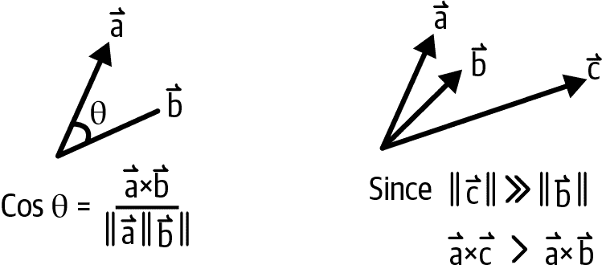
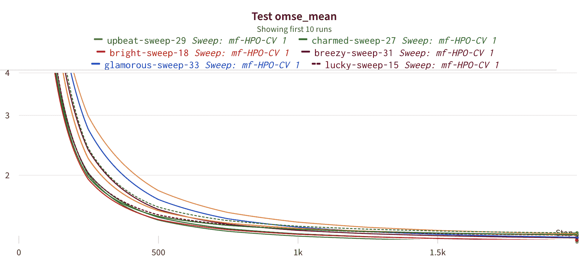
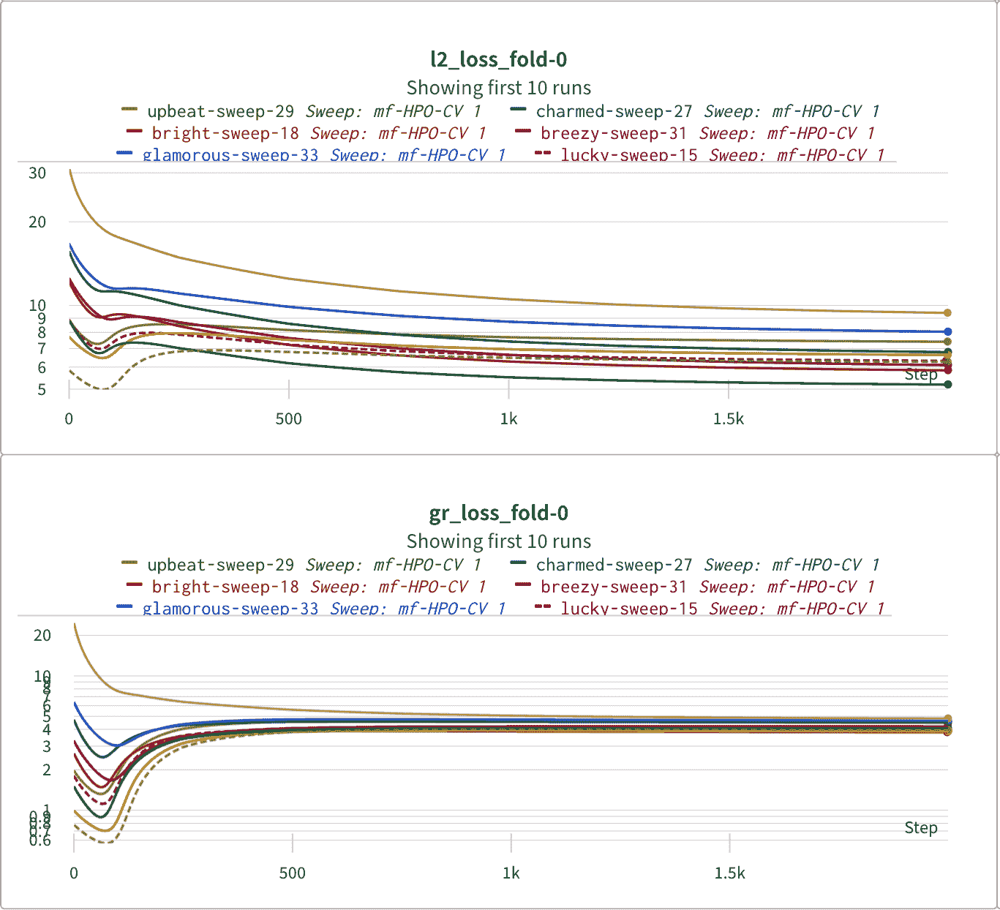
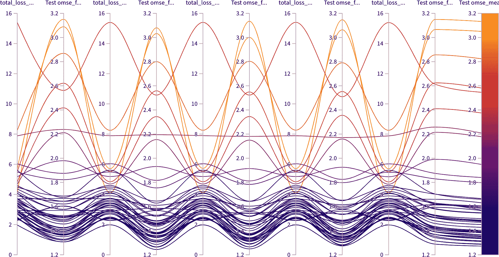
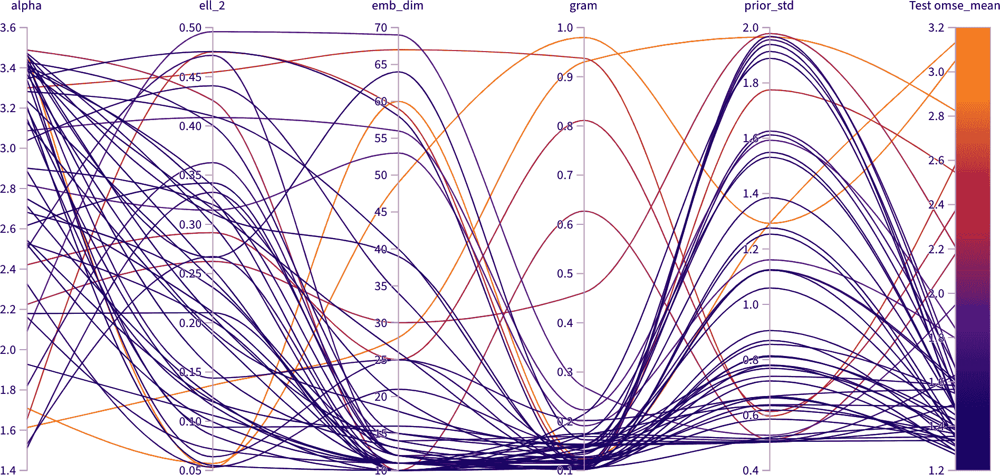
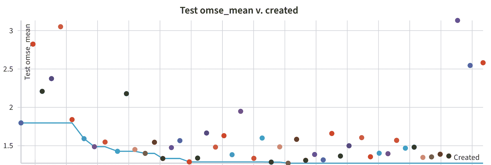

# 第十章：低秩方法

在前一章中，我们对处理这么多特征的挑战感到惋惜。通过让每个项目成为其自己的特征，我们能够表达大量关于用户偏好和项目相关性的信息，但在维度灾难方面我们陷入了麻烦。结合非常稀疏特征的现实，您面临危险。在本章中，我们将转向更小的特征空间。通过将用户和项目表示为低维向量，我们可以更有效地捕捉它们之间的复杂关系。这使我们能够为用户生成更个性化和相关的推荐，同时减少推荐过程的计算复杂性。

我们将探讨使用低维嵌入的方法，并讨论此方法的优势以及部分实现细节。我们还将查看在 JAX 中使用现代基于梯度的优化来减少项目或用户表示维度的代码。

# 潜在空间

您已经熟悉特征空间，通常是数据的分类或矢量值直接表示。这可以是图像的原始红色、绿色和蓝色值，直方图中项目的计数，或者对象的属性如长度、宽度和高度。另一方面，潜在特征不代表任何特定的实值特征，而是随机初始化，然后根据任务进行学习。我们在第八章中讨论的 GloVe 嵌入就是一个学习表示单词对数计数的潜在向量的例子。在这里，我们将介绍生成这些潜在特征或嵌入的更多方式。

# 专注于您的“优势”

本章非常依赖于线性代数，因此在继续之前，熟悉向量、点积和向量范数是很好的。了解矩阵及其秩也将非常有用。考虑阅读《线性代数及其应用》（[*Linear Algebra and Its Applications*](https://oreil.ly/8MBN8)），作者 Gilbert Strang。

潜在空间如此受欢迎的原因之一是它们通常比它们所代表的特征低维。例如，如果用户-物品评分矩阵或交互矩阵（其中矩阵条目为 1，如果用户与物品有交互）是 *N* × *M* 维度的，那么将矩阵分解为 *N* × *K* 和 *K* × *M* 的潜在因子，其中 *K* 远小于 *N* 或 *M*，是对缺失条目的一种近似，因为我们放宽了因子分解。 *K* 比 *N* 或 *M* 小通常被称为*信息瓶颈*—也就是说，我们正在强制矩阵由一个小得多的矩阵组成。这意味着 ML 模型必须填补缺失的条目，这对于推荐系统可能是有利的。只要用户与足够相似的物品有交互，通过强制系统在自由度方面容量大大减少，然后因子分解可以完全重构矩阵，并且缺失的条目往往会被相似的物品填补。

例如，当我们将一个 4 × 4 的用户-物品矩阵分解为一个 4 × 2 和一个 2 × 4 的向量时，会发生什么。

我们提供的矩阵的行是用户，列是物品。例如，第 0 行是 `[1, 0, 0, 1]`，这意味着用户 0 选择了物品 0 和物品 3。这些可以是评分或购买。现在让我们看一些代码：

```py
import numpy as np

a = np.array([
    [1, 0, 0 ,1],
    [1, 0, 0 ,0],
    [0, 1, 1, 0],
    [0, 1, 0, 0]]
)

u, s, v = np.linalg.svd(a, full_matrices=False)

# Set the last two eigenvalues to 0.
s[2:4] = 0
print(s)
b = np.dot(u * s, v)
print(b)

# These are the eigenvalues with the smallest two set to 0.
s = [1.61803399 1.61803399 0.         0.        ]

# This is the newly reconstructed matrix.
b = [[1.17082039 0.         0.         0.7236068 ]
 [0.7236068  0.         0.         0.4472136 ]
 [0.         1.17082039 0.7236068  0.        ]
 [0.         0.7236068  0.4472136  0.        ]]
```

请注意，现在第 1 行的用户在第 3 列有一个物品的分数，并且第 3 行的用户对第 2 列的物品有正分数。这种现象通常被称为*矩阵补全*，对于推荐系统来说是一个很好的特性，因为现在我们可以向用户推荐新的物品。通过强制让 ML 通过比其尝试重建的矩阵大小更小的瓶颈的一般方法被称为*低秩近似*，因为近似的秩为 2，但原始用户-物品矩阵的秩为 4。

# 矩阵的秩是什么？

*N* × *M* 矩阵可以被视为 *N* 行向量（对应用户）和 *M* 列向量（对应物品）。当你考虑 *M* 维度中 *N* 向量时，*矩阵的秩* 是由 *N* 个向量在 *M* 维度中定义的多面体的体积。然而，这与我们讨论矩阵秩的方式通常不同。虽然这是最自然和精确的定义，但我们却说它是“表示矩阵向量所需的最小维数。”

我们将在本章后面更详细地介绍 SVD。这只是为了激发你对理解潜在空间如何与推荐系统相关的兴趣。

# 点积相似度

在第三章中，我们介绍了相似度测量，但现在我们回到点积的概念，因为在潜在空间中它们变得更加重要。毕竟，潜在空间建立在距离即相似性的假设上。

在推荐系统中，点积相似度有意义，因为它提供了在潜在空间中用户与物品之间关系的几何解释（或者可能是物品与物品、用户与用户等）。在推荐系统的背景下，点积可以看作是一个向量在另一个向量上的投影，指示用户偏好与物品特性之间的相似度或对齐程度。

要理解点积的几何意义，考虑两个向量 *u* 和 *p*，分别表示潜在空间中的用户和产品。这两个向量的点积可以定义如下：

<math alttext="u times p equals StartAbsoluteValue EndAbsoluteValue u StartAbsoluteValue EndAbsoluteValue StartAbsoluteValue EndAbsoluteValue p StartAbsoluteValue EndAbsoluteValue c o s left-parenthesis theta right-parenthesis" display="block"><mrow><mi>u</mi> <mo>×</mo> <mi>p</mi> <mo>=</mo> <mo>|</mo> <mo>|</mo> <mi>u</mi> <mo>|</mo> <mo>|</mo> <mo>|</mo> <mo>|</mo> <mi>p</mi> <mo>|</mo> <mo>|</mo> <mi>c</mi> <mi>o</mi> <mi>s</mi> <mo>(</mo> <mi>θ</mi> <mo>)</mo></mrow></math>

这里，||u|| 和 ||p|| 表示用户向量和产品向量的大小，θ 表示它们之间的角度。因此，点积是一个衡量一个向量在另一个向量上投影的度量，其值受到两个向量大小的影响。

余弦相似度是推荐系统中另一个流行的相似度度量，直接源于点积：

<math alttext="c o s i n e s i m i l a r i t y left-parenthesis u comma p right-parenthesis equals StartFraction left-parenthesis u times p right-parenthesis Over left-parenthesis StartAbsoluteValue EndAbsoluteValue u StartAbsoluteValue EndAbsoluteValue StartAbsoluteValue EndAbsoluteValue p StartAbsoluteValue EndAbsoluteValue right-parenthesis EndFraction" display="block"><mrow><mi>c</mi> <mi>o</mi> <mi>s</mi> <mi>i</mi> <mi>n</mi> <mi>e</mi> <mi>s</mi> <mi>i</mi> <mi>m</mi> <mi>i</mi> <mi>l</mi> <mi>a</mi> <mi>r</mi> <mi>i</mi> <mi>t</mi> <mi>y</mi> <mrow><mo>(</mo> <mi>u</mi> <mo>,</mo> <mi>p</mi> <mo>)</mo></mrow> <mo>=</mo> <mstyle displaystyle="true" scriptlevel="0"><mfrac><mrow><mo>(</mo><mi>u</mi><mo>×</mo><mi>p</mi><mo>)</mo></mrow> <mrow><mo>(</mo><mo>|</mo><mo>|</mo><mi>u</mi><mo>|</mo><mo>|</mo><mo>|</mo><mo>|</mo><mi>p</mi><mo>|</mo><mo>|</mo><mo>)</mo></mrow></mfrac></mstyle></mrow></math>

余弦相似度的范围从 -1 到 1，其中 -1 表示完全不相似的偏好和特性。0 表示没有相似度，1 表示用户偏好与产品特性完全对齐。在推荐系统的背景下，余弦相似度提供了一个归一化的相似度度量，不受用户和产品向量大小的影响。需要注意，选择使用余弦相似度还是 L2 距离取决于您使用的嵌入类型以及优化计算的方式。在实践中，通常最重要的特征是相对值。

在推荐系统中，点积（以及余弦相似度）的几何解释是捕捉用户偏好与产品特性之间的对齐程度。如果用户向量和产品向量之间的角度很小，则用户偏好与产品特性很好地对齐，从而导致更高的相似度分数。相反，如果角度很大，则用户偏好与产品特性不相似，导致较低的相似度分数。通过将用户和物品向量投影到彼此上，点积相似度可以捕捉用户偏好与物品特性之间的对齐程度，从而使推荐系统能够识别最有可能与用户相关和吸引的物品。

传闻中，点积似乎捕捉到了流行度，因为非常长的向量倾向于容易投影到任何不完全垂直或指向远离的物体上。因此，存在一种权衡，即频繁推荐具有较大向量长度的热门物品与具有较小余弦距离角度差的长尾物品之间的权衡。

图 10-1 考虑了两个向量，*a* 和 *b*。使用余弦相似度时，向量是单位长度的，所以角度就是相似度的度量。然而，使用点积时，一个非常长的向量像 *c* 可能会被认为比 *b* 更相似 *a*，尽管 *a* 和 *b* 之间的角度更小，因为 *c* 的长度更长。这些长向量往往是与许多其他项目共同出现的非常流行的项目。



###### 图 10-1\. 余弦相似度与点积相似度

# 共现模型

在我们的维基百科共现示例中，我们确定了两个项目之间的共现结构可以用来生成相似度测量。我们讨论了如何使用 PMI 可以获取共现计数并基于购物车中的项与其他项之间非常高的互信息做出推荐。

正如我们所讨论的，PMI 不是一个距离度量，但基于共现仍具有重要的相似度度量。让我们回到这个话题。

之前提到过，PMI 的定义如下：

<math alttext="StartFraction p left-parenthesis x Subscript i Baseline comma x Subscript j Baseline right-parenthesis Over p left-parenthesis x Subscript i Baseline right-parenthesis asterisk p left-parenthesis x Subscript j Baseline right-parenthesis EndFraction equals StartFraction left-parenthesis upper C Subscript script upper I Baseline right-parenthesis Subscript x Sub Subscript i Subscript comma x Sub Subscript j Subscript Baseline asterisk number-sign left-parenthesis total interactions right-parenthesis Over number-sign left-parenthesis x Subscript i Baseline right-parenthesis asterisk number-sign left-parenthesis x Subscript j Baseline right-parenthesis EndFraction" display="block"><mrow><mstyle displaystyle="true" scriptlevel="0"><mfrac><mrow><mi>p</mi><mo>(</mo><msub><mi>x</mi> <mi>i</mi></msub> <mo>,</mo><msub><mi>x</mi> <mi>j</mi></msub> <mo>)</mo></mrow> <mrow><mi>p</mi><mrow><mo>(</mo><msub><mi>x</mi> <mi>i</mi></msub> <mo>)</mo></mrow><mo>*</mo><mi>p</mi><mrow><mo>(</mo><msub><mi>x</mi> <mi>j</mi></msub> <mo>)</mo></mrow></mrow></mfrac></mstyle> <mo>=</mo> <mstyle displaystyle="true" scriptlevel="0"><mfrac><mrow><msub><mfenced close=")" open="(" separators=""><msub><mi>C</mi> <mi>ℐ</mi></msub></mfenced> <mrow><msub><mi>x</mi> <mi>i</mi></msub> <mo>,</mo><msub><mi>x</mi> <mi>j</mi></msub></mrow></msub> <mo>*</mo><mo>#</mo><mfenced close=")" open="(" separators=""><mtext>total</mtext><mtext>interactions</mtext></mfenced></mrow> <mrow><mo>#</mo><mrow><mo>(</mo><msub><mi>x</mi> <mi>i</mi></msub> <mo>)</mo></mrow><mo>*</mo><mo>#</mo><mrow><mo>(</mo><msub><mi>x</mi> <mi>j</mi></msub> <mo>)</mo></mrow></mrow></mfrac></mstyle></mrow></math>

现在让我们考虑 *离散共现分布*，<math alttext="upper C upper D Subscript x Sub Subscript i"><mrow><mi>C</mi> <msub><mi>D</mi> <msub><mi>x</mi> <mi>i</mi></msub></msub></mrow></math> ，定义为所有其他 <math alttext="x Subscript j"><msub><mi>x</mi> <mi>j</mi></msub></math> 的共现的集合：

<math alttext="upper C upper D Subscript x Sub Subscript i Baseline equals left-parenthesis upper C Subscript script upper I Baseline right-parenthesis Subscript x Sub Subscript i Subscript comma x 1 Baseline comma ellipsis comma left-parenthesis upper C Subscript script upper I Baseline right-parenthesis Subscript x Sub Subscript i Subscript comma x Sub Subscript i Subscript Baseline comma ellipsis comma left-parenthesis upper C Subscript script upper I Baseline right-parenthesis Subscript x Sub Subscript i Subscript comma x Sub Subscript upper N Subscript Baseline" display="block"><mrow><mi>C</mi> <msub><mi>D</mi> <msub><mi>x</mi> <mi>i</mi></msub></msub> <mo>=</mo> <mrow><msub><mfenced close=")" open="(" separators=""><msub><mi>C</mi> <mi>ℐ</mi></msub></mfenced> <mrow><msub><mi>x</mi> <mi>i</mi></msub> <mo>,</mo><msub><mi>x</mi> <mn>1</mn></msub></mrow></msub> <mo>,</mo> <mo>...</mo> <mo>,</mo> <msub><mfenced close=")" open="(" separators=""><msub><mi>C</mi> <mi>ℐ</mi></msub></mfenced> <mrow><msub><mi>x</mi> <mi>i</mi></msub> <mo>,</mo><msub><mi>x</mi> <mi>i</mi></msub></mrow></msub> <mo>,</mo> <mo>...</mo> <mo>,</mo> <msub><mfenced close=")" open="(" separators=""><msub><mi>C</mi> <mi>ℐ</mi></msub></mfenced> <mrow><msub><mi>x</mi> <mi>i</mi></msub> <mo>,</mo><msub><mi>x</mi> <mi>N</mi></msub></mrow></msub></mrow></mrow></math>

在这里，<math alttext="j element-of 1 ellipsis upper N"><mrow><mi>j</mi> <mo>∈</mo> <mn>1</mn> <mo>...</mo> <mi>N</mi></mrow></math> ，而 <math alttext="upper N"><mi>N</mi></math> 是所有项目的总数。这表示 <math alttext="x Subscript i"><msub><mi>x</mi> <mi>i</mi></msub></math> 与所有其他项目之间的共现直方图。通过引入这种离散分布，我们可以利用另一个工具：Hellinger 距离。

我们可以用几种方法来衡量分布距离，每种方法都有不同的优势。在我们的讨论中，我们不会深入探讨这些差异，而是坚持使用最简单但最合适的方法。Hellinger 距离的定义如下：

<math alttext="upper H left-parenthesis upper P comma upper Q right-parenthesis equals NestedStartRoot 1 minus sigma-summation Underscript i Overscript n Endscripts StartRoot p Subscript i Baseline q Subscript i Baseline EndRoot NestedEndRoot equals StartFraction 1 Over StartRoot 2 EndRoot EndFraction double-vertical-bar StartRoot upper P EndRoot minus StartRoot upper Q EndRoot double-vertical-bar Subscript 2" display="block"><mrow><mi>H</mi> <mrow><mo>(</mo> <mi>P</mi> <mo>,</mo> <mi>Q</mi> <mo>)</mo></mrow> <mo>=</mo> <msqrt><mrow><mn>1</mn> <mo>-</mo> <msubsup><mo>∑</mo> <mi>i</mi> <mi>n</mi></msubsup> <msqrt><mrow><msub><mi>p</mi> <mi>i</mi></msub> <msub><mi>q</mi> <mi>i</mi></msub></mrow></msqrt></mrow></msqrt> <mo>=</mo> <mstyle displaystyle="true" scriptlevel="0"><mfrac><mn>1</mn> <msqrt><mn>2</mn></msqrt></mfrac></mstyle> <msub><mfenced close="∥" open="∥" separators=""><msqrt><mi>P</mi></msqrt><mo>-</mo><msqrt><mi>Q</mi></msqrt></mfenced> <mn>2</mn></msub></mrow></math>

<math alttext="upper P equals mathematical left-angle p Subscript i Baseline mathematical right-angle"><mrow><mi>P</mi> <mo>=</mo> <mfenced close="〉" open="〈" separators=""><msub><mi>p</mi> <mi>i</mi></msub></mfenced></mrow></math> 和 <math alttext="upper Q equals mathematical left-angle q Subscript i Baseline mathematical right-angle"><mrow><mi>Q</mi> <mo>=</mo> <mfenced close="〉" open="〈" separators=""><msub><mi>q</mi> <mi>i</mi></msub></mfenced></mrow></math> 是两个概率密度向量。在我们的设定中，<math alttext="upper P"><mi>P</mi></math> 和 <math alttext="upper Q"><mi>Q</mi></math> 可以是 <math alttext="upper C upper D Subscript x Sub Subscript i"><mrow><mi>C</mi> <msub><mi>D</mi> <msub><mi>x</mi> <mi>i</mi></msub></msub></mrow></math> 和 <math alttext="upper C upper D Subscript x Sub Subscript j"><mrow><mi>C</mi> <msub><mi>D</mi> <msub><mi>x</mi> <mi>j</mi></msub></msub></mrow></math> 。

这个过程背后的动机是，我们现在有了基于共现的物品之间的适当距离。我们可以在这种几何上使用任何维度转换或减少。稍后我们将展示可以使用任意距离矩阵并将空间减少到逼近它的低维嵌入的维度减少技术。

# 测度空间和信息理论呢？

当我们讨论分布时，你可能会想知道，“是否存在一种距离使得分布在潜在空间中是点？”哦，你没有想到？好吧，我们无论如何会解决这个问题。

简短的答案是，我们可以衡量分布之间的差异。最流行的是库尔巴克-莱布勒（KL）散度，通常在贝叶斯意义下描述为预期分布 Q 时看到分布 P 的惊讶程度。然而，KL 不是一个适当的距离度量，因为它是非对称的。

另一个具有良好性质的对称距离度量是海林格距离。海林格距离实际上是二范数的测度论距离。此外，海林格距离自然地推广到离散分布。

如果这仍然没有解决你对抽象的渴望，我们还可以考虑总变分距离，这是在费舍尔精确距离测度空间中的极限，这实际上意味着它具有两个分布距离的所有良好性质，并且没有测量会认为它们更不同。嗯，所有的良好性质除了一个：它不平滑。如果你还希望具有平滑性和可微性，你需要通过偏移来近似它。

如果你需要计算分布之间的距离，可以使用海林格距离。

# 减少推荐问题的排名

我们已经表明，随着物品和用户数量的增加，我们推荐问题的维度迅速增加。因为我们将每个项目和用户表示为一列或向量，这类似于<math alttext="n squared"><msup><mi>n</mi> <mn>2</mn></msup></math>的规模。推迟这一困难的一种方法是通过降秩；回想我们之前关于通过因子分解进行降秩的讨论。

像许多整数一样，许多矩阵可以被*分解*成更小的矩阵；对于整数来说，*更小*意味着更小的值，对于矩阵来说，*更小*意味着更小的维度。当我们分解一个<math alttext="upper N times upper M"><mrow><mi>N</mi> <mo>×</mo> <mi>M</mi></mrow></math>矩阵时，我们会寻找两个矩阵<math alttext="upper U Subscript upper N times d"><msub><mi>U</mi> <mrow><mi>N</mi><mo>×</mo><mi>d</mi></mrow></msub></math>和<math alttext="upper V Subscript d times upper M"><msub><mi>V</mi> <mrow><mi>d</mi><mo>×</mo><mi>M</mi></mrow></msub></math>；请注意，当您将矩阵相乘时，它们必须共享一个维度，并且该维度被消除，留下另外两个维度。在这里，我们将考虑当<math alttext="d less-than-or-equal-to upper N"><mrow><mi>d</mi> <mo>≤</mo> <mi>N</mi></mrow></math>和<math alttext="d less-than-or-equal-to upper M"><mrow><mi>d</mi> <mo>≤</mo> <mi>M</mi></mrow></math>时的 MF。通过分解矩阵，我们要求两个矩阵，它们可以等于或近似于原始矩阵：

<math alttext="upper A Subscript i comma j Baseline asymptotically-equals mathematical left-angle upper U Subscript i Baseline comma upper V Subscript j Baseline mathematical right-angle" display="block"><mrow><msub><mi>A</mi> <mrow><mi>i</mi><mo>,</mo><mi>j</mi></mrow></msub> <mo>≃</mo> <mfenced close="〉" open="〈" separators=""><msub><mi>U</mi> <mi>i</mi></msub> <mo>,</mo> <msub><mi>V</mi> <mi>j</mi></msub></mfenced></mrow></math>

我们寻求一个小的值<math alttext="d"><mi>d</mi></math>来减少潜在维度的数量。正如您可能已经注意到的那样，每个矩阵<math alttext="upper U Subscript upper N times d"><msub><mi>U</mi> <mrow><mi>N</mi><mo>×</mo><mi>d</mi></mrow></msub></math>和<math alttext="upper V Subscript d times upper M"><msub><mi>V</mi> <mrow><mi>d</mi><mo>×</mo><mi>M</mi></mrow></msub></math>将对应于原始评分矩阵的行或列。然而，它们以更少的维度表示。这利用了*低维潜在空间*的概念。直观地说，潜在空间旨在以两组关系表示与完整<math alttext="upper N times upper M"><mrow><mi>N</mi> <mo>×</mo> <mi>M</mi></mrow></math>维关系相同的关系：项目与潜在特征之间的关系，以及用户与潜在特征之间的关系。

这些方法在其他类型的机器学习中也很受欢迎，但对于我们的案例，我们主要将研究对评分或交互矩阵进行因子分解的问题。

考虑 MF 时，您经常必须克服一些挑战：

+   您希望分解的矩阵是稀疏的，并且通常是非负的和/或二进制的。

+   每个项目向量中的非零元素数量可能会有很大的变化，正如我们在马太效应中看到的那样。

+   矩阵分解的复杂度是立方的。

+   SVD 和其他全秩方法在没有填补的情况下无法工作，填补本身也很复杂。

我们将通过一些替代优化方法来解决这些问题。

## 优化 MF 与 ALS

我们希望执行的基本优化如下：

<math alttext="upper A Subscript i comma j Baseline asymptotically-equals mathematical left-angle upper U Subscript i Baseline comma upper V Subscript j Baseline mathematical right-angle" display="block"><mrow><msub><mi>A</mi> <mrow><mi>i</mi><mo>,</mo><mi>j</mi></mrow></msub> <mo>≃</mo> <mfenced close="〉" open="〈" separators=""><msub><mi>U</mi> <mi>i</mi></msub> <mo>,</mo> <msub><mi>V</mi> <mi>j</mi></msub></mfenced></mrow></math>

值得注意的是，如果您希望直接优化矩阵条目，则需要同时优化<math alttext="d squared asterisk upper N asterisk upper M"><mrow><msup><mi>d</mi> <mn>2</mn></msup> <mo>*</mo> <mi>N</mi> <mo>*</mo> <mi>M</mi></mrow></math>个元素，这些元素对应于这些因子化中的参数数量。然而，通过交替调整一个或另一个矩阵，我们可以轻松实现显著的加速。这称为*交替最小二乘*，通常简称为*ALS*，这是解决此问题的一种常见方法。与在每次传递中向两个矩阵的所有项后向传播更新不同，您可以仅更新两个矩阵中的一个，从而大大减少需要进行的计算数量。

ALS 试图在<math alttext="upper U"><mi>U</mi></math>和<math alttext="upper V"><mi>V</mi></math>之间来回切换，评估相同的损失函数，但每次仅更新一个矩阵的权重：

<math alttext="StartLayout 1st Row 1st Column Blank 2nd Column upper U left-arrow upper U minus eta asterisk upper U asterisk nabla upper U asterisk script upper D left-parenthesis upper A comma upper U upper V right-parenthesis 2nd Row 1st Column Blank 2nd Column upper V left-arrow upper V minus eta asterisk upper V asterisk nabla upper V asterisk script upper D left-parenthesis upper A comma upper U upper V right-parenthesis EndLayout" display="block"><mtable displaystyle="true"><mtr><mtd columnalign="left"><mrow><mi>U</mi> <mo>←</mo> <mi>U</mi> <mo>-</mo> <mi>η</mi> <mo>*</mo> <mi>U</mi> <mo>*</mo> <mi>∇</mi> <mi>U</mi> <mo>*</mo> <mi>𝒟</mi> <mfenced close=")" open="(" separators=""><mi>A</mi> <mo>,</mo> <mi>U</mi> <mi>V</mi></mfenced></mrow></mtd></mtr> <mtr><mtd columnalign="left"><mrow><mi>V</mi> <mo>←</mo> <mi>V</mi> <mo>-</mo> <mi>η</mi> <mo>*</mo> <mi>V</mi> <mo>*</mo> <mi>∇</mi> <mi>V</mi> <mo>*</mo> <mi>𝒟</mi> <mfenced close=")" open="(" separators=""><mi>A</mi> <mo>,</mo> <mi>U</mi> <mi>V</mi></mfenced></mrow></mtd></mtr></mtable></math>

在这里，<math alttext="eta"><mi>η</mi></math>是学习率，<math alttext="script upper D"><mi>𝒟</mi></math>是我们选择的距离函数。我们稍后会详细介绍这个距离函数。在我们继续之前，让我们考虑这里的一些复杂性：

+   每个更新规则都需要相对于相关因子矩阵的梯度。

+   我们一次更新一个完整的因子矩阵，但在因子矩阵的乘积与原始矩阵之间评估损失。

+   我们有一个神秘的距离函数。

+   通过我们构建这种优化的方式，我们隐含地假设我们将使用这个过程来使两个近似的矩阵收敛（通常还会对迭代次数施加限制）。

在 JAX 中，这些优化将很容易实现，并且我们将看到等式形式和 JAX 代码看起来有多么相似。

# 矩阵之间的距离

我们可以以多种方式确定两个矩阵之间的距离。正如我们之前所见，对于向量的不同距离测量从底层空间提供了不同的解释。对于这些计算，我们不会有太多复杂性，但这值得一小段观察。最明显的方法是你已经看到的*观察到的均方误差*：

<math alttext="StartFraction sigma-summation Underscript normal upper Omega Endscripts left-parenthesis upper A Subscript i comma j Baseline minus mathematical left-angle upper U Subscript i Baseline comma upper V Subscript j Baseline mathematical right-angle right-parenthesis squared Over 1 normal upper Omega vertical-bar EndFraction"><mstyle displaystyle="true" scriptlevel="0"><mfrac><mrow><msub><mo>∑</mo> <mi>Ω</mi></msub> <msup><mfenced close=")" open="(" separators=""><msub><mi>A</mi> <mrow><mi>i</mi><mo>,</mo><mi>j</mi></mrow></msub> <mo>-</mo><mfenced close="〉" open="〈" separators=""><msub><mi>U</mi> <mi>i</mi></msub> <mo>,</mo><msub><mi>V</mi> <mi>j</mi></msub></mfenced></mfenced> <mn>2</mn></msup></mrow> <mrow><mn>1</mn><mi>Ω</mi><mo>|</mo></mrow></mfrac></mstyle></math>

当用户向量只有一个非零条目（或者说最大评分）时，观察到的均方误差的一个有用替代方法是使用交叉熵损失，这样可以提供一个*逻辑 MF*，从而得到概率估计。有关如何实现此操作的更多详细信息，请参阅 Kyle Chung 的[“推荐系统的矩阵分解”教程](https://oreil.ly/7qWy6)。

在我们观察到的评分中，我们预期（并看到！）有大量缺失值和一些具有过多评分的项目向量。这表明我们应该考虑非均匀加权的矩阵。接下来我们将讨论如何通过正则化来考虑这些和其他变体。

## MF 的正则化

*加权交替最小二乘*（WALS）与 ALS 类似，但试图更优雅地解决这两个数据问题。在 WALS 中，分配给每个观察到的评分的权重与用户或项目的观察到的评分数成反比。因此，对于评分较少的用户或项目的观察到的评分在优化过程中被赋予更大的权重。

我们可以将这些权重作为我们最终损失函数中的正则化参数应用：

<math alttext="StartFraction sigma-summation Underscript normal upper Omega Endscripts left-parenthesis upper A Subscript i comma j Baseline minus less-than upper U Subscript i Baseline comma upper V Subscript j Baseline greater-than right-parenthesis squared Over StartAbsoluteValue normal upper Omega EndAbsoluteValue EndFraction plus StartFraction 1 Over upper N EndFraction sigma-summation StartAbsoluteValue upper U EndAbsoluteValue" display="block"><mrow><mstyle displaystyle="true" scriptlevel="0"><mfrac><mrow><msub><mo>∑</mo> <mi>Ω</mi></msub> <msup><mfenced close=")" open="(" separators=""><msub><mi>A</mi> <mrow><mi>i</mi><mo>,</mo><mi>j</mi></mrow></msub> <mo>-</mo><mo><</mo><msub><mi>U</mi> <mi>i</mi></msub> <mo>,</mo><msub><mi>V</mi> <mi>j</mi></msub> <mo>></mo></mfenced> <mn>2</mn></msup></mrow> <mrow><mo>|</mo><mi>Ω</mi><mo>|</mo></mrow></mfrac></mstyle> <mo>+</mo> <mstyle displaystyle="true" scriptlevel="0"><mfrac><mn>1</mn> <mi>N</mi></mfrac></mstyle> <mo>∑</mo> <mrow><mo>|</mo> <mi>U</mi> <mo>|</mo></mrow></mrow></math>

其他正则化方法对于 MF 也很重要，并且很受欢迎。我们将讨论这两种强大的正则化技术：

+   权重衰减

+   Gramian 正则化

像往常一样，*权重衰减* 是我们的 <math alttext="l squared"><msup><mi>l</mi> <mn>2</mn></msup></math> 正则化，这种情况下是 Frobenius 范数的水平，即权重矩阵的大小。一个优雅的观点是，这种权重衰减是在最小化*奇异值*的大小。

类似地，MF 还有另一种看起来非常标准但计算方式完全不同的正则化技术。这是通过 Gramians——本质上是正则化单个矩阵条目的大小，但在优化中有一个优雅的技巧。特别地，矩阵 <math alttext="upper U"><mi>U</mi></math> 的 Gramian 是乘积 <math alttext="upper U Superscript upper T Baseline upper U"><mrow><msup><mi>U</mi> <mi>T</mi></msup> <mi>U</mi></mrow></math> 。敏锐的读者可能会认出这个术语，因为它与我们先前用于计算二进制矩阵的共现的术语相同。联系在于两者都只是试图找到矩阵行和列之间点积的有效表示方式。

这些正则化是 Frobenius 项：

<math alttext="upper R left-parenthesis upper U comma upper V right-parenthesis equals StartFraction 1 Over upper N EndFraction sigma-summation Underscript i Overscript upper N Endscripts StartAbsoluteValue upper U Subscript i Baseline EndAbsoluteValue Subscript 2 Superscript 2 Baseline plus StartFraction 1 Over upper M EndFraction sigma-summation Underscript j Overscript upper M Endscripts StartAbsoluteValue upper V Subscript j Baseline EndAbsoluteValue Subscript 2 Superscript 2" display="block"><mstyle displaystyle="true" scriptlevel="0"><mrow><mi>R</mi> <mrow><mo>(</mo> <mi>U</mi> <mo>,</mo> <mi>V</mi> <mo>)</mo></mrow> <mo>=</mo> <mfrac><mn>1</mn> <mi>N</mi></mfrac> <munderover><mo>∑</mo> <mi>i</mi> <mi>N</mi></munderover> <mrow><mo>|</mo></mrow> <msub><mi>U</mi> <mi>i</mi></msub> <msubsup><mrow><mo>|</mo></mrow> <mn>2</mn> <mn>2</mn></msubsup> <mo>+</mo> <mfrac><mn>1</mn> <mi>M</mi></mfrac> <munderover><mo>∑</mo> <mi>j</mi> <mi>M</mi></munderover> <msubsup><mrow><mo>|</mo><msub><mi>V</mi> <mi>j</mi></msub> <mo>|</mo></mrow> <mn>2</mn> <mn>2</mn></msubsup></mrow></mstyle></math>

或者，展开来说，方程看起来像这样：

<math alttext="upper R left-parenthesis upper U comma upper V right-parenthesis equals StartFraction 1 Over upper N EndFraction sigma-summation Underscript i Overscript upper N Endscripts sigma-summation Underscript k Overscript d Endscripts upper U Subscript i comma k Superscript 2 Baseline plus StartFraction 1 Over upper M EndFraction sigma-summation Underscript j Overscript upper M Endscripts sigma-summation Underscript l Overscript d Endscripts upper V Subscript j comma l Superscript 2" display="block"><mstyle displaystyle="true" scriptlevel="0"><mrow><mi>R</mi> <mrow><mo>(</mo> <mi>U</mi> <mo>,</mo> <mi>V</mi> <mo>)</mo></mrow> <mo>=</mo> <mfrac><mn>1</mn> <mi>N</mi></mfrac> <munderover><mo>∑</mo> <mi>i</mi> <mi>N</mi></munderover> <munderover><mo>∑</mo> <mi>k</mi> <mi>d</mi></munderover> <msubsup><mi>U</mi> <mrow><mi>i</mi><mo>,</mo><mi>k</mi></mrow> <mn>2</mn></msubsup> <mo>+</mo> <mfrac><mn>1</mn> <mi>M</mi></mfrac> <munderover><mo>∑</mo> <mi>j</mi> <mi>M</mi></munderover> <munderover><mo>∑</mo> <mi>l</mi> <mi>d</mi></munderover> <msubsup><mi>V</mi> <mrow><mi>j</mi><mo>,</mo><mi>l</mi></mrow> <mn>2</mn></msubsup></mrow></mstyle></math>

这些是 Gramian 项：

<math alttext="StartLayout 1st Row 1st Column upper G left-parenthesis upper U comma upper V right-parenthesis 2nd Column colon equals StartFraction 1 Over upper N dot upper M EndFraction sigma-summation Underscript i Overscript upper N Endscripts sigma-summation Underscript j Overscript upper M Endscripts mathematical left-angle upper U Subscript i Baseline comma upper V Subscript j Baseline mathematical right-angle squared 2nd Row 1st Column Blank 3rd Row 1st Column Blank 2nd Column equals StartFraction 1 Over upper N dot upper M EndFraction asterisk sigma-summation Underscript k comma l Overscript d Endscripts left-parenthesis upper U Superscript upper T Baseline upper U asterisk upper V Superscript upper T Baseline upper V right-parenthesis Subscript k comma l Baseline EndLayout period" display="block"><mrow><mtable><mtr><mtd columnalign="left"><mrow><mi>G</mi> <mo>(</mo> <mi>U</mi> <mo>,</mo> <mi>V</mi> <mo>)</mo></mrow></mtd> <mtd columnalign="left"><mstyle displaystyle="true" scriptlevel="0"><mrow><mo>:</mo> <mo>=</mo> <mfrac><mn>1</mn> <mrow><mi>N</mi><mo>·</mo><mi>M</mi></mrow></mfrac> <munderover><mo>∑</mo> <mi>i</mi> <mi>N</mi></munderover> <munderover><mo>∑</mo> <mi>j</mi> <mi>M</mi></munderover> <msup><mfenced close="〉" open="〈" separators=""><msub><mi>U</mi> <mi>i</mi></msub> <mo>,</mo><msub><mi>V</mi> <mi>j</mi></msub></mfenced> <mn>2</mn></msup></mrow></mstyle></mtd></mtr> <mtr><mtd columnalign="left"><mstyle displaystyle="true" scriptlevel="0"><mrow><mo>=</mo> <mfrac><mn>1</mn> <mrow><mi>N</mi><mo>·</mo><mi>M</mi></mrow></mfrac> <mo>*</mo> <munderover><mo>∑</mo> <mrow><mi>k</mi><mo>,</mo><mi>l</mi></mrow> <mi>d</mi></munderover> <msub><mfenced close=")" open="(" separators=""><msup><mi>U</mi> <mi>T</mi></msup> <mi>U</mi><mo>*</mo><msup><mi>V</mi> <mi>T</mi></msup> <mi>V</mi></mfenced> <mrow><mi>k</mi><mo>,</mo><mi>l</mi></mrow></msub></mrow></mstyle></mtd></mtr></mtable> <mo>.</mo></mrow></math>

最后，我们有我们的损失函数：

<math alttext="StartFraction 1 Over StartAbsoluteValue normal upper Omega EndAbsoluteValue EndFraction sigma-summation Underscript left-parenthesis i comma j right-parenthesis element-of normal upper Omega Endscripts left-parenthesis upper A Subscript i j Baseline minus mathematical left-angle upper U Subscript i Baseline comma upper V Subscript j Baseline mathematical right-angle right-parenthesis squared plus lamda Subscript upper R Baseline left-parenthesis StartFraction 1 Over upper N EndFraction sigma-summation Underscript i Overscript upper N Endscripts sigma-summation Underscript k Overscript d Endscripts upper U Subscript i comma k Superscript 2 Baseline plus StartFraction 1 Over upper M EndFraction sigma-summation Underscript j Overscript upper M Endscripts sigma-summation Underscript l Overscript d Endscripts upper V Subscript j comma l Superscript 2 Baseline right-parenthesis plus lamda Subscript upper G Baseline left-parenthesis StartFraction 1 Over upper N dot upper M EndFraction asterisk sigma-summation Underscript k comma l Overscript d Endscripts left-parenthesis upper U Superscript upper T Baseline upper U asterisk upper V Superscript upper T Baseline upper V right-parenthesis Subscript k comma l Baseline right-parenthesis" display="block"><mstyle displaystyle="true" scriptlevel="0"><mrow><mfrac><mn>1</mn> <mrow><mo>|</mo><mi>Ω</mi><mo>|</mo></mrow></mfrac> <munder><mo>∑</mo> <mrow><mo>(</mo><mi>i</mi><mo>,</mo><mi>j</mi><mo>)</mo><mo>∈</mo><mi>Ω</mi></mrow></munder> <msup><mrow><mo>(</mo><msub><mi>A</mi> <mrow><mi>i</mi><mi>j</mi></mrow></msub> <mo>-</mo><mrow><mo>〈</mo><msub><mi>U</mi> <mi>i</mi></msub> <mo>,</mo><msub><mi>V</mi> <mi>j</mi></msub> <mo>〉</mo></mrow><mo>)</mo></mrow> <mn>2</mn></msup> <mo>+</mo> <msub><mi>λ</mi> <mi>R</mi></msub> <mfenced close=")" open="(" separators=""><mfrac><mn>1</mn> <mi>N</mi></mfrac> <munderover><mo>∑</mo> <mi>i</mi> <mi>N</mi></munderover> <munderover><mo>∑</mo> <mi>k</mi> <mi>d</mi></munderover> <msubsup><mi>U</mi> <mrow><mi>i</mi><mo>,</mo><mi>k</mi></mrow> <mn>2</mn></msubsup> <mo>+</mo> <mfrac><mn>1</mn> <mi>M</mi></mfrac> <munderover><mo>∑</mo> <mi>j</mi> <mi>M</mi></munderover> <munderover><mo>∑</mo> <mi>l</mi> <mi>d</mi></munderover> <msubsup><mi>V</mi> <mrow><mi>j</mi><mo>,</mo><mi>l</mi></mrow> <mn>2</mn></msubsup></mfenced> <mo>+</mo> <msub><mi>λ</mi> <mi>G</mi></msub> <mfenced close=")" open="(" separators=""><mfrac><mn>1</mn> <mrow><mi>N</mi><mo>·</mo><mi>M</mi></mrow></mfrac> <mo>*</mo> <munderover><mo>∑</mo> <mrow><mi>k</mi><mo>,</mo><mi>l</mi></mrow> <mi>d</mi></munderover> <msub><mfenced close=")" open="(" separators=""><msup><mi>U</mi> <mi>T</mi></msup> <mi>U</mi><mo>*</mo><msup><mi>V</mi> <mi>T</mi></msup> <mi>V</mi></mfenced> <mrow><mi>k</mi><mo>,</mo><mi>l</mi></mrow></msub></mfenced></mrow></mstyle></math>

## 正则化的 MF 实现

到目前为止，我们已经写了*很多*数学符号，但所有这些符号都使我们能够得出一个非常强大的模型。*正则化矩阵因子分解*是一个有效的中等规模推荐问题模型。这种模型类型在许多严肃的企业中仍然在使用。MF 实现的一个经典问题是性能，但因为我们使用 JAX，在这里有极好的本地 GPU 支持，我们的实现实际上可以比像[PyTorch 示例](https://oreil.ly/U-K-V)中找到的更紧凑。

让我们通过 Gramians 的双重正则化模型来预测用户-项目矩阵中的评分会是怎样的模型。

首先，我们将进行简单的设置。这将假设您的评分矩阵已经在 wandb 上了：

```py
import jax
import jax.numpy as jnp
import numpy as np
import pandas as pd
import os, json, wandb, math

from jax import grad, jit
from jax import random
from jax.experimental import sparse

key = random.PRNGKey(0)

wandb.login()
run = wandb.init(
    # Set entity to specify your username or team name
    entity="wandb-un",
    # Set the project where this run will be logged
    project="jax-mf",
    # associate the runs to the right dataset
    config={
      "dataset": "MF-Dataset",
    }
)

# note that we assume the dataset is a ratings table stored in wandb
artifact = run.use_artifact('stored-dataset:latest')
ratings_artifact = artifact.download()
ratings_artifact_blob = json.load(
    open(
        os.path.join(
            ratings_artifact,
            'ratings.table.json'
        )
    )
)

ratings_artifact_blob.keys()
# ['_type', 'column_types', 'columns', 'data', 'ncols', 'nrows']

ratings = pd.DataFrame( # user_id, item_id, rating, unix_timestamp
    data=ratings_artifact_blob['data'],
    columns=ratings_artifact_blob['columns']
)

def start_pipeline(df):
    return df.copy()

def column_as_type(df, column: str, cast_type):
    df[column] = df[column].astype(cast_type)
    return df

def rename_column_value(df, target_column, prior_val, post_val):
    df[target_column] = df[target_column].replace({prior_val: post_val})
    return df

def split_dataframe(df, holdout_fraction=0.1):
    """Splits a DataFrame into training and test sets.
 Args:
 df: a dataframe.
 holdout_fraction: fraction of dataframe rows to use in the test set.
 Returns:
 train: dataframe for training
 test: dataframe for testing
 """
    test = df.sample(frac=holdout_fraction, replace=False)
    train = df[~df.index.isin(test.index)]
    return train, test

all_rat = (ratings
    .pipe(start_pipeline)
    .pipe(column_as_type, column='user_id', cast_type=int)
    .pipe(column_as_type, column='item_id', cast_type=int)
)

def ratings_to_sparse_array(ratings_df, user_dim, item_dim):
    indices = (np.array(ratings_df['user_id']), np.array(ratings_df['item_id']))
    values = jnp.array(ratings_df['rating'])

    return {
        'indices': indices,
        'values': values,
        'shape': [user_dim, item_dim]
    }

def random_normal(pr_key, shape, mu=0, sigma=1, ):
    return (mu + sigma * random.normal(pr_key, shape=shape))

x = random_normal(
    pr_key = random.PRNGKey(1701),
    shape=(10000,),
    mu = 1.0,
    sigma = 3.0,
) # these hyperparameters are pretty meaningless

def sp_mse_loss(A, params):
    U, V = params['users'], params['items']
    rows, columns = A['indices']
    estimator = -(U @ V.T)[(rows, columns)]
    square_err = jax.tree_map(
        lambda x: x**2,
        A['values']+estimator
    )
    return jnp.mean(square_err)

omse_loss = jit(sp_mse_loss)
```

请注意，我们不得不在这里实现我们自己的损失函数。这是一个相对简单的均方误差（MSE）损失，但它利用了我们矩阵的稀疏性质。你可能会在代码中注意到，我们已经将矩阵转换为稀疏表示，因此我们的损失函数不仅可以利用该表示，还可以编写为利用 JAX 设备数组和映射/编译的形式。

# 这个损失函数真的正确吗？

如果你对这种像魔术般出现的损失函数感到好奇，我们理解。在写这本书的时候，我们对利用 JAX 的这种损失函数的最佳实现非常不确定。实际上，有很多合理的方法可以进行这种优化。为此，我们编写了一个公共实验来对几种方法进行基准测试[在 Colab 上](https://oreil.ly/6zwEX)。

接下来，我们需要构建模型对象来处理我们训练时的 MF 状态。尽管这段代码基本上大多是模板代码，但它会以相对内存高效的方式为我们设置好，以便将模型馈送到训练循环中。这个模型是在一台 MacBook Pro 上，在不到一天的时间里，对 100 万条记录进行了几千次迭代的训练：

```py
class CFModel(object):
    """Simple class that represents a collaborative filtering model"""
    def __init__(
          self,
          metrics: dict,
          embeddings: dict,
          ground_truth: dict,
          embeddings_parameters: dict,
          prng_key=None
    ):
        """Initializes a CFModel.
 Args:
 """
        self._metrics = metrics
        self._embeddings = embeddings
        self._ground_truth = ground_truth
        self._embeddings_parameters = embeddings_parameters

        if prng_key is None:
            prng_key = random.PRNGKey(0)
        self._prng_key = prng_key

    @property
    def embeddings(self):
        """The embeddings dictionary."""
        return self._embeddings

    @embeddings.setter
    def embeddings(self, value):
        self._embeddings = value

    @property
    def metrics(self):
        """The metrics dictionary."""
        return self._metrics

    @property
    def ground_truth(self):
        """The train/test dictionary."""
        return self._ground_truth

    def reset_embeddings(self):
        """Clear out embeddings state."""

        prng_key1, prng_key2 = random.split(self._prng_key, 2)

        self._embeddings['users'] = random_normal(
            prng_key1,
            [
              self._embeddings_parameters['user_dim'],
              self._embeddings_parameters['embedding_dim']
            ],
            mu=0,
            sigma=self._embeddings_parameters['init_stddev'],
        )
        self._embeddings['items'] = random_normal(
            prng_key2,
            [
              self._embeddings_parameters['item_dim'],
              self._embeddings_parameters['embedding_dim']],
            mu=0,
            sigma=self._embeddings_parameters['init_stddev'],
        )

def model_constructor(
    ratings_df,
    user_dim,
    item_dim,
    embedding_dim=3,
    init_stddev=1.,
    holdout_fraction=0.2,
    prng_key=None,
    train_set=None,
    test_set=None,
):
    if prng_key is None:
      prng_key = random.PRNGKey(0)

    prng_key1, prng_key2 = random.split(prng_key, 2)

    if (train_set is None) and (test_set is None):
        train, test = (ratings_df
            .pipe(start_pipeline)
            .pipe(split_dataframe, holdout_fraction=holdout_fraction)
        )

        A_train = (train
            .pipe(start_pipeline)
            .pipe(ratings_to_sparse_array, user_dim=user_dim, item_dim=item_dim)
        )
        A_test = (test
            .pipe(start_pipeline)
            .pipe(ratings_to_sparse_array, user_dim=user_dim, item_dim=item_dim)
        )
    elif (train_set is None) ^ (test_set is None):
        raise('Must send train and test if sending one')
    else:
        A_train, A_test = train_set, test_set

    U = random_normal(
        prng_key1,
        [user_dim, embedding_dim],
        mu=0,
        sigma=init_stddev,
    )
    V = random_normal(
        prng_key2,
        [item_dim, embedding_dim],
        mu=0,
        sigma=init_stddev,
    )

    train_loss = omse_loss(A_train, {'users': U, 'items': V})
    test_loss = omse_loss(A_test, {'users': U, 'items': V})

    metrics = {
        'train_error': train_loss,
        'test_error': test_loss
    }
    embeddings = {'users': U, 'items': V}
    ground_truth = {
        "A_train": A_train,
        "A_test": A_test
    }
    return CFModel(
        metrics=metrics,
        embeddings=embeddings,
        ground_truth=ground_truth,
        embeddings_parameters={
            'user_dim': user_dim,
            'item_dim': item_dim,
            'embedding_dim': embedding_dim,
            'init_stddev': init_stddev,
        },
        prng_key=prng_key,
    )

mf_model = model_constructor(all_rat, user_count, item_count)
```

我们还应该设置好，以便在 wandb 上进行良好的记录，这样在训练过程中就很容易理解发生了什么：

```py
def train():
  run_config = { # These will be hyperparameters we will tune via wandb
      'emb_dim': 10, # Latent dimension
      'prior_std': 0.1, # Std dev around 0 for weights initialization
      'alpha': 1.0, # Learning rate
      'steps': 1500, # Number of training steps
  }

  with wandb.init() as run:
    run_config.update(run.config)
    model_object = model_constructor(
        ratings_df=all_rat,
        user_dim=user_count,
        item_dim=item_count,
        embedding_dim=run_config['emb_dim'],
        init_stddev=run_config['prior_std'],
        prng_key=random.PRNGKey(0),
        train_set=mf_model.ground_truth['A_train'],
        test_set=mf_model.ground_truth['A_test']
    )
    model_object.reset_embeddings() # Ensure we are starting from priors
    alpha, steps = run_config['alpha'], run_config['steps']
    print(run_config)
    grad_fn = jax.value_and_grad(omse_loss, 1)
    for i in range(steps):
      # We perform one gradient update
      loss_val, grads = grad_fn(
          model_object.ground_truth['A_train'],
          model_object.embeddings
      )
      model_object.embeddings = jax.tree_multimap(
          lambda p, g: p - alpha * g,
          # Basic update rule; JAX handles broadcasting for us
          model_object.embeddings,
          grads
      )
      if i % 1000 == 0: # Most output in wandb; little bit of logging
        print(f'Loss step {i}: ', loss_val)
        print(f"""Test loss: {
            omse_loss(
                model_object.ground_truth['A_train'],
                model_object.embeddings
            )}""")

      wandb.log({
          "Train omse": loss_val,
          "Test omse": omse_loss(
              model_object.ground_truth['A_test'],
              model_object.embeddings
           )
      })
```

请注意，此代码正在使用`tree_multimap`来处理广播我们的更新规则，并且我们正在调用以前的`omse_loss`调用中的被 jit 的损失。另外，我们正在调用`value_and_grad`，这样我们就可以在进行时将损失记录到 wandb 中。这是一个常见的技巧，你会看到这样的技巧既可以高效地做到这两点，又可以不使用回调。

您可以完成这个过程，并开始进行扫描：

```py
sweep_config = {
    "name" : "mf-test-sweep",
    "method" : "random",
    "parameters" : {
        "steps" : {
            "min": 1000,
            "max": 3000,
        },
        "alpha" :{
            "min": 0.6,
            "max": 1.75
        },
        "emb_dim" :{
            "min": 3,
            "max": 10
        },
        "prior_std" :{
            "min": .5,
            "max": 2.0
        },
    },
    "metric" : {
        'name': 'Test omse',
        'goal': 'minimize'
    }
}

sweep_id = wandb.sweep(sweep_config, project="jax-mf", entity="wandb-un")

wandb.init()
train()

count = 50
wandb.agent(sweep_id, function=train, count=count)
```

在这种情况下，超参数优化（HPO）是关于我们的超参数，如嵌入维度和先验（随机矩阵）的。到目前为止，我们已经在我们的评分矩阵上训练了一些 MF 模型。现在让我们添加正则化和交叉验证。

让我们直接将前述数学方程翻译成代码：

```py
def ell_two_regularization_term(params, dimensions):
    U, V = params['users'], params['items']
    N, M = dimensions['users'], dimensions['items']
    user_sq = jnp.multiply(U, U)
    item_sq = jnp.multiply(V, V)
    return (jnp.sum(user_sq)/N + jnp.sum(item_sq)/M)

l2_loss = jit(ell_two_regularization_term)

def gramian_regularization_term(params, dimensions):
    U, V = params['users'], params['items']
    N, M = dimensions['users'], dimensions['items']
    gr_user = U.T @ U
    gr_item = V.T @ V
    gr_square = jnp.multiply(gr_user, gr_item)
    return (jnp.sum(gr_square)/(N*M))

gr_loss = jit(gramian_regularization_term)

def regularized_omse(A, params, dimensions, hyperparams):
  lr, lg = hyperparams['ell_2'], hyperparams['gram']
  losses = {
      'omse': sp_mse_loss(A, params),
      'l2_loss': l2_loss(params, dimensions),
      'gr_loss': gr_loss(params, dimensions),
  }
  losses.update({
      'total_loss': losses['omse'] + lr*losses['l2_loss'] + lg*losses['gr_loss']
  })
  return losses['total_loss'], losses

reg_loss_observed = jit(regularized_omse)
```

我们不会深入研究学习率调度器，但我们会做一个简单的衰减：

```py
def lr_decay(
    step_num,
    base_learning_rate,
    decay_pct = 0.5,
    period_length = 100.0
):
    return base_learning_rate * math.pow(
        decay_pct,
        math.floor((1+step_num)/period_length)
    )
```

我们更新的训练函数将整合我们的新正则化 - 这些正则化带有一些超参数 - 以及一些额外的日志设置。这段代码使得在训练过程中记录我们的实验并配置超参数以与正则化一起工作变得容易：

```py
def train_with_reg_loss():
    run_config = { # These will be hyperparameters we will tune via wandb
        'emb_dim': None,
        'prior_std': None,
        'alpha': None, # Learning rate
        'steps': None,
        'ell_2': 1, #l2 regularization penalization weight
        'gram': 1, #gramian regularization penalization weight
        'decay_pct': 0.5,
        'period_length': 100.0
    }

    with wandb.init() as run:
        run_config.update(run.config)
        model_object = model_constructor(
            ratings_df=all_rat,
            user_dim=942,
            item_dim=1681,
            embedding_dim=run_config['emb_dim'],
            init_stddev=run_config['prior_std'],
            prng_key=random.PRNGKey(0),
            train_set=mf_model.ground_truth['A_train'],
            test_set=mf_model.ground_truth['A_test']
        )
        model_object.reset_embeddings() # Ensure we start from priors

        alpha, steps = run_config['alpha'], run_config['steps']
        print(run_config)

        grad_fn = jax.value_and_grad(
            reg_loss_observed,
            1,
            has_aux=True
        ) # Tell JAX to expect an aux dict as output

        for i in range(steps):
            (total_loss_val, loss_dict), grads = grad_fn(
                model_object.ground_truth['A_train'],
                model_object.embeddings,
                dimensions={'users': user_count, 'items': item_count},
                hyperparams={
                    'ell_2': run_config['ell_2'],
                    'gram': run_config['gram']
                } # JAX carries our loss dict along for logging
            )

            model_object.embeddings = jax.tree_multimap(
                lambda p, g: p - lr_decay(
                    i,
                    alpha,
                    run_config['decay_pct'],
                    run_config['period_length']
                ) * g, # update with decay
                model_object.embeddings,
                grads
            )
            if i % 1000 == 0:
                print(f'Loss step {i}:')
                print(loss_dict)
                print(f"""Test loss: {
                    omse_loss(model_object.ground_truth['A_test'],
                    model_object.embeddings)}""")

            loss_dict.update( # wandb takes the entire loss dictionary
                {
                    "Test omse": omse_loss(
                        model_object.ground_truth['A_test'],
                        model_object.embeddings
                    ),
                    "learning_rate": lr_decay(i, alpha),
                }
            )
            wandb.log(loss_dict)

 sweep_config = {
    "name" : "mf-HPO-with-reg",
    "method" : "random",
    "parameters" : {
      "steps": {
        "value": 2000
      },
      "alpha" :{
        "min": 0.6,
        "max": 2.25
      },
      "emb_dim" :{
        "min": 15,
        "max": 80
      },
      "prior_std" :{
        "min": .5,
        "max": 2.0
      },
      "ell_2" :{
        "min": .05,
        "max": 0.5
      },
      "gram" :{
        "min": .1,
        "max": .75
      },
      "decay_pct" :{
        "min": .2,
        "max": .8
      },
      "period_length" :{
        "min": 50,
        "max": 500
      }
    },
    "metric" : {
      'name': 'Test omse',
      'goal': 'minimize'
    }
  }

  sweep_id = wandb.sweep(
      sweep_config,
      project="jax-mf",
      entity="wandb-un"
  )

run_config = { # These will be hyperparameters we will tune via wandb
      'emb_dim': 10, # Latent dimension
      'prior_std': 0.1,
      'alpha': 1.0, # Learning rate
      'steps': 1000, # Number of training steps
      'ell_2': 1, #l2 regularization penalization weight
      'gram': 1, #gramian regularization penalization weight
      'decay_pct': 0.5,
      'period_length': 100.0
  }

train_with_reg_loss()
```

最后一步是以一种让我们对所见到的模型感到自信的方式来进行。不幸的是，为 MF 问题设置交叉验证可能会很棘手，因此我们需要对我们的数据结构进行一些修改：

```py
def sparse_array_concatenate(sparse_array_iterable):
    return {
        'indices': tuple(
            map(
                jnp.concatenate,
                zip(*(x['indices'] for x in sparse_array_iterable)))
            ),
        'values': jnp.concatenate(
            [x['values'] for x in sparse_array_iterable]
        ),
    }

class jax_df_Kfold(object):
    """Simple class that handles Kfold
 splitting of a matrix as a dataframe and stores as sparse jarrays"""
    def __init__(
        self,
        df: pd.DataFrame,
        user_dim: int,
        item_dim: int,
        k: int = 5,
        prng_key=random.PRNGKey(0)
    ):
        self._df = df
        self._num_folds = k
        self._split_idxes = jnp.array_split(
            random.permutation(
                prng_key,
                df.index.to_numpy(),
                axis=0,
                independent=True
            ),
            self._num_folds
        )

        self._fold_arrays = dict()

        for fold_index in range(self._num_folds):
        # let's create sparse jax arrays for each fold piece
            self._fold_arrays[fold_index] = (
                self._df[
                    self._df.index.isin(self._split_idxes[fold_index])
                ].pipe(start_pipeline)
                .pipe(
                    ratings_to_sparse_array,
                    user_dim=user_dim,
                    item_dim=item_dim
                )
            )

    def get_fold(self, fold_index: int):
        assert(self._num_folds > fold_index)
        test = self._fold_arrays[fold_index]
        train = sparse_array_concatenate(
            [v for k,v in self._fold_arrays.items() if k != fold_index]
        )
        return train, test
```

每个超参数设置应该为每个 fold 产生损失，因此在*wandb.init*中，我们为每个 fold 构建一个模型：

```py
for j in num_folds:
  train, test = folder.get_fold(j)
  model_object_dict[j] = model_constructor(
          ratings_df=all_rat,
          user_dim=user_count,
          item_dim=item_count,
          embedding_dim=run_config['emb_dim'],
          init_stddev=run_config['prior_std'],
          prng_key=random.PRNGKey(0),
          train_set=train,
          test_set=test
      )
```

在每一步，我们不仅想计算训练的梯度并在测试集上评估，还想为所有折叠计算梯度，评估所有测试，并生成相关的错误：

```py
for i in range(steps):
    loss_dict = {"learning_rate": step_decay(i)}
    for j, M in model_object_dict.items():
        (total_loss_val, fold_loss_dict), grads = grad_fn(
          M.ground_truth['A_train'],
          M.embeddings,
          dimensions={'users': 942, 'items': 1681},
          hyperparams={'ell_2': run_config['ell_2'], 'gram': run_config['gram']}
        )

        M.embeddings = jax.tree_multimap(
            lambda p, g: p - step_decay(i) * g,
            M.embeddings,
            grads
        )
```

日志应为每个折叠的损失，并且聚合损失应为目标指标。这是因为每个折叠都是模型参数的独立优化；但是，我们希望看到跨折叠的聚合行为：

```py
        fold_loss_dict = {f'{k}_fold-{j}': v for k, v in fold_loss_dict.items()}
        fold_loss_dict.update(
                  {
                      f"Test omse_fold-{j}": omse_loss(
                        M.ground_truth['A_test'],
                        M.embeddings
                      ),
                  }
              )

        loss_dict.update(fold_loss_dict)

    loss_dict.update({
      "Test omse_mean": jnp.mean(
        [v for k,v in loss_dict.items() if k.startswith('Test omse_fold-')]
      )
    })
    wandb.log(loss_dict)
```

我们将所有内容整合成一个大的训练方法：

```py
def train_with_reg_loss_CV():
    run_config = { # These will be hyperparameters we will tune via wandb
        'emb_dim': None, # Latent dimension
        'prior_std': None,
        # Standard deviation around 0 that our weights are initialized to
        'alpha': None, # Learning rate
        'steps': None, # Number of training steps
        'num_folds': None, # Number of CV Folds
        'ell_2': 1, #hyperparameter for l2 regularization penalization weight
        'gram': 1, #hyperparameter for gramian regularization penalization weight
    }

    with wandb.init() as run:
        run_config.update(run.config) # This is how the wandb agent passes params
        model_object_dict = dict()

        for j in range(run_config['num_folds']):
            train, test = folder.get_fold(j)
            model_object_dict[j] = model_constructor(
                ratings_df=all_rat,
                user_dim=942,
                item_dim=1681,
                embedding_dim=run_config['emb_dim'],
                init_stddev=run_config['prior_std'],
                prng_key=random.PRNGKey(0),
                train_set=train,
                test_set=test
            )
            model_object_dict[j].reset_embeddings()
            # Ensure we are starting from priors

        alpha, steps = run_config['alpha'], run_config['steps']
        print(run_config)

        grad_fn = jax.value_and_grad(reg_loss_observed, 1, has_aux=True)
        # Tell JAX to expect an aux dict as output

        for i in range(steps):
            loss_dict = {
              "learning_rate": lr_decay(
                i,
                alpha,
                decay_pct=.75,
                period_length=250
              )
            }
            for j, M in model_object_dict.items():
            # Iterate through folds

                (total_loss_val, fold_loss_dict), grads = grad_fn(
                # compute gradients for one fold
                    M.ground_truth['A_train'],
                    M.embeddings,
                    dimensions={'users': 942, 'items': 1681},
                    hyperparams={
                      'ell_2': run_config['ell_2'],
                      'gram': run_config['gram']
                    }
                )

                M.embeddings = jax.tree_multimap(
                # update weights for one fold
                    lambda p, g: p - lr_decay(
                      i,
                      alpha,
                      decay_pct=.75,
                      period_length=250
                    ) * g,
                    M.embeddings,
                    grads
                )

                fold_loss_dict = {
                  f'{k}_fold-{j}':
                  v for k, v in fold_loss_dict.items()
                }
                fold_loss_dict.update( # loss calculation within fold
                    {
                        f"Test omse_fold-{j}": omse_loss(
                          M.ground_truth['A_test'],
                          M.embeddings
                        ),
                    }
                )

                loss_dict.update(fold_loss_dict)

            loss_dict.update({ # average loss over all folds
                "Test omse_mean": np.mean(
                    [v for k,v in loss_dict.items()
                    if k.startswith('Test omse_fold-')]
                ),
                "test omse_max": np.max(
                    [v for k,v in loss_dict.items()
                    if k.startswith('Test omse_fold-')]
                ),
                "test omse_min": np.min(
                    [v for k,v in loss_dict.items()
                    if k.startswith('Test omse_fold-')]
                )
            })
            wandb.log(loss_dict)

            if i % 1000 == 0:
                print(f'Loss step {i}:')
                print(loss_dict)
```

这是我们的最终扫描配置：

```py
sweep_config = {
    "name" : "mf-HPO-CV",
    "method" : "random",
    "parameters" : {
      "steps": {
        "value": 2000
      },
      "num_folds": {
        "value": 5
      },
      "alpha" :{
        "min": 2.0,
        "max": 3.0
      },
      "emb_dim" :{
        "min": 15,
        "max": 70
      },
      "prior_std" :{
        "min": .75,
        "max": 1.0
      },
      "ell_2" :{
        "min": .05,
        "max": 0.5
      },
      "gram" :{
        "min": .1,
        "max": .6
      },
    },
    "metric" : {
      'name': 'Test omse_mean',
      'goal': 'minimize'
    }
  }

  sweep_id = wandb.sweep(sweep_config, project="jax-mf", entity="wandb-un")

wandb.agent(sweep_id, function=train_with_reg_loss_CV, count=count)
```

这似乎是很多设置工作，但我们在这里确实取得了很多成就。我们已经初始化了模型以优化两个矩阵因子，同时保持矩阵元素和 Gramians 较小。

这带我们来到我们可爱的图片。

### HPO MF 的输出

让我们快速看看先前的工作产生了什么。首先，图 10-3 显示我们的主要损失函数，观察到的均方误差（OMSE），正在迅速减少。这很好，但我们应该深入研究一下。



###### 图 10-3\. 训练过程中的损失

让我们快速查看以确保我们的正则化参数（图 10-4）正在收敛。我们可以看到，如果我们继续更多的 epochs，我们的 L2 正则化可能仍然可以进一步减少。



###### 图 10-4\. 正则化参数

我们希望看到我们的交叉验证按折叠展开，并伴随着相应的损失（图 10-5）。这是一个*平行坐标图*；其线条对应不同运行，对应于不同参数选择，并且其垂直轴是不同的指标。最右侧的热图轴对应我们试图最小化的总体总损失。在这种情况下，我们交替在一个折叠上测试损失和该折叠上的总损失。较低的数字更好，我们希望看到各行在其折叠的损失上保持一致（否则，我们可能有一个偏斜的数据集）。我们看到，超参数的选择可以与折叠行为互动，但在所有低损失情景（在底部），我们看到不同折叠性能之间的高相关性。



###### 图 10-5\. 训练过程中的损失

接下来，哪些超参数选择对性能有较强的影响？图 10-6 是另一个平行坐标图，其垂直轴对应不同的超参数。一般来说，我们希望垂直轴上的哪些领域对应最右侧热图上的低损失。我们看到，我们的一些超参数，比如先验分布和有些令人惊讶的`ell_2`，几乎没有影响。然而，较小的嵌入维度和较小的 Gram 权重确实有影响。较大的 alpha 值似乎也与良好的性能相关。



###### 图 10-6\. 超参数的损失

最后，我们看到，随着我们进行贝叶斯超参数搜索，我们的性能确实随时间改善。图 10-7 是一个帕累托图，散点图中的每个点表示一次运行，从左到右是时间轴。垂直轴是总体损失，值越低越好，这意味着通常我们正在朝着更好的性能收敛。沿着散点凸包底部内刻的线是*帕累托前沿*，或该 x 值下的最佳性能。由于这是一个时间序列帕累托图，它仅跟踪时间内的最佳性能。

也许你会想知道我们是如何在时间内收敛到更好的损失值的。这是因为我们进行了贝叶斯超参数搜索，这意味着我们从独立的高斯分布中选择了我们的超参数，并且基于先前运行的表现更新了每个参数的先验信息。关于这种方法的介绍，请参阅 Robert Mitson 的[《贝叶斯超参数优化入门》](https://oreil.ly/4nd3D)。在实际环境中，我们会在这个图中看到较少的单调行为，但我们始终希望有所改善。



###### 图 10-7\. 损失值的帕累托前沿

### 先验验证

如果我们将前述方法付诸实践，我们需要将训练过的模型存储在模型注册表中，以便在生产中使用。最佳做法是建立一组明确的评估标准，以测试选择的模型。在你的基本机器学习培训中，你可能已经被鼓励考虑验证数据集；这些可以采用多种形式，测试特定子集的实例或特征，甚至分布在已知方式下的协变量中。

推荐系统的一个有用的框架是记住它们是一个基本上是顺序数据集。有了这个想法，让我们再看看我们的评分数据。稍后我们将更多地讨论顺序推荐系统，但在谈论验证时，提到如何适当地处理是有用的。

注意，我们所有的评分都有相关的时间戳。为了构建一个合适的验证集，从我们数据的末尾获取时间戳是一个好主意。

不过，你可能会想，“不同用户何时活跃？”以及“后期时间戳是否可能是对评分的有偏选择？”这些都是重要的问题。为了解决这些问题，我们应该按用户进行留出验证。

要创建这个*先验数据集*，其中测试集直接跟在训练集后面，按照时间顺序，首先决定验证的期望大小，例如 10%。接下来，按用户分组数据。最后，使用拒绝抽样，确保不使用最近的时间戳作为拒绝条件。

这里是一个使用拒绝抽样在 pandas 中的简单实现。这不是最高效的实现方式，但可以完成任务：

```py
def prequential_validation_set(df, holdout_perc=0.1):
    '''
 We utilize rejection sampling.

 Assign a probability to all observations, if they lie below the
 sample percentage AND they're the most recent still in the set, include.

 Otherwise return them and repeat.
 Each time, take no more than the remaining necessary to fill the count.
 '''
    count = int(len(df)*holdout_perc)
    sample = []
    while count >0:
      df['p'] = np.random.rand(len(df),1) #generate probabilities
      x = list(
          df.loc[~df.index.isin(sample)] # exclude already selected
          .sort_values(['unix_timestamp'], ascending=False)
          .groupby('user_id').head(1) # only allow the first in each group
          .query("p < @holdout_perc").index # grab the indices
      )
      rnd.shuffle(x) # ensure our previous sorting doesn't bias the users subset
      sample += x[:count] # add observations up to the remaining needed
      count -= len(x[:count]) # decrement the remaining needed

    df.drop(columns=['p'], inplace=True)

    test = df.iloc[sample]
    train = df[~df.index.isin(test.index)]
    return train, test
```

这是一种对固有顺序数据集的有效和重要的验证方案。

## WSABIE

让我们再次关注优化和修改。另一种优化是将 MF 问题视为单一优化问题。

文章[“WSABIE: Scaling Up to Large Vocabulary Image Annotation”](https://oreil.ly/1GB3x)由 Jason Weston 等人提出的方法也包含了仅对物品矩阵进行因式分解的方法。在这种方案中，我们用用户喜欢的物品的加权和替换用户矩阵。我们覆盖了 Web 规模的图像嵌入（WSABIE）和在“WARP”中的 Warp 损失。将用户表示为他们喜欢的物品的平均值是一种节省空间的方法，如果有大量用户则不需要单独的用户矩阵。

# 潜在空间 HPO

另一种完全不同的为 RecSys 进行 HPO 的方法是通过潜在空间本身！[“Dynamic Recommender Systems 中的潜在空间超参数优化”](https://oreil.ly/RLeEC)由 Bruno Veloso 等人尝试在每个步骤中修改相对嵌入以优化嵌入模型。

# 降维

推荐系统经常使用降维技术来减少计算复杂性并增强推荐算法的准确性。在这个背景下，推荐系统的降维主要概念包括 MF 和 SVD。

*矩阵分解方法*将用户-物品交互矩阵 <math alttext="left-parenthesis upper A element-of double-struck upper R Superscript left-parenthesis m times n right-parenthesis Baseline right-parenthesis"><mrow><mo>(</mo> <mi>A</mi> <mo>∈</mo> <msup><mi>ℝ</mi> <mrow><mo>(</mo><mi>m</mi><mo>×</mo><mi>n</mi><mo>)</mo></mrow></msup> <mo>)</mo></mrow></math> 分解成两个表示用户 <math alttext="left-parenthesis upper U element-of double-struck upper R Superscript left-parenthesis m times r right-parenthesis Baseline right-parenthesis"><mrow><mo>(</mo> <mi>U</mi> <mo>∈</mo> <msup><mi>ℝ</mi> <mrow><mo>(</mo><mi>m</mi><mo>×</mo><mi>r</mi><mo>)</mo></mrow></msup> <mo>)</mo></mrow></math> 和物品 <math alttext="left-parenthesis upper V element-of double-struck upper R Superscript left-parenthesis n times r right-parenthesis Baseline right-parenthesis"><mrow><mo>(</mo> <mi>V</mi> <mo>∈</mo> <msup><mi>ℝ</mi> <mrow><mo>(</mo><mi>n</mi><mo>×</mo><mi>r</mi><mo>)</mo></mrow></msup> <mo>)</mo></mrow></math> 潜在因子的较低维度矩阵。这种技术可以揭示潜在的数据结构，并根据用户的先前交互提供推荐。在数学上，MF 可以表示如下：

<math alttext="upper A tilde upper U times upper V Superscript left-parenthesis upper T right-parenthesis" display="block"><mrow><mi>A</mi> <mo>∼</mo> <mi>U</mi> <mo>×</mo> <msup><mi>V</mi> <mrow><mo>(</mo><mi>T</mi><mo>)</mo></mrow></msup></mrow></math>

*SVD*是一种线性代数技术，它将矩阵(*A*)分解为三个矩阵—左奇异向量(*U*)，奇异值(*Σ*)和右奇异向量(*V*)。在推荐系统中，SVD 可用于 MF，其中用户-项目交互矩阵被分解为更少数量的潜在因子。SVD 的数学表示如下：

<math alttext="upper A equals upper U times normal upper Sigma times upper V Superscript left-parenthesis upper T right-parenthesis" display="block"><mrow><mi>A</mi> <mo>=</mo> <mi>U</mi> <mo>×</mo> <mi>Σ</mi> <mo>×</mo> <msup><mi>V</mi> <mrow><mo>(</mo><mi>T</mi><mo>)</mo></mrow></msup></mrow></math>

在实际操作中，人们通常不会使用数学库来找到特征向量，而是可能使用[幂迭代法](https://oreil.ly/DCsRs)来近似地发现特征向量。这种方法比为正确性和密集向量优化的完整稠密 SVD 解决方案要可扩展得多：

```py
import jax
import jax.numpy as jnp

def power_iteration(a: jnp.ndarray) -> jnp.ndarray:
  """Returns an eigenvector of the matrix a.
 Args:
 a: a n x m matrix
 """
  key = jax.random.PRNGKey(0)
  x = jax.random.normal(key, shape=(a.shape[1], 1))
  for i in range(100):
    x = a @ x
    x = x / jnp.linalg.norm(x)
  return x.T

key = jax.random.PRNGKey(123)
A = jax.random.normal(key, shape=[4, 4])
print(A)
[[ 0.52830553  0.3722206  -1.2219944  -0.10314374]
 [ 1.4722222   0.47889313 -1.2940298   1.0449569 ]
 [ 0.23724185  0.3545859  -0.172465   -1.8011322 ]
 [ 0.4864215   0.08039388 -1.2540827   0.72071517]]
S, _, _ = jnp.linalg.svd(A)
print(S)
[[-0.375782    0.40269807  0.44086716 -0.70870167]
 [-0.753597    0.0482972  -0.65527284  0.01940039]
 [ 0.2040088   0.91405433 -0.15798494  0.31293103]
 [-0.49925917 -0.00250015  0.5927009   0.6320123 ]]
x1 = power_iteration(A)
print(x1.T)
[[-0.35423845]
 [-0.8332922 ]
 [ 0.16189891]
 [-0.39233655]]
```

注意，幂迭代返回的特征向量接近于<math alttext="upper S"><mi>S</mi></math>的第一列，但不完全相同。这是因为这种方法是近似的。它依赖于特征向量在乘以矩阵时不改变方向的事实。因此，通过重复乘以矩阵，我们最终迭代到一个特征向量。还要注意，我们解决的是列特征向量，而不是行特征向量。在这个例子中，列是用户，行是项目。重要的是要玩转转置矩阵，因为很多机器学习涉及到重塑和转置矩阵，所以早期熟悉它们是一项重要技能。

# 特征向量示例

这里有一个很好的练习给你：第二个特征向量是通过在矩阵乘法后减去第一个特征向量来计算的。这告诉算法忽略第一个特征向量上的任何成分，以计算第二个特征向量。作为一个有趣的练习，跳到[Colab](https://oreil.ly/0zmWq)上尝试计算第二个特征向量。将这种方法扩展到稀疏向量表示是另一个有趣的练习，因为它允许您开始计算稀疏矩阵的特征向量，这通常是推荐系统使用的矩阵形式。

接下来，我们通过创建一个列并将其与所有特征向量点积，找到最接近的特征向量。然后找到用户尚未看到的特征向量中所有最高评分的条目，并将它们作为推荐返回。因此，在上面的例子中，如果特征向量<math alttext="x 1"><msub><mi>x</mi> <mn>1</mn></msub></math>最接近用户列，那么推荐的最佳项目将是项目 3，因为它是特征向量中最大的成分，因此如果用户最接近特征向量<math alttext="x 1"><msub><mi>x</mi> <mn>1</mn></msub></math>，则评分最高。这段代码如下所示：

```py
import jax
import jax.numpy as jnp

def recommend_items(eigenvectors: jnp.ndarray, user:jnp.ndarray) -> jnp.ndarray:
  """Returns an ordered list of recommend items for the user.
 Args:
 eigenvectors: a nxm eigenvector matrix
 user: a user vector of size m.
 """
  score_eigenvectors = jnp.matmul(eigenvectors.T, user)
  which_eigenvector = jnp.argmax(score_eigenvectors)
  closest_eigenvector = eigenvectors.T[which_eigenvector]
  scores, items = jax.lax.top_k(closest_eigenvector, 3)
  return scores, items

S = jnp.array(
[[-0.375782,    0.40269807],
 [-0.753597,    0.0482972],
 [ 0.2040088,   0.91405433],
 [-0.49925917, -0.00250015]])
u = jnp.array([-1, -1, 0, 0]).reshape(4, 1)
scores, items = recommend_items(S, u)
print(scores)
[ 0.2040088  -0.375782   -0.49925917]
print(items)
[2 0 3]
```

在这个例子中，用户对项目 0 和项目 1 进行了负面评价。最接近的列特征向量因此是列 0。然后我们选择距离用户最近的特征向量，对条目进行排序，并向用户推荐项目 2，这是用户尚未看到的最高评分条目。

两种技术旨在从用户-项目交互矩阵中提取最相关的特征并减少其维度，从而改善性能：

主成分分析（PCA）

这种统计技术将原始高维数据转换为较低维度的表示，同时保留最重要的信息。 PCA 可以应用于用户-项目交互矩阵，以减少维度数量并提高推荐算法的计算效率。

非负矩阵分解（NMF）

此技术将非负用户-项目交互矩阵 <math alttext="left-parenthesis upper A element-of double-struck upper R Superscript left-parenthesis m times n right-parenthesis asterisk plus Baseline right-parenthesis"><mrow><mo>(</mo> <mi>A</mi> <mo>∈</mo> <msup><mi>ℝ</mi> <mrow><mo>(</mo><mi>m</mi><mo>×</mo><mi>n</mi><mo>)</mo><mo>*</mo><mo>+</mo></mrow></msup> <mo>)</mo></mrow></math> 分解为两个非负矩阵 <math alttext="left-parenthesis upper W element-of double-struck upper R Superscript left-parenthesis m times r right-parenthesis asterisk plus"><mrow><mo>(</mo> <mi>W</mi> <mo>∈</mo> <msup><mi>ℝ</mi> <mrow><mo>(</mo><mi>m</mi><mo>×</mo><mi>r</mi><mo>)</mo><mo>*</mo><mo>+</mo></mrow></msup></mrow></math> 和 <math alttext="upper H element-of double-struck upper R Superscript left-parenthesis r times n right-parenthesis Super Subscript plus Superscript Baseline right-parenthesis"><mrow><mi>H</mi> <mo>∈</mo> <msup><mi>ℝ</mi> <msub><mrow><mo>(</mo><mi>r</mi><mo>×</mo><mi>n</mi><mo>)</mo></mrow> <mo>+</mo></msub></msup> <mrow><mo>)</mo></mrow></mrow></math> 。 NMF 可以用于推荐系统中的维度缩减，其中潜在因子是非负且可解释的。 NMF 的数学表示为 <math alttext="upper A asymptotically-equals upper W times upper H"><mrow><mi>A</mi> <mo>≃</mo> <mi>W</mi> <mo>×</mo> <mi>H</mi></mrow></math> 。

MF 技术可以通过使用附加信息（如项目内容或用户人口统计数据）进一步扩展，通过使用辅助信息。 辅助信息可以用来增强用户-项目交互矩阵，从而实现更准确和个性化的推荐。

此外，MF 模型可以扩展到处理隐式反馈数据，其中缺少交互数据并不等同于缺乏兴趣。 通过将额外的正则化项并入目标函数，MF 模型可以学习用户-项目交互矩阵的更强健表示，从而为隐式反馈场景提供更好的推荐。

考虑一个利用 MF 模型用户-物品交互矩阵的推荐系统。 如果系统包含许多用户和物品，生成的因子矩阵可能是高维的，且处理起来计算成本高昂。 然而，通过使用奇异值分解（SVD）或主成分分析（PCA）等降维技术，算法可以减少因子矩阵的维度，同时保留关于用户-物品交互的最重要信息。 这使得算法能够为新用户或具有有限交互数据的物品生成更有效和准确的推荐。

## 等距嵌入

*等距嵌入* 是一种特定类型的嵌入，当将点映射到低维空间时，保持高维空间中点之间的距离。 术语*等距* 表示高维空间中的点之间的距离在低维空间中被精确地保留，只有一个缩放因子。

与其他类型的嵌入（如线性或非线性嵌入）相比，这种等距嵌入在许多需要保持距离的应用中更为理想。 例如，在机器学习中，等距嵌入可用于在二维或三维中可视化高维数据，同时保持数据点之间的相对距离。 在自然语言处理中，等距嵌入可用于表示单词或文档之间的语义相似性，同时在嵌入空间中保持它们的相对距离。

生成等距嵌入的一种流行技术是*多维标度*（*MDS*）。 MDS 通过计算高维空间中数据点之间的成对距离，然后确定一个保持这些距离的低维嵌入来运作。 优化问题通常被制定为约束优化问题，其目标是最小化高维空间中成对距离与低维嵌入中相应距离之间的差异。 在数学上，我们写成：<math alttext="m i n Subscript left-parenthesis upper X right-parenthesis Baseline sigma-summation Underscript left-parenthesis i comma j right-parenthesis Endscripts left-parenthesis d Subscript i j Baseline minus StartAbsoluteValue EndAbsoluteValue x Subscript i Baseline minus x Subscript j Baseline StartAbsoluteValue EndAbsoluteValue right-parenthesis squared"><mrow><mi>最小化</mi> <mi>上标</mi> <msub><mtext>左括号</mtext> <mrow><mi>X</mi> <mtext>右括号</mtext></mrow></msub> <msub><mo>Σ</mo> <mrow><mtext>左括号</mtext><mi>i</mi><mo>,</mo><mi>j</mi><mtext>右括号</mtext></mrow></msub> <mrow><mtext>左括号</mtext></mrow> <msub><mi>d</mi> <mrow><mi>i</mi><mi>j</mi></mrow></msub> <mo>-</mo> <mrow><mtext>绝对值</mtext><mtext>绝对值</mtext></mrow> <msub><mi>x</mi> <mi>i</mi></msub> <mo>-</mo> <msub><mi>x</mi> <mi>j</mi></msub> <msup><mrow><mtext>绝对值</mtext><mtext>绝对值</mtext></mrow> <mn>2</mn></msup></mrow></math>。

这里，<math alttext="d Subscript i j"><msub><mi>d</mi> <mrow><mi>i</mi><mi>j</mi></mrow></msub></math> 表示高维空间中的成对距离，而 <math alttext="x Subscript i"><msub><mi>x</mi> <mi>i</mi></msub></math> 和 <math alttext="x Subscript j"><msub><mi>x</mi> <mi>j</mi></msub></math> 表示低维嵌入中的点。

生成等距嵌入的另一种方法是使用核方法，如核 PCA 或核 MDS。核方法通过隐式地将数据点映射到更高维的特征空间，在这个空间中，点之间的距离更容易计算。然后在特征空间中计算等距嵌入，并将结果嵌回原始空间。

等距嵌入已被应用于推荐系统中，用于将用户-物品交互矩阵表示为一个低维空间，其中保留了物品之间的距离。通过在嵌入空间中保持物品之间的距离，推荐算法可以更好地捕捉数据的基本结构，并提供更准确和多样化的推荐。

等距嵌入还可以用于整合额外信息到推荐算法中，例如物品内容或用户人口统计数据。通过使用等距嵌入来表示物品和额外信息，算法可以基于用户-物品交互数据以及物品内容或用户人口统计信息捕捉物品之间的相似性，从而提供更准确和多样化的推荐。

此外，等距嵌入还可以用于解决推荐系统中的冷启动问题。通过使用等距嵌入来表示物品，算法可以根据它们在嵌入空间中与现有物品的相似性，即使在没有用户交互的情况下，为新物品提供建议。

总之，等距嵌入是推荐系统中一种宝贵的技术，用于将用户-物品交互矩阵表示为一个低维空间，其中保留了物品之间的距离。等距嵌入可以使用 MF 技术生成，并可以用于整合额外信息，解决冷启动问题，提高推荐的准确性和多样性。

## 非线性局部度量嵌入

*非线性局部度量嵌入* 是另一种方法，用于将用户-物品交互矩阵表示为一个低维空间，其中保留了附近物品之间的局部距离。通过在嵌入空间中保持物品之间的局部距离，推荐算法可以更好地捕捉数据的局部结构，并提供更准确和多样化的推荐。

数学上，设 <math alttext="upper X equals x 1 comma x 2 comma period period period comma x Subscript n Baseline"><mrow><mi>X</mi> <mo>=</mo> <mrow><msub><mi>x</mi> <mn>1</mn></msub> <mo>,</mo> <msub><mi>x</mi> <mn>2</mn></msub> <mo>,</mo> <mo>.</mo> <mo>.</mo> <mo>.</mo> <mo>,</mo> <msub><mi>x</mi> <mi>n</mi></msub></mrow></mrow></math> 表示高维空间中的项目集合，而 <math alttext="upper Y equals y 1 comma y 2 comma period period period comma y Subscript n Baseline"><mrow><mi>Y</mi> <mo>=</mo> <mrow><msub><mi>y</mi> <mn>1</mn></msub> <mo>,</mo> <msub><mi>y</mi> <mn>2</mn></msub> <mo>,</mo> <mo>.</mo> <mo>.</mo> <mo>.</mo> <mo>,</mo> <msub><mi>y</mi> <mi>n</mi></msub></mrow></mrow></math> 表示低维空间中的项目集合。非线性局部可度量嵌入的目标是找到一个映射 <math alttext="f colon upper X right-arrow upper Y"><mrow><mi>f</mi> <mo>:</mo> <mi>X</mi> <mo>→</mo> <mi>Y</mi></mrow></math> ，以保持局部距离，即对于任意 <math alttext="x Subscript i Baseline comma x Subscript j Baseline element-of upper X"><mrow><msub><mi>x</mi> <mi>i</mi></msub> <mo>,</mo> <msub><mi>x</mi> <mi>j</mi></msub> <mo>∈</mo> <mi>X</mi></mrow></math> ，我们有：

<math alttext="d Subscript upper Y Baseline left-parenthesis f left-parenthesis x Subscript i Baseline right-parenthesis comma f left-parenthesis x Subscript j Baseline right-parenthesis right-parenthesis asymptotically-equals d Subscript upper X Baseline left-parenthesis x Subscript i Baseline comma x Subscript j Baseline right-parenthesis" display="block"><mrow><msub><mi>d</mi> <mi>Y</mi></msub> <mrow><mo>(</mo> <mi>f</mi> <mrow><mo>(</mo> <msub><mi>x</mi> <mi>i</mi></msub> <mo>)</mo></mrow> <mo>,</mo> <mi>f</mi> <mrow><mo>(</mo> <msub><mi>x</mi> <mi>j</mi></msub> <mo>)</mo></mrow> <mo>)</mo></mrow> <mo>≃</mo> <msub><mi>d</mi> <mi>X</mi></msub> <mrow><mo>(</mo> <msub><mi>x</mi> <mi>i</mi></msub> <mo>,</mo> <msub><mi>x</mi> <mi>j</mi></msub> <mo>)</mo></mrow></mrow></math>

在推荐系统中生成非线性局部可度量嵌入的一个流行方法是通过自编码器神经网络。自编码器通过编码器网络将高维用户-项目交互矩阵映射到低维空间，然后通过解码器网络将矩阵重新构建回高维空间。编码器和解码器网络被联合训练，以最小化输入数据和重构数据之间的差异，目的是捕捉嵌入空间中的数据潜在结构：

<math alttext="m i n Subscript left-parenthesis theta comma phi right-parenthesis Baseline sigma-summation Underscript left-parenthesis i equals 1 right-parenthesis Overscript n Endscripts StartAbsoluteValue EndAbsoluteValue x Subscript i minus g Subscript phi Baseline left-parenthesis f Subscript theta Baseline left-parenthesis x Subscript i Baseline right-parenthesis right-parenthesis StartAbsoluteValue EndAbsoluteValue squared" display="block"><mrow><mi>m</mi> <mi>i</mi> <msub><mi>n</mi> <mrow><mo>(</mo><mi>θ</mi><mo>,</mo><mi>φ</mi><mo>)</mo></mrow></msub> <munderover><mo>∑</mo> <mrow><mo>(</mo><mi>i</mi><mo>=</mo><mn>1</mn><mo>)</mo></mrow> <mi>n</mi></munderover> <mrow><mo>|</mo> <mo>|</mo></mrow> <msub><mi>x</mi> <mi>i</mi></msub> <mo>-</mo> <msub><mi>g</mi> <mi>φ</mi></msub> <mrow><mo>(</mo> <msub><mi>f</mi> <mi>θ</mi></msub> <mrow><mo>(</mo> <msub><mi>x</mi> <mi>i</mi></msub> <mo>)</mo></mrow> <mo>)</mo></mrow> <msup><mrow><mo>|</mo><mo>|</mo></mrow> <mn>2</mn></msup></mrow></math>

这里，<math alttext="f Subscript theta"><msub><mi>f</mi> <mi>θ</mi></msub></math> 表示带有参数 <math alttext="theta comma g Subscript theta Baseline"><mrow><mi>θ</mi> <mo>,</mo> <msub><mi>g</mi> <mi>θ</mi></msub></mrow></math> 的编码器网络，<math alttext="theta"><mi>θ</mi></math> 表示具有参数 <math alttext="theta"><mi>θ</mi></math> 的解码器网络，并且 <math alttext="StartAbsoluteValue EndAbsoluteValue dot StartAbsoluteValue EndAbsoluteValue"><mrow><mo>|</mo> <mo>|</mo> <mo>·</mo> <mo>|</mo> <mo>|</mo></mrow></math> 表示欧几里得范数。

在推荐系统中生成非线性局部可度量嵌入的另一种方法是使用 t-分布随机邻域嵌入（t-SNE）。t-SNE 的工作原理是对高维空间中项目之间的成对相似性进行建模，然后找到一个保持这些相似性的低维嵌入。

在现代，更流行的方法是 UMAP，它试图在局部邻域中保持密度的最小流形。 UMAP 是在复杂和高维潜在空间中寻找低维表示的重要技术；查阅其文档 [*https://oreil.ly/NLqDg*](https://oreil.ly/NLqDg)。优化问题通常被制定为一个成本函数 *C*，用于衡量高维空间中成对相似性与较低维度嵌入中相应相似性之间的差异：

<math alttext="dollar-sign upper C left-parenthesis upper Y right-parenthesis equals sigma-summation Underscript left-parenthesis i comma j right-parenthesis Endscripts p Subscript i j Baseline asterisk l o g left-parenthesis StartFraction p Subscript i j Baseline Over q Subscript i j Baseline EndFraction right-parenthesis dollar-sign"><mrow><mi>C</mi> <mrow><mo>(</mo> <mi>Y</mi> <mo>)</mo></mrow> <mo>=</mo> <msub><mo>∑</mo> <mrow><mo>(</mo><mi>i</mi><mo>,</mo><mi>j</mi><mo>)</mo></mrow></msub> <msub><mi>p</mi> <mrow><mi>i</mi><mi>j</mi></mrow></msub> <mo>*</mo> <mi>l</mi> <mi>o</mi> <mi>g</mi> <mrow><mo>(</mo> <mstyle displaystyle="true" scriptlevel="0"><mfrac><msub><mi>p</mi> <mrow><mi>i</mi><mi>j</mi></mrow></msub> <msub><mi>q</mi> <mrow><mi>i</mi><mi>j</mi></mrow></msub></mfrac></mstyle> <mo>)</mo></mrow></mrow></math>

这里，<math alttext="p Subscript i j"><msub><mi>p</mi> <mrow><mi>i</mi><mi>j</mi></mrow></msub></math> 表示高维空间中的成对相似性，<math alttext="q Subscript i j"><msub><mi>q</mi> <mrow><mi>i</mi><mi>j</mi></mrow></msub></math> 表示低维空间中的成对相似性，求和遍历所有项目对<math alttext="left-parenthesis i comma j right-parenthesis"><mrow><mo>(</mo> <mi>i</mi> <mo>,</mo> <mi>j</mi> <mo>)</mo></mrow></math> 。

非线性局部可度量嵌入还可用于将额外信息整合到推荐算法中，例如项目内容或用户人口统计数据。通过使用非线性局部可度量嵌入来表示项目和额外信息，算法可以基于用户-项目交互数据以及项目内容或用户人口统计数据捕捉项目之间的相似性，从而实现更准确和多样化的推荐。

此外，非线性局部可度量嵌入还可用于解决推荐系统中的冷启动问题。通过使用非线性局部可度量嵌入来表示项目，算法可以基于它们在嵌入空间中与现有项目的相似性为新项目提供建议，即使在缺乏用户交互的情况下也能实现。

总之，非线性局部可度量嵌入是推荐系统中的一种有用技术，用于在低维空间中表示用户-项目交互矩阵，保持附近项目之间的局部距离。非线性局部可度量嵌入可以使用自编码器神经网络或 t-SNE 等技术生成，并可用于整合额外信息，解决冷启动问题，并提高推荐的准确性和多样性。

## 居中核对齐

在训练神经网络时，预期每一层的潜在空间表示能够表达传入信号之间的相关结构。通常，这些层间表示由一系列从初始层到最终层的状态转换组成。你可能会自然而然地想到：“这些表示如何随网络层次变化而变化？”以及“这些层有多相似？”有趣的是，对于某些架构，这个问题可能揭示出网络行为的深刻见解。

比较层表示的这一过程称为*相关分析*。对于具有层 <math alttext="1 comma ellipsis comma upper N"><mrow><mn>1</mn> <mo>,</mo> <mo>...</mo> <mo>,</mo> <mi>N</mi></mrow></math> 的 MLP，这些相关性可以通过一个 <math alttext="upper N times upper N"><mrow><mi>N</mi> <mo>×</mo> <mi>N</mi></mrow></math> 的矩阵来表示成对关系。其核心思想是，每一层都包含一系列潜在因素，类似于数据集其他特征的相关分析，这些潜在特征的关系可以简单地通过它们的协方差进行总结。

# 亲和力和 p-sale

正如你所见，MF 是一种强大的降维技术，可以生成销售概率的估算器（通常缩写为*p-sale*）。在 MF 中，目标是将用户行为和产品销售矩阵的历史数据分解为两个低维矩阵：一个代表用户偏好，另一个代表产品特征。现在，让我们将这个 MF 模型转换为销售估算器。

让 <math alttext="upper R element-of double-struck upper R Superscript left-parenthesis upper M times upper N right-parenthesis"><mrow><mi>R</mi> <mo>∈</mo> <msup><mi>ℝ</mi> <mrow><mo>(</mo><mi>M</mi><mo>×</mo><mi>N</mi><mo>)</mo></mrow></msup></mrow></math> 是历史数据矩阵，其中 *M* 是用户数，*N* 是产品数。MF 的目标是找到两个矩阵 <math alttext="upper U element-of double-struck upper R Superscript left-parenthesis upper M times d right-parenthesis"><mrow><mi>U</mi> <mo>∈</mo> <msup><mi>ℝ</mi> <mrow><mo>(</mo><mi>M</mi><mo>×</mo><mi>d</mi><mo>)</mo></mrow></msup></mrow></math> 和 <math alttext="upper V element-of double-struck upper R Superscript left-parenthesis upper N times d right-parenthesis"><mrow><mi>V</mi> <mo>∈</mo> <msup><mi>ℝ</mi> <mrow><mo>(</mo><mi>N</mi><mo>×</mo><mi>d</mi><mo>)</mo></mrow></msup></mrow></math> ，其中 <math alttext="d"><mi>d</mi></math> 是潜在空间的维数，使得：

<math alttext="upper R asymptotically-equals upper U asterisk upper V Superscript upper T" display="block"><mrow><mi>R</mi> <mo>≃</mo> <mi>U</mi> <mo>*</mo> <msup><mi>V</mi> <mi>T</mi></msup></mrow></math>

*销售的概率*，或等效地说，阅读、观看、吃或点击，可以通过 MF 预测，首先将历史数据矩阵分解为用户和产品矩阵，然后计算一个表示用户购买特定产品可能性的分数。这个分数可以通过用户矩阵中对应行和产品矩阵中的列的点积计算，然后通过逻辑函数将点积转换为概率分数。

从数学上讲，用户*u*和产品*p*的销售概率可以表示如下：

<math alttext="upper P left-parenthesis u comma p right-parenthesis equals normal s normal i normal g normal m normal o normal i normal d left-parenthesis u asterisk p Superscript upper T Baseline right-parenthesis" display="block"><mrow><mi>P</mi> <mrow><mo>(</mo> <mi>u</mi> <mo>,</mo> <mi>p</mi> <mo>)</mo></mrow> <mo>=</mo> <mi>sigmoid</mi> <mrow><mo>(</mo> <mi>u</mi> <mo>*</mo> <msup><mi>p</mi> <mi>T</mi></msup> <mo>)</mo></mrow></mrow></math>

这里，sigmoid 是将用户和产品向量的点积映射到介于 0 和 1 之间的概率分数的逻辑函数：

<math alttext="s i g m o i d left-parenthesis x right-parenthesis equals 1 slash left-parenthesis 1 plus e x p left-parenthesis negative x right-parenthesis right-parenthesis" display="block"><mrow><mi>s</mi> <mi>i</mi> <mi>g</mi> <mi>m</mi> <mi>o</mi> <mi>i</mi> <mi>d</mi> <mo>(</mo> <mi>x</mi> <mo>)</mo> <mo>=</mo> <mn>1</mn> <mo>/</mo> <mo>(</mo> <mn>1</mn> <mo>+</mo> <mi>e</mi> <mi>x</mi> <mi>p</mi> <mo>(</mo> <mo>-</mo> <mi>x</mi> <mo>)</mo> <mo>)</mo></mrow></math>

<math alttext="p Superscript upper T"><msup><mi>p</mi> <mi>T</mi></msup></math>表示产品向量的转置。用户和产品向量的点积是用户偏好与产品特性之间相似性的度量，逻辑函数将此相似性分数映射到概率分数。

用户和产品矩阵可以通过使用各种 MF 算法（如 SVD、NMF 或 ALS）在历史数据上进行训练。一旦矩阵训练好了，可以将点积和逻辑函数应用于新的用户-产品对，以预测销售的概率。预测的概率可以用来对用户进行产品排名和推荐。

值得注意的是，由于 ALS 的损失函数是凸的（意味着存在唯一的全局最小值），当我们固定用户或物品矩阵时，收敛速度可能会很快。在这种方法中，固定用户矩阵，解决物品矩阵。然后固定物品矩阵，解决用户矩阵。该方法在两种解之间交替，并且因为在这个范围内损失是凸的，所以方法会迅速收敛。

用户矩阵中对应行和产品矩阵中列的点积表示用户和产品之间的亲和分数，或者说用户偏好与产品特性匹配的程度。然而，仅凭这个分数可能不足以预测用户是否会实际购买产品。

在 MF 模型中，应用于点积的逻辑函数将亲和分数转换为概率分数，该分数表示销售的可能性。此转换考虑了除用户偏好和产品特性外的额外因素，例如产品的整体流行度、用户的购买行为以及其他相关的外部因素。通过整合这些额外因素，MF 能够更好地预测销售的概率，而不仅仅是亲和分数。

一个比较库（不过不在 JAX 中）用于线性计算潜在嵌入是 [libFM](http://libfm.org)。因子机的公式类似于 GloVe 嵌入，它也模拟两个向量之间的交互，但点积可以用于回归或二元分类任务。该方法还可以扩展到推荐超过用户和项目两种类型的物品。

总之，矩阵因子化（MF）不仅通过将用户偏好和产品特性之外的因素整合，产生销售概率而非仅仅亲和力评分，还通过使用 logistic 函数将亲和力分数转换为概率分数。

# 推荐系统评估的倾向分配加权

如您所见，推荐系统是根据用户反馈进行评估的，这些反馈来自部署的推荐系统。然而，这些数据受到部署系统的因果影响，形成了一个反馈循环，可能会偏向评估新模型。这种反馈循环可能导致混杂变量，使得很难区分用户偏好和部署系统影响之间的关系。

如果这让您感到惊讶，让我们考虑一下，推荐系统*不*对用户采取的行动和/或这些行动导致的结果产生因果影响，这需要假设像“用户完全忽视推荐”和“系统随机推荐”。倾向分配可以减轻这个问题的一些最坏影响。

推荐系统的性能取决于许多因素，包括用户-项目特征、上下文信息和趋势，这些因素可以影响推荐的质量和用户参与度。然而，影响可能是相互的：用户互动影响推荐系统，反之亦然。因此，评估推荐系统对用户行为和满意度的因果效应是一项具有挑战性的任务，因为它需要控制潜在的混杂因素——这些因素可能影响治疗分配（推荐策略）和感兴趣的结果（用户对推荐的响应）。

因果推断为解决这些挑战提供了一个框架。在推荐系统的背景下，因果推断可以帮助回答以下问题：

+   推荐策略的选择如何影响用户参与度，如点击率、购买率和满意度评分？

+   对于给定用户段、项目类别或上下文，什么是最佳推荐策略？

+   推荐策略对用户保留、忠诚度和生命周期价值的长期影响是什么？

我们将通过介绍因果推断中一个对推荐系统至关重要的方面来结束本章，基于倾向得分的概念。我们将介绍倾向性，以量化向用户展示某些项的调整后可能性。接下来我们将看到这如何与著名的辛普森悖论互动。

## 倾向性

在许多数据科学问题中，我们不得不处理混杂因素，特别是混杂因素与目标结果之间的相关性。根据设置的不同，混杂因素可能具有各种形式。有趣的是，在推荐系统中，这种混杂因素可能是系统本身！推荐系统的离线评估受用户的项目选择行为和部署的推荐系统产生的混杂因素的影响。

如果这个问题看起来有点循环，它确实有点。这有时被称为*闭环反馈*。缓解的一种方法是倾向加权，通过考虑每个反馈在相应层次上的估计倾向性来解决这个问题。你可能还记得*倾向性*指的是用户看到某个项的可能性；通过其倒数加权，我们可以抵消选择偏差。与标准的离线留置评估相比，这种方法试图代表所考虑的推荐模型的实际效用。

# 利用反事实推断

缓解选择偏差的另一种方法是*反事实评估*，它使用类似于强化学习中的离线策略评估方法的倾向加权技术来估计推荐模型的实际效用。然而，反事实评估通常依赖于在开环设置中准确记录倾向性，其中一些随机项目会暴露给用户，这对大多数推荐问题来说是不实际的。如果您可以选择向用户提供随机推荐以进行评分，这也可以帮助去偏差。这种方法可能与基于 RL 的推荐系统结合使用，后者使用探索-利用方法，如多臂老虎机或其他结构化随机化。

*反向倾向评分*（*IPS*）是一种基于倾向性的评估方法，利用重要性抽样来考虑部署的推荐系统收集的反馈不是均匀随机的事实。倾向性评分是一个平衡因子，它调整了基于倾向性评分的观察到的反馈分布。如果开环反馈可以从所有可能的项目中均匀随机抽样，那么 IPS 评估方法在理论上是无偏的。在第三章中，我们讨论了马太效应，或者推荐系统的“富者愈富”现象；IPS 是对抗这种效应的一种方式。注意这里马太效应和辛普森悖论之间的关系，当在不同的分层中，选择效应产生了显著的偏倚时，这种关系是存在的。

倾向性加权基于这样一个思想：部署的推荐系统使一个项目暴露给用户的概率（倾向性评分）会影响到从该用户收集到的反馈。通过根据倾向性评分重新加权反馈，我们可以调整由部署系统引入的偏倚，并获得对新推荐模型更准确的评估。

要应用 IPS，我们需要估计收集到的反馈数据集中每个项目-用户交互的倾向性评分。这可以通过建模部署系统在交互时会暴露项目给用户的概率来实现。一个简单的方法是使用项目的流行度作为其倾向性评分的代理。然而，也可以使用更复杂的方法来基于用户和项目特征以及交互的上下文来建模倾向性评分。

一旦估计出倾向性评分，我们可以通过重要性抽样重新加权反馈。具体来说，每个反馈都被其倾向性评分的倒数加权，以便更可能由部署系统暴露的项目被降权，而更不可能被暴露的项目则被升权。这种重新加权过程近似于从人气均匀分布的推荐中获得的反馈的反事实分布。

最后，我们可以使用重新加权的反馈通过标准的评估指标来评估新推荐模型，正如我们在本章中看到的那样。然后，通过使用重新加权的反馈，将新模型的效果与部署系统的效果进行比较，提供对新模型性能更公平、更准确的评估。

## 辛普森氏和缓解混杂变量

*辛普森悖论*是基于一个混杂变量的概念，该混杂变量建立了我们看到（可能误导性的）协变量的分层。当调查两个变量之间的关联性时，但这些变量受到混杂变量的强烈影响时，就会出现这种悖论。

对于推荐系统，这个混淆变量是部署模型的特征和选择趋势。倾向分数被引入为系统从无偏开环暴露场景偏离的度量。此分数允许基于观察到的闭环反馈设计和分析推荐模型的离线评估，模拟开环场景的某些特定特征。

传统的辛普森悖论描述通常建议分层，这是一种通过首先识别底层分层来识别和估计因果效应的众所周知方法。对于推荐系统，这涉及根据部署模型特征的可能值分层观察结果，该特征是混淆变量。

用户独立倾向分数通过使用先验概率来估计，即部署模型推荐项目的先验概率，以及在推荐时用户与项目交互的条件概率进行两步生成过程估计。基于一系列温和假设（但在这里数学上太技术化，不予详细讨论），可以使用每个数据集的最大似然估计用户独立倾向分数。

我们需要定义用户倾向分数 <math alttext="p Subscript u comma i"><msub><mi>p</mi> <mrow><mi>u</mi><mo>,</mo><mi>i</mi></mrow></msub></math> ，这表示部署模型暴露项目 <math alttext="i element-of upper I"><mrow><mi>i</mi> <mo>∈</mo> <mi>I</mi></mrow></math> 给用户 <math alttext="u element-of upper U"><mrow><mi>u</mi> <mo>∈</mo> <mi>U</mi></mrow></math> 的倾向或频率。在实践中，我们对用户进行边际化，得到用户独立倾向分数 <math alttext="p Subscript asterisk comma i"><msub><mi>p</mi> <mrow><mo>*</mo><mo>,</mo><mi>i</mi></mrow></msub></math> 。正如 Longqi Yang 等人在 [“不偏离线推荐系统评估的隐式反馈”](https://oreil.ly/mpM87) 中所述，方程如下：

<math alttext="p Subscript asterisk comma i Baseline alpha left-parenthesis n Subscript i Superscript asterisk Baseline right-parenthesis Superscript StartFraction gamma plus 1 Over 2 EndFraction" display="block"><mrow><msub><mi>p</mi> <mrow><mo>*</mo><mo>,</mo><mi>i</mi></mrow></msub> <mi>α</mi> <msup><mfenced close=")" open="(" separators=""><msubsup><mi>n</mi> <mi>i</mi> <mo>*</mo></msubsup></mfenced> <mstyle displaystyle="true" scriptlevel="0"><mfrac><mrow><mi>γ</mi><mo>+</mo><mn>1</mn></mrow> <mn>2</mn></mfrac></mstyle></msup></mrow></math>

在这里，<math alttext="n Subscript i Superscript asterisk"><msubsup><mi>n</mi> <mi>i</mi> <mo>*</mo></msubsup></math> 是项目 <math alttext="i"><mi>i</mi></math> 与之交互的总次数，<math alttext="gamma"><mi>γ</mi></math> 是影响不同观察流行度的倾向分布的参数。幂律参数 <math alttext="gamma"><mi>γ</mi></math> 影响项目的倾向分布，并且依赖于研究的数据集；我们使用每个数据集的最大似然估计 <math alttext="gamma"><mi>γ</mi></math> 参数。

使用这些倾向估计，我们可以在计算反馈效果时应用简单的反权重<math alttext="w Subscript i Baseline equals StartFraction 1 Over p Subscript i Baseline EndFraction"><mrow><msub><mi>w</mi> <mi>i</mi></msub> <mo>=</mo> <mstyle displaystyle="true" scriptlevel="0"><mfrac><mn>1</mn> <msub><mi>p</mi> <mi>i</mi></msub></mfrac></mstyle></mrow></math>。最后，我们可以将这些权重与倾向匹配结合起来，生成反事实推荐；通过收集大致相等的倾向项目到分层中，我们可以将这些分层用作混杂变量。

# 双重稳健估计

双重稳健估计（DRE）是一种结合两个模型的方法：一个模型建模接受治疗（通过已部署模型推荐项目）的概率，另一个模型建模感兴趣的结果（用户对项目的反馈）。在 DRE 中使用的权重取决于这两个模型的预测概率。该方法的优点在于，即使其中一个模型被错误规定，它仍然可以提供无偏估计。

具有倾向分数加权和结果模型的双重稳健估计器的结构方程如下：

<math alttext="normal upper Theta equals StartFraction sigma-summation w Subscript i Baseline left-parenthesis upper Y Subscript i Baseline minus f left-parenthesis upper X Subscript i Baseline right-parenthesis right-parenthesis Over sigma-summation w Subscript i Baseline left-parenthesis upper T Subscript i Baseline minus p Subscript i Baseline right-parenthesis plus sigma-summation w Subscript i Baseline left-parenthesis p Subscript i Baseline left-parenthesis 1 minus p Subscript i Baseline right-parenthesis squared left-parenthesis f left-parenthesis upper X Subscript i Baseline right-parenthesis minus f Superscript asterisk Baseline left-parenthesis upper X Subscript i Baseline right-parenthesis right-parenthesis right-parenthesis EndFraction" display="block"><mrow><mi>Θ</mi> <mo>=</mo> <mstyle displaystyle="true" scriptlevel="0"><mfrac><mrow><mo>∑</mo><msub><mi>w</mi> <mi>i</mi></msub> <mfenced close=")" open="(" separators=""><msub><mi>Y</mi> <mi>i</mi></msub> <mo>-</mo><mi>f</mi><mrow><mo>(</mo><msub><mi>X</mi> <mi>i</mi></msub> <mo>)</mo></mrow></mfenced></mrow> <mrow><mo>∑</mo><msub><mi>w</mi> <mi>i</mi></msub> <mfenced close=")" open="(" separators=""><msub><mi>T</mi> <mi>i</mi></msub> <mo>-</mo><msub><mi>p</mi> <mi>i</mi></msub></mfenced> <mo>+</mo><mo>∑</mo><msub><mi>w</mi> <mi>i</mi></msub> <mfenced close=")" open="(" separators=""><msub><mi>p</mi> <mi>i</mi></msub> <msup><mrow><mo>(</mo><mn>1</mn><mo>-</mo><msub><mi>p</mi> <mi>i</mi></msub> <mo>)</mo></mrow> <mn>2</mn></msup> <mfenced close=")" open="(" separators=""><mi>f</mi><mrow><mo>(</mo><msub><mi>X</mi> <mi>i</mi></msub> <mo>)</mo></mrow><mo>-</mo><msup><mi>f</mi> <mo>*</mo></msup> <mrow><mo>(</mo><msub><mi>X</mi> <mi>i</mi></msub> <mo>)</mo></mrow></mfenced></mfenced></mrow></mfrac></mstyle></mrow></math>

这里，<math alttext="upper Y Subscript i"><msub><mi>Y</mi> <mi>i</mi></msub></math> 是结果，<math alttext="upper X Subscript i"><msub><mi>X</mi> <mi>i</mi></msub></math> 是协变量，<math alttext="upper T Subscript i"><msub><mi>T</mi> <mi>i</mi></msub></math> 是治疗，<math alttext="p Subscript i"><msub><mi>p</mi> <mi>i</mi></msub></math> 是倾向分数，<math alttext="w Subscript i"><msub><mi>w</mi> <mi>i</mi></msub></math> 是权重，<math alttext="f left-parenthesis upper X Subscript i Baseline right-parenthesis"><mrow><mi>f</mi> <mo>(</mo> <msub><mi>X</mi> <mi>i</mi></msub> <mo>)</mo></mrow></math> 是结果模型，<math alttext="f Superscript asterisk Baseline left-parenthesis upper X Subscript i Baseline right-parenthesis"><mrow><msup><mi>f</mi> <mo>*</mo></msup> <mrow><mo>(</mo> <msub><mi>X</mi> <mi>i</mi></msub> <mo>)</mo></mrow></mrow></math> 是估计的结果模型。

对于这些考虑的很好介绍，请查看[“给我一个稳健的估计器 - 并且要双重！”](https://oreil.ly/sNhvF)。

# 摘要

真是一个旋风！潜在空间是推荐系统中*最*重要的方面之一。它们是我们用来编码用户和项目的表示。最终，潜在空间不仅仅是维度减少，它们关乎理解一种几何，其中距离的测量编码与您的机器学习任务相关的含义。

嵌入和编码器的世界深不可测。我们还没有时间讨论 CLIP 嵌入（图像+文本）或 Poincaré盘（自然层次距离测量）。我们没有深入讨论 UMAP（一种非线性密度感知的降维技术）或 HNSW（一种在潜在空间中检索的方法，很好地尊重局部几何关系）。而是指向了 Vicki Boykis 的（同时发布的）[文章](https://oreil.ly/Rpu23)关于嵌入，Karel Minařík 的[文章和构建嵌入的指南](https://oreil.ly/UDZ1_)，或者 Cohere 的 Meor Amer 的[文本嵌入美丽的视觉指南](https://oreil.ly/t1N48)。

我们现在已经有了表示方法，但接下来我们需要优化。我们正在构建*个性化*推荐系统，因此让我们定义一些度量标准来衡量我们在任务上的表现。
