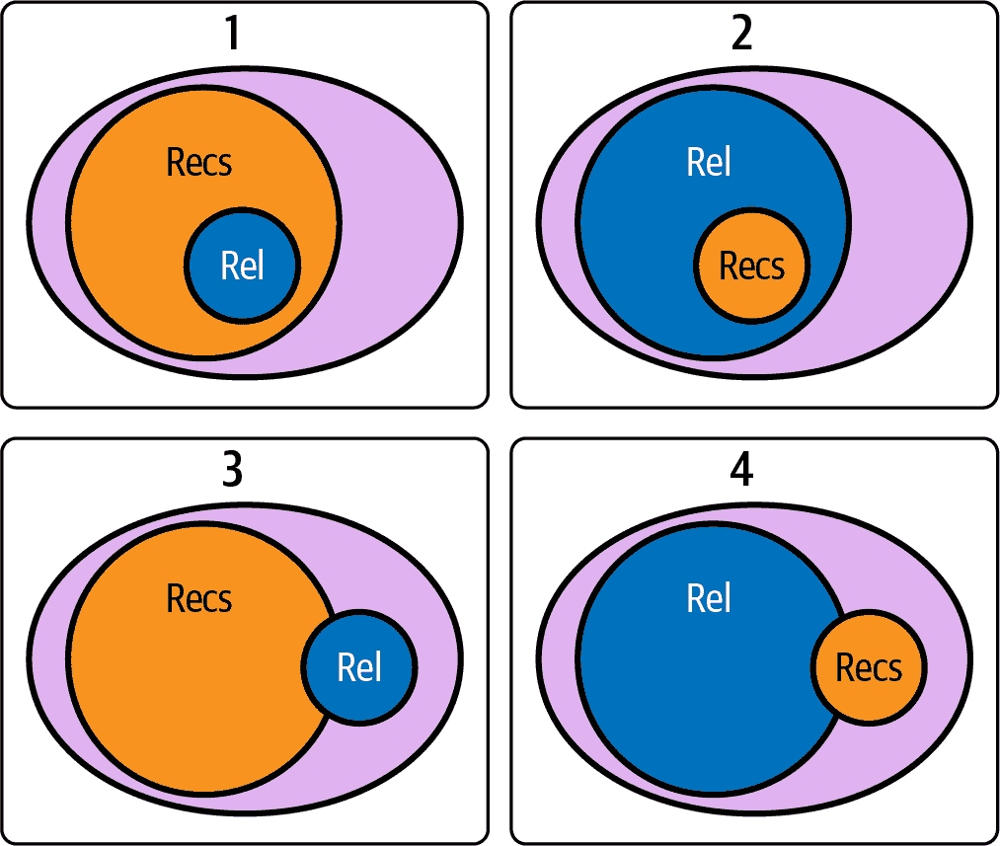

# 第十一章：个性化推荐度量

在探索了 MF 和神经网络在个性化上下文中的强大方法后，我们现在装备有强大的工具来打造复杂的推荐系统。然而，在列表中的推荐顺序可能对用户参与度和满意度产生深远影响。

到目前为止，我们的旅程主要集中在预测用户可能喜欢的内容，使用潜在因素或深度学习架构。然而，我们如何呈现这些预测结果，或者更正式地说，我们如何排列这些推荐，这些都具有至关重要的意义。因此，这一章将把我们的视线从预测问题转向排名在推荐系统中的复杂景观。

本章专注于理解关键的排名度量标准，包括平均精度（mAP）、平均倒数排名（MRR）和归一化折损累积增益（NDCG）。这些度量标准各自采用独特的方法来量化我们排名的质量，满足用户交互的不同方面。

我们将深入研究这些度量标准的复杂性，揭示它们的计算细节，讨论它们的解释，涵盖它们的优势和劣势，并指出它们在各种个性化场景中的具体相关性。

这种探索是推荐系统评估过程的一个重要组成部分。它不仅为我们提供了一个强大的框架来衡量系统的性能，还提供了理解不同算法在在线设置中可能表现的重要见解。这将为未来讨论算法偏见、推荐多样性以及推荐系统的多利益相关者方法奠定基础。

实质上，本章所获得的知识将对微调我们的推荐系统至关重要，确保我们不仅预测得好，而且推荐方式真正与个体用户的偏好和行为产生共鸣。

# 环境

在我们深入定义关键度量标准之前，我们将花一些时间讨论我们可以进行的评估类型。正如您很快会看到的那样，推荐系统的评估通常通过推荐对用户的*相关性*来特征化。这与搜索度量类似，但我们加入了额外因素来考虑最相关项在列表中的*位置*。

对于推荐系统评估的极其全面的视角，最近的项目[RecList](https://oreil.ly/b6mPy)构建了一个基于检查表的有用框架，用于组织度量和评估。

通常你会听到在几种设置下评估推荐系统：

+   在线/离线

+   用户/物品

+   A/B

每种设置提供略有不同类型的评估，并告诉您不同的信息。让我们快速分解这些差异，以建立有关术语的一些假设。

## 在线和离线

当我们提到在线与离线推荐器时，我们指的是*何时*运行评估。在*离线评估*中，您从测试/评估数据集开始，该数据集位于生产系统之外，并计算一组指标。这通常是设置最简单的推荐器，但对现有数据的期望最高。使用历史数据，您构建了一组相关响应，然后可以在模拟推断期间使用。这种方法与其他种类的传统机器学习最相似，尽管对误差的计算略有不同。

当我们训练大型模型时，这些数据集类似于离线数据集。我们之前看到了前序数据，这在推荐系统中比许多其他机器学习应用程序更为相关。有时您会听到人们说“所有推荐系统都是序列推荐系统”，因为历史曝光对推荐问题的重要性。

*在线评估*发生在推断期间，通常是在生产环境中。棘手的部分在于，你基本上永远不知道反事实的结果。您可以计算在线排名的特定指标：协变量的频率和分布，点击率/成功率，或平台上的停留时间，但最终这些指标与离线指标有所不同。

# 从历史评估数据中自举

从零开始构建推荐系统的人最常问的一个问题是“你从哪里获取初始训练数据？”这是一个难题。最终，您必须聪明地构建一个有用的数据集。考虑我们在维基百科推荐系统中的共现数据；我们并不需要任何用户交互来获取一组用于构建推荐系统的数据。从项目到项目的自举是最流行的策略，但您也可以使用其他技巧。进入用户-项目推荐器的最简单方法是简单地询问用户问题。如果您要求跨一组项目特征的偏好信息，您可以构建开始融入此信息的简单模型。

## 用户与项目指标

因为推荐系统是个性化机器，很容易认为我们总是希望为用户提供推荐并衡量其性能。然而，存在微妙之处。我们要确保每个单独的项目都有公平的机会，并且有时审视方程的另一面可以帮助评估这一点。换句话说，推荐的项目是否频繁推荐到足够有机会找到自己的定位？我们应明确计算我们的指标跨用户 *和* 项目轴。

项目方面度量的另一个方面是基于集合的推荐器。在上下文中推荐的其他项目可以显著影响推荐的性能。因此，在我们的大规模评估中，我们应该谨慎地测量成对项目指标。

## A/B 测试

对于评估新推荐模型的性能，使用随机对照试验是很好的。对于推荐来说，这非常棘手。在本章的最后，您将看到一些细微之处，但现在，让我们考虑一下在闭环范式中如何思考 A/B 测试的一个快速提醒。

A/B 测试最终试图估计将一个模型替换为另一个模型的效果大小；效果大小估计是衡量干预对目标指标的因果影响的过程。首先，我们需要部署两个推荐模型。我们也希望用户在每个推荐系统中有合理的随机分配。但是，随机分配单位是什么？很容易迅速假设它是用户，但是推荐系统发生了什么变化？推荐系统发生了什么变化，使得它与分布的某些属性相关联——例如，您是否构建了一个新的推荐系统，该系统对于季节性电视特别节目的友好程度较低，就在我们进入十一月的第二周？

还有一种考虑推荐系统这种测试的方式是长期复利效应。关于几年来一系列积极的 A/B 测试结果的常见反驳是“你是否测试了第一个推荐系统和最后一个推荐系统之间的差异？”这是因为人口会变化，用户和项目都会变化。当您也改变推荐系统时，您经常会发现自己处于双盲情况下，在这种情况下，您从未看到过这个用户或项目群体与任何其他推荐系统。如果每个 A/B 测试的效果大小在整个行业中都是相加的，那么世界 GDP 可能会增加两到三倍。

抵制这种抗议的方法是通过*长期保留*，这是一组随机选择的用户（不断增加），他们不会随时间升级到新模型。通过在此集合上测量目标指标与生产中最前沿的模型相比，您始终能够了解您工作的长期影响。长期保留的缺点是什么？它

现在让我们最终谈谈指标吧！

# 召回率和精确度

让我们首先考虑四个推荐问题以及每个问题对你想要的结果的不同影响。

首先，让我们考虑进入书店并寻找一本知名作者的书。我们会说这是推荐问题：

+   提   提供了大量的推荐

+   提供了一些可能的相关结果

此外，如果书店的选择很好，我们期望*所有*相关结果都包含在推荐中，因为一旦作者变得受欢迎，书店通常会携带大多数或所有作者的作品。然而，许多推荐——书店里的书——对于这个搜索来说根本不相关。

其次，让我们考虑在大都会地区使用地图应用程序附近找加油站。我们预期附近有很多加油站，但你可能只考虑前几个—或者甚至只有一个，你看到的第一个。因此，这个问题的推荐器有以下特点：

+   许多相关结果。

+   很少有用的建议。

在第一个情景中，相关结果可能完全包含在建议中；而在第二个情景中，建议可能完全包含在相关结果中。

现在让我们看看更常见的情景。

对于我们的第三个示例，请考虑您在流媒体视频平台上搜索今晚想要观看的浪漫电影。流媒体平台往往会显示很多建议—一页又一页来自这个或那个主题的建议。但是在这个夜晚，在这个平台上，只有几部电影或电视节目可能真正符合您的要求。因此，我们的推荐器做以下事情：

+   提供了许多建议。

+   仅提供了一些实际相关的建议。

但是，重要的是，并非所有相关结果都会出现在建议中！正如我们所知，不同的平台具有不同的媒体，所以一些相关结果无论我们查看多少都不会出现在建议中。

第四，最后，您是一位高端咖啡爱好者，品味高雅，正前往当地的烘焙商店品尝第三浪、单品种咖啡。作为经验丰富的咖啡鉴赏家，您喜欢来自世界各地的高质量咖啡，大多数都很享受但并非所有产地。在任何给定的一天，您的本地咖啡馆只有几种单品种手冲咖啡。尽管您有着世界性的口味，但有一些受欢迎的产地您并不喜欢。这个小小的推荐啤酒吧可以描述如下：

+   提供了一些建议。

+   提供了许多可能相关的建议。

在任何给定的一天，只有一些建议可能与您相关。

所以这些是我们匹配的四个情景。对于后两种情况，建议和相关性之间的交集可能很小或很大—甚至可能为空！主要思想是较小样本的完整大小并不总是在使用中。

现在我们已经通过了一些示例，让我们看看它们与推荐器的核心指标之间的关系：精度和召回率 *@ k*（图 11-1）。关注示例 3 和 4，我们可以看到只有一些建议与相关选项相交。而只有一些相关选项与建议相交。它经常被忽视，但事实上*这两个比率定义了我们的指标*—让我们去吧！

###### 图 11-1\. 召回和精度集合

## @ k

在本章和推荐系统度量讨论的大部分内容中，我们会说“*@ k*”。这意味着“在*k*”，实际上应该是“在*k*中”或“在*k*之外”。这些只是建议集的大小。我们经常将客户体验锚定在我们可以展示给用户多少建议而不会影响体验。我们还需要知道相关项集合的基数，我们称之为*@ r*。请注意，虽然可能感觉永远无法知道这个数字，但我们假设这是指通过我们的训练或测试数据知道的“已知相关”选项。

## Top-k 精度

*精度*是相关建议集大小与建议集合*k*大小的比率。

<math alttext="upper P r e c i s i o n commercial-at k equals StartFraction n u m Subscript r e l e v a n t Baseline Over left-parenthesis k right-parenthesis EndFraction" display="block"><mrow><mi>P</mi> <mi>r</mi> <mi>e</mi> <mi>c</mi> <mi>i</mi> <mi>s</mi> <mi>i</mi> <mi>o</mi> <mi>n</mi> <mo>@</mo> <mi>k</mi> <mo>=</mo> <mstyle displaystyle="true" scriptlevel="0"><mfrac><mrow><mi>n</mi><mi>u</mi><msub><mi>m</mi> <mrow><mi>r</mi><mi>e</mi><mi>l</mi><mi>e</mi><mi>v</mi><mi>a</mi><mi>n</mi><mi>t</mi></mrow></msub></mrow> <mrow><mo>(</mo><mi>k</mi><mo>)</mo></mrow></mfrac></mstyle></mrow></math>

注意，相关项的大小在公式中并不出现。没关系；交集的大小仍然取决于相关项集合的大小。

看看我们的例子，技术上例子 2 有最高的精度，但由于相关结果的数量，它有点误导人。这是精度不是评估推荐系统最常见的度量标准的一个原因。

## 在*k*处的召回率

*召回率*是相关建议集大小与相关项集合*r*大小的比率。

但等等！如果比率是相关建议与相关项的比率，那么*k*在哪里？在这里*k*仍然很重要，因为建议集的大小限制了可能的交集大小。请记住，这些比率是在始终依赖于*k*的交集上操作的。这意味着你经常考虑*r*和*k*的最大值。

在第 3 个场景中，我们希望一些符合我们心愿的电影会出现在正确的流媒体平台上。这些电影的数量除以所有媒体的总数就是*召回率*。如果所有相关的电影都在这个平台上，你可能会称之为*全面召回*。

第 4 场景的咖啡馆体验表明，召回率有时是一个避免的反向概率；因为你喜欢这么多的咖啡，我们可能更容易谈论你不喜欢的事物。在这种情况下，提供的避免数量将对召回率产生很大影响：

<math alttext="upper R e c a l l commercial-at k equals StartFraction left-parenthesis k minus upper A v o i d commercial-at k right-parenthesis Over n u m Subscript r e l e v a n t Baseline EndFraction" display="block"><mrow><mi>R</mi> <mi>e</mi> <mi>c</mi> <mi>a</mi> <mi>l</mi> <mi>l</mi> <mo>@</mo> <mi>k</mi> <mo>=</mo> <mstyle displaystyle="true" scriptlevel="0"><mfrac><mrow><mo>(</mo><mi>k</mi><mo>-</mo><mi>A</mi><mi>v</mi><mi>o</mi><mi>i</mi><mi>d</mi><mo>@</mo><mi>k</mi><mo>)</mo></mrow> <mrow><mi>n</mi><mi>u</mi><msub><mi>m</mi> <mrow><mi>r</mi><mi>e</mi><mi>l</mi><mi>e</mi><mi>v</mi><mi>a</mi><mi>n</mi><mi>t</mi></mrow></msub></mrow></mfrac></mstyle></mrow></math>

这是召回率的核心数学定义，通常是我们考虑的第一个衡量标准，因为它纯粹地估计了你的检索性能如何。

## R-精度

如果我们在建议上也有排名，我们可以在*top-r*建议中考虑相关建议到*r*的比率。这在*r*非常小的情况下（例如示例 1 和 3）改进了这个度量标准。

# mAP、MMR、NDCG

深入研究了精度@*k*和召回率@*k*的可靠领域后，我们对我们推荐系统的质量获得了宝贵的见解。然而，尽管这些指标至关重要，有时却无法完全捕捉这些系统的一个重要方面：*推荐顺序*。

在推荐系统中，我们提供建议的顺序具有重要的权重，需要评估以确保其有效性。

这就是为什么我们现在将超越 precision@*k* 和 recall@*k*，探索一些关键的排名敏感性指标——即平均精度（mAP）、平均倒数排名（MRR）和归一化折现累计增益（NDCG）。

mAP 指标强调每个相关文档及其位置的重要性，而 MRR 则集中于第一个相关项的排名。NDCG 更重视高排名的相关文档。通过了解这些指标，您将拥有更强大的工具来评估和优化推荐系统。

因此，让我们继续探索，平衡精确性与易懂性。到本节末，您将能够自信而且有见地地处理这些重要的评估方法。

## mAP

在推荐系统中，这一重要的指标尤其擅长考虑相关项的排名。例如，在五个项目的列表中，如果相关项目分别位于位置 2、3 和 5，那么 mAP 将通过计算 precision@2、precision@3 和 precision@5 并对这些值取平均来计算。mAP 的强大之处在于其对相关项顺序的敏感性，当这些项排名较高时，提供更高的分数。

考虑一个具有两个推荐算法 A 和 B 的示例：

+   对于算法 A，我们计算 mAP 如下：

    （precision@2 + precision@3 + precision@5）/ 3 = （1/2 + 2/3 + 3/5）/ 3 = 0.6

+   对于完美排列项目的算法 B，我们计算 mAP 如下：

    mAP = （precision@1 + precision@2 + precision@3）/ 3 = （1/1 + 2/2 + 3/3）/ 3 = 1

mAP 在查询集合 Q 上的广义公式如下所示：

<math alttext="dollar-sign m upper A upper P equals StartFraction 1 Over StartAbsoluteValue upper Q EndAbsoluteValue EndFraction sigma-summation Underscript q equals 1 Overscript StartAbsoluteValue upper Q EndAbsoluteValue Endscripts StartFraction 1 Over m Subscript q Baseline EndFraction sigma-summation Underscript k equals 1 Overscript n Endscripts upper P left-parenthesis k right-parenthesis asterisk r e l left-parenthesis k right-parenthesis dollar-sign"><mrow><mi>m</mi> <mi>A</mi> <mi>P</mi> <mo>=</mo> <mfrac><mn>1</mn> <mrow><mo>|</mo><mi>Q</mi><mo>|</mo></mrow></mfrac> <msubsup><mo>∑</mo> <mrow><mi>q</mi><mo>=</mo><mn>1</mn></mrow> <mrow><mo>|</mo><mi>Q</mi><mo>|</mo></mrow></msubsup> <mfrac><mn>1</mn> <msub><mi>m</mi> <mi>q</mi></msub></mfrac> <msubsup><mo>∑</mo> <mrow><mi>k</mi><mo>=</mo><mn>1</mn></mrow> <mi>n</mi></msubsup> <mi>P</mi> <mrow><mo>(</mo> <mi>k</mi> <mo>)</mo></mrow> <mo>*</mo> <mi>r</mi> <mi>e</mi> <mi>l</mi> <mrow><mo>(</mo> <mi>k</mi> <mo>)</mo></mrow></mrow></math>

这里，<math alttext="StartAbsoluteValue upper Q EndAbsoluteValue"><mrow><mo>|</mo> <mi>Q</mi> <mo>|</mo></mrow></math> 是查询总数，<math alttext="m Subscript q"><msub><mi>m</mi> <mi>q</mi></msub></math> 是特定查询 <math alttext="q"><mi>q</mi></math> 的相关文档数，<math alttext="upper P left-parenthesis k right-parenthesis"><mrow><mi>P</mi> <mo>(</mo> <mi>k</mi> <mo>)</mo></mrow></math> 表示截止到第 _k_ 个位置的精确度，<math alttext="r e l left-parenthesis k right-parenthesis"><mrow><mi>r</mi> <mi>e</mi> <mi>l</mi> <mo>(</mo> <mi>k</mi> <mo>)</mo></mrow></math> 是一个指示函数，如果第 k 个位置的项目是相关的，则等于 1，否则为 0。

## MRR

另一个在推荐系统中使用的有效度量标准是 MRR。与考虑所有相关项目的 MAP 不同，MRR 主要关注推荐列表中第一个相关项目的位置。它被计算为第一个相关项目出现的排名的倒数。

因此，如果列表中的第一个项目是相关的，MRR 可以达到其最大值 1。如果第一个相关项目在列表中的位置更靠后，那么 MRR 将小于 1。例如，如果第一个相关项目位于排名 2 的位置，那么 MRR 将为 1/2。

让我们看看这在我们先前使用的推荐算法 A 和 B 的背景下的情况：

+   对于算法 A，第一个相关项目位于排名 2，因此 MRR 等于 1/2 = 0.5。

+   对于完美排名项目的算法 B，第一个相关项目位于排名 1，因此 MRR 等于 1/1 = 1。

将这个推广到多个查询，MRR 的一般公式如下：

<math alttext="dollar-sign upper M upper R upper R equals StartFraction 1 Over StartAbsoluteValue upper Q EndAbsoluteValue EndFraction sigma-summation Underscript i equals 1 Overscript StartAbsoluteValue upper Q EndAbsoluteValue Endscripts StartFraction 1 Over r a n k Subscript i Baseline EndFraction dollar-sign"><mrow><mi>M</mi> <mi>R</mi> <mi>R</mi> <mo>=</mo> <mfrac><mn>1</mn> <mrow><mo>|</mo><mi>Q</mi><mo>|</mo></mrow></mfrac> <msubsup><mo>∑</mo> <mrow><mi>i</mi><mo>=</mo><mn>1</mn></mrow> <mrow><mo>|</mo><mi>Q</mi><mo>|</mo></mrow></msubsup> <mfrac><mn>1</mn> <mrow><mi>r</mi><mi>a</mi><mi>n</mi><msub><mi>k</mi> <mi>i</mi></msub></mrow></mfrac></mrow></math>

这里，|*Q*| 表示查询的总数，<math alttext="r a n k Subscript i"><mrow><mi>r</mi> <mi>a</mi> <mi>n</mi> <msub><mi>k</mi> <mi>i</mi></msub></mrow></math> 是列表中第 _i_ 个查询的第一个相关项目的位置。这个度量标准提供了有价值的见解，用于评估推荐算法在列表顶部提供相关推荐的效果。

## NDCG

为了进一步完善我们对排名指标的理解，让我们深入了解 NDCG。和 mAP 和 MRR 一样，NDCG 也承认相关项目的排名顺序，但引入了一个变化。它随着我们在列表中移动到更低的排名，递减项目的相关性，这意味着在列表中出现较早的项目比排名较低的项目更有价值。

NDCG 从累积增益（CG）的概念开始，它简单地是列表中前 *k* 个项目的相关性得分之和。折现累积增益（DCG）更进一步，根据项目的位置对每个项目的相关性进行折现。因此，NDCG 是由理想折现累积增益（IDCG）标准化的 DCG 值，如果所有相关项目出现在列表的最顶部，我们将获得的 DCG 值。

假设我们的列表中有五个项目，特定用户的相关项目位于位置 2 和 3，那么 IDCG@*k* 将会是 (1/log(1 + 1) + 1/log(2 + 1)) = 1.5 + 0.63 = 2.13。

让我们将这放到我们先前使用的算法 A 和 B 的背景中。

对于算法 A

+   DCG@5 = 1/log(2 + 1) + 1/log(3 + 1) + 1/log(5 + 1) = 0.63 + 0.5 + 0.39 = 1.52

+   NDCG@5 = DCG@5 / IDCG@5 = 1.52 / 2.13 = 0.71

对于算法 B

+   DCG@5 = 1/log(1 + 1) + 1/log(2 + 1) + 1/log(3 + 1) = 1 + 0.63 + 0.5 = 2.13

+   NDCG@5 = DCG@5 / IDCG@5 = 2.13 / 2.13 = 1

NDCG 的一般公式可以表示为

+   <math alttext="upper N upper D upper C upper G commercial-at k equals StartFraction upper D upper C upper G commercial-at k Over upper I upper D upper C upper G commercial-at k EndFraction"><mrow><mi>N</mi> <mi>D</mi> <mi>C</mi> <mi>G</mi> <mo>@</mo> <mi>k</mi> <mo>=</mo> <mfrac><mrow><mi>D</mi><mi>C</mi><mi>G</mi><mo>@</mo><mi>k</mi></mrow> <mrow><mi>I</mi><mi>D</mi><mi>C</mi><mi>G</mi><mo>@</mo><mi>k</mi></mrow></mfrac></mrow></math>

其中

+   <math alttext="upper D upper C upper G commercial-at k equals sigma-summation Underscript i equals 1 Overscript k Endscripts StartFraction r e l Subscript i Baseline Over l o g 2 left-parenthesis i plus 1 right-parenthesis EndFraction"><mrow><mi>D</mi> <mi>C</mi> <mi>G</mi> <mo>@</mo> <mi>k</mi> <mo>=</mo> <msubsup><mo>∑</mo> <mrow><mi>i</mi><mo>=</mo><mn>1</mn></mrow> <mi>k</mi></msubsup> <mfrac><mrow><mi>r</mi><mi>e</mi><msub><mi>l</mi> <mi>i</mi></msub></mrow> <mrow><mi>l</mi><mi>o</mi><msub><mi>g</mi> <mn>2</mn></msub> <mrow><mo>(</mo><mi>i</mi><mo>+</mo><mn>1</mn><mo>)</mo></mrow></mrow></mfrac></mrow></math>

+   <math alttext="upper I upper D upper C upper G commercial-at k equals sigma-summation Underscript i equals 1 Overscript StartAbsoluteValue script upper R EndAbsoluteValue Endscripts StartFraction 1 Over l o g 2 left-parenthesis i plus 1 right-parenthesis EndFraction"><mrow><mi>I</mi> <mi>D</mi> <mi>C</mi> <mi>G</mi> <mo>@</mo> <mi>k</mi> <mo>=</mo> <msubsup><mo>∑</mo> <mrow><mi>i</mi><mo>=</mo><mn>1</mn></mrow> <mrow><mo>|</mo><mi>ℛ</mi><mo>|</mo></mrow></msubsup> <mfrac><mn>1</mn> <mrow><mi>l</mi><mi>o</mi><msub><mi>g</mi> <mn>2</mn></msub> <mrow><mo>(</mo><mi>i</mi><mo>+</mo><mn>1</mn><mo>)</mo></mrow></mrow></mfrac></mrow></math>

并且 <math alttext="script upper R"><mi>ℛ</mi></math> 是相关文档的集合。

这个度量标准为我们提供了一个归一化分数，用于衡量我们的推荐算法在排名相关项目方面的表现，随着列表的向下移动而递减。

## mAP 与 NDCG 的比较？

mAP 和 NDCG 都是综合评估排名质量的全面指标，通过包含所有相关项目及其相应的排名提供了全面的视角。然而，这些指标的可解释性和使用案例可以根据推荐背景的具体情况和相关性的性质而变化。

虽然 MRR 不考虑所有相关项目，但它确实提供了对算法性能的可解释洞察，突出显示第一个相关项目的平均排名。当最高推荐具有显著价值时，这尤为有用。

另一方面，mAP 是一个丰富的评估指标，有效地表示了精确率-召回率曲线下的面积。它的平均特性提供了一个直观的解释，涉及在不同排名截断下精确率和召回率之间的权衡。

NDCG 引入了对每个项目相关性的强健考虑，并对排名顺序敏感，使用对数折现因子来量化随着我们在列表中向下移动项目的递减重要性。这使得它能够处理项目具有不同程度相关性的情况，超越了 mAP 和 MRR 中常用的二元相关性。然而，NDCG 的这种多功能性也可能由于对数折现的复杂性而限制其可解释性。

此外，尽管 NDCG 在项目具有不同重要性权重的使用案例中表现良好，但在实际应用中获取准确的地面真实相关性评分可能构成重大挑战。这对于 NDCG 的现实世界有效性施加了限制。

总体而言，这些指标构成了推荐算法离线评估方法的基础。随着我们在探索中的进展，我们将涵盖在线评估，讨论评估和减轻算法偏差的策略，了解确保推荐多样性的重要性，并优化推荐系统以满足生态系统中各方的需求。

## 相关系数

虽然像 Pearson 或 Spearman 这样的相关系数可以用来评估两个排名之间的相似性（例如，预测排名与地面真实排名之间），但它们并不像 mAP、MRR 或 NDCG 那样提供完全相同的信息。

相关系数通常用于衡量两个连续变量之间的线性关联程度，在排名的背景下，它们可以指示两个有序列表之间的整体相似性。然而，它们并未直接考虑诸如个别项目的相关性、相关项目的位置或项目间不同程度的相关性等方面，这些对于 mAP、MRR 和 NDCG 非常重要。

例如，假设用户过去与五个项目互动过。推荐系统可能预测用户会再次与这些项目互动，但会按重要性相反的顺序排名。即使系统正确识别了感兴趣的项目，但由于排名颠倒，根据 mAP、MRR 或 NDCG 测量会导致性能较差，但由于线性关系，会获得较高的负相关系数。

因此，虽然相关系数可以提供对排名性能的高层次理解，但它们不足以取代像 mAP、MRR 和 NDCG 这样提供更详细信息的度量。

要在排名背景下利用相关系数，关键是将其与其他考虑推荐问题特定细微差别的度量配对，例如个别项目的相关性及其在排名中的位置。

# RMSE 来自亲和力

均方根误差（RMSE）和 mAP、MRR 和 NDCG 等排名指标，在评估输出亲和力分数的推荐系统时，提供了根本不同的视角。

RMSE 是量化预测误差的常用指标。它计算预测的亲和力分数与真实值之间平方差的平均值的平方根。较低的 RMSE 表示更好的预测精度。但是，RMSE 将问题视为标准回归任务，并忽视了推荐系统中的固有排名结构。

相反，mAP、MRR 和 NDCG 明确设计用于评估排名的质量，在推荐系统中至关重要。本质上，虽然 RMSE 衡量预测亲和力分数与实际值的接近程度，但 mAP、MRR 和 NDCG 通过考虑相关项的位置来评估排名质量。因此，如果您关注的是排名项目而不是预测精确的亲和力分数，则通常应选择这些排名指标更为合适。

# 积分形式：AUC 和 cAUC

在推荐系统中，我们为每个用户生成一个项目的排名列表。正如您所见，这些排名基于亲和力，即用户对每个项目的偏好或优先级的概率。在这个框架下，已经开发了几个度量来评估这些排名列表的质量。其中一个度量是 AUC-ROC，它与 mAP、MRR 和 NDCG 相辅相成。让我们更仔细地了解这些度量。

## 推荐概率到 AUC-ROC

在二元分类设置中，接收器工作特征曲线下的面积（AUC-ROC）衡量推荐模型区分正（相关）和负（不相关）实例的能力。它通过在各种阈值设置下绘制真正例率（TPR）与假正例率（FPR）曲线，然后计算此曲线下的面积来计算。

在推荐的背景下，你可以将这些“阈值”视为将向用户推荐的前几个项目的数量。AUC-ROC 指标变成了评估模型在排列相关项目和不相关项目时的表现，而与实际排名位置无关。换句话说，AUC-ROC 有效地量化了模型随机选择的相关项目被排在比随机选择的不相关项目更高的概率。然而，这并不考虑项目在列表中的实际位置或顺序，只考虑了正例与负例的相对排名。通过校准项目的亲和力可以被解释为模型对项目相关性的置信度，并且在考虑历史数据时，即使是未校准的亲和力分数也可能成为发现有用内容所需的推荐数量的很好建议。

这些亲和力分数的一个严肃实现可能是只向用户展示超过特定分数的项目，否则告诉他们稍后再来或使用探索方法来改进数据。例如，如果你销售卫生产品，并且正在考虑在结账时询问客户添加一些 Aesop 肥皂，你可能希望评估 Aesop ROC，并且仅当观察到的亲和力超过学习阈值时才进行此建议。您还将在之后看到这些概念在“库存健康”中的应用。

## 与其他指标的比较

让我们将这些与其他指标放在一起来看：

mAP

这个指标扩展了在排名列表中特定截止点处的精度的思想，以提供模型性能的总体度量。它通过计算每个相关项目被发现的排名处的精度值的平均值来实现这一点。与 AUC-ROC 不同，mAP 更加强调排名较高的项目，并且对排名顶部的变化更为敏感。

MRR

与 AUC-ROC 和 mAP 不同，MRR 只关注列表中第一个相关项目的排名。它衡量模型能够多快地找到相关项目。如果模型始终将相关项目置于列表顶部，那么它的 MRR 将更高。

NDCG

该指标评估了排名的质量，不仅考虑了推荐的顺序，还考虑了项目的分级相关性（而前面的指标没有考虑）。NDCG 降低了列表下面的项目的权重，奖励出现在列表顶部附近的相关项目。

AUC-ROC 提供了一个有价值的综合度量，用于衡量模型区分相关和不相关项目的能力；mAP、MRR 和 NDCG 提供了对模型排名质量更细致的评估，考虑了位置偏差和不同相关程度等因素。

请注意，我们有时会计算每个客户的 AUC 然后取平均值。这就是客户 AUC（cAUC），它经常可以为用户的体验提供一个良好的期望。

# BPR

*贝叶斯个性化排名*（Bayesian personalized ranking，BPR）提出了在推荐系统中进行项目排名的贝叶斯方法，有效地提供了一个概率框架来模拟个性化排名过程。与将项目推荐问题转化为二元分类问题（相关或不相关）不同，BPR 专注于成对偏好：给定两个项目，用户更喜欢哪个？这种方法更符合推荐系统中常见的隐式反馈的性质。

BPR 模型使用成对损失函数，考虑了特定用户对正向项目和负向项目的相对顺序。它旨在最大化观察到的排名正确的后验概率。该模型通常使用随机梯度下降或其变体进行优化。需要注意的是，BPR（与我们讨论过的其他指标，包括 AUC-ROC、mAP、MRR 和 NDCG 不同）是一个模型训练目标，而不是一个评估指标。因此，虽然前述的指标评估模型训练后的性能，但 BPR 提供了一种机制，以直接优化排名任务的方式来引导模型学习过程。关于这些主题的更深入讨论详见[“BPR: Bayesian Personalized Ranking from Implicit Feedback”](https://oreil.ly/NwCYa) by Steffen Rendle et al.

# 概要

现在，你已经知道如何评估你训练的推荐系统的性能，或许你会想知道如何实际训练它们。你可能已经注意到，我们介绍的许多指标并不适合作为损失函数；它们涉及关于项目集和项目列表的大量同时观察。不幸的是，这会使推荐者从中学习的信号高度组合。此外，我们提出的指标确实有两个方面需要考虑：与召回相关联的二元指标和排名加权。

在下一章中，你将学习一些优秀的训练目标损失函数。我们相信这些的重要性不会被忽视。
