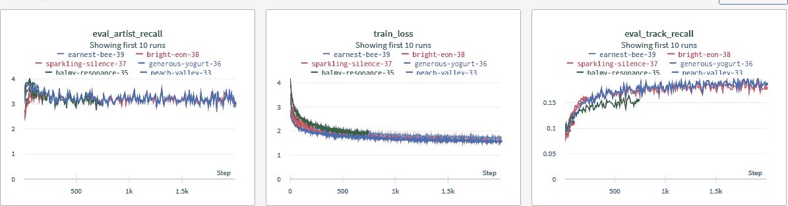
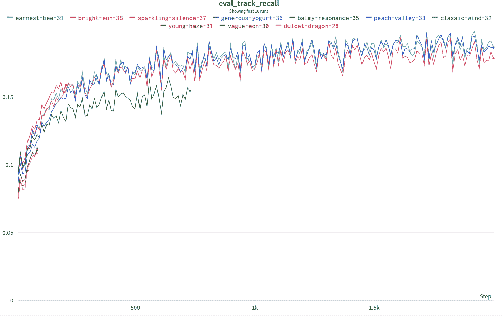

# 第十三章：汇总一切：实验和排名

在最近的几章中，我们涵盖了排名的许多方面，包括各种损失函数以及衡量排名系统性能的指标。在本章中，我们将展示一个排名损失和排名指标的示例，使用了[Spotify 百万播放列表数据集](https://oreil.ly/j3nvH)。

本章鼓励更多的实验和比之前更加开放的方式，其目标是引入概念和基础设施。另一方面，本章旨在鼓励您直接参与损失函数和编写指标的工作。

# 实验技巧

在我们开始挖掘数据和建模之前，让我们探讨一些实践方法，这些方法在进行大量实验和快速迭代时会使您的生活更加轻松。这些是一些通用的指导原则，使我们的实验更快。因此，我们能够快速迭代向解决方案，帮助我们达到我们的目标。

实验代码与工程代码不同，实验代码是为了探索思路而写的，并非为了稳健性。目标是在不牺牲代码质量太多的情况下达到最大速度。因此，你应该考虑一段代码是否需要彻底测试，或者这并不必要，因为该代码只是为了测试一个假设，然后将被丢弃。考虑到这一点，以下是一些建议。请记住，这些建议是作者多年发展出来的观点，不是硬性规则，只是一些有趣的观点，可能会有人不同意。

## 保持简单

在研究代码的整体结构方面，最好保持尽可能简单。在探索生命周期的早期阶段，尽量不要在继承和可重用性方面思考太多。在项目开始阶段，我们通常还不知道它需要什么，因此首选应该是保持代码易于阅读和简单调试。这意味着在早期阶段，不必过多关注代码重用，因为在项目的早期阶段，模型结构、数据摄入以及系统各部分的交互将会发生许多代码更改。当不确定性问题解决后，然后可以将代码重写为更稳健的形式，但是过早地重构实际上会降低速度。

一般的经验法则是，可以复制代码三次，第四次将其重构为库，因为你会看到足够多的用例来证明代码的复用是合理的。如果重构得太早，可能没有看到足够多的代码片段的用例来覆盖它可能需要处理的可能用例。

## 调试打印语句

如果你阅读了多篇机器学习研究论文，你可能期望你的数据在项目开始时是相当干净和有序的。然而，现实世界的数据可能会很杂乱，存在缺失字段和意外值。有很多打印函数可以让你打印并视觉检查数据的样本，还有助于制定输入数据的管道和转换，以供模型使用。此外，打印模型的样本输出对于确保输出符合预期也是有用的。

包括记录日志的最重要的地方是系统组件之间的输入和输出模式；这些帮助你理解现实可能与期望偏差的地方。稍后，你可以编写单元测试来确保重构模型不会出错，但单元测试可以等到模型架构稳定时再做。一个良好的经验法则是当你想重构代码、重用代码或优化代码以保持功能性时，或者当代码稳定并且你希望确保它不会破坏构建时，添加单元测试。在运行训练代码时不可避免地遇到非数字 (NaN) 错误时，添加打印语句也是一个很好的用例。

在 JAX 中，你可以通过以下方式启用 NaN 调试：

```py
from jax import config
config.update("jax_debug_nans", True)

@jax.jit
def f(x):
  jax.debug.print("Debugging {x}", x=x)
```

调试 NaN 配置设置将在发现任何 NaN 时重新运行编译的函数，并且调试打印函数将打印张量的值，即使在 JIT 内部也是如此。常规打印在 JIT 内部不起作用，因为它不是可编译的命令，在跟踪期间会被跳过，因此你必须使用调试打印函数，它在 JIT 内部是有效的。

## 推迟优化

在研究代码中，有很多诱惑让你早早进行优化——特别是关注模型或系统的实现，以确保它们在计算上是高效的或者代码是优雅的。然而，研究代码是为了更高的实验速度而写的，而不是执行速度。

我们建议不要过早优化，除非它影响了研究的速度。其中一个原因是系统可能还不完整，因此如果系统的另一部分更慢且是真正的瓶颈，优化其中一部分可能没有意义。另一个原因是你正在优化的部分可能不会成为最终模型的一部分，因此如果代码被重构掉了，所有的优化工作可能都会白费。

最后，优化实际上可能会妨碍在架构或功能方面修改或注入较新设计选择的能力。优化代码往往会有一些选择，这些选择适合当前数据流结构，但可能不适合进一步的更改。例如，在本章的代码中，一种可能的优化选择是批量处理相同大小的播放列表，以便代码可以批量运行。然而，在此实验阶段，这种优化可能过早并且会分散注意力，因为它可能使度量代码变得更加复杂。我们的温和建议是，推迟优化，直到大部分实验完成并且架构、损失函数和度量标准已经选择并确定。

## 跟踪变更

在研究代码中，可能会涉及太多变量，以至于您不能一次更改它们以查看其效果。这个问题在需要大量运行来确定哪些更改导致哪些效果的大型数据集中尤为明显。因此，一般来说，固定一些参数并逐步改变代码仍然是个好主意，这样您可以跟踪导致最大改进的变更。参数必须被跟踪，但代码变更也同样重要。

通过像我们在第五章讨论的 Weights & Biases 这样的服务，可以跟踪变更的一种方法。记录导致变更的确切代码和参数是一个好主意，这样实验可以被重现和分析。特别是在经常变化且有时未经检查的研究代码中，您必须在某处保存生成运行的代码副本，而 MLOps 工具允许您跟踪代码和超参数。

## 使用特征工程

与学术论文不同，大多数应用研究更关心良好的结果而不是理论上美丽的结果。我们并不被纯粹主义观点所束缚，即模型必须自己学习数据的一切。相反，我们是实用主义者，关心良好的结果。

我们不应放弃诸如特征工程之类的实践，特别是当数据稀少或时间紧迫时，并且需要快速得到合理的结果。使用特征工程意味着，如果您知道手工制作的特征与像排名这样的结果正相关或负相关，那么请务必将这些工程特征添加到数据中。在推荐系统中的一个例子是，如果一个项目的属性与用户的播放列表中的艺术家或专辑匹配，则返回布尔值 True；否则，返回 False。这种额外的特征简单地帮助模型更快地收敛，如果手工制作的特征表现不佳，模型仍然可以使用其他潜在特征（如嵌入）来进行补偿。

定期消除手工设计的特征通常是一个好的实践。为了做到这一点，偶尔保留一个没有某些特征的实验，以查看这些特征是否随着时间的推移已经过时，或者它们是否仍然有益于业务指标。

# 消融

在机器学习应用中，*消融*是指当特定特征被移除时，模型性能的变化情况。在计算机视觉应用中，消融通常是指阻塞图像或视野的一部分，以查看它对模型识别或分割数据的影响。在其他类型的机器学习中，它可以意味着有策略地移除某些特征。

消融的一个要注意的地方是要用什么来替换该特征。简单地将该特征*清零*可能会显著地扭曲模型的输出。这被称为*零消融*，可以强制模型将该特征视为超出分布，从而产生较不可信的结果。相反，一些人主张进行均值消融，或者取该特征的平均值或最常见值。这使模型能够看到更多预期的值，并降低这些风险。

然而，这未能考虑到我们一直在研究的模型的最重要的方面——潜在的高阶交互作用。其中一位作者调查了一种更深入的消融方法，称为*因果擦除*，在这种方法中，您将消融值固定为从其他特征值产生的后验分布中采样的值，即，一个与模型在那时将看到的其余值“合理”的值。

## 理解指标与业务指标

有时，作为机器学习从业者，我们过分关注我们的模型可以达到的最佳指标。然而，我们应该控制一下这种热情，因为最佳的机器学习指标可能并不完全代表手头的业务利益。此外，包含业务逻辑的其他系统可能会位于我们的模型之上并修改输出。因此，最好不要过分关注机器学习指标，而是进行包含业务指标的适当 A/B 测试，因为这是评估机器学习结果的主要指标。

最好的情况是找到一个与相关业务指标很好地对齐或预测的损失函数。不幸的是，这通常并不容易找到，特别是当业务指标很微妙或有竞争优先级时。

## 进行快速迭代

不要害怕查看运行时间较短的结果。在开始时，当您正在弄清楚模型架构与数据之间的交互作用时，没有必要对数据进行完整的遍历。进行一些快速运行，并进行一些轻微的调整，以查看它们在较短的时间步长内如何改变指标是可以的。在 Spotify 百万播放列表数据集中，我们在进行较长的运行之前通过使用 100,000 个播放列表来调整了模型架构。有时更改可能会如此显著，以至于效果可以立即看到，甚至在第一次测试集评估时也是如此。

现在，我们已经掌握了实验研究编码的基础知识，让我们转到数据和代码，稍微玩弄一下建模音乐推荐。

# Spotify 百万播放列表数据集

此节的代码可以在[此书的 GitHub 存储库](https://github.com/BBischof/ESRecsys/tree/main/spotify)找到。数据的文档可以在[Spotify 百万播放列表数据集挑战](https://oreil.ly/eVA7f)找到。

首先，我们应该查看数据：

```py
less data/spotify_million_playlist_dataset/data/mpd.slice.0-999.json
```

这应该产生以下输出：

```py
{
    "info": {
        "generated_on": "2017-12-03 08:41:42.057563",
        "slice": "0-999",
        "version": "v1"
    },
    "playlists": 
        {
            "name": "Throwbacks",
            "collaborative": "false",
            "pid": 0,
            "modified_at": 1493424000,
            "num_tracks": 52,
            "num_albums": 47,
            "num_followers": 1,
            "tracks": [
                {
                    "pos": 0,
                    "artist_name": "Missy Elliott",
                    "track_uri": "spotify:track:0UaMYEvWZi0ZqiDOoHU3YI",
                    "artist_uri": "spotify:artist:2wIVse2owClT7go1WT98tk",
                    "track_name": "Lose Control (feat. Ciara & Fat Man Scoop)",
                    "album_uri": "spotify:album:6vV5UrXcfyQD1wu4Qo2I9K",
                    "duration_ms": 226863,
                    "album_name": "The Cookbook"
                },
     }
 }
```

在遇到新数据集时，总是重要的是看一下它，并计划使用哪些特征来生成数据的推荐。Spotify 百万播放列表数据集挑战的一个可能目标是从播放列表中的前五个曲目预测接下来的曲目。

在这种情况下，对任务可能有用的几个特征。我们有曲目、艺术家和专辑的统一资源标识符（URI），它们分别是曲目、艺术家和专辑的唯一标识符。我们还有艺术家和专辑的名称以及播放列表的名称。数据集还包括诸如曲目时长和播放列表关注者数量等数值特征。直觉上，播放列表的关注者数量不应影响播放列表中曲目的排序，因此在使用这些可能不具信息量的特征之前，您可能希望寻找更好的特征。查看特征的整体统计信息，您还可以获得很多见解：

```py
less data/spotify_million_playlist_dataset/stats.txt
number of playlists 1000000
number of tracks 66346428
number of unique tracks 2262292
number of unique albums 734684
number of unique artists 295860
number of unique titles 92944
number of playlists with descriptions 18760
number of unique normalized titles 17381
avg playlist length 66.346428

top playlist titles
  10000 country
  10000 chill
   8493 rap
   8481 workout
   8146 oldies
   8015 christmas
   6848 rock
   6157 party
   5883 throwback
   5063 jams
   5052 worship
   4907 summer
   4677 feels
   4612 new
   4186 disney
   4124 lit
   4030 throwbacks
```

首先要注意的是曲目数比播放列表数多。这意味着很多曲目可能有非常少的训练数据。因此，`track_uri`可能不是一个很好泛化的特征。另一方面，`album_uri`和`artist_uri`会泛化，因为它们会在不同的播放列表中多次出现。为了代码清晰起见，我们将主要使用`album_uri`和`artist_uri`作为代表曲目的特征。

在之前的“综合应用”章节中，我们展示了可以替代的基于内容的特征或文本令牌化特征的使用，但是直接嵌入特征最清晰地用于排名演示。在实际应用中，嵌入特征和基于内容的特征可以连接在一起形成更好推荐排名的特征。在本章中，我们将把一个曲目表示为元组(`track_id`, `album_id`, `artist_id`)，其中 ID 是表示 URI 的整数。我们将在下一节建立从 URI 到整数 ID 的字典。

## 构建 URI 字典

类似于[第八章，我们将首先构建所有 URI 的字典。这个字典允许我们将文本 URI 表示为整数，以便在 JAX 端更快地处理，因为我们可以轻松地从整数查找嵌入，而不是任意的 URI 字符串。

这是 *make_dictionary.py* 的代码：

```py
import glob
import json
import os
from typing import Any, Dict, Tuple

from absl import app
from absl import flags
from absl import logging
import numpy as np
import tensorflow as tf

FLAGS = flags.FLAGS
_PLAYLISTS = flags.DEFINE_string("playlists", None, "Playlist json glob.")
_OUTPUT_PATH = flags.DEFINE_string("output", "data", "Output path.")

# Required flag.
flags.mark_flag_as_required("playlists")

def update_dict(dict: Dict[Any, int], item: Any):
    """Adds an item to a dictionary."""
    if item not in dict:
        index = len(dict)
        dict[item] = index

def dump_dict(dict: Dict[str, str], name: str):
  """Dumps a dictionary as json."""
  fname = os.path.join(_OUTPUT_PATH.value, name)
  with open(fname, "w") as f:
    json.dump(dict, f)

def main(argv):
    """Main function."""
    del argv  # Unused.

    tf.config.set_visible_devices([], 'GPU')
    tf.compat.v1.enable_eager_execution()
    playlist_files = glob.glob(_PLAYLISTS.value)
    track_uri_dict = {}
    artist_uri_dict = {}
    album_uri_dict = {}

    for playlist_file in playlist_files:
        print("Processing ", playlist_file)
        with open(playlist_file, "r") as file:
            data = json.load(file)
            playlists = data["playlists"]
            for playlist in playlists:
                tracks = playlist["tracks"]
                for track in tracks:
                  update_dict(track_uri_dict, track["track_uri"])
                  update_dict(artist_uri_dict, track["artist_uri"])
                  update_dict(album_uri_dict, track["album_uri"])

    dump_dict(track_uri_dict, "track_uri_dict.json")
    dump_dict(artist_uri_dict, "artist_uri_dict.json")
    dump_dict(album_uri_dict, "album_uri_dict.json")

if __name__ == "__main__":
    app.run(main)
```

每当遇到新的 URI 时，我们只需递增计数器并将该唯一标识符分配给 URI。我们对曲目、艺术家和专辑执行此操作，并将其保存为 JSON 文件。

尽管我们可以使用像 PySpark 这样的数据处理框架，但重要的是要注意数据大小。如果数据量小，例如百万个播放列表，仅在单台机器上执行会更快。在何时使用大数据处理框架时我们应该明智，并且对于小数据集，有时仅在一台机器上运行代码可能更快，而不是编写在集群上运行的代码。

## 构建训练数据

现在我们有了字典，我们可以使用它们将原始 JSON 播放列表日志转换为更可用的形式进行 ML 训练。此代码在 *make_training.py* 中实现：

```py
import glob
import json
import os
from typing import Any, Dict, Tuple

from absl import app
from absl import flags
from absl import logging
import numpy as np
import tensorflow as tf

import input_pipeline

FLAGS = flags.FLAGS
_PLAYLISTS = flags.DEFINE_string("playlists", None, "Playlist json glob.")
_DICTIONARY_PATH = flags.DEFINE_string("dictionaries", "data/dictionaries",
                   "Dictionary path.")
_OUTPUT_PATH = flags.DEFINE_string("output", "data/training", "Output path.")
_TOP_K = flags.DEFINE_integer("topk", 5, "Top K tracks to use as context.")
_MIN_NEXT = flags.DEFINE_integer("min_next", 10, "Min number of tracks.")

# Required flag.
flags.mark_flag_as_required("playlists")

def main(argv):
    """Main function."""
    del argv  # Unused.

    tf.config.set_visible_devices([], 'GPU')
    tf.compat.v1.enable_eager_execution()
    playlist_files = glob.glob(_PLAYLISTS.value)

    track_uri_dict = input_pipeline.load_dict(
      _DICTIONARY_PATH.value, "track_uri_dict.json")

    print("%d tracks loaded" % len(track_uri_dict))
    artist_uri_dict = input_pipeline.load_dict(
      _DICTIONARY_PATH.value, "artist_uri_dict.json")
    print("%d artists loaded" % len(artist_uri_dict))
    album_uri_dict = input_pipeline.load_dict(
      _DICTIONARY_PATH.value, "album_uri_dict.json")
    print("%d albums loaded" % len(album_uri_dict))
    topk = _TOP_K.value
    min_next = _MIN_NEXT.value
    print("Filtering out playlists with less than %d tracks" % min_next)

    raw_tracks = {}

    for pidx, playlist_file in enumerate(playlist_files):
        print("Processing ", playlist_file)
        with open(playlist_file, "r") as file:
            data = json.load(file)
            playlists = data["playlists"]
            tfrecord_name = os.path.join(
              _OUTPUT_PATH.value, "%05d.tfrecord" % pidx)
            with tf.io.TFRecordWriter(tfrecord_name) as file_writer:
              for playlist in playlists:
                  if playlist["num_tracks"] < min_next:
                      continue
                  tracks = playlist["tracks"]
                  # The first topk tracks are all for the context.
                  track_context = []
                  artist_context = []
                  album_context = []
                  # The rest are for predicting.
                  next_track = []
                  next_artist = []
                  next_album = []
                  for tidx, track in enumerate(tracks):
                      track_uri_idx = track_uri_dict[track["track_uri"]]
                      artist_uri_idx = artist_uri_dict[track["artist_uri"]]
                      album_uri_idx = album_uri_dict[track["album_uri"]]
                      if track_uri_idx not in raw_tracks:
                          raw_tracks[track_uri_idx] = track
                      if tidx < topk:
                          track_context.append(track_uri_idx)
                          artist_context.append(artist_uri_idx)
                          album_context.append(album_uri_idx)
                      else:
                          next_track.append(track_uri_idx)
                          next_artist.append(artist_uri_idx)
                          next_album.append(album_uri_idx)
                  assert(len(next_track) > 0)
                  assert(len(next_artist) > 0)
                  assert(len(next_album) > 0)
                  record = tf.train.Example(
                    features=tf.train.Features(feature={
                      "track_context": tf.train.Feature(
                      int64_list=tf.train.Int64List(value=track_context)),
                      "album_context": tf.train.Feature(
                      int64_list=tf.train.Int64List(value=album_context)),
                      "artist_context": tf.train.Feature(
                      int64_list=tf.train.Int64List(value=artist_context)),
                      "next_track": tf.train.Feature(
                      int64_list=tf.train.Int64List(value=next_track)),
                      "next_album": tf.train.Feature(
                      int64_list=tf.train.Int64List(value=next_album)),
                      "next_artist": tf.train.Feature(
                      int64_list=tf.train.Int64List(value=next_artist)),
                    }))
                  record_bytes = record.SerializeToString()
                  file_writer.write(record_bytes)

    filename = os.path.join(_OUTPUT_PATH.value, "all_tracks.json")
    with open(filename, "w") as f:
        json.dump(raw_tracks, f)

if __name__ == "__main__":
    app.run(main)
```

此代码读取原始播放列表 JSON 文件，将 URIs 从文本标识符转换为字典中的索引，并过滤出小于最小大小的播放列表。此外，我们对播放列表进行分区，使前五个元素分组为上下文或我们推荐项目的用户，而接下来的元素则是我们希望为给定用户预测的项目。我们称前五个元素为 *上下文*，因为它们代表一个播放列表，并且因为如果用户有多个播放列表，播放列表与用户之间不会有一对一的映射。然后，我们将每个播放列表写为 TensorFlow 记录文件中的 TensorFlow 示例，以供 TensorFlow 数据输入管道使用。记录将始终包含上下文的五个曲目、专辑和艺术家，以及至少五个更多的下一个曲目，用于学习预测下一个曲目的推断任务。

###### 注意

我们在这里使用 TensorFlow 对象，因为它们与 JAX 兼容，并且引入了一些非常方便的数据格式。

我们还存储具有所有特征的唯一曲目行，这主要是为了调试和显示，如果我们需要将 `track_uri` 转换为人类可读格式。此曲目数据存储在 *all_tracks.json* 中。

## 读取输入

然后通过 *input_pipeline.py* 读取输入：

```py
import glob
import json
import os
from typing import Sequence, Tuple, Set

import tensorflow as tf
import jax.numpy as jnp

_schema = {
   "track_context": tf.io.FixedLenFeature([5], dtype=tf.int64),
   "album_context": tf.io.FixedLenFeature([5], dtype=tf.int64),
   "artist_context": tf.io.FixedLenFeature([5], dtype=tf.int64),
   "next_track": tf.io.VarLenFeature(dtype=tf.int64),
   "next_album": tf.io.VarLenFeature(dtype=tf.int64),
   "next_artist": tf.io.VarLenFeature(dtype=tf.int64),
}

def _decode_fn(record_bytes):
  result = tf.io.parse_single_example(record_bytes, _schema)
  for key in _schema.keys():
    if key.startswith("next"):
      result[key] = tf.sparse.to_dense(result[key])
  return result

def create_dataset(
    pattern: str):
    """Creates a spotify dataset.

 Args:
 pattern: glob pattern of tfrecords.
 """
    filenames = glob.glob(pattern)
    ds = tf.data.TFRecordDataset(filenames)
    ds = ds.map(_decode_fn)
    return ds
```

我们使用 TensorFlow 数据的功能来读取和解码 TensorFlow 记录和示例。为此，我们需要提供一个模式或字典，告诉解码器期望哪些特征的名称和类型。由于我们为上下文选择了五个曲目，我们应该期望每个 `track_context`、`album_context` 和 `artist_context` 有五个。然而，由于播放列表本身的长度是可变的，我们告诉解码器期望 `next_track`、`next_album` 和 `next_artist` 特征的可变长度整数。

*input_pipeline.py* 的第二部分是用于可重用的输入代码，用于加载字典并跟踪元数据：

```py
def load_dict(dictionary_path: str, name: str):
    """Loads a dictionary."""
    filename = os.path.join(dictionary_path, name)
    with open(filename, "r") as f:
        return json.load(f)

def load_all_tracks(all_tracks_file: str,
                    track_uri_dict, album_uri_dict, artist_uri_dict):
  """Loads all tracks.

 """
  with open(all_tracks_file, "r") as f:
    all_tracks_json = json.load(f)
  all_tracks_dict = {
    int(k): v for k, v in all_tracks_json.items()
  }
  all_tracks_features = {
    k: (track_uri_dict[v["track_uri"]],
        album_uri_dict[v["album_uri"]],
        artist_uri_dict[v["artist_uri"]])
    for k,v in all_tracks_dict.items()
  }
  return all_tracks_dict, all_tracks_features

def make_all_tracks_numpy(all_tracks_features):
  """Makes the entire corpus available for scoring."""
  all_tracks = []
  all_albums = []
  all_artists = []
  items = sorted(all_tracks_features.items())
  for row in items:
    k, v = row
    all_tracks.append(v[0])
    all_albums.append(v[1])
    all_artists.append(v[2])
  all_tracks = jnp.array(all_tracks, dtype=jnp.int32)
  all_albums = jnp.array(all_albums, dtype=jnp.int32)
  all_artists = jnp.array(all_artists, dtype=jnp.int32)
  return all_tracks, all_albums, all_artists
```

我们还提供一个实用函数，将*all_tracks.json*文件转换为最终推荐中用于评分的所有轨道语料库。毕竟，目标是排名整个语料库，给定前五个上下文轨道，并查看它们与给定的下一个轨道数据匹配的情况。

## 对问题进行建模

接下来，让我们考虑如何对问题进行建模。我们有五个上下文轨道，每个轨道都有一个关联的艺术家和专辑。我们知道轨道数量比播放列表多，所以暂时我们将忽略`track_id`，仅使用`album_id`和`artist_id`作为特征。一种策略是对专辑和艺术家使用一位有效编码（one-hot encoding），这种方法效果不错，但一位有效编码往往导致模型具有较高的精度但泛化能力较差。

表示标识符的另一种方法是将它们嵌入——即制作一个查找表，将标识符嵌入到一个比标识符基数低的固定大小的嵌入中。这种嵌入可以被看作是标识符全秩矩阵的低秩逼近。我们在早期章节中介绍了低秩嵌入，并且在这里使用这个概念作为表示专辑和艺术家特征的方法。

查看*models.py*，其中包含`SpotifyModel`的代码的另一种表示方法：

```py
from functools import partial
from typing import Any, Callable, Sequence, Tuple

from flax import linen as nn
import jax.numpy as jnp

class SpotifyModel(nn.Module):
    """Spotify model that takes a context and predicts the next tracks."""
    feature_size : int

    def setup(self):
        # There are too many tracks and albums so limit by hashing.
        self.max_albums = 100000
        self.album_embed = nn.Embed(self.max_albums, self.feature_size)
        self.artist_embed = nn.Embed(295861, self.feature_size)

    def get_embeddings(self, album, artist):
        """
 Given track, album, artist indices return the embeddings.
 Args:
 album: ints of shape nx1
 artist: ints of shape nx1
 Returns:
 Embeddings representing the track.
 """
        album_modded = jnp.mod(album, self.max_albums)
        album_embed = self.album_embed(album_modded)
        artist_embed = self.artist_embed(artist)
        result = jnp.concatenate([album_embed, artist_embed], axis=-1)
        return result
```

在设置代码中，请注意我们有两个嵌入，分别用于专辑和艺术家。我们有很多专辑，因此我们展示了一种减少专辑嵌入内存占用的方法：取一个比嵌入数量更小的数的模，以便多个专辑可以共享一个嵌入。如果内存更多，可以去掉模运算，但这里演示了一种在具有非常大基数特征的情况下获取一些好处的技术。

艺术家可能是最信息丰富的特征，数据包含的独特艺术家较少，因此我们在`artist_id`和嵌入之间有一对一映射。当我们将`(album_id, artist_id)`元组转换为一个嵌入时，我们对每个 ID 进行单独查找，然后连接嵌入并返回一个完整的嵌入来表示一个轨道。如果有更多播放列表数据可用，您可能还希望嵌入`track_id`。但是，鉴于我们的独特轨道比播放列表多，直到有更多的播放列表数据和`track_id`更频繁地出现作为观察结果之前，`track_id`特征将不会很好地泛化。一个经验法则是，特征至少应出现 100 次才有用；否则，该特征的梯度将不会经常更新，它可能与随机数一样，因为它被初始化为这样。

在`call`部分，我们完成了计算上下文与其他轨道亲和性的重要工作：

```py
def __call__(self,
                 track_context, album_context, artist_context,
                 next_track, next_album, next_artist,
                 neg_track, neg_album, neg_artist):
        """Returns the affinity score to the context.
 Args:
 track_context: ints of shape n
 album_context: ints of shape n
 artist_context: ints of shape n
 next_track: int of shape m
 next_album: int of shape m
 next_artist: int of shape m
 neg_track: int of shape o
 neg_album: int of shape o
 neg_artist: int of shape o
 Returns:
 pos_affinity: affinity of context to the next track of shape m.
 neg_affinity: affinity of context to the neg tracks of shape o.
 """
        context_embed = self.get_embeddings(album_context, artist_context)
        next_embed = self.get_embeddings(next_album, next_artist)
        neg_embed = self.get_embeddings(neg_album, neg_artist)

        # The affinity of the context to the other track is simply the dot
        # product of each context embedding with the other track's embedding.
        # We also add a small boost if the album or artist match.
        pos_affinity = jnp.max(jnp.dot(next_embed, context_embed.T), axis=-1)
        pos_affinity = pos_affinity + 0.1 * jnp.isin(next_album, album_context)
        pos_affinity = pos_affinity + 0.1 * jnp.isin(next_artist, artist_context)

        neg_affinity = jnp.max(jnp.dot(neg_embed, context_embed.T), axis=-1)
        neg_affinity = neg_affinity + 0.1 * jnp.isin(neg_album, album_context)
        neg_affinity = neg_affinity + 0.1 * jnp.isin(neg_artist, artist_context)

        all_embeddings = jnp.concatenate(
        [context_embed, next_embed, neg_embed], axis=-2)
        all_embeddings_l2 = jnp.sqrt(
        jnp.sum(jnp.square(all_embeddings), axis=-1))

        context_self_affinity = jnp.dot(jnp.flip(
        context_embed, axis=-2), context_embed.T)
        next_self_affinity = jnp.dot(jnp.flip(
        next_embed, axis=-2), next_embed.T)
        neg_self_affinity = jnp.dot(jnp.flip(neg_embed, axis=-2), neg_embed.T)

        return (pos_affinity, neg_affinity,
                context_self_affinity, next_self_affinity, neg_self_affinity,
                all_embeddings_l2)
```

让我们深入研究这个模型代码的核心，因为这是第一部分相当直接：我们通过查找专辑和艺术家嵌入并将它们串联为每个曲目的单一向量来将索引转换为嵌入。在这个位置，您可以通过串联添加其他密集特征，或者像我们所做的那样将稀疏特征转换为嵌入。

下一部分计算上下文与下一首曲目的关联性。请注意，上下文由前五首曲目组成，而下一首曲目是待计算的播放列表的其余部分。在这里，我们有几种选择来表示上下文并计算关联性。

对于上下文的关联性，我们选择了最简单形式的关联性，即点积。另一个考虑因素是我们如何处理上下文，因为它由五个曲目组成。一种可能的方法是对所有上下文嵌入求平均值，并使用平均值作为上下文的表示。另一种方法是找到与下一首曲目的上下文中最大关联的曲目作为最接近的曲目。

有关各种选项的详细信息可以在[“关联加权嵌入”](https://oreil.ly/ig7Ch)中找到，作者是 Jason Weston 等人。我们发现，如果用户兴趣广泛，找到最大关联性不会像使用平均嵌入那样使上下文嵌入朝着与下一首曲目相同的方向更新。在播放列表的情况下，平均上下文嵌入向量应该同样有效，因为播放列表往往是单一主题的。

请注意，我们还计算负曲目的关联性。这是因为我们希望下一首曲目与上下文的关联性比负曲目更强。除了上下文与下一首曲目之间的关联性外，我们还计算向量的 L2 范数作为一种正则化模型的方法，以防止其在训练数据上过拟合。我们还颠倒嵌入向量并计算我们称之为*自关联*的量，或者上下文、下一首曲目和负嵌入向量与自身的关联性，简单地通过颠倒向量列表并进行点积来完成。这并不完全计算集合与自身的所有关联性；这留给你作为练习，因为它能建立使用 JAX 的直觉和技能。

结果会作为一个元组返回给调用者。

## 捕捉损失函数

现在，让我们看看*train_spotify.py*。我们将跳过样板代码，只看评估和训练步骤：

```py
def eval_step(state, y, all_tracks, all_albums, all_artists):
    result = state.apply_fn(
            state.params,
            y["track_context"], y["album_context"], y["artist_context"],
            y["next_track"], y["next_album"], y["next_artist"],
            all_tracks, all_albums, all_artists)
    all_affinity = result[1]
    top_k_scores, top_k_indices = jax.lax.top_k(all_affinity, 500)
    top_tracks = all_tracks[top_k_indices]
    top_artists = all_artists[top_k_indices]
    top_tracks_count = jnp.sum(jnp.isin(
      top_tracks, y["next_track"])).astype(jnp.float32)
    top_artists_count = jnp.sum(jnp.isin(
      top_artists, y["next_artist"])).astype(jnp.float32)

    top_tracks_recall = top_tracks_count / y["next_track"].shape[0]
    top_artists_recall = top_artists_count / y["next_artist"].shape[0]

    metrics = jnp.stack([top_tracks_recall, top_artists_recall])

    return metrics
```

第一段代码是评估步骤。为了计算整个语料库的亲和力，我们对模型传入每个可能曲目的专辑和艺术家索引，然后使用`jax.lax.top_k`对它们进行排序。前两行是推荐上下文中下一个曲目的评分代码。LAX 是一个实用的工具库，配备了 JAX，其中包含了在像 GPU 和 TPU 这样的向量处理器上工作时非 NumPy API 的函数。在 Spotify 百万播放列表数据集挑战中，一个度量指标是艺术家和曲目级别的 recall@k。对于曲目，`isin`函数返回下一个曲目和语料库中得分最高的前 500 个曲目的交集的正确度量，除以下一个曲目集的大小。这是因为语料库中的曲目是唯一的。然而，JAX 的`isin`不支持使元素唯一化，因此对于艺术家召回度量，我们可能多次计算在召回集中的艺术家。为了计算效率，我们使用多次计数而不是唯一计数，以便在 GPU 上快速计算评估，以避免阻塞训练流水线。在最终评估中，我们可能会希望将数据集移动到 CPU 上，以获得更准确的度量。

我们再次使用 Weights & Biases 来跟踪所有指标，如图 13-1 所示。您可以看到它们在多个实验中的表现如何比较：



###### 图 13-1\. Weights & Biases 实验追踪

接下来，我们将看一下损失函数，这是本章末尾的练习中可以进行实验的另一个精彩部分：

```py
def train_step(state, x, regularization):
    def loss_fn(params):
        result = state.apply_fn(
            params,
            x["track_context"], x["album_context"], x["artist_context"],
            x["next_track"], x["next_album"], x["next_artist"],
            x["neg_track"], x["neg_album"], x["neg_artist"])
      pos_affinity = result[0]
      neg_affinity = result[1]
      context_self_affinity = result[2]
      next_self_affinity = result[3]
      neg_self_affinity = result[4]
      all_embeddings_l2 = result[5]

      mean_neg_affinity = jnp.mean(neg_affinity)
      mean_pos_affinity = jnp.mean(pos_affinity)
      mean_triplet_loss = nn.relu(1.0 + mean_neg_affinity - mean_pos_affinity)

      max_neg_affinity = jnp.max(neg_affinity)
      min_pos_affinity = jnp.min(pos_affinity)
      extremal_triplet_loss = nn.relu(
                              1.0 + max_neg_affinity - min_pos_affinity
                                )

      context_self_affinity_loss = jnp.mean(nn.relu(0.5 - context_self_affinity))
      next_self_affinity_loss = jnp.mean(nn.relu(
                                0.5 - next_self_affinity)
                                )
      neg_self_affinity_loss = jnp.mean(nn.relu(neg_self_affinity))

      reg_loss = jnp.sum(nn.relu(all_embeddings_l2 - regularization))
      loss = (extremal_triplet_loss + mean_triplet_loss + reg_loss +
              context_self_affinity_loss + next_self_affinity_loss +
              neg_self_affinity_loss)
      return loss

    grad_fn = jax.value_and_grad(loss_fn)
    loss, grads = grad_fn(state.params)
    new_state = state.apply_gradients(grads=grads)
    return new_state, loss
```

这里有几个损失函数，一些与主要任务直接相关，其他一些帮助正则化和泛化。

我们最初使用的是`mean_triplet_loss`，这只是一个简单的损失函数，指出了正亲和力或者上下文曲目对下一个曲目的亲和力应该比负亲和力或者上下文曲目对负曲目的亲和力多一个。我们将讨论如何进行实验以获得其他辅助损失函数。

在图 13-2 中所示的实验追踪在改进模型过程中非常重要，如可复现性所示。我们尽可能使用来自 JAX 的随机数生成器使训练过程确定性，通过使用相同的起始随机数生成器种子来使其可复现。



###### 图 13-2\. 曲目召回实验

我们从`mean_triplet_loss`和`reg_loss`开始，即正则化损失作为一个良好的基准。这两个损失函数简单地确保了上下文到下一个曲目的平均正关联比上下文到负曲目的负关联多一个，并且嵌入的 L2 范数不超过正则化阈值。这些对应于做得最差的指标。注意，我们并没有对整个数据集运行实验。这是因为为了快速迭代，最好先仅运行少量步骤，然后偶尔与使用整个数据集的长时间运行交错比较快。

我们接下来添加的损失函数是`max_neg_affinity`和`min_pos_affinity`。这个损失函数在一定程度上受到了 Mark A. Stevens 的[“高效协调下降或使用支配损失进行排序”](https://oreil.ly/_aEF9)以及 Jason Weston 等人的[“学习使用*k*阶统计损失进行推荐排序”](https://oreil.ly/CPexf)的启发。然而，我们并没有使用整个负集，而只是一个子样本。为什么呢？因为负集存在噪音。仅仅因为用户没有将特定曲目添加到播放列表中，并不意味着该曲目与播放列表无关。也许用户还没有听过这首曲目，所以噪音是由于缺乏接触。我们也不像*k*阶统计损失论文中讨论的那样进行采样步骤，因为采样对 CPU 友好但对 GPU 不友好。因此，我们结合了这两篇论文的思想，取最大的负关联性并将其设为最小正关联性减一。在我们的实验中，这种在极端轨迹上的损失的添加为我们带来了性能的进一步提升。

最后，我们添加了自关联损失。这些确保了来自上下文和下一个曲目集的曲目之间的关联至少为 0.5，并且负曲目的关联最多为 0。这些是点积关联，相对于使正关联比负关联多一个的相对关联，它们更加绝对。从长远来看，它们并没有帮助太多，但它们确实帮助模型在开始阶段更快地收敛。我们保留它们是因为它们在最后训练步骤的评估指标上仍然提供了一些改进。这结束了本章“将所有内容放在一起”的解释部分。现在来到有趣的部分，练习！

# 练习

我们提供了大量的练习，因为玩弄数据和代码有助于建立关于不同损失函数和建模用户方法的直觉。此外，考虑如何编写代码可以提高您使用 JAX 的熟练程度。因此，我们列出了一些有趣且有助于理解本书提供内容的有用练习清单。

总结本章，以下是一些有趣的练习可以进行尝试。完成它们应该会让您对损失函数和 JAX 的工作方式有很多直觉，以及对实验过程的感觉。

这里有一些简单的练习可以开始尝试：

+   尝试不同的优化器（例如 ADAM、RMSPROP）。

+   尝试改变特征的大小。

+   添加持续时间作为特征（在归一化时要小心！）。

+   如果在推断中使用余弦距离，而在训练中使用点积，会发生什么？

+   添加一个新的指标，比如 NDCG。

+   在损失中玩弄正负亲和力的分布。

+   使用最低的下一个跟踪和最高的负跟踪的铰链损失。

继续尝试这些更难的练习：

+   尝试使用跟踪名称作为特征，并查看它们是否有助于泛化。

+   如果使用两层网络来计算亲和力会发生什么？

+   如果使用 LSTM 计算亲和力会发生什么？

+   将跟踪嵌入替换为相关性。

+   计算集合中的所有自身亲和力。

# 摘要

用特征替换嵌入是什么意思？在我们对正负亲和力的示例中，我们使用点积来计算两个实体之间的亲和力，例如两个跟踪，<math alttext="x"><mi>x</mi></math> 和 <math alttext="y"><mi>y</mi></math> 。与其将特征作为潜在的嵌入表示，一个替代方法是手动构建代表两个实体之间亲和力的特征，<math alttext="x"><mi>x</mi></math> 和 <math alttext="y"><mi>y</mi></math> 。正如第九章所介绍的，这可以是对数计数、Dice 相关系数或互信息。

可以制作某种类型的计数特征，然后将其存储在数据库中。在训练和推断时，为每个实体 <math alttext="x"><mi>x</mi></math> 和 <math alttext="y"><mi>y</mi></math> 查找数据库，然后使用亲和分数代替或与正在学习的点积一起使用。这些特征往往更精确，但召回率较低于嵌入表示。低秩的嵌入表示能够更好地泛化并提高召回率。具有计数特征是与嵌入特征协同作用的，因为我们可以通过使用精确的计数特征同时使用精确的计数特征来提高精度，同时通过使用嵌入等低秩特征来提高召回率。

考虑使用 JAX 的 `vmap` 函数计算集合中跟踪与其他跟踪的所有 <math alttext="n 平方"><msup><mi>n</mi> <mn>2</mn></msup></math> 亲和性。`vmap` 可用于转换代码，例如计算一个跟踪与所有其他跟踪的亲和性，并使其运行以与所有其他跟踪相比。

我们希望您在玩弄数据和代码后享受其中，并且在尝试这些练习后，您在 JAX 中编写推荐系统的能力得到了显著提高！
