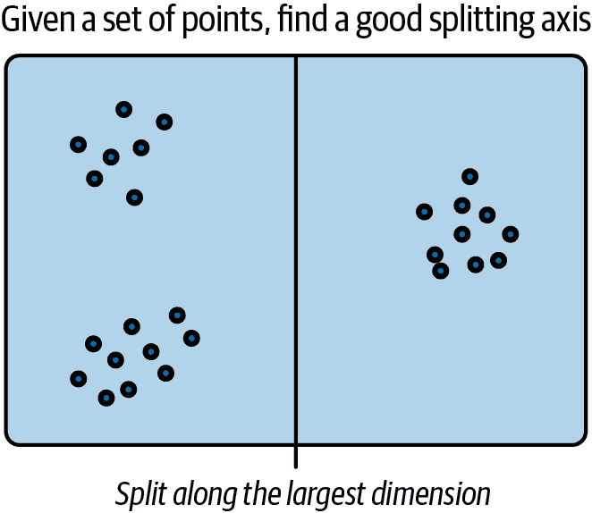
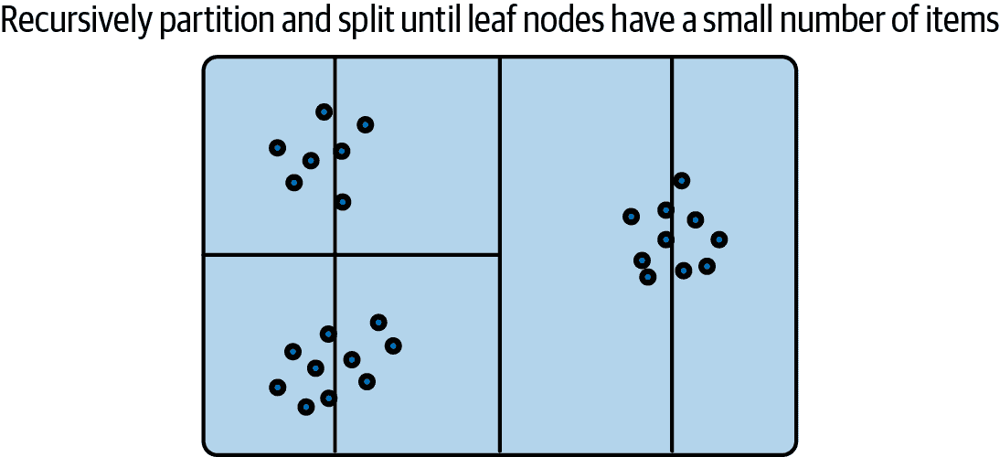
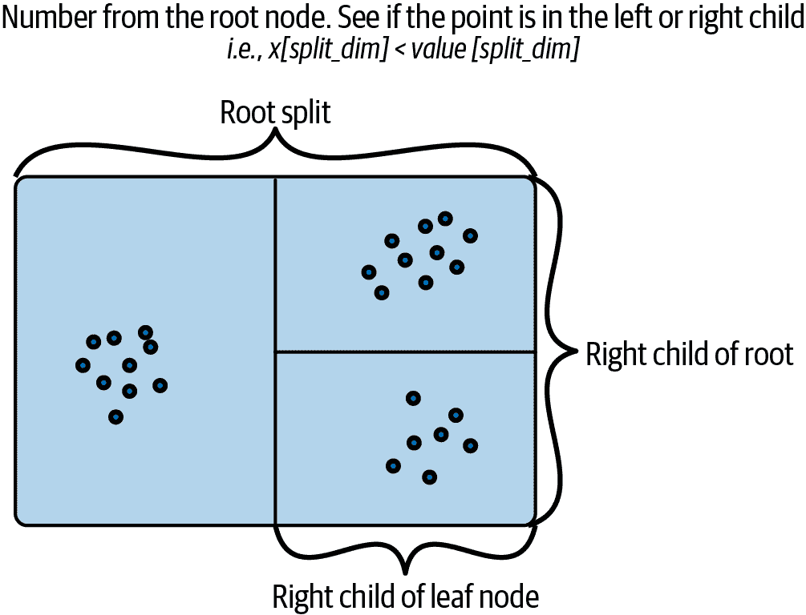
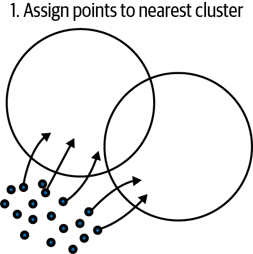
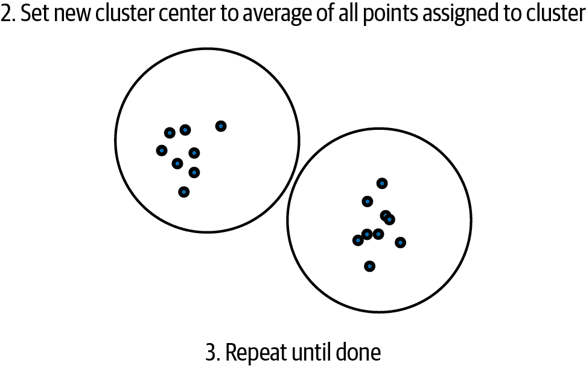

# 第十六章。加速结构

那么什么是加速结构？在计算机科学术语中，当您尝试逐个对语料库中的每个项目进行排名时，如果有*N*个项目，通常需要的时间与*N*成正比。这称为[大 O 符号](https://oreil.ly/9-ton)。因此，如果您有一个用户向量，并且有一个包含*N*个项目的语料库，那么通常需要*O*(*N*)时间来为用户评分语料库中的所有项目。如果*N*很小且可以容纳在 GPU 内存中，通常*N* < 100 万个项目左右，这通常是可处理的。但是，如果我们有一个非常大的语料库，例如十亿个项目，如果我们还必须为十亿个用户进行推荐，那么在大 O 符号中，为每个十亿个用户评分十亿个项目将需要*O*(10¹⁸)的点积运算。

在本章中，我们将尝试将*O*(*N* * *M*)的时间减少到与物品数*N*和用户数*M*的数量成比例的子线性时间。我们将讨论包括以下策略：

+   划分

+   局部敏感哈希

+   *k*-d 树

+   分层 k 均值

+   更便宜的检索方法

我们还将涵盖与每种策略相关的权衡及其可能用途。在所有以下示例中，我们假设用户和项目由相同大小的嵌入向量表示，并且用户和项目之间的关系是简单的点积、余弦距离或欧几里得距离。如果我们要使用像两塔模型这样的神经网络来为用户和项目评分，那么可能唯一可用于加速的方法可能是划分或某种更便宜的预过滤方法。

# 划分

*划分*可能是最简单的策略，用于[分而治之](https://oreil.ly/ul_IK)。假设您有*k*台机器、*N*个项目和*M*个用户。使用划分策略，您可以将运行时间减少到*O*(*N* * *M* / *k*)。您可以通过为每个项目分配一个唯一标识符来做到这一点，因此您有(*`unique_id`*, *`item_vector`*)的元组。然后，通过简单地取`machine_id = unique_id % K`，我们可以将语料库的子集分配给不同的机器。

当用户需要推荐时，我们可以预先计算或按需计算排名靠前的推荐结果，通过将工作负载分布到*k*台机器上，从而使计算速度提高*k*倍，除了在服务器上收集并联合排序顶部结果时的开销。请注意，如果您想要例如前 100 名的最高得分项目，您仍然需要从每个分片获取前 100 个结果，将它们合并在一起，然后联合排序所有结果，这样才能获得与全文本评分方法相同的结果。

划分在可以与任何其他加速方法结合，并且不依赖于具有任何特定形式（如单个向量）的表示方式方面非常有用。

# 局部敏感哈希

*局部敏感哈希*（LSH）是一种将向量转换为基于标记的表示的有趣技术。这是强大的，因为如果 CPU 容易获得，我们可以使用它们通过使用更便宜的整数算术操作（如 XOR 和位计数）来计算向量之间的相似性，而不是浮点运算。整数操作在 CPU 上比浮点运算快得多，因此我们可以比使用向量操作更快地计算项目之间的相似性。

另一个好处是，一旦项目表示为一系列标记，常规搜索引擎数据库可以通过使用标记匹配来存储和检索这些项目。另一方面，常规哈希倾向于在输入发生轻微变化时产生截然不同的哈希码。这并不是对哈希函数的批评；它们只是针对不同类型数据的不同用途。

让我们来看一下将向量转换为哈希值的几种方法。LSH 与常规哈希不同之处在于，对向量的小扰动应导致与原始向量的哈希位相同。这是一个重要的特性，因为它允许我们通过使用快速方法（如哈希映射）来查找向量的邻域。一种简单的哈希方法称为[比较推理的力量](https://oreil.ly/_1Bd8)，或者全胜哈希。在这种哈希方案中，向量首先通过已知的、可重现的置换进行排列。我们可以通过简单地使用接受种子并可靠地复现相同洗牌序列的随机数生成器来生成这种已知置换。重要的是，这种置换在不同版本的 Python 中是稳定的，因为我们希望在生成哈希时以及检索时都能够复现哈希操作。由于我们使用的是 JAX 的随机库，而 JAX 对于置换的可重现性非常注意，因此我们直接使用 JAX 中的置换函数。之后的哈希码计算只是对置换向量的相邻维度进行比较，如示例 16-1 所示。

##### 示例 16-1\. 全胜

```py
def compute_wta_hash(x):
  """Example code to compute some Winner take all hash vectors
 Args:
 x: a vector
 Result:
 hash: a hash code
 """
  key = jax.random.PRNGKey(1337)
  permuted = jax.random.permutation(key, x)

  hash1 = permuted[0] > permuted[1]
  hash2 = permuted[1] > permuted[2]

  return (hash1, hash2)

x1 = jnp.array([1, 2, 3])
x2 = jnp.array([1, 2.5, 3])
x3 = jnp.array([3, 2, 1])
x1_hash = compute_wta_hash(x1)
x2_hash = compute_wta_hash(x2)
x3_hash = compute_wta_hash(x3)
print(x1_hash)
print(x2_hash)
print(x3_hash)

(Array(False, dtype=bool), Array(True, dtype=bool))
(Array(False, dtype=bool), Array(True, dtype=bool))
(Array(True, dtype=bool), Array(False, dtype=bool))
```

正如你所见，向量`x2`与`x1`略有不同，结果是相同的哈希码`01`，而`x3`不同，结果是哈希码`10`。然后使用哈希码的[海明距离](https://oreil.ly/RF-x1)计算两个向量之间的距离，如示例 16-2 所示。距离简单地是两个哈希码的异或，即每当位不同时结果为 1，随后进行位计数。

##### 示例 16-2\. 海明函数

```py
x = 16
y = 15
hamming_xy = int.bit_count(x ^ y)
print(hamming_xy)
5
```

如此处所示，使用汉明距离可以加快距离计算速度，但主要的加速来自于在哈希映射中使用哈希码。例如，我们可以将哈希码分成 8 位块，并将语料库存储在由每个 8 位块键入的分片中，这将导致 256 倍的加速，因为我们只需查找具有与查询向量相同键的哈希映射。

这在召回方面有一个缺点，因为所有 8 位必须匹配才能检索与查询向量匹配的项。在使用哈希和汉明距离计算时存在一个折衷。哈希码位数越大，搜索速度越快，因为语料库被分割成越来越小的块。然而，缺点是越来越多的位必须匹配，因此在原始空间中的相邻向量中，所有哈希码位可能不匹配，因此可能不会被检索。

解决方法是使用多个具有不同随机数生成器的哈希码，并使用不同的随机种子重复此过程几次。这个额外步骤留作你的练习。

另一种常见的计算哈希位的方法使用[约翰逊-林登斯特劳斯引理](https://oreil.ly/vbAGn)，这是说，当两个向量与同一个随机高斯矩阵相乘时，它们倾向于在相似的位置结束。然而，L2 距离被保留，这意味着当使用欧氏距离来训练嵌入时，这种哈希函数效果更好。在这种方案中，只有哈希码计算不同；汉明距离处理完全相同。

LSH 的加速与哈希码的精确匹配位数成正比。假设哈希映射中仅使用了哈希码的 8 位，那么加速比就是 2⁸，即比原始速度快 256 倍。速度的折衷是需要将哈希映射存储在内存中。

# k-d Trees

计算机科学中加速计算的一种常见策略是*分而治之*。在这种方案中，数据被递归地分成两半，只搜索与搜索查询相关的半部分。与语料库中项数的线性*O*(*n*)相比，分而治之算法能在*O*(log2(*n*))的时间内查询语料库，如果*n*很大，这将显著加快速度。

一种用于向量空间的这种二叉树称为[*k*-d 树](https://oreil.ly/z0vFO)。通常，构建*k*-d 树时，我们计算集合中所有点的边界框，找到边界框的最长边，并沿着该边的中间在分割维度上进行分割，然后将集合分成两半。如果使用中位数，则集合在该分割维度上被更多或更少地分成两半；我们说*更多或更少*，因为在该分割维度上可能存在平局。递归过程在叶子节点中剩余少量项时停止。有许多*k*-d 树的实现，例如[SciPy 的*k*-d 树](https://oreil.ly/iZZD9)。

尽管加速效果显著，但这种方法在向量的特征维度较低时更有效。同其他方法类似，*k*-d 树在欧氏距离作为嵌入的度量时效果最佳。如果使用点积作为相似度度量，可能会造成检索损失，因为*k*-d 树更适合于欧几里得空间的划分。

示例 16-3 提供了分割一批点的示例代码，沿着最大维度进行分割。

##### 示例 16-3\. 通过*k*-d 树进行分区

```py
import jax
import jax.numpy as jnp

def kdtree_partition(x: jnp.ndarray):
  """Finds the split plane and value for a batch of vectors x."""
  # First, find the bounding box.
  bbox_min = jnp.min(x, axis=0)
  bbox_max = jnp.max(x, axis=0)
  # Return the largest split dimension and value.
  diff = bbox_max - bbox_min
  split_dim = jnp.argmax(diff)
  split_value = 0.5 * (bbox_min[split_dim] + bbox_max[split_dim])
  return split_dim, split_value

key = jax.random.PRNGKey(42)
x = jax.random.normal(key, [256, 3]) * jnp.array([1, 3, 2])
split_dim, split_value = kdtree_partition(x)
print("Split dimension %d at value %f" % (split_dim, split_value))

# Partition the points into two groups, the left subtree
# has all the elements left of the splitting plane.
left = jnp.where(x[:, split_dim] < split_value)
right = jnp.where(x[:, split_dim] >= split_value)

Split dimension 1 at value -0.352623
```

如代码所示，*k*-d 树分割代码可以简单地沿着最长维度的中间进行分割。其他可能性包括沿着最长维度的中位数分割或者[使用表面积启发式](https://oreil.ly/BxAf7)。

*k*-d 树通过重复沿着一个空间维度（通常沿着数据分布最广的主轴）进行数据分割来构建；参见 图 16-1。



###### 图 16-1\. k-d 树构建的初始边界框

分割通常会再次递归地沿着最长轴进行细分，直到分割中的点数少于所选的小数目；参见 图 16-2。

*k*-d 树的查找时间为*O*(log2(*n*))，其中*n*为语料库中的项数。树本身需要一些额外的内存开销来存储，主要由叶子节点数量决定，因此最好在叶子节点中具有最小数量的项，以防止分割过细。



###### 图 16-2\. k-d 树递归分割

从根节点开始，重复检查查询点（例如，我们正在寻找最近邻居的项目）是否在根节点的左侧或右侧子节点中，如图 16-3 所示。例如，使用`go_left = x[split_dim] < value_split[dim]`。在二叉树约定中，左子节点包含所有在分割维度上值小于分割值的点。因此，如果查询点在分割维度上的值小于分割值，则向左移动，否则向右移动。递归地沿着树向下降，直到达到叶节点；然后详尽计算所有叶节点中项目到查询点的距离。



###### 图 16-3\. k-d 树查询

*k*-d 树存在一个潜在的缺点。如果一个项目接近分割平面，该项目将被认为在树的另一侧。因此，该项目不会被考虑为最近邻居候选。在某些*k*-d 树的实现中，称为*溢出树*，如果查询点足够接近平面的决策边界，则会访问分割平面的两侧。这种改变稍微增加了运行时，以换取更高的召回率。

# 分层*k*-均值

另一种可以扩展到更高特征维度的分而治之策略是*k*-均值聚类。在这种方案中，语料库被聚类成*k*个聚类，然后递归地聚类成*k*个更多的聚类，直到每个聚类小于一个定义的限制。

*k*-均值的实现可以在[scikit-learn 的网页](https://oreil.ly/E45Lo)找到。

要构建聚类，首先从现有点随机创建聚类中心（见图 16-4）。



###### 图 16-4\. k 均值初始化

接下来，我们将所有点分配到它们最接近的聚类中。然后对于每个聚类，我们将所有分配点的平均值作为新的聚类中心。我们重复此过程直到完成，这可以是固定步骤的数量。图 16-5（见图 16-5）说明了这个过程。然后的输出是*k*个点的聚类中心。可以再次为每个聚类中心重复此过程，再次分割成*k*个更多的聚类。



###### 图 16-5\. k 均值聚类

再次，速度提升是*O*(log(*n*))的项目数量，但*k*-均值比*k*-d 树更适合于聚类高维数据点。

对于*k*-均值聚类的查询非常直接。您可以找到最接近查询点的最接近聚类，然后对所有子聚类重复该过程，直到找到叶节点为止；然后对叶节点中的所有项目与查询点进行评分。

一种替代*k*-means 的方法是执行 SVD，并使用前*k*个特征向量作为聚类标准。使用 SVD 有趣之处在于存在像[power iteration](https://oreil.ly/ZgZ2-)这样的封闭形式和近似方法来计算特征向量。使用点积来计算亲和力可能更适合使用点积训练的向量作为亲和度度量。

要了解更多相关信息，您可以参考 Jason Weston 等人撰写的[“标签分区用于次线性排名”](https://oreil.ly/rMg-3)。该论文比较了 LSH、SVD 和分层*k*-means 的性能提升及检索损失，以暴力方法为基准。

# 基于图的 ANN

在 ANN 中的一个新兴趋势是使用基于图的方法。最近，*分层可导航小世界*是一种特别流行的方法。这种[图算法](https://oreil.ly/Z2ohy)在多层结构中编码接近性，然后依赖于通用的“从一个节点到另一个节点的连接步数通常惊人地少”的最大值。在基于图的 ANN 方法中，通常找到一个邻居，然后遍历与该邻居连接的边以快速找到其他节点。

# 更便宜的检索方法

如果您的语料库能够进行逐项便宜的检索方法，加快搜索的一种方式是使用便宜的检索方法获取一小部分项目，然后使用更昂贵的基于向量的方法对子集进行排名。其中一种便宜的检索方法是制作一个项目与另一个项目的顶部共现的帖子列表。然后，当生成用于排名的候选集时，将用户首选项目中的所有顶部共现项目收集在一起，并与 ML 模型一起对它们进行评分。通过这种方式，我们不必对整个语料库使用 ML 模型进行评分，而只需对一个小子集进行评分。

# 摘要

在本章中，我们展示了一些加快语料库中项目检索和评分的方法，给定一个查询向量，同时不会太多地损失召回率，同时仍保持精度。没有一种 ANN 方法是完美的，因为加速结构依赖于数据的分布，而这在数据集之间是不同的。我们希望本章能为您提供一个探索使检索更快且与语料库中项目数量亚线性相关的各种方法的起点。
