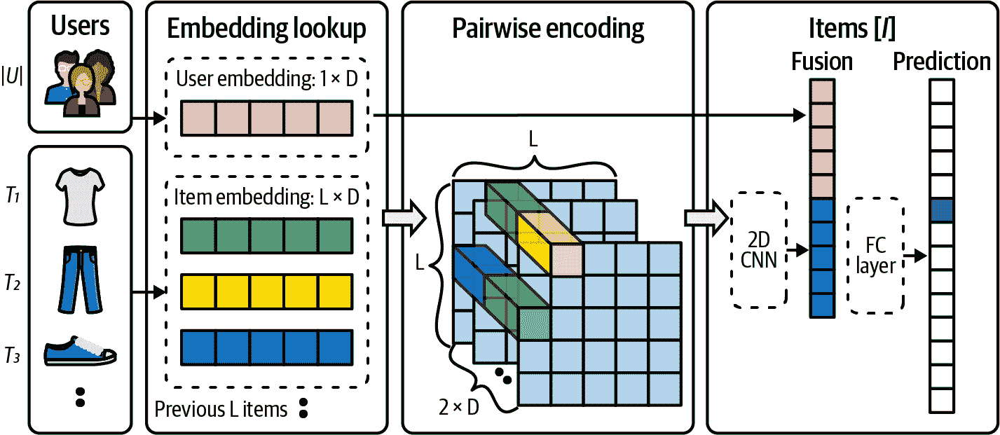

# 第十七章 顺序推荐

在我们迄今的旅程中，您已经了解了出现在推荐问题中的各种显式或潜在的特征。一种已经隐含出现的特征是以前的推荐和交互历史。您可能想在这里提出异议：“到目前为止，我们所做的所有工作都考虑了以前的推荐和交互！我们甚至学习了关于预测训练数据的内容。”

这是真的，但它未能考虑到关于*导致推理请求的推荐序列*之间更明确的关系。让我们通过一个例子来区分这两者。您的视频流网站知道您以前看过达伦·阿伦诺夫斯基的所有电影，因此当*The Whale*发布时，该网站很可能会推荐它。但这种类型的推荐与您在观看*Succession*第 10 集之后可能收到的推荐不同。您可能已经在长时间内观看了阿伦诺夫斯基的电影——*Pi*是多年前，*Black Swan*则是今年早些时候。但您本周每晚都在观看*Succession*的一集，并且您整个最近的历史记录都是关于洛根·罗伊。后一种情况是一个顺序推荐问题：根据最近的有序交互列表预测您下一个可能喜欢的内容。

就建模目标而言，我们所见过的推荐系统使用了潜在的推荐和历史交互之间的成对关系。顺序推荐的目标是基于过去的顺序交互来预测用户的下一个动作，这些交互可能更高阶——即三个或更多项之间的交互组合。大多数顺序推荐模型涉及顺序数据挖掘技术，如马尔可夫链、递归神经网络（RNN）和自注意力。这些模型通常考虑短期用户行为，对随时间稳定的全局用户偏好甚至无视。

顺序推荐的最初工作集中于建模连续项目之间的过渡。这些方法使用了马尔可夫链和基于转换的方法。随着深度学习方法在建模顺序数据方面表现出越来越多的潜力——例如它们在自然语言处理中的最大成功——人们开始尝试使用神经网络架构来建模用户交互历史的顺序动态。在这方面的早期成功包括使用 RNN 来模拟用户的顺序交互的 GRU4Rec。最近，变压器架构展示了优越的顺序数据建模性能。变压器架构适合有效的并行化，并且在建模长序列方面非常有效。

# 马尔可夫链

尽管在历史推荐中寻找关系，我们所考虑的模型通常未能捕捉用户行为的顺序模式，因此忽略了用户互动的时间顺序。为了解决这一缺点，开发了顺序推荐系统，其中包括使用马尔可夫链等技术来建模项目之间的时间依赖关系。

*马尔可夫链*是一种随机模型，基于*无记忆性*原则运作。它模拟了从一个状态转移到另一个状态的概率——在给定当前状态的情况下——而不考虑先前事件的顺序。马尔可夫链通过将每个状态视为一个项，将转换概率视为用户在当前项之后与某个项互动的可能性，来建模用户的顺序行为。

第一阶马尔可夫链，即未来状态仅依赖于当前状态的模型，在早期的顺序推荐系统中是一种常见策略。尽管简单，第一阶马尔可夫链有效地捕捉到了短期的、项到项的转换模式，从而提高了推荐质量，超过了非序列方法。

举例来说，我们前面的*Succession*示例。如果仅使用一阶马尔可夫链，一个非常好的启发式方法是“如果是系列的话，下一集是什么；否则，退回到协同过滤（CF）模型。” 你可以看到，对于大部分的观看时间，这个简单的一阶链会告诉用户简单地观看系列的下一集。这并不是特别启发式，但是是一个好迹象。当你进一步抽象时，你开始得到更强大的方法。

在实际应用中，第一阶段的假设并不总是成立，因为用户行为通常受到较长历史互动的影响。为了克服这一限制，更高阶的马尔可夫链向前看更远：下一个状态由一组先前状态决定，提供了更丰富的用户行为模型。然而，选择适当的阶数至关重要，因为阶数过高可能导致过拟合和转移矩阵的稀疏性。

## 二阶马尔可夫链

考虑一个关于使用天气的*二阶马尔可夫链*模型的示例。假设我们有三个状态：晴天（ <math alttext="upper S"><mi>S</mi></math> ）、多云（ <math alttext="upper C"><mi>C</mi></math> ）和雨天（ <math alttext="upper R"><mi>R</mi></math> ）。

在二阶马尔可夫链中，今天的天气（ <math alttext="t"><mi>t</mi></math> ）将取决于昨天（ <math alttext="t minus 1"><mrow><mi>t</mi> <mo>-</mo> <mn>1</mn></mrow></math> ）和前天（ <math alttext="t minus 2"><mrow><mi>t</mi> <mo>-</mo> <mn>2</mn></mrow></math> ）的天气。转移概率可以表示为 <math alttext="upper P left-parenthesis upper S Subscript t Baseline vertical-bar upper S Subscript t minus 1 Baseline comma upper S Subscript t minus 2 Baseline right-parenthesis"><mrow><mi>P</mi> <mo>(</mo> <msub><mi>S</mi> <mi>t</mi></msub> <mo>|</mo> <msub><mi>S</mi> <mrow><mi>t</mi><mo>-</mo><mn>1</mn></mrow></msub> <mo>,</mo> <msub><mi>S</mi> <mrow><mi>t</mi><mo>-</mo><mn>2</mn></mrow></msub> <mo>)</mo></mrow></math> 。

马尔可夫链可以由转移矩阵来定义，该矩阵提供了从一个状态转移到另一个状态的概率。但是，因为我们处理的是二阶马尔可夫链，我们将有一个转移张量。为简单起见，让我们假设我们有以下转移概率：

<math alttext="StartLayout 1st Row 1st Column upper P left-parenthesis upper S vertical-bar upper S comma upper S right-parenthesis 2nd Column equals 0.7 comma upper P left-parenthesis upper C vertical-bar upper S comma upper S right-parenthesis equals 0.2 comma upper P left-parenthesis upper R vertical-bar upper S comma upper S right-parenthesis equals 0.1 comma 2nd Row 1st Column upper P left-parenthesis upper S vertical-bar upper S comma upper C right-parenthesis 2nd Column equals 0.3 comma upper P left-parenthesis upper C vertical-bar upper S comma upper C right-parenthesis equals 0.4 comma upper P left-parenthesis upper R vertical-bar upper S comma upper C right-parenthesis equals 0.3 comma 3rd Row 1st Column Blank 2nd Column ellipsis EndLayout" display="block"><mtable displaystyle="true"><mtr><mtd columnalign="right"><mrow><mi>P</mi> <mo>(</mo> <mi>S</mi> <mo>|</mo> <mi>S</mi> <mo>,</mo> <mi>S</mi> <mo>)</mo></mrow></mtd> <mtd><mrow><mo>=</mo> <mn>0</mn> <mo>.</mo> <mn>7</mn> <mo>,</mo> <mi>P</mi> <mo>(</mo> <mi>C</mi> <mo>|</mo> <mi>S</mi> <mo>,</mo> <mi>S</mi> <mo>)</mo> <mo>=</mo> <mn>0</mn> <mo>.</mo> <mn>2</mn> <mo>,</mo> <mi>P</mi> <mo>(</mo> <mi>R</mi> <mo>|</mo> <mi>S</mi> <mo>,</mo> <mi>S</mi> <mo>)</mo> <mo>=</mo> <mn>0</mn> <mo>.</mo> <mn>1</mn> <mo>,</mo></mrow></mtd></mtr> <mtr><mtd columnalign="right"><mrow><mi>P</mi> <mo>(</mo> <mi>S</mi> <mo>|</mo> <mi>S</mi> <mo>,</mo> <mi>C</mi> <mo>)</mo></mrow></mtd> <mtd><mrow><mo>=</mo> <mn>0</mn> <mo>.</mo> <mn>3</mn> <mo>,</mo> <mi>P</mi> <mo>(</mo> <mi>C</mi> <mo>|</mo> <mi>S</mi> <mo>,</mo> <mi>C</mi> <mo>)</mo> <mo>=</mo> <mn>0</mn> <mo>.</mo> <mn>4</mn> <mo>,</mo> <mi>P</mi> <mo>(</mo> <mi>R</mi> <mo>|</mo> <mi>S</mi> <mo>,</mo> <mi>C</mi> <mo>)</mo> <mo>=</mo> <mn>0</mn> <mo>.</mo> <mn>3</mn> <mo>,</mo></mrow></mtd></mtr> <mtr><mtd><mo>...</mo></mtd></mtr></mtable></math>

您可以在一个三维立方体中可视化这些概率。前两个维度表示今天和昨天的状态，第三个维度表示明天的可能状态。

如果过去两天的天气是晴朗的，并且我们想预测明天的天气，我们将查看从 <math alttext="left-parenthesis upper S comma upper S right-parenthesis"><mrow><mo>(</mo> <mi>S</mi> <mo>,</mo> <mi>S</mi> <mo>)</mo></mrow></math> 开始的转移概率，分别是 <math alttext="upper P left-parenthesis upper S vertical-bar upper S comma upper S right-parenthesis equals 0.7"><mrow><mi>P</mi> <mo>(</mo> <mi>S</mi> <mo>|</mo> <mi>S</mi> <mo>,</mo> <mi>S</mi> <mo>)</mo> <mo>=</mo> <mn>0</mn> <mo>.</mo> <mn>7</mn></mrow></math> 、<math alttext="upper P left-parenthesis upper C vertical-bar upper S comma upper S right-parenthesis equals 0.2"><mrow><mi>P</mi> <mo>(</mo> <mi>C</mi> <mo>|</mo> <mi>S</mi> <mo>,</mo> <mi>S</mi> <mo>)</mo> <mo>=</mo> <mn>0</mn> <mo>.</mo> <mn>2</mn></mrow></math> 和 <math alttext="upper P left-parenthesis upper R vertical-bar upper S comma upper S right-parenthesis equals 0.1"><mrow><mi>P</mi> <mo>(</mo> <mi>R</mi> <mo>|</mo> <mi>S</mi> <mo>,</mo> <mi>S</mi> <mo>)</mo> <mo>=</mo> <mn>0</mn> <mo>.</mo> <mn>1</mn></mrow></math> 。因此，根据我们的模型，有 70% 的可能是晴天，20% 的可能是多云，10% 的可能是雨天。

转移矩阵（或张量）中的概率通常是根据数据估计的。如果您有几年天气的历史记录，您可以计算每个转移发生的次数，并除以总转移次数来估计概率。

这只是一个二阶马尔可夫链的基本演示。在实际应用中，状态可能更多，转移矩阵可能更大，但原则仍然相同。

## 其他马尔可夫模型

更高级的马尔可夫方法是*马尔可夫决策过程*（*MDP*），通过引入动作和奖励扩展了马尔可夫链。在推荐系统的背景下，每个动作可以代表一个推荐，奖励可以是用户对推荐的响应。通过整合用户反馈，MDP 可以学习更个性化的推荐策略。

MDPs 被定义为一个四元组 <math alttext="left-parenthesis upper S comma upper A comma upper P comma upper R right-parenthesis"><mrow><mo>(</mo> <mi>S</mi> <mo>,</mo> <mi>A</mi> <mo>,</mo> <mi>P</mi> <mo>,</mo> <mi>R</mi> <mo>)</mo></mrow></math> ，其中 <math alttext="upper S"><mi>S</mi></math> 是状态集合， <math alttext="upper A"><mi>A</mi></math> 是动作集合， <math alttext="upper P"><mi>P</mi></math> 是状态转移概率矩阵， <math alttext="upper R"><mi>R</mi></math> 是奖励函数。

让我们以电影推荐系统的简化 MDP 为例：

状态（ <math alttext="upper S"><mi>S</mi></math> ）

这些可以代表用户过去观看的电影类型。为简单起见，假设我们有三种状态：喜剧（ <math alttext="upper C"><mi>C</mi></math> ）、剧情片（ <math alttext="upper D"><mi>D</mi></math> ）和动作片（ <math alttext="upper A"><mi>A</mi></math> ）。

动作（ <math alttext="upper A"><mi>A</mi></math> ）

这些可以代表可以推荐的电影。例如，我们假设有五个动作（电影）：电影 1、2、3、4 和 5。

过渡概率（ <math alttext="upper P"><mi>P</mi></math> ）

这表示在给定特定动作的情况下，从一个状态过渡到另一个状态的可能性。例如，如果用户刚看过一部剧情片（ <math alttext="upper D"><mi>D</mi></math> ），我们推荐电影 3（这是一部动作片），过渡概率 <math alttext="upper P left-parenthesis upper A vertical-bar upper D comma upper M o v i e Baseline 3 right-parenthesis"><mrow><mi>P</mi> <mo>(</mo> <mi>A</mi> <mo>|</mo> <mi>D</mi> <mo>,</mo> <mi>M</mi> <mi>o</mi> <mi>v</mi> <mi>i</mi> <mi>e</mi> <mn>3</mn> <mo>)</mo></mrow></math> 可能为 0.6，表示用户再次观看动作片的概率为 60%。

奖励（ <math alttext="upper R"><mi>R</mi></math> ）

这是用户在采取行动（推荐）后的反馈。为简单起见，假设用户点击推荐的电影会得到 +1 的奖励，没有点击则为 0 的奖励。

在这种情况下，推荐系统的目标是学习一个策略 <math alttext="pi colon upper S right-arrow upper A"><mrow><mi>π</mi> <mo>:</mo> <mi>S</mi> <mo>→</mo> <mi>A</mi></mrow></math>，以最大化预期累积奖励。策略指导代理（推荐系统）在每个状态下应该采取的行动。

这个策略可以通过强化学习算法（如 Q-learning 或策略迭代）来学习，这些算法本质上是学习在状态中采取行动的价值（例如，在用户观看某种类型电影后推荐电影），考虑即时奖励和潜在的未来奖励。

在现实世界的推荐系统场景中，主要挑战在于状态和动作空间都非常大，而过渡动态和奖励函数可能复杂且难以准确估计。但是，这个简单示例中展示的原则依然适用。

尽管基于马尔可夫链的推荐系统表现出有希望的性能，仍然存在一些挑战。马尔可夫链的*无记忆*假设在存在长期依赖关系的某些情景中可能不成立。此外，大多数马尔可夫链模型将用户-项目交互视为二进制事件（交互或无交互），这简化了用户可能与项目进行的各种交互，例如浏览、点击和购买。

接下来，我们将介绍神经网络。我们将看到你可能熟悉的一些体系结构如何与学习顺序推荐任务相关。

# RNN 和 CNN 体系结构

*循环神经网络*（RNNs）是一种设计用于识别数据序列中模式的神经网络体系结构，例如文本、语音或时间序列数据。这些网络在*循环*中，即序列中一个步骤的输出被反馈到网络作为下一个步骤处理时的输入。这赋予了 RNNs 一种记忆形式，对于像语言建模这样的任务非常有帮助，其中每个词依赖于前面的词。

在每个时间步骤，RNN 接收一个输入（例如句子中的一个单词）并生成一个输出（例如下一个单词的预测）。它还更新内部状态，这是其在序列中“看到”的内容的表示。这个内部状态在处理下一个输入时被传回网络。因此，网络可以利用先前步骤的信息来影响当前步骤的预测。这就是 RNN 有效处理序列数据的原因。

[GRU4Rec](https://oreil.ly/OwEFj) 使用循环神经网络来建模基于会话的推荐，在推荐问题的神经网络体系结构中是最早的应用之一。*会话*指的是用户交互的单一连续期间，例如在页面上花费的时间，而没有用户导航离开或关闭计算机。

这里我们将看到顺序推荐系统的一个显著优势：大多数传统推荐方法依赖于显式的用户 ID 来构建用户兴趣模型。然而，基于会话的推荐系统操作匿名用户会话，这些会话通常非常短，以允许进行个人资料建模。此外，在不同会话中用户动机可能会有很大的变化。针对这种推荐情况的无关用户推荐的解决方案是基于项目的模型，其中计算了在单个会话中共现的项目的项目-项目相似性矩阵。这个预先计算的相似性矩阵在运行时用于推荐最相似的上一个点击的项目。这种方法显然有明显的局限性，比如仅依赖于最后点击的项目。为此，GRU4Rec 使用会话中的所有项目，并将会话建模为项目序列。推荐要添加的项目的任务转化为预测序列中的下一个项目。

不同于语言的小固定大小词汇表，推荐系统需要处理随着添加更多项目而逐渐增长的大量项目。为了处理这个问题，考虑了成对排名损失（例如，BPR）。GRU4Rec 进一步在 [GRU4Rec+](https://oreil.ly/Y17DB) 中进行了扩展，该模型利用了专门设计用于顶部 *k* 推荐增益的新损失函数。这些损失函数融合了深度学习和 LTR，以解决神经推荐设置中的问题。

用于推荐的神经网络的另一种方法采用了 CNN 用于顺序推荐。我们不会在这里介绍 CNN 的基础知识，但您可以参考 Brandon Rohrer 的 [“How Do Convolutional Neural Networks Work?”](https://oreil.ly/-jEiE) 来了解基本内容。

让我们讨论一种表现出了很大成功的方法，[CosRec](https://oreil.ly/wlCdN)，如 Figure 17-1 所示。这种方法（及其他方法）以类似于本书大部分内容中使用的 MF 结构开始：一个用户-项目矩阵。我们假设有两个潜在因子矩阵，<math alttext="upper E Subscript script upper I"><msub><mi>E</mi> <mi>ℐ</mi></msub></math> 和 <math alttext="upper E Subscript script upper U"><msub><mi>E</mi> <mi>𝒰</mi></msub></math>，但让我们首先关注项目矩阵。

项目矩阵中的每个向量都是单个项目的嵌入向量，但我们希望编码序列：取长度为<math alttext="upper L"><mi>L</mi></math>的序列，并收集这些嵌入向量。现在我们有一个<math alttext="upper L times upper D"><mrow><mi>L</mi> <mo>×</mo> <mi>D</mi></mrow></math>矩阵，每个序列中的项目都有一行。将相邻行作为对，并为三维张量中的每个向量连接它们；这有效地捕获了序列作为一系列成对转换。这个三维张量可以通过矢量化的二维 CNN 传递，生成一个向量（长度为<math alttext="upper L"><mi>L</mi></math> ），这个向量与原始用户向量连接并通过完全连接的层传递。最后，二元交叉熵是我们的损失函数，试图预测最佳推荐。

###### 图 17-1。CosRec CNN

# 注意力架构

一个与神经网络常见相关的术语，现在可能让你有所耳闻的是*注意力*。这是因为变压器，特别是出现在大型语言模型（LLM）中的那种，如广义预训练变压器，已成为人工智能用户的中心关注点。

我们将在这里提供一个极为简要且不太技术性的自我关注和变压器介绍。要了解更详细的变压器指南，请参阅 Brandon Rohrer 撰写的优秀概述[“从零开始的变压器”](https://oreil.ly/4PSx-)。

首先，让我们阐明关于变压器模型的一个关键区别性假设：嵌入是有位置的。我们希望不仅为每个项目学习一个嵌入，而且为每个项目-位置对学习一个嵌入。因此，当一篇文章是会话中的第一个和最后一个时，这两个实例被视为*两个独立的项目*。

另一个重要的概念是堆叠。在构建变压器时，我们经常将架构想象成一层一层堆叠的层蛋糕。关键组件包括嵌入、自我关注层、跳跃添加和前馈层。最复杂的操作发生在自我关注中，因此让我们首先专注于这一点。我们刚刚讨论了位置嵌入，它们被发送为这些嵌入向量的序列；请记住，变压器是一个序列到序列模型！跳跃添加意味着我们将嵌入向前*环绕*自我关注层（和上面的前馈层），并将其添加到注意力层的位置输出上。前馈层是一个不起眼的多层感知器，留在位置列中，并使用 ReLU 或 GeLU 激活函数。

# ReLU 与 GeLU

ReLU（修正线性单元）是一个激活函数，定义为<math alttext="f left-parenthesis x right-parenthesis equals max left-parenthesis 0 comma x right-parenthesis"><mrow><mi>f</mi> <mo>(</mo> <mi>x</mi> <mo>)</mo> <mo>=</mo> <mo form="prefix" movablelimits="true">max</mo> <mo>(</mo> <mn>0</mn> <mo>,</mo> <mi>x</mi> <mo>)</mo></mrow></math>。GeLU（高斯误差线性单元）是另一个激活函数，近似为<math alttext="f left-parenthesis x right-parenthesis equals 0.5 x left-parenthesis 1 plus hyperbolic tangent left-parenthesis StartRoot StartFraction 2 Over pi EndFraction EndRoot left-parenthesis x plus 0.044715 x cubed right-parenthesis right-parenthesis right-parenthesis"><mrow><mi>f</mi> <mrow><mo>(</mo> <mi>x</mi> <mo>)</mo></mrow> <mo>=</mo> <mn>0</mn> <mo>.</mo> <mn>5</mn> <mi>x</mi> <mfenced close=")" open="(" separators=""><mn>1</mn> <mo>+</mo> <mo form="prefix">tanh</mo> <mfenced close=")" open="(" separators=""><msqrt><mfrac><mn>2</mn> <mi>π</mi></mfrac></msqrt> <mfenced close=")" open="(" separators=""><mi>x</mi> <mo>+</mo> <mn>0</mn> <mo>.</mo> <mn>044715</mn> <msup><mi>x</mi> <mn>3</mn></msup></mfenced></mfenced></mfenced></mrow></math>，受到高斯累积分布函数的启发。GeLU 的直觉是，它倾向于让小值的<math alttext="x"><mi>x</mi></math>通过，同时平滑饱和极端值，可能使深度模型的梯度流更好。这两个函数都在神经网络中引入非线性，GeLU 在某些情况下通常展示出比 ReLU 更好的学习动态。

这里有关于自注意力的一些快速提示：

+   自注意力背后的思想是序列中的每个元素都以某种方式影响着其他所有元素。

+   自注意力层每个头部学习四个权重矩阵。

+   头部与序列长度一一对应。

+   我们经常将权重矩阵称为<math alttext="upper Q comma upper K comma upper O comma upper V"><mrow><mi>Q</mi> <mo>,</mo> <mi>K</mi> <mo>,</mo> <mi>O</mi> <mo>,</mo> <mi>V</mi></mrow></math>。<math alttext="upper Q"><mi>Q</mi></math>和<math alttext="upper K"><mi>K</mi></math>都与位置嵌入相乘，但<math alttext="upper O"><mi>O</mi></math>和<math alttext="upper V"><mi>V</mi></math>在与嵌入进行点乘之前首先被交叉为一个嵌入维度大小的方阵。<math alttext="upper Q ModifyingAbove upper E With dot"><mrow><mi>Q</mi> <mover accent="true"><mi>E</mi> <mo>˙</mo></mover></mrow></math>和<math alttext="upper K ModifyingAbove upper E With dot"><mrow><mi>K</mi> <mover accent="true"><mi>E</mi> <mo>˙</mo></mover></mrow></math>相乘创建了同名的*注意*矩阵，我们对其进行逐行 softmax 操作以获得注意力向量。

+   一些规范化存在，但我们会忽略它们，因为对于理解来说并不重要。

当我们想准确而简要地谈论注意力时，通常会说：“它采用一系列位置嵌入并将它们全部混合在一起，以学习它们之间的关系。”

## 自注意力顺序推荐

[SASRec](https://oreil.ly/aKKzg)是我们将考虑的第一个 Transformer 模型。这种自回归顺序模型（类似于因果语言模型）从过去的用户互动中预测下一个用户互动。受 Transformer 模型在顺序挖掘任务中成功的启发，基于自注意力的架构用于顺序推荐。

当我们说 SASRec 模型是以自回归方式训练时，我们指的是自注意力允许仅关注序列中较早的位置；不允许向未来看。在我们之前提到的混合术语中，可以将其视为仅向前推进影响。有些人称之为“因果”，因为它尊重时间的因果箭头。该模型还允许可学习的位置编码，这意味着更新会传递到嵌入层。该模型使用两个 Transformer 块。

## BERT4Rec

受 BERT 模型在自然语言处理中的启发，[BERT4Rec](https://oreil.ly/SH9ON)通过训练双向掩码顺序（语言）模型改进了 SASRec。

虽然 BERT 在预训练词嵌入时使用掩码语言模型，但 BERT4Rec 使用此架构训练端到端的推荐系统。它试图预测用户互动序列中的掩码项目。与原始 BERT 模型类似，自注意力是双向的：它可以查看行动序列中的过去和未来互动。为了防止未来信息的泄漏并模拟真实的设置，在推断过程中只掩盖序列中的最后一个项目。使用项目掩码，BERT4Rec 优于 SASRec。然而，BERT4Rec 模型的缺点是计算密集型，需要更长的训练时间。

## 最近采样

最近，顺序推荐和在这些任务中采用 Transformer 架构引起了很大的兴趣。像 BERT4Rec 和 SASRec 这样的深度神经网络模型显示出比传统方法更好的性能。然而，这些模型存在训练速度慢的问题。最近发表的一篇论文——哈哈，明白了吧——解决了如何在实现最先进性能的同时提高训练效率的问题。详细信息请参见 Aleksandr Petrov 和 Craig Macdonald 的[“使用最近采样进行顺序推荐的有效和高效训练”](https://oreil.ly/yV4ro)。

我们刚刚描述的用于顺序模型的两种训练范式是自回归和掩码。自回归试图预测用户交互序列中的下一项，而掩码则试图预测交互序列中的掩码项。自回归方法在训练过程中不使用序列开头作为标签，因此丢失了宝贵的信息。另一方面，掩码方法与顺序推荐的最终目标关联较弱。

Petrov 和 Macdonald 的论文提出了基于最近性的正例采样策略，用于构建训练数据。该采样设计旨在使最近的交互具有更高的采样机会。然而，由于采样机制的概率性质，即使是最老的交互也有非零的被选中机会。采用指数函数作为采样例程，该函数在基于掩码的采样（每个交互具有相等的被采样概率）和自回归采样（从序列末尾采样项目）之间进行插值。在顺序推荐任务中表现出了卓越的性能，同时需要远低于常规训练的时间。将这种方法与其他采样带来显著改进的例子进行比较！

## 合并静态和顺序

Pinterest 最近发布了由 Jiajing Xu 等撰写的[《在 Pinterest 重新思考个性化排名：一种端到端方法》](https://oreil.ly/r_kPN)，描述了其个性化推荐系统，该系统利用原始用户行为。推荐任务被分解为建模用户长期和短期意图。

通过训练一个端到端嵌入模型 PinnerFormer 来理解用户的长期兴趣，该模型从用户在平台上的历史行为中学习。这些行为随后被转换为用户嵌入，设计用于根据预期的长期未来用户活动进行优化。

该过程利用调整后的 Transformer 模型处理用户的顺序行为，旨在预测他们的长期未来活动。每位用户的活动被编制成一个序列，包括他们在特定时间窗口内的行为，如一年。基于图神经网络（GNN）的 PinnerSage 嵌入，结合相关的元数据（例如行为类型、时间戳等），用于为序列中的每个行为添加特征。

与传统的顺序建模任务和顺序推荐系统不同，PinnerFormer 旨在预测延迟未来的用户活动，而不是立即后续的动作。通过训练模型在生成嵌入后的 14 天窗口内预见用户的积极未来互动来实现这一目标。相比之下，传统的顺序模型只会预期下一个动作。

这种替代方法允许嵌入生成以离线批处理模式进行，从而显著减少了基础设施需求。与大多数传统的实时顺序建模系统相比，后者运行成本高昂，需要大量计算和基础设施支持，这些嵌入可以批量生成（例如，每天一次），而不是每次用户执行动作时都生成。

本方法论引入了密集全动作损失，以便批量训练模型。这里的目标不是预测下一个即时动作，而是预测用户在接下来的 <math alttext="k"><mi>k</mi></math> 天内将执行的所有动作。其目的是预测用户在间隔如 <math alttext="upper T plus 3"><mrow><mi>T</mi> <mo>+</mo> <mn>3</mn></mrow></math> 、<math alttext="upper T plus 8"><mrow><mi>T</mi> <mo>+</mo> <mn>8</mn></mrow></math> 和 <math alttext="upper T plus 12"><mrow><mi>T</mi> <mo>+</mo> <mn>12</mn></mrow></math> 的所有积极互动，从而促使系统学习长期意图。虽然传统上会使用最后一个动作的嵌入来进行预测，但密集全动作损失会在动作序列中随机选择位置，并使用相应的嵌入来预测每个位置的所有动作。

基于线下和线上实验结果，使用密集全动作损失来训练长期用户行为显著地弥合了批处理生成和用户嵌入实时生成之间的差距。此外，为了适应用户的短期兴趣，变压器模型实时检索每个用户的最新动作，将其与长期用户嵌入一起处理。

# 摘要

Transformers 和顺序推荐系统确实处于现代推荐系统的前沿。如今，大多数推荐系统的研究集中在顺序数据集领域，最热门的推荐系统使用越来越长的序列进行预测。有两个重要的项目值得关注：

Transformers4Rec

该开源项目由 NVIDIA Merlin 团队设计的可扩展变压器模型。更多详细信息，请参阅 Gabriel de Souza Pereira Moreira 等人的 [“Transformers4Rec：在自然语言处理和顺序/会话式推荐之间架起的桥梁”](https://oreil.ly/jwWBq) 。

Monolith

也被称为 TikTok For You 页面推荐系统，这是当前最受欢迎和令人兴奋的推荐系统之一。它是一种基本的序贯推荐系统，具有一些优雅的混合方法。[“Monolith: 实时推荐系统与无碰撞嵌入表”](https://oreil.ly/EADgK) 由刘卓然等人撰写，涵盖了架构上的考虑。

在本书结束之前，我们的最后一步是考虑一些推荐方法。这些方法并不完全建立在我们已经做过的基础上，但会利用我们已经做过的一些工作，并引入一些新的想法。让我们冲刺到终点吧！
