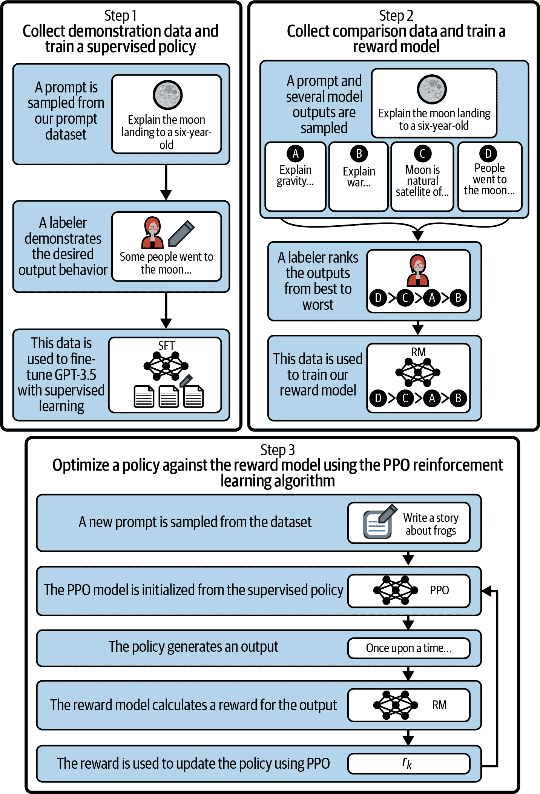

# 第十八章：推荐系统的下一步是什么？

我们正处于推荐系统的过渡时期。然而，这对于这个领域来说是非常正常的，因为它和技术行业的许多部分都是如此紧密相关的。一个与业务目标紧密对齐并具有强大业务价值能力的领域的现实是，该领域往往在不断寻找一切进步的机会。

在本章中，我们将简要介绍推荐系统未来的一些现代观点。一个重要的考虑点是，推荐系统作为一门科学同时深度优先和广度优先地传播。查看该领域最尖端的研究意味着你正在看到几十年来一直在研究的深度优化领域，或者看起来现在纯粹是幻想的领域。

我们在这最后一章选择了三个重点领域。第一个你在本文中已经看到了一些：多模态推荐。随着用户转向平台进行更多活动，这个领域变得越来越重要。请记住，多模态推荐发生在用户同时由几个潜在向量表示的时候。

下一个是基于图的推荐系统。我们已经讨论了共现模型，这是图推荐系统中最简单的模型。它们深入得多！GNN（图神经网络）正变成一种非常强大的机制，用于编码实体之间的关系并利用这些表示，使其对推荐变得有用。

最后，我们将把注意力转向大型语言模型和生成 AI。在撰写本书期间，LLM（大型语言模型）已经从少数 ML 专家理解的东西变成了 HBO 喜剧广播中提到的内容。虽然人们正忙于寻找 LLM 在推荐系统中的相关应用，但业界已经有信心以某些方式应用这些工具。然而，令人兴奋的是，推荐系统应用于 LLM 应用程序的应用。

让我们看看接下来会发生什么！

# 多模态推荐

*多模态推荐* 允许承认 *用户拥有多种特质*：一个用户偏好的单一表示可能无法完全捕捉整个故事。例如，在一个大型综合电子商务网站上购物的人，可能同时是以下所有内容之一：

+   一个经常需要为他们的狗购买物品的狗主人

+   一个父母，一直在更新宝宝成长所需的衣柜。

+   一个业余赛车手，购买了驾驶赛车所需的零件以在赛道上驾驶他们的车。

+   一个乐高投资者，把数百个未拆封的星球大战套装放在壁橱里。

你在本书中学到的方法应该能够很好地为所有这些用户提供推荐。然而，你可能会注意到这个列表中有一些冲突的地方：

+   如果你的孩子还很小，为什么会买乐高积木套装呢？而且，你的狗不会咬它们吗？

+   如果你的车库里摆满了乐高积木，你把所有这些汽车零件放在哪里？

+   在两座位的 Mazdaspeed MX-5 Miata 中你把你的狗放在哪里？

你可能会想到其他一些情况，其中你购买的一些方面与其他方面不太匹配。这导致了多模态性问题：在你的兴趣的潜在空间中，几个地方聚合成模式或中点，但不只有一个。

让我们回顾一下之前的几何讨论：如果你正在使用用户向量的最近邻居，那么哪一个中点将承担最重要的角色？

我们解决这个问题的方式是通过多模态性，或者为单个用户提供几个关联的向量。尽管一个简单的扩展以考虑用户的所有模式的方法是简单地增加模型在项目方面的维度（以创建更多区域，其中不同类型的项目可以不相交地嵌入），但在规模方面，这提出了严重的训练和内存问题。

这个领域的第一项重要工作之一是由本书的一位作者与合著者共同完成的，并引入了一个扩展 MF 来处理这个问题；参见 Jason Weston 等人的 [“通过嵌入多个用户兴趣进行非线性潜在因子分解”](https://oreil.ly/OkzmZ)。目标是同时构建多个潜在因子，正如我们在其他矩阵因子分解方法中所做的那样，希望每个因子都能代表用户的一个兴趣。

这是通过构造一个张量来实现的，该张量的第三个张量维度表示不同兴趣的每个潜在因子，而不是编码用户项目因子分解矩阵。因子分解推广到张量情况，并使用你之前看到的 WSABIE 损失来进行训练。

在这项工作的基础上，几年后，Pinterest 发布了 PinnerSage，正如我们在 第十五章 中提到的那样。这修改了 Weston 等人的论文中的一些假设，不假设每个用户的表示数量已知。此外，这种方法使用基于图的特征表示，我们将在下一节中详细讨论。最后，这种方法使用的最后一个重要修改是聚类：它试图通过在项目空间中进行聚类来构建模式。

基本的 PinnerSage 方法是：

1.  固定项目嵌入（他们称之为 *pins*）。

1.  簇用户交互（无监督和基数未指定）。

1.  构建簇表示作为簇嵌入的中点。

1.  使用中点锚定的近邻搜索进行检索。

PinnerSage 仍然被认为是大规模多模式推荐系统的最新技术。一些系统采取了另一种方法，允许用户通过选择他们正在寻找的主题来更直接地修改他们的“模式”，而另一些系统则希望从一系列交互中学习它。

接下来，我们将看看如何明确指定项目或用户之间的高阶关系。

# 基于图的推荐系统

*图神经网络*（GNNs）是一类利用数据的结构信息来构建数据更深层次表示的神经网络。在处理关系型或网络数据时，它们被证明尤为有效。

在我们继续之前，需要澄清一个概念：在这里我们将使用“图”的意义是指*节点*和*边*的集合。这些是纯数学概念，但通常我们可以认为节点是感兴趣的对象，边是它们之间的关系。这些数学对象有助于提炼出构建所需表示的核心内容。虽然这些对象可能看起来非常简单，但我们可以通过多种方式添加适量的复杂性来捕捉更多细微差别。

在最简单的设置中，图上的每个节点表示一个项目或用户，每条边表示诸如用户与项目之间的关系。然而，用户到用户和项目到项目的网络也是极为强大的扩展。我们的共现模型是简单的图网络；然而，我们并没有从中学习表示，而是直接将其作为我们的模型。

让我们考虑一些例子，添加更多结构到图中以编码想法：

方向性

可以添加到边的顶点上的排序，以指示一个节点对另一个节点的严格关系；例如，一个用户*阅读*一本书，但反过来不行。

边的装饰

可以添加描述符如边标签以传达关系特征；例如，两个用户共享账户凭证，并且*一个用户被识别为儿童*。

多重边

这些可以允许关系具有更高的多重性，或者允许相同的两个实体具有多个关系。在一个服装项为节点的图中，每条边可以是另一种能够使其他两个服装项搭配得当的服装项。

超边

更进一步提高抽象级别可能会添加这些边，这些边同时连接多个节点。对于视频场景，您可能会检测到各种类别的对象，并且您的图表可能会有这些类别的节点，但不仅要理解哪些对象类别成对出现，还要识别出哪些更高阶的组合可以用超边表示。

让我们探讨一下图神经网络（GNNs）的基础知识以及它们的表示稍有不同之处。

## 神经消息传递

在 GNNs 中，我们感兴趣的对象被分配为图中的节点。通常，GNNs 的主要目标是通过它们之间的关系来构建节点和边的强大表示。

GNNs 与传统神经网络的根本区别在于，在训练期间，我们明确地使用在节点表示之间“沿着边缘”传递数据的操作符。这被称为*消息传递*。让我们通过一个例子来介绍基本思想。

让节点代表用户，它们的特征是人物细节，如人口统计信息、入职调查问题等。让边表示社交网络图：它们是朋友吗？让我们给边增加装饰，例如在平台上交换的私信数量。如果我们是希望在平台上引入广告购物的社交媒体公司，我们可能会从这些人物特征开始，但理想情况下，我们希望使用一些关于这种交流网络的信息。从理论上讲，经常沟通和分享内容的人可能有相似的兴趣。有点透露，我们引入了一个称为*消息函数*的概念，允许从一个节点发送到另一个节点的特征。数学上写为如下形式，对于节点 <math alttext="i"><mi>i</mi></math> 处的特征 <math alttext="h Subscript i Superscript left-parenthesis k right-parenthesis"><msubsup><mi>h</mi> <mi>i</mi> <mrow><mo>(</mo><mi>k</mi><mo>)</mo></mrow></msubsup></math> 和节点 <math alttext="j"><mi>j</mi></math> 处的特征 <math alttext="h Subscript j Superscript left-parenthesis k right-parenthesis"><msubsup><mi>h</mi> <mi>j</mi> <mrow><mo>(</mo><mi>k</mi><mo>)</mo></mrow></msubsup></math>：

<math alttext="m Subscript i j Superscript left-parenthesis k right-parenthesis Baseline equals script upper M left-parenthesis h Subscript i Superscript left-parenthesis k right-parenthesis Baseline comma h Subscript j Superscript left-parenthesis k right-parenthesis Baseline comma e Subscript i j Baseline right-parenthesis" display="block"><mrow><msubsup><mi>m</mi> <mrow><mi>i</mi><mi>j</mi></mrow> <mrow><mo>(</mo><mi>k</mi><mo>)</mo></mrow></msubsup> <mo>=</mo> <mi>ℳ</mi> <mrow><mo>(</mo> <msubsup><mi>h</mi> <mi>i</mi> <mrow><mo>(</mo><mi>k</mi><mo>)</mo></mrow></msubsup> <mo>,</mo> <msubsup><mi>h</mi> <mi>j</mi> <mrow><mo>(</mo><mi>k</mi><mo>)</mo></mrow></msubsup> <mo>,</mo> <msub><mi>e</mi> <mrow><mi>i</mi><mi>j</mi></mrow></msub> <mo>)</mo></mrow></mrow></math>

边的特征为 <math alttext="e Subscript i j"><msub><mi>e</mi> <mrow><mi>i</mi><mi>j</mi></mrow></msub></math>，<math alttext="script upper M"><mi>ℳ</mi></math> 是某个可微函数。注意，上标 <math alttext="Superscript left-parenthesis k right-parenthesis"><msup><mrow><mo>(</mo><mi>k</mi><mo>)</mo></mrow></msup></math> 按照反向传播符号标准表示层。以下是两个简单的例子：

+   <math alttext="m Subscript i j Superscript left-parenthesis k right-parenthesis Baseline equals h Subscript i Superscript left-parenthesis k right-parenthesis"><mrow><msubsup><mi>m</mi> <mrow><mi>i</mi><mi>j</mi></mrow> <mrow><mo>(</mo><mi>k</mi><mo>)</mo></mrow></msubsup> <mo>=</mo> <msubsup><mi>h</mi> <mi>i</mi> <mrow><mo>(</mo><mi>k</mi><mo>)</mo></mrow></msubsup></mrow></math> 意味着“从相邻节点获取特征”

+   <math alttext="m Subscript i j Superscript left-parenthesis k right-parenthesis Baseline equals StartFraction h Subscript i Superscript left-parenthesis k right-parenthesis Baseline Over c Subscript i j Baseline EndFraction"><mrow><msubsup><mi>m</mi> <mrow><mi>i</mi><mi>j</mi></mrow> <mrow><mo>(</mo><mi>k</mi><mo>)</mo></mrow></msubsup> <mo>=</mo> <mstyle displaystyle="true" scriptlevel="0"><mfrac><msubsup><mi>h</mi> <mi>i</mi> <mrow><mo>(</mo><mi>k</mi><mo>)</mo></mrow></msubsup> <msub><mi>c</mi> <mrow><mi>i</mi><mi>j</mi></mrow></msub></mfrac></mstyle></mrow></math> 意味着“由 *i* 和 *j* 之间的边的数量取平均”

许多强大的消息传递方案使用从 ML 其他领域借鉴的学习方法，比如在节点特征上添加注意力机制，但本书不深入探讨这个理论。

接下来我们将介绍的是*聚合函数*，它以消息集合作为输入并将它们聚合起来。最常见的聚合函数做以下几种事情：

+   连接所有消息

+   总和所有消息

+   平均所有消息

+   取消息的最大值

最后，我们将聚合的输出作为我们的更新函数的一部分，该函数接受节点特征和聚合的消息函数，然后应用额外的转换。如果你一直在想，“这个模型到底是在哪里学习东西？”答案就在更新函数中。更新函数通常与一个权重矩阵相关联，因此当你训练这个神经网络时，你正在学习更新函数中的权重。最简单的更新函数会将权重矩阵乘以你的聚合的向量化输出，然后对每个向量应用激活函数。

这种消息传递、聚合和更新的链条是 GNN 的核心，涵盖了广泛的功能。它们对于包括推荐在内的各种 ML 任务都非常有用。让我们看看推荐系统的一些直接应用。

## 应用

让我们重新审视一些 GNN 在推荐系统领域可能触及的高层思想。

### 建模用户-项目交互

在我们之前提到的其他方法中，比如矩阵分解，考虑了用户和项目之间的交互，但没有利用用户或项目之间复杂的网络。相反，GNN 能够捕捉用户-项目交互图中的复杂连接，然后利用该图的结构来做出更精确的推荐。

回想一下我们的消息传递，它使我们能够将一些节点（在本例中是用户和项目）的信息“传播”给它们的邻居。这个类比可以是，随着用户与具有特定特征的项目进行越来越多的交互，一些特征会被赋予用户。这听起来可能与潜在特征相似，因为它确实如此！这些最终有助于网络从传递特征的消息中建立起潜在表示。这甚至可能比其他潜在嵌入方法更强大，因为你明确定义了结构关系以及它们如何传递这些特征。

### 特征学习

GNN 可以通过聚合来自邻居的特征信息，在图中学习节点（用户或项目）更具表达力的特征表示，利用节点之间的连接。这些学到的特征可以提供关于用户偏好或项目特性的丰富信息，极大地增强推荐系统的性能。

之前，我们谈到用户的表示可以从他们互动的物品中学习，但物品也可以互相学习。类似于物品-物品的协同过滤（CF）允许物品从共享用户中获得潜在特征，GNN 允许我们添加潜在的许多其他直接的物品之间的关系。

### 冷启动问题

回想一下我们的冷启动问题：为新用户或物品提供推荐是困难的，因为缺乏历史互动。通过使用节点的特征和图的结构，GNN 可以学习新用户或物品的嵌入，可能缓解冷启动问题。

在我们的用户图形表示中，有些边不仅需要存在于具有大量先前推荐的用户之间。可以使用其他用户行为来*引导*一些早期边。结构性边缘，如“分享物理位置”或“由同一用户邀请”或“类似地回答入职问题”，足以快速引导几个用户-用户边缘，从而为他们预热推荐。

### 上下文感知推荐

GNN 可以将上下文信息整合到推荐过程中。例如，在基于会话的推荐中，GNN 可以将用户在会话中互动的物品序列建模为一个图，其中每个物品是一个节点，顺序形成边缘。然后，GNN 可以学习物品之间的动态复杂转换，以进行上下文感知推荐。

这些高层次的想法应该指向推荐问题中图编码的机会，但接下来让我们看看两个具体的应用：随机游走和元路径。

## 随机游走

GNN 中的随机游走使得方法能够利用用户-物品交互图来学习有效的节点（即用户或物品）嵌入。然后利用这些嵌入来进行推荐。在图的背景下，随机游走是一个迭代过程，从特定节点开始，然后通过随机选择随机移动到另一个连接节点。

一种流行的基于随机游走的网络嵌入算法是 DeepWalk，已经在各种任务中被改编和扩展，包括推荐系统。

下面是随机游走 GNN 方法在推荐上下文中的工作原理：

1.  随机游走生成：从交互图上的每个节点开始进行随机游走。从每个节点开始，向其他连接的节点进行一系列随机步骤。这将产生一组路径或“游走”，代表不同节点之间的关系。

1.  节点嵌入：通过随机游走生成的节点序列类似于文本语料库中的句子，每个节点类似于一个词。然后使用 Word2vec 或类似的语言建模技术来学习节点的嵌入（向量表示），使得在相似上下文（在相同的游走中）中出现的节点具有相似的嵌入。

1.  推荐：一旦学习了节点嵌入，您可以使用它们来做推荐。对于给定的用户，您可以根据距离度量推荐在嵌入空间中与该用户“接近”的项目。这可以使用我们之前开发的所有推荐技术，从潜在空间表示中得到。

这种方法具有一些良好的特性：

+   它可以捕捉图中的高阶连接。每个随机游走可以探索与起始节点直接不连接的图的一部分。

+   它可以帮助解决推荐系统中的稀疏问题，因为它利用图的结构来学习表示，这样就需要较少的交互数据。

+   它自然地尝试处理冷启动问题。对于新用户或与少数交互的项目，它们的嵌入可以从连接的节点中学习得到。

然而，这种方法也面临一些挑战。在大型图上，随机游走可能计算成本高昂，并且可能难以选择适当的超参数，例如随机游走的长度。此外，这种方法在动态图上可能效果不佳，因为它并未固有地考虑时间信息变化。

这种方法隐含地假设节点是异质的，因此通过连接它们来共嵌入是自然的。虽然这不是一个明确的要求，DeepWalk 构建的序列嵌入类型往往假定了这一点。让我们打破这个规则，以适应学习下一个体系结构示例中异质类型之间的学习，元路径。

## 元路径和异质性

[Metapath](https://oreil.ly/pZIkC) 旨在改进可解释的推荐并将知识图谱的思想与 GNN 集成。

*元路径* 是在异质网络（或图）中连接不同类型节点的路径。异质网络包含多种类型的节点和边，代表多种对象和交互类型。除了简单的用户和项目外，节点类型还可以是“项目的购物车”或“查看会话”或“用于购买的渠道”。

元路径可以用于处理异质信息网络（HINs）中的 GNNs。这些网络提供了对真实世界更全面的表示。当用于 GNN 时，元路径提供了一种方案，用于在网络中聚合和传播信息。它定义了在汇集节点邻域时应考虑的路径类型。

例如，在推荐系统中，您可能有一个包含用户、电影和流派作为节点类型，以及“观看”和“属于”作为边类型的异质网络。“User - watches → Movie - belongs to → Genre - belongs to → Movie - watches → User”可以定义为一个元路径。这个元路径表示通过他们观看的电影和这些电影的流派来连接两个用户的方式。

一种流行的方法是利用元路径的异构图神经网络（Hetero-GNN）及其变体。这些模型利用元路径概念捕获 HIN 中丰富的语义信息，增强节点表示的学习能力。

基于元路径的模型在各种应用中显示出有希望的结果，因为它们允许你明确地将更抽象的关系编码到我们提到的消息传递机制中。

如果高阶建模是你的菜，那就准备好学习我们将在本书中涵盖的最后一个概念。这个主题是目前的技术水平，并充满高级抽象。语言模型支持的代理处于机器学习建模的绝对前沿。

# LLM 应用

所有关于 LLM 的赞美之词都已经用完了。因此，我们只能说：LLM 非常强大，并且具有令人惊讶的多种应用。

LLM 是通用模型，允许用户通过自然语言与它们交互。从根本上说，这些模型是生成型的（它们写文本）和自回归的（它们写的内容由前面的内容决定）。因为 LLM 可以进行对话，它们被定位为通用的人工*代理*。然后很自然地会问：“一个代理可以为我推荐东西吗？”让我们首先看看如何使用 LLM 来进行推荐。

## LLM 推荐系统

自然语言是一个很棒的界面，可以用来寻求推荐。如果你想让同事推荐午餐，也许你会出现在他们的桌前一言不发，希望他们记得你的偏好，识别出当前时间的语境，回忆起根据每周几天的餐馆开放情况，并记得昨天你吃了熏牛肉三明治的事实。

更有效地，你可以简单地问一句：“午餐有什么建议吗？”

像你聪明的同事一样，如果你只是请求模型提供推荐，它们可能会更有效。这种方法还增加了定义更精确所需推荐种类的能力。LLM 的一个流行应用是询问它们使用一组食材的菜谱。在我们构建的推荐系统的背景下思考这一点，构建这种推荐系统存在一些障碍。它可能需要一些用户建模，但它非常依赖于指定的项目。这意味着每个指定项目的信号非常低。

另一方面，LLM 在这个任务的自回归性质方面非常有效：给定一些食材，下一个最有可能包含在食谱中的是什么。通过生成几个类似的项，排名模型可以增强这一点，以提供一个真实的推荐系统。

## LLM 训练

类似这种因其流行而广受欢迎的大型生成语言模型，通常是通过三个阶段进行训练：

1.  预训练以完成

1.  监督对话的精细调整

1.  从人类反馈中进行强化学习

有时，后两个步骤合并为所谓的 *Instruct*。对于这个主题的深度探讨，请参阅 Long Ouyang 等人的原始 InstructGPT 论文 [“Training Language Models to Follow Instructions with Human Feedback”](https://oreil.ly/e-T2J) 。

让我们回顾一下文本完成任务相当于训练模型，在看到 *k* 个前文之后预测正确单词的能力。这可能会让你想起 GloVe 在 第八章 的讨论，或者我们关于顺序推荐系统的讨论。

接下来是对话微调阶段；这一步骤是教会模型，“下一个单词或短语”有时应该是回复，而不是原始语句的延续。

在这个阶段，用于训练的数据以 *演示数据* 的形式存在，即语句和响应的配对。例如包括以下内容：

+   一个请求，然后是对该请求的回应

+   一种陈述，然后是该陈述的翻译

+   一段长文本，然后是该文本的摘要

对于推荐系统，可以想象第一个与我们希望模型展示的任务高度相关。

最后，我们进入从人类反馈中进行强化学习（RLHF）阶段；这里的目标是学习一个奖励函数，稍后可以用来进一步优化我们的 LLM。然而，奖励模型 *本身* 需要训练。有趣的是，像您这样的推荐系统爱好者，AI 工程师通过排名数据集来完成这一过程。

大量的元组——类似于我们见过的演示数据——提供了语句和响应，尽管不仅仅是一个响应，还有多个响应。它们被排名（通过人工标注器），然后对于每对优秀-次优响应 <math alttext="left-parenthesis x comma s u p comma i n f right-parenthesis"><mrow><mo>(</mo> <mi>x</mi> <mo>,</mo> <mi>s</mi> <mi>u</mi> <mi>p</mi> <mo>,</mo> <mi>i</mi> <mi>n</mi> <mi>f</mi> <mo>)</mo></mrow></math>，我们评估损失：

+   <math alttext="r Subscript s u p Baseline equals normal upper Theta left-parenthesis x comma s u p right-parenthesis"><mrow><msub><mi>r</mi> <mrow><mi>s</mi><mi>u</mi><mi>p</mi></mrow></msub> <mo>=</mo> <mi>Θ</mi> <mrow><mo>(</mo> <mi>x</mi> <mo>,</mo> <mi>s</mi> <mi>u</mi> <mi>p</mi> <mo>)</mo></mrow></mrow></math> 是优秀响应的奖励模型评分。

+   <math alttext="r Subscript i n f Baseline equals normal upper Theta left-parenthesis x comma i n f right-parenthesis"><mrow><msub><mi>r</mi> <mrow><mi>i</mi><mi>n</mi><mi>f</mi></mrow></msub> <mo>=</mo> <mi>Θ</mi> <mrow><mo>(</mo> <mi>x</mi> <mo>,</mo> <mi>i</mi> <mi>n</mi> <mi>f</mi> <mo>)</mo></mrow></mrow></math> 是次优响应的奖励模型评分。

最终损失计算如下：<math alttext="minus l o g left-parenthesis sigma left-parenthesis s u p minus i n f right-parenthesis right-parenthesis"><mrow><mo>-</mo> <mi>l</mi> <mi>o</mi> <mi>g</mi> <mo>(</mo> <mi>σ</mi> <mo>(</mo> <mi>s</mi> <mi>u</mi> <mi>p</mi> <mo>-</mo> <mi>i</mi> <mi>n</mi> <mi>f</mi> <mo>)</mo> <mo>)</mo></mrow></math>。

然后使用这个奖励函数对模型进行微调。

图 18-1 概括了 OpenAI 通过图表的这种方法。



###### 图 18-1\. 指导模型微调的方法论

从这个简要概述中，你可以看到这些 LLM 是经过训练以响应请求的——这对于推荐器来说非常合适。让我们看看如何增强这种训练。

## 用于推荐的指导微调

在先前关于指导对中的讨论中，我们看到训练的最终目标是学习两个响应之间的排名比较。这种训练应该感觉非常熟悉。在 Keqin Bao 等人的《“TALLRec: An Effective and Efficient Tuning Framework to Align Large Language Model with Recommendation”》中，作者使用类似的设置来教给模型用户偏好。

如论文所述，根据其评分，历史交互项目被收集到两组中：用户喜欢和用户不喜欢。他们将这些信息收集到自然语言提示中，以格式化最终的“Rec Input”。

1.  用户偏好：<math alttext="left-bracket i t e m 1 comma period period period comma i t e m Subscript n Baseline"><mrow><mo>[</mo> <mi>i</mi> <mi>t</mi> <mi>e</mi> <msub><mi>m</mi> <mn>1</mn></msub> <mo>,</mo> <mo>.</mo> <mo>.</mo> <mo>.</mo> <mo>,</mo> <mi>i</mi> <mi>t</mi> <mi>e</mi> <msub><mi>m</mi> <mi>n</mi></msub></mrow></math> ]

1.  用户偏好：<math alttext="left-bracket i t e m 1 comma period period period comma i t e m Subscript n Baseline"><mrow><mo>[</mo> <mi>i</mi> <mi>t</mi> <mi>e</mi> <msub><mi>m</mi> <mn>1</mn></msub> <mo>,</mo> <mo>.</mo> <mo>.</mo> <mo>.</mo> <mo>,</mo> <mi>i</mi> <mi>t</mi> <mi>e</mi> <msub><mi>m</mi> <mi>n</mi></msub></mrow></math> ]

1.  用户是否喜欢用户偏好 <math alttext="left-bracket i t e m Subscript n plus 1 Baseline"><mrow><mo>[</mo> <mi>i</mi> <mi>t</mi> <mi>e</mi> <msub><mi>m</mi> <mrow><mi>n</mi><mo>+</mo><mn>1</mn></mrow></msub></mrow></math> ]？

这些遵循与先前提到的 InstructGPT 相同的训练模式。与未经训练的 LLM 相比，作者在推荐问题上取得了显著改善的性能；然而，这些应该被视为基线，因为这不是它们的目标任务。

## LLM 排名器

到目前为止，在本章中，我们一直将 LLM 视为整体的推荐器，但实际上，LLM 可以被简单地用作排名器。这样做的最简单方法是仅仅使用用户的相关特征和一组项目提示 LLM，并要求它推荐最佳选项。

虽然天真，但是这种方法的变体在非常普通的情况下取得了一些令人惊讶的结果：“用户今晚想看一部恐怖电影，但不确定如果他不喜欢血腥场面的话哪部会是最好的：电影 1，电影 2，等等。”但我们可以做得更好。

最终，就像 LTR 方法一样，我们可以考虑点对、对对和列表。如果我们希望使用 LLM 进行点对排序，我们应该限制我们的提示和响应设置，这些模型可能会有用。举个例子，为科学论文的推荐系统；用户可能希望写出他们正在研究的内容，并且 LLM 可以帮助建议相关的论文。虽然是传统的搜索问题，但这是我们现代工具可以提供很多效用的一种设置：LLM 擅长总结和语义匹配，这意味着可以从大量语料库中找到语义相似的结果，然后代理可以将这些结果的输出综合成一篇连贯的响应。这里最大的挑战是幻觉，或者建议可能不存在的论文。

你可以类比成对和列表：将参考数据浓缩为这些 LLM 独特能力可以使用的形状，从而做出重要的帮助。

谈到搜索和检索，有一种方式很重要，那就是推荐可以帮助 LLM 应用的一种方式：检索增强。

## AI 推荐

我们已经看到 LLM 可以用来生成推荐，但推荐系统如何改进 LLM 应用呢？LLM 代理在其功能上非常普遍，但在许多任务上缺乏具体性。如果你问一个代理，“我今年读的书有哪些是由非西方作者写的？”那么代理就没有成功的机会。从根本上讲，这是因为通用预训练模型不知道你今年读过哪些书。

要解决这个问题，你需要利用*检索增强*，即从现有数据存储中为模型提供相关信息。数据存储可以是 SQL 数据库、查找表或向量数据库，但最重要的组成部分是从你的请求中，你能够找到相关信息，然后将其提供给代理。

我们在这里做出的一个假设是，你的请求可以被你的检索系统解释。在前面的例子中，你希望系统自动理解“我今年读的书中哪些”这样的短语，作为类似于以下内容的信息检索任务：

```py
SELECT * FROM read_books
WHERE CAST(finished_date, YEAR) = CAST(today(), YEAR)
```

这里我们刚刚创建了一个 SQL 数据库，但你可以想象一个满足这个请求的模式。从请求转换到这个 SQL 现在是你需要建模的另一个任务——也许这是另一个代理请求的工作。

在其他情境中，您希望全面的推荐系统帮助检索：如果您希望用户今晚询问代理要看电影，同时继续使用您对每位用户口味的深入理解，您可以首先根据用户的偏好过滤潜在的电影，然后只发送您的推荐模型认为非常适合他们的电影。然后，代理可以从已确定为优秀的电影子集中为文本请求提供服务。

LLMs 与推荐系统的交汇将在未来一段时间内主导推荐系统的讨论。在将推荐系统的知识引入这个新行业中，有很多低 hanging 的果实。正如 Eugene Yan 最近所说：

> 我认为关键的挑战和解决方案是在正确的时间为它们[LLMs]提供正确的信息。拥有一个良好组织的文档存储可以帮助。通过使用关键词和语义搜索的混合，我们可以准确地检索 LLMs 所需的上下文。

# 摘要

推荐系统的未来一片光明，但技术将继续变得更加复杂。在过去五年中的主要变化之一是对基于 GPU 训练和能够利用这些 GPU 的架构的令人难以置信的转变。这是为什么这本书更青睐 JAX 而不是 TensorFlow 或 Torch 的主要动机。

本章的方法包括更大的模型、更多的互联和潜在的难以在大多数组织中承载的推理规模。最终，推荐问题总是通过以下方式解决：

+   谨慎的问题框架

+   用户和物品的深入相关表达

+   考虑周全的损失函数，编码任务的微妙之处

+   极佳的数据收集
