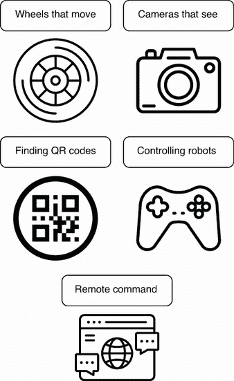
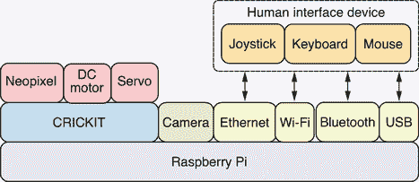
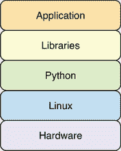

# 1 什么是机器人？

本章涵盖

+   机器人由什么组成

+   为什么机器人有如此大的潜力

+   机器人使用的硬件和软件组件

最近，机器人领域取得了巨大的进步，消费级机器人正越来越多地被工业应用机器人所取代。这些机器人的硬件和软件也变得更加易于获取，因此，现在是学习机器人技术的激动人心时期。本书利用 Python 编程语言的力量，通过采用开源理念的软硬件，将各种机器人项目生动地呈现出来。到本书结束时，你将学会如何构建九个不同的机器人项目。

## 1.1 为什么机器人令人惊叹

计算机以它们创造者几十年前甚至无法想象的方式改变了地球上每一个人的生活。机器人技术赋予那些

计算机是机器的“手臂”和“车轮”，使它们能够移动并完成超出我们想象的事情。在许多方面，机器人是未来。这本书让你从头开始构建机器人，并亲眼看到它们在现实世界中栩栩如生。你编写的代码将使你的电脑四处移动并撞倒你选择的物品。图 1.1 展示了我们可以利用机器人力量的不同方式。

图 1.1 机器人的力量：机器人使用不同的硬件来移动并观察它们周围的世界。

机器人可以做很多事情：

+   *机器人移动。* 它们拥有轮子，并且不畏惧使用它们。这种移动性使得它们能够执行各种任务，从在仓库中运输包裹到在自动驾驶汽车中运输人员。

+   *机器人可以看见*。机器人配备了摄像头和强大的计算机视觉软件，可以看见它们周围的这个世界。它们可以看到我们的脸，检测到它们，并通过使用电机移动摄像头朝向我们进行反应。

+   *机器人可以找到.* 通过在现实世界中的物体上使用二维码贴纸，我们可以派遣我们的机器人去寻找并交互我们选择的物体。机器人使用它们的摄像头和二维码检测软件来找到它们正在寻找的东西，一旦到达目的地，就会执行手头的任务。

+   *机器人可以被控制。* 人类操控的机器人使我们能够完成以前不可能完成的各类工作（例如，在人类难以进入的危险区域操控机器人或进行人类双手难以精确操作的医疗程序）。在这本书中，我们将使用键盘、鼠标和操纵杆控制器，通过电脑屏幕和手机来控制机器人。每种设备都有其优势和权衡，这些将在每种实现中探讨。

+   *机器人可以远程控制。* 我们这个时代最强大的计算机创新之一是 TCP/IP 互联网通信协议。通过使用建立在 TCP 之上的 HTTP 和 SSH，我们将实现与机器人远程通信和控制的不同方式。无论人类操作员是在同一个房间还是数英里之外，这些机器人都将能够被控制。

## 1.2 我们制造机器人的方法

这本书采用了一种非常实用的方法来学习如何构建机器人以及用 Python 编写软件来控制和与之交互。到下一章结束时，你将组装并连接足够的机器人组件，以便编写和运行你的第一个 Python 脚本。这个脚本将读取机载触摸传感器的状态作为输入，并在检测到触摸事件时打开直流电机。每个剩余的章节都以一个完全功能的项目结束，该项目要么直接与机器人交互，要么是本书后面添加更多功能的基石。每个基于项目的章节都将介绍当前的项目，然后引导读者一步一步地构建解决方案。

### 1.2.1 从失败中学习

最直接的方法往往因为处理能力或某种技术的固有局限性而失败。这些情况将被用作学习机会，以了解如何通过使用更复杂的方法或优化实现来克服这些限制，从而在受限的硬件要求下获得主要性能提升。读者将被带入诊断、精确测量和基准测试这些问题和它们相关解决方案的旅程中。读者将能够使用这些技能来预测、诊断和调试他们自己项目中的类似问题。许多这些性能问题和解决方案不仅限于在机器人上工作，还适用于许多不同的计算机视觉、网络和计算项目。

### 1.2.2 你将获得什么？

通过阅读这本书，你将接触到各种硬件和软件挑战。本书中提到的许多 Python 库被广泛使用，并且适用于涉及机器人及其他项目的开发。书中还涵盖了处理硬件和软件问题的多种问题解决技巧，这将有益于读者。

机器人领域是一个非常广泛的领域，具有多种多样的应用。就本书所涵盖的软件和硬件而言，将使用一组特定的硬件和软件。

### 1.2.3 原型设计

使用本书涵盖的硬件和软件，可以完成各种各样的原型设计项目。由于使用的硬件既经济又强大，许多想法可以通过构建原型来测试，以在投入更复杂或昂贵的生产硬件之前测试设计或方法。

### 1.2.4 教学

书中的项目可用于在课堂环境中教授学生，甚至可以用于自学，以获得构建机器人的真实生活经验。无论您是创建一个用于工业用途的小型机器人还是大型机器人，机器人的底层技术都是相同的。通过构建这些机器人，您还将获得与底盘设计、电机和计算机功率需求、电池功率容量、重量以及便携性相关的知识。在小规模上获得的经验对于更大规模或生产型机器人仍然非常适用。

### 1.2.5 生产就绪

关于软件，书中使用的许多软件都可直接适用于大规模生产。例如，Linux、Python 和 Tornado 网络框架等软件被广泛应用于许多关键任务应用中。至于硬件，树莓派被用于许多终端用户产品中，而树莓派计算模块在工业应用中得到了大量使用。

### 1.2.6 局限性

本书所使用的电机在输出功率和容量方面存在固有的硬件限制，这将直接限制可以使用该硬件执行的项目类型。Raspberry Pi 的计算能力也固有限制，因为它被设计成体积小、重量轻且功耗低。

## 1.3 机器人由什么组成？

机器人通常拥有像任何笔记本电脑或台式电脑一样的处理器、内存和存储。但将它们区分开来的是它们的电机和传感器，这使得它们能够做任何普通电脑都无法做到的事情。再加上一些强大的软件，它们将能够完成各种壮举。

### 1.3.1 机器人构建模块

构建本书中使用的硬件和软件的心理模型是非常有价值的。这将帮助你理解我们在操作软件和硬件堆栈的哪个部分。Linux 和 Python 是一个由极其强大的软件模块和库组成的生态系统，这些模块和库经过良好测试，功能多样，并且文档齐全。我们将利用这一点，并结合许多不同的模块来实现我们所需的功能。

### 1.3.2 Raspberry Pi 上的伺服电机和直流电机

直流电机使机器人的轮子转动，并帮助它们四处行驶。无论是沿着不同的方向行驶，还是沿着固定的路径或轨道行驶，都是直流电机使这一切成为可能。*伺服电机*是更复杂的电机，内置传感器允许精确的运动。它们可以被控制转动到特定的角度。机器人的机械臂通常由几个伺服电机组成。书中的项目将深入探讨伺服电机和直流电机，并使用 Python 脚本控制它们执行各种任务。书中的机器人将配备一个小型但功能强大的*单板计算机*（SBC），称为树莓派，它是它们操作的核心。

### 1.3.3 硬件堆栈

图 1.2 展示了本书中不同项目中将使用的不同硬件组件。

图 1.2 硬件堆栈：树莓派是主计算机，而 CRICKIT 负责处理电机。

每个硬件组件的描述如下：

+   *树莓派*—一款集成了 CPU、RAM 以及多个不同输入/输出接口的单板计算机。

+   *CRICKIT*—Adafruit CRICKIT HAT 是为 Raspberry Pi 设计的附加板，它连接到 Pi 的通用输入/输出 (GPIO) 接口。它为伺服电机和直流电机供电和控制。

+   *Neopixel*—CRICKIT HAT 带有一个 RGB LED。其颜色和亮度可以在软件中更改。

+   *直流电机*—多个直流电机可以连接到 CRICKIT HAT。它们将为左右轮提供动力，以驱动机器人。

+   *伺服*—多个伺服电机可以连接到 CRICKIT HAT。它们可以用于伺服电机的相机平移和倾斜。

+   *相机*—树莓派摄像头模块由树莓派基金会创建，用于计算机视觉。

+   *以太网*—千兆以太网端口集成在 Pi 板上，提供高速、低延迟的可靠网络通信。

+   *Wi-Fi*—提供双频段 2.4 GHz 和 5 GHz 无线局域网。

+   *蓝牙*—蓝牙 5.0, BLE

+   *USB*—键盘、鼠标和游戏手柄可以直接使用 USB 连接。

不同的项目将需要不同的硬件组件集合。每一章都将介绍用于特定项目的硬件组件。附录 A 中的硬件购买指南提供了关于项目所需特定产品型号的良好建议，以及在线零售商的详细信息。

### 1.3.4 Python 和 Linux

机器人将在 Linux 操作系统之上运行其软件。Linux 是一个功能丰富且多才多艺的操作系统，它为机器人和超级计算机提供动力。这为书中将使用的一系列成熟且经过充分测试的软件和功能打开了大门——从来自摄像头流的实时视频处理到使用蓝牙协议，通过高度敏感的模拟摇杆控制器无线控制机器人的动作，一切应有尽有。

Python 是一种非常表达性的语言，拥有丰富的成熟且强大的软件库。我们将使用这些库将丰富的功能融入类似机器人的计算机视觉，以及检测和解码二维码的能力，以便机器人能够在其周围环境中搜索并找到特定的二维码标记物体。同时，我们还将使用创建和消费 Web 应用的库，以便机器人可以通过本地或远程网络进行控制。

### 1.3.5 软件栈

图 1.3 展示了本书项目中将使用到的不同软件。

图 1.3 软件栈：Linux 管理硬件并运行 Python 解释器。

机器人软件组件如下：

+   *Linux*—将使用 Raspberry Pi OS Linux 发行版作为操作系统。

+   *Python*—Python 解释器将在 Linux 上作为可执行文件运行并执行机器人 Python 应用程序。

+   *图书馆*—这些是将在机器人项目中使用和集成的各种 Python 库，所有这些库都在 Python 解释器中运行。将使用 Tornado 网络框架来构建控制机器人的网络应用。将使用 OpenCV 计算机视觉库进行人脸检测和二维码解码。将使用 Adafruit CRICKIT 库来控制伺服电机和直流电机。

+   *应用*—本书中驱动机器人项目的代码将在这一级别运行。

## 摘要

+   配备摄像头和强大的计算机视觉软件，机器人能够看到它们周围的这个世界。

+   通过扫描现实世界物体上的二维码贴纸，机器人可以找到并与其环境中的物体进行交互。

+   人类操控的机器人使我们能够完成各种以前不可能完成的任务，无论是这些任务意味着在人类无法进入的危险区域控制机器人，还是进行人类双手无法精确操作的医疗程序。

+   使用诸如 HTTP 和 SSH 这样的互联网协议，我们将实现与控制我们的机器人进行远程通信的不同方式。

+   许多不同类型的原型设计项目可以使用本书涵盖的硬件和软件来执行。

+   本书中的许多 Python 库被广泛使用，并且可以用于涉及机器人及其他项目的开发。

+   机器人通常拥有像任何笔记本电脑或台式电脑一样的处理器、内存和存储器。

+   机器人也经常运行 Linux，这是一个功能丰富且多才多艺的操作系统，它为机器人和超级计算机提供动力。

+   直流电机是使机器人车轮转动并帮助它们行驶的工具。
