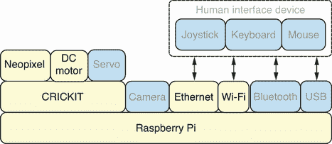
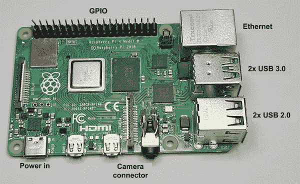
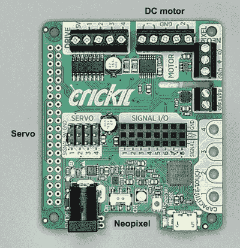
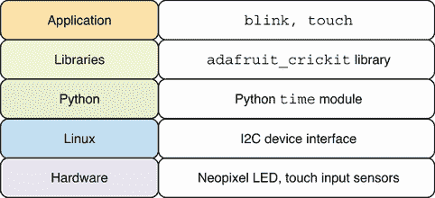
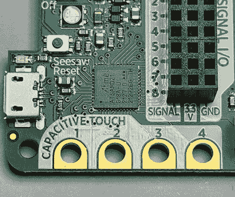
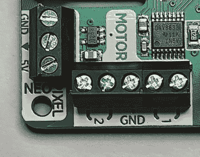
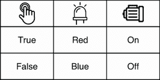

# 2 开始

本章涵盖

+   组装和配置机器人的核心硬件和软件

+   控制 Neopixel 的颜色和亮度

+   从四个板载触摸传感器读取传感器数据

+   使用 Python 控制 DC 电机

+   创建第一个与传感器和电机交互的 Python 机器人程序

在本章中，你将学习如何连接和配置本书中机器人使用的主要硬件和软件组件。一旦硬件和软件设置完成，我们将通过从板载触摸传感器读取传感器数据，直接使用 Python 与硬件交互。然后，你将学习如何控制 Neopixel 灯和 DC 电机。最后，所有这些不同的硬件组件和 Python 脚本将结合在一起，创建一个基于触摸传感器输入控制 Neopixel 和 DC 电机的人工智能程序。

## 2.1 介绍我们的机器人硬件

图 2.1 展示了前一章讨论的硬件堆栈，本章中使用的特定组件以较暗的文本框突出显示。带有灰色文本的组件将在后续章节中使用。



图 2.1 硬件堆栈：Raspberry Pi 将使用以太网和 Wi-Fi 处理网络通信。

Linux 操作系统将安装在 Raspberry Pi 上。以太网和 Wi-Fi 硬件组件将被用于将机器连接到网络，并允许网络上的其他计算机连接到它。然后，CRICKIT HAT 将连接到 Raspberry Pi 并用于控制 Neopixel 和连接的电机。

在购买本章所需的硬件之前，请务必检查附录 A 中的硬件购买指南。附录显示了不同章节所需的硬件，还有一些可选购买的推荐，这些推荐可以改善机器人项目。附录 B 提供了安装和配置 Raspberry Pi 和 Adafruit CRICKIT HAT 的详细说明。还值得注意的是，附录 D 提供了一种模拟机器人硬件的机制，可以在任何笔记本电脑或台式计算机上运行本书中的任何代码。

### 2.1.1 Raspberry Pi

Raspberry Pi 是由 Raspberry Pi 基金会创建的小型单板计算机 ([`raspberrypi.org`](https://raspberrypi.org))。建议使用具有 2 GB 或更多 RAM 的 Raspberry Pi 4 模型。图 2.2 展示了 Raspberry Pi 4 的照片以供参考。这些计算机的以下属性使它们成为机器人项目的理想选择：

+   它们的小尺寸和轻质结构对移动机器人很重要。

+   运行 Linux 和 Python 为在机器人项目上构建强大的软件打开了大门。

+   与 Raspberry Pi 兼容的多功能机器人底盘套件允许不同的板、电机和电池配置。

+   强大的 CPU 和内存使得实时计算机视觉和机器学习等密集型应用成为可能。

+   良好的相机支架使机器人能够看到其环境。

+   它们具有内置和灵活的连接选项，如以太网、Wi-Fi、蓝牙和 USB。

+   通用输入/输出（GPIO）连接器为 Adafruit CRICKIT 所使用的电路板提供了强大的机制，以添加硬件功能。



图 2.2 树莓派：电路板上的主要硬件接口已标注。

### 2.1.2 Adafruit CRICKIT HAT

Adafruit CRICKIT HAT 是 Adafruit Industries 为树莓派创建的硬件扩展板（[`adafruit.com`](https://adafruit.com)；图 2.3）。CRICKIT HAT 连接到树莓 Pi 的 GPIO 连接器，并为本书中的项目提供以下功能：

+   可连接多达两个双向直流电机，供电并控制。

+   可连接多达四个伺服电机，供电并控制。

+   芯片板上集成了四个电容式触摸输入传感器。

+   芯片板上集成了 Neopixel RGB LED。

+   Adafruit Python 库提供 Python 支持，用于控制与电机、电容式触摸和 Neopixel 的交互。



图 2.3 Adafruit CRICKIT HAT：直流电机和伺服电机连接到该电路板。

## 2.2 为我们的机器人配置软件

图 2.4 展示了前一章中提到的软件堆栈。本章中使用的特定软件的详细信息将在下文中描述。



图 2.4 软件堆栈：本章将涵盖 Linux 和 Python 的安装和配置。

安装 Linux 后，Python 将被配置为拥有一个专用的虚拟环境，其中可以安装 Python 库。将安装 Adafruit CRICKIT 库，然后使用它来运行 Python 代码，以与 CRICKIT 硬件组件（如 Neopixel LED 和触摸输入传感器）交互。将使用 Python 的`time`模块来控制不同动作的时间持续时间。在继续本章之前，请确保遵循附录 B 中关于树莓派和 Adafruit CRICKIT HAT 的安装和配置说明。

## 2.3 更改 Neopixel 颜色

CRICKIT 库提供了几种与 Neopixel LED 交互的不同方式。我们可以在 REPL（读取-评估-打印循环）会话中探索这些选项。有关激活 Python 虚拟环境和打开 REPL 会话的帮助，请参阅附录 B。Neopixel 可能非常明亮，因此我们将亮度降低到 1%，然后将颜色设置为蓝色：

```
>>> from adafruit_crickit import crickit
>>> crickit.onboard_pixel.brightness = 0.01
>>> crickit.onboard_pixel.fill(0x0000FF)
```

到目前为止，我们使用 RGB 十六进制颜色代码设置颜色。如果能使用人类可读的颜色名称来设置颜色那就更好了。这种功能在 CRICKIT 库中不是直接可用的，但我们可以创建一个简单的字典来存储和查找常见的颜色名称：

```
>>> RGB = dict(red=0xFF0000, green=0x00FF00, blue=0x0000FF)
>>> crickit.onboard_pixel.fill(RGB['red'])
```

现在我们可以创建一个简单的脚本，不断循环遍历每个颜色名称并设置颜色。此代码将创建一个多色闪烁效果，使用 LED。在每次循环中，脚本将打印出颜色名称，设置颜色，然后在设置下一个颜色之前暂停 0.1 秒。将以下脚本保存到名为`blink.py`的文件中，存放在 Pi 上。

列表 2.1 `blink.py`：使用 LED 创建多色闪烁效果

```
#!/usr/bin/env python3
import time
from adafruit_crickit import crickit

RGB = dict(red=0xFF0000, green=0x00FF00, blue=0x0000FF)

crickit.onboard_pixel.brightness = 0.01
while True:
    for name in RGB:
        print(name)
        crickit.onboard_pixel.fill(RGB[name])
        time.sleep(0.1)
```

可以通过运行命令来赋予文件执行权限

```
$ chmod a+x blink.py
```

然后运行 Python 脚本：

```
$ ./blink.py
```

脚本可以直接执行的原因是第一行使用了 Unix 的一个特性，称为 shebang，它告诉 Linux 该脚本应该通过 Python 解释器`python3`来执行。确保在运行脚本之前激活 Python 虚拟环境，如附录 B 所示。我们可以通过按 Ctrl+C 退出脚本，这将强制脚本退出。在 Pi 上保存脚本时，将其放置在`/home/robo/bin/`目录中，也可以作为`~/bin`访问。这是 Linux 系统上放置用户脚本等的标准位置，本书将遵循这一惯例。《blink.py》文件以及本书中所有项目的代码都可以在 GitHub 上找到（[`github.com/marwano/robo`](https://github.com/marwano/robo)）。

深入了解：I2C 通信协议

CRICKIT HAT 在板上有自己的微控制器，并使用 I2C 通信协议来启用 Raspberry Pi 与其微控制器之间的通信。所有这些都由 Python Adafruit CRICKIT 库处理。I2C 协议非常强大且灵活，是集成电路之间通信的流行选择。SparkFun 网站有一个关于 I2C 的出色指南（[`learn.sparkfun.com/tutorials/i2c`](https://learn.sparkfun.com/tutorials/i2c)）。了解这些底层硬件协议的内部工作原理既有趣又实用。

Adafruit 网站有一个关于在 Python 中使用 I2C 设备进行交互的良好实践指南（[`mng.bz/g7mV`](http://mng.bz/g7mV)）。我们可以使用这个指南在 Pi 上使用 CRICKIT HAT 进行一些基本的 I2C 交互。让我们首先打开一个 REPL 并导入`board`模块：

```
>>> import board
```

现在我们可以创建一个`I2C`对象来扫描 CRICKIT HAT：

```
>>> i2c = board.I2C()
```

现在我们可以扫描 I2C 设备并将结果保存在`devices`中。我们可以从结果中看到找到了一个设备：

```
>>> devices = i2c.scan()
>>> devices
[73]
```

从附录 B 中，我们知道 CRICKIT HAT 的 I2C 地址预期为`0x49`。我们可以通过以下行计算其十六进制值来确认我们找到的设备是 CRICKIT HAT：

```
>>> hex(devices[0])
'0x49'
```

I2C 协议是一种强大的协议，可以在仅两条线上支持多达 1,008 个外围设备。

## 2.4 检查触摸传感器状态

CRICKIT 上有四个电容式触摸输入传感器。图 2.5 显示了它们的特写视图。从 Python 中，每个传感器都可以单独检查，以查看它是否正在检测触摸事件。在不触摸触摸传感器的情况下，在 REPL 会话中运行以下代码：

```
>>> from adafruit_crickit import crickit
>>> crickit.touch_1.value
False
```



图 2.5 电容式触摸传感器：这些传感器可以检测触摸事件。

现在触摸第一个触摸传感器的同时再次运行最后一行：

```
>>> crickit.touch_1.value
True
```

当访问`value`属性时，CRICKIT 库会检查触摸传感器状态，并返回一个布尔值`True`或`False`，这取决于传感器数据。

## 2.5 控制直流电机

将直流电机的两根线连接到直流电机连接器端口 1。图 2.6 显示了这些电机连接在 CRICKIT 上的位置。这两根线可以任意方式连接到 CRICKIT 电机端口；这不会引起任何问题。请确保使用附录 A 中提到的 M/M 扩展跳线，因为这将确保公母端匹配。一旦连接，请在 REPL 会话中运行以下行：

```
>>> from adafruit_crickit import crickit
>>> crickit.dc_motor_1.throttle = 1
```



图 2.6 直流电机连接：直流电机的连接点被拧紧固定。

直流电机现在将以全速运行。要停止电机运行，请使用

```
>>> crickit.dc_motor_1.throttle = 0
```

## 2.6 使用触摸传感器控制电机

我们可以将到目前为止学到的知识结合起来，将这些 CRICKIT 库的不同部分组合起来，制作一个不断检查触摸传感器并根据传感器是否被触摸来启动或停止电机的应用程序。我们还将根据电机是否启动或停止改变 LED 颜色。让我们一步步构建这个应用程序。

首先，我们将导入 CRICKIT 库来控制电机和`time`库来在检查触摸事件之间暂停：

```
import time
from adafruit_crickit import crickit
```

接下来，我们将定义`RGB`，这样我们就可以通过名称设置颜色，并在名为`POLL_DELAY`的设置中保存检查触摸事件之间的等待时间。轮询延迟值设置为 0.1 秒，这足以使触摸传感器和启动电机的体验响应迅速：

```
RGB = dict(red=0xFF0000, green=0x00FF00, blue=0x0000FF)
POLL_DELAY = 0.1
```

在开始程序的主循环之前，我们设置 LED 的亮度：

```
crickit.onboard_pixel.brightness = 0.01
```

程序的其余部分在这个无限循环中运行：

```
while True:
```

在循环的第一行，我们检查传感器是否被触摸，并相应地设置`throttle`变量。在 Python 中，这种语法称为*条件表达式*：

```
throttle = 1 if crickit.touch_1.value else 0
```

我们采用相同的方法，使用`color`变量在电机开启时将 LED 设置为红色，关闭时设置为蓝色：

```
color = RGB['red'] if crickit.touch_1.value else RGB['blue']
```

在计算了`throttle`和`color`值之后，我们将它们应用到电机和 LED 上：

```
crickit.onboard_pixel.fill(color)
crickit.dc_motor_1.throttle = throttle
```

最后，我们在开始下一个循环迭代之前，睡眠`POLL_DELAY`秒：

```
time.sleep(POLL_DELAY)
```

完整的应用程序可以保存为 Pi 上的`touch.py`，然后执行。

列表 2.2 `touch.py`：当触摸传感器被按下时启动电机

```
#!/usr/bin/env python3
import time
from adafruit_crickit import crickit

RGB = dict(red=0xFF0000, green=0x00FF00, blue=0x0000FF)
POLL_DELAY = 0.1

crickit.onboard_pixel.brightness = 0.01
while True:
    throttle = 1 if crickit.touch_1.value else 0
    color = RGB['red'] if crickit.touch_1.value else RGB['blue']
    crickit.onboard_pixel.fill(color)
    crickit.dc_motor_1.throttle = throttle
    time.sleep(POLL_DELAY)
```

当你运行脚本时，你会看到电机最初是不动的，LED 的颜色将是蓝色。如果你按下触摸传感器，LED 的颜色将变为红色，电机将以全速开始移动。如果你停止触摸传感器，LED 将恢复到最初的蓝色，电机将完全停止。图 2.7 将触摸传感器的状态映射到 LED 的颜色和电机的运行状态。



图 2.7 触摸状态图：LED 和电机状态根据触摸事件发生变化。

## 摘要

+   树莓派是由树莓派基金会创建的单板计算机。

+   Adafruit CRICKIT HAT 是 Adafruit Industries 为树莓派创建的硬件附加组件。

+   一旦连接到树莓派，CRICKIT HAT 就可以用来控制 Neopixel 和连接的电机。

+   Adafruit Python CRICKIT 库可以用来运行与 CRICKIT 硬件组件交互的 Python 代码。

+   树莓派 Imager 是一种软件，可以用来准备带有树莓派 OS 镜像的安装介质（microSD 卡/USB 闪存驱动器）。

+   CRICKIT HAT 通过 GPIO 连接器连接到树莓派。

+   在 Python 中可以使用 RGB 十六进制颜色代码更改 Neopixel 颜色。

+   当检查触摸传感器状态时，CRICKIT 库返回一个布尔值，要么是`True`，要么是`False`，这取决于触摸传感器的状态。

+   通过设置节流属性为`1`或`0`，可以开启和关闭直流电机。

+   可以通过使用不断轮询触摸事件并相应地设置电机节流的循环，根据触摸事件开启和关闭连接的电机。
