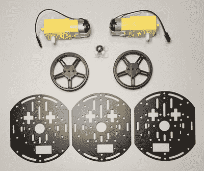
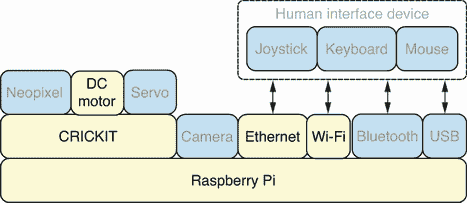
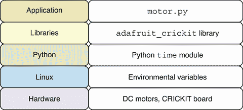
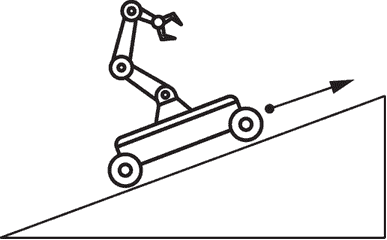
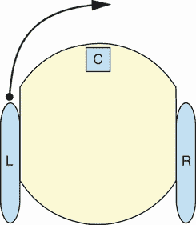
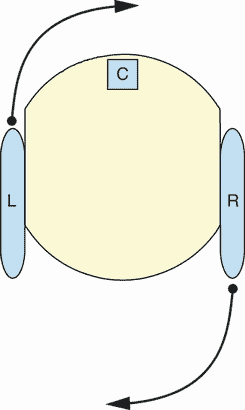

# 3 驱动机器人

本章涵盖

+   控制直流电机使机器人前进和后退

+   实现软件配置的电机功率调整

+   控制机器人左右转动

+   在原地旋转机器人

+   使用`functools`库重构代码

本章将教会你如何使用 Python 代码控制直流电机的功率来使机器人向不同方向移动。机器人的左右轮各有一个专用的电机连接。控制电机可以使一系列动作成为可能。将为每个主要动作操作生成 Python 函数，以创建一组易于使用和阅读的方法来控制机器人的动作。一旦所有这些函数都已实现，将应用一系列重构技术来简化并巩固代码库。

## 3.1 什么是机器人底盘套件？

*机器人底盘套件*是构建移动机器人的好方法。在前一章中，我们看到了树莓派如何为机器人提供计算能力，以及 CRICKIT HAT 附加组件如何控制连接的电机。底盘套件提供了身体、电机和轮子，使你的机器人能够移动。有许多不同的机器人底盘套件可以与树莓派一起使用。本书推荐的一个选择是价格低廉且灵活，让你能够构建许多不同的机器人配置。套件包括以下主要部件：

+   两个直流电机

+   两个轮子

+   一个用作第三轮的万向球

+   使用三个铝制框架和安装硬件构建三层机器人

图 3.1 展示了套件中的主要部件。与双层布局相比，三层提供了更大的空间和灵活性，可以在不同层上安装树莓派和电源硬件。直流电机保持在底层。机器底盘中的这些层可以在附录 C 中找到的机器人组装指南中的图像中看到。有关推荐的底盘套件的更多详细信息，请参阅附录 A 中的硬件购买指南。



图 3.1 底盘套件：套件包含三个铝制框架，用于支撑三层机器人。

## 3.2 硬件堆栈

图 3.2 展示了所讨论的硬件堆栈，以及本章中使用的具体组件被突出显示。随着本书的进展，更多的硬件组件将被纳入机器人项目中。



图 3.2 硬件堆栈：机器人将使用两个直流电机移动。

如前节所述，本章将使用两个直流电机。一个将连接到左轮，另一个将连接到右轮。中心轮将使用一个可以平滑转向任何方向的万向球，且没有连接电机。直流电机将连接到 CRICKIT HAT，它将为它们提供动力和控制。可以使用以太网连接到机器人，但 Wi-Fi 连接提供了机器人无束缚移动的能力。

有关组装和配置机器人硬件的详细信息，请参阅附录 C 中的机器人组装指南。它展示了如何组装本章和其他章节中使用的机器人。

## 3.3 软件栈

本章所使用的特定软件的详细信息如图 3.3 所示，并在随后的文本中进行描述。应用层使用了底层的库和 Python 解释器。Python 解释器在 Linux 上运行，而 Linux 又运行在硬件上。



图 3.3 软件栈：本章将介绍如何使用 Python 控制直流电机。

建立在第二章的知识基础上，我们将继续使用 Python Adafruit CRICKIT 库与直流电机交互。在本章中，我们将使用相同的脚本控制多个直流电机。我们还将学习如何控制电机的方向和速度。在 Linux 级别，我们将使用环境变量，如`ROBO_DC_ADJUST_R`，将配置值传递给我们的 Python 脚本以设置电机功率调整。这样，我们就不必直接将配置值硬编码到我们的 Python 代码中。Python 的`time`模块将用于控制不同运动操作中电机运行的时间。`time`模块是 Python 标准库的一部分，它提供了一个通过`sleep`函数暂停脚本执行的标准机制。最后，我们将把这些部分组合起来，在章节末尾创建`motor.py`脚本和库。

## 3.4 编写向前移动函数

在本节中，我们将学习如何创建一个 Python 函数，当调用该函数时，机器人将向前移动。我们通过同时打开左轮和右轮的直流电机，让它们运行特定的时间，然后停止它们来实现这一点。这将使机器人向前移动并停止。

在处理机器人时，一个重要的安全方面是拥有一个执行紧急停止的机制。CRICKIT HAT 有一个硬件开关可以打开和关闭板子。我们可以使用这个开关作为我们的紧急停止，因为它将切断所有连接电机的电源。它还有一个额外的优点，即我们可以立即重新打开板子并再次启动我们的应用程序，而无需重新启动 Raspberry Pi。

首先，我们将导入 CRICKIT 库来控制电机，以及`time`库来控制移动前进的时间：

```
from adafruit_crickit import crickit
import time
```

接下来，我们将定义 `MOTOR_R` 和 `MOTOR_L`，它们将映射到右侧和左侧电机。在布线机器人时，请确保将右侧直流电机连接到电机连接 1，将左侧直流电机连接到电机连接 2。书中所有的代码都将遵循此约定：

```
MOTOR_R = crickit.dc_motor_1
MOTOR_L = crickit.dc_motor_2
```

然后，我们定义一个名为 `set_throttle` 的辅助函数，它接受两个参数，并将指定电机的节流设置到指定的值：

```
def set_throttle(motor, value):
    motor.throttle = value
```

现在，我们可以定义 `forward` 函数本身，该函数将使机器人向前移动。当被调用时，它首先通过在两个电机上调用 `set_throttle` 将两个电机设置为以 90%的速度向前运行。然后，通过调用 `sleep`，它等待 0.2 秒。最后，再次在两个电机上调用 `set_throttle` 结束移动。这样，调用 `forward` 函数将使机器人向前移动 0.2 秒，然后使其完全停止：

```
def forward():
    set_throttle(MOTOR_R, 0.9)
    set_throttle(MOTOR_L, 0.9)
    time.sleep(0.2)
    set_throttle(MOTOR_R, 0)
    set_throttle(MOTOR_L, 0)
```

完整的脚本可以保存为 `forward.py` 在 Pi 上，然后执行。

列表 3.1 `forward.py`：使用函数使电机向前移动

```
#!/usr/bin/env python3
from adafruit_crickit import crickit
import time

MOTOR_R = crickit.dc_motor_1
MOTOR_L = crickit.dc_motor_2

def set_throttle(motor, value):
    motor.throttle = value

def forward():
    set_throttle(MOTOR_R, 0.9)
    set_throttle(MOTOR_L, 0.9)
    time.sleep(0.2)
    set_throttle(MOTOR_R, 0)
    set_throttle(MOTOR_L, 0)

forward()
```

在运行脚本时，两个电机应向前移动，使整个机器人向前移动。如果其中一个轮子向后移动而不是向前移动，只需切换该直流电机的连接线。直流电机线可以任意连接，翻转连接线也会翻转正节流的方向。本书遵循的约定是正节流导致向前移动，负节流导致向后移动。如果尚未确认车轮方向，请注意不要将您的机器人放在桌子的边缘，因为它可能会向错误的方向行驶并从桌子上掉下来。

警告：电机速度被设置为 90%的强度而不是 100%的全强度。这是出于电力安全原因。使用某些 USB 移动电源为 CRICKIT HAT 供电并快速切换直流电机方向会导致电力中断，并切断 Raspberry Pi 和 CRICKIT HAT 之间的 I2C 连接。90%的强度提供了高水平的节流和良好的安全水平，以防止这些问题。您可以使用更高的值，但提到的值已经过测试，并在实践中是可靠的。

## 3.5 使用环境变量进行配置

经常，某些特定于特定机器或硬件设备的配置值需要由 Python 应用程序设置和读取。一些例子是安全凭证或不应直接硬编码到 Python 脚本中的可配置设置。

在我们的情况下，我们的机器人需要为两个直流电机中的每一个设置一个电源配置。在物理世界设置中，两个电机上的相同油门通常不会使它们以完全相同的速度移动。这是由于物理电机之间微小的差异造成的。因为一个电机通常会旋转得比另一个电机快一点，这会使机器人稍微向左或向右偏移，而不是以完美的直线移动。解决方案是调整两个电机之间的油门设置，使它们以相似的速度旋转。这样，当机器人向前移动时，它将更多地沿着直线行驶。我们将创建两个配置值来调整每个电机的功率。这是一个实用且简单的解决方案，将满足本书中项目的需求。一个更高级的解决方案将需要我们在软件中添加硬件传感器和逻辑，通过考虑传感器数据来不断调整两个电机的功率，以保持机器人直线行驶。

为了解决这个问题，我们实现了一个在 Linux 中使用环境变量设置我们的配置值，然后在 Python 中读取和使用这些值的常用技术。解决方案应满足以下要求：

+   配置值应在 Python 中从一组特定的命名环境变量中读取。

+   配置值应该是可选的，如果环境变量未设置，它们应回退到特定的默认值。

+   所有环境变量都是字符串值。应该执行类型转换，将它们设置为适当的数据类型，例如浮点值。

环境变量可以在终端会话中设置和查看。这可以是一个本地终端会话或通过 SSH 的远程会话。Raspberry Pi OS 上的默认终端或 shell 软件称为 Bash。有关终端使用和软件的更多详细信息，请参阅 Raspberry Pi 文档([`raspberrypi.com/documentation/usage/terminal`](https://raspberrypi.com/documentation/usage/terminal))。

首先，我们将定义环境变量的命名以及它们如何被设置。通常，让所有环境变量以相同的前缀开始是一个好主意。这样，当列出所有现有环境变量时，将很容易找到我们自己的变量。我们将使用前缀 `ROBO_` 为所有变量命名。运行命令 `$` `env`。

执行此命令以设置一个新的环境变量，该变量将调整分配给右侧直流电机的功率。`0.8` 的值将使右侧直流电机的油门降低，并达到正常油门的 80%，以减慢右侧电机的速度。这可能是在你发现你的右侧电机比左侧电机移动得更快时进行的调整，你想减慢它的速度，以便两个电机具有相似的速度：

```
$ export ROBO_DC_ADJUST_R="0.8"
```

再次执行`env`命令时，你应该在输出中看到我们新的变量。我们可以将此命令的输出用作 Bash `|`功能的输入，将输出管道传输到另一个命令，该命令将过滤输出。`grep`命令过滤输出，只显示包含`ROBO_`文本的行。我们可以运行以下命令来过滤`env`命令的输出，并仅列出我们的变量：

```
$ env | grep ROBO_
```

这些值仅在当前的 Bash 会话中可用。如果你打开一个新的会话或重新启动机器，这些值将会丢失。要使环境变量永久，它应该放在你的`.bashrc`文件中。编辑此文件并添加`export`行。现在打开一个新的 Bash 会话并确认值已被设置。

我们现在可以深入到 Python REPL（读取-评估-打印循环）并开始从这些环境变量中读取值。我们将导入`os`模块，然后开始访问这些值：

```
>>> import os
>>> os.environ['ROBO_DC_ADJUST_R']
'0.8'
```

当我们访问一个未设置的值时，将引发`KeyError`异常：

```
>>> os.environ['ROBO_DC_ADJUST_L']
Traceback (most recent call last):
  File "<stdin>", line 1, in <module>
  File "/usr/lib/python3.9/os.py", line 679, in __getitem__
    raise KeyError(key) from None
KeyError: 'ROBO_DC_ADJUST_L'
```

处理可选值的方法是使用`get`方法，当环境变量不存在时提供默认值：

```
>>> os.environ.get('ROBO_DC_ADJUST_L', '1')
'1'
>>> os.environ.get('ROBO_DC_ADJUST_R', '1')
'0.8'
```

现在，我们可以将我们的变量类型转换为`float`：

```
>>> float(os.environ.get('ROBO_DC_ADJUST_R', '1'))
0.8
```

现在我们已经一切就绪，我们可以使用这些新更改升级我们之前实现的`forward`函数。需要注意的是，我们不必设置两个环境变量，因为它们都是可选的。我们将把我们的两个配置值保存到变量中：

```
DC_ADJUST_R = float(os.environ.get('ROBO_DC_ADJUST_R', '1'))
DC_ADJUST_L = float(os.environ.get('ROBO_DC_ADJUST_L', '1'))
```

我们将把我们的功率调整值保存在一个名为`ADJUST`的字典中，以便更容易地访问：

```
ADJUST = dict(R=DC_ADJUST_R, L=DC_ADJUST_L)
```

以类似的方式，我们将通过一个名为`MOTOR`的字典来访问我们的直流电机对象：

```
MOTOR = dict(R=crickit.dc_motor_1, L=crickit.dc_motor_2)
```

`set_throttle`函数的实现现在可以更新为接收电机名称作为字符串，并应用基于`ADJUST`中值的调整后的节流值：

```
def set_throttle(name, value):
    MOTOR[name].throttle = value * ADJUST[name]
```

最后，我们可以更新我们的`forward`函数，使其使用值`'R'`和`'L'`来引用电机：

```
def forward():
    set_throttle('R', 0.9)
    set_throttle('L', 0.9)
    time.sleep(0.2)
    set_throttle('R', 0)
    set_throttle('L', 0)
```

完整脚本可以保存为`envforward.py`在 Pi 上，然后执行。

列表 3.2 `envforward.py`：从环境变量中读取配置值

```
#!/usr/bin/env python3
from adafruit_crickit import crickit
import time
import os

DC_ADJUST_R = float(os.environ.get('ROBO_DC_ADJUST_R', '1'))
DC_ADJUST_L = float(os.environ.get('ROBO_DC_ADJUST_L', '1'))
ADJUST = dict(R=DC_ADJUST_R, L=DC_ADJUST_L)
MOTOR = dict(R=crickit.dc_motor_1, L=crickit.dc_motor_2)

def set_throttle(name, value):
    MOTOR[name].throttle = value * ADJUST[name]

def forward():
    set_throttle('R', 0.9)
    set_throttle('L', 0.9)
    time.sleep(0.2)
    set_throttle('R', 0)
    set_throttle('L', 0)

forward()
```

当脚本运行时，机器人将根据环境配置值中为每个电机定义的特定功率调整来前进。这将允许对每个轮子的功率进行调整，并使其能够以更直的线路行驶。

深入探讨：机器人运动物理学

随着你的机器人项目在具有挑战性的环境中处理更复杂的任务，机器人运动物理学的主题变得越来越重要。例如，如果你的机器人需要在可能有时会滑动的各种表面上行驶，那么可以将牵引控制系统集成到机器人中，以处理这些不同的表面。

另一种场景可能是让机器人驱动一个不平坦但有斜坡的表面。斜坡可能是向上的或向下的。如果斜坡是向上的，我们可能需要给直流电机提供更多的功率，以实现我们在水平表面上相同的速度。另一方面，如果机器人正在向下行驶，那么我们希望减少提供给直流电机的功率，以免速度过快。这种控制是一种标准功能，是许多汽车巡航控制系统中的一部分。同样的系统也可以应用于我们的机器人。我们需要添加传感器来测量我们的速度并相应地调整功率。以下图提供了当机器人在上坡时必须提供给电机的额外功率和力的说明。



在斜坡上驾驶：当向上坡行驶时，需要给电机提供更多的功率。

Allied Motion 提供的关于机器人车辆电动牵引和转向的指南([`mng.bz/ZRoZ`](http://mng.bz/ZRoZ))是关于机器人转向和牵引控制主题的优秀参考资料。涵盖了诸如车轮和操作表面的特性等内容。它还包括了关于如何创建牵引解决方案及其相关权衡的比较。

## 3.6 控制运动的速度和持续时间

在下一个升级中，我们将添加控制机器人前进速度和持续时间的功能。目前，持续时间在`forward`函数中是硬编码的，设置为 0.2 秒。我们将向函数添加一个可选参数，这样它仍然默认为 0.2 秒，但调用函数的代码可以提供其他值。机器人前进的速度可以通过改变提供给电机的油门级别来控制。我们将定义三个速度设置——低、中、高——然后在调用运动函数时指定这些级别之一。

我们将添加可选的`duration`参数来控制电机运行的时间：

```
def forward(duration=0.2):
    set_throttle('R', 0.9)
    set_throttle('L', 0.9)
    time.sleep(duration)
    set_throttle('R', 0)
    set_throttle('L', 0)
```

`THROTTLE_SPEED`字典将把三个速度级别映射到它们相关的油门级别。速度级别 0 用于停止电机：

```
THROTTLE_SPEED = {0: 0, 1: 0.5, 2: 0.7, 3: 0.9}
```

我们现在可以更新我们的`forward`函数来设置期望的速度：

```
def forward(duration=0.2, speed=3):
    set_throttle('R', speed)
    set_throttle('L', speed)
    time.sleep(duration)
    set_throttle('R', 0)
    set_throttle('L', 0)
```

`set_throttle`函数现在也将使用新的`THROTTLE_SPEED`字典：

```
def set_throttle(name, speed):
    MOTOR[name].throttle = THROTTLE_SPEED[speed] * ADJUST[name]
```

完整的脚本可以保存为`speedforward.py`在 Pi 上，然后执行。

列表 3.3 `speedforward.py`：控制向前移动的电机速度

```
#!/usr/bin/env python3
from adafruit_crickit import crickit
import time
import os

DC_ADJUST_R = float(os.environ.get('ROBO_DC_ADJUST_R', '1'))
DC_ADJUST_L = float(os.environ.get('ROBO_DC_ADJUST_L', '1'))
ADJUST = dict(R=DC_ADJUST_R, L=DC_ADJUST_L)
MOTOR = dict(R=crickit.dc_motor_1, L=crickit.dc_motor_2)
THROTTLE_SPEED = {0: 0, 1: 0.5, 2: 0.7, 3: 0.9}

def set_throttle(name, speed):
    MOTOR[name].throttle = THROTTLE_SPEED[speed] * ADJUST[name]

def forward(duration=0.2, speed=3):
    set_throttle('R', speed)
    set_throttle('L', speed)
    time.sleep(duration)
    set_throttle('R', 0)
    set_throttle('L', 0)

print('move forward for 0.5 seconds')
forward(duration=0.5)

for speed in [1, 2, 3]:
    print('move forward at speed:', speed)
    forward(speed=speed)
```

脚本对`forward`函数进行了一些函数调用，以展示新的功能。它将使机器人以自定义的半秒持续时间移动。然后它将以三个速度级别中的每一个将机器人向前移动。一旦对`forward`函数的最后一个调用完成，机器人将停止移动，因为函数通过停止两个电机来结束。

## 3.7 向后移动

现在我们已经实现了一个向前移动的函数，接下来我们将继续实现使机器人向后移动的函数。这些是我们需要实现的主要移动函数，以实现完整的运动范围。

首先，我们将通过添加一个`factor`参数来增强`set_throttle`函数。这个参数将用于控制油门是具有正值以驱动电机向前移动还是具有负值以驱动电机向后移动：

```
def set_throttle(name, speed, factor=1):
    MOTOR[name].throttle = THROTTLE_SPEED[speed] * ADJUST[name] * factor
```

接下来，我们需要实现新的`backward`函数。它与`forward`函数非常相似，主要区别在于`factor`参数的值：

```
def backward(duration=0.2, speed=3):
    set_throttle('R', speed, factor=-1)
    set_throttle('L', speed, factor=-1)
    time.sleep(duration)
    set_throttle('R', 0)
    set_throttle('L', 0)
```

完整的脚本可以保存为`backward.py`在 Pi 上，然后执行。

列表 3.4 `backward.py`：使电机向后移动

```
#!/usr/bin/env python3
from adafruit_crickit import crickit
import time
import os

DC_ADJUST_R = float(os.environ.get('ROBO_DC_ADJUST_R', '1'))
DC_ADJUST_L = float(os.environ.get('ROBO_DC_ADJUST_L', '1'))
ADJUST = dict(R=DC_ADJUST_R, L=DC_ADJUST_L)
MOTOR = dict(R=crickit.dc_motor_1, L=crickit.dc_motor_2)
THROTTLE_SPEED = {0: 0, 1: 0.5, 2: 0.7, 3: 0.9}

def set_throttle(name, speed, factor=1):
    MOTOR[name].throttle = THROTTLE_SPEED[speed] * ADJUST[name] * factor

def forward(duration=0.2, speed=3):
    set_throttle('R', speed)
    set_throttle('L', speed)
    time.sleep(duration)
    set_throttle('R', 0)
    set_throttle('L', 0)

def backward(duration=0.2, speed=3):
    set_throttle('R', speed, factor=-1)
    set_throttle('L', speed, factor=-1)
    time.sleep(duration)
    set_throttle('R', 0)
    set_throttle('L', 0)

for i in range(3):
    forward()
    time.sleep(1)
    backward()
    time.sleep(1)
```

脚本通过使机器人向前和向后移动三次来演示新函数的使用。

## 3.8 向右转

向右转需要向左右电机提供不同的油门级别。为了更好地理解作用中的力，我们可以查看图 3.4 中的轮子布局。左右轮子上有连接的电机，可以施加不同级别的油门。中心轮子是一个万向球，可以在任何方向上自由移动。该图显示，为了向右转，我们应该向左轮电机施加更强的油门。这将使左轮转得更快，从而将机器人向右转。



图 3.4 轮子布局：左轮更强的油门会使机器人向右转。

现在我们已经拥有了实现使机器人向右移动的函数所需的一切。

新的`right`函数与之前的一些函数有相似之处。本质上，我们是在向前移动的同时向右转。这是通过给左轮提供两倍的油门来实现的：

```
def right(duration=0.2, speed=3):
    set_throttle('R', speed, factor=0.5)
    set_throttle('L', speed)
    time.sleep(duration)
    set_throttle('R', 0)
    set_throttle('L', 0)
```

完整的脚本可以保存为`right.py`在 Pi 上，然后执行。

列表 3.5 `right.py`：使机器人向右转

```
#!/usr/bin/env python3
from adafruit_crickit import crickit
import time
import os

DC_ADJUST_R = float(os.environ.get('ROBO_DC_ADJUST_R', '1'))
DC_ADJUST_L = float(os.environ.get('ROBO_DC_ADJUST_L', '1'))
ADJUST = dict(R=DC_ADJUST_R, L=DC_ADJUST_L)
MOTOR = dict(R=crickit.dc_motor_1, L=crickit.dc_motor_2)
THROTTLE_SPEED = {0: 0, 1: 0.5, 2: 0.7, 3: 0.9}

def set_throttle(name, speed, factor=1):
    MOTOR[name].throttle = THROTTLE_SPEED[speed] * ADJUST[name] * factor

def forward(duration=0.2, speed=3):
    set_throttle('R', speed)
    set_throttle('L', speed)
    time.sleep(duration)
    set_throttle('R', 0)
    set_throttle('L', 0)

def backward(duration=0.2, speed=3):
    set_throttle('R', speed, factor=-1)
    set_throttle('L', speed, factor=-1)
    time.sleep(duration)
    set_throttle('R', 0)
    set_throttle('L', 0)

def right(duration=0.2, speed=3):
    set_throttle('R', speed, factor=0.5)
    set_throttle('L', speed)
    time.sleep(duration)
    set_throttle('R', 0)
    set_throttle('L', 0)

right(1)
```

脚本调用`right`函数使机器人向右转 1 秒。

## 3.9 向左移动和任意方向旋转

我们现在可以实施一套完整的函数，以执行机器人所需的所有移动。以下是我们的函数集需要满足的要求：

+   创建一组 Python 函数，使机器人能够向前、向后、向右和向左移动，以及向右和向左旋转。

+   这些函数中的每一个都应该允许我们设置移动操作的时间和速度。

我们已经编写了完成我们的函数集所需的大部分内容。现在我们可以实现剩余的三个移动函数。图 3.5 显示了为了使机器人向右旋转，需要在每个电机上施加的油门方向。



图 3.5 旋转：需要在左右电机上施加油门，使机器人旋转。

新的 `left` 函数基本上与 `right` 函数相同，只是更强的油门被放在右轮上，这样机器人就会向左转：

```
def left(duration=0.2, speed=3):
    set_throttle('R', speed)
    set_throttle('L', speed, factor=0.5)
    time.sleep(duration)
    set_throttle('R', 0)
    set_throttle('L', 0)
```

`spin_right` 函数将通过让轮子以全速相反方向转动，使机器人原地旋转。右轮将向后旋转，左轮将向前旋转，使机器人顺时针旋转：

```
def spin_right(duration=0.2, speed=3):
    set_throttle('R', speed, factor=-1)
    set_throttle('L', speed, factor=1)
    time.sleep(duration)
    set_throttle('R', 0)
    set_throttle('L', 0)
```

`spin_left` 函数将使机器人旋转，但这次是逆时针方向：

```
def spin_left(duration=0.2, speed=3):
    set_throttle('R', speed, factor=1)
    set_throttle('L', speed, factor=-1)
    time.sleep(duration)
    set_throttle('R', 0)
    set_throttle('L', 0)
```

完整脚本可以保存为 Pi 上的 `fullmotor.py` 并执行。

列表 3.6 `fullmotor.py`: 创建函数以执行所有支持的机器人运动

```
#!/usr/bin/env python3
from adafruit_crickit import crickit
import time
import os

DC_ADJUST_R = float(os.environ.get('ROBO_DC_ADJUST_R', '1'))
DC_ADJUST_L = float(os.environ.get('ROBO_DC_ADJUST_L', '1'))
ADJUST = dict(R=DC_ADJUST_R, L=DC_ADJUST_L)
MOTOR = dict(R=crickit.dc_motor_1, L=crickit.dc_motor_2)
THROTTLE_SPEED = {0: 0, 1: 0.5, 2: 0.7, 3: 0.9}

def set_throttle(name, speed, factor=1):
    MOTOR[name].throttle = THROTTLE_SPEED[speed] * ADJUST[name] * factor

def forward(duration=0.2, speed=3):
    set_throttle('R', speed)
    set_throttle('L', speed)
    time.sleep(duration)
    set_throttle('R', 0)
    set_throttle('L', 0)

def backward(duration=0.2, speed=3):
    set_throttle('R', speed, factor=-1)
    set_throttle('L', speed, factor=-1)
    time.sleep(duration)
    set_throttle('R', 0)
    set_throttle('L', 0)

def right(duration=0.2, speed=3):
    set_throttle('R', speed, factor=0.5)
    set_throttle('L', speed)
    time.sleep(duration)
    set_throttle('R', 0)
    set_throttle('L', 0)

def left(duration=0.2, speed=3):
    set_throttle('R', speed)
    set_throttle('L', speed, factor=0.5)
    time.sleep(duration)
    set_throttle('R', 0)
    set_throttle('L', 0)

def spin_right(duration=0.2, speed=3):
    set_throttle('R', speed, factor=-1)
    set_throttle('L', speed, factor=1)
    time.sleep(duration)
    set_throttle('R', 0)
    set_throttle('L', 0)

def spin_left(duration=0.2, speed=3):
    set_throttle('R', speed, factor=1)
    set_throttle('L', speed, factor=-1)
    time.sleep(duration)
    set_throttle('R', 0)
    set_throttle('L', 0)

if __name__ == "__main__":
    left(1)
    spin_right(0.5)
    spin_left(0.5)
```

脚本现在已实现了所有运动函数。甚至可以将其作为 Python 模块导入并用于其他 Python 脚本。当脚本直接运行时，它将使机器人向左转然后向右和左旋转。然而，如果模块被导入作为库使用，则不会执行这些演示运动。这是通过检查 `__name__` 变量的值来实现的，以检测 Python 代码是直接运行还是作为库导入。

## 3.10 通过查找共同逻辑进行重构

代码重构是改变或简化应用程序内部实现的过程，而不改变其外部行为。在我们的情况下，我们想要简化 `motor` 库的实现，而不改变任何函数的名称或它们接收的参数。我们将通过创建一个更简单、更易读、更易于维护的库版本来实现这一点。

代码重构的一种方法是在不同的函数之间寻找相似或共享的逻辑，然后将这种逻辑集中在一个函数中，以避免重复。我们可以看到我们的运动函数都共享一个非常相似的结构，即设置左右电机的油门，暂停一段时间，然后停止两个电机的油门。让我们创建一个集中化的函数来实现这个功能，然后让其他函数调用这个主要集中化的函数。

集中化的 `movement` 函数必须像其他函数一样接受 `duration` 和 `speed` 参数，但它还接收左右电机的系数值，因为这些值在不同的函数中会有所不同。使用这种实现，它应该满足我们已实现的所有函数的需求：

```
def movement(duration=0.2, speed=3, factor_r=1, factor_l=1):
    set_throttle('R', speed, factor_r)
    set_throttle('L', speed, factor_l)
    time.sleep(duration)
    set_throttle('R', 0)
    set_throttle('L', 0)
```

我们现在可以从新的 `forward` 函数中调用 `movement` 函数。实现非常简单，基本上是原样传递所有参数。我们可以实施一系列类似的更改，将所有旧函数迁移到使用新方法：

```
def forward(duration=0.2, speed=3):
    movement(duration, speed)
```

完整脚本可以保存为 Pi 上的 `commonmotor.py` 并导入。

列表 3.7 `commonmotor.py`: 将共同逻辑合并到公共函数中

```
#!/usr/bin/env python3
from adafruit_crickit import crickit
import time
import os

DC_ADJUST_R = float(os.environ.get('ROBO_DC_ADJUST_R', '1'))
DC_ADJUST_L = float(os.environ.get('ROBO_DC_ADJUST_L', '1'))
ADJUST = dict(R=DC_ADJUST_R, L=DC_ADJUST_L)
MOTOR = dict(R=crickit.dc_motor_1, L=crickit.dc_motor_2)
THROTTLE_SPEED = {0: 0, 1: 0.5, 2: 0.7, 3: 0.9}

def set_throttle(name, speed, factor=1):
    MOTOR[name].throttle = THROTTLE_SPEED[speed] * ADJUST[name] * factor

def movement(duration=0.2, speed=3, factor_r=1, factor_l=1):
    set_throttle('R', speed, factor_r)
    set_throttle('L', speed, factor_l)
    time.sleep(duration)
    set_throttle('R', 0)
    set_throttle('L', 0)

def forward(duration=0.2, speed=3):
    movement(duration, speed)

def backward(duration=0.2, speed=3):
    movement(duration, speed, factor_r=-1, factor_l=-1)

def right(duration=0.2, speed=3):
    movement(duration, speed, factor_r=0.5)

def left(duration=0.2, speed=3):
    movement(duration, speed, factor_l=0.5)

def spin_right(duration=0.2, speed=3):
    movement(duration, speed, factor_r=-1, factor_l=1)

def spin_left(duration=0.2, speed=3):
    movement(duration, speed, factor_r=1, factor_l=-1)
```

每个函数的实现现在都变得更加简单。这将使代码的可维护性大大提高，因为所有实际的工作都是由`set_throttle`和`movement`函数完成的。它也更容易阅读，因为每个调用本质上只是更改`movement`函数调用的一些参数。

深入探讨：代码重构

代码重构的过程是软件开发的重要部分。敏捷联盟（[`www.agilealliance.org/glossary/refactoring`](https://www.agilealliance.org/glossary/refactoring)）对重构是什么以及其一些好处有一个很好的定义。当我们首次实现一个软件组件时，我们的目标通常只是让事情工作。一旦它开始工作，代码库将随着我们向软件添加更多功能而自然增长。重构是我们花时间后退一步，不添加任何新功能，而是考虑清理或简化我们的代码库的方法。

清洁的代码库的一个好处是提高了可维护性。从长远来看，拥有一个更清洁的代码库将为我们节省大量时间，因为代码变得更加易于管理。它可以通过使查找和修复错误变得更加容易来使软件更加可靠。

与重构相关的一个重要概念是“不要重复自己”（DRY）的设计原则。当我们将 DRY 原则应用于我们的代码时，我们希望避免代码和逻辑中的重复。在第 3.10 节中，我们发现了重复的逻辑，并通过将其集成到一个公共函数中减少了这种重复。许多高质量的框架和库在他们的软件设计中应用了 DRY 哲学，以支持创建避免重复的项目。Python Django Web 框架是这一点的良好例子，其文档（[`docs.djangoproject.com`](https://docs.djangoproject.com)）有一个专门介绍其设计哲学的页面。它提到了 DRY 和其他创建更清洁代码库的设计原则。

## 3.11 使用 functools 进行重构

`functools`模块是 Python 标准库的一部分，它提供了关于可调用对象和函数的几个不同功能。具体来说，我们将使用`partial`来简化我们定义函数的方式，这对于一个函数本质上非常类似于对另一个函数的调用的场景来说是一个完美的工具，正如我们的情况。

`partial`的工作方式是，它接受一些现有的函数作为其第一个参数，以及一组位置参数和关键字参数。然后它返回一个新的函数，该函数将使用提供的参数调用原始函数。我们可以用它来简化我们的函数定义。有关`partial`和使用`partial`创建的示例函数的更多详细信息，请参阅 Python 文档（[`docs.python.org/3/library/functools.html`](https://docs.python.org/3/library/functools.html)）中的`functools`模块。

我们首先从`functools`模块导入`partial`：

```
from functools import partial
```

`forward` 函数的新定义现在基本上是一个直接调用 `movement`，因为它具有直接映射到 `forward` 函数默认值的默认值：

```
forward = partial(movement)
```

在 `backward` 的情况下，对 `movement` 参数的唯一更改是将左右电机都设置为反向转动：

```
backward = partial(movement, factor_r=-1, factor_l=-1)
```

我们继续对 `right` 和 `left` 进行处理，它们使用所有默认值，除了将左右电机速度降低以使机器人转向：

```
right = partial(movement, factor_r=0.5)
left = partial(movement, factor_l=0.5)
```

`spin_right` 和 `spin_left` 是通过类似的方法创建的：

```
spin_right = partial(movement, factor_r=-1, factor_l=1)
spin_left = partial(movement, factor_r=1, factor_l=-1)
```

我们还添加了一个 `noop` 函数，它将帮助我们在后面的章节中进行性能测试：

```
noop = lambda: None
```

完整的脚本可以保存为 `motor.py` 并在 Pi 上导入。

列表 3.8 `motor.py`: 简化函数定义的方式

```
#!/usr/bin/env python3
from adafruit_crickit import crickit
import time
import os
from functools import partial

DC_ADJUST_R = float(os.environ.get('ROBO_DC_ADJUST_R', '1'))
DC_ADJUST_L = float(os.environ.get('ROBO_DC_ADJUST_L', '1'))
ADJUST = dict(R=DC_ADJUST_R, L=DC_ADJUST_L)
MOTOR = dict(R=crickit.dc_motor_1, L=crickit.dc_motor_2)
THROTTLE_SPEED = {0: 0, 1: 0.5, 2: 0.7, 3: 0.9}

def set_throttle(name, speed, factor=1):
    MOTOR[name].throttle = THROTTLE_SPEED[speed] * ADJUST[name] * factor

def movement(duration=0.2, speed=3, factor_r=1, factor_l=1):
    set_throttle('R', speed, factor_r)
    set_throttle('L', speed, factor_l)
    time.sleep(duration)
    set_throttle('R', 0)
    set_throttle('L', 0)

forward = partial(movement)
backward = partial(movement, factor_r=-1, factor_l=-1)
right = partial(movement, factor_r=0.5)
left = partial(movement, factor_l=0.5)
spin_right = partial(movement, factor_r=-1, factor_l=1)
spin_left = partial(movement, factor_r=1, factor_l=-1)
noop = lambda: None
```

我们可以通过在相同路径中启动 Python REPL 会话来测试我们的 `motor` 库的最终版本。在以下会话中，机器人向前和向后移动。然后它向右转半秒，然后以最低速度向左转。接下来，它向右旋转一秒，向左旋转两秒。最后的调用将不会执行任何操作，但应该成功执行且无错误：

```
>>> import motor
>>> motor.forward()
>>> motor.backward()
>>> motor.right(0.5)
>>> motor.left(speed=1)
>>> motor.spin_right(1)
>>> motor.spin_left(2)
>>> motor.noop()
```

您可以将此库导入各种应用程序并调用不同的运动函数来创建许多不同的项目。您可以编写一个程序，该程序响应用户输入以使机器人向不同方向移动。或者，您可以编程机器人以正确的向前和转向动作在障碍赛中驾驶，以免撞到任何物体。

深入探讨：库的力量

编写一个独立的程序和编写一个为许多不同软件提供功能的库是两回事。本章早期脚本是一些独立的脚本，可以执行以移动机器人。它们在可执行的操作方面有限，但是一个很好的起点。随着我们构建功能，我们能够将它们全部打包成一个库。随着我们在书中创建不同的项目，我们通常会导入本章的 `motor` 库并使用其功能。

设计良好的库可以提供一系列可重用的功能，我们可以轻松地将它们集成到自己的程序中。我们可以通过构建在他人伟大作品的基础上，或者，正如艾萨克·牛顿所说，“站在巨人的肩膀上”，将它们结合起来创建各种强大而复杂的应用程序。在这本书中，我们将使用我们创建的库以及一套丰富的开源 Python 库，这些库我们可以轻松安装并集成到我们的机器人项目中。

## 摘要

+   机器人底盘套件是构建移动机器人的灵活且经济的方式。

+   右轮和左轮各自配备有专用的直流电机。

+   在 Linux 中，可以使用环境变量将配置值传递给 Python 脚本，然后可以使用这些值来配置电机功率调整。

+   可以通过检测缺失的环境变量并设置默认值以备不时之需，使配置值成为可选的。

+   通过同时开启左、右直流电机，可以实现机器人的前进运动。

+   机器人的速度可以通过改变直流电机的油门级别来控制。

+   通过反转两个直流电机的油门方向，可以实现后退运动。

+   要使机器人向右转，我们需要对左轮电机施加比右轮电机更强的油门。

+   要使机器人旋转，我们需要在相反方向上对两个电机施加油门。

+   代码重构可以简化应用程序的实现方式，而不会改变库中函数的调用方式。

+   使用 `partial` 可以使创建函数变得更快、更简单。
